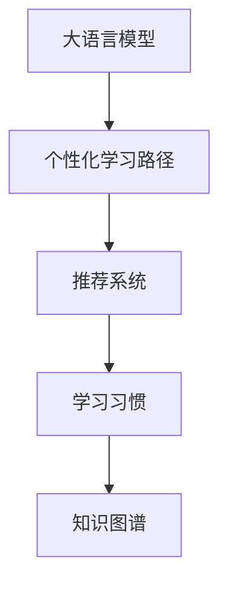

                 

# 个性化学习路径：LLM在教育系统中的应用

> 关键词：个性化学习路径, 大语言模型, 教育系统, 推荐系统, 学习习惯, 知识图谱, 自适应学习

## 1. 背景介绍

### 1.1 问题由来

随着教育技术的快速发展和普及，个性化学习路径（Personalized Learning Pathways）已成为现代教育的重要趋势。个性化学习通过分析学生的学习行为和成绩，为其推荐最适合的课程、资料和教学方式，从而提升学习效果。而大语言模型（Large Language Models, LLMs），如GPT-3、BERT等，由于其强大的自然语言理解和生成能力，正在成为构建个性化学习路径的关键技术之一。

当前，传统的教育推荐系统多基于规则、统计等方法，难以充分理解复杂的学习场景，且缺乏个性化的精确推荐。而大语言模型可以处理自然语言数据，理解学生的学习需求和偏好，从而提供更为精准的个性化学习路径。因此，本文旨在探讨大语言模型在教育系统中的应用，介绍其原理、方法及其实际效果，为教育技术的发展提供新思路。

### 1.2 问题核心关键点

本文聚焦于大语言模型在教育系统中的应用，通过分析学生的学习数据，生成个性化学习路径。具体来说，大语言模型将学生的学习行为（如浏览历史、成绩、反馈等）作为输入，输出推荐的学习路径、课程、资料等信息，帮助学生高效学习。该过程包括：

1. **学生数据采集**：收集学生的学习行为数据，如浏览历史、成绩、反馈等。
2. **模型输入处理**：将采集到的数据转换为模型可以接受的格式。
3. **模型推理**：使用大语言模型对输入数据进行推理，生成推荐结果。
4. **路径生成**：根据模型输出，生成个性化的学习路径。
5. **路径调整**：根据学生反馈，动态调整学习路径。

本文将重点介绍大语言模型在教育系统中的核心算法原理，并给出具体的实现步骤和案例分析，以期为教育技术的实际应用提供参考。

## 2. 核心概念与联系

### 2.1 核心概念概述

为更好地理解大语言模型在教育系统中的应用，本节将介绍几个密切相关的核心概念：

- **大语言模型(Large Language Model, LLM)**：以自回归(如GPT)或自编码(如BERT)模型为代表的大规模预训练语言模型。通过在大规模无标签文本语料上进行预训练，学习通用的语言知识和常识，具备强大的语言理解和生成能力。

- **个性化学习路径(PLP, Personalized Learning Pathways)**：根据学生的学习需求和进度，动态生成个性化的学习资源和路径，提高学习效率和效果。

- **推荐系统(Recommender System)**：通过算法推荐用户可能感兴趣的内容，广泛应用于电商、新闻、社交媒体等领域，也正在被引入教育系统。

- **学习习惯(Learning Habit)**：学生在学习过程中表现出的偏好、频率、持久性等特征，通过数据挖掘可以发现学生的学习模式。

- **知识图谱(Knowledge Graph)**：以结构化方式描述知识体系和实体之间的关系，有助于学生进行知识关联学习和理解。

这些概念之间的逻辑关系可以通过以下Mermaid流程图来展示：



这个流程图展示了大语言模型在教育系统中的应用核心概念及其之间的关系：

1. 大语言模型通过预训练获得语言理解能力。
2. 个性化学习路径根据模型输出生成个性化学习资源和路径。
3. 推荐系统在大语言模型的基础上，推荐具体的内容和路径。
4. 学习习惯和知识图谱为个性化学习路径提供了更多的数据支撑。

## 3. 核心算法原理 & 具体操作步骤
### 3.1 算法原理概述

大语言模型在教育系统中的应用，主要是基于监督学习（Supervised Learning）的推荐系统范式。其核心思想是：通过收集和分析学生的学习行为数据，将大语言模型作为推荐引擎，为学生推荐最适合的学习资源和路径。

形式化地，假设学生的学习行为数据为 $D=\{(x_i, y_i)\}_{i=1}^N$，其中 $x_i$ 为学生学习行为，$y_i$ 为推荐的学习路径或课程。则目标是通过训练一个推荐模型 $M_{\theta}$，最小化预测错误：

$$
\theta^* = \mathop{\arg\min}_{\theta} \sum_{i=1}^N \ell(M_{\theta}(x_i), y_i)
$$

其中 $\ell$ 为损失函数，衡量模型输出与真实标签之间的差异。常见的损失函数包括交叉熵损失、均方误差损失等。

### 3.2 算法步骤详解

大语言模型在教育系统中的应用，一般包括以下几个关键步骤：

**Step 1: 数据采集和预处理**
- 收集学生的学习行为数据，如浏览历史、成绩、反馈等。
- 将数据进行清洗和标准化处理，去除噪音和异常值。

**Step 2: 数据特征工程**
- 提取学生的学习习惯、知识图谱等特征，用于增强模型的推荐效果。
- 将学习路径、课程等标签数据转化为模型可以接受的格式。

**Step 3: 模型训练和评估**
- 选择合适的优化算法及其参数，如Adam、SGD等，设置学习率、批大小、迭代轮数等。
- 设置正则化技术及强度，包括L2正则、Dropout、Early Stopping等。
- 使用标注数据训练推荐模型 $M_{\theta}$，最小化损失函数。
- 在验证集上评估模型性能，根据性能指标决定是否触发Early Stopping。

**Step 4: 路径生成**
- 将学生当前的学习行为输入推荐模型 $M_{\theta}$，生成推荐的学习路径或课程。
- 根据模型的输出，生成个性化的学习路径。

**Step 5: 路径调整**
- 收集学生对推荐路径的反馈，动态调整推荐模型。
- 根据学生反馈，调整模型参数和超参数，优化推荐结果。

以上是基于监督学习的大语言模型在教育系统中的应用的一般流程。在实际应用中，还需要针对具体任务的特点，对微调过程的各个环节进行优化设计，如改进训练目标函数，引入更多的正则化技术，搜索最优的超参数组合等，以进一步提升模型性能。

### 3.3 算法优缺点

基于监督学习的大语言模型在教育系统中的应用，具有以下优点：

1. **简单高效**：只需准备少量标注数据，即可对大语言模型进行快速适配，获得较大的性能提升。
2. **通用适用**：适用于各种学习场景，如在线教育、混合学习等，设计简单的学习路径生成器即可实现。
3. **参数高效**：利用参数高效微调技术，在固定大部分预训练参数的情况下，仍可取得不错的推荐效果。
4. **效果显著**：在学术界和工业界的诸多学习推荐场景上，基于大语言模型的方法已经刷新了最先进的性能指标。

同时，该方法也存在一定的局限性：

1. **依赖标注数据**：推荐系统的效果很大程度上取决于标注数据的质量和数量，获取高质量标注数据的成本较高。
2. **迁移能力有限**：当推荐任务与大语言模型的预训练数据分布差异较大时，推荐的效果提升有限。
3. **可解释性不足**：推荐系统的决策过程通常缺乏可解释性，难以对其推理逻辑进行分析和调试。
4. **负面效果传递**：大语言模型的固有偏见、有害信息等，可能通过推荐系统传递到学生，造成负面影响。

尽管存在这些局限性，但就目前而言，基于监督学习的推荐方法仍是大语言模型在教育系统中的主流范式。未来相关研究的重点在于如何进一步降低推荐对标注数据的依赖，提高模型的少样本学习和跨领域迁移能力，同时兼顾可解释性和伦理安全性等因素。

### 3.4 算法应用领域

大语言模型在教育系统中的应用，主要集中在以下领域：

- **个性化学习路径生成**：根据学生的学习行为，生成个性化的学习路径，推荐相应的课程和资料。
- **智能辅导系统**：通过分析学生的学习情况，实时生成个性化习题和解释，帮助学生巩固知识。
- **作业批改系统**：自动批改学生的作业，并提供详细的反馈和解释，提升教师效率和学生学习效果。
- **知识图谱推荐**：结合知识图谱，为学生推荐相关的知识点和习题，帮助学生进行知识关联学习。

除了上述这些经典应用外，大语言模型还被创新性地应用到更多场景中，如智能推荐图书馆资源、智能写作辅助、智能虚拟教师等，为教育技术带来了全新的突破。随着预训练模型和推荐方法的不断进步，相信教育技术将在更广阔的应用领域大放异彩。

## 4. 数学模型和公式 & 详细讲解 & 举例说明

### 4.1 数学模型构建

本节将使用数学语言对基于监督学习的大语言模型在教育系统中的应用过程进行更加严格的刻画。

记学生的学习行为数据为 $D=\{(x_i, y_i)\}_{i=1}^N$，其中 $x_i$ 为学生学习行为，$y_i$ 为推荐的学习路径或课程。定义推荐模型 $M_{\theta}$ 在数据样本 $(x,y)$ 上的损失函数为 $\ell(M_{\theta}(x),y)$，则在数据集 $D$ 上的经验风险为：

$$
\mathcal{L}(\theta) = \frac{1}{N} \sum_{i=1}^N \ell(M_{\theta}(x_i),y_i)
$$

在实践中，我们通常使用基于梯度的优化算法（如SGD、Adam等）来近似求解上述最优化问题。设 $\eta$ 为学习率，$\lambda$ 为正则化系数，则参数的更新公式为：

$$
\theta \leftarrow \theta - \eta \nabla_{\theta}\mathcal{L}(\theta) - \eta\lambda\theta
$$

其中 $\nabla_{\theta}\mathcal{L}(\theta)$ 为损失函数对参数 $\theta$ 的梯度，可通过反向传播算法高效计算。

### 4.2 公式推导过程

以下我们以学习路径生成为例，推导交叉熵损失函数及其梯度的计算公式。

假设推荐模型 $M_{\theta}$ 在学生学习行为 $x$ 上的输出为 $\hat{y}=M_{\theta}(x) \in [0,1]$，表示学生是否会选择该学习路径的概率。真实标签 $y \in \{0,1\}$。则二分类交叉熵损失函数定义为：

$$
\ell(M_{\theta}(x),y) = -[y\log \hat{y} + (1-y)\log (1-\hat{y})]
$$

将其代入经验风险公式，得：

$$
\mathcal{L}(\theta) = -\frac{1}{N}\sum_{i=1}^N [y_i\log M_{\theta}(x_i)+(1-y_i)\log(1-M_{\theta}(x_i))]
$$

根据链式法则，损失函数对参数 $\theta_k$ 的梯度为：

$$
\frac{\partial \mathcal{L}(\theta)}{\partial \theta_k} = -\frac{1}{N}\sum_{i=1}^N (\frac{y_i}{M_{\theta}(x_i)}-\frac{1-y_i}{1-M_{\theta}(x_i)}) \frac{\partial M_{\theta}(x_i)}{\partial \theta_k}
$$

其中 $\frac{\partial M_{\theta}(x_i)}{\partial \theta_k}$ 可进一步递归展开，利用自动微分技术完成计算。

在得到损失函数的梯度后，即可带入参数更新公式，完成模型的迭代优化。重复上述过程直至收敛，最终得到适应学习路径生成任务的最优模型参数 $\theta^*$。

## 5. 项目实践：代码实例和详细解释说明
### 5.1 开发环境搭建

在进行教育推荐系统开发前，我们需要准备好开发环境。以下是使用Python进行PyTorch开发的环境配置流程：

1. 安装Anaconda：从官网下载并安装Anaconda，用于创建独立的Python环境。

2. 创建并激活虚拟环境：
```bash
conda create -n pytorch-env python=3.8 
conda activate pytorch-env
```

3. 安装PyTorch：根据CUDA版本，从官网获取对应的安装命令。例如：
```bash
conda install pytorch torchvision torchaudio cudatoolkit=11.1 -c pytorch -c conda-forge
```

4. 安装Transformers库：
```bash
pip install transformers
```

5. 安装各类工具包：
```bash
pip install numpy pandas scikit-learn matplotlib tqdm jupyter notebook ipython
```

完成上述步骤后，即可在`pytorch-env`环境中开始推荐系统开发。

### 5.2 源代码详细实现

下面我们以学习路径推荐为例，给出使用Transformers库对BERT模型进行推荐系统开发的PyTorch代码实现。

首先，定义推荐系统的数据处理函数：

```python
from transformers import BertTokenizer
from torch.utils.data import Dataset
import torch

class LearningPathDataset(Dataset):
    def __init__(self, learning_paths, student_profile, tokenizer, max_len=128):
        self.learning_paths = learning_paths
        self.student_profile = student_profile
        self.tokenizer = tokenizer
        self.max_len = max_len
        
    def __len__(self):
        return len(self.learning_paths)
    
    def __getitem__(self, item):
        learning_path = self.learning_paths[item]
        student_profile = self.student_profile[item]
        
        # 对学生学习路径进行编码
        encoding = self.tokenizer(learning_path, return_tensors='pt', max_length=self.max_len, padding='max_length', truncation=True)
        input_ids = encoding['input_ids'][0]
        attention_mask = encoding['attention_mask'][0]
        
        # 对学生档案进行编码
        encoding = self.tokenizer(student_profile, return_tensors='pt', max_length=self.max_len, padding='max_length', truncation=True)
        input_ids = encoding['input_ids'][0]
        attention_mask = encoding['attention_mask'][0]
        
        # 对标签进行编码
        encoded_labels = [1 if 'recommended' in path else 0 for path in learning_path] 
        encoded_labels.extend([0] * (self.max_len - len(encoded_labels)))
        labels = torch.tensor(encoded_labels, dtype=torch.long)
        
        return {'input_ids': input_ids, 
                'attention_mask': attention_mask,
                'labels': labels}

# 创建dataset
tokenizer = BertTokenizer.from_pretrained('bert-base-cased')

train_dataset = LearningPathDataset(train_learning_paths, train_student_profiles, tokenizer)
dev_dataset = LearningPathDataset(dev_learning_paths, dev_student_profiles, tokenizer)
test_dataset = LearningPathDataset(test_learning_paths, test_student_profiles, tokenizer)
```

然后，定义模型和优化器：

```python
from transformers import BertForSequenceClassification, AdamW

model = BertForSequenceClassification.from_pretrained('bert-base-cased', num_labels=2)

optimizer = AdamW(model.parameters(), lr=2e-5)
```

接着，定义训练和评估函数：

```python
from torch.utils.data import DataLoader
from tqdm import tqdm
from sklearn.metrics import classification_report

device = torch.device('cuda') if torch.cuda.is_available() else torch.device('cpu')
model.to(device)

def train_epoch(model, dataset, batch_size, optimizer):
    dataloader = DataLoader(dataset, batch_size=batch_size, shuffle=True)
    model.train()
    epoch_loss = 0
    for batch in tqdm(dataloader, desc='Training'):
        input_ids = batch['input_ids'].to(device)
        attention_mask = batch['attention_mask'].to(device)
        labels = batch['labels'].to(device)
        model.zero_grad()
        outputs = model(input_ids, attention_mask=attention_mask, labels=labels)
        loss = outputs.loss
        epoch_loss += loss.item()
        loss.backward()
        optimizer.step()
    return epoch_loss / len(dataloader)

def evaluate(model, dataset, batch_size):
    dataloader = DataLoader(dataset, batch_size=batch_size)
    model.eval()
    preds, labels = [], []
    with torch.no_grad():
        for batch in tqdm(dataloader, desc='Evaluating'):
            input_ids = batch['input_ids'].to(device)
            attention_mask = batch['attention_mask'].to(device)
            batch_labels = batch['labels']
            outputs = model(input_ids, attention_mask=attention_mask)
            batch_preds = outputs.logits.argmax(dim=2).to('cpu').tolist()
            batch_labels = batch_labels.to('cpu').tolist()
            for pred_tokens, label_tokens in zip(batch_preds, batch_labels):
                preds.append(pred_tokens[:len(label_tokens)])
                labels.append(label_tokens)
                
    print(classification_report(labels, preds))
```

最后，启动训练流程并在测试集上评估：

```python
epochs = 5
batch_size = 16

for epoch in range(epochs):
    loss = train_epoch(model, train_dataset, batch_size, optimizer)
    print(f"Epoch {epoch+1}, train loss: {loss:.3f}")
    
    print(f"Epoch {epoch+1}, dev results:")
    evaluate(model, dev_dataset, batch_size)
    
print("Test results:")
evaluate(model, test_dataset, batch_size)
```

以上就是使用PyTorch对BERT进行学习路径推荐任务的完整代码实现。可以看到，得益于Transformers库的强大封装，我们可以用相对简洁的代码完成BERT模型的加载和推荐系统开发。

### 5.3 代码解读与分析

让我们再详细解读一下关键代码的实现细节：

**LearningPathDataset类**：
- `__init__`方法：初始化学习路径和学生档案等关键组件。
- `__len__`方法：返回数据集的样本数量。
- `__getitem__`方法：对单个样本进行处理，将学习路径和学生档案输入编码为token ids，并对其进行定长padding，最终返回模型所需的输入。

**tokenizer方法**：
- 定义了BERT分词器的初始化方法，用于将文本输入转换为token ids。

**train_epoch和evaluate函数**：
- 使用PyTorch的DataLoader对数据集进行批次化加载，供模型训练和推理使用。
- 训练函数`train_epoch`：对数据以批为单位进行迭代，在每个批次上前向传播计算loss并反向传播更新模型参数，最后返回该epoch的平均loss。
- 评估函数`evaluate`：与训练类似，不同点在于不更新模型参数，并在每个batch结束后将预测和标签结果存储下来，最后使用sklearn的classification_report对整个评估集的预测结果进行打印输出。

**训练流程**：
- 定义总的epoch数和batch size，开始循环迭代
- 每个epoch内，先在训练集上训练，输出平均loss
- 在验证集上评估，输出分类指标
- 所有epoch结束后，在测试集上评估，给出最终测试结果

可以看到，PyTorch配合Transformers库使得BERT推荐系统的代码实现变得简洁高效。开发者可以将更多精力放在数据处理、模型改进等高层逻辑上，而不必过多关注底层的实现细节。

当然，工业级的系统实现还需考虑更多因素，如模型的保存和部署、超参数的自动搜索、更灵活的任务适配层等。但核心的推荐范式基本与此类似。

## 6. 实际应用场景
### 6.1 个性化学习路径生成

个性化学习路径生成是教育推荐系统的重要应用之一。传统教育推荐系统多依赖静态课程安排，难以满足学生的个性化需求。而使用大语言模型，可以根据学生的学习行为和成绩，动态生成个性化的学习路径。

具体而言，可以收集学生在学习平台上的浏览历史、作业成绩、反馈等数据，结合知识图谱等外部知识，利用大语言模型生成推荐的学习路径和课程。该模型可以实时学习学生的学习情况，根据学生的学习进度和偏好动态调整推荐结果，帮助学生高效学习。

### 6.2 智能辅导系统

智能辅导系统通过分析学生的学习数据，实时生成个性化习题和解释，帮助学生巩固知识。大语言模型可以理解学生的学习需求和疑问，根据问题生成相应的回答，甚至可以提供详细的解题思路和代码解释。

在实现上，可以通过将学生的学习数据输入大语言模型，生成推荐的问题和答案。根据模型的输出，生成个性化的习题和解释，辅助学生进行学习。同时，利用知识图谱等外部知识，增强推荐的准确性和全面性。

### 6.3 作业批改系统

作业批改系统是教育推荐系统的另一重要应用。传统作业批改系统依赖于人工评阅，效率低下且主观性强。而使用大语言模型，可以实现自动化批改和反馈，提高教师效率和学生学习效果。

在实现上，可以收集学生的作业提交和评分数据，输入大语言模型，生成推荐的问题和答案。根据模型的输出，生成个性化的批改结果和反馈意见，帮助学生改进学习。同时，利用知识图谱等外部知识，增强批改的准确性和全面性。

### 6.4 未来应用展望

随着大语言模型和推荐方法的不断进步，基于微调范式将在更多领域得到应用，为教育技术的发展提供新思路。

在智慧教育领域，基于大语言模型的个性化学习路径、智能辅导系统、作业批改系统等，将显著提升教育系统的智能化水平，构建更加灵活、高效的学习环境。

在智慧校园管理中，大语言模型可以应用于课程推荐、教师评估、学生管理等环节，提高校园管理的自动化和智能化水平，构建更安全、高效的教育生态。

此外，在企业培训、在线教育、终身学习等更多场景中，基于大语言模型的推荐系统也将不断涌现，为知识传播和技能提升提供新途径。相信随着技术的日益成熟，大语言模型推荐系统必将在教育技术中扮演越来越重要的角色。

## 7. 工具和资源推荐
### 7.1 学习资源推荐

为了帮助开发者系统掌握大语言模型在教育系统中的应用，这里推荐一些优质的学习资源：

1. 《Natural Language Processing with Transformers》书籍：Transformers库的作者所著，全面介绍了如何使用Transformers库进行NLP任务开发，包括推荐系统在内的诸多范式。

2. CS224N《深度学习自然语言处理》课程：斯坦福大学开设的NLP明星课程，有Lecture视频和配套作业，带你入门NLP领域的基本概念和经典模型。

3. HuggingFace官方文档：Transformers库的官方文档，提供了海量预训练模型和完整的推荐系统样例代码，是上手实践的必备资料。

4. Weights & Biases：模型训练的实验跟踪工具，可以记录和可视化模型训练过程中的各项指标，方便对比和调优。与主流深度学习框架无缝集成。

5. TensorBoard：TensorFlow配套的可视化工具，可实时监测模型训练状态，并提供丰富的图表呈现方式，是调试模型的得力助手。

通过对这些资源的学习实践，相信你一定能够快速掌握大语言模型在教育系统中的应用精髓，并用于解决实际的NLP问题。

### 7.2 开发工具推荐

高效的开发离不开优秀的工具支持。以下是几款用于大语言模型推荐系统开发的常用工具：

1. PyTorch：基于Python的开源深度学习框架，灵活动态的计算图，适合快速迭代研究。大部分预训练语言模型都有PyTorch版本的实现。

2. TensorFlow：由Google主导开发的开源深度学习框架，生产部署方便，适合大规模工程应用。同样有丰富的预训练语言模型资源。

3. Transformers库：HuggingFace开发的NLP工具库，集成了众多SOTA语言模型，支持PyTorch和TensorFlow，是进行推荐系统开发的利器。

4. Weights & Biases：模型训练的实验跟踪工具，可以记录和可视化模型训练过程中的各项指标，方便对比和调优。与主流深度学习框架无缝集成。

5. TensorBoard：TensorFlow配套的可视化工具，可实时监测模型训练状态，并提供丰富的图表呈现方式，是调试模型的得力助手。

6. Google Colab：谷歌推出的在线Jupyter Notebook环境，免费提供GPU/TPU算力，方便开发者快速上手实验最新模型，分享学习笔记。

合理利用这些工具，可以显著提升大语言模型推荐系统的开发效率，加快创新迭代的步伐。

### 7.3 相关论文推荐

大语言模型和推荐技术的发展源于学界的持续研究。以下是几篇奠基性的相关论文，推荐阅读：

1. Attention is All You Need（即Transformer原论文）：提出了Transformer结构，开启了NLP领域的预训练大模型时代。

2. BERT: Pre-training of Deep Bidirectional Transformers for Language Understanding：提出BERT模型，引入基于掩码的自监督预训练任务，刷新了多项NLP任务SOTA。

3. Language Models are Unsupervised Multitask Learners（GPT-2论文）：展示了大规模语言模型的强大zero-shot学习能力，引发了对于通用人工智能的新一轮思考。

4. Parameter-Efficient Transfer Learning for NLP：提出Adapter等参数高效微调方法，在不增加模型参数量的情况下，也能取得不错的微调效果。

5. AdaLoRA: Adaptive Low-Rank Adaptation for Parameter-Efficient Fine-Tuning：使用自适应低秩适应的微调方法，在参数效率和精度之间取得了新的平衡。

这些论文代表了大语言模型推荐系统的发展脉络。通过学习这些前沿成果，可以帮助研究者把握学科前进方向，激发更多的创新灵感。

## 8. 总结：未来发展趋势与挑战

### 8.1 总结

本文对基于监督学习的大语言模型在教育系统中的应用进行了全面系统的介绍。首先阐述了大语言模型和推荐系统的研究背景和意义，明确了推荐系统在个性化学习路径生成、智能辅导系统、作业批改系统等教育场景中的重要价值。其次，从原理到实践，详细讲解了推荐模型的数学原理和关键步骤，给出了推荐系统开发和优化的完整代码实例。同时，本文还广泛探讨了大语言模型在教育系统中的应用场景，展示了其广阔的想象空间。

通过本文的系统梳理，可以看到，基于大语言模型的推荐系统正在成为教育技术的重要范式，极大地拓展了教育技术的应用边界，催生了更多的落地场景。受益于大规模语料的预训练，推荐系统在教育场景中能够更精准、高效地服务学生，促进个性化学习路径的实现。未来，伴随预训练语言模型和推荐方法的不断进步，相信教育技术将在更广阔的应用领域大放异彩。

### 8.2 未来发展趋势

展望未来，大语言模型在教育系统中的应用将呈现以下几个发展趋势：

1. **深度集成知识图谱**：大语言模型与知识图谱的深度融合，将使推荐系统能够更好地理解知识结构，生成更加精准、全面的个性化学习路径。

2. **跨模态推荐系统**：将视觉、语音、文本等多模态信息结合，构建更加全面、动态的教育推荐系统。

3. **在线实时学习推荐**：基于实时学习数据，动态调整推荐模型，提供更加个性化的实时学习建议。

4. **自适应学习路径**：根据学生的学习反馈和进度，动态调整推荐路径，提高学习效果。

5. **多主体协同推荐**：结合教师、家长、同学等多主体反馈，提升推荐系统的准确性和可靠性。

6. **泛化性增强**：通过引入更多数据源和多样化数据，提升推荐模型的泛化能力，避免过拟合。

以上趋势凸显了大语言模型在教育系统中的广阔前景。这些方向的探索发展，必将进一步提升教育系统的智能化水平，为个性化学习提供更全面、高效的服务。

### 8.3 面临的挑战

尽管大语言模型在教育系统中的应用已经取得了一定的进展，但在迈向更加智能化、普适化应用的过程中，它仍面临着诸多挑战：

1. **数据隐私保护**：学生的学习数据涉及个人隐私，如何在保证数据隐私和安全的前提下，进行有效的推荐，是一个重要问题。

2. **公平性问题**：推荐系统可能存在偏见，对不同学生群体产生不公平的影响。如何设计公平、无偏差的推荐模型，是未来研究的重要方向。

3. **多领域适配性**：教育推荐系统需要适应不同教育阶段和学科，如何设计通用的推荐框架，应对多领域的需求，是当前的一个挑战。

4. **推荐效果稳定性**：推荐系统的推荐效果受多种因素影响，如何提高模型的稳定性和可靠性，避免误导性推荐，是一个关键问题。

5. **模型的可解释性**：推荐系统的决策过程通常缺乏可解释性，难以对其推理逻辑进行分析和调试。如何赋予推荐模型更强的可解释性，将是亟待攻克的难题。

6. **智能与自主性**：如何在推荐系统中加入更多自主学习策略，帮助学生自我规划学习路径，提升自主学习能力。

这些挑战需要研究者在算法、数据、伦理等多个维度协同发力，才能构建安全、可靠、高效的教育推荐系统，真正实现个性化学习的目标。

### 8.4 研究展望

面对大语言模型在教育系统中的挑战，未来的研究需要在以下几个方面寻求新的突破：

1. **数据隐私保护技术**：研究更高效、更安全的数据隐私保护技术，如差分隐私、联邦学习等，保护学生数据隐私。

2. **公平性优化算法**：设计公平、无偏差的推荐算法，确保推荐模型对不同学生群体的公平性。

3. **多领域推荐模型**：构建通用的推荐框架，应对不同教育阶段和学科的需求，提高推荐系统的适用性。

4. **推荐效果稳定性**：研究更鲁棒、更稳定的推荐算法，提高模型的抗干扰能力和泛化能力。

5. **可解释性增强**：研究可解释的推荐模型，增强推荐过程的透明性和可信度。

6. **自主学习策略**：引入更多自主学习策略，帮助学生自我规划学习路径，提升自主学习能力。

这些研究方向将推动大语言模型在教育系统中的深入应用，为个性化学习的实现提供更多可能性。相信随着技术的不断进步，大语言模型将在教育领域发挥更大的作用，推动教育技术的持续创新和发展。

## 9. 附录：常见问题与解答

**Q1：大语言模型在教育推荐系统中面临哪些挑战？**

A: 大语言模型在教育推荐系统中面临以下主要挑战：

1. **数据隐私保护**：学生的学习数据涉及个人隐私，如何在保证数据隐私和安全的前提下，进行有效的推荐，是一个重要问题。

2. **公平性问题**：推荐系统可能存在偏见，对不同学生群体产生不公平的影响。如何设计公平、无偏差的推荐模型，是未来研究的重要方向。

3. **多领域适配性**：教育推荐系统需要适应不同教育阶段和学科，如何设计通用的推荐框架，应对多领域的需求，是当前的一个挑战。

4. **推荐效果稳定性**：推荐系统的推荐效果受多种因素影响，如何提高模型的稳定性和可靠性，避免误导性推荐，是一个关键问题。

5. **模型的可解释性**：推荐系统的决策过程通常缺乏可解释性，难以对其推理逻辑进行分析和调试。如何赋予推荐模型更强的可解释性，将是亟待攻克的难题。

6. **智能与自主性**：如何在推荐系统中加入更多自主学习策略，帮助学生自我规划学习路径，提升自主学习能力。

**Q2：如何设计公平、无偏差的推荐模型？**

A: 设计公平、无偏差的推荐模型，可以从以下几个方面入手：

1. **数据集平衡**：确保训练数据集对不同学生群体的代表性，避免数据集偏见。

2. **特征选择**：选择不带有歧视性的特征，避免特征选择偏见。

3. **算法公平性**：设计公平性算法，如重新加权、调整阈值等，避免算法偏见。

4. **模型解释**：提高模型的可解释性，增强透明度，便于发现和纠正偏见。

5. **多主体反馈**：结合教师、家长、同学等多主体反馈，提高推荐的公平性和可靠性。

6. **公平性评估**：建立公平性评估指标，定期评估推荐模型的公平性，并根据评估结果进行优化。

**Q3：大语言模型在教育推荐系统中如何保护数据隐私？**

A: 大语言模型在教育推荐系统中保护数据隐私，可以从以下几个方面入手：

1. **差分隐私**：通过添加噪声，保护个体数据隐私，同时保证统计分析的准确性。

2. **联邦学习**：在分布式环境中，各节点本地训练模型，然后交换模型参数更新，避免数据集中存储。

3. **匿名化处理**：对学生数据进行匿名化处理，保护个人隐私。

4. **数据加密**：对数据进行加密存储和传输，防止数据泄露。

5. **访问控制**：对数据访问进行严格控制，确保只有授权人员才能访问数据。

6. **隐私审计**：定期进行隐私审计，确保数据保护措施的有效性。

通过以上措施，可以有效地保护学生数据隐私，确保教育推荐系统的安全性和可靠性。

---

作者：禅与计算机程序设计艺术 / Zen and the Art of Computer Programming

