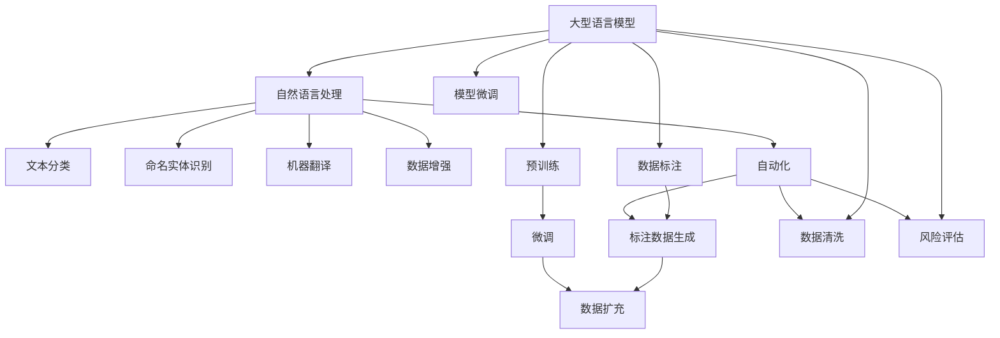

                 

# 临床试验和 LLM：提高效率和安全性

> 关键词：
- 临床试验(Clinical Trials)
- 大型语言模型(Large Language Model, LLM)
- 自然语言处理(Natural Language Processing, NLP)
- 数据增强(Data Augmentation)
- 自动化(Automation)
- 安全性(Security)
- 药物研发(Pharmaceutical Development)

## 1. 背景介绍

### 1.1 问题由来
临床试验是药物研发中最重要的环节之一，其目的是在人体内验证药物的安全性和有效性。然而，传统的临床试验面临诸多挑战：

- 试验周期长，从临床前研究到上市需要数年时间。
- 成本高昂，动辄耗资数十亿美元。
- 试验流程复杂，涉及多个阶段和参与者。
- 数据复杂多样，统计分析难度大。

近年来，随着人工智能技术的快速发展，特别是在自然语言处理(NLP)领域，基于大型语言模型(LLM)的自动化技术为临床试验带来了新的契机。通过LLM技术，临床试验的各个环节可以实现自动化，提高效率和安全性。

### 1.2 问题核心关键点
本节将重点探讨如何利用大型语言模型(LLM)提升临床试验的效率和安全性。

## 2. 核心概念与联系

### 2.1 核心概念概述

为更好地理解LLM在临床试验中的应用，本节将介绍几个密切相关的核心概念：

- **大型语言模型(Large Language Model, LLM)**：以自回归(如GPT)或自编码(如BERT)模型为代表的大规模预训练语言模型。通过在大规模无标签文本语料上进行预训练，学习通用的语言表示，具备强大的语言理解和生成能力。

- **自然语言处理(Natural Language Processing, NLP)**：涉及计算机对自然语言进行理解、生成和处理的技术。NLP广泛应用于文本分类、情感分析、命名实体识别、机器翻译等多个领域。

- **数据增强(Data Augmentation)**：通过各种技术手段扩充数据集，以增强模型的泛化能力和鲁棒性。常见的数据增强技术包括文本回译、近义词替换、随机截断等。

- **自动化(Automation)**：指将原本需要人工参与的任务自动化，通过算法、工具和系统，减少人力投入，提高工作效率。

- **安全性(Security)**：确保临床试验过程中数据和系统的安全，防止数据泄露、篡改、滥用等风险。

这些核心概念之间的逻辑关系可以通过以下Mermaid流程图来展示：



这个流程图展示了大语言模型在临床试验中的应用框架：

1. 大型语言模型通过预训练学习通用语言表示。
2. 在自然语言处理框架下，将语言模型用于文本分类、命名实体识别、机器翻译等任务。
3. 通过数据增强技术扩充训练集，提高模型泛化能力。
4. 自动化技术用于文本分类、命名实体识别、数据清洗等任务，减少人工干预。
5. 风险评估系统通过自然语言处理技术识别潜在风险，保障数据安全。

这些概念共同构成了LLM在临床试验中的基础框架，使其能够高效、安全地执行各种任务。

## 3. 核心算法原理 & 具体操作步骤
### 3.1 算法原理概述

基于大型语言模型(LLM)的临床试验自动化，本质上是一个通过语言模型理解和处理自然语言数据的过程。其核心思想是：将临床试验中的文本数据作为模型输入，通过预训练模型进行文本分类、命名实体识别、数据清洗等任务，辅助自动化流程的实现。

具体而言，假设预训练模型为 $M_{\theta}$，其中 $\theta$ 为预训练得到的模型参数。给定临床试验文本数据集 $D=\{(x_i, y_i)\}_{i=1}^N$，其中 $x_i$ 为文本，$y_i$ 为文本所属的类别（如病种、疗效、安全性等）。自动化的核心任务是构建模型 $M_{\theta}$，使得其能够对新的临床试验文本进行自动分类和处理，满足特定任务的需求。

### 3.2 算法步骤详解

基于LLM的临床试验自动化通常包括以下几个关键步骤：

**Step 1: 准备预训练模型和数据集**
- 选择合适的预训练语言模型 $M_{\theta}$ 作为初始化参数，如 GPT、BERT 等。
- 准备临床试验文本数据集 $D$，包括试验方案、患者记录、研究报告等文本，并划分为训练集、验证集和测试集。

**Step 2: 添加任务适配层**
- 根据任务类型，在预训练模型顶层设计合适的输出层和损失函数。例如，对于文本分类任务，通常在顶层添加线性分类器和交叉熵损失函数。
- 对于命名实体识别任务，需要设计IOB标签分类器，并对模型输出进行后处理，标记出实体边界和类型。

**Step 3: 设置微调超参数**
- 选择合适的优化算法及其参数，如 Adam、SGD 等，设置学习率、批大小、迭代轮数等。
- 设置正则化技术及强度，包括权重衰减、Dropout、Early Stopping 等。
- 确定冻结预训练参数的策略，如仅微调顶层，或全部参数都参与微调。

**Step 4: 执行梯度训练**
- 将训练集数据分批次输入模型，前向传播计算损失函数。
- 反向传播计算参数梯度，根据设定的优化算法和学习率更新模型参数。
- 周期性在验证集上评估模型性能，根据性能指标决定是否触发 Early Stopping。
- 重复上述步骤直到满足预设的迭代轮数或 Early Stopping 条件。

**Step 5: 测试和部署**
- 在测试集上评估自动化系统性能，对比微调前后的精度提升。
- 使用微调后的模型对新样本进行推理预测，集成到实际的应用系统中。
- 持续收集新的数据，定期重新微调模型，以适应数据分布的变化。

以上是基于大型语言模型微调的临床试验自动化的基本流程。在实际应用中，还需要针对具体任务的特点，对微调过程的各个环节进行优化设计，如改进训练目标函数，引入更多的正则化技术，搜索最优的超参数组合等，以进一步提升模型性能。

### 3.3 算法优缺点

基于大型语言模型的临床试验自动化方法具有以下优点：
1. 简单高效。只需准备少量标注数据，即可对预训练模型进行快速适配，获得较大的性能提升。
2. 通用适用。适用于各种文本数据，包括病历记录、研究报告、试验方案等。
3. 自动化程度高。可以实现自动分类、命名实体识别、数据清洗等任务，减少人工参与。
4. 效果显著。在学术界和工业界的诸多任务上，基于微调的方法已经刷新了多项NLP任务SOTA。

同时，该方法也存在一定的局限性：
1. 依赖标注数据。自动化的效果很大程度上取决于标注数据的质量和数量，获取高质量标注数据的成本较高。
2. 迁移能力有限。当目标任务与预训练数据的分布差异较大时，自动化的性能提升有限。
3. 负面效果传递。预训练模型的固有偏见、有害信息等，可能通过自动化传递到下游任务，造成负面影响。
4. 可解释性不足。自动化系统的决策过程通常缺乏可解释性，难以对其推理逻辑进行分析和调试。

尽管存在这些局限性，但就目前而言，基于大型语言模型的自动化方法仍是一种高效、可靠的临床试验数据处理方式。未来相关研究的重点在于如何进一步降低自动化对标注数据的依赖，提高模型的少样本学习和跨领域迁移能力，同时兼顾可解释性和伦理安全性等因素。

### 3.4 算法应用领域

基于大型语言模型的自动化方法，已经在临床试验的多个环节得到了应用，例如：

- **文本分类**：将临床试验文本分类为不同的试验阶段、病种等。通过预训练语言模型进行自动分类，提高试验数据的管理效率。
- **命名实体识别**：从试验文本中识别出病人信息、试验药物、不良反应等实体。通过预训练语言模型进行命名实体识别，规范试验数据的标注。
- **数据清洗**：去除试验数据中的噪声和不相关内容。通过预训练语言模型进行文本清洗，确保数据质量。
- **风险评估**：通过分析试验文本中的风险描述，评估试验的潜在风险和安全性。
- **患者招募**：自动筛选符合试验要求的患者，提高试验招募的效率和精准度。

除了上述这些经典应用外，大型语言模型自动化技术还在药物研发、医学研究、医疗管理等多个领域得到了应用，为临床试验提供了新的解决方案，提升了试验的效率和安全性。

## 4. 数学模型和公式 & 详细讲解 & 举例说明
### 4.1 数学模型构建

本节将使用数学语言对基于大型语言模型的临床试验自动化过程进行更加严格的刻画。

假设预训练语言模型为 $M_{\theta}$，其中 $\theta$ 为模型参数。给定临床试验文本数据集 $D=\{(x_i, y_i)\}_{i=1}^N$，其中 $x_i$ 为文本，$y_i$ 为文本所属的类别。

定义模型 $M_{\theta}$ 在输入 $x_i$ 上的损失函数为 $\ell(M_{\theta}(x_i),y_i)$，则在数据集 $D$ 上的经验风险为：

$$
\mathcal{L}(\theta) = \frac{1}{N} \sum_{i=1}^N \ell(M_{\theta}(x_i),y_i)
$$

微调的优化目标是最小化经验风险，即找到最优参数：

$$
\theta^* = \mathop{\arg\min}_{\theta} \mathcal{L}(\theta)
$$

在实践中，我们通常使用基于梯度的优化算法（如SGD、Adam等）来近似求解上述最优化问题。设 $\eta$ 为学习率，$\lambda$ 为正则化系数，则参数的更新公式为：

$$
\theta \leftarrow \theta - \eta \nabla_{\theta}\mathcal{L}(\theta) - \eta\lambda\theta
$$

其中 $\nabla_{\theta}\mathcal{L}(\theta)$ 为损失函数对参数 $\theta$ 的梯度，可通过反向传播算法高效计算。

### 4.2 公式推导过程

以下我们以文本分类任务为例，推导交叉熵损失函数及其梯度的计算公式。

假设模型 $M_{\theta}$ 在输入 $x_i$ 上的输出为 $\hat{y}=M_{\theta}(x_i)$，表示模型预测的文本分类结果。真实标签 $y_i \in \{1,2,...,C\}$，其中 $C$ 为分类数。则二分类交叉熵损失函数定义为：

$$
\ell(M_{\theta}(x_i),y_i) = -[y_i\log \hat{y} + (1-y_i)\log (1-\hat{y})]
$$

将其代入经验风险公式，得：

$$
\mathcal{L}(\theta) = -\frac{1}{N}\sum_{i=1}^N [y_i\log M_{\theta}(x_i)+(1-y_i)\log(1-M_{\theta}(x_i))]
$$

根据链式法则，损失函数对参数 $\theta_k$ 的梯度为：

$$
\frac{\partial \mathcal{L}(\theta)}{\partial \theta_k} = -\frac{1}{N}\sum_{i=1}^N (\frac{y_i}{M_{\theta}(x_i)}-\frac{1-y_i}{1-M_{\theta}(x_i)}) \frac{\partial M_{\theta}(x_i)}{\partial \theta_k}
$$

其中 $\frac{\partial M_{\theta}(x_i)}{\partial \theta_k}$ 可进一步递归展开，利用自动微分技术完成计算。

在得到损失函数的梯度后，即可带入参数更新公式，完成模型的迭代优化。重复上述过程直至收敛，最终得到适应临床试验文本分类的最优模型参数 $\theta^*$。

## 5. 项目实践：代码实例和详细解释说明
### 5.1 开发环境搭建

在进行自动化实践前，我们需要准备好开发环境。以下是使用Python进行PyTorch开发的环境配置流程：

1. 安装Anaconda：从官网下载并安装Anaconda，用于创建独立的Python环境。

2. 创建并激活虚拟环境：
```bash
conda create -n pytorch-env python=3.8 
conda activate pytorch-env
```

3. 安装PyTorch：根据CUDA版本，从官网获取对应的安装命令。例如：
```bash
conda install pytorch torchvision torchaudio cudatoolkit=11.1 -c pytorch -c conda-forge
```

4. 安装Transformers库：
```bash
pip install transformers
```

5. 安装各类工具包：
```bash
pip install numpy pandas scikit-learn matplotlib tqdm jupyter notebook ipython
```

完成上述步骤后，即可在`pytorch-env`环境中开始自动化实践。

### 5.2 源代码详细实现

下面我们以文本分类任务为例，给出使用Transformers库对BERT模型进行微调的PyTorch代码实现。

首先，定义文本分类任务的数据处理函数：

```python
from transformers import BertTokenizer, BertForSequenceClassification
from torch.utils.data import Dataset
import torch

class ClinicalDataset(Dataset):
    def __init__(self, texts, labels, tokenizer, max_len=128):
        self.texts = texts
        self.labels = labels
        self.tokenizer = tokenizer
        self.max_len = max_len
        
    def __len__(self):
        return len(self.texts)
    
    def __getitem__(self, item):
        text = self.texts[item]
        label = self.labels[item]
        
        encoding = self.tokenizer(text, return_tensors='pt', max_length=self.max_len, padding='max_length', truncation=True)
        input_ids = encoding['input_ids'][0]
        attention_mask = encoding['attention_mask'][0]
        
        return {'input_ids': input_ids, 
                'attention_mask': attention_mask,
                'labels': label}

# 标签与id的映射
label2id = {'Phase 1': 0, 'Phase 2': 1, 'Phase 3': 2, 'Phase 4': 3}
id2label = {v: k for k, v in label2id.items()}

# 创建dataset
tokenizer = BertTokenizer.from_pretrained('bert-base-cased')

train_dataset = ClinicalDataset(train_texts, train_labels, tokenizer)
dev_dataset = ClinicalDataset(dev_texts, dev_labels, tokenizer)
test_dataset = ClinicalDataset(test_texts, test_labels, tokenizer)
```

然后，定义模型和优化器：

```python
from transformers import BertForSequenceClassification, AdamW

model = BertForSequenceClassification.from_pretrained('bert-base-cased', num_labels=len(label2id))

optimizer = AdamW(model.parameters(), lr=2e-5)
```

接着，定义训练和评估函数：

```python
from torch.utils.data import DataLoader
from tqdm import tqdm
from sklearn.metrics import accuracy_score

device = torch.device('cuda') if torch.cuda.is_available() else torch.device('cpu')
model.to(device)

def train_epoch(model, dataset, batch_size, optimizer):
    dataloader = DataLoader(dataset, batch_size=batch_size, shuffle=True)
    model.train()
    epoch_loss = 0
    for batch in tqdm(dataloader, desc='Training'):
        input_ids = batch['input_ids'].to(device)
        attention_mask = batch['attention_mask'].to(device)
        labels = batch['labels'].to(device)
        model.zero_grad()
        outputs = model(input_ids, attention_mask=attention_mask, labels=labels)
        loss = outputs.loss
        epoch_loss += loss.item()
        loss.backward()
        optimizer.step()
    return epoch_loss / len(dataloader)

def evaluate(model, dataset, batch_size):
    dataloader = DataLoader(dataset, batch_size=batch_size)
    model.eval()
    preds, labels = [], []
    with torch.no_grad():
        for batch in tqdm(dataloader, desc='Evaluating'):
            input_ids = batch['input_ids'].to(device)
            attention_mask = batch['attention_mask'].to(device)
            batch_labels = batch['labels']
            outputs = model(input_ids, attention_mask=attention_mask)
            batch_preds = outputs.logits.argmax(dim=1).to('cpu').tolist()
            batch_labels = batch_labels.to('cpu').tolist()
            for pred, label in zip(batch_preds, batch_labels):
                preds.append(pred)
                labels.append(label)
                
    return accuracy_score(labels, preds)

```

最后，启动训练流程并在测试集上评估：

```python
epochs = 5
batch_size = 16

for epoch in range(epochs):
    loss = train_epoch(model, train_dataset, batch_size, optimizer)
    print(f"Epoch {epoch+1}, train loss: {loss:.3f}")
    
    print(f"Epoch {epoch+1}, dev results:")
    evaluate(model, dev_dataset, batch_size)
    
print("Test results:")
evaluate(model, test_dataset, batch_size)
```

以上就是使用PyTorch对BERT进行文本分类任务微调的完整代码实现。可以看到，得益于Transformers库的强大封装，我们可以用相对简洁的代码完成BERT模型的加载和微调。

### 5.3 代码解读与分析

让我们再详细解读一下关键代码的实现细节：

**ClinicalDataset类**：
- `__init__`方法：初始化文本、标签、分词器等关键组件。
- `__len__`方法：返回数据集的样本数量。
- `__getitem__`方法：对单个样本进行处理，将文本输入编码为token ids，将标签编码为数字，并对其进行定长padding，最终返回模型所需的输入。

**label2id和id2label字典**：
- 定义了标签与数字id之间的映射关系，用于将模型预测结果解码回真实的标签。

**训练和评估函数**：
- 使用PyTorch的DataLoader对数据集进行批次化加载，供模型训练和推理使用。
- 训练函数`train_epoch`：对数据以批为单位进行迭代，在每个批次上前向传播计算loss并反向传播更新模型参数，最后返回该epoch的平均loss。
- 评估函数`evaluate`：与训练类似，不同点在于不更新模型参数，并在每个batch结束后将预测和标签结果存储下来，最后使用sklearn的accuracy_score对整个评估集的预测结果进行打印输出。

**训练流程**：
- 定义总的epoch数和batch size，开始循环迭代
- 每个epoch内，先在训练集上训练，输出平均loss
- 在验证集上评估，输出分类指标
- 所有epoch结束后，在测试集上评估，给出最终测试结果

可以看到，PyTorch配合Transformers库使得BERT微调的代码实现变得简洁高效。开发者可以将更多精力放在数据处理、模型改进等高层逻辑上，而不必过多关注底层的实现细节。

当然，工业级的系统实现还需考虑更多因素，如模型的保存和部署、超参数的自动搜索、更灵活的任务适配层等。但核心的微调范式基本与此类似。

## 6. 实际应用场景
### 6.1 智能病历管理

基于大型语言模型的自动化技术，可以实现智能病历管理系统的构建。传统的病历管理需要大量医护人员手工录入和审核，耗时费力且容易出错。而使用自动化的文本分类和命名实体识别技术，可以自动识别和整理电子病历，提升病历管理的效率和准确性。

在技术实现上，可以收集医院的电子病历数据，使用自动化的命名实体识别技术识别病人信息、诊断结果、治疗方案等，并自动分类为住院、门诊、急诊等不同类型。通过预训练语言模型进行文本分类和命名实体识别，可以实现高效的病历整理和管理，减轻医护人员的工作负担。

### 6.2 临床试验风险评估

自动化技术还可用于临床试验的风险评估，保障试验的安全性和合规性。通过自动化的命名实体识别和文本分类技术，可以自动识别试验文本中的风险描述，判断试验的潜在风险和安全性。

在实践中，可以收集试验报告、研究方案等文本数据，使用自动化的命名实体识别技术识别出试验中的病人信息、药物名称、不良反应等实体，并使用文本分类技术判断这些实体的风险等级。通过预训练语言模型进行文本分类和命名实体识别，可以实时监测试验的风险情况，及时发现和处理潜在风险，保障试验的顺利进行。

### 6.3 药物研发辅助

大型语言模型的自动化技术还可用于药物研发辅助，加速新药的研发进程。通过自动化的文本分类和命名实体识别技术，可以自动筛选出与候选药物相关的研究文献，辅助研究人员快速定位相关信息，加速药物研发进程。

在实践中，可以收集药学文献、临床试验报告等文本数据，使用自动化的文本分类技术将这些文献分类为不同类型，如药效研究、毒理研究、临床试验等。通过预训练语言模型进行文本分类和命名实体识别，可以快速定位与候选药物相关的研究文献，辅助研究人员快速获取相关信息，加速新药的研发进程。

### 6.4 未来应用展望

随着大型语言模型和自动化技术的发展，未来在临床试验中可能会有更多的应用场景：

1. **智能招募系统**：使用自动化的文本分类和命名实体识别技术，自动筛选符合试验要求的患者，提高试验招募的效率和精准度。

2. **结果自动化分析**：使用自动化的文本分类和命名实体识别技术，自动识别和整理试验结果，辅助研究人员快速分析试验数据，提高数据分析效率。

3. **知识图谱构建**：使用自动化的命名实体识别和关系抽取技术，构建医学领域的知识图谱，辅助研究人员快速定位相关知识，提升研究效率。

4. **智能治疗方案生成**：使用自动化的文本生成技术，根据病人的病情和历史数据，自动生成个性化的治疗方案，辅助医生制定治疗决策。

以上应用场景展示了大型语言模型在临床试验中的广泛潜力。通过进一步优化自动化技术，我们有望在更广泛的领域中实现AI辅助医疗，提升医疗服务的智能化水平，推动医学研究的发展。

## 7. 工具和资源推荐
### 7.1 学习资源推荐

为了帮助开发者系统掌握大型语言模型在临床试验中的应用，这里推荐一些优质的学习资源：

1. 《Transformer from Plain to Advanced》系列博文：由大模型技术专家撰写，深入浅出地介绍了Transformer原理、BERT模型、微调技术等前沿话题。

2. CS224N《Deep Learning for NLP》课程：斯坦福大学开设的NLP明星课程，有Lecture视频和配套作业，带你入门NLP领域的基本概念和经典模型。

3. 《Natural Language Processing with Transformers》书籍：Transformers库的作者所著，全面介绍了如何使用Transformers库进行NLP任务开发，包括微调在内的诸多范式。

4. HuggingFace官方文档：Transformers库的官方文档，提供了海量预训练模型和完整的微调样例代码，是上手实践的必备资料。

5. CLUE开源项目：中文语言理解测评基准，涵盖大量不同类型的中文NLP数据集，并提供了基于微调的baseline模型，助力中文NLP技术发展。

通过对这些资源的学习实践，相信你一定能够快速掌握大型语言模型在临床试验中的运用，并用于解决实际的医疗问题。
###  7.2 开发工具推荐

高效的开发离不开优秀的工具支持。以下是几款用于大型语言模型在临床试验自动化中的应用开发的常用工具：

1. PyTorch：基于Python的开源深度学习框架，灵活动态的计算图，适合快速迭代研究。大部分预训练语言模型都有PyTorch版本的实现。

2. TensorFlow：由Google主导开发的开源深度学习框架，生产部署方便，适合大规模工程应用。同样有丰富的预训练语言模型资源。

3. Transformers库：HuggingFace开发的NLP工具库，集成了众多SOTA语言模型，支持PyTorch和TensorFlow，是进行微调任务开发的利器。

4. Weights & Biases：模型训练的实验跟踪工具，可以记录和可视化模型训练过程中的各项指标，方便对比和调优。与主流深度学习框架无缝集成。

5. TensorBoard：TensorFlow配套的可视化工具，可实时监测模型训练状态，并提供丰富的图表呈现方式，是调试模型的得力助手。

6. Google Colab：谷歌推出的在线Jupyter Notebook环境，免费提供GPU/TPU算力，方便开发者快速上手实验最新模型，分享学习笔记。

合理利用这些工具，可以显著提升大型语言模型在临床试验中的自动化应用开发效率，加快创新迭代的步伐。

### 7.3 相关论文推荐

大型语言模型和自动化技术的发展源于学界的持续研究。以下是几篇奠基性的相关论文，推荐阅读：

1. Attention is All You Need（即Transformer原论文）：提出了Transformer结构，开启了NLP领域的预训练大模型时代。

2. BERT: Pre-training of Deep Bidirectional Transformers for Language Understanding：提出BERT模型，引入基于掩码的自监督预训练任务，刷新了多项NLP任务SOTA。

3. Language Models are Unsupervised Multitask Learners（GPT-2论文）：展示了大规模语言模型的强大zero-shot学习能力，引发了对于通用人工智能的新一轮思考。

4. Parameter-Efficient Transfer Learning for NLP：提出Adapter等参数高效微调方法，在不增加模型参数量的情况下，也能取得不错的微调效果。

5. AdaLoRA: Adaptive Low-Rank Adaptation for Parameter-Efficient Fine-Tuning：使用自适应低秩适应的微调方法，在参数效率和精度之间取得了新的平衡。

6. Prompt Learning：通过在输入文本中添加提示模板，引导大模型进行特定任务的推理和生成，可以在不更新模型参数的情况下，实现零样本或少样本学习。

这些论文代表了大语言模型和自动化技术的发展脉络。通过学习这些前沿成果，可以帮助研究者把握学科前进方向，激发更多的创新灵感。

## 8. 总结：未来发展趋势与挑战

### 8.1 总结

本文对基于大型语言模型的临床试验自动化方法进行了全面系统的介绍。首先阐述了大型语言模型和微调技术在临床试验中的应用背景和意义，明确了自动化在提高试验效率和安全性方面的独特价值。其次，从原理到实践，详细讲解了微调过程的数学模型和算法细节，给出了自动化的完整代码实例。同时，本文还广泛探讨了自动化技术在智能病历管理、临床试验风险评估、药物研发辅助等多个场景中的应用前景，展示了其广泛的应用潜力。此外，本文精选了自动化的各类学习资源，力求为开发者提供全方位的技术指引。

通过本文的系统梳理，可以看到，基于大型语言模型的自动化技术正在成为临床试验中不可或缺的一部分，极大地提升了试验管理的智能化水平，降低了人力成本，提高了数据处理效率。未来，伴随预训练语言模型和自动化技术的持续演进，相信在医疗领域将会有更多的创新应用出现，为医疗服务的智能化、高效化、安全化提供新的可能。

### 8.2 未来发展趋势

展望未来，大型语言模型和自动化技术将呈现以下几个发展趋势：

1. **模型规模持续增大**：随着算力成本的下降和数据规模的扩张，预训练语言模型的参数量还将持续增长。超大规模语言模型蕴含的丰富语言知识，有望支撑更加复杂多变的自动化任务。

2. **自动化程度更高**：未来的自动化系统将能够更加灵活地处理不同类型的文本数据，支持更复杂的任务，如文本生成、知识图谱构建等。

3. **跨领域迁移能力更强**：未来自动化系统将具备更强的跨领域迁移能力，能够处理不同领域、不同语言的文本数据，推动自动化技术在更多领域中的应用。

4. **知识图谱整合**：通过与知识图谱的结合，自动化系统将能够更好地理解文本中的实体和关系，辅助决策和分析。

5. **实时性更强**：通过优化算法和硬件，自动化系统的推理速度将进一步提升，实现更快速的文本处理和决策。

6. **安全性更高**：自动化系统将更加注重数据和系统的安全，通过加密、匿名化等手段保护用户隐私和数据安全。

以上趋势凸显了大型语言模型和自动化技术的广阔前景。这些方向的探索发展，必将进一步提升自动化系统的性能和应用范围，为医疗服务提供更加高效、可靠、安全的智能支持。

### 8.3 面临的挑战

尽管大型语言模型和自动化技术已经取得了瞩目成就，但在迈向更加智能化、普适化应用的过程中，它仍面临着诸多挑战：

1. **标注成本瓶颈**：尽管自动化的效果很大程度上取决于标注数据的质量和数量，但对于某些特定领域，获取高质量标注数据的成本仍然较高。如何进一步降低自动化对标注样本的依赖，将是一大难题。

2. **模型鲁棒性不足**：当前自动化模型面对域外数据时，泛化性能往往大打折扣。对于测试样本的微小扰动，自动化系统的预测也容易发生波动。如何提高自动化模型的鲁棒性，避免灾难性遗忘，还需要更多理论和实践的积累。

3. **推理效率有待提高**：大规模语言模型虽然精度高，但在实际部署时往往面临推理速度慢、内存占用大等效率问题。如何在保证性能的同时，简化模型结构，提升推理速度，优化资源占用，将是重要的优化方向。

4. **可解释性不足**：自动化系统的决策过程通常缺乏可解释性，难以对其推理逻辑进行分析和调试。对于医疗、金融等高风险应用，算法的可解释性和可审计性尤为重要。如何赋予自动化系统更强的可解释性，将是亟待攻克的难题。

5. **安全性有待保障**：预训练语言模型难免会学习到有偏见、有害的信息，通过自动化传递到下游任务，产生误导性、歧视性的输出，给实际应用带来安全隐患。如何从数据和算法层面消除模型偏见，避免恶意用途，确保输出的安全性，也将是重要的研究课题。

6. **知识整合能力不足**：现有的自动化模型往往局限于任务内数据，难以灵活吸收和运用更广泛的先验知识。如何让自动化过程更好地与外部知识库、规则库等专家知识结合，形成更加全面、准确的信息整合能力，还有很大的想象空间。

正视自动化面临的这些挑战，积极应对并寻求突破，将是大语言模型和自动化技术走向成熟的必由之路。相信随着学界和产业界的共同努力，这些挑战终将一一被克服，自动化技术必将在医疗领域发挥更大的作用。

### 8.4 研究展望

面对自动化技术所面临的种种挑战，未来的研究需要在以下几个方面寻求新的突破：

1. **探索无监督和半监督自动化方法**：摆脱对大规模标注数据的依赖，利用自监督学习、主动学习等无监督和半监督范式，最大限度利用非结构化数据，实现更加灵活高效的自动化。

2. **研究参数高效和计算高效的自动化范式**：开发更加参数高效的自动化方法，在固定大部分预训练参数的同时，只更新极少量的任务相关参数。同时优化自动化的计算图，减少前向传播和反向传播的资源消耗，实现更加轻量级、实时性的部署。

3. **融合因果和对比学习范式**：通过引入因果推断和对比学习思想，增强自动化系统建立稳定因果关系的能力，学习更加普适、鲁棒的语言表征，从而提升系统泛化性和抗干扰能力。

4. **引入更多先验知识**：将符号化的先验知识，如知识图谱、逻辑规则等，与神经网络模型进行巧妙融合，引导自动化系统学习更准确、合理的语言模型。同时加强不同模态数据的整合，实现视觉、语音等多模态信息与文本信息的协同建模。

5. **结合因果分析和博弈论工具**：将因果分析方法引入自动化系统，识别出系统决策的关键特征，增强输出解释的因果性和逻辑性。借助博弈论工具刻画人机交互过程，主动探索并规避系统的脆弱点，提高系统稳定性。

6. **纳入伦理道德约束**：在自动化系统的训练目标中引入伦理导向的评估指标，过滤和惩罚有偏见、有害的输出倾向。同时加强人工干预和审核，建立自动化行为的监管机制，确保输出的符合人类价值观和伦理道德。

这些研究方向的探索，必将引领大型语言模型和自动化技术迈向更高的台阶，为构建安全、可靠、可解释、可控的智能系统铺平道路。面向未来，大型语言模型和自动化技术还需要与其他人工智能技术进行更深入的融合，如知识表示、因果推理、强化学习等，多路径协同发力，共同推动自然语言理解和智能交互系统的进步。只有勇于创新、敢于突破，才能不断拓展语言模型的边界，让智能技术更好地造福人类社会。

## 9. 附录：常见问题与解答

**Q1：如何选择合适的自动化模型？**

A: 选择合适的自动化模型应考虑以下几个方面：
1. 任务类型：不同类型的任务需要选择不同的模型。例如，文本分类任务可以使用BERT、RoBERTa等，命名实体识别任务可以使用BiLSTM-CRF等。
2. 数据规模：数据规模较大的任务可以选择更大的模型，数据规模较小的任务则可以选择较小的模型，以避免过拟合。
3. 计算资源：计算资源较少的环境下应选择较小的模型，计算资源丰富的环境下可以选择较大的模型。
4. 模型性能：根据实际测试结果选择性能较好的模型。

**Q2：微调模型时应注意哪些问题？**

A: 微调模型时应注意以下几个问题：
1. 数据质量：标注数据质量对模型性能影响较大，应保证数据标注的准确性和一致性。
2. 数据量：标注数据量较小可能会导致模型过拟合，应尽量增加数据量。
3. 学习率：学习率过大会破坏模型参数，应选择合适的学习率进行微调。
4. 正则化：使用L2正则、Dropout等技术避免模型过拟合。
5. 参数更新：通常只需微调顶层，减少对预训练模型的干扰。
6. 模型评估：在验证集上评估模型性能，及时调整参数。

**Q3：自动化技术在医疗领域有哪些应用场景？**

A: 自动化技术在医疗领域有以下应用场景：
1. 智能病历管理：通过自动化的文本分类和命名实体识别技术，自动整理电子病历，提升病历管理的效率和准确性。
2. 临床试验风险评估：使用自动化的命名实体识别和文本分类技术，自动识别试验文本中的风险描述，判断试验的潜在风险和安全性。
3. 药物研发辅助：使用自动化的文本分类和命名实体识别技术，自动筛选出与候选药物相关的研究文献，辅助研究人员快速定位相关信息，加速药物研发进程。
4. 智能招募系统：使用自动化的文本分类和命名实体识别技术，自动筛选符合试验要求的患者，提高试验招募的效率和精准度。
5. 结果自动化分析：使用自动化的文本分类和命名实体识别技术，自动识别和整理试验结果，辅助研究人员快速分析试验数据，提高数据分析效率。
6. 智能治疗方案生成：使用自动化的文本生成技术，根据病人的病情和历史数据，自动生成个性化的治疗方案，辅助医生制定治疗决策。

**Q4：如何提高自动化系统的鲁棒性？**

A: 提高自动化系统的鲁棒性可以从以下几个方面入手：
1. 数据增强：使用数据增强技术，扩充训练集，提高模型泛化能力。
2. 正则化：使用L2正则、Dropout等技术，避免模型过拟合。
3. 对抗训练：使用对抗样本，提高模型鲁棒性。
4. 参数高效微调：只调整少量参数，减少对预训练模型的干扰。
5. 多模型集成：训练多个模型，取平均输出，抑制过拟合。

这些策略往往需要根据具体任务和数据特点进行灵活组合。只有在数据、模型、训练、推理等各环节进行全面优化，才能最大限度地发挥自动化系统的威力。

---

作者：禅与计算机程序设计艺术 / Zen and the Art of Computer Programming

