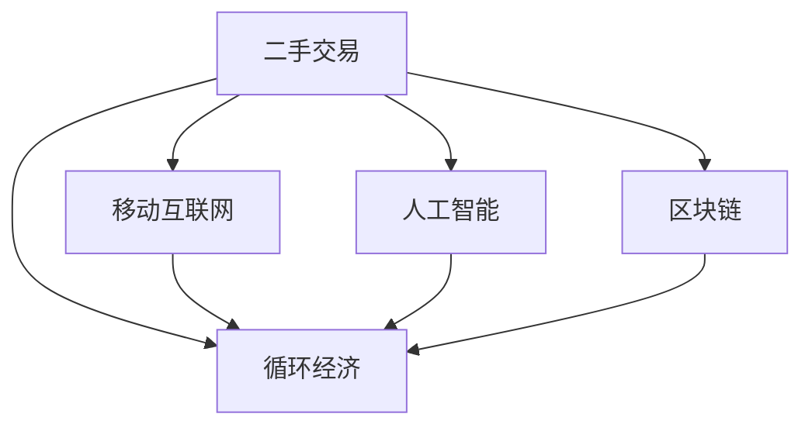

                 

# 二手交易创业：循环经济的实践者

## 1. 背景介绍

### 1.1 问题由来
在当今社会，随着消费者生活水平的提高和消费观念的转变，人们越来越重视环境保护和可持续发展。循环经济作为一种新的经济发展模式，得到了越来越多的关注和推广。二手交易作为循环经济的重要组成部分，不仅能够有效减少资源浪费，还能促进资源的再利用，对社会的可持续发展具有重要意义。

### 1.2 问题核心关键点
二手交易创业的兴起，一方面得益于技术的发展，特别是移动互联网和人工智能的进步；另一方面也反映了消费者对于环保和可持续生活方式的追求。对于创业者而言，把握二手交易市场的特点，结合技术优势，开发出符合市场需求的创新产品和服务，是成功的关键。

## 2. 核心概念与联系

### 2.1 核心概念概述

为了更好地理解二手交易创业的实践，本节将介绍几个密切相关的核心概念：

- **二手交易**：指将闲置物品出售、交换或赠送的行为。二手交易包括线上和线下两种形式，线上二手交易主要依托电商平台，线下二手交易则通过社交网络、二手市场等渠道进行。

- **循环经济**：一种以资源节约和环境友好为核心的经济发展模式，通过延长产品生命周期、减少资源消耗和废弃物排放，实现经济的可持续发展。

- **移动互联网**：基于互联网技术，通过智能手机、平板电脑等移动设备进行信息传输和处理的互联网服务模式。移动互联网的发展，极大地促进了二手交易的便捷性和普及率。

- **人工智能**：一种模拟人类智能的技术，通过机器学习、深度学习等技术，实现对大量数据的分析和处理，为二手交易创业提供技术支持。

- **区块链**：一种去中心化的分布式账本技术，具有高安全性、透明性和不可篡改性等特点，能够保障二手交易中的资金和数据安全。

这些核心概念之间存在紧密联系，共同构成了二手交易创业的实践框架，使得循环经济理念得以在二手交易中得到具体实现。

### 2.2 核心概念原理和架构的 Mermaid 流程图



这个流程图展示了几大核心概念之间的逻辑关系：

1. **二手交易** 是循环经济在市场层面的具体表现。
2. **移动互联网** 提供了二手交易的便捷性和普及性。
3. **人工智能** 通过数据分析和模型训练，提高了二手交易的效率和准确性。
4. **区块链** 为二手交易提供了安全性和信任保障。

## 3. 核心算法原理 & 具体操作步骤

### 3.1 算法原理概述

二手交易创业的核心在于如何有效地利用移动互联网、人工智能和区块链等技术，构建一个安全、便捷、高效的二手交易平台。该平台需要实现用户身份验证、商品信息管理、交易撮合、支付结算等核心功能，同时还要提供搜索、评价、推荐等辅助服务。

### 3.2 算法步骤详解

#### 3.2.1 用户身份验证
- **人脸识别**：利用人工智能技术进行面部识别，验证用户身份，防止冒名顶替。
- **区块链身份认证**：通过区块链技术，记录用户身份信息，确保数据不可篡改。

#### 3.2.2 商品信息管理
- **OCR技术**：利用人工智能中的光学字符识别技术，自动提取商品信息，如标题、描述、价格等。
- **NLP技术**：利用自然语言处理技术，对商品描述进行文本分类、关键词提取等处理，提高信息准确性。

#### 3.2.3 交易撮合
- **智能匹配算法**：基于用户偏好和商品属性，利用人工智能中的推荐算法，实现商品和用户的智能匹配。
- **竞拍机制**：引入拍卖、拍买等竞价机制，提高交易活跃度和商品价值。

#### 3.2.4 支付结算
- **区块链技术**：利用区块链技术，实现交易资金的智能合约管理，保障交易安全。
- **多币种支付**：支持多种货币支付，提高用户使用便捷性。

#### 3.2.5 搜索、评价、推荐
- **搜索算法**：利用人工智能中的信息检索技术，实现商品快速搜索和排序。
- **评价系统**：利用人工智能中的情感分析技术，对用户评价进行情感分类，提高评价准确性。
- **推荐系统**：利用人工智能中的协同过滤和基于内容的推荐算法，为用户提供个性化商品推荐。

### 3.3 算法优缺点

#### 3.3.1 优点
- **高效便捷**：利用移动互联网和人工智能技术，提供便捷的用户体验。
- **安全可靠**：利用区块链技术，保障交易和数据的安全性。
- **智能匹配**：通过智能匹配算法，提高交易效率和商品价值。

#### 3.3.2 缺点
- **技术门槛高**：需要掌握人工智能、区块链等多项先进技术，技术门槛较高。
- **用户隐私风险**：大量数据存储和处理，存在用户隐私泄露的风险。
- **市场竞争激烈**：二手交易市场竞争激烈，需要持续创新以保持竞争力。

### 3.4 算法应用领域

基于上述技术，二手交易创业可以在多个领域得到应用，包括：

- **二手商品交易**：如服装、电子产品、家居用品等。
- **二手服务交易**：如二手车、二手设备租赁等。
- **二手信息交易**：如二手机票、二手房产信息等。
- **二手资源交易**：如二手图书、二手教育资源等。

## 4. 数学模型和公式 & 详细讲解

### 4.1 数学模型构建

为了更好地描述二手交易创业的数学模型，本节将构建一个简单的数学模型，并详细讲解其构建过程。

假设有一个二手交易平台，平台上有 $N$ 个商品，每个商品有 $m$ 个属性，如价格、描述、评分等。用户 $U$ 通过搜索算法，找到符合自己需求的 $k$ 个商品，并进行交易。交易过程中，用户 $U$ 对商品 $i$ 的评分 $s_i$ 和支付金额 $p_i$，根据评分和支付金额，计算用户满意度 $S_U$。

数学模型如下：

$$
S_U = \frac{1}{k} \sum_{i=1}^k w_i s_i p_i
$$

其中 $w_i$ 为商品的权重，如商品评分、用户评分等。

### 4.2 公式推导过程

根据上述数学模型，我们可以进行以下公式推导：

1. **搜索算法**：利用信息检索技术，对商品属性进行排序，得到排序后的商品列表。

2. **交易结算**：利用智能合约技术，自动执行交易结算，保障交易资金安全。

3. **用户满意度**：根据用户评分和支付金额，计算用户满意度，并进行反馈分析。

4. **商品推荐**：利用协同过滤和基于内容的推荐算法，为每位用户推荐符合其兴趣的商品。

### 4.3 案例分析与讲解

以一个二手书交易平台为例，分析其数学模型的应用：

- **搜索算法**：用户输入关键词，如“计算机科学”，平台根据用户输入，利用信息检索技术，对所有商品进行检索，得到与关键词相关的商品列表。
- **交易结算**：用户选择感兴趣的书籍，进行支付，利用智能合约技术，自动结算交易金额，将款项转入卖家账户。
- **用户满意度**：用户对书籍进行评分和评价，根据评分和评价，计算用户满意度，并对商品进行反馈。
- **商品推荐**：平台根据用户的历史购买记录和评分，利用协同过滤算法，推荐符合用户兴趣的新书。

## 5. 项目实践：代码实例和详细解释说明

### 5.1 开发环境搭建

在进行二手交易创业项目开发前，我们需要准备好开发环境。以下是使用Python进行Flask开发的环境配置流程：

1. 安装Python：从官网下载并安装Python，确保版本为3.8及以上。

2. 安装Flask：使用pip命令安装Flask框架，确保版本为1.1.2及以上。

3. 安装相关库：安装Flask的扩展库，如Flask-WTF、Flask-SQLAlchemy、Flask-Login等。

4. 创建虚拟环境：使用虚拟环境管理工具，创建Python虚拟环境，方便项目依赖管理。

5. 配置数据库：配置SQLite数据库，作为项目的数据库后端。

6. 运行开发服务器：使用Flask命令，启动开发服务器，进行项目开发和测试。

### 5.2 源代码详细实现

下面以一个简单的二手书交易平台为例，给出使用Flask开发二手交易平台的核心代码实现。

```python
from flask import Flask, render_template, request, redirect, url_for
from flask_sqlalchemy import SQLAlchemy
from flask_login import LoginManager, UserMixin, login_user, logout_user, login_required, current_user

app = Flask(__name__)
app.config['SQLALCHEMY_DATABASE_URI'] = 'sqlite:///bookstore.db'
app.config['SECRET_KEY'] = 'supersecretkey'
db = SQLAlchemy(app)
login_manager = LoginManager(app)

class User(UserMixin, db.Model):
    id = db.Column(db.Integer, primary_key=True)
    username = db.Column(db.String(20), unique=True, nullable=False)
    password = db.Column(db.String(60), nullable=False)

@login_manager.user_loader
def load_user(user_id):
    return User.query.get(int(user_id))

@app.route('/')
@login_required
def index():
    books = Book.query.all()
    return render_template('index.html', books=books)

@app.route('/book', methods=['POST'])
@login_required
def add_book():
    book = Book(title=request.form['title'], author=request.form['author'], price=float(request.form['price']))
    db.session.add(book)
    db.session.commit()
    return redirect(url_for('index'))

@app.route('/book/<int:book_id>', methods=['DELETE'])
@login_required
def delete_book(book_id):
    book = Book.query.get(book_id)
    db.session.delete(book)
    db.session.commit()
    return redirect(url_for('index'))

@app.route('/login', methods=['GET', 'POST'])
def login():
    if request.method == 'POST':
        user = User.query.filter_by(username=request.form['username']).first()
        if user and user.password == request.form['password']:
            login_user(user)
            return redirect(url_for('index'))
    return render_template('login.html')

@app.route('/logout')
def logout():
    logout_user()
    return redirect(url_for('index'))

if __name__ == '__main__':
    app.run(debug=True)
```

### 5.3 代码解读与分析

让我们再详细解读一下关键代码的实现细节：

**User类**：
- 定义了用户的基本信息，包括用户名和密码，以及数据库表结构。

**login_manager.user_loader**：
- 用于在用户登录时，根据用户名加载用户信息，实现用户登录验证。

**index路由**：
- 显示所有图书信息，需要用户登录后才能访问。

**add_book路由**：
- 添加新图书，需要用户登录后才能执行。

**delete_book路由**：
- 删除图书，需要用户登录后才能执行。

**login路由**：
- 显示登录页面，处理用户登录请求，如果用户名和密码匹配，则登录用户。

**logout路由**：
- 处理用户退出请求，注销当前登录用户。

通过上述代码，我们可以快速搭建一个简单的二手书交易平台，并实现用户注册、登录、添加图书、删除图书等基本功能。

## 6. 实际应用场景

### 6.1 二手商品交易

在二手商品交易场景中，平台可以支持各类商品的买卖，如服装、电子产品、家居用品等。平台需要提供搜索、评价、推荐等功能，帮助用户快速找到符合自己需求的商品。

### 6.2 二手服务交易

在二手服务交易场景中，平台可以支持各类服务的买卖，如二手车、二手设备租赁等。平台需要提供任务发布、任务抢单、任务完成等功能，帮助用户高效完成交易。

### 6.3 二手信息交易

在二手信息交易场景中，平台可以支持各类信息的买卖，如二手机票、二手房产信息等。平台需要提供信息发布、信息筛选、信息匹配等功能，帮助用户找到符合自己需求的信息。

### 6.4 二手资源交易

在二手资源交易场景中，平台可以支持各类资源的服务，如二手图书、二手教育资源等。平台需要提供资源发布、资源共享、资源评价等功能，帮助用户高效共享资源。

## 7. 工具和资源推荐

### 7.1 学习资源推荐

为了帮助开发者系统掌握二手交易创业的理论基础和实践技巧，这里推荐一些优质的学习资源：

1. **Flask官方文档**：Flask框架的官方文档，提供了完整的Flask开发教程和API文档，是学习Flask的好资源。

2. **SQLAlchemy官方文档**：SQLAlchemy数据库框架的官方文档，提供了丰富的SQLAlchemy教程和示例，适合学习SQLAlchemy。

3. **Flask-Login官方文档**：Flask-Login用户认证扩展的官方文档，提供了详细的用户认证教程和示例，适合学习用户认证。

4. **Flask-SQLAlchemy官方文档**：Flask-SQLAlchemy数据库扩展的官方文档，提供了详细的SQLAlchemy教程和示例，适合学习数据库操作。

5. **Flask-WTF官方文档**：Flask-WTF表单扩展的官方文档，提供了详细的表单验证教程和示例，适合学习表单处理。

### 7.2 开发工具推荐

高效的开发离不开优秀的工具支持。以下是几款用于二手交易创业开发的常用工具：

1. **PyCharm**：一款功能强大的IDE，支持Flask框架的开发和调试。

2. **Visual Studio Code**：一款轻量级的IDE，支持Flask框架的开发和调试。

3. **Jupyter Notebook**：一款交互式的开发环境，支持Python代码的执行和调试。

4. **Git**：一款版本控制系统，支持代码的版本管理和协作开发。

5. **Docker**：一款容器化技术，支持应用程序的打包和部署。

6. **Kubernetes**：一款容器编排平台，支持大规模的分布式部署和管理。

通过合理利用这些工具，可以显著提升二手交易创业项目的开发效率，加速创新迭代的步伐。

### 7.3 相关论文推荐

二手交易创业涉及多方面的技术，以下是几篇相关的经典论文，推荐阅读：

1. **《Flask Web Development》**：Flask框架的经典教材，深入浅出地介绍了Flask的开发流程和实践技巧。

2. **《SQLAlchemy Object-Relational Mapping》**：SQLAlchemy数据库框架的经典教材，详细介绍了SQLAlchemy的API和设计理念。

3. **《Flask-Login User Authentication》**：Flask-Login用户认证扩展的经典教程，详细介绍了用户认证的实现过程和最佳实践。

4. **《Flask-SQLAlchemy Database Integration》**：Flask-SQLAlchemy数据库扩展的经典教程，详细介绍了SQLAlchemy与Flask的集成方式和API设计。

5. **《Flask-WTF Form Validation》**：Flask-WTF表单扩展的经典教程，详细介绍了表单验证的实现过程和最佳实践。

这些论文代表了Flask框架和SQLAlchemy数据库框架的最佳实践，是学习Flask和SQLAlchemy的好资源。

## 8. 总结：未来发展趋势与挑战

### 8.1 总结

本文对二手交易创业的实践进行了全面系统的介绍。首先阐述了二手交易创业的背景和意义，明确了循环经济理念在二手交易中的实现方式。其次，从原理到实践，详细讲解了二手交易创业的数学模型和核心算法，给出了Flask框架的核心代码实现。同时，本文还探讨了二手交易创业在多个领域的实际应用，展示了循环经济理念在实际场景中的价值。最后，本文推荐了一些优质的学习资源和开发工具，力求为读者提供全方位的技术指引。

通过本文的系统梳理，可以看到，二手交易创业作为循环经济的一种实践，利用了移动互联网、人工智能和区块链等先进技术，为资源的循环利用提供了新的解决方案。未来，伴随技术的不断进步，二手交易创业必将在更广泛的领域发挥作用，推动社会的可持续发展。

### 8.2 未来发展趋势

展望未来，二手交易创业将呈现以下几个发展趋势：

1. **技术融合**：随着人工智能、区块链等技术的不断进步，二手交易创业将与其他技术进一步融合，提升平台的智能化和安全性。

2. **全球化**：伴随跨境电商的发展，二手交易创业将突破地域限制，实现全球化运营。

3. **个性化推荐**：通过更先进的推荐算法，为每位用户提供个性化的商品推荐，提升用户体验。

4. **实时交易**：利用实时计算技术，实现交易的实时撮合和结算，提升交易效率。

5. **可持续发展**：随着社会对可持续发展的关注，二手交易创业将更加注重环保和资源的循环利用，推动社会的可持续发展。

6. **社会责任**：平台将更加注重社会责任，保障用户隐私和数据安全，打击假冒伪劣商品。

这些趋势将推动二手交易创业走向更加智能化、高效化和可持续化，为社会的可持续发展提供新的动力。

### 8.3 面临的挑战

尽管二手交易创业已经取得了一定的进展，但在迈向更加智能化、普适化应用的过程中，它仍面临着诸多挑战：

1. **技术门槛高**：二手交易创业需要掌握人工智能、区块链等多项先进技术，技术门槛较高。

2. **市场竞争激烈**：二手交易市场竞争激烈，需要持续创新以保持竞争力。

3. **用户隐私风险**：大量数据存储和处理，存在用户隐私泄露的风险。

4. **法律法规不完善**：二手交易创业涉及多方面的法律法规，需要严格遵守相关规定。

5. **用户体验不足**：平台需要进一步优化用户体验，提升用户满意度和忠诚度。

6. **供应链管理困难**：二手交易创业需要建立稳定的供应链管理机制，保障商品质量和服务质量。

这些挑战需要平台不断优化技术、完善法律法规、提升用户体验，才能实现可持续发展。

### 8.4 研究展望

面对二手交易创业所面临的种种挑战，未来的研究需要在以下几个方面寻求新的突破：

1. **技术优化**：通过优化算法和模型，提升平台的智能化和安全性。

2. **法律法规**：推动相关法律法规的制定和完善，保障用户权益和平台运营的合规性。

3. **用户体验**：提升平台的用户体验，增加用户粘性和忠诚度。

4. **供应链管理**：建立稳定的供应链管理机制，保障商品质量和服务质量。

5. **社会责任**：加强平台的社会责任意识，保障用户隐私和数据安全。

通过在这些方面进行深入研究，相信二手交易创业必将在循环经济中发挥更大的作用，为社会的可持续发展提供新的动力。

## 9. 附录：常见问题与解答

**Q1: 二手交易创业的盈利模式是什么？**

A: 二手交易创业的盈利模式主要包括：

1. **交易佣金**：平台通过收取交易双方的一定比例佣金，实现盈利。

2. **广告收入**：平台通过展示广告和推广服务，获取广告收入。

3. **增值服务**：平台提供增值服务，如保险、担保等，收取服务费用。

4. **数据分析**：平台通过数据分析，提供商业智能服务，获取数据服务费。

5. **会员服务**：平台提供高级会员服务，如VIP会员、专属服务等，收取会员费。

**Q2: 如何提高二手交易平台的流量和用户粘性？**

A: 提高二手交易平台的流量和用户粘性，可以采取以下措施：

1. **优化用户体验**：提供便捷、友好的用户体验，增加用户留存率。

2. **丰富商品种类**：增加商品种类和数量，吸引更多用户使用平台。

3. **推广活动**：开展促销活动，如折扣、优惠券等，吸引新用户和回流用户。

4. **社区建设**：建立用户社区，增加用户互动，提升用户粘性。

5. **数据分析**：通过数据分析，了解用户需求和行为，优化产品和服务。

6. **客户服务**：提供优质的客户服务，解决用户问题，提升用户满意度。

**Q3: 如何在二手交易平台中保障用户隐私和数据安全？**

A: 在二手交易平台中保障用户隐私和数据安全，可以采取以下措施：

1. **数据加密**：对用户数据进行加密存储和传输，防止数据泄露。

2. **访问控制**：设置严格的访问控制机制，防止未经授权的访问。

3. **匿名化处理**：对敏感数据进行匿名化处理，防止数据被滥用。

4. **安全认证**：采用安全认证机制，如多因素认证、生物识别等，保障用户身份安全。

5. **安全审计**：定期进行安全审计，发现并修复安全漏洞。

6. **法律法规遵守**：严格遵守相关法律法规，保障用户隐私和数据安全。

**Q4: 二手交易创业在哪个领域具有更好的发展前景？**

A: 二手交易创业在以下几个领域具有较好的发展前景：

1. **二手服装交易**：二手服装具有较高的需求，平台可以通过个性化推荐和社交功能，提升用户粘性。

2. **二手电子产品交易**：二手电子产品具有较高的价值和变现潜力，平台可以通过精准的推荐和评估机制，保障商品质量。

3. **二手家居用品交易**：二手家居用品具有较高的实用性，平台可以通过场景化推荐和评价机制，提升用户体验。

4. **二手书籍交易**：二手书籍具有较高的价值和文化价值，平台可以通过认证机制和专家评审，保障商品质量。

**Q5: 二手交易创业的商业模式应该如何设计？**

A: 二手交易创业的商业模式设计，可以采取以下步骤：

1. **用户定位**：明确目标用户群体，了解用户需求和行为。

2. **产品规划**：设计符合用户需求的产品和服务，如商品搜索、用户评价、推荐系统等。

3. **渠道建设**：选择合适的渠道进行市场推广，如社交媒体、搜索引擎等。

4. **盈利模式选择**：根据用户需求和平台特点，选择合适的盈利模式，如交易佣金、广告收入、增值服务等。

5. **运营优化**：通过数据分析和优化，提升平台的用户粘性和盈利能力。

通过以上步骤，可以设计出符合市场需求的商业模式，推动二手交易创业的健康发展。

---

作者：禅与计算机程序设计艺术 / Zen and the Art of Computer Programming

