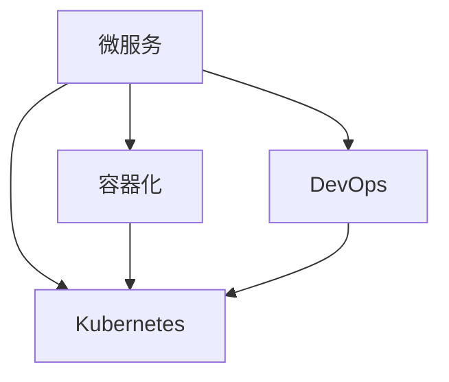

                 

# 云原生架构：微服务、容器与Kubernetes

## 1. 背景介绍

在云计算和分布式系统快速发展的今天，云原生架构作为一种新兴的应用模式，正在逐步成为企业构建和部署应用的核心架构。云原生架构的核心思想是围绕开源容器化和自动化技术，构建可扩展、高可用、自修复的系统。云原生架构的核心组件包括微服务、容器化和Kubernetes(K8s)等技术，它们能够帮助企业构建灵活、高效、可靠的云原生应用。

云原生架构之所以受到广泛关注，是因为它具有以下优点：

1. **高可用性和容错性**：云原生架构的分布式设计使得单个服务或者节点的故障不会影响到整个系统的稳定运行，整个系统可以通过自动化的扩容和重构机制，快速应对故障并恢复到正常状态。

2. **快速部署和扩展**：微服务架构允许开发者以细粒度的服务单元进行独立部署和扩展，支持高频次的迭代更新，能够快速响应用户需求的变化。

3. **自动化运维**：容器化能够提供一致的运行环境，而Kubernetes提供了强大的自动化运维功能，包括资源管理、负载均衡、故障恢复、服务发现等，大大降低了运维成本。

4. **环境一致性**：容器化提供了跨平台的环境一致性，即在开发、测试、生产环境中的运行条件一致，简化了应用的部署和测试流程。

5. **资源优化**：容器化能够优化系统资源的利用率，支持资源隔离、按需扩展等功能，有助于提高系统的资源利用效率。

## 2. 核心概念与联系

### 2.1 核心概念概述

为了更好地理解云原生架构，我们首先来介绍几个关键概念：

- **微服务(Microservices)**：微服务是一种将应用程序拆分为多个小服务的架构设计方法，每个服务独立部署、独立扩展，并具备自治的业务功能。微服务架构能够提高系统的可维护性、可扩展性和可重用性。

- **容器化(Containerization)**：容器化是将应用及其依赖打包到轻量级、可移植的容器中，以便在不同环境中运行。容器化技术能够提供一致的运行环境，使得应用在开发、测试、生产等环节的运行条件一致。

- **Kubernetes(Kubernetes)**：Kubernetes是一种开源的容器编排系统，它能够自动化容器化应用的部署、扩展和运维。Kubernetes提供了强大的自动化运维功能，包括资源管理、负载均衡、故障恢复、服务发现等，是云原生架构的核心组成部分。

- **DevOps**：DevOps是一种文化和实践，旨在将软件开发和运维团队紧密结合，实现持续交付和持续部署，提升应用的质量和效率。

这些核心概念通过一定的逻辑关系可以组成一个有机的整体。以下是它们之间的联系：



这个流程图展示了微服务、容器化和Kubernetes之间的联系：

- **微服务**是容器化的基础，应用被拆分为多个独立的服务后，才能被容器化。
- **容器化**使得应用及其依赖被打包到容器中进行一致性部署，这是Kubernetes能够管理和调度容器的核心技术。
- **Kubernetes**是容器化应用的编排系统，它通过自动化管理容器，提供了高效的资源管理和故障恢复能力。
- **DevOps**实践促进了微服务、容器化和Kubernetes的协同工作，通过持续交付和持续部署，提升了应用的交付效率和稳定性。

## 3. 核心算法原理 & 具体操作步骤

### 3.1 算法原理概述

云原生架构的核心算法原理主要包括微服务设计、容器编排和Kubernetes调度等。下面分别介绍这些关键技术的工作原理。

- **微服务设计**：微服务设计是一种将应用程序拆分为多个独立服务的架构设计方法。每个服务负责特定的业务功能，并且能够独立部署和扩展。

- **容器编排**：容器编排是将应用及其依赖打包到容器中，并在集群中自动化部署和管理的算法。容器编排的关键在于如何高效地管理和调度容器资源，以确保应用的稳定运行。

- **Kubernetes调度**：Kubernetes调度是指在集群中管理和调度容器应用的过程。Kubernetes调度器负责根据应用程序的要求，合理地分配和调度集群资源，以确保应用的高可用性和性能。

### 3.2 算法步骤详解

#### 微服务设计

微服务设计的关键步骤包括：

1. **拆分应用**：将一个大型的应用拆分为多个独立的服务，每个服务负责独立的业务功能。

2. **设计服务接口**：定义每个服务之间的接口和通信方式，通常使用RESTful API接口。

3. **独立部署和扩展**：每个服务独立部署和扩展，以支持高频次的迭代更新和快速响应用户需求。

4. **服务治理**：使用服务注册和发现机制，实现服务的动态注册和发现，支持负载均衡和服务熔断等功能。

#### 容器编排

容器编排的关键步骤包括：

1. **构建容器镜像**：将应用及其依赖打包到容器中，并构建容器镜像。

2. **部署容器**：将容器镜像部署到集群中，并进行自动化管理。

3. **管理容器资源**：通过容器编排工具，对容器资源进行监控和管理，以确保应用的高可用性和性能。

4. **自动化回滚**：在容器编排工具中实现容器的自动化回滚机制，以应对部署失败和系统故障。

#### Kubernetes调度

Kubernetes调度的关键步骤包括：

1. **节点资源管理**：Kubernetes调度器根据应用程序的需求，合理地分配和调度集群资源，包括CPU、内存、网络等。

2. **任务调度**：Kubernetes调度器根据任务的需求，找到合适的节点和资源，并将任务部署到该节点上。

3. **自动扩展**：根据应用程序的负载情况，Kubernetes调度器可以自动扩展或缩小容器数量，以确保应用的高可用性和性能。

4. **故障恢复**：Kubernetes调度器可以自动检测和恢复故障容器，以确保应用的稳定运行。

### 3.3 算法优缺点

云原生架构的微服务、容器化和Kubernetes技术具有以下优点：

- **灵活性和可扩展性**：微服务架构和容器编排技术使得应用能够灵活地部署和扩展，支持高频次的迭代更新。

- **自动化运维**：容器化和Kubernetes提供了强大的自动化运维功能，能够自动化部署、扩展和管理容器应用。

- **环境一致性**：容器化提供了跨平台的环境一致性，简化了应用的部署和测试流程。

- **资源优化**：容器化和Kubernetes能够优化系统资源的利用率，支持资源隔离、按需扩展等功能。

然而，云原生架构也存在一些缺点：

- **复杂性**：云原生架构的复杂性较高，需要开发人员具备较高的技术水平和经验。

- **运维成本**：云原生架构的自动化运维功能需要较高的技术门槛，运维成本较高。

- **性能损耗**：容器化和Kubernetes的引入可能会增加应用的性能损耗，需要进一步优化。

### 3.4 算法应用领域

云原生架构的微服务、容器化和Kubernetes技术在以下领域得到了广泛应用：

- **金融科技**：金融科技行业需要高可用性和低延迟的应用系统，微服务架构和容器编排技术能够提供稳定可靠的应用系统。

- **电子商务**：电子商务平台需要支持高频次的迭代更新和快速响应用户需求，微服务架构和容器编排技术能够快速响应用户需求。

- **物联网**：物联网设备需要高可靠性和低延迟的应用系统，微服务架构和容器编排技术能够提供稳定可靠的应用系统。

- **云服务提供商**：云服务提供商需要支持高效、可靠、可扩展的云服务，微服务架构和容器编排技术能够满足这些需求。

## 4. 数学模型和公式 & 详细讲解 & 举例说明

### 4.1 数学模型构建

云原生架构的数学模型主要包括微服务设计、容器编排和Kubernetes调度的数学模型。下面分别介绍这些模型的构建。

- **微服务设计模型**：微服务设计的数学模型通常包括拆分应用的方法、服务接口的设计和服务的部署扩展方式。

- **容器编排模型**：容器编排的数学模型通常包括容器的构建、部署和管理的算法。

- **Kubernetes调度模型**：Kubernetes调度的数学模型通常包括节点资源的管理、任务的调度和故障恢复的算法。

### 4.2 公式推导过程

#### 微服务设计模型

微服务设计的数学模型可以表示为：

$$
S = \{S_1, S_2, \ldots, S_n\}
$$

其中，$S$ 表示拆分后的微服务集合，$S_i$ 表示第 $i$ 个微服务。每个微服务可以表示为：

$$
S_i = (A_i, I_i, C_i, D_i)
$$

其中，$A_i$ 表示微服务的功能模块，$I_i$ 表示微服务的接口，$C_i$ 表示微服务的容器镜像，$D_i$ 表示微服务的部署配置。

#### 容器编排模型

容器编排的数学模型可以表示为：

$$
C = \{C_1, C_2, \ldots, C_n\}
$$

其中，$C$ 表示容器集合，$C_i$ 表示第 $i$ 个容器。每个容器可以表示为：

$$
C_i = (A_i, I_i, P_i, R_i)
$$

其中，$A_i$ 表示容器的功能模块，$I_i$ 表示容器的接口，$P_i$ 表示容器的部署配置，$R_i$ 表示容器的运行状态。

#### Kubernetes调度模型

Kubernetes调度的数学模型可以表示为：

$$
N = \{N_1, N_2, \ldots, N_m\}
$$

其中，$N$ 表示节点集合，$N_i$ 表示第 $i$ 个节点。每个节点可以表示为：

$$
N_i = (R_i, C_i, S_i, M_i)
$$

其中，$R_i$ 表示节点的资源信息，$C_i$ 表示节点的容器资源，$S_i$ 表示节点的服务状态，$M_i$ 表示节点的度量指标。

### 4.3 案例分析与讲解

假设我们有一个电商平台的微服务架构，包含以下三个微服务：

- **商品管理服务**：负责商品信息的管理，提供商品详情、库存查询等功能。
- **订单服务**：负责订单的创建、支付、发货等功能。
- **用户服务**：负责用户信息的管理，提供注册、登录、个人信息查询等功能。

我们将这三个微服务分别打包成容器镜像，并使用Kubernetes进行部署和管理。具体部署流程如下：

1. **构建容器镜像**：将商品管理服务、订单服务和用户服务的代码打包成容器镜像。

2. **部署容器**：将容器镜像部署到Kubernetes集群中，并进行自动化管理。

3. **资源管理**：通过Kubernetes调度器，合理地分配和调度容器资源，确保每个服务的稳定运行。

## 5. 项目实践：代码实例和详细解释说明

### 5.1 开发环境搭建

在进行云原生架构实践前，我们需要准备好开发环境。以下是使用Docker和Kubernetes搭建开发环境的流程：

1. **安装Docker**：从官网下载并安装Docker，以便构建和运行容器镜像。

2. **安装Kubernetes**：使用Minikube或Kubernetes集群工具，搭建Kubernetes集群。

3. **安装Kubernetes CLI工具**：安装Kubectl命令行工具，用于管理Kubernetes集群。

### 5.2 源代码详细实现

下面我们以微服务架构的电商平台为例，给出使用Docker和Kubernetes进行部署的Python代码实现。

首先，定义商品管理服务的API接口：

```python
from flask import Flask, request
app = Flask(__name__)

@app.route('/product')
def get_product():
    product_id = request.args.get('id')
    product = get_product_from_database(product_id)
    return jsonify(product)
```

然后，定义订单服务的API接口：

```python
from flask import Flask, request
app = Flask(__name__)

@app.route('/order')
def place_order():
    order_data = request.json
    place_order_in_database(order_data)
    return jsonify({'status': 'success'})
```

接着，定义用户服务的API接口：

```python
from flask import Flask, request
app = Flask(__name__)

@app.route('/user')
def login_user():
    username = request.args.get('username')
    password = request.args.get('password')
    user = login_user_from_database(username, password)
    return jsonify(user)
```

接下来，构建容器镜像：

```bash
docker build -t product-service .
docker build -t order-service .
docker build -t user-service .
```

然后，部署容器到Kubernetes集群：

```bash
kubectl create deployment product-service --image=product-service:latest --replicas=3
kubectl create deployment order-service --image=order-service:latest --replicas=3
kubectl create deployment user-service --image=user-service:latest --replicas=3
```

最后，配置服务发现和负载均衡：

```bash
kubectl expose deployment product-service --type=LoadBalancer --port=80 --target-port=8080
kubectl expose deployment order-service --type=LoadBalancer --port=80 --target-port=8080
kubectl expose deployment user-service --type=LoadBalancer --port=80 --target-port=8080
```

这样，电商平台的微服务架构就搭建完成了。通过Kubernetes进行管理和调度，能够确保应用的稳定运行和高可用性。

### 5.3 代码解读与分析

这里我们解读一下关键代码的实现细节：

**Flask应用**：

```python
from flask import Flask, request
app = Flask(__name__)
```

定义Flask应用，并初始化应用对象。

**API接口**：

```python
@app.route('/product')
def get_product():
    product_id = request.args.get('id')
    product = get_product_from_database(product_id)
    return jsonify(product)
```

定义API接口，处理GET请求并返回商品详情。

**容器构建和部署**：

```bash
docker build -t product-service .
docker build -t order-service .
docker build -t user-service .
```

构建容器镜像，并给镜像打标签。

**Kubernetes部署**：

```bash
kubectl create deployment product-service --image=product-service:latest --replicas=3
kubectl create deployment order-service --image=order-service:latest --replicas=3
kubectl create deployment user-service --image=user-service:latest --replicas=3
```

使用Kubectl命令创建部署，指定容器镜像和副本数。

**服务暴露**：

```bash
kubectl expose deployment product-service --type=LoadBalancer --port=80 --target-port=8080
kubectl expose deployment order-service --type=LoadBalancer --port=80 --target-port=8080
kubectl expose deployment user-service --type=LoadBalancer --port=80 --target-port=8080
```

使用Kubectl命令暴露服务，并指定服务类型和端口。

通过以上代码实现，我们可以构建一个云原生架构的电商平台。微服务架构使得应用能够灵活地部署和扩展，容器化和Kubernetes提供了强大的自动化运维功能，能够确保应用的稳定运行和高可用性。

### 5.4 运行结果展示

运行结果展示：

1. **商品详情查询**：

```bash
$ curl http://product-service:8080/product?id=1
```

2. **下单支付**：

```bash
$ curl http://order-service:8080/order --header "Content-Type: application/json" -X POST -d '{"user_id": "123", "product_id": "1", "amount": "100"}'
```

3. **用户登录**：

```bash
$ curl http://user-service:8080/user?username="user1"&password="password1"
```

通过这些示例，我们可以验证微服务架构的电商平台的运行效果。通过容器化和Kubernetes提供的自动化运维功能，能够确保应用的稳定运行和高可用性。

## 6. 实际应用场景

### 6.1 金融科技

金融科技行业需要高可用性和低延迟的应用系统。微服务架构和容器编排技术能够提供稳定可靠的应用系统，支持高频次的迭代更新和快速响应用户需求。例如，银行系统、证券交易系统等，需要高可靠性和低延迟的应用系统，微服务架构和容器编排技术能够满足这些需求。

### 6.2 电子商务

电子商务平台需要支持高频次的迭代更新和快速响应用户需求。微服务架构和容器编排技术能够快速响应用户需求，支持高频次的迭代更新。例如，电商平台的商品管理、订单处理、用户注册等功能，可以通过微服务架构和容器编排技术进行高效部署和管理。

### 6.3 物联网

物联网设备需要高可靠性和低延迟的应用系统。微服务架构和容器编排技术能够提供稳定可靠的应用系统，支持高频次的迭代更新和快速响应用户需求。例如，智能家居系统、工业物联网系统等，需要高可靠性和低延迟的应用系统，微服务架构和容器编排技术能够满足这些需求。

### 6.4 云服务提供商

云服务提供商需要支持高效、可靠、可扩展的云服务。微服务架构和容器编排技术能够提供高效、可靠、可扩展的云服务。例如，AWS、Google Cloud、阿里云等云服务提供商，提供各种云服务，如云存储、云数据库、云函数等，通过微服务架构和容器编排技术进行高效部署和管理。

## 7. 工具和资源推荐

### 7.1 学习资源推荐

为了帮助开发者系统掌握云原生架构的理论基础和实践技巧，这里推荐一些优质的学习资源：

1. **Kubernetes官方文档**：Kubernetes官方文档是学习Kubernetes的最佳资源之一，提供了详细的API文档、最佳实践和部署指南。

2. **Cloud Native Computing Foundation(CNCF)官方文档**：CNCF官方文档介绍了云原生架构的各个组件，包括Kubernetes、微服务、容器化等，是学习云原生架构的重要资源。

3. **Flask官方文档**：Flask官方文档介绍了Flask框架的使用方法和最佳实践，是学习微服务架构的重要资源。

4. **Docker官方文档**：Docker官方文档介绍了Docker容器化的使用方法和最佳实践，是学习容器化技术的重要资源。

5. **DevOps实践指南**：DevOps实践指南介绍了DevOps的实践方法和工具，是学习DevOps的重要资源。

### 7.2 开发工具推荐

高效的开发离不开优秀的工具支持。以下是几款用于云原生架构开发的常用工具：

1. **Kubernetes**：Kubernetes是云原生架构的核心组件，是容器编排的黄金标准。

2. **Docker**：Docker是容器化的最佳实践之一，提供轻量级、可移植的容器解决方案。

3. **Jenkins**：Jenkins是DevOps的自动化工具之一，支持CI/CD流程和自动化测试。

4. **Prometheus**：Prometheus是监控工具，能够实时监测应用的性能和资源使用情况。

5. **Kubernetes Dashboard**：Kubernetes Dashboard是Kubernetes的可视化管理工具，能够实时展示集群状态和资源使用情况。

6. **Grafana**：Grafana是可视化工具，能够将监控数据进行可视化展示，便于分析和排查问题。

### 7.3 相关论文推荐

云原生架构的研究源于学界的持续研究。以下是几篇奠基性的相关论文，推荐阅读：

1. **《Microservices Architecture: Patterns and Practice》**：这本书介绍了微服务架构的设计模式和实践方法，是学习微服务架构的重要资源。

2. **《Containers, Clusters, and Services: Managing Containers in Production》**：这本书介绍了容器编排和Kubernetes的部署和运维方法，是学习容器化和Kubernetes的重要资源。

3. **《Docker in Practice》**：这本书介绍了Docker容器化的使用方法和最佳实践，是学习容器化的重要资源。

4. **《Kubernetes: Upcoming Changes》**：这篇论文介绍了Kubernetes的最新进展和未来发展方向，是学习Kubernetes的重要资源。

## 8. 总结：未来发展趋势与挑战

### 8.1 研究成果总结

云原生架构的微服务、容器化和Kubernetes技术已经逐步成为企业构建和部署应用的核心架构。云原生架构的灵活性、可扩展性、自动化运维等特点，使得其在高可用性、低延迟、高效扩展等方面具有显著优势。

### 8.2 未来发展趋势

展望未来，云原生架构将呈现以下几个发展趋势：

1. **微服务架构的普及**：微服务架构将成为企业应用架构的主流，能够提供更高的灵活性和可扩展性。

2. **容器编排的自动化**：容器编排将变得更加自动化和智能化，能够自动发现、调度和管理容器资源。

3. **Kubernetes的持续改进**：Kubernetes将持续改进，支持更多的功能和特性，成为容器编排的黄金标准。

4. **云原生平台的普及**：云原生平台将成为企业应用部署和运维的主流，支持微服务架构、容器编排和Kubernetes等功能。

5. **DevOps的普及**：DevOps实践将进一步普及，支持持续交付和持续部署，提升应用的质量和效率。

### 8.3 面临的挑战

尽管云原生架构已经取得了显著的成就，但在迈向更加智能化、普适化应用的过程中，它仍面临着诸多挑战：

1. **复杂性**：云原生架构的复杂性较高，需要开发人员具备较高的技术水平和经验。

2. **运维成本**：云原生架构的自动化运维功能需要较高的技术门槛，运维成本较高。

3. **性能损耗**：容器化和Kubernetes的引入可能会增加应用的性能损耗，需要进一步优化。

4. **安全性和隐私保护**：云原生架构的分布式设计和自动化运维功能，可能带来新的安全风险，需要加强安全性和隐私保护。

### 8.4 研究展望

面对云原生架构面临的挑战，未来的研究需要在以下几个方面寻求新的突破：

1. **优化容器编排算法**：优化容器编排算法，提升容器资源的利用率，减少性能损耗。

2. **提高微服务架构的灵活性**：提高微服务架构的灵活性，支持高频次的迭代更新和快速响应用户需求。

3. **增强自动化运维能力**：增强自动化运维能力，支持持续交付和持续部署，提升应用的质量和效率。

4. **加强安全性和隐私保护**：加强安全性和隐私保护，保障数据和系统的安全。

这些研究方向的探索，必将引领云原生架构技术迈向更高的台阶，为构建高效、可靠、可扩展的应用系统提供新的思路。面向未来，云原生架构还需要与其他人工智能技术进行更深入的融合，如知识表示、因果推理、强化学习等，多路径协同发力，共同推动云原生技术的进步。

## 9. 附录：常见问题与解答

### Q1：什么是云原生架构？

A: 云原生架构是一种新兴的应用模式，围绕开源容器化和自动化技术，构建可扩展、高可用、自修复的系统。云原生架构的核心组件包括微服务、容器化和Kubernetes等技术。

### Q2：微服务架构的优势是什么？

A: 微服务架构的优势包括：

1. **高灵活性和可扩展性**：微服务架构将应用拆分为多个独立的服务，每个服务独立部署和扩展，能够支持高频次的迭代更新和快速响应用户需求。

2. **高可用性和容错性**：微服务架构通过分布式设计，使得单个服务或者节点的故障不会影响到整个系统的稳定运行，具有高可用性和容错性。

3. **独立开发和部署**：微服务架构能够独立开发和部署，每个服务能够独立测试和部署，提升了开发效率。

### Q3：什么是容器化？

A: 容器化是将应用及其依赖打包到轻量级、可移植的容器中，以便在不同环境中运行。容器化提供了跨平台的环境一致性，简化了应用的部署和测试流程。

### Q4：Kubernetes的优势是什么？

A: Kubernetes的优势包括：

1. **自动化运维**：Kubernetes提供了强大的自动化运维功能，包括资源管理、负载均衡、故障恢复、服务发现等，大大降低了运维成本。

2. **高可用性和容错性**：Kubernetes通过自动扩容和重构机制，能够确保应用的稳定运行和高可用性。

3. **灵活性和可扩展性**：Kubernetes能够根据应用程序的需求，自动调整资源，支持高效的资源管理和调度。

### Q5：云原生架构面临的挑战是什么？

A: 云原生架构面临的挑战包括：

1. **复杂性**：云原生架构的复杂性较高，需要开发人员具备较高的技术水平和经验。

2. **运维成本**：云原生架构的自动化运维功能需要较高的技术门槛，运维成本较高。

3. **性能损耗**：容器化和Kubernetes的引入可能会增加应用的性能损耗，需要进一步优化。

4. **安全性和隐私保护**：云原生架构的分布式设计和自动化运维功能，可能带来新的安全风险，需要加强安全性和隐私保护。

通过以上总结和解答，我们深入了解了云原生架构的核心概念、关键技术和实际应用，并展望了未来的发展方向和面临的挑战。相信通过不断探索和实践，云原生架构将在构建高效、可靠、可扩展的应用系统方面发挥更大的作用。

---

作者：禅与计算机程序设计艺术 / Zen and the Art of Computer Programming

