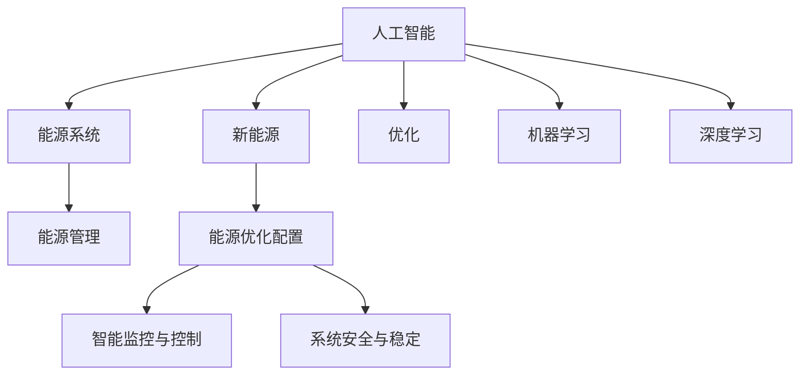

                 

# 人工智能在新能源开发中的应用：优化能源系统

> 关键词：人工智能,新能源,能源系统,优化,机器学习,深度学习,能源管理

## 1. 背景介绍

### 1.1 问题由来
随着全球能源需求的持续增长和环境保护意识的增强，传统化石能源的利用面临巨大压力。新能源，如风能、太阳能、水能等，由于其清洁、可再生的特性，逐渐成为未来能源结构的重要组成部分。但新能源发电具有间歇性和波动性，难以稳定供应。如何高效利用和管理新能源，是能源领域亟待解决的重大问题。

人工智能（AI），作为新一轮科技革命的核心动力，近年来在能源领域的智能化应用中显现出巨大的潜力和优势。通过智能算法和大数据分析，人工智能能够预测能源需求，优化能源配置，提升能源利用效率，实现新能源与传统能源的协同互补，为构建更加绿色、可持续的能源系统提供有力支持。

### 1.2 问题核心关键点
人工智能在新能源开发中的应用，主要聚焦于以下几个关键点：

- 能源需求预测：通过机器学习和深度学习模型，预测未来能源需求和波动，为能源调度提供科学依据。
- 能源优化配置：利用优化算法，实现新能源与传统能源的智能调度，提升能源利用效率。
- 智能监控与控制：应用感知和控制技术，实时监测能源系统状态，实现智能自动调控。
- 系统安全与稳定：通过风险评估和应急响应机制，保障能源系统安全稳定运行。

本文将详细阐述人工智能在新能源开发中的应用原理和具体操作步骤，结合实际案例和具体算法，探讨其在能源系统优化中的具体应用效果和未来发展趋势。

## 2. 核心概念与联系

### 2.1 核心概念概述

为更好地理解人工智能在新能源开发中的应用，本节将介绍几个密切相关的核心概念：

- 人工智能(AI)：通过模拟人类智能行为，使计算机系统具有学习、推理、感知、决策等能力的技术。
- 新能源(New Energy)：相对于传统化石能源，如风能、太阳能、水能等可再生能源。
- 能源系统(Energy System)：涵盖能源的生产、传输、存储、消费等全生命周期的系统。
- 优化(Optimization)：通过算法和模型，在特定条件下最大化或最小化某一指标的过程。
- 机器学习(Machine Learning)：利用数据和算法，使计算机系统从经验中学习，提升预测和决策能力。
- 深度学习(Deep Learning)：基于神经网络的机器学习范式，适用于处理大规模、复杂的数据。
- 能源管理(Energy Management)：通过智能算法优化能源的获取、分配、使用，实现能源的高效利用。

这些核心概念之间的逻辑关系可以通过以下Mermaid流程图来展示：



这个流程图展示了大语言模型的核心概念及其之间的关系：

1. 人工智能通过预测和优化，为新能源的合理配置提供科学依据。
2. 新能源作为优化对象，通过智能化管理实现高效利用。
3. 能源系统作为被优化对象，通过智能算法进行高效管理和控制。
4. 机器学习和深度学习是实现智能化的关键技术手段。
5. 能源优化配置、智能监控与控制、系统安全与稳定等具体应用，都是人工智能在新能源开发中的关键领域。

## 3. 核心算法原理 & 具体操作步骤
### 3.1 算法原理概述

人工智能在新能源开发中的应用，主要基于机器学习和深度学习算法，对能源需求进行预测，对能源系统进行优化配置和管理。其核心思想是通过算法模型，从海量数据中挖掘规律，提高能源系统的智能化水平。

### 3.2 算法步骤详解

人工智能在新能源开发中的应用主要分为以下几个步骤：

**Step 1: 数据收集与预处理**
- 收集新能源发电数据、能源需求数据、天气数据等，进行数据清洗和预处理，如缺失值填充、数据归一化等。

**Step 2: 模型训练与验证**
- 选择合适的机器学习或深度学习模型，如随机森林、支持向量机、卷积神经网络、循环神经网络等，使用历史数据进行模型训练。
- 在验证集上评估模型性能，使用交叉验证等技术优化模型参数。

**Step 3: 预测与优化**
- 将训练好的模型应用于实际数据，进行能源需求预测、优化配置等任务。
- 实时监测能源系统状态，利用控制算法进行智能调控。

**Step 4: 系统集成与部署**
- 将预测和优化结果集成到能源管理系统中，实现能源的智能调度。
- 定期更新模型和算法，适应能源需求的变化。

### 3.3 算法优缺点

人工智能在新能源开发中的应用具有以下优点：
1. 预测准确度高。通过大数据分析和先进算法，能够实现高精度的能源需求预测。
2. 配置优化效果好。利用智能算法优化能源配置，实现最大化的利用效率。
3. 实时调控能力强。结合感知和控制技术，实现对能源系统的实时调控。
4. 系统安全性高。通过风险评估和应急响应机制，保障能源系统的安全稳定运行。

同时，该方法也存在一定的局限性：
1. 数据质量依赖高。预测和优化的效果很大程度上取决于数据的质量和全面性。
2. 算法复杂度高。需要具备一定的数据科学和算法设计能力，才能有效应用。
3. 初始投资大。需要大量的计算资源和人力资源进行模型开发和系统部署。
4. 模型解释性差。复杂的算法模型往往难以解释其内部决策逻辑，增加了系统调试的难度。

尽管存在这些局限性，但就目前而言，人工智能在新能源开发中的应用范式已经成为能源管理智能化发展的重要手段。未来相关研究的重点在于如何进一步降低对数据的质量要求，提高算法的可解释性，减少初始投资，同时兼顾可扩展性和鲁棒性等因素。

### 3.4 算法应用领域

人工智能在新能源开发中的应用已经广泛应用于以下领域：

- 能源需求预测：利用机器学习和深度学习模型，预测未来能源需求和波动，为能源调度提供科学依据。
- 能源优化配置：通过优化算法，实现新能源与传统能源的智能调度，提升能源利用效率。
- 智能监控与控制：应用感知和控制技术，实时监测能源系统状态，实现智能自动调控。
- 系统安全与稳定：通过风险评估和应急响应机制，保障能源系统安全稳定运行。
- 风电与光伏优化：通过智能算法优化风电和光伏的出力预测，实现发电量的最大化。
- 储能系统管理：利用机器学习算法对储能系统的充放电进行优化，提升储能系统的使用效率。
- 智能电网：将人工智能技术应用于智能电网建设，实现电力系统的智能化管理。

## 4. 数学模型和公式 & 详细讲解  
### 4.1 数学模型构建

本节将使用数学语言对人工智能在新能源开发中的应用进行更加严格的刻画。

记新能源发电数据为 $x_1,x_2,\ldots,x_n$，能源需求数据为 $y_1,y_2,\ldots,y_n$。假设采用回归模型进行能源需求预测，则预测公式为：

$$
\hat{y} = f(x) = \sum_{i=1}^m w_i x_i + b
$$

其中 $m$ 为模型参数的个数，$w_i$ 为第 $i$ 个特征的权重，$b$ 为截距项。通过最小二乘法等方法，求解最优参数 $w$ 和 $b$。

### 4.2 公式推导过程

以下我们以时间序列预测为例，推导能源需求预测的数学模型及其梯度计算公式。

假设模型为自回归模型：

$$
\hat{y}_t = \sum_{i=1}^m w_i x_{t-i} + b
$$

其中 $x_{t-i}$ 为时间 $t-i$ 的特征向量，$w_i$ 为权重系数。模型的损失函数为均方误差损失：

$$
\mathcal{L}(\theta) = \frac{1}{N} \sum_{i=1}^N (\hat{y}_i - y_i)^2
$$

其中 $\theta = (w_1, w_2, \ldots, w_m, b)$ 为模型参数。

根据链式法则，损失函数对参数 $\theta$ 的梯度为：

$$
\frac{\partial \mathcal{L}(\theta)}{\partial \theta} = \frac{2}{N} \sum_{i=1}^N (\hat{y}_i - y_i) x_{t-i}
$$

其中 $x_{t-i}$ 是向量 $x$ 的第 $t-i$ 个元素。

在得到损失函数的梯度后，即可带入参数更新公式，完成模型的迭代优化。重复上述过程直至收敛，最终得到适应能源需求预测的最优模型参数 $\theta^*$。

## 5. 项目实践：代码实例和详细解释说明
### 5.1 开发环境搭建

在进行人工智能在新能源开发中的应用实践前，我们需要准备好开发环境。以下是使用Python进行TensorFlow开发的环境配置流程：

1. 安装Anaconda：从官网下载并安装Anaconda，用于创建独立的Python环境。

2. 创建并激活虚拟环境：
```bash
conda create -n tensorflow-env python=3.8 
conda activate tensorflow-env
```

3. 安装TensorFlow：根据CUDA版本，从官网获取对应的安装命令。例如：
```bash
conda install tensorflow tensorflow-cpu -c conda-forge
```

4. 安装各类工具包：
```bash
pip install numpy pandas scikit-learn matplotlib tqdm jupyter notebook ipython
```

完成上述步骤后，即可在`tensorflow-env`环境中开始人工智能在新能源开发中的应用实践。

### 5.2 源代码详细实现

这里我们以能源需求预测为例，给出使用TensorFlow进行时间序列预测的PyTorch代码实现。

首先，定义时间序列数据：

```python
import numpy as np
import tensorflow as tf

# 构造时间序列数据
x = np.sin(np.linspace(0, 10*np.pi, 1000))
y = x + np.random.normal(scale=0.1, size=1000)

# 将数据划分为训练集和测试集
train_size = int(len(x) * 0.8)
x_train, x_test = x[:train_size], x[train_size:]
y_train, y_test = y[:train_size], y[train_size:]
```

然后，定义时间序列模型：

```python
class TimeSeriesModel(tf.keras.Model):
    def __init__(self, input_shape, output_shape, hidden_units):
        super(TimeSeriesModel, self).__init__()
        self.hidden_units = hidden_units
        self.dense1 = tf.keras.layers.Dense(self.hidden_units, activation='relu')
        self.dense2 = tf.keras.layers.Dense(output_shape, activation='sigmoid')

    def call(self, inputs):
        x = self.dense1(inputs)
        x = self.dense2(x)
        return x
```

接着，定义损失函数和优化器：

```python
# 定义损失函数和优化器
loss_object = tf.keras.losses.MeanSquaredError()
optimizer = tf.keras.optimizers.Adam(learning_rate=0.001)
```

最后，启动训练流程：

```python
epochs = 100
batch_size = 64

model = TimeSeriesModel(input_shape, output_shape, hidden_units)
loss = tf.keras.losses.MeanSquaredError()
optimizer = tf.keras.optimizers.Adam(learning_rate=0.001)

model.compile(optimizer=optimizer, loss=loss)
history = model.fit(x_train, y_train, epochs=epochs, batch_size=batch_size, validation_data=(x_test, y_test))
```

以上就是使用TensorFlow进行时间序列预测的完整代码实现。可以看到，得益于TensorFlow的强大封装，我们可以用相对简洁的代码完成时间序列预测任务。

### 5.3 代码解读与分析

让我们再详细解读一下关键代码的实现细节：

**TimeSeriesModel类**：
- `__init__`方法：初始化模型参数和层结构。
- `call`方法：定义前向传播过程，利用多个全连接层进行特征提取和预测。

**loss_object和optimizer定义**：
- 损失函数定义为均方误差损失，适用于回归任务。
- 优化器使用Adam，具有较好的收敛性和计算效率。

**训练流程**：
- 定义总的epoch数和batch size，开始循环迭代
- 每个epoch内，先在训练集上训练，输出平均loss
- 在验证集上评估，记录loss和训练精度
- 重复上述步骤直到满足预设的迭代轮数或 Early Stopping条件

可以看到，TensorFlow配合深度学习框架使得时间序列预测的代码实现变得简洁高效。开发者可以将更多精力放在数据处理、模型改进等高层逻辑上，而不必过多关注底层的实现细节。

当然，工业级的系统实现还需考虑更多因素，如模型的保存和部署、超参数的自动搜索、更灵活的任务适配层等。但核心的算法原理基本与此类似。

## 6. 实际应用场景
### 6.1 智能电网

智能电网是人工智能在新能源开发中的重要应用场景之一。传统的电网系统存在信息孤岛、运行效率低等问题，而智能电网通过人工智能技术，实现对电网的全面监测和控制，提升电网的运行效率和稳定性。

具体而言，智能电网可以基于大数据和机器学习技术，对电网运行状态进行实时监测和预测，识别出潜在故障和异常情况。通过智能调控，实现电网的自动平衡和优化，保障电力系统的稳定运行。例如，在新能源发电的间歇性和波动性较强时，智能电网能够根据预测结果，调整能源分配策略，避免电力系统的崩溃和波动。

### 6.2 能源需求预测

能源需求预测是新能源开发中的关键技术之一，通过预测未来的能源需求，可以更好地规划能源生产和消费，优化能源配置。

人工智能在新能源需求预测中的应用，主要体现在以下几个方面：
- 基于历史数据和机器学习模型，预测未来的能源需求。
- 利用深度学习技术，对气候变化、经济波动等外部因素进行建模，提高预测的准确性。
- 结合实时数据和优化算法，进行动态调整和优化，实现更高效的能源配置。

以风电需求预测为例，通过利用历史天气数据、风电出力数据、经济数据等，可以建立风电需求预测模型，实现对未来风电需求的准确预测。结合实时气象数据和优化算法，智能调控风电场的发电量，确保电力系统的稳定运行。

### 6.3 智能储能系统

智能储能系统是新能源开发中的另一重要应用场景，通过智能算法和控制技术，实现储能系统的优化管理。

在新能源发电时，往往存在波动性，难以满足持续稳定的电力需求。而智能储能系统能够通过预测和优化算法，实现对储能系统的智能管理。例如，在新能源发电充足时，智能储能系统可以将多余的电能储存起来，在新能源发电不足时进行释放，从而实现电力供应的稳定性。

人工智能在新能源储能系统中的应用，主要体现在以下几个方面：
- 利用机器学习算法对储能系统的充放电进行优化，提高储能系统的使用效率。
- 结合实时数据和智能控制技术，实现储能系统的智能调控，保障电力系统的稳定运行。
- 通过预测模型，对储能系统的充放电进行动态调整，实现更高效的能源利用。

以智能电池管理为例，通过利用历史充放电数据和机器学习模型，可以建立电池管理模型，实现对电池状态的实时监测和预测。结合智能控制技术，实现电池充放电的智能调控，提高电池的使用寿命和系统稳定性。

### 6.4 未来应用展望

随着人工智能技术的不断进步，未来在新能源开发中的应用将更加广泛和深入。以下是几个未来可能的应用方向：

- 多能源协同管理：实现风电、太阳能、水能等多能源的协同管理，提升能源系统的整体效率和稳定性。
- 能源市场优化：通过人工智能技术，实现能源市场的优化，平衡供需关系，降低能源成本。
- 能源经济分析：利用机器学习和大数据分析，对能源市场进行深入分析，提供决策支持。
- 智能调度中心：建立智能调度中心，实现对电力系统的全面监测和控制，保障电力系统的安全稳定运行。

## 7. 工具和资源推荐
### 7.1 学习资源推荐

为了帮助开发者系统掌握人工智能在新能源开发中的应用理论基础和实践技巧，这里推荐一些优质的学习资源：

1. 《深度学习》系列书籍：由深度学习领域的大师级专家撰写，涵盖深度学习的基本概念、算法原理和实际应用。
2. Coursera《人工智能基础》课程：由斯坦福大学开设的AI入门课程，讲解机器学习、深度学习的基本概念和算法。
3. Kaggle竞赛平台：提供大量实际数据和竞赛项目，帮助开发者实践机器学习和深度学习算法。
4. TensorFlow官方文档：提供详细的API文档和样例代码，帮助开发者快速上手TensorFlow框架。
5. PyTorch官方文档：提供详细的API文档和样例代码，帮助开发者快速上手PyTorch框架。

通过对这些资源的学习实践，相信你一定能够快速掌握人工智能在新能源开发中的应用精髓，并用于解决实际的能源问题。
###  7.2 开发工具推荐

高效的开发离不开优秀的工具支持。以下是几款用于人工智能在新能源开发中的应用的常用工具：

1. TensorFlow：由Google主导开发的开源深度学习框架，生产部署方便，适合大规模工程应用。
2. PyTorch：基于Python的开源深度学习框架，灵活动态的计算图，适合快速迭代研究。
3. Weights & Biases：模型训练的实验跟踪工具，可以记录和可视化模型训练过程中的各项指标，方便对比和调优。
4. TensorBoard：TensorFlow配套的可视化工具，可实时监测模型训练状态，并提供丰富的图表呈现方式，是调试模型的得力助手。
5. Jupyter Notebook：开源的交互式编程环境，支持多种编程语言和工具库，方便开发者快速实验和分享。

合理利用这些工具，可以显著提升人工智能在新能源开发中的应用开发效率，加快创新迭代的步伐。

### 7.3 相关论文推荐

人工智能在新能源开发中的应用，得益于学界的持续研究。以下是几篇奠基性的相关论文，推荐阅读：

1. Energy Consumption Prediction Based on Neural Networks：提出基于神经网络的能源需求预测模型，并应用到实际能源系统中的研究。
2. Intelligent Electricity Price Forecasting Using LSTM Networks：基于长短期记忆网络(LSTM)模型，对电力价格进行预测的研究。
3. Smart Grid Management Using Machine Learning：通过机器学习技术，对智能电网进行优化管理的研究。
4. A Deep Reinforcement Learning Approach for Smart Battery Management：利用深度强化学习技术，对智能电池管理系统进行优化研究。
5. Adaptive Energy Management System for Smart Grid：基于智能算法，对智能电网进行动态管理和优化研究。

这些论文代表了大语言模型微调技术的发展脉络。通过学习这些前沿成果，可以帮助研究者把握学科前进方向，激发更多的创新灵感。

## 8. 总结：未来发展趋势与挑战
### 8.1 总结

本文对人工智能在新能源开发中的应用进行了全面系统的介绍。首先阐述了人工智能在新能源开发中的应用背景和意义，明确了其在能源系统优化中的独特价值。其次，从原理到实践，详细讲解了人工智能在新能源开发中的应用原理和具体操作步骤，结合实际案例和具体算法，探讨其在能源系统优化中的具体应用效果和未来发展趋势。

通过本文的系统梳理，可以看到，人工智能在新能源开发中的应用已经显示出巨大的潜力和优势。利用机器学习和深度学习算法，对能源需求进行预测，对能源系统进行优化配置和管理，能够实现更高效、更智能的能源利用。未来，伴随人工智能技术的不断进步，其在能源系统优化中的应用将更加广泛和深入，为构建绿色、可持续的能源系统提供有力支持。

### 8.2 未来发展趋势

展望未来，人工智能在新能源开发中的应用将呈现以下几个发展趋势：

1. 智能化程度提升。人工智能技术将不断深化，实现更高效、更精准的能源需求预测和优化配置。
2. 多能源协同管理。实现风电、太阳能、水能等多能源的协同管理，提升能源系统的整体效率和稳定性。
3. 系统安全性增强。通过风险评估和应急响应机制，保障能源系统的安全稳定运行。
4. 实时调控能力提升。结合感知和控制技术，实现对能源系统的实时调控，提升系统的灵活性和适应性。
5. 数据驱动决策支持。利用大数据和机器学习技术，提供科学决策支持，提升能源系统的管理水平。
6. 智能调度中心建设。建立智能调度中心，实现对电力系统的全面监测和控制，保障电力系统的稳定运行。

以上趋势凸显了人工智能在新能源开发中的广阔前景。这些方向的探索发展，必将进一步提升能源系统的智能化水平，为构建绿色、可持续的能源系统提供有力支持。

### 8.3 面临的挑战

尽管人工智能在新能源开发中的应用已经取得了显著成效，但在迈向更加智能化、普适化应用的过程中，它仍面临着诸多挑战：

1. 数据质量瓶颈。能源需求预测和优化配置的效果很大程度上取决于数据的质量和全面性。如何获取高质量的数据，是一个重要的挑战。
2. 算法复杂度高。需要具备一定的数据科学和算法设计能力，才能有效应用。
3. 初始投资大。需要大量的计算资源和人力资源进行模型开发和系统部署。
4. 模型解释性差。复杂的算法模型往往难以解释其内部决策逻辑，增加了系统调试的难度。
5. 系统复杂性高。大规模能源系统涉及众多环节，如何实现各环节的协同优化，是一个复杂的系统工程。

尽管存在这些挑战，但伴随人工智能技术的不断进步，相关研究也在不断突破。未来需要从数据、算法、工程、业务等多个维度协同发力，才能进一步提升人工智能在新能源开发中的应用效果。

### 8.4 研究展望

未来，在新能源开发中的人工智能应用，需要从以下几个方面进行深入研究：

1. 提升数据获取和处理能力。利用卫星遥感、物联网等技术，获取更全面、更精准的能源数据。
2. 开发更高效的算法模型。结合深度学习、强化学习、迁移学习等技术，实现更高效的能源预测和优化。
3. 优化模型和系统的架构设计。通过模型压缩、稀疏化存储等技术，降低模型计算资源消耗，提高系统效率。
4. 加强多能源协同管理。实现风电、太阳能、水能等多能源的协同管理，提升能源系统的整体效率和稳定性。
5. 应用区块链技术。利用区块链技术，保障能源交易的透明和可追溯性，提升能源系统的安全性。

这些研究方向和突破，将进一步提升人工智能在新能源开发中的应用效果，推动能源系统的智能化发展。

## 9. 附录：常见问题与解答

**Q1：人工智能在新能源开发中的应用是否适用于所有能源类型？**

A: 人工智能在新能源开发中的应用，主要适用于风电、太阳能、水能等可再生能源。对于传统化石能源，虽然也可以利用人工智能技术进行智能化管理，但其应用场景和效果相对有限。

**Q2：如何缓解人工智能在新能源开发中的应用中的过拟合问题？**

A: 过拟合是人工智能在新能源开发中的应用中常见的挑战。为缓解这一问题，可以采用以下策略：
1. 数据增强：通过数据扩充和数据增强技术，丰富训练数据集，提高模型的泛化能力。
2. 正则化：使用L2正则化、Dropout等技术，避免模型在训练过程中过度拟合。
3. 模型集成：采用多个模型进行集成，提高模型的鲁棒性和泛化能力。
4. 超参数调优：通过网格搜索、贝叶斯优化等方法，优化模型的超参数，提高模型性能。

**Q3：人工智能在新能源开发中的应用是否需要高昂的初始投资？**

A: 人工智能在新能源开发中的应用，需要较高的初始投资，包括数据收集和处理、模型开发和训练、系统集成和部署等环节。但随着技术的发展和应用的推广，成本将逐渐降低。未来，通过云计算、边缘计算等技术，可以实现更加灵活、低成本的应用。

**Q4：人工智能在新能源开发中的应用是否具有高可靠性和鲁棒性？**

A: 人工智能在新能源开发中的应用，具有一定的可靠性和鲁棒性。但受数据质量和模型参数的影响，其预测和优化的效果可能会存在波动。为提高系统的稳定性和鲁棒性，可以结合多种数据源和算法模型，进行多源数据融合和模型融合。

**Q5：人工智能在新能源开发中的应用是否具有高可解释性？**

A: 人工智能在新能源开发中的应用，其模型的复杂性和非线性特性，导致其决策过程难以解释。为提高系统的可解释性，可以采用可视化工具、模型诊断技术等，对模型的内部机制进行分析和解释。同时，也可以通过简化模型结构、引入先验知识等方法，提高模型的可解释性。

---

作者：禅与计算机程序设计艺术 / Zen and the Art of Computer Programming

