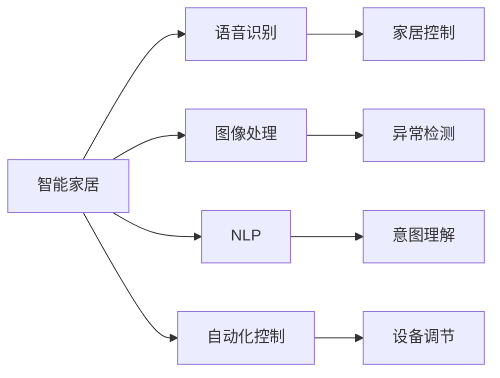

                 

# 人工智能在智能家居中的应用

> 关键词：人工智能, 智能家居, 语音识别, 图像处理, 自然语言处理, 自动化控制, 智能安防

## 1. 背景介绍

### 1.1 问题由来

随着物联网技术的发展，智能家居市场正逐渐升温。用户不再满足于传统的家电控制方式，开始追求更智能化、更个性化、更安全便捷的居住体验。为了应对这一需求，智能家居企业纷纷引入人工智能技术，通过语音识别、图像处理、自然语言处理等手段，提供更加智能化的家居解决方案。

智能家居涉及多个领域，如智能照明、智能空调、智能安防、智能家电等，其核心在于将人工智能技术与家居环境深度融合，提升用户的生活品质。人工智能技术的引入，能够有效降低家居管理的复杂度，使家电设备更加智能化、互动化、个性化。

### 1.2 问题核心关键点

智能家居中的人工智能应用，主要包括语音交互、图像识别、自然语言处理、自动化控制等多个方面。语音交互使得用户能够通过语音指令轻松控制家电设备，增强了家居的互动性。图像识别可以帮助系统自动识别环境状态，如检测火灾、监控异常行为等，提升家居安全。自然语言处理可以理解用户的自然语言描述，生成相应指令，减少交互复杂度。自动化控制则使得系统能够根据用户习惯自动调节设备运行参数，提供个性化服务。

这些技术共同构成了智能家居的基础设施，使得家庭环境变得更加安全、便捷、舒适。通过结合人工智能技术，智能家居能够提供更智能、更高效、更安全、更个性化的生活体验。

## 2. 核心概念与联系

### 2.1 核心概念概述

智能家居中的核心概念包括以下几个方面：

- **人工智能(Artificial Intelligence, AI)**：通过机器学习、深度学习等技术，使计算机系统具备自主学习、智能决策的能力。
- **智能家居(Smart Home)**：通过物联网技术将家电设备、家居环境互联互通，实现自动化控制、远程监控、个性化服务等功能，提高用户的生活质量。
- **语音识别(Speech Recognition)**：利用语音处理技术，将用户的语音指令转换为可执行的命令，实现语音控制。
- **图像处理(Image Processing)**：通过图像识别技术，对家居环境进行实时监控和分析，提供预警和建议。
- **自然语言处理(Natural Language Processing, NLP)**：使计算机能够理解和生成人类语言，通过自然语言与用户进行互动。
- **自动化控制(Automatic Control)**：根据用户习惯或环境变化，自动调整设备参数，实现智能化的家居管理。

这些概念之间的逻辑关系可以通过以下Mermaid流程图来展示：



这个流程图展示了智能家居的核心概念及其之间的关系：

1. 智能家居作为总体系统，集成语音识别、图像处理、自然语言处理和自动化控制等多种技术。
2. 语音识别技术使得用户可以通过语音指令控制家居设备，提升交互的便捷性。
3. 图像处理技术可以实时监控家居环境，检测异常行为或状态。
4. 自然语言处理技术使系统能够理解和生成自然语言，实现更加自然的人机交互。
5. 自动化控制技术根据用户习惯或环境变化，自动调整设备参数，实现智能化的家居管理。

这些技术共同构成了智能家居的运行框架，为用户提供更加智能、便捷、安全的居住体验。

## 3. 核心算法原理 & 具体操作步骤

### 3.1 算法原理概述

智能家居中的人工智能应用主要基于以下算法原理：

1. **语音识别算法**：利用深度学习模型，将语音信号转换为文本，再通过文本理解生成控制指令，实现语音控制家居设备。常用的算法包括深度神经网络(DNN)、卷积神经网络(CNN)、循环神经网络(RNN)、长短期记忆网络(LSTM)等。

2. **图像处理算法**：通过图像识别技术，对家居环境进行实时监控和分析。常用的算法包括卷积神经网络(CNN)、区域卷积神经网络(R-CNN)、单镜头多目标跟踪(Single Shot MultiBox Detector, SSD)等。

3. **自然语言处理算法**：使系统能够理解和生成自然语言，实现自然语言与用户互动。常用的算法包括基于规则的NLP方法、基于统计的NLP方法、基于深度学习的NLP方法等。

4. **自动化控制算法**：根据用户习惯或环境变化，自动调整设备参数，实现智能化的家居管理。常用的算法包括模糊控制、专家系统、遗传算法等。

### 3.2 算法步骤详解

智能家居中的人工智能应用主要包括以下几个步骤：

1. **数据采集**：通过传感器、摄像头、麦克风等设备，采集家居环境中的数据，如声音、图像、温度、湿度等。

2. **预处理**：对采集到的数据进行去噪、滤波、特征提取等预处理，为后续算法提供高质量的数据输入。

3. **算法训练**：利用深度学习模型，对预处理后的数据进行训练，生成语音识别、图像处理、自然语言处理等模型。

4. **模型推理**：将训练好的模型应用于家居环境中，实现语音控制、图像监控、自然语言互动等功能。

5. **自动化控制**：根据用户习惯或环境变化，自动调整设备参数，提供个性化服务。

6. **反馈优化**：根据用户反馈，对模型进行优化，提高其性能和适应性。

### 3.3 算法优缺点

智能家居中的人工智能应用具有以下优点：

1. **便捷性**：语音控制、自然语言互动等技术，使得用户可以更轻松地控制家居设备，提升生活便捷性。

2. **智能化**：图像监控、自动化控制等技术，可以实时监控家居环境，提高家居管理的安全性和效率。

3. **个性化**：根据用户习惯自动调节设备参数，提供个性化的生活体验。

4. **节能环保**：智能控制设备运行参数，减少能源浪费，提高环保效益。

然而，这些技术也存在以下缺点：

1. **隐私安全**：智能家居设备会采集大量用户数据，可能存在隐私泄露的风险。

2. **设备兼容性**：不同品牌、不同型号的设备，可能不兼容，影响系统集成。

3. **技术复杂性**：实现语音识别、图像处理、自然语言处理等技术，需要较高的技术门槛。

4. **成本高**：高质量的传感器、摄像头、麦克风等设备，以及深度学习模型的训练，需要较高的成本投入。

5. **可靠性**：家居设备在复杂环境下运行，可能会出现故障或误识别，影响用户体验。

### 3.4 算法应用领域

智能家居中的人工智能应用已经广泛应用于以下几个领域：

1. **智能照明**：通过语音控制、自动化控制等技术，实现智能照明，提高能源利用效率。

2. **智能空调**：利用图像处理技术检测环境温度，根据用户习惯自动调节空调参数，提供舒适的居住环境。

3. **智能安防**：通过图像识别技术监控异常行为，及时报警，提升家居安全性。

4. **智能家电**：如智能冰箱、智能洗衣机等，通过语音控制、自动化控制等技术，实现高效便捷的家庭管理。

5. **智能窗帘**：通过语音控制或自动化控制，实现窗帘的自动开合，提升居住体验。

6. **智能音箱**：通过语音识别和自然语言处理技术，实现音乐播放、语音查询等功能，提升家居娱乐体验。

这些应用场景展示了人工智能在智能家居中的广泛应用，为用户提供更加智能、便捷、安全、舒适的生活环境。

## 4. 数学模型和公式 & 详细讲解 & 举例说明

### 4.1 数学模型构建

智能家居中的人工智能应用主要基于以下数学模型：

1. **语音识别模型**：
   - 输入：声音信号
   - 输出：文本
   - 目标：最小化损失函数 $L$

2. **图像处理模型**：
   - 输入：图像数据
   - 输出：异常检测结果
   - 目标：最小化损失函数 $L$

3. **自然语言处理模型**：
   - 输入：自然语言文本
   - 输出：控制指令
   - 目标：最小化损失函数 $L$

4. **自动化控制模型**：
   - 输入：用户习惯、环境数据
   - 输出：设备参数调节策略
   - 目标：最小化损失函数 $L$

### 4.2 公式推导过程

以语音识别模型为例，假设输入声音信号为 $x$，输出文本为 $y$，损失函数为 $L$。则语音识别模型的最小化问题可以表示为：

$$
\min_{\theta} L(y, \hat{y}) = \min_{\theta} \frac{1}{N} \sum_{i=1}^N \ell(\hat{y}_i, y_i)
$$

其中 $\hat{y}$ 表示模型输出的文本，$\ell$ 为交叉熵损失函数。

### 4.3 案例分析与讲解

以智能照明系统为例，介绍语音识别技术在智能家居中的应用：

1. **数据采集**：通过麦克风采集用户语音信号，作为输入数据。

2. **预处理**：对采集到的语音信号进行去噪、滤波、特征提取等预处理，得到语音特征向量 $x$。

3. **模型训练**：利用深度学习模型（如LSTM、CNN等），对预处理后的语音特征向量进行训练，生成语音识别模型。

4. **模型推理**：将训练好的模型应用于家居环境中，根据用户语音指令，生成相应的控制命令，实现照明设备的自动控制。

5. **反馈优化**：根据用户反馈，对语音识别模型进行优化，提高其识别准确率。

## 5. 项目实践：代码实例和详细解释说明

### 5.1 开发环境搭建

智能家居中的人工智能应用开发需要搭建相应的开发环境，以下是Python环境搭建的步骤：

1. 安装Python：下载并安装Python，选择合适版本的Python解释器。

2. 安装Pip：通过终端输入以下命令，安装Pip包管理器：
   ```bash
   pip install pip
   ```

3. 安装相关库：安装语音识别、图像处理、自然语言处理等所需库，如SpeechRecognition、OpenCV、NLTK等：
   ```bash
   pip install SpeechRecognition
   pip install opencv-python
   pip install nltk
   ```

4. 搭建开发环境：通过Jupyter Notebook或PyCharm等IDE，搭建开发环境，开始编写代码。

### 5.2 源代码详细实现

以下是智能照明系统中语音识别技术的Python代码实现：

```python
from speech_recognition import SpeechRecognitionModel

class SmartLighting:
    def __init__(self):
        self.model = SpeechRecognitionModel()
        self.recognizer = speech_recognition.Recognizer()
    
    def start_recognition(self):
        with speech_recognition.Microphone() as source:
            audio = self.recognizer.listen(source)
            try:
                text = self.model.transcribe(audio)
                print("You said: ", text)
                # 根据语音指令控制照明设备
            except speech_recognition.UnknownValueError:
                print("Sorry, I did not understand")
                pass
            except speech_recognition.RequestError as e:
                print(f"Could not request results; {e}")

if __name__ == "__main__":
    lighting = SmartLighting()
    lighting.start_recognition()
```

### 5.3 代码解读与分析

上述代码中，`SpeechRecognitionModel` 类为语音识别模型，负责将语音信号转换为文本。`Recognizer` 类用于接收和处理麦克风输入的语音信号。`start_recognition` 方法用于启动语音识别过程，捕捉用户语音指令，并根据指令控制照明设备。

在实际应用中，还需要对模型进行训练，根据用户语音数据生成语音识别模型，并不断优化模型性能，以提高识别准确率和用户体验。

### 5.4 运行结果展示

运行上述代码，用户可以通过语音指令控制照明设备的开关、亮度调节等操作。例如，用户说“打开卧室灯”，系统会根据语音指令打开卧室的照明设备。

## 6. 实际应用场景

### 6.1 智能照明

智能照明系统利用语音识别和自动化控制技术，根据用户语音指令和环境数据，自动调节照明设备参数，提供舒适便捷的照明体验。

例如，用户可以通过语音控制“打开客厅灯”、“调暗厨房灯”、“关闭所有灯”等操作，系统会根据用户指令和环境数据，自动调节照明设备的亮度和色温，满足用户的个性化需求。

### 6.2 智能空调

智能空调系统利用图像处理和自动化控制技术，检测家居环境温度，根据用户习惯自动调节空调参数，提供舒适的居住环境。

例如，系统可以通过摄像头实时监控房间温度，检测用户是否在房间内，并根据用户的活动情况自动调节空调参数，保持适宜的温度和湿度，提高用户的舒适度。

### 6.3 智能安防

智能安防系统利用图像处理技术，实时监控家居环境，检测异常行为，及时报警，提升家居安全性。

例如，系统可以通过摄像头监控门口、窗户等重要区域，检测是否有陌生人进入，或检测门窗是否被撬开，及时发出警报，提醒用户注意安全。

### 6.4 未来应用展望

未来，智能家居中的人工智能应用将不断扩展，涵盖更多场景和功能。以下是一些未来应用展望：

1. **智能窗帘**：通过语音控制或自动化控制，实现窗帘的自动开合，提升居住体验。

2. **智能电视**：利用自然语言处理技术，实现语音控制电视开关、频道切换、音量调节等功能，提升用户体验。

3. **智能冰箱**：通过图像识别技术，检测食品库存，自动购买相关食品，提升便利性。

4. **智能健康监测**：利用传感器和图像处理技术，实时监控用户健康状况，提供个性化的健康建议，提升生活质量。

5. **智能语音助手**：通过语音识别和自然语言处理技术，实现全面的家庭智能管理，提升家居自动化水平。

6. **智能家居控制系统**：通过智能设备之间的互联互通，实现全家居系统的自动化控制和远程管理，提高家居管理的效率和便利性。

这些应用场景展示了人工智能在智能家居中的广泛应用，为用户提供更加智能、便捷、安全、舒适的生活环境。

## 7. 工具和资源推荐

### 7.1 学习资源推荐

为了帮助开发者系统掌握智能家居中的人工智能技术，以下是一些优质的学习资源：

1. **《智能家居技术手册》**：介绍了智能家居中的各种技术，包括语音识别、图像处理、自动化控制等，适合初学者入门。

2. **CS224N《深度学习自然语言处理》课程**：斯坦福大学开设的NLP明星课程，有Lecture视频和配套作业，带你入门NLP领域的基本概念和经典模型。

3. **《深度学习与智能家居》书籍**：详细介绍了深度学习在智能家居中的应用，涵盖语音识别、图像处理、自然语言处理等多个领域。

4. **智能家居开源项目**：如智能照明、智能空调等，可以参考这些项目代码，快速上手实践。

5. **HuggingFace官方文档**：包含大量预训练语言模型和工具，适合深度学习和自然语言处理的学习和实践。

通过对这些资源的学习实践，相信你一定能够快速掌握智能家居中的人工智能技术，并用于解决实际的家居问题。

### 7.2 开发工具推荐

智能家居中的人工智能应用开发需要选择合适的开发工具，以下是几款常用的工具：

1. **Jupyter Notebook**：免费的在线编程环境，支持多种语言，适合进行深度学习和自然语言处理任务的开发。

2. **PyCharm**：专业的Python IDE，提供强大的代码编辑器和调试工具，适合进行智能家居系统的开发。

3. **SpeechRecognition**：Python语音识别库，支持多种语音识别引擎，适合进行语音控制系统的开发。

4. **OpenCV**：开源计算机视觉库，支持图像处理和计算机视觉任务，适合进行智能安防系统的开发。

5. **TensorFlow**：由Google主导开发的深度学习框架，支持多种深度学习模型，适合进行智能家居中的人工智能应用开发。

合理利用这些工具，可以显著提升智能家居中的人工智能应用的开发效率，加快创新迭代的步伐。

### 7.3 相关论文推荐

智能家居中的人工智能技术的发展源于学界的持续研究。以下是几篇奠基性的相关论文，推荐阅读：

1. **Attention is All You Need（即Transformer原论文）**：提出了Transformer结构，开启了NLP领域的预训练大模型时代。

2. **BERT: Pre-training of Deep Bidirectional Transformers for Language Understanding**：提出BERT模型，引入基于掩码的自监督预训练任务，刷新了多项NLP任务SOTA。

3. **Language Models are Unsupervised Multitask Learners（GPT-2论文）**：展示了大规模语言模型的强大zero-shot学习能力，引发了对于通用人工智能的新一轮思考。

4. **Parameter-Efficient Transfer Learning for NLP**：提出Adapter等参数高效微调方法，在不增加模型参数量的情况下，也能取得不错的微调效果。

5. **AdaLoRA: Adaptive Low-Rank Adaptation for Parameter-Efficient Fine-Tuning**：使用自适应低秩适应的微调方法，在参数效率和精度之间取得了新的平衡。

这些论文代表了大规模语言模型微调技术的发展脉络。通过学习这些前沿成果，可以帮助研究者把握学科前进方向，激发更多的创新灵感。

## 8. 总结：未来发展趋势与挑战

### 8.1 总结

本文对智能家居中的人工智能应用进行了全面系统的介绍。首先阐述了智能家居中的人工智能应用背景和意义，明确了语音识别、图像处理、自然语言处理和自动化控制等多个核心概念，展示了这些技术在智能家居中的应用价值。其次，从原理到实践，详细讲解了智能家居中的人工智能应用的算法原理和具体操作步骤，给出了智能照明系统的Python代码实现，展示了智能家居的实际应用场景。同时，本文还推荐了一些优质的学习资源、开发工具和相关论文，力求为开发者提供全方位的技术指引。

通过本文的系统梳理，可以看到，智能家居中的人工智能应用已经取得了显著成果，为用户提供了更加智能、便捷、安全、舒适的生活环境。未来，随着技术的不断进步和创新，智能家居中的人工智能应用将进一步扩展，为用户提供更多个性化的生活体验。

### 8.2 未来发展趋势

展望未来，智能家居中的人工智能应用将呈现以下几个发展趋势：

1. **智能化水平提升**：随着技术的不断进步，智能家居中的语音识别、图像处理、自然语言处理和自动化控制技术将不断提升，提供更加智能化、便捷化的家居环境。

2. **生态系统完善**：智能家居设备将更加标准化、兼容化，形成一个完整的智能家居生态系统，提升用户的使用体验。

3. **个性化定制**：根据用户的个性化需求，定制化的智能家居系统将不断涌现，提供更加个性化的家居服务。

4. **智能化集成**：智能家居系统将更加集成化，通过智能音箱、智能电视等中心设备，实现全家居系统的智能控制和管理。

5. **智能化协同**：智能家居中的设备将更加协同化，实现设备间的联动和智能调度，提高家居管理的效率和便利性。

6. **智能化交互**：智能家居将更加自然化、智能化的交互方式，通过语音、图像、自然语言等多种方式，提供更加丰富、便捷的用户体验。

这些趋势展示了智能家居中的人工智能应用的广阔前景，为用户提供了更加智能、便捷、安全、舒适的生活环境。

### 8.3 面临的挑战

尽管智能家居中的人工智能应用已经取得了显著成果，但在迈向更加智能化、普适化应用的过程中，仍面临以下挑战：

1. **隐私安全**：智能家居设备会采集大量用户数据，可能存在隐私泄露的风险。如何保护用户数据隐私，保障用户信息安全，将是重要的挑战。

2. **设备兼容性**：不同品牌、不同型号的设备，可能不兼容，影响系统集成。如何实现设备的兼容性和标准化，将是重要的挑战。

3. **技术复杂性**：实现语音识别、图像处理、自然语言处理等技术，需要较高的技术门槛。如何降低技术门槛，提高系统的易用性，将是重要的挑战。

4. **成本高**：高质量的传感器、摄像头、麦克风等设备，以及深度学习模型的训练，需要较高的成本投入。如何降低成本，提高系统的经济性，将是重要的挑战。

5. **可靠性**：家居设备在复杂环境下运行，可能会出现故障或误识别，影响用户体验。如何提高系统的可靠性和稳定性，将是重要的挑战。

6. **可解释性**：智能家居系统需要具备可解释性，用户需要理解系统的决策过程和输出结果。如何提高系统的可解释性，将是重要的挑战。

### 8.4 研究展望

面对智能家居中的人工智能应用面临的挑战，未来的研究需要在以下几个方面寻求新的突破：

1. **隐私保护技术**：开发更加安全的隐私保护技术，如数据加密、差分隐私等，保障用户数据隐私。

2. **设备标准化**：制定智能家居设备的标准化规范，提高设备间的兼容性和集成性。

3. **技术普及化**：开发更加简单易用的智能家居开发工具和平台，降低技术门槛，提高系统的易用性。

4. **成本优化**：开发更加高效的传感器、摄像头、麦克风等设备，降低成本投入。

5. **可靠性提升**：提高智能家居设备的可靠性，减少故障和误识别，提高系统的稳定性和用户体验。

6. **可解释性增强**：开发更加可解释的智能家居系统，使用户能够理解系统的决策过程和输出结果，增强系统的透明度和可信度。

这些研究方向将引领智能家居中的人工智能应用迈向更高的台阶，为用户提供更加智能、便捷、安全、舒适的生活环境。

## 9. 附录：常见问题与解答

**Q1：智能家居中的语音识别技术是否只能实现中文语音控制？**

A: 智能家居中的语音识别技术并不仅限于中文，可以使用多语言模型进行语音控制。对于多语言智能家居系统，可以根据用户选择的语言，切换对应的语音识别模型。例如，用户可以使用中文、英文、日语等多种语言控制家居设备。

**Q2：智能家居中的图像处理技术能否检测到所有异常行为？**

A: 智能家居中的图像处理技术能够检测到大部分异常行为，但可能存在误判或漏判的情况。例如，系统可能无法检测到轻微的异常行为，如缓慢的移动。因此，系统需要不断优化和升级，提高异常检测的准确性和实时性。

**Q3：智能家居中的自动化控制技术是否能够完全替代手动控制？**

A: 智能家居中的自动化控制技术能够根据用户习惯自动调节设备参数，提供个性化的生活体验。但手动控制仍然是不可或缺的，因为用户可能在一些特殊情况下需要进行手动操作。例如，用户可能需要在某些特殊情况下手动调节空调的温度或亮度。

**Q4：智能家居中的语音识别技术能否处理多种口音和方言？**

A: 智能家居中的语音识别技术可以处理多种口音和方言，但不同口音和方言的识别效果可能存在差异。例如，对于一些较为复杂的口音和方言，系统可能需要进行额外的训练和优化，以提高识别准确率。

**Q5：智能家居中的图像处理技术如何实现实时监控？**

A: 智能家居中的图像处理技术可以通过摄像头实时采集家居环境数据，利用计算机视觉算法进行实时分析。例如，系统可以通过摄像头监控门口、窗户等重要区域，检测是否有陌生人进入，或检测门窗是否被撬开，及时发出警报，提醒用户注意安全。

总之，智能家居中的人工智能应用具有广阔的发展前景，通过不断创新和优化，将为用户提供更加智能、便捷、安全、舒适的生活环境。未来，随着技术的不断进步和创新，智能家居中的人工智能应用将进一步扩展，为用户带来更多个性化的生活体验。

---

作者：禅与计算机程序设计艺术 / Zen and the Art of Computer Programming

