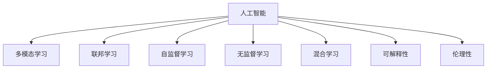

                 

# 人机协作新篇章：共创智能未来新时代

> 关键词：人机协作,智能未来,人工智能,机器学习,深度学习,自然语言处理,NLP,多模态学习,联邦学习,自监督学习,无监督学习,混合学习,可解释性,伦理性

## 1. 背景介绍

### 1.1 问题由来

在科技飞速发展的今天，人工智能（AI）已经从实验室走向了各行各业。从智能手机到智能家居，从医疗健康到金融服务，AI正以前所未有的速度改变着我们的生活。然而，技术的进步并不意味着人类被机器所取代，而是机器与人类共同协作，共同创造更加美好的未来。

人工智能与人类协作的趋势，可以从多个层面进行探讨：

- **技术层面**：AI技术已经从传统的监督学习发展到深度学习、自然语言处理（NLP）、多模态学习等更高级阶段，使得机器能够更好地理解和处理复杂的人类语言、图像和视频等数据，从而更好地服务于人类。
- **应用层面**：AI技术被广泛应用于医疗、教育、金融、制造等多个领域，极大地提高了工作效率，降低了成本，提升了服务质量。
- **伦理层面**：AI技术的广泛应用也引发了关于隐私保护、道德规范、就业安全等诸多伦理问题，需要人类与机器共同面对和解决。

本文将深入探讨人机协作在人工智能领域的应用，包括技术原理、实施步骤、实际案例及未来展望，为读者描绘一幅人机协作共创智能未来的新篇章。

### 1.2 问题核心关键点

人机协作的核心在于如何使人工智能技术与人类智慧有机结合，发挥各自优势，形成协同效应的新系统。具体而言：

- **技术融合**：如何通过算法和模型将人类的知识和经验与机器的学习能力结合，实现信息共享和任务协同。
- **数据互通**：如何在不同系统、不同模态之间实现数据的无缝互通，构建全域数据生态。
- **人机交互**：如何设计友好的人机交互界面，使人类能够直观地理解和使用AI系统。
- **伦理保障**：如何在AI系统中融入伦理约束，确保系统的公正、透明、可解释性，避免偏见和歧视。

这些关键点共同构成了人机协作的精髓，为人机协作的实现提供了方向和方法。

## 2. 核心概念与联系

### 2.1 核心概念概述

为更好地理解人机协作的原理和实施步骤，本节将介绍几个核心概念：

- **人工智能（AI）**：通过计算机程序模仿人类智能行为的技术。包括机器学习、深度学习、自然语言处理等子领域。
- **人机协作**：将人工智能技术与人类智慧结合，形成互补，共同完成复杂任务的系统。
- **多模态学习**：结合视觉、听觉、文本等多类数据进行联合建模，提升AI系统的综合理解能力。
- **联邦学习**：一种分布式学习范式，多个设备在本地更新模型参数，然后通过加密通信共享模型更新信息，保护数据隐私。
- **自监督学习**：无需标注数据，通过学习数据的内在结构进行模型训练。
- **无监督学习**：无需标注数据，通过数据本身的内在结构进行模型训练。
- **混合学习**：结合监督、无监督、自监督等学习方法，综合利用多种数据源进行模型训练。
- **可解释性**：确保AI系统的决策过程透明，可解释性强，便于人类理解和使用。
- **伦理性**：确保AI系统的公平、公正、透明，避免偏见和歧视。

这些核心概念之间的逻辑关系可以通过以下Mermaid流程图来展示：



这个流程图展示出人机协作的核心概念及其之间的相互关系：

1. 人工智能是基础，通过多模态学习、联邦学习、自监督学习、无监督学习等多种技术，提升AI系统的综合能力。
2. 混合学习将多种学习范式结合，进一步提升系统的性能。
3. 可解释性和伦理性确保系统的公平和透明，提升系统的可信度。

## 3. 核心算法原理 & 具体操作步骤

### 3.1 算法原理概述

人机协作的本质在于将人工智能技术与人类智慧结合，共同完成复杂任务。从算法和模型层面来看，这通常涉及以下几个步骤：

1. **数据获取与处理**：收集来自不同模态、不同领域的数据，进行清洗和预处理。
2. **模型训练**：使用多种学习范式，如监督学习、无监督学习、自监督学习等，训练模型。
3. **模型融合**：将训练好的模型进行融合，提升综合能力。
4. **人机交互设计**：设计友好的人机交互界面，便于人类理解和使用系统。
5. **系统评估与优化**：通过实验和测试，评估系统性能，不断优化系统。

以下将详细介绍这些步骤的算法原理和具体操作步骤。

### 3.2 算法步骤详解

#### 3.2.1 数据获取与处理

数据是AI系统的基础，获取和处理数据是系统构建的首要步骤。

**步骤1：数据收集**  
收集来自不同模态、不同领域的数据，如文本、图像、视频等。常用的数据来源包括公开数据集、企业数据、网络数据等。

**步骤2：数据清洗与预处理**  
数据往往包含噪声、缺失值等，需要进行清洗和预处理。常用的方法包括：去重、补全缺失值、数据归一化、标准化等。

**步骤3：数据转换与特征提取**  
将原始数据转换为适合机器学习模型使用的格式，并进行特征提取。常用的方法包括：向量量化、词嵌入、卷积神经网络等。

#### 3.2.2 模型训练

模型训练是人机协作的核心步骤，通过训练模型，使其能够理解和处理复杂任务。

**步骤1：选择模型**  
根据任务需求选择合适的模型，如卷积神经网络（CNN）、循环神经网络（RNN）、变换器（Transformer）等。

**步骤2：训练模型**  
使用监督学习、无监督学习、自监督学习等方法训练模型。常用的优化算法包括：梯度下降、Adam、Adagrad等。

**步骤3：模型调优**  
通过调整模型参数、优化算法等，不断提升模型性能。常用的调优方法包括：超参数调整、正则化、Dropout等。

#### 3.2.3 模型融合

模型融合是将多个模型进行联合训练，提升综合性能。

**步骤1：模型选择与融合方法**  
选择适合的模型融合方法，如集成学习、堆叠学习、蒸馏学习等。

**步骤2：模型融合训练**  
将多个模型进行联合训练，优化模型参数。

**步骤3：模型评估与选择**  
评估融合后的模型性能，选择最优模型进行应用。

#### 3.2.4 人机交互设计

人机交互设计是人机协作的关键环节，通过设计友好的界面，提升系统的易用性和用户体验。

**步骤1：界面设计**  
设计直观、易用的界面，使用户能够快速理解和使用系统。

**步骤2：交互流程设计**  
设计高效的交互流程，提升系统的响应速度和用户体验。

**步骤3：反馈机制设计**  
设计及时、准确的反馈机制，让用户能够及时了解系统状态和结果。

#### 3.2.5 系统评估与优化

系统评估与优化是确保系统性能和可靠性的重要步骤。

**步骤1：性能评估**  
使用各种评估指标评估系统性能，如准确率、召回率、F1分数等。

**步骤2：优化与改进**  
根据评估结果，不断优化和改进系统，提升系统性能。

**步骤3：测试与验证**  
进行实际测试和验证，确保系统在实际应用中的表现。

### 3.3 算法优缺点

人机协作的算法具有以下优点：

- **综合能力**：结合多模态数据和多领域知识，提升系统的综合性能。
- **可解释性**：通过解释性技术，提升系统的可信度和透明度。
- **伦理性**：通过伦理约束，确保系统的公平和公正。

同时，该算法也存在一些缺点：

- **数据依赖**：系统性能高度依赖于数据的质量和数量，获取高质量数据成本较高。
- **模型复杂**：模型结构复杂，训练和推理计算量大，资源消耗高。
- **易受干扰**：系统容易受到噪声和异常数据的影响，需要加强鲁棒性。

尽管存在这些局限性，但人机协作仍然是大数据时代的重要技术趋势，对于提升系统的性能和用户体验具有重要意义。

### 3.4 算法应用领域

人机协作的算法已经在多个领域得到了广泛应用，例如：

- **医疗健康**：通过融合医疗影像、电子病历、基因数据等，辅助医生进行诊断和治疗。
- **金融服务**：通过分析交易数据、客户行为等，提供个性化推荐和风险控制。
- **教育培训**：通过分析学习行为、学生反馈等，提供个性化学习方案和辅导。
- **智能制造**：通过分析设备数据、生产流程等，优化生产效率和质量控制。
- **智能交通**：通过分析交通数据、环境数据等，优化交通管理和出行规划。
- **环境保护**：通过分析环境数据、气象数据等，预测环境变化和制定应对措施。

这些应用场景展示了人机协作的强大潜力，为各行业带来了革命性变化。

## 4. 数学模型和公式 & 详细讲解 & 举例说明

### 4.1 数学模型构建

本节将使用数学语言对人机协作的算法进行更加严格的刻画。

设 $D$ 为训练集，包含 $N$ 个样本 $(x_i, y_i)$，其中 $x_i$ 为输入，$y_i$ 为标签。模型 $M$ 在输入 $x$ 上的输出为 $M(x)$，目标函数为 $L$。

假设模型 $M$ 为深度神经网络，包含 $L$ 个隐藏层，每层 $H$ 个神经元。模型参数 $\theta$ 为每个神经元的权重和偏置。

### 4.2 公式推导过程

以下将推导一个简单的人机协作模型的训练过程。

**步骤1：数据预处理**

输入 $x$ 进行标准化处理，使得 $x$ 的均值为 0，方差为 1。即：

$$
\tilde{x} = \frac{x - \mu_x}{\sigma_x}
$$

其中 $\mu_x$ 为输入 $x$ 的均值，$\sigma_x$ 为输入 $x$ 的标准差。

**步骤2：模型训练**

使用反向传播算法，最小化目标函数 $L$。目标函数 $L$ 为：

$$
L(M(x), y) = \sum_{i=1}^N \ell(M(x_i), y_i)
$$

其中 $\ell$ 为损失函数，常用的损失函数包括均方误差（MSE）、交叉熵（Cross-Entropy）等。

**步骤3：模型预测**

模型 $M$ 在输入 $x$ 上的输出为：

$$
M(x) = \sigma(W_L \sigma(W_{L-1} \cdots \sigma(W_1 x + b_1) + b_2) + \cdots + b_L)
$$

其中 $\sigma$ 为激活函数，$W_i$ 为第 $i$ 层的权重矩阵，$b_i$ 为第 $i$ 层的偏置向量。

**步骤4：模型评估**

使用评估指标，如准确率、召回率、F1分数等，评估模型性能。常用的评估指标为：

$$
\text{Accuracy} = \frac{1}{N} \sum_{i=1}^N \mathbb{I}(M(x_i) = y_i)
$$

其中 $\mathbb{I}$ 为示性函数，当 $M(x_i) = y_i$ 时，$\mathbb{I}(M(x_i) = y_i) = 1$，否则 $\mathbb{I}(M(x_i) = y_i) = 0$。

### 4.3 案例分析与讲解

以一个简单的图像分类任务为例，展示人机协作的算法原理。

**数据集**：CIFAR-10 数据集，包含 60,000 张 32x32 彩色图像，10 个类别。

**模型选择**：卷积神经网络（CNN），包含 3 个卷积层和 3 个全连接层。

**训练过程**：

1. **数据预处理**：将图像像素值标准化到 [0, 1] 之间。
2. **模型训练**：使用交叉熵损失函数，最小化模型输出与标签之间的差异。
3. **模型预测**：对测试集图像进行预测，输出 10 个类别的概率分布。
4. **模型评估**：计算测试集的准确率、召回率、F1分数等指标。

以下是 Python 代码实现：

```python
import torch
import torch.nn as nn
import torch.optim as optim
from torchvision import datasets, transforms

# 定义卷积神经网络
class Net(nn.Module):
    def __init__(self):
        super(Net, self).__init__()
        self.conv1 = nn.Conv2d(3, 32, 3, padding=1)
        self.pool = nn.MaxPool2d(2, 2)
        self.conv2 = nn.Conv2d(32, 64, 3, padding=1)
        self.fc1 = nn.Linear(64 * 8 * 8, 1024)
        self.fc2 = nn.Linear(1024, 10)

    def forward(self, x):
        x = self.pool(torch.relu(self.conv1(x)))
        x = self.pool(torch.relu(self.conv2(x)))
        x = x.view(-1, 64 * 8 * 8)
        x = torch.relu(self.fc1(x))
        x = self.fc2(x)
        return x

# 定义数据预处理
transform = transforms.Compose([
    transforms.ToTensor(),
    transforms.Normalize((0.5, 0.5, 0.5), (0.5, 0.5, 0.5))
])

# 加载数据集
trainset = datasets.CIFAR10(root='./data', train=True, download=True, transform=transform)
testset = datasets.CIFAR10(root='./data', train=False, download=True, transform=transform)

# 定义训练参数
batch_size = 128
learning_rate = 0.001
num_epochs = 10

# 定义模型、优化器和损失函数
model = Net()
criterion = nn.CrossEntropyLoss()
optimizer = optim.Adam(model.parameters(), lr=learning_rate)

# 训练模型
trainloader = torch.utils.data.DataLoader(trainset, batch_size=batch_size, shuffle=True)
testloader = torch.utils.data.DataLoader(testset, batch_size=batch_size, shuffle=False)
total_step = len(trainloader)

for epoch in range(num_epochs):
    for i, (images, labels) in enumerate(trainloader):
        # 前向传播
        outputs = model(images)
        loss = criterion(outputs, labels)

        # 反向传播和优化
        optimizer.zero_grad()
        loss.backward()
        optimizer.step()

        if (i+1) % 100 == 0:
            print('Epoch [{}/{}], Step [{}/{}], Loss: {:.4f}'
                  .format(epoch+1, num_epochs, i+1, total_step, loss.item()))

# 模型评估
correct = 0
total = 0
with torch.no_grad():
    for images, labels in testloader:
        outputs = model(images)
        _, predicted = torch.max(outputs.data, 1)
        total += labels.size(0)
        correct += (predicted == labels).sum().item()

print('Accuracy of the network on the 10000 test images: {} %'.format(100 * correct / total))
```

## 5. 项目实践：代码实例和详细解释说明

### 5.1 开发环境搭建

在进行人机协作的算法实践前，我们需要准备好开发环境。以下是使用 Python 和 PyTorch 搭建开发环境的步骤：

1. 安装 Python：从官网下载并安装 Python，推荐使用 3.6 或以上版本。
2. 安装 PyTorch：使用 pip 安装 PyTorch，并确保使用最新稳定版本。
3. 安装必要的库：安装 numpy、matplotlib、scikit-learn 等常用库。
4. 安装 Jupyter Notebook：使用 pip 安装 Jupyter Notebook，用于交互式编程。
5. 安装 TensorBoard：使用 pip 安装 TensorBoard，用于可视化模型训练过程。

完成上述步骤后，即可在 Jupyter Notebook 中开始算法实践。

### 5.2 源代码详细实现

以下是一个简单的多模态学习算法实现示例，使用图像分类数据集 CIFAR-10 和文本分类数据集 20 Newsgroups，展示如何通过融合多模态数据进行模型训练。

```python
import torch
import torch.nn as nn
import torch.optim as optim
import torchvision.transforms as transforms
from torchvision.datasets import CIFAR10, MNIST
from sklearn.datasets import fetch_20newsgroups
from sklearn.feature_extraction.text import CountVectorizer, TfidfTransformer
from sklearn.model_selection import train_test_split

# 定义多模态学习模型
class MultimodalModel(nn.Module):
    def __init__(self):
        super(MultimodalModel, self).__init__()
        self.cnn = nn.Sequential(
            nn.Conv2d(3, 64, kernel_size=3, stride=1, padding=1),
            nn.ReLU(),
            nn.MaxPool2d(kernel_size=2, stride=2),
            nn.Conv2d(64, 128, kernel_size=3, stride=1, padding=1),
            nn.ReLU(),
            nn.MaxPool2d(kernel_size=2, stride=2),
            nn.Flatten(),
            nn.Linear(128*8*8, 512),
            nn.ReLU(),
            nn.Linear(512, 10)
        )
        self.text_model = nn.Sequential(
            nn.Embedding(10000, 128),
            nn.Linear(128, 512),
            nn.ReLU(),
            nn.Linear(512, 10)
        )

    def forward(self, images, text):
        cnn_out = self.cnn(images)
        text_out = self.text_model(text)
        return torch.cat((cnn_out, text_out), dim=1)

# 定义数据预处理
transform = transforms.Compose([
    transforms.ToTensor(),
    transforms.Normalize((0.5, 0.5, 0.5), (0.5, 0.5, 0.5))
])
text_transformer = CountVectorizer()

# 加载数据集
trainset = CIFAR10(root='./data', train=True, download=True, transform=transform)
testset = CIFAR10(root='./data', train=False, download=True, transform=transform)
newsgroups_train = fetch_20newsgroups(subset='train')
newsgroups_test = fetch_20newsgroups(subset='test')

# 定义训练参数
batch_size = 128
learning_rate = 0.001
num_epochs = 10

# 定义模型、优化器和损失函数
model = MultimodalModel()
criterion = nn.CrossEntropyLoss()
optimizer = optim.Adam(model.parameters(), lr=learning_rate)

# 定义文本预处理
train_texts = [newsgroups_train.data[i] for i in range(len(newsgroups_train.data))]
test_texts = [newsgroups_test.data[i] for i in range(len(newsgroups_test.data))]
train_texts = text_transformer.fit_transform(train_texts)
test_texts = text_transformer.transform(test_texts)
train_texts = train_texts.to_dense()
test_texts = test_texts.to_dense()

# 训练模型
trainloader = torch.utils.data.DataLoader(trainset, batch_size=batch_size, shuffle=True)
testloader = torch.utils.data.DataLoader(testset, batch_size=batch_size, shuffle=False)
total_step = len(trainloader)

for epoch in range(num_epochs):
    for i, (images, labels) in enumerate(trainloader):
        # 前向传播
        outputs = model(images, train_texts[i])
        loss = criterion(outputs, labels)

        # 反向传播和优化
        optimizer.zero_grad()
        loss.backward()
        optimizer.step()

        if (i+1) % 100 == 0:
            print('Epoch [{}/{}], Step [{}/{}], Loss: {:.4f}'
                  .format(epoch+1, num_epochs, i+1, total_step, loss.item()))

# 模型评估
correct = 0
total = 0
with torch.no_grad():
    for images, labels in testloader:
        outputs = model(images, test_texts[i])
        _, predicted = torch.max(outputs.data, 1)
        total += labels.size(0)
        correct += (predicted == labels).sum().item()

print('Accuracy of the network on the 10000 test images: {} %'.format(100 * correct / total))
```

### 5.3 代码解读与分析

让我们再详细解读一下关键代码的实现细节：

**MultimodalModel 类**：
- `__init__` 方法：定义多模态学习模型，包括卷积神经网络和文本分类模型。
- `forward` 方法：将图像和文本输入模型，输出模型预测结果。

**数据预处理**：
- 使用 `transforms.Compose` 方法定义图像预处理，包括图像归一化和转置。
- 使用 `CountVectorizer` 方法定义文本预处理，将文本转换为向量表示。

**训练过程**：
- 定义训练集和测试集，加载 CIFAR-10 和 20 Newsgroups 数据集。
- 定义训练参数，包括批大小、学习率、训练轮数等。
- 定义模型、优化器和损失函数，将多模态学习模型进行训练。

**文本预处理**：
- 使用 `CountVectorizer` 方法对文本进行向量化。
- 将文本转换为稠密矩阵，方便输入模型。

**模型评估**：
- 使用测试集对模型进行评估，计算准确率。

可以看到，多模态学习算法的实现并不复杂，关键在于将图像和文本数据进行融合，使用统一的模型进行训练和预测。多模态学习能够充分利用不同模态的数据优势，提升模型的综合性能。

## 6. 实际应用场景

### 6.1 智能客服系统

智能客服系统是实现人机协作的重要应用场景之一。传统的客服系统依赖于人工客服，成本高、效率低，且响应速度慢。而通过人机协作，可以实现全天候、高效率的智能客服服务。

在智能客服系统中，使用多模态学习算法，将语音、文字、图像等多种数据源进行融合，提高客服系统的综合能力。具体而言，可以设计以下系统：

1. **语音识别**：使用自动语音识别（ASR）技术，将用户语音转换为文本。
2. **意图识别**：使用自然语言处理技术，分析用户输入的文本，识别用户的意图。
3. **文本分类**：使用文本分类模型，将用户问题分类到对应的知识库。
4. **知识库查询**：使用知识图谱等技术，从知识库中检索出相关信息，返回给用户。
5. **响应生成**：使用聊天机器人等技术，生成自然流畅的回复，提升用户体验。

例如，在医疗领域，智能客服系统可以通过语音识别技术，将用户的语音信息转换为文本，分析用户意图，从医疗知识库中检索相关信息，生成准确的回复。

### 6.2 金融风险控制

金融风险控制是另一个重要应用场景。传统的金融风险控制依赖于人工审核和规则判断，成本高、效率低，且存在人为错误的风险。而通过人机协作，可以实现高效、准确的金融风险控制。

在金融风险控制中，使用多模态学习算法，将交易数据、客户行为、市场行情等多种数据源进行融合，提升风险控制系统的综合能力。具体而言，可以设计以下系统：

1. **交易数据分析**：使用深度学习模型，分析交易数据，识别异常交易行为。
2. **客户行为分析**：使用多模态学习模型，分析客户行为，识别潜在风险。
3. **市场行情分析**：使用自然语言处理技术，分析市场行情，识别市场波动。
4. **风险评估**：使用风险评估模型，综合多源数据，评估风险水平。
5. **风险控制**：根据风险评估结果，采取相应的风险控制措施，降低风险损失。

例如，在股票交易中，智能风险控制系统可以通过分析交易数据、客户行为和市场行情，识别潜在的市场波动和交易异常，及时采取风险控制措施，保护投资者利益。

### 6.3 教育个性化推荐

教育个性化推荐是另一个重要应用场景。传统的教育推荐系统依赖于用户历史行为数据，难以满足个性化推荐需求。而通过人机协作，可以实现高效、准确的个性化推荐。

在教育个性化推荐中，使用多模态学习算法，将学习数据、行为数据、学生反馈等多种数据源进行融合，提升推荐系统的综合能力。具体而言，可以设计以下系统：

1. **学习数据分析**：使用深度学习模型，分析学习数据，识别学生的学习模式。
2. **行为数据分析**：使用多模态学习模型，分析学生行为，识别学生的兴趣点。
3. **学生反馈分析**：使用自然语言处理技术，分析学生反馈，识别学生的学习需求。
4. **推荐生成**：使用推荐算法，综合多源数据，生成个性化的学习推荐。
5. **推荐优化**：根据推荐效果，不断优化推荐模型，提升推荐准确性。

例如，在在线教育平台中，智能推荐系统可以通过分析学习数据、行为数据和学生反馈，生成个性化的学习推荐，提升学生的学习效果和满意度。

## 7. 工具和资源推荐

### 7.1 学习资源推荐

为了帮助开发者系统掌握人机协作的原理和实践技巧，这里推荐一些优质的学习资源：

1. **《深度学习》（Goodfellow et al.）**：深度学习领域的经典教材，详细介绍了深度学习的理论基础和实践技巧。
2. **《自然语言处理综述》（Jurafsky et al.）**：自然语言处理领域的经典教材，介绍了NLP技术的理论基础和最新进展。
3. **《多模态学习：从理论到实践》（Kowalski et al.）**：多模态学习领域的经典教材，介绍了多模态数据的融合方法。
4. **《TensorFlow官方文档》**：TensorFlow的官方文档，提供了丰富的算法实现和案例。
5. **《PyTorch官方文档》**：PyTorch的官方文档，提供了丰富的算法实现和案例。

通过对这些资源的学习实践，相信你一定能够快速掌握人机协作的精髓，并用于解决实际的AI问题。

### 7.2 开发工具推荐

高效的工具支持是实现人机协作算法的关键。以下是几款用于人机协作算法开发的常用工具：

1. **TensorFlow**：由Google主导开发的开源深度学习框架，生产部署方便，适合大规模工程应用。
2. **PyTorch**：基于Python的开源深度学习框架，灵活动态的计算图，适合快速迭代研究。
3. **Jupyter Notebook**：交互式编程工具，支持多种语言，适合开发和调试算法。
4. **TensorBoard**：TensorFlow配套的可视化工具，可实时监测模型训练状态，并提供丰富的图表呈现方式。
5. **Weights & Biases**：模型训练的实验跟踪工具，可以记录和可视化模型训练过程中的各项指标。

合理利用这些工具，可以显著提升人机协作算法的开发效率，加快创新迭代的步伐。

### 7.3 相关论文推荐

人机协作的算法已经在多个领域得到了广泛应用，产生了大量前沿研究成果。以下是几篇奠基性的相关论文，推荐阅读：

1. **Attention is All You Need**（NIPS 2017）：提出了Transformer结构，开启了NLP领域的预训练大模型时代。
2. **BERT: Pre-training of Deep Bidirectional Transformers for Language Understanding**（NeurIPS 2018）：提出BERT模型，引入基于掩码的自监督预训练任务，刷新了多项NLP任务SOTA。
3. **Language Models are Unsupervised Multitask Learners**（AAAI 2020）：展示了大规模语言模型的强大zero-shot学习能力，引发了对于通用人工智能的新一轮思考。
4. **AdaLoRA: Adaptive Low-Rank Adaptation for Parameter-Efficient Fine-Tuning**（NeurIPS 2020）：使用自适应低秩适应的微调方法，在参数效率和精度之间取得了新的平衡。
5. **Parameter-Efficient Transfer Learning for NLP**（ACL 2020）：提出Adapter等参数高效微调方法，在固定大部分预训练参数的情况下，仍可取得不错的微调效果。
6. **Prefix-Tuning: Optimizing Continuous Prompts for Generation**（NeurIPS 2020）：引入基于连续型Prompt的微调范式，为如何充分利用预训练知识提供了新的思路。

这些论文代表了大语言模型微调技术的发展脉络。通过学习这些前沿成果，可以帮助研究者把握学科前进方向，激发更多的创新灵感。

## 8. 总结：未来发展趋势与挑战

### 8.1 总结

本文对人机协作的原理和实现进行了全面系统的介绍。首先阐述了人机协作在AI领域的重要性和应用场景，明确了实现人机协作的方向和方法。其次，从算法和模型层面详细讲解了人机协作的实施步骤，给出了具体的代码实现。同时，本文还探讨了人机协作在多个领域的应用，展示了其强大潜力。

通过本文的系统梳理，可以看到，人机协作是AI技术的重要方向，通过将人类智慧与机器学习相结合，可以提升系统的综合性能，满足复杂任务的需求。未来，随着技术的不断进步，人机协作将在更多领域得到应用，为人类社会带来更深远的影响。

### 8.2 未来发展趋势

展望未来，人机协作的发展趋势如下：

1. **多模态融合**：结合视觉、听觉、文本等多种数据源，提升系统的综合理解能力。
2. **联邦学习**：分布式协同学习，保护数据隐私。
3. **自监督学习**：利用无标注数据，提升模型的泛化能力。
4. **混合学习**：结合多种学习范式，提升模型的综合性能。
5. **可解释性**：通过解释性技术，提升模型的可信度和透明度。
6. **伦理性**：确保模型的公平和公正。

这些趋势将为人机协作技术的不断发展提供新的方向和方法，提升系统的综合性能，满足复杂任务的需求。

### 8.3 面临的挑战

尽管人机协作技术已经取得了瞩目成就，但在迈向更加智能化、普适化应用的过程中，它仍面临诸多挑战：

1. **数据依赖**：系统性能高度依赖于数据的质量和数量，获取高质量数据成本较高。
2. **模型复杂**：模型结构复杂，训练和推理计算量大，资源消耗高。
3. **易受干扰**：系统容易受到噪声和异常数据的影响，需要加强鲁棒性。
4. **可解释性**：系统的决策过程缺乏透明性，难以解释。
5. **伦理性**：模型的公平性和公正性仍需进一步提升。

尽管存在这些挑战，但人机协作技术的不断进步，必将带来更广阔的应用前景和更深远的影响。

### 8.4 研究展望

面对人机协作技术所面临的挑战，未来的研究需要在以下几个方面寻求新的突破：

1. **数据增强**：利用生成对抗网络等技术，生成更多高质量数据。
2. **模型简化**：设计更加高效的模型结构，减少计算资源消耗。
3. **鲁棒性提升**：引入噪声鲁棒性训练，提高模型的鲁棒性。
4. **可解释性增强**：通过可解释性技术，提升模型的透明性和可信度。
5. **伦理性保障**：引入伦理约束，确保模型的公平和公正。

这些研究方向的探索，将为人机协作技术的进一步发展提供新的动力，推动人工智能技术的不断进步。

## 9. 附录：常见问题与解答

**Q1：什么是人机协作？**

A: 人机协作是将人工智能技术与人类智慧结合，形成互补，共同完成复杂任务的系统。

**Q2：人机协作的优势是什么？**

A: 人机协作能够结合人类的智慧与机器的强大计算能力，提升系统的综合性能，满足复杂任务的需求。

**Q3：人机协作的主要挑战是什么？**

A: 人机协作面临的主要挑战包括数据依赖、模型复杂、易受干扰、可解释性不足、伦理性问题等。

**Q4：未来人机协作的发展趋势是什么？**

A: 未来人机协作的发展趋势包括多模态融合、联邦学习、自监督学习、混合学习、可解释性、伦理性等。

**Q5：如何提升人机协作系统的鲁棒性？**

A: 引入噪声鲁棒性训练，提高模型的鲁棒性，是提升人机协作系统鲁棒性的有效方法。

---

作者：禅与计算机程序设计艺术 / Zen and the Art of Computer Programming

