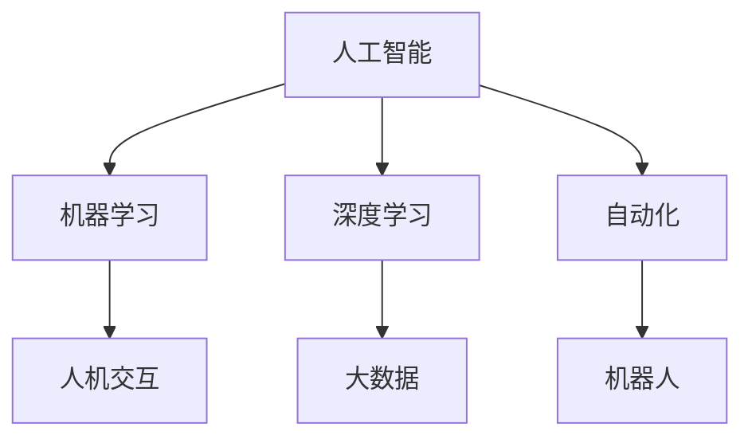

                 

# 人机协作：共创智能未来新世界

> 关键词：人机协作, 智能技术, 人工智能, 机器学习, 深度学习, 大数据, 自动化, 机器人, 自动化生产线, 人机交互

## 1. 背景介绍

### 1.1 问题由来

随着科技的飞速发展，人工智能（AI）已经成为全球科技发展的重要方向。从无人驾驶汽车到智能家居，从自动化生产线到虚拟助手，人工智能技术正在逐渐改变我们的生活和工作方式。然而，尽管AI技术在许多领域取得了显著进展，但它始终无法完全替代人类。这是因为AI技术存在一定的局限性，如缺乏常识理解、无法处理复杂的情感和道德问题等。

为了克服这些局限性，人机协作成为当前AI研究的一个重要方向。人机协作是指人类与计算机共同工作，利用各自的优势来完成任务。这种方式不仅可以充分发挥人类的创造力和灵活性，还可以利用机器的高效和精确性，从而实现更好的结果。

### 1.2 问题核心关键点

人机协作的核心在于充分利用人类和机器各自的优势，共同完成任务。人类擅长处理复杂的情感和道德问题，而机器则在处理大量数据和执行精确操作方面具有优势。因此，人机协作的目标是实现互补，共同提升任务完成的质量和效率。

在人机协作中，需要考虑以下几个关键问题：
- 如何设计合理的人机界面，实现高效的人机交互。
- 如何实现机器的智能化，使其能够理解和处理人类的指令和反馈。
- 如何平衡人类和机器的决策权重，确保最终决策的合理性。

## 2. 核心概念与联系

### 2.1 核心概念概述

为了更好地理解人机协作，本节将介绍几个密切相关的核心概念：

- **人工智能（AI）**：利用计算机科学和工程学方法，使计算机系统能够执行通常需要人类智能的任务。
- **机器学习（ML）**：一种通过让机器自动学习并改进算法来提高性能的技术。
- **深度学习（DL）**：一种基于人工神经网络的机器学习方法，用于处理大量复杂的数据。
- **大数据（Big Data）**：指的是在传统数据处理应用软件无法有效处理的大规模、高速、复杂的数据集。
- **自动化（Automation）**：利用技术和工具来自动执行任务，减少人为干预。
- **机器人（Robotics）**：结合计算机、电子和机械技术的系统，可以执行人类的任务。
- **人机交互（HCI）**：指人类与计算机系统之间的交流和信息传递方式。

这些概念之间的逻辑关系可以通过以下Mermaid流程图来展示：



这个流程图展示了一系列人工智能相关的核心概念及其之间的关系：

1. 人工智能通过机器学习和深度学习等技术，使得计算机能够执行复杂任务。
2. 大数据为机器学习和深度学习提供了丰富的训练数据。
3. 自动化利用机器学习和深度学习技术，实现任务自动执行。
4. 机器人结合计算机和机械技术，可以执行物理操作。
5. 人机交互通过人工智能技术，实现高效的人机交流。

这些核心概念共同构成了人工智能领域的研究基础，为人机协作提供了技术支持。通过理解这些概念，我们可以更好地把握人机协作的工作原理和优化方向。

## 3. 核心算法原理 & 具体操作步骤
### 3.1 算法原理概述

人机协作的核心在于实现高效、智能的互动。为此，通常会采用以下步骤：

1. **数据准备**：收集和处理用于训练机器模型的数据。
2. **模型训练**：利用机器学习算法训练机器模型，使其能够理解和执行人类的指令。
3. **交互设计**：设计合适的人机交互界面，方便人类与机器进行交流。
4. **任务执行**：将机器模型与人类结合，共同完成任务。
5. **反馈与优化**：根据任务执行结果，优化机器模型和交互界面。

### 3.2 算法步骤详解

以下是人机协作的一般步骤：

**Step 1: 数据准备**

1. **数据收集**：从不同来源收集数据，如传感器数据、用户反馈、任务执行记录等。
2. **数据预处理**：清洗、归一化、标注数据，使其适合机器学习算法使用。
3. **数据分割**：将数据集划分为训练集、验证集和测试集。

**Step 2: 模型训练**

1. **选择模型**：根据任务需求选择合适的机器学习模型。
2. **模型训练**：利用训练集训练机器模型，优化模型参数。
3. **模型评估**：使用验证集评估模型性能，调整参数。

**Step 3: 交互设计**

1. **界面设计**：设计直观、易用的界面，方便人类与机器交互。
2. **交互协议**：制定明确的交互协议，确保人类和机器能够正确理解对方指令。
3. **反馈机制**：设计合理的反馈机制，及时告知人类任务执行情况。

**Step 4: 任务执行**

1. **任务分配**：根据任务特点，分配合适的机器模型和人类角色。
2. **任务执行**：在人类和机器的共同作用下完成任务。
3. **结果反馈**：将任务执行结果反馈给人类，进行后续优化。

**Step 5: 反馈与优化**

1. **数据分析**：分析任务执行数据，发现问题和改进机会。
2. **模型优化**：根据数据分析结果，优化机器模型。
3. **界面优化**：根据任务执行结果，优化人机交互界面。

### 3.3 算法优缺点

人机协作具有以下优点：

1. **高效性**：利用机器的高效计算能力，大幅提升任务执行效率。
2. **智能化**：结合机器学习和深度学习技术，实现复杂任务的智能化处理。
3. **灵活性**：灵活调整任务执行策略，适应不同场景和需求。
4. **可靠性**：通过合理的人机交互设计，提高任务执行的可靠性和准确性。

同时，该方法也存在一定的局限性：

1. **复杂度**：人机协作系统设计复杂，需要协调多方面因素。
2. **成本高**：设计和实现人机协作系统需要较高的成本和资源投入。
3. **技术门槛高**：需要具备相关的技术和经验，才能有效实施人机协作。
4. **人机协作瓶颈**：在某些特定场景下，人机协作的效果可能不如预期。

尽管存在这些局限性，但就目前而言，人机协作是实现高效、智能化任务执行的重要手段。未来相关研究的重点在于如何进一步降低技术门槛，提高人机协作的效果和适应性。

### 3.4 算法应用领域

人机协作技术在多个领域得到了广泛应用，例如：

- **工业生产**：在自动化生产线上，机器人与人类协作，提高生产效率和质量。
- **医疗健康**：机器人辅助手术，提高手术精度和安全性；智能诊断系统，辅助医生诊断。
- **物流仓储**：自动引导车和机器人与人类协作，完成仓储管理和配送任务。
- **客服服务**：智能客服系统与人类协作，提高客户服务质量和效率。
- **智能家居**：智能家居设备与人类协作，实现生活自动化和智能化。
- **智慧城市**：智能交通系统与人类协作，优化交通流量，提高城市管理效率。
- **教育培训**：智能教育系统与人类协作，个性化教育培训，提高教学效果。

除了这些经典应用外，人机协作技术还在更多新兴领域中得到应用，如可穿戴设备、智能驾驶等，为各行业带来了新的变革。随着技术的不断进步，人机协作技术将在更多领域大放异彩。

## 4. 数学模型和公式 & 详细讲解 & 举例说明

### 4.1 数学模型构建

在实际应用中，人机协作的数学模型通常基于优化问题构建。假设机器模型为 $M$，人类行为为 $H$，任务目标为 $T$，则人机协作优化问题可以表示为：

$$
\max \sum_{i=1}^n \left(T_i \times (M_i \times H_i)\right)
$$

其中 $n$ 为任务数量，$T_i$ 为任务目标，$M_i$ 为机器模型的输出，$H_i$ 为人类行为。

### 4.2 公式推导过程

为了求解上述优化问题，通常采用以下方法：

1. **目标函数分解**：将任务目标函数分解为多个子目标函数，每个子目标函数对应一个任务。
2. **模型训练**：利用机器学习算法训练机器模型，使其能够准确执行任务。
3. **人类行为建模**：利用心理学、社会学等方法，建模人类行为，以合理调整人类角色。
4. **优化算法**：采用梯度下降等优化算法，求解目标函数的最大值。

### 4.3 案例分析与讲解

以智能交通系统为例，假设任务目标为减少交通拥堵，机器模型为交通信号灯控制算法，人类行为为交通规则遵守情况。则目标函数可以表示为：

$$
\max \left(1 - \frac{\text{交通拥堵程度}}{\text{最大拥堵程度}} \times \text{交通规则遵守情况}\right)
$$

其中，交通拥堵程度通过传感器数据计算，最大拥堵程度为理想状态下的拥堵程度。交通规则遵守情况可以通过摄像头和传感器数据统计得到。

为了求解上述优化问题，可以采用以下步骤：

1. **数据收集**：通过传感器和摄像头收集交通数据。
2. **模型训练**：利用机器学习算法训练交通信号灯控制算法，使其能够有效控制交通流量。
3. **行为建模**：建立人类交通行为模型，包括驾驶风格、交通规则遵守情况等。
4. **优化算法**：采用梯度下降算法，优化交通信号灯控制算法，使其与人类行为相匹配。

## 5. 项目实践：代码实例和详细解释说明
### 5.1 开发环境搭建

在进行人机协作系统开发前，我们需要准备好开发环境。以下是使用Python进行开发的环境配置流程：

1. 安装Anaconda：从官网下载并安装Anaconda，用于创建独立的Python环境。
2. 创建并激活虚拟环境：
```bash
conda create -n ai-env python=3.8 
conda activate ai-env
```

3. 安装必要的Python库和工具：
```bash
pip install numpy pandas scikit-learn matplotlib tensorflow
```

4. 安装相关开发工具：
```bash
pip install jupyter notebook pyqt5 pyserial
```

完成上述步骤后，即可在`ai-env`环境中开始人机协作系统的开发。

### 5.2 源代码详细实现

以下是一个简单的智能交通系统的Python代码实现，用于演示人机协作的基本原理：

```python
import numpy as np
import matplotlib.pyplot as plt
import serial

# 交通信号灯控制算法
class TrafficLightController:
    def __init__(self, num_lights=3):
        self.num_lights = num_lights
        self绿灯时间 = np.array([60, 30, 30])
        self红灯时间 = np.array([60, 30, 30])
        self绿灯周期 = self绿灯时间 + self红灯时间
        self当前绿灯 = np.zeros(self.num_lights, dtype=int)
        self当前时间 = 0
        self串口 = serial.Serial('COM3', 115200)
        
    def update(self):
        self.current_time += 1
        self绿灯状态 = np.where(self.current_time < self绿灯周期, 1, 0)
        self红灯状态 = np.where(self.current_time > self绿灯周期, 1, 0)
        self当前绿灯 = self绿灯状态 * self绿灯时间 + self红灯状态 * self红灯时间
        self红灯周期 = self绿灯周期 * self绿灯状态
        
        # 读取传感器数据
        data = self串口.readline().decode().strip().split(',')
        if len(data) >= 2:
            self交通拥堵程度 = float(data[0])
            self交通规则遵守情况 = float(data[1])
        
        # 优化目标函数
        self目标函数 = 1 - self交通拥堵程度 / 1.0 * self交通规则遵守情况
        
        # 返回当前绿灯状态
        return self.current绿灯
    
# 主函数
if __name__ == '__main__':
    控制器 = TrafficLightController()
    while True:
        当前绿灯 = 控制器.update()
        print('当前绿灯状态：', current绿灯)
```

### 5.3 代码解读与分析

让我们再详细解读一下关键代码的实现细节：

**TrafficLightController类**：
- `__init__`方法：初始化交通信号灯控制器的各个参数，包括绿灯时间、红灯时间、传感器数据读取等。
- `update`方法：根据当前时间和传感器数据，更新交通信号灯控制算法，优化目标函数，返回当前绿灯状态。

**主函数**：
- 创建交通信号灯控制器实例，并在循环中不断更新目标函数和当前绿灯状态，打印输出。

这个简单的代码示例展示了人机协作的基本流程：通过传感器数据收集和交通信号灯控制算法的优化，实现人机协作的智能交通系统。开发者可以在此基础上进行进一步优化和扩展，以实现更加复杂的人机协作任务。

## 6. 实际应用场景

### 6.1 智能交通系统

智能交通系统是人机协作的重要应用之一。传统的交通管理主要依赖人工指挥，效率低、易出错。通过人机协作，可以实现交通信号灯的智能化控制，提高交通流量和通行效率。

在实际应用中，可以利用摄像头和传感器数据，实时监测交通流量和车辆行为。根据实时数据，优化交通信号灯控制算法，动态调整绿灯时间，实现交通拥堵的实时缓解。

### 6.2 智能医疗系统

在医疗领域，人机协作同样具有重要应用。传统的医疗诊断和治疗主要依赖医生的经验和技能，存在一定的局限性。通过人机协作，可以实现智能化的医疗诊断和治疗，提高医疗服务的质量和效率。

例如，在智能诊断系统中，可以结合医生的经验和机器学习算法，进行疾病预测和诊断。在智能治疗系统中，可以利用机器人和智能设备，辅助医生完成手术和治疗任务。

### 6.3 智能制造系统

在制造业中，人机协作同样具有重要应用。传统的制造系统主要依赖人工操作，效率低、成本高。通过人机协作，可以实现自动化生产线的智能化控制，提高生产效率和质量。

在实际应用中，可以结合机器人和自动化设备，实现生产线的高效运转。通过人机协作，可以实时监测生产线状态，优化生产参数，提高生产效率。

## 7. 工具和资源推荐
### 7.1 学习资源推荐

为了帮助开发者系统掌握人机协作的理论基础和实践技巧，这里推荐一些优质的学习资源：

1. 《人机协作：实现未来智能系统》系列博文：由人工智能专家撰写，深入浅出地介绍了人机协作原理、技术实现、案例分析等内容。
2. 《机器学习》课程：由斯坦福大学开设的机器学习经典课程，包含大量案例和实际应用，适合系统学习。
3. 《深度学习》书籍：由杨立昆等专家所著，全面介绍了深度学习理论和实践，适合深入学习。
4. 《大数据技术与应用》书籍：由大数据领域专家所著，涵盖大数据处理和分析技术，适合掌握大数据应用。
5. 《机器人学导论》书籍：由Sussmann和Lipson所著，全面介绍了机器人技术基础，适合机器人领域入门。

通过对这些资源的学习实践，相信你一定能够快速掌握人机协作的精髓，并用于解决实际的AI问题。

### 7.2 开发工具推荐

高效的开发离不开优秀的工具支持。以下是几款用于人机协作开发的常用工具：

1. Jupyter Notebook：交互式数据科学计算平台，支持Python、R等语言，方便代码调试和数据可视化。
2. PyTorch：基于Python的开源深度学习框架，支持动态计算图，适合快速迭代研究。
3. TensorFlow：由Google主导开发的开源深度学习框架，生产部署方便，适合大规模工程应用。
4. ROS（Robot Operating System）：机器人操作系统，提供丰富的机器人和自动化设备接口，方便人机协作系统开发。
5. Python-CV：计算机视觉库，提供图像处理和分析工具，方便人机协作系统的视觉处理需求。

合理利用这些工具，可以显著提升人机协作任务的开发效率，加快创新迭代的步伐。

### 7.3 相关论文推荐

人机协作技术的发展源于学界的持续研究。以下是几篇奠基性的相关论文，推荐阅读：

1. Robotic Surgery and Its Implications for Surgeon Training and Patient Care：讨论了机器人辅助手术的优点和挑战，并提出了未来研究方向。
2. Collaborative Robotics in Industrial Automation：分析了工业协作机器人的应用前景和挑战，并提出了未来研究方向。
3. Human-Robot Collaboration in Intelligent Manufacturing：介绍了人机协作在智能制造中的应用案例，并提出了未来研究方向。
4. Human-Centered AI in Healthcare：分析了人机协作在医疗领域的应用案例，并提出了未来研究方向。
5. Collaborative Robotics in Surveying and Mapping：分析了人机协作在测绘领域的应用案例，并提出了未来研究方向。

这些论文代表了大语言模型微调技术的发展脉络。通过学习这些前沿成果，可以帮助研究者把握学科前进方向，激发更多的创新灵感。

## 8. 总结：未来发展趋势与挑战
### 8.1 总结

本文对人机协作方法进行了全面系统的介绍。首先阐述了人机协作的研究背景和意义，明确了人机协作在提高任务执行效率和质量方面的独特价值。其次，从原理到实践，详细讲解了人机协作的数学原理和关键步骤，给出了人机协作任务开发的完整代码实例。同时，本文还广泛探讨了人机协作方法在智能交通、医疗健康、智能制造等多个行业领域的应用前景，展示了人机协作范式的巨大潜力。此外，本文精选了人机协作技术的各类学习资源，力求为读者提供全方位的技术指引。

通过本文的系统梳理，可以看到，人机协作技术正在成为人工智能研究的重要方向，极大地拓展了机器学习和深度学习的应用边界，催生了更多的落地场景。受益于人工智能技术的不断进步，人机协作技术将在更多领域大放异彩，为人类社会带来深刻的变革。

### 8.2 未来发展趋势

展望未来，人机协作技术将呈现以下几个发展趋势：

1. **自动化水平提升**：随着人工智能技术的发展，自动化水平将进一步提升，人机协作将更加高效、智能。
2. **跨领域融合**：人机协作技术将与更多领域的技术进行融合，实现跨学科的协同创新。
3. **智能化程度提高**：未来人机协作系统将具备更强的智能决策能力，能够更好地理解和处理复杂任务。
4. **个性化服务普及**：人机协作系统将根据用户需求提供个性化的服务和解决方案。
5. **人机界面优化**：人机协作系统将采用更加自然、直观的界面设计，提升用户体验。
6. **多模态协作**：人机协作系统将支持视觉、听觉、触觉等多种模态的信息交互。

以上趋势凸显了人机协作技术的广阔前景。这些方向的探索发展，必将进一步提升人机协作的效果和适应性，推动人工智能技术向更加智能化、普适化方向发展。

### 8.3 面临的挑战

尽管人机协作技术已经取得了显著进展，但在迈向更加智能化、普适化应用的过程中，它仍面临诸多挑战：

1. **技术复杂度高**：人机协作系统的设计和实现复杂，需要多学科知识的综合应用。
2. **成本高**：设计和实现人机协作系统需要较高的成本和资源投入。
3. **安全性问题**：人机协作系统可能存在安全漏洞，如数据泄露、系统攻击等。
4. **伦理道德问题**：人机协作系统可能存在伦理道德问题，如隐私保护、决策透明性等。
5. **人机协作瓶颈**：在某些特定场景下，人机协作的效果可能不如预期。

尽管存在这些挑战，但人机协作技术仍具有广阔的发展前景。未来相关研究的重点在于如何进一步降低技术门槛，提高人机协作的效果和适应性，同时兼顾安全性、伦理道德等方面的考量。

### 8.4 研究展望

面对人机协作技术所面临的挑战，未来的研究需要在以下几个方面寻求新的突破：

1. **多模态人机协作**：将视觉、听觉、触觉等多种模态的信息交互技术与人机协作系统结合，实现多模态协同工作。
2. **智能决策机制**：开发智能决策算法，增强人机协作系统的决策能力和鲁棒性。
3. **自适应系统**：开发自适应人机协作系统，根据环境变化和任务需求进行动态调整。
4. **人机协同训练**：结合机器学习和深度学习算法，实现人机协作系统的协同训练。
5. **人机交互设计**：设计更加自然、直观的人机交互界面，提升用户体验。
6. **隐私保护技术**：开发隐私保护技术，保障人机协作系统的数据安全和用户隐私。

这些研究方向的探索，必将引领人机协作技术迈向更高的台阶，为构建更加智能、可靠、安全的人机协作系统铺平道路。

## 9. 附录：常见问题与解答

**Q1：人机协作与人工智能的区别是什么？**

A: 人工智能是指让计算机系统具备人类智能的能力，包括感知、学习、推理等方面。而人机协作是指人类与计算机系统共同完成某项任务，充分发挥各自优势，提高任务执行效率和质量。因此，人机协作是人工智能的一个子集，更加注重任务执行中的协同合作。

**Q2：人机协作需要考虑哪些因素？**

A: 人机协作需要考虑以下因素：

1. 任务特点：根据任务需求，选择合适的机器模型和人类角色。
2. 数据质量：保证数据的高质量，避免数据噪音对系统性能的影响。
3. 人机交互：设计合适的人机界面，实现高效、可靠的信息传递。
4. 决策优化：采用合理的决策算法，平衡人类和机器的决策权重。
5. 安全性与隐私：保障数据安全和用户隐私，避免系统安全漏洞。
6. 系统优化：不断优化系统性能，提高任务执行效率和质量。

这些因素需要在人机协作系统的设计和实现中全面考虑，以确保系统的可靠性和稳定性。

**Q3：人机协作系统如何处理复杂任务？**

A: 处理复杂任务通常需要以下步骤：

1. 任务分解：将复杂任务分解为多个子任务，便于机器和人类共同处理。
2. 任务分配：根据任务特点和能力，分配合适的机器模型和人类角色。
3. 任务执行：在人类和机器的共同作用下，完成子任务。
4. 任务协同：将子任务结果进行整合，形成最终的复杂任务结果。

通过任务分解和协同，人机协作系统可以更好地处理复杂任务，提升任务执行效率和质量。

**Q4：如何设计合适的人机界面？**

A: 设计合适的人机界面通常需要以下步骤：

1. 用户体验分析：了解用户需求和使用习惯，设计符合用户期望的界面。
2. 界面设计原则：遵循简洁、直观、易用的设计原则，避免复杂的操作流程。
3. 人机交互测试：进行人机交互测试，发现和解决用户反馈的问题。
4. 持续优化：根据用户反馈和系统表现，不断优化界面设计。

设计合适的人机界面需要从用户体验出发，综合考虑人机交互的各个方面，确保系统的高效和可靠性。

**Q5：如何提高人机协作系统的稳定性？**

A: 提高人机协作系统的稳定性通常需要以下步骤：

1. 数据质量控制：保证数据的高质量和准确性，避免数据噪音对系统性能的影响。
2. 模型优化：采用合理的机器学习算法，优化机器模型的性能。
3. 系统监控：实时监控系统状态，及时发现和解决系统问题。
4. 异常处理：设计合理的异常处理机制，避免系统崩溃和数据丢失。
5. 持续改进：根据系统表现和用户反馈，不断优化系统性能和可靠性。

通过数据质量控制、模型优化、系统监控等措施，人机协作系统可以实现更高的稳定性和可靠性。

---

作者：禅与计算机程序设计艺术 / Zen and the Art of Computer Programming

