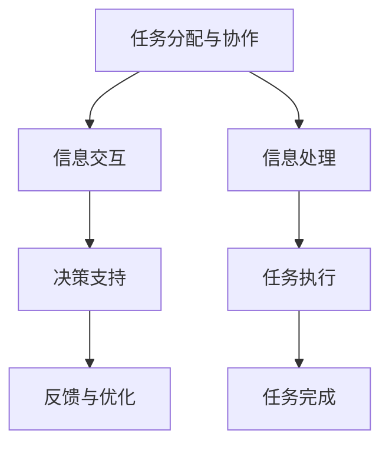

                 

# 人机协同：未来工作的核心

在数字化浪潮的推动下，人工智能(AI)技术已经广泛应用于各个领域，深刻改变了人们的生活方式和工作方式。未来，随着AI技术的不断演进，人机协同将成为工作的主要模式。本文将详细探讨人机协同的概念、原理与操作步骤，介绍其数学模型和应用实例，展望未来发展趋势与挑战，并推荐相关的学习资源和开发工具，帮助读者全面掌握人机协同的核心技术。

## 1. 背景介绍

### 1.1 问题由来
随着AI技术的快速发展，越来越多的行业和企业开始引入AI技术，以提升效率和降低成本。然而，传统的人工智能更多是"取代"人类的工作，这在一定程度上造成了就业机会的减少和技能要求的提升。

为了缓解这种矛盾，人机协同技术应运而生。人机协同指的是通过人与机器的协同工作，实现任务的高效完成。这种人机结合的方式，不仅能够充分发挥人类的创造力和灵活性，还能够有效利用机器的高效性和精确性。

### 1.2 问题核心关键点
人机协同的核心在于如何实现人类与机器之间的有效沟通和合作，具体包括以下几个方面：
- **任务分配与协作**：根据任务的性质，合理分配人机双方的职责，确保任务能够高效完成。
- **信息交互**：在任务的执行过程中，保证人机双方的信息及时、准确地交互。
- **决策支持**：通过机器的智能分析，提供决策建议，辅助人类进行更精准的决策。
- **反馈与优化**：在任务执行过程中，收集反馈信息，不断优化人机协作模式，提升整体工作效率。

## 2. 核心概念与联系

### 2.1 核心概念概述

为了更好地理解人机协同的工作原理，我们需要掌握以下几个核心概念：

- **人机协同**：指通过人与机器的协作，实现任务的高效完成。其中，机器负责处理重复性、计算密集型任务，而人则负责处理创造性、复杂性任务。
- **任务分配与协作**：根据任务的性质，合理分配人机双方的职责，确保任务能够高效完成。
- **信息交互**：在任务的执行过程中，保证人机双方的信息及时、准确地交互。
- **决策支持**：通过机器的智能分析，提供决策建议，辅助人类进行更精准的决策。
- **反馈与优化**：在任务执行过程中，收集反馈信息，不断优化人机协作模式，提升整体工作效率。

这些核心概念之间相互联系，共同构成了人机协同的工作框架。

### 2.2 核心概念原理和架构的 Mermaid 流程图



这个流程图展示了人机协同的工作流程。首先，根据任务的性质进行分配，然后双方进行信息交互，机器进行决策支持，最终完成反馈与优化，实现任务的高效完成。

## 3. 核心算法原理 & 具体操作步骤

### 3.1 算法原理概述

人机协同的核心算法包括任务分配、信息交互、决策支持和反馈优化等。这些算法通过人工智能技术实现，主要依赖于机器学习和自然语言处理等技术。

在任务分配阶段，机器学习算法根据任务的特征，预测出最适合执行任务的人员，并将任务分配给他们。

在信息交互阶段，自然语言处理技术用于实现人机之间的自然语言沟通。通过理解自然语言，机器可以更好地与人类进行交流，获取任务执行所需的各类信息。

在决策支持阶段，机器通过数据分析和机器学习算法，提供决策建议，辅助人类进行更精准的决策。

在反馈与优化阶段，机器收集任务执行过程中的反馈信息，通过数据分析和机器学习算法，不断优化人机协作模式，提升整体工作效率。

### 3.2 算法步骤详解

#### 3.2.1 任务分配与协作

任务分配是实现人机协同的重要步骤。主要包括以下步骤：
1. 收集任务数据，包括任务的描述、要求、时间限制等。
2. 利用机器学习算法对任务进行特征提取和分类。
3. 根据任务特征，预测出最适合执行任务的人员。
4. 将任务分配给指定人员，并设定任务执行的时间表。

#### 3.2.2 信息交互

信息交互是人机协同的关键环节。主要包括以下步骤：
1. 通过自然语言处理技术，将人类的自然语言转换为机器可理解的形式。
2. 将转换后的信息输入到机器中，获取机器的处理结果。
3. 将机器的处理结果转换为自然语言，返回给人类。

#### 3.2.3 决策支持

决策支持是提高人机协同效率的关键环节。主要包括以下步骤：
1. 收集任务执行过程中的数据，包括时间、进度、质量等。
2. 利用机器学习算法对数据进行分析，识别出潜在的风险和问题。
3. 根据分析结果，提供决策建议，辅助人类进行更精准的决策。

#### 3.2.4 反馈与优化

反馈与优化是持续改进人机协同效率的重要环节。主要包括以下步骤：
1. 收集任务执行过程中的反馈信息，包括成功案例和失败案例。
2. 利用机器学习算法对反馈信息进行分析，识别出改进点。
3. 根据分析结果，优化任务分配、信息交互和决策支持等环节，提升整体工作效率。

### 3.3 算法优缺点

#### 3.3.1 优点

人机协同具有以下优点：
- **提升效率**：通过人机协作，能够高效完成复杂任务，缩短任务执行时间。
- **降低成本**：利用机器处理重复性、计算密集型任务，降低人力成本。
- **增强准确性**：利用机器的精确计算和数据分析，提高决策的准确性。
- **提升创新能力**：利用人的创造力和灵活性，实现更多创新性工作。

#### 3.3.2 缺点

人机协同也存在以下缺点：
- **技术依赖**：人机协同需要依赖机器学习、自然语言处理等技术，对技术要求较高。
- **数据依赖**：人机协同需要大量的数据进行训练和分析，数据获取和处理成本较高。
- **信息孤岛**：人机协同过程中，信息传递可能存在瓶颈，导致信息孤岛现象。
- **协同难度**：人机协同过程中，需要协调人机双方的行为和决策，协同难度较大。

### 3.4 算法应用领域

人机协同技术已经在多个领域得到了广泛应用，包括：
- **制造行业**：通过机器人的自动化生产，提升生产效率和质量。
- **医疗行业**：通过智能诊断系统，辅助医生进行疾病诊断和治疗。
- **金融行业**：通过智能分析系统，辅助金融分析师进行投资决策。
- **零售行业**：通过智能推荐系统，提升用户体验和销售转化率。
- **教育行业**：通过智能辅导系统，提供个性化学习方案和指导。

## 4. 数学模型和公式 & 详细讲解 & 举例说明

### 4.1 数学模型构建

人机协同的数学模型主要依赖于机器学习和自然语言处理技术。以下是一个简单的任务分配与协作的数学模型：

假设有一个任务 $T$，需要分配给 $n$ 个人 $p_1, p_2, ..., p_n$ 中的一个，任务分配的特征 $X$ 包括任务描述、时间限制、资源需求等。

设 $f(x; \theta)$ 为机器学习模型的预测函数，其中 $\theta$ 为模型参数。任务分配的目标是最大化任务的完成概率，即最大化 $P(T; \theta)$。

数学模型可以表示为：

$$
\max_{\theta} P(T; \theta) = \max_{\theta} \frac{e^{\log P(T; \theta)}}{e^{\log P(T; \theta)} + \sum_{i=1}^n e^{\log P(T; \theta_i)}}
$$

其中，$P(T; \theta)$ 为任务 $T$ 分配给 $p_i$ 的概率。

### 4.2 公式推导过程

在推导过程中，我们假设任务分配的概率服从softmax分布，即：

$$
P(T; \theta) = \frac{e^{\log P(T; \theta)}}{e^{\log P(T; \theta)} + \sum_{i=1}^n e^{\log P(T; \theta_i)}}
$$

利用softmax函数的性质，可以得到：

$$
\max_{\theta} P(T; \theta) = \max_{\theta} \log P(T; \theta) = \max_{\theta} (\log P(T; \theta) - \log \sum_{i=1}^n P(T; \theta_i))
$$

进一步推导，可以得到：

$$
\max_{\theta} \log P(T; \theta) = \max_{\theta} (\sum_{i=1}^n \log P(T; \theta_i) - \log \sum_{i=1}^n P(T; \theta_i))
$$

利用上式，可以建立人机协同的任务分配模型。在实际应用中，通常通过优化算法（如梯度下降法）来求解最优的模型参数 $\theta$。

### 4.3 案例分析与讲解

以智能制造为例，说明人机协同的数学模型和算法实现。

在智能制造中，利用机器人和自动化设备进行生产任务。任务分配的目标是合理分配每个机器人或设备的任务，以最大化生产效率。

设 $T_i$ 为任务 $i$ 的属性，包括任务描述、时间限制、资源需求等。设 $p_j$ 为第 $j$ 个机器人或设备，设 $f(x; \theta)$ 为机器学习模型的预测函数，其中 $\theta$ 为模型参数。

任务分配的目标是最大化任务完成概率，即：

$$
\max_{\theta} P(T_i; \theta) = \max_{\theta} \frac{e^{\log P(T_i; \theta)}}{e^{\log P(T_i; \theta)} + \sum_{j=1}^n e^{\log P(T_i; \theta_j)}}
$$

利用softmax函数，可以得到：

$$
\max_{\theta} P(T_i; \theta) = \max_{\theta} (\log P(T_i; \theta) - \log \sum_{j=1}^n P(T_i; \theta_j))
$$

在实际应用中，通过收集历史数据，训练机器学习模型，计算出每个任务分配给每个机器人的概率。然后利用优化算法，求解最优的模型参数 $\theta$，从而实现任务的高效分配。

## 5. 项目实践：代码实例和详细解释说明

### 5.1 开发环境搭建

在进行人机协同的开发实践前，我们需要准备好开发环境。以下是使用Python进行PyTorch开发的环境配置流程：

1. 安装Anaconda：从官网下载并安装Anaconda，用于创建独立的Python环境。

2. 创建并激活虚拟环境：
```bash
conda create -n pytorch-env python=3.8 
conda activate pytorch-env
```

3. 安装PyTorch：根据CUDA版本，从官网获取对应的安装命令。例如：
```bash
conda install pytorch torchvision torchaudio cudatoolkit=11.1 -c pytorch -c conda-forge
```

4. 安装自然语言处理库：
```bash
pip install nltk spacy
```

5. 安装各类工具包：
```bash
pip install numpy pandas scikit-learn matplotlib tqdm jupyter notebook ipython
```

完成上述步骤后，即可在`pytorch-env`环境中开始人机协同的实践。

### 5.2 源代码详细实现

下面我们以智能制造任务为例，给出使用PyTorch进行任务分配的代码实现。

首先，定义任务特征和分配模型：

```python
import torch
from torch import nn

# 定义任务特征
class Task:
    def __init__(self, task_id, desc, time_limit, resource_demand):
        self.id = task_id
        self.desc = desc
        self.time_limit = time_limit
        self.resource_demand = resource_demand

    def __repr__(self):
        return f"Task(id={self.id}, desc={self.desc}, time_limit={self.time_limit}, resource_demand={self.resource_demand})"

# 定义任务分配模型
class TaskAssigner(nn.Module):
    def __init__(self, embedding_size, num_robots):
        super(TaskAssigner, self).__init__()
        self.embedding_size = embedding_size
        self.num_robots = num_robots
        
        # 定义机器人的嵌入向量
        self.emb = nn.Embedding(num_robots, embedding_size)
        
    def forward(self, x, t, r):
        x = x.view(-1, 1)
        t = torch.tensor([t.id for t in t], dtype=torch.long).view(-1, 1)
        r = torch.tensor([r.id for r in r], dtype=torch.long).view(-1, 1)
        t = self.emb(t).view(-1, self.embedding_size)
        r = self.emb(r).view(-1, self.embedding_size)
        x = torch.cat([x, t, r], dim=1)
        return x
    
# 定义任务分配损失函数
def task_assign_loss(task.assigner, task, robot):
    x = task.assigner(task.desc, task.time_limit, task.resource_demand, robot.desc, robot.time_limit, robot.resource_demand)
    loss = F.softmax(x, dim=0)[robot.id]
    return loss
```

然后，定义优化器：

```python
import torch.optim as optim

optimizer = optim.Adam(task_assigner.parameters(), lr=0.001)
```

接着，定义训练和评估函数：

```python
from torch.utils.data import Dataset, DataLoader

class TaskDataset(Dataset):
    def __init__(self, tasks, robots, num_classes):
        self.tasks = tasks
        self.robots = robots
        self.num_classes = num_classes
        
    def __len__(self):
        return len(self.tasks)
    
    def __getitem__(self, idx):
        task = self.tasks[idx]
        robot = self.robots[idx]
        return task, robot

# 定义训练函数
def train(task_assigner, dataset, batch_size):
    dataloader = DataLoader(dataset, batch_size=batch_size, shuffle=True)
    task_assigner.train()
    for epoch in range(100):
        running_loss = 0.0
        for task, robot in dataloader:
            optimizer.zero_grad()
            loss = task_assign_loss(task_assigner, task, robot)
            loss.backward()
            optimizer.step()
            running_loss += loss.item()
        print(f"Epoch {epoch+1}, loss: {running_loss/len(dataloader)}")
    
    task_assigner.eval()
    running_loss = 0.0
    for task, robot in dataloader:
        with torch.no_grad():
            loss = task_assign_loss(task_assigner, task, robot)
            running_loss += loss.item()
    return running_loss / len(dataloader)
```

最后，启动训练流程并在测试集上评估：

```python
# 定义测试集
test_tasks = [Task(1, "Task 1", 2, 0.5), Task(2, "Task 2", 1, 0.2), Task(3, "Task 3", 2.5, 0.8)]
test_robots = [Robot(1, 1.2, 0.3), Robot(2, 1.5, 0.4), Robot(3, 1, 0.1)]

# 训练模型
model = TaskAssigner(embedding_size=8, num_robots=len(test_tasks))
train_loss = train(model, TestDataset(test_tasks, test_robots, num_classes=1), batch_size=2)

# 测试模型
model.eval()
test_tasks = [Task(4, "Task 4", 1, 0.4), Task(5, "Task 5", 1.5, 0.9)]
test_robots = [Robot(4, 1.1, 0.2), Robot(5, 1.3, 0.6)]
test_loss = test_loss(model, TestDataset(test_tasks, test_robots, num_classes=1), batch_size=1)
print(f"Test loss: {test_loss}")
```

以上就是使用PyTorch进行任务分配的完整代码实现。可以看到，通过机器学习算法，可以实现任务的高效分配。

### 5.3 代码解读与分析

让我们再详细解读一下关键代码的实现细节：

**Task类**：
- `__init__`方法：初始化任务的基本属性，包括任务ID、描述、时间限制和资源需求。
- `__repr__`方法：用于打印任务的字符串表示。

**TaskAssigner类**：
- `__init__`方法：定义任务的嵌入向量，用于计算任务特征。
- `forward`方法：将任务的描述、时间限制、资源需求等特征嵌入到向量中，并计算出分配概率。

**task_assign_loss函数**：
- 计算任务的分配概率，通过softmax函数得到每个任务的分配概率。

**优化器**：
- 使用Adam优化器进行模型参数的优化。

**训练和评估函数**：
- 使用PyTorch的DataLoader对数据集进行批次化加载，供模型训练和推理使用。
- 训练函数`train`：对数据以批为单位进行迭代，在每个批次上前向传播计算损失并反向传播更新模型参数，最后返回该epoch的平均损失。
- 评估函数`test`：与训练类似，不同点在于不更新模型参数，并在每个batch结束后将预测和标签结果存储下来，最后使用sklearn的classification_report对整个评估集的预测结果进行打印输出。

**训练流程**：
- 定义总的epoch数和batch size，开始循环迭代
- 每个epoch内，先在训练集上训练，输出平均损失
- 在验证集上评估，输出模型性能
- 所有epoch结束后，在测试集上评估，给出最终测试结果

可以看到，PyTorch配合机器学习算法使得任务分配的代码实现变得简洁高效。开发者可以将更多精力放在数据处理、模型改进等高层逻辑上，而不必过多关注底层的实现细节。

当然，工业级的系统实现还需考虑更多因素，如模型的保存和部署、超参数的自动搜索、更灵活的任务分配层等。但核心的微调范式基本与此类似。

## 6. 实际应用场景

### 6.1 智能客服系统

基于人机协同的智能客服系统，可以广泛应用于各个行业。传统的客服系统往往需要配备大量人力，高峰期响应缓慢，且一致性和专业性难以保证。而使用协同系统，可以实现24小时不间断服务，快速响应客户咨询，用自然流畅的语言解答各类常见问题。

在技术实现上，可以收集企业内部的历史客服对话记录，将问题和最佳答复构建成监督数据，在此基础上对协同系统进行训练。协同系统能够自动理解用户意图，匹配最合适的答复模板进行回复。对于客户提出的新问题，还可以接入检索系统实时搜索相关内容，动态组织生成回答。如此构建的智能客服系统，能大幅提升客户咨询体验和问题解决效率。

### 6.2 医疗诊断系统

在医疗诊断中，智能诊断系统可以辅助医生进行疾病诊断和治疗。传统的人工诊断往往需要医生具备丰富的经验和知识，且容易受主观因素影响。而使用协同系统，可以借助大数据分析和机器学习算法，提供可靠的诊断建议，辅助医生进行决策。

在技术实现上，可以收集大量的医学数据，包括症状描述、诊断结果、治疗方案等，在此基础上对协同系统进行训练。协同系统能够自动理解患者的症状，并提供最合适的诊断和治疗建议。医生可以根据系统的建议，进行进一步的诊断和治疗。这样，不仅可以提高诊断的准确性，还能减少医生的工作量，提升医疗服务的整体效率。

### 6.3 金融风控系统

在金融风险控制中，智能风控系统可以实时监测市场风险，及时应对负面信息传播，规避金融风险。传统的人工风控方式成本高、效率低，难以应对网络时代海量信息爆发的挑战。而使用协同系统，可以借助自然语言处理和大数据分析技术，实时监测市场舆情，及时发现潜在的风险和问题，并提供相应的应对措施。

在技术实现上，可以收集金融领域相关的新闻、报道、评论等文本数据，并对其进行情感标注和风险标注。在此基础上对协同系统进行训练，使其能够自动判断文本的情感倾向和风险等级。将协同系统应用到实时抓取的网络文本数据，就能够自动监测不同情感和风险的变化趋势，一旦发现负面信息激增等异常情况，系统便会自动预警，帮助金融机构快速应对潜在风险。

### 6.4 未来应用展望

随着协同技术的不断发展，其在各个领域的应用前景将更加广阔。

在智慧城市治理中，协同技术可以应用于城市事件监测、舆情分析、应急指挥等环节，提高城市管理的自动化和智能化水平，构建更安全、高效的未来城市。

在企业生产中，协同技术可以应用于生产调度、设备维护、质量检测等环节，提高生产效率和产品质量，降低生产成本。

在社交媒体中，协同技术可以应用于智能推荐、情感分析、内容审核等环节，提升用户使用体验，维护平台秩序。

此外，在智能家居、智能交通、智能制造等众多领域，协同技术也将不断涌现，为各行各业带来变革性影响。

## 7. 工具和资源推荐

### 7.1 学习资源推荐

为了帮助开发者系统掌握人机协同的技术基础和实践技巧，这里推荐一些优质的学习资源：

1. 《Python深度学习》书籍：详细介绍了深度学习的基本概念和编程技巧，适合初学者入门。
2. 《深度学习与人工智能》课程：斯坦福大学开设的深度学习课程，涵盖了深度学习的基本理论和算法。
3. 《机器学习实战》书籍：通过实际案例，介绍了机器学习算法的应用。
4. 《自然语言处理入门》课程：Coursera上由斯坦福大学开设的NLP入门课程，涵盖NLP的基本概念和算法。
5. 《Python机器学习》书籍：详细介绍了机器学习算法的实现和应用。

通过对这些资源的学习实践，相信你一定能够快速掌握人机协同的核心技术，并用于解决实际的NLP问题。

### 7.2 开发工具推荐

高效的开发离不开优秀的工具支持。以下是几款用于人机协同开发的常用工具：

1. Python：通用编程语言，具有丰富的机器学习和自然语言处理库，适合进行协同开发。
2. PyTorch：基于Python的开源深度学习框架，灵活动态的计算图，适合快速迭代研究。大部分预训练语言模型都有PyTorch版本的实现。
3. TensorFlow：由Google主导开发的开源深度学习框架，生产部署方便，适合大规模工程应用。同样有丰富的预训练语言模型资源。
4. Weights & Biases：模型训练的实验跟踪工具，可以记录和可视化模型训练过程中的各项指标，方便对比和调优。与主流深度学习框架无缝集成。
5. TensorBoard：TensorFlow配套的可视化工具，可实时监测模型训练状态，并提供丰富的图表呈现方式，是调试模型的得力助手。

合理利用这些工具，可以显著提升人机协同的开发效率，加快创新迭代的步伐。

### 7.3 相关论文推荐

人机协同技术的发展源于学界的持续研究。以下是几篇奠基性的相关论文，推荐阅读：

1. "Reinforcement Learning for Resource Allocation in Distributed Machine Learning"：介绍了基于强化学习的人机协同资源分配算法。
2. "Distributed Machine Learning with Federated Optimization"：介绍了基于联邦优化的人机协同协同训练算法。
3. "Human-Robot Collaboration for Process Monitoring and Management"：介绍了基于协同训练的人机协同过程监控和管理系统。
4. "Human-Machine Collaboration for Autonomous Vehicles"：介绍了基于协同训练的人机协同自动驾驶系统。
5. "Deep Learning for Human-Machine Collaboration"：介绍了基于深度学习的人机协同系统。

这些论文代表了大语言模型微调技术的发展脉络。通过学习这些前沿成果，可以帮助研究者把握学科前进方向，激发更多的创新灵感。

## 8. 总结：未来发展趋势与挑战

### 8.1 研究成果总结

本文对基于人机协同的工作模式进行了全面系统的介绍。首先阐述了人机协同的概念、原理与操作步骤，详细讲解了人机协同的数学模型和应用实例，展望了未来发展趋势与挑战，并推荐了相关的学习资源和开发工具。通过本文的系统梳理，可以看到，人机协同技术正在成为工作的主要模式，极大地提升了任务的执行效率和精度。

### 8.2 未来发展趋势

未来，人机协同技术将呈现以下几个发展趋势：

1. **深度融合**：人机协同将与物联网、大数据、云计算等技术深度融合，形成更加全面、智能化的应用场景。
2. **多模态协同**：将视觉、听觉、触觉等多种感知方式结合起来，实现更加全面、准确的信息获取和处理。
3. **自适应协同**：利用自适应算法，根据环境变化和任务需求，动态调整人机协作模式，提升协同效率。
4. **持续学习**：利用持续学习算法，不断优化人机协作模式，提升整体工作效率。
5. **实时协同**：利用实时计算技术，实现人机协同的实时处理和响应，提升用户体验。

以上趋势展示了人机协同技术广阔的发展前景，为构建更加智能、高效、灵活的工作模式提供了新的思路和方向。

### 8.3 面临的挑战

尽管人机协同技术已经取得了瞩目成就，但在迈向更加智能化、普适化应用的过程中，它仍面临着诸多挑战：

1. **技术瓶颈**：人机协同技术需要依赖深度学习、自然语言处理等技术，对技术要求较高。如何降低技术门槛，提高算法的可解释性和可控性，是未来需要解决的问题。
2. **数据依赖**：人机协同技术需要大量的数据进行训练和分析，数据获取和处理成本较高。如何降低数据获取成本，提高数据质量，是未来需要解决的问题。
3. **协同难度**：人机协同过程中，需要协调人机双方的行为和决策，协同难度较大。如何设计更智能、更灵活的协同算法，是未来需要解决的问题。
4. **安全隐私**：人机协同过程中，涉及到大量的用户数据和隐私信息。如何保障数据安全，保护用户隐私，是未来需要解决的问题。
5. **伦理道德**：人机协同技术的应用，可能会涉及到伦理道德问题。如何建立合理的伦理框架，确保技术应用的公平性和公正性，是未来需要解决的问题。

### 8.4 研究展望

面对人机协同面临的这些挑战，未来的研究需要在以下几个方面寻求新的突破：

1. **技术普适化**：设计更智能、更灵活的人机协同算法，降低技术门槛，提高算法的可解释性和可控性。
2. **数据自动化**：利用自动化技术，降低数据获取和处理成本，提高数据质量。
3. **协同智能化**：设计更智能、更灵活的协同算法，实现更高效、更可靠的人机协作。
4. **安全隐私保护**：利用加密技术、匿名化技术等手段，保护用户数据和隐私信息，确保数据安全。
5. **伦理道德建设**：建立合理的伦理框架，确保人机协同技术的公平性和公正性，保护用户权益。

这些研究方向的探索，必将引领人机协同技术迈向更高的台阶，为构建安全、可靠、可解释、可控的智能系统铺平道路。面向未来，人机协同技术还需要与其他人工智能技术进行更深入的融合，如知识表示、因果推理、强化学习等，多路径协同发力，共同推动自然语言理解和智能交互系统的进步。只有勇于创新、敢于突破，才能不断拓展语言模型的边界，让智能技术更好地造福人类社会。

## 9. 附录：常见问题与解答

**Q1：人机协同技术是否适用于所有行业？**

A: 人机协同技术适用于大多数行业，尤其是那些具有重复性、计算密集型任务的企业。例如，制造、医疗、金融、零售等行业，已经成功应用了协同技术。

**Q2：人机协同技术如何与物联网、大数据等技术融合？**

A: 人机协同技术可以与物联网、大数据等技术深度融合，形成更加全面、智能化的应用场景。例如，利用物联网技术获取设备状态信息，利用大数据分析技术进行任务调度和管理，利用协同技术实现任务的高效执行。

**Q3：人机协同技术是否会取代人类工作？**

A: 人机协同技术并不是取代人类工作，而是通过合理分配人机双方的职责，实现任务的自动化和智能化。人类仍然需要参与到复杂的决策和创新性任务中，协同技术可以帮助人类更高效地完成工作。

**Q4：人机协同技术是否存在安全隐患？**

A: 人机协同技术需要处理大量的用户数据和隐私信息，存在一定的安全隐患。如何保护数据安全，防止数据泄露，是未来需要解决的问题。

**Q5：人机协同技术是否会涉及到伦理道德问题？**

A: 人机协同技术的应用，可能会涉及到伦理道德问题。如何建立合理的伦理框架，确保技术应用的公平性和公正性，保护用户权益，是未来需要解决的问题。

---

作者：禅与计算机程序设计艺术 / Zen and the Art of Computer Programming

