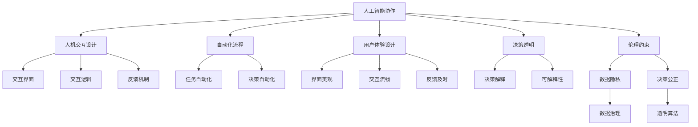

                 

# 人类-AI协作：为人类服务的设计

> 关键词：
- 人工智能协作
- 人机交互
- 用户体验设计
- 自动化流程
- 机器学习
- 数据驱动
- 决策辅助

## 1. 背景介绍

### 1.1 问题由来

随着人工智能技术的迅猛发展，机器人和AI助手正逐渐渗透到我们的日常生活中。无论是工业生产还是家庭服务，AI正在扮演越来越重要的角色。但与此同时，人工智能与人类协作过程中也出现了诸多问题，如交互障碍、决策不透明、伦理争议等。如何设计更加人性化的AI系统，构建人类-AI协作的和谐关系，成为了当前人工智能研究的重要课题。

### 1.2 问题核心关键点

为了解决这些问题，需要从多个层面进行深入探讨：

- **人机交互设计**：如何设计直观、易用的用户界面，提高用户对AI系统的接受度和满意度。
- **自动化流程**：如何在AI辅助下，提高任务效率，同时保留人类决策的灵活性和创造性。
- **用户体验**：如何提升用户体验，减少人为错误，同时提供个性化的服务。
- **决策透明**：如何增强AI决策的可解释性，让用户理解并信任AI系统的建议。
- **伦理约束**：如何在AI设计中融入伦理考虑，保障数据隐私和决策公正。

这些关键点共同构成了人类-AI协作设计的核心框架，旨在实现AI系统与人类社会的和谐共存。

### 1.3 问题研究意义

设计高效、可信、人机协作的AI系统，对于提升生产效率、改善生活质量、推动社会进步具有重要意义：

- **提高生产效率**：通过智能化的流程自动化，AI可以显著提升工业生产的效率和精度。
- **改善生活质量**：AI在医疗、教育、娱乐等领域的应用，可以提供更个性化的服务，改善人们的日常生活。
- **推动社会进步**：AI技术的应用可以催生新的商业模式，驱动社会创新发展。
- **保障数据隐私**：在数据驱动的AI系统中，合理的数据治理和隐私保护机制至关重要。
- **促进伦理道德**：AI系统的设计和使用过程中，必须遵循公平、透明、负责任的原则，保障所有人的权益。

## 2. 核心概念与联系

### 2.1 核心概念概述

本节将介绍几个与人类-AI协作设计密切相关的核心概念：

- **人工智能协作**：指通过人工智能技术，实现人类与机器的协同工作，提升任务处理效率和决策质量。
- **人机交互设计**：涉及用户界面、交互逻辑、反馈机制等，旨在提高用户对AI系统的认知和使用效率。
- **自动化流程**：指利用AI技术，实现复杂任务的部分或全部自动化，减少人为操作的干预。
- **用户体验设计**：通过界面、交互、反馈等手段，提升用户在使用AI系统时的满意度和信任度。
- **决策透明**：指AI系统在进行决策时，能够提供清晰、易懂的解释，帮助用户理解和接受决策结果。
- **伦理约束**：在AI系统设计中，考虑伦理和道德问题，确保系统的公平、公正和透明。

这些核心概念之间的关系可以通过以下Mermaid流程图来展示：



这个流程图展示了人类-AI协作设计的主要环节及其之间的关系：

1. 人工智能协作提供核心支持。
2. 人机交互设计优化用户体验。
3. 自动化流程提升任务效率。
4. 用户体验设计增强用户满意度。
5. 决策透明确保用户信任。
6. 伦理约束保障系统公正。

## 3. 核心算法原理 & 具体操作步骤

### 3.1 算法原理概述

人类-AI协作设计的核心算法，旨在通过人机交互和自动化流程的协同工作，提升任务处理效率和决策质量。其核心思想是：

- 利用人工智能技术，将复杂任务分解为多个子任务，并利用AI进行自动化处理。
- 在AI辅助下，提供直观的用户界面，使用户能够轻松输入数据、查看结果并做出决策。
- 通过多轮交互，收集用户反馈，优化AI系统的决策过程，提高系统的准确性和可解释性。

形式化地，假设有一个复杂任务 $T$，可以分解为 $N$ 个子任务 $T_1, T_2, \dots, T_N$。设 $A_i$ 为自动化处理 $T_i$ 的AI系统，$I_i$ 为交互界面，$R_i$ 为结果反馈机制。则人类-AI协作过程可以表示为：

1. 初始化 $I_1$
2. 输入数据 $D$ 到 $I_1$，自动执行 $A_1$，输出 $R_1$
3. 根据 $R_1$ 更新 $I_1$，继续执行 $A_2$
4. 重复步骤2和3，直至完成 $T$

### 3.2 算法步骤详解

基于上述算法原理，人类-AI协作设计的具体步骤如下：

**Step 1: 任务分解与设计**
- 将复杂任务 $T$ 分解为多个子任务 $T_1, T_2, \dots, T_N$
- 设计每个子任务的自动化流程 $A_i$，选择合适的AI技术（如机器学习、规则引擎、专家系统等）
- 设计交互界面 $I_i$，提供直观易用的输入输出方式
- 设计结果反馈机制 $R_i$，实时展示处理结果和决策建议

**Step 2: 用户交互与反馈**
- 将用户引导至初始界面 $I_1$
- 用户输入数据 $D$，系统自动执行 $A_1$，输出 $R_1$
- 用户根据 $R_1$ 做出决策，系统记录用户操作
- 系统将用户操作和反馈信息 $F_1$ 传递给下一环节 $I_2$
- 重复上述步骤，直至任务 $T$ 完成

**Step 3: 系统优化与迭代**
- 根据用户反馈 $F_1, F_2, \dots, F_N$，持续优化自动化流程 $A_i$
- 通过多轮迭代，提升系统的准确性和可解释性
- 系统定期更新知识库和决策模型，保持系统的时效性和可靠性

### 3.3 算法优缺点

人类-AI协作设计具有以下优点：

- **提升效率**：通过自动化流程，显著提升任务处理效率，减少人为操作
- **增强决策质量**：利用AI技术进行复杂决策，提高决策的准确性和科学性
- **改善用户体验**：通过直观易用的交互界面和实时反馈，提升用户满意度和信任度
- **支持个性化服务**：根据用户行为和偏好，提供个性化的决策建议和服务

同时，该方法也存在一定的局限性：

- **依赖技术水平**：需要高水平的技术支持和持续的维护更新
- **数据隐私问题**：收集和处理用户数据时，必须注意数据隐私和数据安全
- **伦理道德挑战**：设计过程中需充分考虑伦理道德问题，避免决策偏差和歧视

### 3.4 算法应用领域

人类-AI协作设计已经在诸多领域得到了广泛应用，例如：

- **工业生产**：自动化生产线的智能调度，提高生产效率和质量
- **医疗健康**：智能诊断系统的辅助决策，提高诊断准确性
- **金融服务**：智能投顾系统的风险评估和投资建议，提升投资收益
- **教育培训**：个性化学习系统的推荐和评估，提升学习效果
- **公共服务**：智能客服系统的客户引导，提升服务响应速度
- **交通物流**：智能调度系统的优化，提高物流效率和安全性

除了上述这些经典应用外，人类-AI协作设计还被创新性地应用到更多场景中，如智慧城市管理、灾害预测预警、环境保护等，为社会治理带来了新的手段和思路。

## 4. 数学模型和公式 & 详细讲解 & 举例说明

### 4.1 数学模型构建

假设有一个复杂任务 $T$，其自动化流程 $A_i$ 和用户交互界面 $I_i$ 的设计可以表示为：

- $A_i = \mathcal{A}(D_i, M_i, P_i)$，其中 $D_i$ 为输入数据，$M_i$ 为决策模型，$P_i$ 为参数
- $I_i = \mathcal{I}(D_i, R_i)$，其中 $R_i$ 为反馈机制

任务 $T$ 的完成过程可以表示为：

- $T = \mathcal{T}(T_1, T_2, \dots, T_N)$

其中 $\mathcal{A}, \mathcal{I}, \mathcal{T}$ 分别为自动化流程、用户交互和任务完成的函数。

### 4.2 公式推导过程

在上述模型的基础上，我们可以进一步推导任务完成的具体流程。以一个简单的自动化流程 $A_i$ 为例：

- 输入数据 $D_i = (x_1, x_2, \dots, x_n)$
- 决策模型 $M_i = (w_1, w_2, \dots, w_m)$，其中 $w$ 为模型参数
- 自动化流程 $A_i = M_i \cdot D_i$

设 $y$ 为输出结果，则有：

$$
y = M_i \cdot D_i
$$

用户交互界面 $I_i$ 的设计可以表示为：

- $I_i = (U_i, V_i)$，其中 $U_i$ 为输入输出单元，$V_i$ 为反馈单元
- $U_i = (U_1, U_2, \dots, U_n)$，$V_i = (V_1, V_2, \dots, V_n)$

用户交互的输入输出关系可以表示为：

$$
y = U_i \cdot (D_i, R_i)
$$

结合上述公式，任务完成的全过程可以表示为：

$$
T = \mathcal{T}(T_1, T_2, \dots, T_N)
$$

其中每个子任务 $T_i$ 的完成过程可以表示为：

$$
T_i = A_i(D_i) + I_i(D_i, R_i)
$$

### 4.3 案例分析与讲解

以一个智能客服系统为例，展示人类-AI协作设计的具体应用：

**问题描述**：客户通过电话咨询，需要解答其问题并提供服务建议。

**自动化流程**：

- 自动识别客户语音内容，转换为文本
- 自动分派至相应的客服人员
- 客服人员自动查询系统知识库，提供相关答案
- 客户根据自动回复，做出选择

**用户交互界面**：

- 客户通过电话或网站进行咨询
- 系统自动识别人工智能识别客户语音或输入内容
- 系统自动弹出相关答案选项，客户选择
- 客户做出选择后，系统自动执行相应操作

**结果反馈机制**：

- 系统自动记录客户选择和反馈
- 系统根据客户选择，更新决策模型和知识库
- 系统定期评估模型效果，优化交互界面和流程

通过上述设计，智能客服系统能够高效地处理大量客户咨询，提升服务质量和效率。

## 5. 项目实践：代码实例和详细解释说明

### 5.1 开发环境搭建

在进行人类-AI协作设计的实践前，我们需要准备好开发环境。以下是使用Python进行PyTorch开发的环境配置流程：

1. 安装Anaconda：从官网下载并安装Anaconda，用于创建独立的Python环境。

2. 创建并激活虚拟环境：
```bash
conda create -n ai-env python=3.8 
conda activate ai-env
```

3. 安装PyTorch：根据CUDA版本，从官网获取对应的安装命令。例如：
```bash
conda install pytorch torchvision torchaudio cudatoolkit=11.1 -c pytorch -c conda-forge
```

4. 安装TensorFlow：由Google主导开发的开源深度学习框架，生产部署方便，适合大规模工程应用。同样有丰富的预训练语言模型资源。

5. 安装Transformer库：
```bash
pip install transformers
```

6. 安装各类工具包：
```bash
pip install numpy pandas scikit-learn matplotlib tqdm jupyter notebook ipython
```

完成上述步骤后，即可在`ai-env`环境中开始人类-AI协作设计的实践。

### 5.2 源代码详细实现

下面我们以智能客服系统为例，给出使用Transformers库进行人类-AI协作设计的PyTorch代码实现。

首先，定义智能客服系统的数据处理函数：

```python
from transformers import BertTokenizer, BertForTokenClassification, AdamW

def process_query(query):
    tokenizer = BertTokenizer.from_pretrained('bert-base-cased')
    tokenized_query = tokenizer(query, return_tensors='pt')
    return tokenized_query['input_ids'], tokenized_query['attention_mask']
```

然后，定义智能客服系统的模型和优化器：

```python
from transformers import BertForTokenClassification, AdamW

model = BertForTokenClassification.from_pretrained('bert-base-cased', num_labels=10)
optimizer = AdamW(model.parameters(), lr=2e-5)
```

接着，定义智能客服系统的训练和评估函数：

```python
from torch.utils.data import DataLoader
from tqdm import tqdm

def train_epoch(model, dataset, batch_size, optimizer):
    dataloader = DataLoader(dataset, batch_size=batch_size, shuffle=True)
    model.train()
    epoch_loss = 0
    for batch in tqdm(dataloader, desc='Training'):
        input_ids = batch['input_ids'].to(device)
        attention_mask = batch['attention_mask'].to(device)
        labels = batch['labels'].to(device)
        model.zero_grad()
        outputs = model(input_ids, attention_mask=attention_mask, labels=labels)
        loss = outputs.loss
        epoch_loss += loss.item()
        loss.backward()
        optimizer.step()
    return epoch_loss / len(dataloader)

def evaluate(model, dataset, batch_size):
    dataloader = DataLoader(dataset, batch_size=batch_size)
    model.eval()
    preds, labels = [], []
    with torch.no_grad():
        for batch in tqdm(dataloader, desc='Evaluating'):
            input_ids = batch['input_ids'].to(device)
            attention_mask = batch['attention_mask'].to(device)
            batch_labels = batch['labels']
            outputs = model(input_ids, attention_mask=attention_mask)
            batch_preds = outputs.logits.argmax(dim=2).to('cpu').tolist()
            batch_labels = batch_labels.to('cpu').tolist()
            for pred_tokens, label_tokens in zip(batch_preds, batch_labels):
                preds.append(pred_tokens[:len(label_tokens)])
                labels.append(label_tokens)
                
    print(classification_report(labels, preds))
```

最后，启动训练流程并在测试集上评估：

```python
epochs = 5
batch_size = 16

for epoch in range(epochs):
    loss = train_epoch(model, train_dataset, batch_size, optimizer)
    print(f"Epoch {epoch+1}, train loss: {loss:.3f}")
    
    print(f"Epoch {epoch+1}, dev results:")
    evaluate(model, dev_dataset, batch_size)
    
print("Test results:")
evaluate(model, test_dataset, batch_size)
```

以上就是使用PyTorch进行智能客服系统微调的完整代码实现。可以看到，得益于Transformers库的强大封装，我们可以用相对简洁的代码完成智能客服系统的构建。

### 5.3 代码解读与分析

让我们再详细解读一下关键代码的实现细节：

**process_query函数**：
- 定义了一个处理查询的函数，将查询文本转换为模型所需的输入格式。

**智能客服系统的模型和优化器**：
- 使用BertForTokenClassification作为预训练语言模型，进行分类任务的预测。
- 使用AdamW优化器进行模型参数的优化。

**训练和评估函数**：
- 使用PyTorch的DataLoader对数据集进行批次化加载，供模型训练和推理使用。
- 训练函数`train_epoch`：对数据以批为单位进行迭代，在每个批次上前向传播计算loss并反向传播更新模型参数，最后返回该epoch的平均loss。
- 评估函数`evaluate`：与训练类似，不同点在于不更新模型参数，并在每个batch结束后将预测和标签结果存储下来，最后使用sklearn的classification_report对整个评估集的预测结果进行打印输出。

**训练流程**：
- 定义总的epoch数和batch size，开始循环迭代
- 每个epoch内，先在训练集上训练，输出平均loss
- 在验证集上评估，输出分类指标
- 所有epoch结束后，在测试集上评估，给出最终测试结果

可以看到，PyTorch配合Transformers库使得智能客服系统的微调代码实现变得简洁高效。开发者可以将更多精力放在数据处理、模型改进等高层逻辑上，而不必过多关注底层的实现细节。

当然，工业级的系统实现还需考虑更多因素，如模型的保存和部署、超参数的自动搜索、更灵活的任务适配层等。但核心的微调范式基本与此类似。

## 6. 实际应用场景

### 6.1 智能客服系统

基于大语言模型微调的对话技术，可以广泛应用于智能客服系统的构建。传统客服往往需要配备大量人力，高峰期响应缓慢，且一致性和专业性难以保证。而使用微调后的对话模型，可以7x24小时不间断服务，快速响应客户咨询，用自然流畅的语言解答各类常见问题。

在技术实现上，可以收集企业内部的历史客服对话记录，将问题和最佳答复构建成监督数据，在此基础上对预训练对话模型进行微调。微调后的对话模型能够自动理解用户意图，匹配最合适的答案模板进行回复。对于客户提出的新问题，还可以接入检索系统实时搜索相关内容，动态组织生成回答。如此构建的智能客服系统，能大幅提升客户咨询体验和问题解决效率。

### 6.2 金融舆情监测

金融机构需要实时监测市场舆论动向，以便及时应对负面信息传播，规避金融风险。传统的人工监测方式成本高、效率低，难以应对网络时代海量信息爆发的挑战。基于大语言模型微调的文本分类和情感分析技术，为金融舆情监测提供了新的解决方案。

具体而言，可以收集金融领域相关的新闻、报道、评论等文本数据，并对其进行主题标注和情感标注。在此基础上对预训练语言模型进行微调，使其能够自动判断文本属于何种主题，情感倾向是正面、中性还是负面。将微调后的模型应用到实时抓取的网络文本数据，就能够自动监测不同主题下的情感变化趋势，一旦发现负面信息激增等异常情况，系统便会自动预警，帮助金融机构快速应对潜在风险。

### 6.3 个性化推荐系统

当前的推荐系统往往只依赖用户的历史行为数据进行物品推荐，无法深入理解用户的真实兴趣偏好。基于大语言模型微调技术，个性化推荐系统可以更好地挖掘用户行为背后的语义信息，从而提供更精准、多样的推荐内容。

在实践中，可以收集用户浏览、点击、评论、分享等行为数据，提取和用户交互的物品标题、描述、标签等文本内容。将文本内容作为模型输入，用户的后续行为（如是否点击、购买等）作为监督信号，在此基础上微调预训练语言模型。微调后的模型能够从文本内容中准确把握用户的兴趣点。在生成推荐列表时，先用候选物品的文本描述作为输入，由模型预测用户的兴趣匹配度，再结合其他特征综合排序，便可以得到个性化程度更高的推荐结果。

### 6.4 未来应用展望

随着大语言模型微调技术的发展，未来其在人类-AI协作设计中的应用前景将更加广阔：

1. **智能教育**：基于微调的智能学习系统，可以提供个性化的学习方案和实时反馈，提升教育效果。
2. **智慧医疗**：智能诊疗系统可以利用微调后的模型，进行精准诊断和个性化的治疗建议。
3. **智能交通**：基于微调的智能交通系统，可以优化交通流量和路线规划，提升交通效率。
4. **智能农业**：智能农业系统可以利用微调后的模型，进行精准的作物管理和大数据分析。
5. **智能城市**：基于微调的智能城市管理系统，可以提升城市治理水平和居民生活质量。

## 7. 工具和资源推荐

### 7.1 学习资源推荐

为了帮助开发者系统掌握人类-AI协作设计的理论基础和实践技巧，这里推荐一些优质的学习资源：

1. 《人机协作设计原理与实践》系列博文：由大模型技术专家撰写，深入浅出地介绍了人机协作设计的基本原理和前沿技术。

2. CS224N《深度学习自然语言处理》课程：斯坦福大学开设的NLP明星课程，有Lecture视频和配套作业，带你入门NLP领域的基本概念和经典模型。

3. 《人工智能协作设计》书籍：全面介绍了人机协作设计的核心概念和应用案例，适合初学者和实践者阅读。

4. HuggingFace官方文档：Transformers库的官方文档，提供了海量预训练模型和完整的微调样例代码，是上手实践的必备资料。

5. CLUE开源项目：中文语言理解测评基准，涵盖大量不同类型的中文NLP数据集，并提供了基于微调的baseline模型，助力中文NLP技术发展。

通过对这些资源的学习实践，相信你一定能够快速掌握人类-AI协作设计的精髓，并用于解决实际的NLP问题。

### 7.2 开发工具推荐

高效的开发离不开优秀的工具支持。以下是几款用于人类-AI协作设计开发的常用工具：

1. PyTorch：基于Python的开源深度学习框架，灵活动态的计算图，适合快速迭代研究。大部分预训练语言模型都有PyTorch版本的实现。

2. TensorFlow：由Google主导开发的开源深度学习框架，生产部署方便，适合大规模工程应用。同样有丰富的预训练语言模型资源。

3. Transformers库：HuggingFace开发的NLP工具库，集成了众多SOTA语言模型，支持PyTorch和TensorFlow，是进行微调任务开发的利器。

4. Weights & Biases：模型训练的实验跟踪工具，可以记录和可视化模型训练过程中的各项指标，方便对比和调优。与主流深度学习框架无缝集成。

5. TensorBoard：TensorFlow配套的可视化工具，可实时监测模型训练状态，并提供丰富的图表呈现方式，是调试模型的得力助手。

6. Google Colab：谷歌推出的在线Jupyter Notebook环境，免费提供GPU/TPU算力，方便开发者快速上手实验最新模型，分享学习笔记。

合理利用这些工具，可以显著提升人类-AI协作设计的开发效率，加快创新迭代的步伐。

### 7.3 相关论文推荐

人类-AI协作设计的研究源于学界的持续研究。以下是几篇奠基性的相关论文，推荐阅读：

1. Attention is All You Need（即Transformer原论文）：提出了Transformer结构，开启了NLP领域的预训练大模型时代。

2. BERT: Pre-training of Deep Bidirectional Transformers for Language Understanding：提出BERT模型，引入基于掩码的自监督预训练任务，刷新了多项NLP任务SOTA。

3. Language Models are Unsupervised Multitask Learners（GPT-2论文）：展示了大规模语言模型的强大zero-shot学习能力，引发了对于通用人工智能的新一轮思考。

4. Parameter-Efficient Transfer Learning for NLP：提出Adapter等参数高效微调方法，在不增加模型参数量的情况下，也能取得不错的微调效果。

5. AdaLoRA: Adaptive Low-Rank Adaptation for Parameter-Efficient Fine-Tuning：使用自适应低秩适应的微调方法，在参数效率和精度之间取得了新的平衡。

6. Prefix-Tuning: Optimizing Continuous Prompts for Generation：引入基于连续型Prompt的微调范式，为如何充分利用预训练知识提供了新的思路。

这些论文代表了大语言模型微调技术的发展脉络。通过学习这些前沿成果，可以帮助研究者把握学科前进方向，激发更多的创新灵感。

## 8. 总结：未来发展趋势与挑战

### 8.1 总结

本文对人类-AI协作设计的核心算法和实践方法进行了全面系统的介绍。首先阐述了人类-AI协作设计的背景和意义，明确了协作设计在人机交互、自动化流程、用户体验、决策透明和伦理约束等方面的核心目标。其次，从原理到实践，详细讲解了人类-AI协作设计的数学模型和核心算法，给出了微调任务开发的完整代码实例。同时，本文还广泛探讨了人类-AI协作设计在多个行业领域的应用前景，展示了协作设计带来的巨大潜力。此外，本文精选了协作设计的各类学习资源，力求为读者提供全方位的技术指引。

通过本文的系统梳理，可以看到，人类-AI协作设计正在成为人工智能研究的重要范式，极大地拓展了人工智能技术的应用边界，催生了更多的落地场景。受益于大规模语料的预训练和微调方法的不断进步，相信人类-AI协作设计必将在未来构建更加高效、智能、可信赖的智能系统，推动社会向智能化方向发展。

### 8.2 未来发展趋势

展望未来，人类-AI协作设计将呈现以下几个发展趋势：

1. **技术融合**：人类-AI协作设计将与自然语言处理、计算机视觉、传感器技术等更多领域的技术进行深度融合，实现更全面、精准、智能的系统。
2. **个性化定制**：基于用户行为和偏好，进行更加精细化的个性化设计和定制，提升用户体验和满意度。
3. **多模态交互**：引入视觉、听觉、触觉等多模态输入输出方式，提升人机交互的自然性和直观性。
4. **跨领域应用**：人类-AI协作设计将在更多垂直行业得到广泛应用，如教育、医疗、金融、交通等，推动各行各业的数字化转型。
5. **智能决策**：通过深度学习和因果推断技术，提升AI系统的决策质量和透明性，减少人为干预和误判。

### 8.3 面临的挑战

尽管人类-AI协作设计已经取得了显著进展，但在迈向更加智能化、普适化应用的过程中，它仍面临诸多挑战：

1. **数据隐私和安全**：人类-AI协作设计涉及大量用户数据，必须严格遵守数据隐私和安全的法律法规。
2. **技术复杂性**：协作设计的技术实现复杂，需要跨学科、跨领域的协同合作。
3. **伦理道德问题**：协作设计涉及伦理道德问题的处理，如决策公正、隐私保护等，必须建立合理的伦理框架。
4. **人机平衡**：如何在自动化和人性化之间找到平衡，确保系统的可靠性和用户接受度。
5. **技术融合难度**：不同领域的技术融合难度较大，需要统一标准和接口。
6. **成本和资源**：协作设计的开发和部署需要大量的资源投入，如计算资源、数据集、人力等。

### 8.4 研究展望

面对协作设计面临的诸多挑战，未来的研究需要在以下几个方面寻求新的突破：

1. **跨领域知识整合**：将不同领域的专业知识与AI系统进行整合，提升系统的跨领域应用能力。
2. **多模态融合技术**：开发多模态融合算法，提升人机交互的自然性和高效性。
3. **智能决策框架**：构建智能决策框架，提升AI系统的决策质量和透明性。
4. **隐私保护技术**：开发隐私保护技术，确保用户数据的隐私和安全。
5. **人机协作模型**：建立更加高效的人机协作模型，提升系统的可靠性和用户接受度。
6. **伦理道德保障**：建立伦理道德保障机制，确保系统的公平性和透明性。

这些研究方向的探索，必将引领人类-AI协作设计技术迈向更高的台阶，为构建更加智能、可信赖的智能系统铺平道路。面向未来，协作设计需要技术与伦理道德协同发展，共同推动人工智能技术在社会各领域的广泛应用。

## 9. 附录：常见问题与解答

**Q1：人类-AI协作设计是否适用于所有应用场景？**

A: 人类-AI协作设计适用于大部分需要人机协作的场景，但某些特定领域的应用，如军事、安全等，由于涉及敏感信息，可能不太适合大规模应用AI技术。对于这些领域，需要采取更为谨慎的措施，如数据加密、隐私保护等。

**Q2：如何平衡自动化和人性化设计？**

A: 自动化和人性化设计的平衡需要通过不断迭代和优化来实现。自动化流程应尽量减少人工干预，提升任务处理效率。同时，交互界面和反馈机制应注重用户体验，确保系统的易用性和可理解性。通过多轮交互和反馈，不断优化自动化流程，提升系统的智能性和人性化。

**Q3：如何提高系统的鲁棒性？**

A: 提高系统的鲁棒性需要从数据、模型、算法等多个方面入手：
1. 数据集应包含多种情况和异常数据，训练模型对不同情况都有较好的适应性。
2. 模型应采用多种技术进行设计，如正则化、dropout、对抗训练等，提高模型的鲁棒性。
3. 算法应采用多种策略，如多模型融合、模型蒸馏、知识图谱等，提升系统的综合表现。

**Q4：如何优化协作系统的资源使用？**

A: 优化协作系统的资源使用需要从系统架构和算法两方面进行：
1. 系统架构应尽量采用分布式、缓存、优化数据结构等技术，减少资源的浪费和重复计算。
2. 算法应采用模型剪枝、量化、压缩等技术，降低模型的资源占用。同时，通过优化数据加载和处理方式，减少I/O操作和内存消耗。

**Q5：如何提升系统的决策透明性？**

A: 提升系统的决策透明性需要从模型设计、交互界面和反馈机制等多个方面进行：
1. 模型设计应尽量使用可解释性强的模型，如决策树、规则引擎等，避免使用复杂黑盒模型。
2. 交互界面应尽量简洁直观，让用户能够轻松理解系统的输入输出和决策依据。
3. 反馈机制应尽量实时展示系统决策的依据和推理过程，帮助用户理解系统决策。

通过这些优化，可以显著提升协作系统的决策透明性和用户信任度。

---

作者：禅与计算机程序设计艺术 / Zen and the Art of Computer Programming

