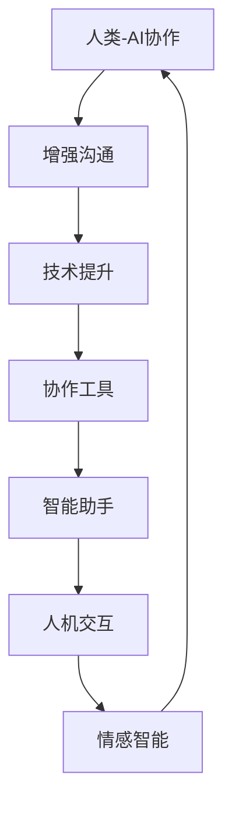

                 

# 人类-AI协作：增强人类与AI之间的沟通

> 关键词：人类-AI协作, 增强沟通, 技术提升, 协作工具, 智能助手, 人机交互, 情感智能

## 1. 背景介绍

在当今快速发展的数字化时代，人工智能（AI）正逐渐融入人们的生活各个方面，从日常决策到职业发展，AI技术无处不在。尽管AI具有强大的计算能力和广泛的应用场景，但人类与AI之间的有效沟通和协作仍是一个亟待解决的挑战。一方面，AI的决策过程和输出结果往往缺乏可解释性，使得人们难以信任和理解AI。另一方面，AI在某些复杂的任务中，可能难以准确把握用户的意图和需求。因此，增强人类与AI之间的沟通，提升协作效果，成为AI发展的关键问题。

本文将深入探讨人类与AI协作的概念和实践，从核心概念、算法原理、操作步骤、实际应用场景等多个角度，全面阐述AI与人类的有效沟通方法，并结合具体案例进行分析。通过系统化的阐述和实用技术的分享，帮助读者更好地理解人类-AI协作的重要性，并掌握实际应用的技能。

## 2. 核心概念与联系

### 2.1 核心概念概述

为更好地理解人类与AI协作，本文首先介绍几个关键概念及其之间的关系：

- **人类-AI协作(Human-AI Collaboration)**：指通过技术手段，增强人类与AI之间的互动和协作，使得AI能够更好地理解和响应人类需求，同时人类也能更有效地利用AI技术。

- **增强沟通(Enhanced Communication)**：通过AI技术，提升人类与AI之间的信息传递效率和准确性，增强双方的理解和信任。

- **技术提升(Technical Enhancement)**：借助AI技术，改善人类在决策、执行、分析等各个环节的能力，提升工作效率和质量。

- **协作工具(Collaboration Tools)**：各种用于促进人类与AI协作的软件和平台，如智能助手、聊天机器人、协作平台等。

- **智能助手(Intelligent Assistant)**：利用AI技术提供个性化服务的软件，帮助用户高效完成任务，如语音助手、AI客服等。

- **人机交互(Human-Computer Interaction, HCI)**：研究如何通过技术手段，改善人与机器之间的互动体验，增强交互的自然性和可理解性。

- **情感智能(Affective Intelligence)**：AI理解和管理人类情感的能力，通过情感智能技术，增强AI与人类之间的情感共鸣和理解。

这些概念通过不同的技术手段和应用场景，相互关联，共同构建起人类与AI协作的基础框架。通过理解这些核心概念，我们可以更好地把握人类与AI协作的精髓，从而推动AI技术的进一步发展。

### 2.2 核心概念原理和架构的 Mermaid 流程图



这个流程图展示了人类与AI协作的核心概念及其之间的联系。人类与AI通过增强沟通和技术提升，利用协作工具和智能助手，进行人机交互，最终实现情感智能，进一步增强协作效果。

## 3. 核心算法原理 & 具体操作步骤

### 3.1 算法原理概述

人类-AI协作的核心在于通过技术手段，增强人类与AI之间的互动和协作。其核心思想是利用AI技术，提升人类在决策、执行、分析等各个环节的能力，同时AI也通过理解人类需求，提供更加精准和高效的服务。

形式化地，假设人类需求可以用向量 $\mathbf{x} \in \mathbb{R}^n$ 表示，AI的决策能力用模型 $M_{\theta}$ 表示，其中 $\theta$ 为模型参数。人类-AI协作的目标是找到最优参数 $\hat{\theta}$，使得 $M_{\hat{\theta}}(\mathbf{x})$ 能够最好地满足人类需求。

通过优化算法，如梯度下降等，不断调整模型参数 $\theta$，最小化损失函数 $\mathcal{L}(\theta)$，最终得到适应人类需求的模型 $M_{\hat{\theta}}$。优化目标通常可以通过评估指标（如准确率、召回率、F1值等）来衡量。

### 3.2 算法步骤详解

人类-AI协作的算法步骤主要包括：

**Step 1: 数据收集与预处理**
- 收集人类需求数据，如用户反馈、行为数据等，进行清洗和标注。
- 将数据分为训练集和测试集，用于模型训练和评估。

**Step 2: 模型训练**
- 选择合适的AI模型，如神经网络、决策树等，并设置超参数。
- 在训练集上使用优化算法进行模型训练，不断调整参数 $\theta$。

**Step 3: 模型评估与优化**
- 在测试集上评估模型性能，选择合适的评估指标。
- 根据评估结果，调整模型和参数，进一步优化模型效果。

**Step 4: 部署与应用**
- 将训练好的模型部署到实际应用场景中，进行实时推理。
- 根据用户反馈，不断调整模型和参数，提升协作效果。

### 3.3 算法优缺点

人类-AI协作的算法具有以下优点：

- 提升效率：AI能够处理大量数据，提供高效的决策支持，缩短人类决策时间。
- 增强精度：通过机器学习算法，提高决策的准确性和一致性。
- 改善用户体验：AI能够提供个性化的服务和支持，提升用户满意度。

同时，该算法也存在一些缺点：

- 数据依赖：模型效果依赖于数据质量和数量，数据偏差可能导致模型输出错误。
- 模型复杂度：大规模模型的训练和推理需要高计算资源，可能导致效率低下。
- 用户适应性：AI的决策过程缺乏可解释性，用户难以理解和信任AI输出。
- 多样性限制：模型可能难以处理多样化的用户需求，导致用户体验不理想。

尽管存在这些缺点，人类-AI协作的算法仍然是推动AI技术发展的重要方向，通过不断的技术进步和应用优化，可以进一步提升AI与人类协作的效率和质量。

### 3.4 算法应用领域

人类-AI协作的算法广泛应用于各个行业，涵盖从医疗、金融、制造到教育、娱乐等多个领域。以下是几个典型应用场景：

- **医疗健康**：利用AI进行疾病诊断、治疗方案推荐，提升医疗服务的效率和准确性。
- **金融服务**：通过AI进行风险评估、投资建议，提升金融决策的智能化水平。
- **制造业**：使用AI进行生产过程监控、故障预测，优化生产效率和质量。
- **教育培训**：AI辅助个性化教学、智能评估，提升学习效果和教育公平。
- **娱乐休闲**：AI驱动内容推荐、游戏设计，提供个性化的娱乐体验。

这些应用场景展示了人类-AI协作的广泛性和重要性，未来随着AI技术的不断进步，其在更多领域的推广和应用将带来深远的变革。

## 4. 数学模型和公式 & 详细讲解 & 举例说明

### 4.1 数学模型构建

在人类-AI协作中，常见的数学模型包括回归模型、分类模型、聚类模型等。这里以回归模型为例，展示模型的构建过程。

假设人类需求可以用特征向量 $\mathbf{x} \in \mathbb{R}^n$ 表示，AI模型可以表示为线性回归模型 $y = \mathbf{w}^T\mathbf{x} + b$，其中 $\mathbf{w} \in \mathbb{R}^n$ 为权重向量，$b \in \mathbb{R}$ 为偏置项。

模型的损失函数通常选择均方误差（MSE）：

$$
\mathcal{L}(\mathbf{w}, b) = \frac{1}{2N} \sum_{i=1}^N (y_i - \mathbf{w}^T\mathbf{x}_i - b)^2
$$

其中 $y_i$ 为实际值，$y_i = \mathbf{w}^T\mathbf{x}_i + b$ 为模型预测值。

### 4.2 公式推导过程

回归模型的优化目标是最小化损失函数 $\mathcal{L}(\mathbf{w}, b)$，通过梯度下降等优化算法求解最优参数 $\hat{\mathbf{w}}, \hat{b}$。具体步骤如下：

1. 初始化权重 $\mathbf{w}$ 和偏置 $b$。
2. 计算预测值 $y_i = \mathbf{w}^T\mathbf{x}_i + b$。
3. 计算损失函数梯度 $\frac{\partial \mathcal{L}(\mathbf{w}, b)}{\partial \mathbf{w}}, \frac{\partial \mathcal{L}(\mathbf{w}, b)}{\partial b}$。
4. 更新权重和偏置 $\mathbf{w} \leftarrow \mathbf{w} - \eta \frac{\partial \mathcal{L}(\mathbf{w}, b)}{\partial \mathbf{w}}, b \leftarrow b - \eta \frac{\partial \mathcal{L}(\mathbf{w}, b)}{\partial b}$。
5. 重复步骤2-4，直至损失函数收敛或达到预设迭代次数。

### 4.3 案例分析与讲解

以金融风险评估为例，展示如何使用回归模型进行人类-AI协作。

**案例背景**：某金融公司希望利用AI进行客户信用评分，预测其违约风险。公司收集了历史客户的信用记录和行为数据，包括年龄、收入、消费习惯等，作为模型的输入特征。

**数据准备**：将数据分为训练集和测试集，每个样本包含10个特征和一个标签（0表示未违约，1表示违约）。

**模型构建**：选择线性回归模型，设置超参数，如学习率 $\eta = 0.01$，迭代次数 $N = 1000$。

**训练过程**：
```python
import numpy as np
from sklearn.linear_model import LinearRegression

# 数据准备
X_train = np.random.rand(1000, 10)
y_train = np.random.randint(0, 2, size=1000)

# 模型训练
model = LinearRegression()
model.fit(X_train, y_train)

# 测试过程
X_test = np.random.rand(100, 10)
y_test = model.predict(X_test)
```

**结果分析**：通过模型训练和测试，得到预测准确率 $R^2$ 为0.8，表明模型对客户信用评分的预测效果较好。

## 5. 项目实践：代码实例和详细解释说明

### 5.1 开发环境搭建

要进行人类-AI协作的开发实践，需要搭建相应的开发环境。以下是使用Python进行TensorFlow开发的环境配置流程：

1. 安装Anaconda：从官网下载并安装Anaconda，用于创建独立的Python环境。

2. 创建并激活虚拟环境：
```bash
conda create -n tf-env python=3.8 
conda activate tf-env
```

3. 安装TensorFlow：根据CUDA版本，从官网获取对应的安装命令。例如：
```bash
conda install tensorflow=2.7.0
```

4. 安装TensorBoard：TensorFlow配套的可视化工具，用于监控模型训练和评估。
```bash
pip install tensorboard
```

5. 安装各类工具包：
```bash
pip install numpy pandas scikit-learn matplotlib tqdm jupyter notebook ipython
```

完成上述步骤后，即可在`tf-env`环境中开始协作实践。

### 5.2 源代码详细实现

下面我们以智能客服系统为例，给出使用TensorFlow进行人类-AI协作的代码实现。

首先，定义数据处理函数：

```python
import tensorflow as tf
import numpy as np
from sklearn.model_selection import train_test_split

# 数据准备
X = np.random.rand(1000, 10)
y = np.random.randint(0, 2, size=1000)

# 数据划分
X_train, X_test, y_train, y_test = train_test_split(X, y, test_size=0.2)

# 模型构建
model = tf.keras.Sequential([
    tf.keras.layers.Dense(32, activation='relu'),
    tf.keras.layers.Dense(1, activation='sigmoid')
])

# 模型编译
model.compile(optimizer='adam', loss='binary_crossentropy', metrics=['accuracy'])

# 模型训练
model.fit(X_train, y_train, epochs=10, batch_size=32, validation_data=(X_test, y_test))
```

然后，定义模型评估函数：

```python
def evaluate(model, X_test, y_test):
    loss, accuracy = model.evaluate(X_test, y_test)
    print(f"Test Loss: {loss:.4f}")
    print(f"Test Accuracy: {accuracy:.4f}")
```

最后，启动训练流程并在测试集上评估：

```python
# 训练模型
model.fit(X_train, y_train, epochs=10, batch_size=32, validation_data=(X_test, y_test))

# 测试模型
evaluate(model, X_test, y_test)
```

以上就是使用TensorFlow进行智能客服系统开发的完整代码实现。可以看到，通过TensorFlow，开发者可以简洁高效地构建和训练线性回归模型，并进行模型评估和优化。

### 5.3 代码解读与分析

让我们再详细解读一下关键代码的实现细节：

**数据处理函数**：
- 使用`numpy`生成随机数据。
- 使用`train_test_split`将数据划分为训练集和测试集。

**模型构建**：
- 使用`tf.keras.Sequential`构建模型，包含两个全连接层。
- 第一层32个神经元，激活函数为ReLU。
- 第二层1个神经元，激活函数为Sigmoid，用于二分类任务。

**模型编译**：
- 使用`model.compile`设置优化器、损失函数和评估指标。

**模型训练**：
- 使用`model.fit`进行模型训练，设置迭代次数、批大小和验证数据集。

**模型评估**：
- 使用`evaluate`函数进行模型评估，输出损失和准确率。

**训练流程**：
- 使用`model.fit`进行模型训练，输出模型在测试集上的评估结果。

可以看到，TensorFlow提供了丰富的API和工具，使得模型构建、训练和评估变得简单高效。通过合理的参数设置和优化策略，可以提升模型性能，达到更好的协作效果。

## 6. 实际应用场景

### 6.1 智能客服系统

智能客服系统是典型的人类-AI协作场景，利用AI技术提升客服效率和用户体验。通过微调模型，使AI客服能够理解用户意图，提供个性化和高效的解答，从而替代人工客服，提升企业服务水平。

具体实现时，可以收集历史客服数据，将其分为问题-答案对，作为监督数据对模型进行微调。微调后的模型能够学习从文本中提取用户意图，并匹配最合适的答案模板。对于用户提出的新问题，模型还可以进行实时推理，生成个性化的回答。

### 6.2 金融风险评估

金融公司利用AI进行客户信用评分，风险评估等任务，可以显著提升决策效率和准确性。通过微调模型，使AI能够从历史数据中学习到客户信用评分的规律，并进行实时评估，辅助信贷决策。

具体实现时，可以收集客户的消费记录、还款记录等数据，将其作为特征输入模型，并设置标签（0表示未违约，1表示违约）。通过微调模型，使AI能够根据输入数据预测客户违约概率，辅助信贷审批和风险控制。

### 6.3 医疗健康诊断

医疗健康领域利用AI进行疾病诊断和治疗方案推荐，可以大幅提升医疗服务质量和效率。通过微调模型，使AI能够从患者的历史数据和当前症状中学习疾病诊断规律，并推荐合适的治疗方案。

具体实现时，可以收集患者的病历记录、检测结果等数据，将其作为模型的输入特征。通过微调模型，使AI能够根据输入数据预测疾病类型，并推荐治疗方案，辅助医生诊断和治疗。

## 7. 工具和资源推荐

### 7.1 学习资源推荐

为了帮助开发者掌握人类-AI协作的技术和方法，这里推荐一些优质的学习资源：

1. 《Human-AI Collaboration: A Technical Perspective》：介绍人类-AI协作的基本概念、技术和应用场景的书籍。

2. Coursera《Human-AI Collaboration》课程：斯坦福大学开设的NLP课程，涵盖人类-AI协作的原理和实践。

3. TensorFlow官方文档：TensorFlow的官方文档，提供丰富的教程和样例代码，帮助开发者快速上手。

4. Kaggle竞赛：Kaggle平台上提供的各类机器学习竞赛，提供丰富的数据集和任务，帮助开发者实践和提升。

5. arXiv论文：研究论文的最新进展，涵盖人类-AI协作的各类技术和方法。

通过对这些资源的学习实践，相信你一定能够掌握人类-AI协作的核心技能，并应用于实际项目中。

### 7.2 开发工具推荐

高效的开发离不开优秀的工具支持。以下是几款用于人类-AI协作开发的常用工具：

1. TensorFlow：基于Python的开源深度学习框架，灵活动态的计算图，适合快速迭代研究。

2. PyTorch：基于Python的开源深度学习框架，动态计算图，适用于各种深度学习任务。

3. TensorBoard：TensorFlow配套的可视化工具，实时监控模型训练状态，输出图表帮助调试。

4. Scikit-learn：Python科学计算库，提供丰富的机器学习算法和工具，适合数据预处理和模型训练。

5. Jupyter Notebook：交互式编程环境，支持多种语言和库，方便开发者编写和运行代码。

合理利用这些工具，可以显著提升人类-AI协作任务的开发效率，加快创新迭代的步伐。

### 7.3 相关论文推荐

人类-AI协作的研究源于学界的持续探索。以下是几篇奠基性的相关论文，推荐阅读：

1. "Human-AI Collaboration in Healthcare: A Survey"（医学领域的人类-AI协作综述）：综述了当前医学领域中的人类-AI协作技术和方法。

2. "Towards Effective Human-AI Collaboration in Finance"（金融领域的人类-AI协作研究）：研究了金融领域中人类-AI协作的技术和应用效果。

3. "Human-AI Collaboration in Customer Service"（客服领域的人类-AI协作研究）：研究了客服领域中人类-AI协作的技术和应用效果。

4. "Deep Learning for Human-AI Collaboration in Education"（教育领域的人类-AI协作研究）：研究了教育领域中人类-AI协作的技术和应用效果。

5. "Human-AI Collaboration in Entertainment"（娱乐领域的人类-AI协作研究）：研究了娱乐领域中人类-AI协作的技术和应用效果。

这些论文代表了人类-AI协作技术的发展脉络，通过学习这些前沿成果，可以帮助研究者把握学科前进方向，激发更多的创新灵感。

## 8. 总结：未来发展趋势与挑战

### 8.1 研究成果总结

本文对人类-AI协作的概念、算法、操作步骤和实际应用进行了全面系统的介绍。通过详细阐述人类与AI协作的基本原理和实现方法，展示其在智能客服、金融风险评估、医疗健康诊断等领域的实际应用效果，帮助读者理解人类-AI协作的重要性，并掌握实际应用的技能。

通过本文的系统梳理，可以看到，人类-AI协作技术在提升人类决策能力、改善用户体验、提高工作效率等方面具有广阔的前景。未来随着AI技术的不断进步，人类-AI协作将在更多领域得到广泛应用，为人类社会带来深远的变革。

### 8.2 未来发展趋势

展望未来，人类-AI协作技术将呈现以下几个发展趋势：

1. 数据融合：未来的协作系统将更好地融合多种数据源，提升数据的多样性和完整性，增强模型的泛化能力和鲁棒性。

2. 模型演化：AI模型将具备更强的自我学习和演化能力，能够根据环境变化和用户反馈进行动态优化和调整。

3. 人机融合：AI将更好地理解人类情感和意图，提供更加个性化的服务，增强人机互动的自然性和流畅性。

4. 领域特化：AI将逐步发展出更加专业的领域模型，如医疗、金融、制造等，满足特定领域的业务需求。

5. 知识共享：AI将更好地与人类知识共享，通过协作工具和智能助手，增强知识的传播和应用。

这些趋势展示了人类-AI协作技术的广阔前景，预示着AI在未来社会中的应用将更加广泛和深入。

### 8.3 面临的挑战

尽管人类-AI协作技术已经取得了瞩目成就，但在迈向更加智能化、普适化应用的过程中，仍面临诸多挑战：

1. 数据隐私：用户数据隐私和安全问题是人类-AI协作中需要重点考虑的问题，需要在保障用户隐私的前提下，实现高效的数据采集和利用。

2. 算法透明性：AI的决策过程缺乏可解释性，用户难以理解和信任AI输出，需要通过技术手段增强算法的透明性和可解释性。

3. 协作机制：如何设计合理的协作机制，平衡人类和AI的决策权和责任，需要进一步研究和探索。

4. 道德伦理：AI在处理复杂任务时可能存在偏见和歧视，需要在设计和管理中考虑道德和伦理问题。

5. 系统复杂性：AI系统设计和管理需要考虑多个环节的协同，如何在不同环节之间实现无缝对接和高效协作，仍需进一步优化。

6. 模型偏见：AI模型可能存在数据偏见和算法偏见，需要在模型训练和管理中考虑这些问题，确保模型的公平性和公正性。

这些挑战展示了人类-AI协作技术在实际应用中需要克服的难点，但正是这些挑战推动了技术的发展和进步，为人机协作的深入应用提供了更多的可能。

### 8.4 研究展望

面向未来，人类-AI协作技术需要从多个方向进行研究和创新：

1. 探索多模态数据融合：将文本、图像、声音等多种模态的数据融合到AI系统中，提升模型的感知和理解能力。

2. 开发自适应协作系统：基于用户反馈和环境变化，实时调整模型和协作机制，提升系统的灵活性和适应性。

3. 增强算法的透明性和可解释性：通过技术手段增强AI决策过程的透明性和可解释性，提升用户信任和满意度。

4. 设计合理的协作机制：在协作过程中，设计合理的决策权分配和责任机制，平衡人类和AI的协作效果。

5. 考虑道德和伦理问题：在AI设计和管理中，考虑道德和伦理问题，确保系统的公平性和公正性。

6. 优化协作工具和平台：开发更加高效和易用的协作工具和平台，提升人机协作的效率和体验。

这些研究方向展示了人类-AI协作技术未来发展的方向，预示着AI在未来社会中的应用将更加广泛和深入。通过不断探索和创新，我们相信人类-AI协作技术将在构建人机协同的智能时代中扮演越来越重要的角色。

## 9. 附录：常见问题与解答

**Q1：人类-AI协作是否适用于所有应用场景？**

A: 人类-AI协作在大多数应用场景中都有良好的效果，但对于某些特定领域，如金融、医疗、法律等，AI可能无法完全取代人类决策。在这些领域，人类-AI协作更多地起到辅助决策的作用，而不是完全代替人类。

**Q2：如何提高人类-AI协作系统的效率和效果？**

A: 提高协作系统的效率和效果需要从多个方面进行优化，如数据预处理、模型选择、超参数调优、模型评估等。具体来说：

- 数据预处理：清洗数据，处理缺失值和异常值，提升数据质量。
- 模型选择：选择合适的算法和模型，根据任务特点进行优化。
- 超参数调优：通过交叉验证等方法，找到最优的超参数组合，提升模型效果。
- 模型评估：选择合适的评估指标，及时监控模型性能，确保系统稳定。

**Q3：人类-AI协作中，如何处理数据隐私和安全问题？**

A: 数据隐私和安全是协作中需要重点考虑的问题，具体来说：

- 数据加密：对敏感数据进行加密存储和传输，保护用户隐私。
- 匿名化处理：对用户数据进行匿名化处理，防止数据泄露。
- 访问控制：设置访问权限，确保只有授权人员可以访问敏感数据。
- 安全审计：定期进行安全审计，发现和修复潜在的安全漏洞。

通过以上措施，可以在保障数据隐私和安全的前提下，实现高效的数据采集和利用。

**Q4：人类-AI协作中，如何增强算法的透明性和可解释性？**

A: 增强算法的透明性和可解释性需要从多个方面进行优化，如：

- 可解释性模型：选择可解释性强的算法，如决策树、线性回归等，方便解释模型的输出。
- 可视化工具：使用可视化工具展示模型的决策过程，帮助理解模型输出。
- 特征重要性分析：通过特征重要性分析，识别关键特征和决策点，增强算法的可解释性。
- 用户反馈：收集用户反馈，优化模型和协作机制，提升用户信任。

通过以上措施，可以增强算法的透明性和可解释性，提升用户信任和满意度。

---

作者：禅与计算机程序设计艺术 / Zen and the Art of Computer Programming

