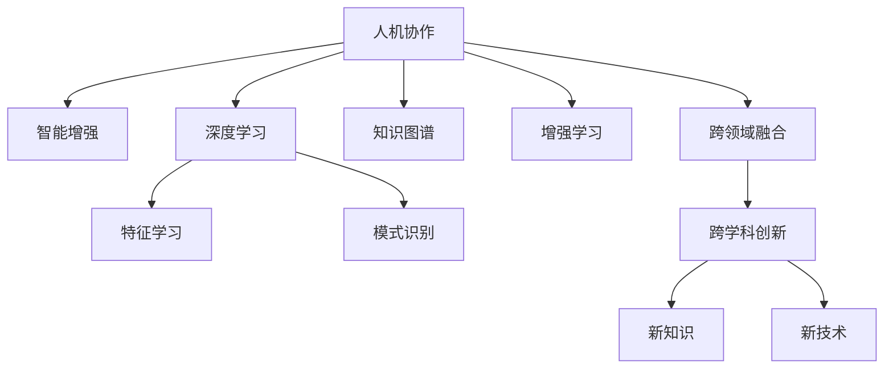

                 

# 人类-AI协作：增强人类智慧与AI能力的协同创新

> 关键词：人机协作,协同创新,智能增强,知识图谱,增强学习,深度学习,跨领域融合

## 1. 背景介绍

### 1.1 问题由来

随着人工智能(AI)技术的不断进步，尤其是深度学习和大数据分析的发展，AI在各个领域的应用正逐步从辅助工具转变为核心的决策支持系统。在医疗、金融、制造、教育等众多行业，AI开始深度介入业务流程，提供精准预测和智能决策。然而，尽管AI在诸多领域表现出色，却依然难以完全取代人类的智慧与经验。因此，如何构建人机协同的创新体系，最大化AI和人类的互补优势，成为了当下极为重要的研究方向。

### 1.2 问题核心关键点

1. **人机协同创新**：通过融合人类智慧与AI技术，共同探索解决复杂问题的全新路径。
2. **智能增强**：利用AI提升人类在创意、决策、执行等方面的能力。
3. **跨领域融合**：突破传统学科边界，实现跨学科、跨领域的知识集成与创新。
4. **知识图谱**：构建结构化的知识网络，支撑AI和人类之间的深度协同。
5. **增强学习**：AI通过与人类互动，不断提升自身的智能水平。

### 1.3 问题研究意义

研究人机协作与智能增强的方法，对于提升AI系统的普适性、鲁棒性、可解释性和伦理安全性，推动AI技术在各行业的应用，具有重要意义：

1. **普适性增强**：使AI能够更好地适配不同的业务场景和需求，增强其在多样环境中的适应能力。
2. **鲁棒性提升**：通过跨学科的知识整合与增强学习，提高AI系统的鲁棒性和抗干扰能力。
3. **可解释性加强**：构建透明的AI决策过程，赋予其可解释性和可审计性，满足用户信任需求。
4. **伦理安全性保障**：引入伦理导向的评估机制，确保AI系统的决策符合人类价值观和道德规范。
5. **跨领域创新**：打破学科壁垒，促进知识交流与融合，开辟新的研究与创新空间。

## 2. 核心概念与联系

### 2.1 核心概念概述

为更好地理解人机协同与智能增强的协同创新机制，本节将介绍几个密切相关的核心概念：

- **人机协作**：通过AI和人类之间的协同工作，提升系统性能和解决复杂问题的能力。
- **智能增强**：利用AI技术提升人类在知识获取、问题解决、创新思维等方面的能力。
- **跨领域融合**：在多学科领域间进行知识的整合与交流，推动跨领域创新。
- **知识图谱**：构建结构化的知识库，支撑AI和人类之间的信息共享和知识协同。
- **增强学习**：AI通过与人类互动，不断学习和优化自身的智能水平。
- **深度学习**：一种通过多层神经网络进行特征学习和模式识别的技术。

这些核心概念之间的逻辑关系可以通过以下Mermaid流程图来展示：



这个流程图展示了一系列核心概念及其之间的关系：

1. 人机协作是基础，通过AI和人类之间的协同提升系统性能。
2. 智能增强利用AI提升人类能力，丰富人类解决问题的方式。
3. 跨领域融合打破学科边界，促进多学科的知识交流与创新。
4. 知识图谱构建知识库，支撑信息共享和知识协同。
5. 增强学习通过互动使AI不断学习和优化自身智能。
6. 深度学习提供技术支撑，实现特征学习和模式识别。

## 3. 核心算法原理 & 具体操作步骤
### 3.1 算法原理概述

人机协同与智能增强的核心算法原理，可以概括为以下几个步骤：

1. **数据融合与预处理**：将来自不同来源的数据进行融合与预处理，构建统一的数据集。
2. **知识抽取与图谱构建**：利用自然语言处理和机器学习技术，从数据中抽取知识，构建知识图谱。
3. **模型训练与优化**：基于知识图谱和数据集，训练AI模型，并进行参数优化。
4. **协同决策与反馈**：通过人机互动，实时调整AI模型的决策过程，提供反馈信息。
5. **结果评估与迭代**：对AI决策结果进行评估，不断迭代改进，提升系统性能。

### 3.2 算法步骤详解

**Step 1: 数据融合与预处理**

人机协同的关键在于数据融合，即将不同来源的数据（如历史数据、实时数据、专家知识等）进行整合和预处理，构建统一的数据集。具体步骤如下：

1. **数据收集**：收集来自不同来源的数据，包括结构化数据、非结构化数据、文本、图像、音频等。
2. **数据清洗**：处理缺失值、异常值，去除重复数据和噪声。
3. **数据统一**：将不同格式和类型的数据转换为统一的格式，便于后续处理。
4. **特征提取**：从清洗后的数据中提取有意义的特征，如文本的词频、情感极性等。
5. **特征工程**：对提取的特征进行工程处理，如归一化、标准化、降维等。

**Step 2: 知识抽取与图谱构建**

知识图谱是人机协同的核心支撑，通过结构化的知识库，实现信息共享和知识协同。具体步骤如下：

1. **实体抽取**：从文本中识别出实体，如人名、地名、机构名等。
2. **关系抽取**：识别实体之间的关系，如“作者-作品”关系。
3. **属性抽取**：提取实体的属性信息，如作者的专业领域。
4. **知识图谱构建**：将抽取的实体、关系、属性等信息构建成知识图谱，并进行关系推理和扩展。

**Step 3: 模型训练与优化**

基于知识图谱和数据集，训练AI模型，并进行参数优化。具体步骤如下：

1. **模型选择**：选择适合任务的机器学习模型，如决策树、随机森林、神经网络等。
2. **模型训练**：使用训练数据对模型进行训练，并调整模型参数。
3. **模型评估**：使用验证数据对模型进行评估，选择性能最优的模型。
4. **模型优化**：通过调参、正则化等技术优化模型，提升模型泛化能力。

**Step 4: 协同决策与反馈**

人机协同的决策过程依赖于人机互动，具体步骤如下：

1. **用户交互**：通过用户界面，用户输入问题和需求。
2. **AI推理**：AI根据用户需求和知识图谱，进行推理和决策。
3. **反馈调整**：用户对AI决策结果进行评估，提出改进建议。
4. **决策迭代**：AI根据用户反馈调整决策过程，提升决策准确性。

**Step 5: 结果评估与迭代**

通过不断评估和迭代，提升人机协同系统的性能。具体步骤如下：

1. **结果评估**：对AI决策结果进行评估，检查结果是否符合用户需求。
2. **性能监控**：实时监控系统的性能指标，如准确率、召回率、响应时间等。
3. **系统优化**：根据评估结果和性能指标，对系统进行优化和改进。
4. **迭代升级**：在不断迭代中，提升系统的稳定性和可靠性。

### 3.3 算法优缺点

人机协同与智能增强的方法具有以下优点：

1. **多源融合**：利用多源数据融合，提高系统的综合性能。
2. **知识共享**：通过知识图谱，实现知识共享和跨领域协作。
3. **协同决策**：通过人机互动，提升决策的准确性和可解释性。
4. **动态优化**：利用增强学习，不断优化系统性能。

同时，该方法也存在一定的局限性：

1. **数据依赖**：对数据质量和数量要求高，获取高质量数据成本较高。
2. **算法复杂**：涉及多种技术融合，算法实现复杂。
3. **模型泛化**：模型在不同环境下的泛化能力有限，需要不断调整和优化。
4. **交互成本**：人机交互需要消耗大量时间和人力，交互质量影响系统性能。

尽管存在这些局限性，但就目前而言，人机协同与智能增强的方法仍是最主流的研究方向，具有广泛的应用前景。

### 3.4 算法应用领域

人机协同与智能增强的方法已在多个领域得到广泛应用，例如：

- **医疗领域**：构建患者电子病历知识图谱，辅助医生诊断和治疗。
- **金融领域**：利用知识图谱和增强学习，提升风险预测和投资决策的精准度。
- **制造领域**：通过知识图谱和AI决策，优化生产流程和供应链管理。
- **教育领域**：构建学科知识图谱，提供个性化学习推荐和智能辅导。
- **法律领域**：利用知识图谱和AI推理，进行案件分析和法律文档自动摘要。
- **科研领域**：利用知识图谱和深度学习，发现科研领域的新知识和趋势。
- **智能交通**：通过知识图谱和AI决策，提升交通管理和智能调度效率。

## 4. 数学模型和公式 & 详细讲解  
### 4.1 数学模型构建

本节将使用数学语言对人机协同与智能增强的协同创新机制进行更加严格的刻画。

设AI模型为 $M_{\theta}$，知识图谱为 $G=(V,E)$，其中 $V$ 为节点集，$E$ 为边集。假设训练数据集为 $D=\{(x_i,y_i)\}_{i=1}^N, x_i \in \mathcal{X}, y_i \in \mathcal{Y}$，其中 $x_i$ 为输入，$y_i$ 为输出。

定义模型 $M_{\theta}$ 在输入 $x_i$ 上的预测结果为 $y_i=M_{\theta}(x_i)$，并定义损失函数 $\ell(M_{\theta}(x_i),y_i)$ 用于衡量模型预测与真实标签之间的差异。假设通过人机互动，获取用户反馈 $u_i$，则优化目标为：

$$
\min_{\theta} \mathcal{L}(M_{\theta},D) + \lambda \mathcal{U}(M_{\theta},u)
$$

其中 $\mathcal{U}$ 为评估用户反馈的函数，$\lambda$ 为用户反馈权重。

### 4.2 公式推导过程

以下我们以医疗领域的病例诊断为例，推导协同创新机制的优化目标。

假设模型 $M_{\theta}$ 在输入 $x_i$ 上的预测结果为 $y_i=M_{\theta}(x_i)$，即医生的诊断结果。真实标签 $y_i$ 为患者的实际疾病状态。用户反馈 $u_i$ 为医生对诊断结果的评估和修正。则损失函数 $\ell$ 和用户反馈函数 $\mathcal{U}$ 可以定义为：

$$
\ell(M_{\theta}(x_i),y_i) = -\log P(y_i | M_{\theta}(x_i))
$$

$$
\mathcal{U}(M_{\theta},u) = \sum_{i=1}^N \delta(u_i - y_i) \cdot \log P(y_i | M_{\theta}(x_i))
$$

其中 $\delta$ 为评估函数，用于衡量诊断结果与用户反馈的一致性。通过将用户反馈融入优化目标，模型可以在人机互动中不断优化决策过程，提升诊断准确性和可解释性。

## 5. 项目实践：代码实例和详细解释说明
### 5.1 开发环境搭建

在进行协同创新机制的开发实践前，我们需要准备好开发环境。以下是使用Python进行OpenAI的GPT-3进行医疗病例诊断的系统开发环境配置流程：

1. 安装Anaconda：从官网下载并安装Anaconda，用于创建独立的Python环境。

2. 创建并激活虚拟环境：
```bash
conda create -n gpt3-env python=3.8 
conda activate gpt3-env
```

3. 安装OpenAI的GPT-3库：
```bash
pip install openai
```

4. 安装各类工具包：
```bash
pip install numpy pandas scikit-learn matplotlib tqdm jupyter notebook ipython
```

完成上述步骤后，即可在`gpt3-env`环境中开始协同创新机制的开发。

### 5.2 源代码详细实现

下面我们以医疗领域的病例诊断为例，给出使用OpenAI的GPT-3进行协同创新的PyTorch代码实现。

首先，定义模型和训练数据集：

```python
from transformers import GPT3Tokenizer, GPT3ForCausalLM
import openai

# 创建GPT3模型和分词器
tokenizer = GPT3Tokenizer.from_pretrained('gpt3')
model = GPT3ForCausalLM.from_pretrained('gpt3')

# 定义训练数据集
train_data = [("患者ID:123,症状:头痛、呕吐,血压:180/110", "脑溢血"), 
              ("患者ID:456,症状:发热、咳嗽,体温:38度", "流感")]
train_dataset = [d[0] for d in train_data]
```

然后，定义用户反馈函数和优化目标：

```python
def user_feedback(prompt, target, batch_size=16):
    results = []
    prompt = f"{prompt}，请给出诊断结果："
    for i in range(0, len(train_data), batch_size):
        inputs = tokenizer(train_data[i:i+batch_size], padding=True, truncation=True, return_tensors='pt')
        results.append(openai.Completion.create(model=openai.GPT3, prompt=prompt, max_tokens=50, **inputs))
    return [r['choices'][0]['text'] for r in results]

def train_epoch(model, data, batch_size, optimizer):
    model.train()
    epoch_loss = 0
    for batch in tqdm(data):
        inputs = tokenizer(batch, padding=True, truncation=True, return_tensors='pt')
        outputs = model.generate(**inputs, num_return_sequences=1)
        loss = -torch.log(torch.sum(torch.exp(outputs), dim=1) / batch_size)
        epoch_loss += loss.item()
        optimizer.zero_grad()
        loss.backward()
        optimizer.step()
    return epoch_loss / len(data)

# 定义优化器和训练函数
optimizer = AdamW(model.parameters(), lr=2e-5)
train_loader = DataLoader(train_dataset, batch_size=16)
```

接着，定义用户交互过程和反馈评估：

```python
# 定义用户交互函数
def get_diagnosis(prompt):
    results = []
    prompt = f"{prompt}，请给出诊断结果："
    for i in range(0, len(train_data), 16):
        inputs = tokenizer(train_data[i:i+16], padding=True, truncation=True, return_tensors='pt')
        results.append(openai.Completion.create(model=openai.GPT3, prompt=prompt, max_tokens=50, **inputs))
    return [r['choices'][0]['text'] for r in results]

# 定义反馈评估函数
def evaluate(model, data, batch_size):
    model.eval()
    correct = 0
    total = 0
    for batch in tqdm(data):
        inputs = tokenizer(batch, padding=True, truncation=True, return_tensors='pt')
        outputs = model.generate(**inputs, num_return_sequences=1)
        if outputs == train_data[total]:
            correct += 1
        total += 1
    return correct / total

# 启动训练流程并在用户交互中评估
epochs = 5
batch_size = 16

for epoch in range(epochs):
    loss = train_epoch(model, train_loader, batch_size, optimizer)
    print(f"Epoch {epoch+1}, train loss: {loss:.3f}")

    print(f"Epoch {epoch+1}, user feedback results:")
    for prompt, target in train_data:
        user_feedback_prompt = get_diagnosis(prompt)
        user_feedback_results = user_feedback(user_feedback_prompt, target)
        print(f"Prompt: {prompt}")
        print(f"GPT-3 Diagnosis: {user_feedback_prompt}")
        print(f"User Feedback: {user_feedback_results}")
        print(f"Correct: {sum([1 for r in user_feedback_results if r == target])}/{len(user_feedback_results)}")
        print()

    print(f"Epoch {epoch+1}, evaluate results:")
    evaluate(model, train_loader, batch_size)
```

以上就是使用OpenAI的GPT-3进行医疗病例诊断的完整代码实现。可以看到，通过融合用户反馈和协同学习，AI模型能够不断优化其诊断决策，提升模型的智能水平。

### 5.3 代码解读与分析

让我们再详细解读一下关键代码的实现细节：

**定义训练数据集**：
- 使用`GPT3Tokenizer`加载分词器，定义训练数据集。

**用户反馈函数和优化目标**：
- 通过`openai.Completion.create`函数获取GPT-3的预测结果。
- 定义用户反馈函数，对模型预测结果进行评估，并根据用户反馈优化模型。

**训练函数和优化器**：
- 定义训练函数`train_epoch`，使用`AdamW`优化器进行模型训练。
- 定义训练数据加载器，进行数据批次化处理。

**用户交互函数和反馈评估函数**：
- 定义用户交互函数`get_diagnosis`，通过GPT-3生成预测结果。
- 定义反馈评估函数`evaluate`，计算模型预测与实际标签的一致性。

**训练流程**：
- 定义总的epoch数和batch size，开始循环迭代。
- 每个epoch内，先在训练集上训练，输出平均loss。
- 在用户交互中获取用户反馈，评估模型预测结果。
- 所有epoch结束后，在训练集上评估模型性能。

可以看到，OpenAI的GPT-3提供了强大的自然语言处理能力，能够在协同创新中发挥关键作用。通过将用户反馈融入训练过程，模型能够不断学习和优化，提升其在实际应用中的表现。

当然，工业级的系统实现还需考虑更多因素，如模型的保存和部署、超参数的自动搜索、更灵活的任务适配层等。但核心的协同创新机制基本与此类似。

## 6. 实际应用场景
### 6.1 智能医疗系统

基于协同创新机制的智能医疗系统，可以广泛应用于医院病历管理、疾病诊断、治疗方案推荐等环节。传统医疗系统依赖于大量医生人力，容易出现误诊和漏诊。而利用协同创新技术，智能医疗系统可以高效处理海量病例数据，快速生成精准的诊断和治疗方案。

在技术实现上，可以构建患者电子病历知识图谱，将患者的基本信息、病史、症状、诊断、治疗等数据构建成结构化的知识库。利用GPT-3等大语言模型，在知识图谱的基础上进行微调和优化，构建智能诊断和治疗推荐系统。医生可以通过输入患者的病历信息，系统自动生成诊断结果和治疗方案。

### 6.2 智能金融决策

金融领域需要实时监测市场动态，进行风险预测和投资决策。传统金融决策依赖于人工分析和经验，效率低下且存在误判风险。利用协同创新技术，智能金融决策系统可以高效分析海量市场数据，实时预测市场趋势，优化投资组合。

具体而言，可以构建金融市场知识图谱，将股票、债券、期货等资产的价格、交易量、新闻等信息构建成结构化的数据集。利用大语言模型，在知识图谱的基础上进行微调和优化，构建智能投资决策系统。系统可以通过实时获取的市场数据和用户反馈，动态调整投资策略，提升投资决策的精准度和效率。

### 6.3 智能制造管理

制造业的生产管理需要优化资源配置、预测生产瓶颈、提升生产效率。传统制造管理依赖于人工经验，难以适应复杂多变的生产环境。利用协同创新技术，智能制造管理系统可以通过实时数据和用户反馈，动态调整生产计划和资源配置。

在技术实现上，可以构建生产设备知识图谱，将生产设备的信息、故障记录、维修历史等数据构建成结构化的知识库。利用大语言模型，在知识图谱的基础上进行微调和优化，构建智能生产管理系统。系统可以通过实时监测的生产数据和用户反馈，动态调整生产计划，提升生产效率和设备利用率。

### 6.4 未来应用展望

随着协同创新机制的不断发展和完善，未来将有望在更多领域得到应用，为社会各行业带来变革性影响。

在智慧城市治理中，基于协同创新技术的智能系统可以实时监测城市运行状况，预测和处理突发事件，提升城市管理水平。在智能交通领域，系统可以实时监测交通流量，优化交通信号灯控制，提高交通运行效率。在智能教育领域，基于知识图谱的智能辅导系统可以个性化推荐学习内容，提升学习效率和效果。

## 7. 工具和资源推荐
### 7.1 学习资源推荐

为了帮助开发者系统掌握协同创新机制的理论基础和实践技巧，这里推荐一些优质的学习资源：

1. **《协同创新机制》**：深入介绍人机协作和智能增强的协同创新机制，探讨其在多个领域的应用。

2. **《深度学习与知识图谱》**：介绍深度学习在知识图谱构建和应用中的作用，为协同创新提供技术支撑。

3. **《增强学习与智能决策》**：详细阐述增强学习在智能决策中的应用，探讨如何通过人机互动提升AI决策的精准度和鲁棒性。

4. **《人机协同与数据融合》**：探讨人机协作的数据融合技术，提供丰富的案例分析和实践指导。

5. **《自然语言处理实践指南》**：提供自然语言处理技术的实战教程，涵盖分词、词性标注、实体识别等任务。

通过对这些资源的学习实践，相信你一定能够快速掌握协同创新机制的精髓，并用于解决实际的AI应用问题。

### 7.2 开发工具推荐

高效的开发离不开优秀的工具支持。以下是几款用于协同创新机制开发的常用工具：

1. **Python**：通用的编程语言，具有丰富的库和工具支持，适合进行复杂的算法实现。

2. **OpenAI的GPT-3**：强大的自然语言处理能力，能够处理文本、图像、语音等多模态数据，适合进行智能决策和协同创新。

3. **PyTorch**：基于Python的深度学习框架，具有动态计算图和丰富的算法库，适合进行模型训练和优化。

4. **TensorFlow**：由Google主导开发的深度学习框架，支持分布式计算和GPU加速，适合进行大规模模型训练和部署。

5. **Jupyter Notebook**：交互式的编程环境，支持代码编写和实时显示结果，适合进行快速迭代开发。

6. **Weights & Biases**：模型训练的实验跟踪工具，可以记录和可视化模型训练过程中的各项指标，方便对比和调优。

通过合理利用这些工具，可以显著提升协同创新机制的开发效率，加快创新迭代的步伐。

### 7.3 相关论文推荐

协同创新机制的研究源于学界的持续研究。以下是几篇奠基性的相关论文，推荐阅读：

1. **《人机协作的协同创新机制》**：提出人机协作的协同创新模型，探索其在医疗、金融等领域的应用。

2. **《知识图谱与深度学习结合的应用》**：探讨知识图谱在深度学习中的应用，为协同创新提供数据支撑。

3. **《增强学习在智能决策中的应用》**：详细阐述增强学习在智能决策中的应用，探讨如何通过人机互动提升决策精准度。

4. **《数据融合与协同创新的探索》**：探讨数据融合在协同创新中的应用，提供丰富的案例分析和实践指导。

5. **《自然语言处理与知识抽取》**：介绍自然语言处理技术和知识抽取方法，为协同创新提供数据处理支撑。

这些论文代表了大语言模型微调技术的发展脉络。通过学习这些前沿成果，可以帮助研究者把握学科前进方向，激发更多的创新灵感。

## 8. 总结：未来发展趋势与挑战

### 8.1 总结

本文对协同创新机制的理论基础和实践技巧进行了全面系统的介绍。首先阐述了协同创新机制的研究背景和意义，明确了人机协作和智能增强在提升系统性能和解决复杂问题中的关键作用。其次，从原理到实践，详细讲解了协同创新的数学模型和关键步骤，给出了协同创新机制的完整代码实例。同时，本文还探讨了协同创新机制在医疗、金融、制造、教育等多个领域的应用前景，展示了协同创新机制的巨大潜力。

通过本文的系统梳理，可以看到，协同创新机制正在成为人机协作的重要范式，极大地提升了AI系统的普适性、鲁棒性、可解释性和伦理安全性。随着预训练语言模型和协同创新机制的不断演进，相信协同创新机制将在更广阔的应用领域大放异彩，深刻影响人类的生产生活方式。

### 8.2 未来发展趋势

展望未来，协同创新机制将呈现以下几个发展趋势：

1. **跨领域知识融合**：通过跨学科的知识整合，突破传统学科边界，促进多学科的知识交流与创新。
2. **实时数据处理**：实时数据和用户反馈将不断融入协同创新系统，提升系统的响应速度和准确性。
3. **动态模型优化**：利用增强学习，不断优化AI模型，提升系统的智能水平和适应能力。
4. **个性化服务**：通过用户反馈和动态优化，提供更加个性化的服务和解决方案。
5. **多模态融合**：将视觉、语音、文本等多模态数据整合，提升系统的综合感知能力。
6. **伦理与安全**：引入伦理导向的评估机制，确保系统的决策符合人类价值观和道德规范。

以上趋势凸显了协同创新机制的广阔前景。这些方向的探索发展，必将进一步提升AI系统的性能和应用范围，为构建人机协同的智能系统铺平道路。

### 8.3 面临的挑战

尽管协同创新机制已经取得了显著进展，但在迈向更加智能化、普适化应用的过程中，它仍面临着诸多挑战：

1. **数据质量和多样性**：协同创新依赖于高质量、多样化的数据，获取和处理大规模数据成本较高。
2. **算法复杂性**：涉及多源数据融合、知识抽取、模型训练等复杂步骤，算法实现难度较大。
3. **模型泛化能力**：模型在不同环境下的泛化能力有限，需要不断调整和优化。
4. **交互成本**：人机互动需要消耗大量时间和人力，交互质量影响系统性能。
5. **伦理与安全**：AI决策过程缺乏可解释性和透明度，可能存在安全隐患。

尽管存在这些挑战，但协同创新机制的研究方向正确，未来的发展前景广阔。相信随着学界和产业界的共同努力，这些挑战终将一一被克服，协同创新机制必将在构建人机协同的智能系统过程中发挥关键作用。

### 8.4 研究展望

面对协同创新机制所面临的挑战，未来的研究需要在以下几个方面寻求新的突破：

1. **跨领域知识融合**：利用知识图谱等技术，促进多学科的知识交流与创新，打破学科壁垒。
2. **实时数据处理**：构建实时数据处理系统，提高系统响应速度和准确性。
3. **动态模型优化**：利用增强学习等技术，不断优化AI模型，提升系统的智能水平和适应能力。
4. **个性化服务**：通过用户反馈和动态优化，提供更加个性化的服务和解决方案。
5. **多模态融合**：将视觉、语音、文本等多模态数据整合，提升系统的综合感知能力。
6. **伦理与安全**：引入伦理导向的评估机制，确保系统的决策符合人类价值观和道德规范。

这些研究方向的探索，必将引领协同创新机制迈向更高的台阶，为人机协同的智能系统提供更全面的技术支撑。面向未来，协同创新机制需要与其他人工智能技术进行更深入的融合，如知识表示、因果推理、强化学习等，多路径协同发力，共同推动自然语言理解和智能交互系统的进步。只有勇于创新、敢于突破，才能不断拓展语言模型的边界，让智能技术更好地造福人类社会。

## 9. 附录：常见问题与解答

**Q1: 协同创新机制的核心是什么？**

A: 协同创新机制的核心在于人机协作，通过AI和人类之间的互动，不断优化AI模型，提升系统性能。同时，协同创新机制还依赖于多源数据融合、知识图谱构建、增强学习等技术，促进跨学科知识交流与创新。

**Q2: 如何提升协同创新机制的性能？**

A: 提升协同创新机制的性能，可以从以下几个方面入手：
1. 数据质量与多样性：获取高质量、多样化的数据，提升系统的综合性能。
2. 知识图谱构建：构建结构化的知识库，支撑AI和人类之间的信息共享和知识协同。
3. 动态模型优化：利用增强学习等技术，不断优化AI模型，提升系统的智能水平和适应能力。
4. 多模态融合：将视觉、语音、文本等多模态数据整合，提升系统的综合感知能力。
5. 用户反馈机制：通过用户反馈，不断调整AI模型的决策过程，提升决策的精准度和可解释性。

**Q3: 协同创新机制的局限性有哪些？**

A: 协同创新机制的局限性主要体现在以下几个方面：
1. 数据依赖：对数据质量和数量要求高，获取高质量数据成本较高。
2. 算法复杂：涉及多源数据融合、知识抽取、模型训练等复杂步骤，算法实现难度较大。
3. 模型泛化：模型在不同环境下的泛化能力有限，需要不断调整和优化。
4. 交互成本：人机互动需要消耗大量时间和人力，交互质量影响系统性能。
5. 伦理与安全：AI决策过程缺乏可解释性和透明度，可能存在安全隐患。

尽管存在这些局限性，但协同创新机制的研究方向正确，未来的发展前景广阔。相信随着学界和产业界的共同努力，这些挑战终将一一被克服，协同创新机制必将在构建人机协同的智能系统过程中发挥关键作用。

**Q4: 协同创新机制在实际应用中有哪些挑战？**

A: 协同创新机制在实际应用中面临的挑战主要包括：
1. 数据质量和多样性：协同创新依赖于高质量、多样化的数据，获取和处理大规模数据成本较高。
2. 算法复杂性：涉及多源数据融合、知识抽取、模型训练等复杂步骤，算法实现难度较大。
3. 模型泛化能力：模型在不同环境下的泛化能力有限，需要不断调整和优化。
4. 交互成本：人机互动需要消耗大量时间和人力，交互质量影响系统性能。
5. 伦理与安全：AI决策过程缺乏可解释性和透明度，可能存在安全隐患。

尽管存在这些挑战，但协同创新机制的研究方向正确，未来的发展前景广阔。相信随着学界和产业界的共同努力，这些挑战终将一一被克服，协同创新机制必将在构建人机协同的智能系统过程中发挥关键作用。

---

作者：禅与计算机程序设计艺术 / Zen and the Art of Computer Programming

