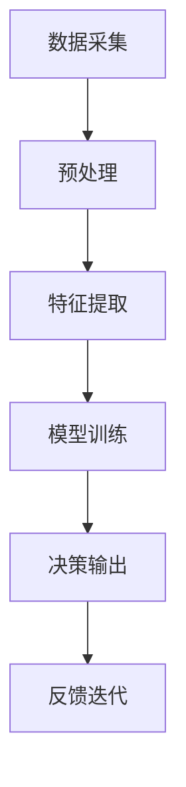

                 

## 1. 背景介绍

随着人工智能技术的迅猛发展，人类-AI协作正在成为推动社会进步的重要力量。这一变革不仅涉及技术层面，还深远影响着社会组织、商业模式、教育方式及伦理道德。本文旨在探讨人类-AI协作的当前发展趋势及未来机遇，预测其在增强人类智慧与AI能力融合中的潜在方向，并分析其面临的挑战与机遇。

## 2. 核心概念与联系

### 2.1 核心概念概述

为理解人类-AI协作的现状与未来，我们需要对几个核心概念进行梳理：

- **增强智能(Augmented Intelligence, AI)**：利用人工智能技术辅助人类决策和操作，以提升工作效率与准确性。
- **增强智慧(Augmented Wisdom, AW)**：通过AI技术帮助人类拓展认知边界，促进知识创新与智慧提升。
- **人机协作(Human-AI Collaboration)**：将AI作为辅助工具，与人类智能相融合，共同完成复杂任务。
- **自动化(Automation)**：通过AI技术自动完成某些重复性、规则性任务，减少人类工作负担。
- **智能增强(Smart Enhancement)**：将AI技术作为提升人类能力和效率的增强工具，而非完全替代人类工作。

这些概念通过以下Mermaid流程图展示其联系：

```mermaid
graph TB
    A[增强智能(AI)] --> B[增强智慧(AW)]
    A --> C[人机协作]
    C --> D[自动化]
    A --> E[智能增强]
```

从图中可以看出，增强智慧与增强智能是互补的关系，旨在通过AI技术与人类智慧的结合，实现人类能力的全面提升。而人机协作则为人与AI的交互提供了桥梁，使得两者能够高效融合。

### 2.2 核心概念原理和架构

#### 2.2.1 增强智能的原理

增强智能的核心在于将AI技术融入人类工作流程中，通过数据驱动的决策支持系统、智能推荐系统等工具辅助人类决策。例如，使用机器学习模型对历史数据进行建模，帮助企业进行市场预测和资源优化。

#### 2.2.2 增强智慧的原理

增强智慧则更侧重于认知和创新能力的提升。通过AI技术，如自然语言处理、计算机视觉等，帮助人类发现新的知识，解决复杂问题。例如，通过深度学习模型对文本数据进行语义分析，辅助人类进行科学研究和知识创新。

#### 2.2.3 人机协作的架构

人机协作通常包括四个关键步骤：数据采集、模型训练、交互反馈和任务执行。首先，通过传感器和接口采集环境数据，并传输到AI系统中。然后，AI系统利用训练好的模型进行分析，提供决策支持。接着，人类根据AI的建议进行决策，并反馈结果。最后，AI系统根据反馈结果进一步优化模型，形成一个闭环系统。

## 3. 核心算法原理 & 具体操作步骤

### 3.1 算法原理概述

增强智能与增强智慧的实现涉及多种算法和技术，主要包括：

- **机器学习与深度学习**：通过训练模型，帮助人类从数据中发现规律和模式。
- **自然语言处理(NLP)**：使机器能够理解和生成人类语言，提升人机交互体验。
- **计算机视觉(CV)**：让机器能够识别和分析图像和视频，应用于监控、检测等场景。
- **强化学习(RL)**：通过试错训练，使AI系统能够自主决策和优化行为。

这些技术通过以下Mermaid流程图展示其核心工作流程：



其中，数据采集和预处理是基础步骤，特征提取和模型训练是核心，决策输出和反馈迭代是最终目标。

### 3.2 算法步骤详解

#### 3.2.1 数据采集与预处理

数据采集通常通过传感器、摄像头、麦克风等设备进行，预处理则包括数据清洗、归一化、标注等步骤。这一环节是AI系统能否有效工作的前提。

#### 3.2.2 特征提取

特征提取是模型训练的关键步骤，将原始数据转化为模型能够理解的特征向量。常见的方法包括PCA、TF-IDF、卷积神经网络(CNN)、循环神经网络(RNN)等。

#### 3.2.3 模型训练

模型训练涉及选择合适的算法和模型结构，并对数据进行迭代优化。常用的算法包括决策树、随机森林、深度神经网络等。训练过程中，需要设置学习率、批大小、迭代轮数等超参数。

#### 3.2.4 决策输出

决策输出是AI系统对输入数据进行分析和预测的结果。例如，通过分类算法预测客户购买概率，或使用回归算法预测股票价格变化。

#### 3.2.5 反馈迭代

反馈迭代是持续改进模型的重要环节。通过监控输出结果，收集人类反馈，不断调整模型参数，以提高预测准确性和鲁棒性。

### 3.3 算法优缺点

增强智能与增强智慧的算法有以下优点：

- **高效性**：AI可以快速处理大量数据，提供实时决策支持。
- **准确性**：基于大数据和复杂模型的决策往往比人类直觉更准确。
- **可靠性**：通过优化算法，AI系统能够提供稳定的决策结果。

同时，也存在一些缺点：

- **依赖数据质量**：模型的性能高度依赖于数据的质量和多样性。
- **模型解释性差**：复杂的AI模型常常被视为"黑箱"，难以解释其决策过程。
- **需要大量计算资源**：模型训练和推理需要高性能的硬件支持。

### 3.4 算法应用领域

增强智能与增强智慧的应用领域非常广泛，涵盖以下几类：

- **金融**：用于风险评估、投资组合优化、信用评分等。
- **医疗**：用于疾病诊断、治疗方案推荐、患者管理等。
- **制造业**：用于生产过程监控、质量检测、供应链优化等。
- **物流**：用于路径规划、仓储管理、配送优化等。
- **教育**：用于个性化学习、智能推荐、作业批改等。
- **农业**：用于作物监测、病虫害检测、精准灌溉等。

这些应用领域表明，AI技术正深刻影响着各行各业的运营模式和发展方向。

## 4. 数学模型和公式 & 详细讲解

### 4.1 数学模型构建

增强智能与增强智慧的模型构建通常基于以下步骤：

1. **数据准备**：收集并清洗数据集，准备好训练集、验证集和测试集。
2. **模型选择**：根据任务类型选择合适的模型，如线性回归、决策树、深度神经网络等。
3. **模型训练**：使用训练集训练模型，并通过验证集调整超参数。
4. **模型评估**：在测试集上评估模型性能，使用指标如准确率、召回率、F1分数等。

### 4.2 公式推导过程

以线性回归模型为例，其公式推导过程如下：

设训练数据集为 $(x_i, y_i)$，其中 $x_i$ 为输入特征，$y_i$ 为输出标签。线性回归模型的目标是最小化预测值与真实值之间的均方误差（MSE）：

$$
\min_{\theta} \frac{1}{N} \sum_{i=1}^N (y_i - \hat{y_i})^2
$$

其中，$\hat{y_i} = \theta^T x_i$，$\theta$ 为模型参数，$N$ 为样本数。

通过梯度下降法，求得 $\theta$ 的更新公式为：

$$
\theta \leftarrow \theta - \eta \frac{1}{N} \sum_{i=1}^N (y_i - \hat{y_i}) x_i
$$

其中 $\eta$ 为学习率。

### 4.3 案例分析与讲解

以下以金融风险评估为例，展示增强智能的应用：

- **数据准备**：收集银行客户的贷款申请数据，包括年龄、收入、负债等特征，以及是否违约的标签。
- **模型选择**：选择逻辑回归模型，设定L1正则化以避免过拟合。
- **模型训练**：使用训练集训练模型，通过交叉验证调整超参数。
- **模型评估**：在测试集上评估模型性能，使用ROC曲线和AUC指标。
- **决策输出**：根据模型预测结果，银行可以对新客户进行风险评估，决定是否放贷。

## 5. 项目实践：代码实例和详细解释说明

### 5.1 开发环境搭建

为了进行增强智能与增强智慧的实践，需要搭建Python开发环境，并安装相关库和工具。例如，安装TensorFlow、PyTorch、Keras等深度学习框架，以及Pandas、NumPy、Scikit-learn等数据分析库。

### 5.2 源代码详细实现

以下是一个简单的金融风险评估项目的代码实现：

```python
import pandas as pd
import numpy as np
from sklearn.model_selection import train_test_split
from sklearn.linear_model import LogisticRegression
from sklearn.metrics import roc_auc_score

# 数据准备
data = pd.read_csv('credit_data.csv')
X = data.drop(['default'], axis=1)
y = data['default']

# 模型选择
model = LogisticRegression(penalty='l1', solver='saga', C=0.5)

# 模型训练
X_train, X_test, y_train, y_test = train_test_split(X, y, test_size=0.2, random_state=42)
model.fit(X_train, y_train)

# 模型评估
y_pred = model.predict_proba(X_test)[:, 1]
roc_auc = roc_auc_score(y_test, y_pred)
print(f"ROC AUC: {roc_auc}")
```

### 5.3 代码解读与分析

以上代码中，首先使用Pandas加载数据，然后通过train_test_split函数将数据划分为训练集和测试集。选择逻辑回归模型，并使用L1正则化进行训练。通过计算ROC曲线下面积（AUC）评估模型性能。

### 5.4 运行结果展示

运行代码后，输出结果为ROC AUC值，表示模型对违约客户的识别能力。通过不断调整超参数和模型结构，可以进一步提升模型性能。

## 6. 实际应用场景

### 6.1 金融风险管理

增强智能在金融风险管理中的应用非常广泛。例如，通过分析客户的历史交易数据，AI系统能够预测客户是否会违约，帮助银行进行风险控制和信贷决策。

### 6.2 医疗诊断

增强智慧在医疗诊断中具有重要意义。例如，利用AI技术分析医疗影像数据，辅助医生进行疾病诊断和治疗方案推荐。

### 6.3 智能推荐系统

增强智能在智能推荐系统中的应用也日渐普及。例如，电商平台通过分析用户行为数据，推荐个性化的商品，提高用户体验和销售转化率。

## 7. 工具和资源推荐

### 7.1 学习资源推荐

为更好地理解增强智能与增强智慧，推荐以下学习资源：

1. 《深度学习》by Ian Goodfellow：全面介绍深度学习的基础理论和方法。
2. 《机器学习实战》by Peter Harrington：通过实践案例，深入浅出地讲解机器学习算法。
3. 《Python数据科学手册》by Jake VanderPlas：详细介绍了Python在数据科学中的应用。
4. 《TensorFlow官方文档》：提供TensorFlow框架的详细教程和示例。
5. Coursera上的《机器学习》课程：由Andrew Ng教授主讲的经典课程，涵盖机器学习的基础知识和实践应用。

### 7.2 开发工具推荐

为提升开发效率，推荐以下开发工具：

1. Jupyter Notebook：交互式Python开发环境，支持代码编写、运行和分享。
2. VS Code：轻量级、功能强大的代码编辑器，支持多种编程语言。
3. PyCharm：专业级的Python开发工具，提供代码自动补全、调试等功能。

### 7.3 相关论文推荐

为深入理解增强智能与增强智慧，推荐以下论文：

1. "Deep Learning" by Yann LeCun, Yoshua Bengio, Geoffrey Hinton：三位深度学习奠基人合著的经典教材，系统介绍了深度学习的基础理论和方法。
2. "Advances in Neural Information Processing Systems (NeurIPS)"：顶级学术会议，每年发布大量前沿研究成果。
3. "International Conference on Machine Learning (ICML)"：顶级学术会议，涵盖机器学习的最新进展和应用。

## 8. 总结：未来发展趋势与挑战

### 8.1 研究成果总结

增强智能与增强智慧的研究成果不断涌现，推动了各行各业的智能化转型。主要的研究方向包括：

- **多模态数据融合**：通过融合视觉、语音、文本等多种数据源，提升AI系统的综合感知能力。
- **跨领域知识迁移**：通过迁移学习，将某个领域学到的知识迁移到其他领域，扩大AI系统的应用范围。
- **自适应学习**：通过在线学习和持续反馈，使AI系统能够适应数据分布的变化，保持长期效用。

### 8.2 未来发展趋势

未来，增强智能与增强智慧的发展趋势主要体现在以下几个方面：

1. **跨领域应用拓展**：AI技术将在更多领域得到应用，如农业、能源、环保等，推动社会进步。
2. **人机协同智能化**：通过增强智能和增强智慧，使人类与AI系统形成更紧密的协同关系，提高工作效率和生活质量。
3. **通用智能探索**：探索通用人工智能的实现路径，构建具有广泛通用性的智能系统。

### 8.3 面临的挑战

尽管增强智能与增强智慧取得了显著进展，但仍面临以下挑战：

1. **数据隐私与安全**：大规模数据采集和分析带来了数据隐私和安全问题。
2. **算法透明性与可解释性**：复杂AI模型的决策过程难以解释，影响用户信任。
3. **伦理与社会影响**：AI系统的广泛应用可能带来就业、伦理等方面的社会问题。
4. **技术标准与规范**：缺乏统一的技术标准和规范，导致系统兼容性差、部署复杂。

### 8.4 研究展望

未来研究应在以下几个方面取得突破：

1. **隐私保护与数据安全**：研究隐私保护技术，如差分隐私、联邦学习等，保障数据安全。
2. **模型透明性与可解释性**：研究可解释AI技术，如可视化、因果推理等，提高模型透明性。
3. **伦理与社会影响评估**：建立AI系统的伦理审查机制，确保其符合社会价值观。
4. **标准化与规范制定**：制定AI技术的标准和规范，促进技术共享和应用推广。

## 9. 附录：常见问题与解答

### Q1: 增强智能与增强智慧有什么区别？

A: 增强智能主要指通过AI技术辅助人类决策和操作，提升工作效率。而增强智慧则更侧重于拓展人类认知边界，促进知识创新与智慧提升。

### Q2: 增强智能与增强智慧的优缺点分别是什么？

A: 增强智能的优点包括高效性、准确性和可靠性。缺点则包括依赖数据质量、模型解释性差和需要大量计算资源。增强智慧的优点在于扩展人类认知边界，缺点包括技术复杂度高、研发成本高和应用场景受限。

### Q3: 增强智能与增强智慧的应用前景如何？

A: 增强智能与增强智慧在金融、医疗、教育、制造业等多个领域都有广泛应用前景。未来，随着技术进步，AI将进一步增强人类智慧，推动社会全面智能化。

### Q4: 增强智能与增强智慧面临的主要挑战有哪些？

A: 主要挑战包括数据隐私与安全、算法透明性与可解释性、伦理与社会影响以及技术标准与规范。

### Q5: 增强智能与增强智慧的未来发展方向是什么？

A: 未来发展方向包括跨领域应用拓展、人机协同智能化、通用智能探索、隐私保护与数据安全、模型透明性与可解释性、伦理与社会影响评估以及标准化与规范制定。

---

作者：禅与计算机程序设计艺术 / Zen and the Art of Computer Programming

