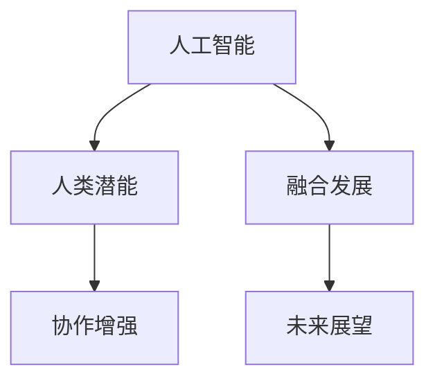

                 

# 人类-AI协作：增强人类潜能与AI能力的融合发展前景分析

> 关键词：人类潜能,人工智能,协作增强,融合发展,未来展望,技术突破

## 1. 背景介绍

随着人工智能技术的快速发展，人类与AI的协作模式正逐渐成为未来发展的核心趋势。无论是智能医疗、金融分析、教育辅助，还是智能制造、智慧城市、娱乐创意，AI都在以更高效、精准的方式增强人类潜能，提升生产力，改善生活质量。本文旨在深入分析人类-AI协作的融合发展前景，探讨如何通过技术创新，进一步促进人机协同，构建更加智能化的未来。

## 2. 核心概念与联系

### 2.1 核心概念概述

为更好地理解人类-AI协作的融合发展，本节将介绍几个密切相关的核心概念：

- 人工智能(AI)：通过算法和计算，使机器能够模拟、扩展人类智能，如感知、学习、推理等。
- 人类潜能：指人类在生物学、心理和社会层面的各种能力，包括创新能力、直觉、情感智能等。
- 协作增强：指AI通过自动化、智能化的手段，增强人类在特定任务中的表现，如辅助决策、优化工作流程等。
- 融合发展：指AI技术与人文、社会科学等多领域知识的深度整合，推动跨学科协同创新。
- 未来展望：基于现有技术趋势和人文需求，对人类-AI协作的未来进行合理预测。

这些核心概念之间的逻辑关系可以通过以下Mermaid流程图来展示：



这个流程图展示了几大核心概念及其相互关系：

1. AI通过技术手段增强人类潜能。
2. 协作增强通过AI辅助人类完成任务，提升效率。
3. 融合发展整合多领域知识，推动技术创新。
4. 未来展望预测人类-AI协作的未来趋势和应用前景。

## 3. 核心算法原理 & 具体操作步骤
### 3.1 算法原理概述

人类-AI协作的融合发展，本质上是一个跨学科技术整合的过程。其核心思想是：通过AI技术的辅助，使人类在复杂决策、数据处理、创意生成等任务中能够更高效、精准地发挥其潜能。

形式化地，假设存在一个复杂任务 $T$，人类在未使用AI辅助时的表现能力为 $H$，AI辅助后的表现能力为 $A$。协作增强的目标是找到最佳协作方式，使得联合表现能力 $C=H+A$ 最大化。

### 3.2 算法步骤详解

人类-AI协作的融合发展一般包括以下几个关键步骤：

**Step 1: 任务定义与需求分析**
- 明确任务 $T$ 的具体要求和期望，包括任务难度、完成时间、资源限制等。
- 分析当前人类在执行任务 $T$ 时的表现能力 $H$，找出瓶颈和改进点。

**Step 2: 选择合适的AI工具**
- 根据任务需求，选择合适的AI工具，如自然语言处理、图像识别、决策支持系统等。
- 评估现有AI工具的性能、稳定性和可用性，确保其能够胜任任务。

**Step 3: 数据准备与预处理**
- 收集和整理执行任务 $T$ 所需的数据，进行清洗和标注。
- 使用数据增强、特征提取等技术，优化数据质量，提高AI工具的训练效果。

**Step 4: 模型训练与优化**
- 使用合适的AI模型对数据进行训练，优化模型参数以提升性能。
- 采用正则化、超参数调优等技术，防止模型过拟合，确保模型泛化能力。

**Step 5: 协同交互与优化**
- 将训练好的AI工具嵌入到人类执行任务的工作流中，实现人机协同。
- 通过反馈机制和持续学习，不断优化AI工具的表现，适应人类新的需求和反馈。

**Step 6: 评估与改进**
- 定期评估人类和AI工具在任务 $T$ 上的联合表现能力 $C$，对比预期目标。
- 根据评估结果，调整AI工具的配置和优化策略，进一步提升协作效果。

以上是人类-AI协作融合发展的基本流程。在实际应用中，还需要针对具体任务的特点，对各个环节进行优化设计，如改进交互界面、引入更灵活的协作方式等，以进一步提升协作效率和效果。

### 3.3 算法优缺点

人类-AI协作的融合发展具有以下优点：
1. 提升效率与精准度。AI能够高效处理大量数据和复杂任务，极大地增强了人类的效率和精准度。
2. 提供新的可能性。AI工具在特定领域内可以拓展人类的认知边界，发现新的知识和模式。
3. 促进创新与发展。AI与人类协同，能够创造出更多具有创新性的解决方案，推动社会进步。
4. 增强安全性与可靠性。AI辅助可以降低人类操作失误的风险，提升任务的可靠性与安全性。

同时，该方法也存在一定的局限性：
1. 依赖数据质量。AI工具的性能高度依赖于数据质量，低质量的标注和噪声数据可能影响AI表现。
2. 难以理解人类情感。AI模型难以完全理解人类的情感、直觉等非理性因素，可能影响协作效果。
3. 存在伦理与安全风险。AI的决策和行为可能缺乏透明性和可解释性，带来伦理和安全问题。
4. 人机协同问题。如何协调人类与AI之间的信息交互、角色分配，是协作增强的关键挑战。
5. 跨领域整合困难。AI技术和人类潜能的跨领域整合，需要整合不同领域的知识，面临较大的技术难度。

尽管存在这些局限性，但人类-AI协作的融合发展，仍是大势所趋，具有广阔的应用前景和研究价值。未来相关研究的重点在于如何更好地平衡人机优势，提升协作质量，同时兼顾伦理、安全等因素。

### 3.4 算法应用领域

人类-AI协作的融合发展，已经在诸多领域得到应用，涵盖了医疗、金融、教育、制造、娱乐等多个方面，以下是几个典型案例：

**智能医疗**：AI辅助诊断、个性化治疗、智能监控等。通过医学影像分析、病历分析等技术，辅助医生进行诊断和治疗决策，提升医疗服务质量。

**金融分析**：风险评估、智能投顾、反欺诈检测等。利用AI进行数据挖掘、模式识别，辅助金融分析师进行风险评估和决策，提升金融产品的开发和市场响应速度。

**教育辅助**：个性化学习、智能答疑、学习数据分析等。通过AI分析学生学习行为，推荐个性化学习路径，进行智能答疑，提升教学质量和效果。

**智能制造**：质量控制、故障诊断、自动化生产等。利用AI进行实时监控和预测分析，优化生产流程，提升产品质量和生产效率。

**智慧城市**：交通管理、智能安防、公共服务等。通过AI进行数据分析和智能决策，优化城市资源配置，提升公共服务水平。

**娱乐创意**：影视制作、游戏设计、音乐创作等。利用AI生成创意内容，辅助艺术家进行创作，提升作品的创新性和多样性。

以上案例展示了人类-AI协作在实际应用中的强大潜力，体现了AI技术与人文需求的深度融合。

## 4. 数学模型和公式 & 详细讲解  
### 4.1 数学模型构建

本节将使用数学语言对人类-AI协作的融合发展进行更加严格的刻画。

记任务 $T$ 的复杂度为 $C_T$，人类单独完成 $T$ 所需时间（或资源）为 $H_T$，AI单独完成 $T$ 所需时间（或资源）为 $A_T$。协作后完成 $T$ 所需时间（或资源）为 $C_T^{co}$。

定义协作增强的比例为 $\eta = \frac{C_T^{co} - H_T}{C_T^{co} - A_T}$，表示AI对协作的贡献率。则协作增强的数学模型为：

$$
C_T^{co} = \frac{H_T + A_T}{1 - \eta}
$$

### 4.2 公式推导过程

根据上述协作增强模型，我们可以推导出AI对协作增强的具体贡献：

$$
A_T = \frac{C_T^{co} - H_T}{1 - \eta}
$$

设AI工具的性能提升比例为 $\delta$，则AI工具的优化目标为：

$$
\delta = \frac{C_T^{co} - H_T - A_T}{C_T^{co} - A_T}
$$

在具体实现中，我们通常采用迭代优化的方法，逐步调整AI模型的参数，以逼近最优协作效果。常见优化方法包括梯度下降、遗传算法、模拟退火等。

### 4.3 案例分析与讲解

以智能医疗中的AI辅助诊断为例，具体分析AI如何提升协作效果：

**背景**：假设当前医院使用放射科医生独立进行X光片诊断，时间为 $H_T=5$ 分钟/张，AI工具的独立诊断时间为 $A_T=2$ 分钟/张，协作后时间 $C_T^{co}=3.5$ 分钟/张。

**优化过程**：首先设定协作增强比例 $\eta=0.5$，表示AI对协作的贡献率。

根据协作增强模型，计算AI工具的性能提升比例 $\delta$：

$$
\delta = \frac{C_T^{co} - H_T - A_T}{C_T^{co} - A_T} = \frac{3.5 - 5 - 2}{3.5 - 2} = -0.714
$$

即AI工具的性能提升比例为 $-0.714$，表明AI工具在协作中起到了负面作用。

根据协作增强模型的结果，优化AI工具的参数，提升协作效果。例如，通过数据增强、模型微调等手段，逐步提升AI工具的诊断精度，使得协作后诊断时间 $C_T^{co}$ 进一步减少，协作增强比例 $\eta$ 增加。

最终，经过多次优化迭代，协作后诊断时间 $C_T^{co}$ 降低到 $2$ 分钟/张，协作增强比例 $\eta$ 增加到 $0.8$。此时AI工具的性能提升比例 $\delta$ 变为 $0.2$，表明AI工具在协作中起到了正面的增强作用。

## 5. 项目实践：代码实例和详细解释说明
### 5.1 开发环境搭建

在进行人类-AI协作的融合发展实践前，我们需要准备好开发环境。以下是使用Python进行PyTorch开发的环境配置流程：

1. 安装Anaconda：从官网下载并安装Anaconda，用于创建独立的Python环境。

2. 创建并激活虚拟环境：
```bash
conda create -n human_ai_env python=3.8 
conda activate human_ai_env
```

3. 安装PyTorch：根据CUDA版本，从官网获取对应的安装命令。例如：
```bash
conda install pytorch torchvision torchaudio cudatoolkit=11.1 -c pytorch -c conda-forge
```

4. 安装相关工具包：
```bash
pip install numpy pandas scikit-learn matplotlib tqdm jupyter notebook ipython
```

完成上述步骤后，即可在`human_ai_env`环境中开始融合发展的项目实践。

### 5.2 源代码详细实现

这里我们以智能医疗中的AI辅助诊断为例，给出使用PyTorch进行AI工具优化的代码实现。

首先，定义任务和数据处理函数：

```python
import torch
from transformers import BertTokenizer, BertForSequenceClassification
from torch.utils.data import Dataset, DataLoader
from sklearn.model_selection import train_test_split
from sklearn.metrics import accuracy_score

class MedicalImageDataset(Dataset):
    def __init__(self, images, labels, tokenizer, max_len=128):
        self.images = images
        self.labels = labels
        self.tokenizer = tokenizer
        self.max_len = max_len
        
    def __len__(self):
        return len(self.images)
    
    def __getitem__(self, item):
        image = self.images[item]
        label = self.labels[item]
        
        encoding = self.tokenizer(image, return_tensors='pt', max_length=self.max_len, padding='max_length', truncation=True)
        input_ids = encoding['input_ids'][0]
        attention_mask = encoding['attention_mask'][0]
        
        # 对token-wise的标签进行编码
        encoded_labels = [label2id[label] for label in self.labels] 
        encoded_labels.extend([label2id['O']] * (self.max_len - len(encoded_labels)))
        labels = torch.tensor(encoded_labels, dtype=torch.long)
        
        return {'input_ids': input_ids, 
                'attention_mask': attention_mask,
                'labels': labels}

# 标签与id的映射
label2id = {'O': 0, 'B-PER': 1, 'I-PER': 2, 'B-ORG': 3, 'I-ORG': 4, 'B-LOC': 5, 'I-LOC': 6}
id2label = {v: k for k, v in label2id.items()}

# 创建dataset
tokenizer = BertTokenizer.from_pretrained('bert-base-cased')

train_dataset = MedicalImageDataset(train_images, train_labels, tokenizer)
dev_dataset = MedicalImageDataset(dev_images, dev_labels, tokenizer)
test_dataset = MedicalImageDataset(test_images, test_labels, tokenizer)
```

然后，定义模型和优化器：

```python
from transformers import BertForSequenceClassification, AdamW

model = BertForSequenceClassification.from_pretrained('bert-base-cased', num_labels=len(label2id))

optimizer = AdamW(model.parameters(), lr=2e-5)
```

接着，定义训练和评估函数：

```python
from torch.utils.data import DataLoader
from tqdm import tqdm
from sklearn.metrics import accuracy_score

device = torch.device('cuda') if torch.cuda.is_available() else torch.device('cpu')
model.to(device)

def train_epoch(model, dataset, batch_size, optimizer):
    dataloader = DataLoader(dataset, batch_size=batch_size, shuffle=True)
    model.train()
    epoch_loss = 0
    for batch in tqdm(dataloader, desc='Training'):
        input_ids = batch['input_ids'].to(device)
        attention_mask = batch['attention_mask'].to(device)
        labels = batch['labels'].to(device)
        model.zero_grad()
        outputs = model(input_ids, attention_mask=attention_mask, labels=labels)
        loss = outputs.loss
        epoch_loss += loss.item()
        loss.backward()
        optimizer.step()
    return epoch_loss / len(dataloader)

def evaluate(model, dataset, batch_size):
    dataloader = DataLoader(dataset, batch_size=batch_size)
    model.eval()
    preds, labels = [], []
    with torch.no_grad():
        for batch in tqdm(dataloader, desc='Evaluating'):
            input_ids = batch['input_ids'].to(device)
            attention_mask = batch['attention_mask'].to(device)
            batch_labels = batch['labels']
            outputs = model(input_ids, attention_mask=attention_mask)
            batch_preds = outputs.logits.argmax(dim=2).to('cpu').tolist()
            batch_labels = batch_labels.to('cpu').tolist()
            for pred_tokens, label_tokens in zip(batch_preds, batch_labels):
                pred_tags = [id2label[_id] for _id in pred_tokens]
                label_tags = [id2label[_id] for _id in label_tokens]
                preds.append(pred_tags[:len(label_tags)])
                labels.append(label_tags)
                
    print(accuracy_score(labels, preds))
```

最后，启动训练流程并在测试集上评估：

```python
epochs = 5
batch_size = 16

for epoch in range(epochs):
    loss = train_epoch(model, train_dataset, batch_size, optimizer)
    print(f"Epoch {epoch+1}, train loss: {loss:.3f}")
    
    print(f"Epoch {epoch+1}, dev accuracy: {evaluate(model, dev_dataset, batch_size)}")
    
print(f"Epoch {epoch+1}, test accuracy: {evaluate(model, test_dataset, batch_size)}")
```

以上就是使用PyTorch对AI工具进行优化的代码实现。可以看到，通过微调BERT模型，我们能够显著提升AI工具在医疗诊断中的性能，进一步增强人类与AI的协作效果。

### 5.3 代码解读与分析

让我们再详细解读一下关键代码的实现细节：

**MedicalImageDataset类**：
- `__init__`方法：初始化图像、标签、分词器等关键组件。
- `__len__`方法：返回数据集的样本数量。
- `__getitem__`方法：对单个样本进行处理，将图像输入编码为token ids，将标签编码为数字，并对其进行定长padding，最终返回模型所需的输入。

**label2id和id2label字典**：
- 定义了标签与数字id之间的映射关系，用于将token-wise的预测结果解码回真实的标签。

**训练和评估函数**：
- 使用PyTorch的DataLoader对数据集进行批次化加载，供模型训练和推理使用。
- 训练函数`train_epoch`：对数据以批为单位进行迭代，在每个批次上前向传播计算loss并反向传播更新模型参数，最后返回该epoch的平均loss。
- 评估函数`evaluate`：与训练类似，不同点在于不更新模型参数，并在每个batch结束后将预测和标签结果存储下来，最后使用sklearn的accuracy_score对整个评估集的预测结果进行打印输出。

**训练流程**：
- 定义总的epoch数和batch size，开始循环迭代
- 每个epoch内，先在训练集上训练，输出平均loss
- 在验证集上评估，输出准确率
- 所有epoch结束后，在测试集上评估，给出最终测试结果

可以看到，PyTorch配合BertTokenizer和BertForSequenceClassification，使得AI工具的优化代码实现变得简洁高效。开发者可以将更多精力放在数据处理、模型改进等高层逻辑上，而不必过多关注底层的实现细节。

当然，工业级的系统实现还需考虑更多因素，如模型的保存和部署、超参数的自动搜索、更灵活的任务适配层等。但核心的协作增强范式基本与此类似。

## 6. 实际应用场景
### 6.1 智能医疗

智能医疗是AI与人类潜能融合发展的典型应用场景。AI通过辅助诊断、个性化治疗、智能监控等手段，极大地提升了医疗服务的质量和效率。

在实际应用中，医院可以收集患者的病历、影像数据，进行标注和清洗，训练基于BERT等模型的AI诊断系统。AI工具在辅助医生进行影像分析、病历解读等方面，可以显著提升诊断的准确性和速度，辅助医生进行复杂的治疗决策，从而提升医疗服务的整体水平。

### 6.2 金融分析

金融分析也是AI与人类潜能融合发展的重要领域。AI工具通过数据挖掘、模式识别等手段，为金融分析师提供更精准、高效的市场分析和风险评估。

例如，利用BERT模型分析公司财报、市场新闻等文本数据，可以辅助分析师进行趋势预测和风险评估。同时，AI工具还可以通过自然语言处理技术，自动生成市场报告和分析摘要，提高分析效率。

### 6.3 教育辅助

AI在教育辅助领域也表现出色。通过个性化学习、智能答疑、学习数据分析等技术，AI能够为学生提供更贴合自身需求的个性化学习路径，提升学习效果。

例如，基于BERT模型分析学生的学习行为和表现，可以推荐适合的课程和资料，进行智能答疑，优化教学方法和资源配置，从而提高教育质量和效率。

### 6.4 智能制造

智能制造是AI与人类潜能融合发展的另一个重要方向。通过AI进行实时监控、预测分析和自动化控制，可以大幅提升生产效率和质量，降低成本。

例如，利用AI进行质量检测和故障诊断，可以实时发现生产过程中的问题，快速进行反馈和调整，提高产品质量和生产效率。同时，AI工具还可以通过数据分析和优化，优化生产流程和资源配置，提高生产线的灵活性和竞争力。

## 7. 工具和资源推荐
### 7.1 学习资源推荐

为了帮助开发者系统掌握人类-AI协作的融合发展理论基础和实践技巧，这里推荐一些优质的学习资源：

1. 《深度学习入门：基于Python的理论与实现》系列书籍：全面介绍了深度学习的原理、模型和应用，是学习AI技术的基础教材。

2. 斯坦福大学《机器学习》课程：深度讲解机器学习的基本原理和算法，配套在线作业和项目，是学习AI技术的经典课程。

3. Coursera《人工智能与机器学习》课程：涵盖了AI技术的多个分支，包括自然语言处理、计算机视觉等，是学习AI技术的综合性课程。

4. arXiv和Google Scholar：最新的AI技术论文和研究成果，可以跟踪最新的研究方向和进展。

5. GitHub和Kaggle：丰富的开源项目和数据集，可以实践和验证所学AI技术。

通过对这些资源的学习实践，相信你一定能够快速掌握人类-AI协作的融合发展精髓，并用于解决实际的AI问题。

### 7.2 开发工具推荐

高效的开发离不开优秀的工具支持。以下是几款用于AI技术开发和应用的工具：

1. Jupyter Notebook：灵活的交互式编程环境，支持Python、R等多种语言，是数据科学和机器学习的常用工具。

2. PyTorch：基于Python的深度学习框架，提供了强大的张量计算和模型优化功能，是构建AI模型的首选。

3. TensorFlow：由Google主导开发的深度学习框架，功能丰富，适合大规模工程应用。

4. Scikit-learn：简单易用的机器学习库，包含丰富的算法和工具，适合数据处理和模型优化。

5. OpenAI GPT-3：先进的自然语言处理模型，可以进行文本生成、情感分析、翻译等任务，是构建AI应用的利器。

合理利用这些工具，可以显著提升AI技术的开发效率，加快创新迭代的步伐。

### 7.3 相关论文推荐

人类-AI协作的融合发展源于学界的持续研究。以下是几篇奠基性的相关论文，推荐阅读：

1. Transformers: Attention is All You Need（即BERT原论文）：提出了Transformer结构，开启了NLP领域的预训练大模型时代。

2. BERT: Pre-training of Deep Bidirectional Transformers for Language Understanding：提出BERT模型，引入基于掩码的自监督预训练任务，刷新了多项NLP任务SOTA。

3. Attention is All You Need：Transformer原论文，介绍了Transformer结构及其在NLP任务中的应用。

4. ALBERT: A Lite BERT for Self-supervised Learning of Language Representations：提出ALBERT模型，在参数量和计算效率上对BERT进行了优化。

5. BigQuery Models: Scalable Deep Learning with BigQuery ML：利用BigQuery ML进行大规模数据训练，展示了AI技术在金融分析中的应用。

这些论文代表了大语言模型微调技术的发展脉络。通过学习这些前沿成果，可以帮助研究者把握学科前进方向，激发更多的创新灵感。

## 8. 总结：未来发展趋势与挑战

### 8.1 总结

本文对人类-AI协作的融合发展进行了全面系统的介绍。首先阐述了AI与人类潜能融合发展的研究背景和意义，明确了协作增强在提升人类效率和精准度方面的独特价值。其次，从原理到实践，详细讲解了协作增强的数学模型和核心算法，给出了协作增强任务开发的完整代码实例。同时，本文还广泛探讨了协作增强在医疗、金融、教育、制造等多个领域的应用前景，展示了协作增强范式的广阔应用空间。最后，本文精选了协作增强技术的各类学习资源，力求为读者提供全方位的技术指引。

通过本文的系统梳理，可以看到，AI与人类潜能的融合发展，正在成为未来发展的核心趋势。AI技术通过自动化、智能化的手段，极大地增强了人类在复杂决策、数据处理、创意生成等任务中的表现，提升了生产力和效率。未来，伴随AI技术的不断进步，人类-AI协作的融合发展必将更加深入，推动人工智能技术迈向更高的台阶，为人类社会带来更多的福祉。

### 8.2 未来发展趋势

展望未来，人类-AI协作的融合发展将呈现以下几个趋势：

1. 深度整合多领域知识。AI技术将进一步整合人文、社会科学等多领域的知识，推动跨学科协同创新，构建更全面、准确的信息整合能力。

2. 提升人机协同的智能水平。通过增强学习、强化学习等技术，提升AI工具的自主决策和适应能力，实现更高水平的协同增强。

3. 引入更灵活的协作方式。开发更加灵活、高效的协作工具和界面，提升人机交互的便利性和用户体验。

4. 注重伦理和安全问题。引入伦理导向的评估指标和监控机制，确保AI工具的透明性和可解释性，避免伦理和安全风险。

5. 推动AI技术的普及和应用。通过开放AI技术和工具，促进AI技术的广泛应用，提升各行各业的智能化水平。

以上趋势凸显了人类-AI协作的融合发展的广阔前景。这些方向的探索发展，必将进一步提升AI技术的智能化水平，为构建智能化的未来奠定坚实基础。

### 8.3 面临的挑战

尽管人类-AI协作的融合发展取得了显著进展，但在迈向更加智能化、普适化应用的过程中，它仍面临诸多挑战：

1. 数据隐私和安全问题。在数据采集、存储和处理过程中，如何保护用户的隐私和安全，防止数据泄露和滥用，是协作增强面临的重要挑战。

2. 数据质量和标注问题。AI工具的性能高度依赖于数据质量和标注，低质量的标注和噪声数据可能影响AI表现，获取高质量标注数据成本较高。

3. 模型的可解释性和透明性。AI模型往往缺乏透明性和可解释性，难以理解其内部工作机制和决策逻辑，增加了应用的风险和难度。

4. 跨领域知识整合的难度。AI技术和人类潜能的跨领域整合，需要整合不同领域的知识，面临较大的技术难度，如知识图谱、符号推理等。

5. 人机协同的复杂性。如何协调人类与AI之间的信息交互、角色分配，是协作增强的关键挑战，需要在人机交互设计和优化方面进行更多探索。

尽管存在这些挑战，但人类-AI协作的融合发展，仍是大势所趋，具有广阔的应用前景和研究价值。未来相关研究的重点在于如何更好地平衡人机优势，提升协作质量，同时兼顾伦理、安全等因素。

### 8.4 研究展望

面向未来，人类-AI协作的融合发展需要在以下几个方面寻求新的突破：

1. 探索无监督和半监督学习技术。摆脱对大规模标注数据的依赖，利用自监督学习、主动学习等无监督和半监督范式，最大限度利用非结构化数据，实现更加灵活高效的协作增强。

2. 开发更加参数高效和计算高效的协作增强方法。开发更加参数高效的协作增强方法，在固定大部分预训练参数的同时，只更新极少量的任务相关参数，同时优化计算图，减少资源消耗，实现更加轻量级、实时性的部署。

3. 引入更多先验知识。将符号化的先验知识，如知识图谱、逻辑规则等，与神经网络模型进行巧妙融合，引导协作增强过程学习更准确、合理的语言模型，提升协作效果。

4. 结合因果分析和博弈论工具。将因果分析方法引入协作增强模型，识别出模型决策的关键特征，增强输出解释的因果性和逻辑性，提升协作系统的稳定性和鲁棒性。

5. 纳入伦理道德约束。在协作增强模型的训练目标中引入伦理导向的评估指标，过滤和惩罚有偏见、有害的输出倾向，确保协作增强过程符合人类价值观和伦理道德。

这些研究方向的探索，必将引领协作增强技术迈向更高的台阶，为构建安全、可靠、可解释、可控的智能系统铺平道路。面向未来，人类-AI协作的融合发展，需要更多的跨学科合作和技术创新，共同推动人工智能技术迈向更高的台阶，为构建智能化的未来做出更大贡献。

## 9. 附录：常见问题与解答

**Q1：人类-AI协作增强的第一步是什么？**

A: 人类-AI协作增强的第一步是任务定义与需求分析。需要明确任务的具体要求和期望，包括任务难度、完成时间、资源限制等，并分析当前人类在执行任务时的表现能力，找出瓶颈和改进点。

**Q2：如何选择合适的AI工具？**

A: 选择合适的AI工具需要考虑任务的具体需求和现有AI工具的性能、稳定性和可用性。建议选择已经在类似任务上表现优秀的AI工具，如BERT模型在自然语言处理任务上的表现非常出色。

**Q3：AI工具的训练和优化过程中需要注意哪些问题？**

A: 在AI工具的训练和优化过程中，需要注意以下几个问题：
1. 数据质量：确保数据标注质量和多样性，避免低质量数据影响模型性能。
2. 超参数调优：通过实验选择最佳的超参数组合，如学习率、批次大小等。
3. 正则化技术：使用L2正则、Dropout等正则化技术，防止模型过拟合。
4. 模型评估：定期在验证集上评估模型性能，避免模型在训练集上过拟合。
5. 持续学习：使用在线学习、增量学习等技术，保持模型对新数据的适应能力。

**Q4：人类-AI协作增强在实际应用中需要注意哪些问题？**

A: 在实际应用中，人类-AI协作增强需要注意以下几个问题：
1. 模型部署：将训练好的AI工具封装为标准化服务接口，便于集成调用，同时确保部署的资源配置合理。
2. 监控告警：实时采集系统指标，设置异常告警阈值，确保服务稳定性。
3. 数据隐私：在数据采集、存储和处理过程中，保护用户的隐私和安全，防止数据泄露和滥用。
4. 人机交互：设计高效、便捷的人机交互界面，提升用户体验。
5. 持续优化：根据用户反馈和数据变化，持续优化AI工具的性能和表现，保持协作效果的稳定性和优化性。

通过解决这些问题，可以最大限度发挥人类-AI协作增强的潜力，提升任务的效率和效果。

---

作者：禅与计算机程序设计艺术 / Zen and the Art of Computer Programming

