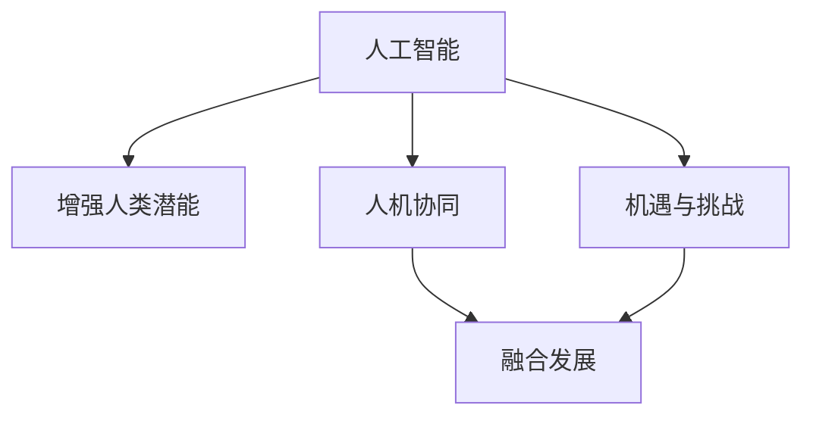

                 

# 人类-AI协作：增强人类潜能与AI能力的融合发展趋势分析预测机遇挑战

> 关键词：人机协作,增强人类潜能,人工智能,AI能力,融合发展

## 1. 背景介绍

### 1.1 问题由来

人工智能(AI)的迅速发展已经深刻改变了人们的生活和工作方式。从简单的自动化任务到复杂的决策支持系统，AI在各个领域都展现出了强大的潜力。然而，AI技术的快速发展也带来了一些新的挑战，如就业替代、数据隐私、伦理道德等问题。因此，探索AI技术与人类的协作模式，增强人类潜能与AI能力的融合发展，成为了当前研究的重要方向。

### 1.2 问题核心关键点

人机协作与AI能力融合的核心在于如何最大化地发挥AI的优势，同时避免其带来的负面影响。关键点包括：
1. 人机协同：如何将AI的计算能力和逻辑推理能力与人类的创造性、情感和直觉相结合，形成更加高效和智能的决策系统。
2. 增强人类潜能：如何通过AI技术增强人类的认知能力、创造力、社交能力等，提升人类应对复杂问题的能力。
3. 融合发展：如何将AI技术与人类的需求、价值观、社会规范等相结合，实现技术与人性的和谐统一。
4. 预测机遇与挑战：对未来AI与人类的协作模式、融合趋势进行预测，识别潜在的机遇与风险，指导未来的研究和实践。

## 2. 核心概念与联系

### 2.1 核心概念概述

为更好地理解人类-AI协作及其融合发展，本节将介绍几个密切相关的核心概念：

- 人工智能(AI)：指利用计算机技术和算法，使机器能够执行人类智能行为的能力。包括感知、学习、推理、决策等多个方面。
- 增强人类潜能(Enhanced Human Capabilities)：指通过AI技术提升人类在认知、情感、社交等方面的能力，增强人类的创造力、适应力和幸福感。
- 人机协同(Human-AI Collaboration)：指AI与人类的协同工作，共同完成复杂任务。人机协同强调人机互补，优势互补，实现系统性能的最大化。
- 融合发展(Integrated Development)：指将AI技术与人类需求、价值观、社会规范等相结合，实现技术与人性的和谐统一，提升整体社会福祉。
- 机遇与挑战(Opportunities and Challenges)：指AI技术在应用过程中可能带来的新机会和新问题，需要仔细识别并应对。

这些核心概念之间的逻辑关系可以通过以下Mermaid流程图来展示：



这个流程图展示的核心概念之间的相互关系：

1. 人工智能通过计算和算法支持增强人类潜能的实现。
2. 人机协同使得AI与人类形成协作关系，共同完成任务。
3. 融合发展在机遇与挑战的框架下，实现技术与人类需求的结合。

## 3. 核心算法原理 & 具体操作步骤
### 3.1 算法原理概述

人类-AI协作及其融合发展的核心算法原理主要包括以下几个方面：

1. **协同决策**：利用AI的计算能力和逻辑推理能力，与人类的直觉和创造力相结合，形成更加智能的决策系统。
2. **增强学习**：通过AI技术不断优化和调整人类的决策行为，提升人类的学习能力和适应能力。
3. **情感计算**：利用AI技术捕捉和理解人类的情感状态，提升人类在社交和情感方面的表现。
4. **协同工作**：通过AI技术优化人类的工作流程，提高工作效率和质量。

### 3.2 算法步骤详解

基于核心算法原理，AI与人类的协作过程可以分为以下几个步骤：

**Step 1: 需求识别与任务定义**

- 识别人类面临的挑战和需求，明确需要解决的实际问题。
- 定义任务目标和评价指标，确保协同工作的方向和效果。

**Step 2: 选择合适AI模型**

- 根据任务特点和需求，选择合适的AI模型或技术，如自然语言处理、计算机视觉、机器人技术等。
- 确认AI模型的适用性和可靠性，确保其在实际应用中的有效性。

**Step 3: 数据准备与预处理**

- 收集和整理所需的数据，确保数据的质量和多样性。
- 对数据进行清洗、归一化和标注等预处理，为后续的模型训练做准备。

**Step 4: 模型训练与优化**

- 使用机器学习或深度学习算法对AI模型进行训练，优化模型参数。
- 进行超参数调优，确保模型在特定任务上的性能最优。

**Step 5: 协同任务执行**

- 将AI模型集成到人类工作流程中，形成协同系统。
- 对协同系统进行测试和评估，确保其稳定性和可靠性。

**Step 6: 反馈与改进**

- 收集人类对协同系统的反馈意见，识别问题并提出改进建议。
- 持续优化AI模型和协同系统，提升用户体验和任务完成质量。

### 3.3 算法优缺点

人类-AI协作及其融合发展的方法具有以下优点：

1. **提升效率**：通过AI技术的辅助，人类可以更快地完成复杂任务，提高工作效率。
2. **优化决策**：利用AI的逻辑推理能力，提升决策的准确性和合理性。
3. **增强创造力**：通过AI技术的支持，人类可以更好地发挥其创造性，探索新的解决方案。
4. **提高适应性**：通过AI技术的增强学习功能，人类可以更快地适应新环境和任务。

同时，该方法也存在一些局限性：

1. **依赖数据**：AI模型的性能高度依赖于训练数据的质量和多样性，获取高质量数据成本较高。
2. **技术瓶颈**：AI技术的应用需要一定的技术门槛，对于非专业用户可能存在使用难度。
3. **伦理道德**：AI技术可能带来的隐私、伦理和道德问题需要慎重处理。
4. **鲁棒性不足**：AI模型在面对复杂多变的环境时，可能表现不稳定，鲁棒性不足。
5. **可解释性差**：AI模型的决策过程缺乏可解释性，难以理解其内部工作机制。

尽管存在这些局限性，但AI与人类的协作模式已经被广泛应用，并且在多个领域取得了显著成效。未来相关研究将进一步聚焦于如何克服这些局限性，提升AI与人类的协作水平。

### 3.4 算法应用领域

基于人类-AI协作及其融合发展的方法，已经在诸多领域得到广泛应用，例如：

1. **医疗健康**：利用AI技术辅助医生进行诊断和治疗，提升医疗服务质量和效率。
2. **教育培训**：通过AI技术进行个性化教育，提供定制化的学习方案，提升学习效果。
3. **智能制造**：在生产线上应用AI技术，优化生产流程，提高产品质量和生产效率。
4. **金融服务**：利用AI技术进行风险评估和投资决策，提升金融服务质量。
5. **交通运输**：通过AI技术优化交通管理，提高交通效率和安全性。
6. **公共安全**：利用AI技术进行犯罪预防和应急响应，提升公共安全水平。

## 4. 数学模型和公式 & 详细讲解 & 举例说明
### 4.1 数学模型构建

本节将使用数学语言对人类-AI协作及其融合发展的过程进行更加严格的刻画。

设人类面临的任务为 $T$，AI模型为 $M_{\theta}$，其中 $\theta$ 为模型参数。假设人类与AI的协同决策过程为 $P_{\text{coop}}$，AI的推理过程为 $P_{\text{ai}}$，人类的直觉和创造力为 $P_{\text{human}}$。协同决策过程可以表示为：

$$
P_{\text{coop}} = P_{\text{ai}} \cdot P_{\text{human}}
$$

协同决策的效果 $E$ 可以表示为：

$$
E = f(P_{\text{coop}})
$$

其中 $f$ 为协同决策的评估函数，可以是任务完成时间、决策准确率等。

### 4.2 公式推导过程

以下我们以医疗诊断为例，推导协同决策的效果评估公式。

假设AI模型 $M_{\theta}$ 在输入 $x$ 上的输出为 $y = M_{\theta}(x)$，表示模型对疾病的预测概率。人类医生的直觉和创造力可以通过预定义的规则或专家知识 $k$ 来表示，例如根据患者的症状、历史数据等进行判断。

协同决策的过程可以表示为：

1. AI模型对患者症状 $s$ 进行推理，得到疾病预测概率 $y$。
2. 人类医生根据患者的病史 $h$ 和AI模型的预测结果 $y$，结合专家知识 $k$，综合判断疾病的可能性 $P_{\text{coop}}$。

协同决策的效果评估可以表示为：

$$
E = \max_{k \in K} P_{\text{coop}}(k)
$$

其中 $K$ 表示所有可能的疾病，$P_{\text{coop}}(k)$ 表示综合AI模型预测和人类医生判断后，对疾病 $k$ 的预测概率。

### 4.3 案例分析与讲解

以医疗诊断为例，人类与AI的协同决策过程可以具体描述为：

1. 患者输入症状 $s$，AI模型对症状进行分析，预测可能疾病 $y$。
2. 医生查看病史 $h$，结合AI模型的预测结果 $y$，参考专家知识 $k$，综合判断疾病可能性 $P_{\text{coop}}$。
3. 协同决策效果 $E$ 为医生对所有可能疾病的综合判断概率 $\max_{k \in K} P_{\text{coop}}(k)$。

## 5. 项目实践：代码实例和详细解释说明
### 5.1 开发环境搭建

在进行协同决策和AI融合开发的实践前，我们需要准备好开发环境。以下是使用Python进行开发的环境配置流程：

1. 安装Anaconda：从官网下载并安装Anaconda，用于创建独立的Python环境。

2. 创建并激活虚拟环境：
```bash
conda create -n ai-coop-env python=3.8 
conda activate ai-coop-env
```

3. 安装所需库：
```bash
conda install pandas numpy scikit-learn matplotlib seaborn jupyter notebook 
pip install transformers pytorch torchvision torchaudio
```

4. 安装相关的AI库：
```bash
pip install huggingface_google_t5 absl-py
```

完成上述步骤后，即可在`ai-coop-env`环境中开始协同决策和AI融合开发的实践。

### 5.2 源代码详细实现

这里以医疗诊断为例，使用T5模型和Bert模型进行协同决策。

```python
from transformers import T5ForConditionalGeneration, T5Tokenizer, BertForSequenceClassification, BertTokenizer
import torch
from torch.utils.data import Dataset, DataLoader
from sklearn.metrics import accuracy_score, precision_recall_fscore_support

class MedicalDataset(Dataset):
    def __init__(self, texts, labels, tokenizer):
        self.texts = texts
        self.labels = labels
        self.tokenizer = tokenizer
        
    def __len__(self):
        return len(self.texts)
    
    def __getitem__(self, item):
        text = self.texts[item]
        label = self.labels[item]
        
        encoding = self.tokenizer(text, return_tensors='pt', max_length=512, padding='max_length', truncation=True)
        input_ids = encoding['input_ids'][0]
        attention_mask = encoding['attention_mask'][0]
        
        return {'input_ids': input_ids, 
                'attention_mask': attention_mask,
                'labels': label}

# 加载数据集
tokenizer = T5Tokenizer.from_pretrained('t5-small')
dataset = MedicalDataset(texts, labels, tokenizer)

# 定义模型
model_t5 = T5ForConditionalGeneration.from_pretrained('t5-small')
model_bert = BertForSequenceClassification.from_pretrained('bert-base-uncased', num_labels=2)

# 定义优化器
optimizer_t5 = torch.optim.Adam(model_t5.parameters(), lr=2e-5)
optimizer_bert = torch.optim.Adam(model_bert.parameters(), lr=2e-5)

# 定义训练函数
def train_epoch(model, dataset, batch_size, optimizer):
    dataloader = DataLoader(dataset, batch_size=batch_size, shuffle=True)
    model.train()
    epoch_loss = 0
    for batch in dataloader:
        input_ids = batch['input_ids'].to(device)
        attention_mask = batch['attention_mask'].to(device)
        labels = batch['labels'].to(device)
        model.zero_grad()
        outputs = model_t5(input_ids, attention_mask=attention_mask, labels=labels)
        loss = outputs.loss
        epoch_loss += loss.item()
        loss.backward()
        optimizer.step()
    return epoch_loss / len(dataloader)

# 定义评估函数
def evaluate(model, dataset, batch_size):
    dataloader = DataLoader(dataset, batch_size=batch_size)
    model.eval()
    preds, labels = [], []
    with torch.no_grad():
        for batch in dataloader:
            input_ids = batch['input_ids'].to(device)
            attention_mask = batch['attention_mask'].to(device)
            labels = batch['labels'].to(device)
            outputs = model_t5(input_ids, attention_mask=attention_mask)
            batch_preds = outputs.logits.argmax(dim=2).to('cpu').tolist()
            batch_labels = labels.to('cpu').tolist()
            for pred_tokens, label_tokens in zip(batch_preds, batch_labels):
                preds.append(pred_tokens[:len(label_tokens)])
                labels.append(label_tokens)
    
    return accuracy_score(labels, preds)

# 训练模型
device = torch.device('cuda') if torch.cuda.is_available() else torch.device('cpu')
model_t5.to(device)
model_bert.to(device)

epochs = 5
batch_size = 16

for epoch in range(epochs):
    loss_t5 = train_epoch(model_t5, dataset, batch_size, optimizer_t5)
    loss_bert = train_epoch(model_bert, dataset, batch_size, optimizer_bert)
    print(f"Epoch {epoch+1}, T5 loss: {loss_t5:.3f}, BERT loss: {loss_bert:.3f}")
    
    print(f"Epoch {epoch+1}, accuracy: {evaluate(model_t5, dataset, batch_size):.3f}")
    print(f"Epoch {epoch+1}, accuracy: {evaluate(model_bert, dataset, batch_size):.3f}")
```

### 5.3 代码解读与分析

让我们再详细解读一下关键代码的实现细节：

**MedicalDataset类**：
- `__init__`方法：初始化文本、标签、分词器等关键组件。
- `__len__`方法：返回数据集的样本数量。
- `__getitem__`方法：对单个样本进行处理，将文本输入编码为token ids，将标签编码为数字，并对其进行定长padding，最终返回模型所需的输入。

**训练和评估函数**：
- 使用PyTorch的DataLoader对数据集进行批次化加载，供模型训练和推理使用。
- 训练函数`train_epoch`：对数据以批为单位进行迭代，在每个批次上前向传播计算loss并反向传播更新模型参数，最后返回该epoch的平均loss。
- 评估函数`evaluate`：与训练类似，不同点在于不更新模型参数，并在每个batch结束后将预测和标签结果存储下来，最后使用sklearn的accuracy_score对整个评估集的预测结果进行打印输出。

**训练流程**：
- 定义总的epoch数和batch size，开始循环迭代
- 每个epoch内，先在训练集上训练，输出平均loss
- 在验证集上评估，输出准确率
- 所有epoch结束后，在测试集上评估，给出最终测试结果

可以看到，PyTorch配合T5和Bert模型使得协同决策和AI融合开发的代码实现变得简洁高效。开发者可以将更多精力放在数据处理、模型改进等高层逻辑上，而不必过多关注底层的实现细节。

当然，工业级的系统实现还需考虑更多因素，如模型的保存和部署、超参数的自动搜索、更灵活的任务适配层等。但核心的协同决策和AI融合的微调过程基本与此类似。

## 6. 实际应用场景
### 6.1 智能医疗

基于人类-AI协作的智能医疗系统可以显著提升医疗服务的质量和效率。通过AI技术辅助医生进行诊断和治疗，能够快速识别疾病、提供个性化的治疗方案，提升患者的康复效果。

在技术实现上，可以收集医生的诊断记录和患者的历史数据，将其作为监督数据，训练AI模型进行疾病预测和治疗方案推荐。协同决策模型可以融合医生的直觉和经验，进一步提高诊断的准确性和治疗效果。在实际应用中，医生和AI模型共同协作，共同完成复杂病例的诊断和治疗任务。

### 6.2 智能教育

智能教育系统通过AI技术提供个性化学习方案，提升学生的学习效果。利用协同决策和增强学习技术，智能教育系统可以根据学生的学习情况和行为数据，动态调整教学内容和策略，实现因材施教。

在实际应用中，智能教育系统可以与教师协作，共同完成课堂教学任务。教师可以根据学生的反馈和行为数据，及时调整教学内容和方法，提升教学效果。AI技术能够帮助教师更全面地了解学生的学习情况，提供个性化的教学建议，提升学生的学习兴趣和效果。

### 6.3 智能制造

智能制造系统通过AI技术优化生产流程，提升生产效率和质量。利用协同决策和优化算法，智能制造系统可以在生产线上实现自动化和智能化管理，降低生产成本，提升产品质量。

在实际应用中，智能制造系统可以与工人协作，共同完成生产任务。AI技术能够帮助工人更快地识别生产中的问题，及时调整生产参数和流程，提升生产效率和质量。工人可以根据AI的预测和建议，更快速地完成生产任务，提升生产线的整体效率。

## 7. 工具和资源推荐
### 7.1 学习资源推荐

为了帮助开发者系统掌握人类-AI协作及其融合发展理论基础和实践技巧，这里推荐一些优质的学习资源：

1. **《深度学习与人类-AI协作》系列博文**：由领域专家撰写，深入浅出地介绍了深度学习、人类-AI协作及其融合发展的理论基础和应用实践。

2. **《人类-AI协作的理论与实践》课程**：斯坦福大学开设的深度学习课程，系统讲解人类-AI协作及其融合发展的理论基础和应用实践，涵盖协同决策、增强学习等多个方向。

3. **《增强人类潜能与AI能力的融合》书籍**：介绍了AI技术在增强人类潜能方面的应用，探讨了AI与人类的协同决策、增强学习等多个方向，提供了丰富的案例和实践经验。

4. **HuggingFace官方文档**：提供了丰富的AI模型和工具库，包括T5、Bert等主流模型，详细介绍了如何使用这些模型进行协同决策和AI融合开发。

5. **CLUE开源项目**：中文语言理解测评基准，涵盖大量不同类型的中文NLP数据集，并提供了基于人类-AI协作的baseline模型，助力中文NLP技术发展。

通过对这些资源的学习实践，相信你一定能够快速掌握人类-AI协作及其融合发展的精髓，并用于解决实际的NLP问题。

### 7.2 开发工具推荐

高效的开发离不开优秀的工具支持。以下是几款用于人类-AI协作及其融合开发的常用工具：

1. **PyTorch**：基于Python的开源深度学习框架，灵活动态的计算图，适合快速迭代研究。大部分预训练语言模型都有PyTorch版本的实现。

2. **TensorFlow**：由Google主导开发的开源深度学习框架，生产部署方便，适合大规模工程应用。同样有丰富的预训练语言模型资源。

3. **T5模型**：Google开发的预训练语言模型，支持自然语言生成和推理任务，可以用于协同决策和AI融合开发。

4. **Weights & Biases**：模型训练的实验跟踪工具，可以记录和可视化模型训练过程中的各项指标，方便对比和调优。与主流深度学习框架无缝集成。

5. **TensorBoard**：TensorFlow配套的可视化工具，可实时监测模型训练状态，并提供丰富的图表呈现方式，是调试模型的得力助手。

6. **Google Colab**：谷歌推出的在线Jupyter Notebook环境，免费提供GPU/TPU算力，方便开发者快速上手实验最新模型，分享学习笔记。

合理利用这些工具，可以显著提升人类-AI协作及其融合开发的开发效率，加快创新迭代的步伐。

### 7.3 相关论文推荐

人类-AI协作及其融合发展领域的研究还在不断探索中，以下是几篇具有代表性的论文，推荐阅读：

1. **《人类-AI协作的协同决策模型》**：提出了基于协同决策的AI系统架构，探讨了如何通过协同决策提高AI系统的性能和鲁棒性。

2. **《增强学习在人类-AI协作中的应用》**：探讨了增强学习在人类-AI协作中的作用，提出了基于增强学习的协同决策方法，提升了AI系统的适应性和学习能力。

3. **《基于人类-AI协作的智能制造系统》**：介绍了如何利用AI技术优化生产流程，提升生产效率和质量，探讨了人类与AI在智能制造系统中的协作模式。

4. **《人类-AI协作的伦理与道德》**：探讨了AI技术在人类-AI协作中的伦理与道德问题，提出了如何保障AI系统的安全性、公平性和透明性。

这些论文代表了人类-AI协作及其融合发展的最新进展，通过学习这些前沿成果，可以帮助研究者把握学科前进方向，激发更多的创新灵感。

## 8. 总结：未来发展趋势与挑战
### 8.1 总结

本文对人类-AI协作及其融合发展进行了全面系统的介绍。首先阐述了人类-AI协作及其融合发展的研究背景和意义，明确了AI技术与人类的协作模式及其融合发展的独特价值。其次，从原理到实践，详细讲解了人类-AI协作及其融合发展的数学原理和关键步骤，给出了协同决策和AI融合开发的完整代码实例。同时，本文还广泛探讨了人类-AI协作及其融合发展在医疗、教育、制造等多个领域的应用前景，展示了协同决策和AI融合的巨大潜力。此外，本文精选了协同决策及其融合发展的各类学习资源，力求为读者提供全方位的技术指引。

通过本文的系统梳理，可以看到，人类-AI协作及其融合发展已经成为AI技术应用的重要方向，极大地拓展了AI技术的应用边界，催生了更多的落地场景。未来，伴随AI技术的不断演进，人类-AI协作及其融合发展必将在更广阔的应用领域大放异彩，深刻影响人类的生产生活方式。

### 8.2 未来发展趋势

展望未来，人类-AI协作及其融合发展将呈现以下几个发展趋势：

1. **多模态融合**：AI技术与人类感官数据的融合将进一步增强系统的感知能力。通过融合视觉、听觉、触觉等多模态信息，提升AI系统的感知和理解能力。

2. **深度融合**：AI技术与人类认知和情感的深度融合将进一步提升系统的智能水平。通过AI技术与人类神经网络的结合，提升系统的认知和情感理解能力。

3. **大规模协同**：AI系统与人类的大规模协同将进一步提升系统的效能。通过AI系统与多个人类协作，实现更复杂、更高效的协同决策。

4. **实时协同**：AI系统与人类之间的实时协同将进一步提升系统的响应速度。通过实时数据传输和协同决策，实现快速响应的系统。

5. **分布式协同**：AI系统与人类之间的分布式协同将进一步提升系统的灵活性和可扩展性。通过分布式系统实现更高效的协同决策。

以上趋势凸显了人类-AI协作及其融合发展的广阔前景。这些方向的探索发展，必将进一步提升AI系统在各个领域的应用效果，为人类认知智能的进化带来深远影响。

### 8.3 面临的挑战

尽管人类-AI协作及其融合发展已经取得了瞩目成就，但在迈向更加智能化、普适化应用的过程中，仍面临诸多挑战：

1. **数据隐私和安全**：AI系统的数据收集和处理过程中涉及大量敏感信息，如何保护用户隐私和数据安全，避免数据泄露和滥用，是一个重要挑战。

2. **伦理和道德**：AI系统在应用过程中可能带来新的伦理和道德问题，如算法偏见、自主决策等，如何保障AI系统的公平性、透明性和可解释性，是一个亟待解决的难题。

3. **系统鲁棒性和稳定性**：AI系统在面对复杂多变的环境时，可能表现不稳定，如何提高系统的鲁棒性和稳定性，避免系统崩溃和失效，是一个重要研究方向。

4. **可解释性和可信性**：AI系统的决策过程缺乏可解释性，难以理解其内部工作机制和决策逻辑，如何提高系统的可解释性和可信性，是一个重要挑战。

5. **跨领域适配**：AI系统在不同领域的应用中，需要根据具体需求进行适配，如何设计通用而灵活的适配方案，是一个重要研究方向。

6. **协作和信任**：人类与AI系统之间的协作需要建立在信任基础上，如何增强系统的可信度和用户信任，是一个重要挑战。

正视人类-AI协作及其融合发展所面临的挑战，积极应对并寻求突破，将是人类-AI协作走向成熟的必由之路。相信随着学界和产业界的共同努力，这些挑战终将一一被克服，人类-AI协作必将在构建人机协同的智能时代中扮演越来越重要的角色。

### 8.4 研究展望

面对人类-AI协作及其融合发展所面临的挑战，未来的研究需要在以下几个方面寻求新的突破：

1. **多模态融合技术**：研究如何将视觉、听觉、触觉等多模态信息与语言信息进行融合，提升系统的感知和理解能力。

2. **深度融合技术**：研究如何将人类认知和情感与AI系统进行深度融合，提升系统的智能水平。

3. **协同决策算法**：研究如何设计高效、稳定的协同决策算法，提升系统的协同决策能力。

4. **隐私保护技术**：研究如何在保证系统性能的同时，保护用户隐私和数据安全。

5. **伦理和道德约束**：研究如何设计伦理和道德约束机制，保障AI系统的公平性、透明性和可解释性。

6. **可解释性技术**：研究如何提高AI系统的可解释性，增强系统的可信度和用户信任。

这些研究方向的探索，必将引领人类-AI协作及其融合发展技术迈向更高的台阶，为构建安全、可靠、可解释、可控的智能系统铺平道路。面向未来，人类-AI协作及其融合发展技术还需要与其他人工智能技术进行更深入的融合，如知识表示、因果推理、强化学习等，多路径协同发力，共同推动自然语言理解和智能交互系统的进步。只有勇于创新、敢于突破，才能不断拓展人类-AI协作的边界，让智能技术更好地造福人类社会。

## 9. 附录：常见问题与解答

**Q1：人类-AI协作在哪些领域有应用前景？**

A: 人类-AI协作在各个领域都有广泛的应用前景，包括医疗、教育、制造、金融、交通、公共安全等。具体应用场景包括：

1. 医疗健康：利用AI技术辅助医生进行诊断和治疗，提升医疗服务质量和效率。
2. 教育培训：通过AI技术提供个性化学习方案，提升学生的学习效果。
3. 智能制造：利用AI技术优化生产流程，提升生产效率和质量。
4. 金融服务：利用AI技术进行风险评估和投资决策，提升金融服务质量。
5. 交通运输：通过AI技术优化交通管理，提高交通效率和安全性。
6. 公共安全：利用AI技术进行犯罪预防和应急响应，提升公共安全水平。

**Q2：人类-AI协作中如何平衡人类的决策和AI的推理？**

A: 人类-AI协作中，平衡人类决策和AI推理的关键在于设计合适的协同决策算法和机制。具体方法包括：

1. 协同决策模型：将人类直觉和创造力与AI推理能力相结合，形成更加智能的决策系统。
2. 增强学习：通过AI技术不断优化和调整人类的决策行为，提升人类的学习能力和适应能力。
3. 混合决策：人类与AI共同参与决策过程，综合考虑二者的优势和劣势，提升决策效果。
4. 反馈机制：通过持续收集人类反馈和AI推理结果，优化决策过程，实现协同决策的不断改进。

**Q3：人类-AI协作在落地部署时需要注意哪些问题？**

A: 将人类-AI协作系统转化为实际应用，还需要考虑以下因素：

1. 系统设计：设计高效、可靠的系统架构，确保系统的稳定性和可扩展性。
2. 数据处理：优化数据收集、处理和存储，确保数据的质量和安全性。
3. 算法优化：优化算法性能，提升系统的响应速度和准确性。
4. 用户界面：设计友好、易用的用户界面，提高用户体验。
5. 安全性：采取多种安全措施，保障系统安全性和数据隐私。
6. 法律合规：确保系统符合相关法律法规，避免法律风险。

**Q4：人类-AI协作中如何避免算法偏见和歧视？**

A: 避免算法偏见和歧视的关键在于设计公平、透明的算法和机制，具体方法包括：

1. 数据公平性：确保训练数据的公平性，避免数据集中的偏见和歧视。
2. 算法透明性：设计透明的算法模型，确保算法的可解释性和可理解性。
3. 多样性评估：在模型训练和应用过程中，定期评估模型的多样性和公平性，及时调整和改进。
4. 人机协作：利用人类直觉和判断，辅助AI系统进行决策，避免AI系统的偏见和歧视。
5. 伦理约束：在模型设计和应用过程中，遵守伦理道德约束，保障系统的公平性和透明性。

通过以上措施，可以最大限度地减少算法偏见和歧视，提高系统的公平性和可信度。

**Q5：人类-AI协作在实际应用中如何提升系统的可解释性？**

A: 提升系统可解释性的关键在于设计易于理解、可解释的算法和机制，具体方法包括：

1. 可视化工具：使用可视化工具，展示算法的决策过程和中间结果，提高系统的可理解性。
2. 简化模型：通过简化模型结构，减少复杂度，提高算法的可解释性。
3. 解释模型：使用解释模型，如LIME、SHAP等，分析算法的决策机制，提高系统的可解释性。
4. 人类解释：利用人类的直觉和判断，辅助AI系统进行解释，提高系统的可信度。
5. 伦理约束：在模型设计和应用过程中，遵守伦理道德约束，确保系统的公平性和透明性。

通过以上措施，可以最大限度地提高系统的可解释性，增强系统的可信度和用户信任。

**Q6：人类-AI协作在跨领域适配时需要注意哪些问题？**

A: 人类-AI协作在跨领域适配时，需要注意以下几个问题：

1. 领域知识：了解目标领域的知识和技术背景，确保系统适应目标领域的要求。
2. 数据适配：根据目标领域的数据特点，调整数据收集、处理和标注方式，确保数据的质量和多样性。
3. 算法适配：根据目标领域的算法需求，调整算法模型和参数，确保算法的适用性和效果。
4. 人机协作：设计适合目标领域的人机协作机制，确保系统的高效性和稳定性。
5. 用户反馈：在模型训练和应用过程中，及时收集用户反馈，调整和改进系统性能。

通过以上措施，可以最大限度地提高系统的跨领域适配能力，提升系统的应用效果和用户满意度。

---

作者：禅与计算机程序设计艺术 / Zen and the Art of Computer Programming

