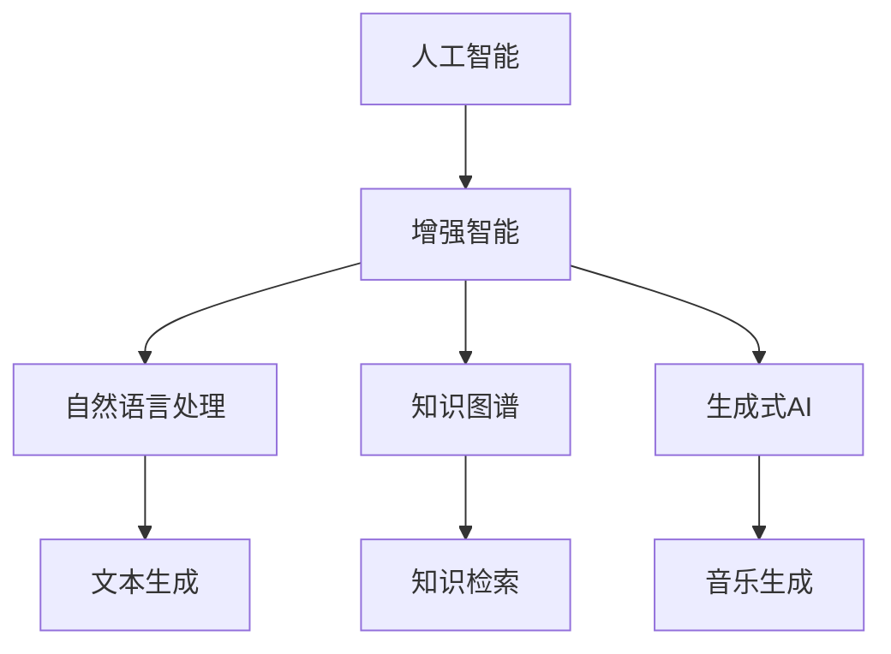

                 

# 人类-AI协作：增强创造力

> 关键词：人机协作,增强智能,创造力提升,知识图谱,深度学习,多模态融合,自然语言处理,AI辅助创作

## 1. 背景介绍

### 1.1 问题由来

随着人工智能技术的飞速发展，人工智能在各个领域的应用不断深入，从自动驾驶、智能家居到医疗、教育，AI技术无所不在。然而，AI技术在创造力方面的表现却长期被质疑，很多人认为AI缺乏人类独特的创造力和智慧。然而，随着生成式AI的兴起，AI在创作和创新方面的能力正在逐渐增强。

### 1.2 问题核心关键点

AI在创作方面的突破源于其对大规模数据的学习和理解能力，以及深度学习等先进算法的支持。AI在生成文本、音乐、图像、视频等创意作品时，可以通过自监督学习、对抗训练、迁移学习、多模态融合等方法，高效地学习和生成新的内容。

AI在创作中的核心能力在于：
1. 对人类语言的理解：通过自然语言处理（NLP）技术，AI可以理解和生成自然语言，包括文本生成、语言翻译、对话系统等。
2. 跨模态融合：AI可以整合视觉、听觉、触觉等多种感官信息，生成更具创新性的作品。
3. 创造力提升：AI可以通过学习和模仿人类的创意过程，生成更具创意和新颖的作品。

## 2. 核心概念与联系

### 2.1 核心概念概述

为更好地理解人类-AI协作的增强创造力，本节将介绍几个密切相关的核心概念：

- **人工智能（AI）**：使用计算机和数据算法实现模拟人类智能的技术体系，包括感知、推理、学习等能力。
- **增强智能（AI-augmented）**：利用AI技术辅助或增强人类的智能和创造力，如AI创作、AI辅助设计等。
- **创造力（Creativity）**：人类或AI在问题解决、艺术创作、科技创新等方面表现出的独特性和创新能力。
- **自然语言处理（NLP）**：使计算机能够理解、处理和生成人类语言的技术，是AI在语言生成和理解方面的重要基础。
- **知识图谱（Knowledge Graph）**：以图结构形式表示的知识库，通过关系网络表示实体和属性，支持基于语义的推理和知识检索。
- **生成式AI（Generative AI）**：能够根据给定输入生成新内容的AI技术，如文本生成、图像生成、音乐生成等。

这些核心概念之间的逻辑关系可以通过以下Mermaid流程图来展示：



这个流程图展示了大语言模型的核心概念及其之间的关系：

1. AI通过深度学习等算法获得智能和创造力，而增强智能则利用AI技术进一步提升人类能力。
2. NLP使AI能够理解和生成人类语言，知识图谱则提供了更丰富的语义信息，支持基于知识的推理和生成。
3. 生成式AI在文本、图像、音乐等多模态领域展示出强大的创造力，可用于辅助人类的创作和设计。

这些概念共同构成了人类-AI协作的增强创造力框架，使得AI能够更好地服务于人类的创意过程。

## 3. 核心算法原理 & 具体操作步骤
### 3.1 算法原理概述

基于增强智能的创作，本质上是一个人类与AI协作的过程。AI通过学习和理解人类创造力的核心要素，辅助人类在创作过程中发现新的创意和解决方案。具体来说，可以通过以下步骤实现：

1. **数据采集和预处理**：收集相关领域的原始数据，进行清洗和预处理，确保数据质量。
2. **模型训练和优化**：利用深度学习等技术，训练AI模型，优化其性能，提升生成内容的质量和多样性。
3. **人类-AI协作创作**：将AI模型融入人类创作流程，利用AI的智能辅助人类进行创意生成和内容优化。

### 3.2 算法步骤详解

以下是基于增强智能的创作的具体步骤：

**Step 1: 数据采集和预处理**
- 收集相关领域的文本、图像、视频等数据，如文学作品、美术作品、电影剧本等。
- 清洗数据，去除噪声和无用信息，确保数据质量和多样性。
- 标注数据，如文本分类、实体识别等，用于训练AI模型。

**Step 2: 模型训练和优化**
- 选择合适的模型架构，如Transformer、GAN、RNN等，进行预训练。
- 利用标注数据进行微调，优化模型参数，提升模型性能。
- 引入生成对抗网络（GAN）、自监督学习等技术，增强模型的创造力和多样性。

**Step 3: 人类-AI协作创作**
- 将训练好的AI模型嵌入创作流程，辅助人类进行创意生成。
- 利用AI的智能和创造力，辅助人类进行创意构思和内容优化。
- 利用AI的推荐系统，帮助人类发现新的创意和灵感。

### 3.3 算法优缺点

基于增强智能的创作方法具有以下优点：
1. 高效性：AI能够快速处理和分析大量数据，提供高效创意生成。
2. 多样性：AI可以生成多样化的内容，满足不同用户的需求。
3. 创新性：AI可以发现和生成新的创意，拓展人类的创作边界。
4. 可解释性：AI可以提供生成内容的推理和解释，帮助人类理解和优化创意。

同时，该方法也存在一定的局限性：
1. 依赖高质量数据：创作过程依赖于高质量的数据，数据质量和多样性直接影响生成内容的价值。
2. 缺乏人性化：AI缺乏人类的情感和直觉，生成的内容可能缺乏人类作品的深度和情感。
3. 道德和伦理问题：AI在生成内容时可能带有偏见和有害信息，需要仔细审查和处理。
4. 技术依赖性强：AI创作需要强大的计算资源和技术支持，对技术要求较高。

尽管存在这些局限性，但就目前而言，基于增强智能的创作方法仍是大规模协作创作的重要手段。未来相关研究的重点在于如何进一步降低技术门槛，提高AI的创造力和人性化，同时兼顾道德和伦理问题。

### 3.4 算法应用领域

基于增强智能的创作方法已经在多个领域得到了广泛的应用，包括：

- **文学创作**：利用AI生成小说、诗歌、剧本等作品，辅助作家进行创作。
- **美术设计**：生成绘画、雕塑、动画等作品，辅助艺术家进行创意设计。
- **电影制作**：生成电影剧本、特效、配乐等，辅助电影制片人进行创作。
- **音乐创作**：生成乐谱、旋律、歌词等作品，辅助作曲家进行创作。
- **游戏开发**：生成游戏剧本、角色、场景等，辅助游戏设计师进行创作。
- **广告设计**：生成广告文案、图像、视频等，辅助广告设计师进行创意设计。

除了上述这些领域外，基于增强智能的创作方法也被创新性地应用到更多场景中，如虚拟现实（VR）、增强现实（AR）、智能家居等领域，为创意产业带来了全新的突破。

## 4. 数学模型和公式 & 详细讲解  
### 4.1 数学模型构建

本节将使用数学语言对基于增强智能的创作过程进行更加严格的刻画。

记AI生成式模型为 $M_{\theta}:\mathcal{X} \rightarrow \mathcal{Y}$，其中 $\mathcal{X}$ 为输入空间，$\mathcal{Y}$ 为输出空间，$\theta \in \mathbb{R}^d$ 为模型参数。假设创作任务的训练集为 $D=\{(x_i,y_i)\}_{i=1}^N, x_i \in \mathcal{X}, y_i \in \mathcal{Y}$。

定义模型 $M_{\theta}$ 在数据样本 $(x,y)$ 上的损失函数为 $\ell(M_{\theta}(x),y)$，则在数据集 $D$ 上的经验风险为：

$$
\mathcal{L}(\theta) = \frac{1}{N} \sum_{i=1}^N \ell(M_{\theta}(x_i),y_i)
$$

微调的目标是最小化经验风险，即找到最优参数：

$$
\theta^* = \mathop{\arg\min}_{\theta} \mathcal{L}(\theta)
$$

在实践中，我们通常使用基于梯度的优化算法（如SGD、Adam等）来近似求解上述最优化问题。设 $\eta$ 为学习率，$\lambda$ 为正则化系数，则参数的更新公式为：

$$
\theta \leftarrow \theta - \eta \nabla_{\theta}\mathcal{L}(\theta) - \eta\lambda\theta
$$

其中 $\nabla_{\theta}\mathcal{L}(\theta)$ 为损失函数对参数 $\theta$ 的梯度，可通过反向传播算法高效计算。

### 4.2 公式推导过程

以下我们以文学创作任务为例，推导交叉熵损失函数及其梯度的计算公式。

假设模型 $M_{\theta}$ 在输入 $x$ 上的输出为 $\hat{y}=M_{\theta}(x) \in [0,1]$，表示样本属于正类的概率。真实标签 $y \in \{0,1\}$。则二分类交叉熵损失函数定义为：

$$
\ell(M_{\theta}(x),y) = -[y\log \hat{y} + (1-y)\log (1-\hat{y})]
$$

将其代入经验风险公式，得：

$$
\mathcal{L}(\theta) = -\frac{1}{N}\sum_{i=1}^N [y_i\log M_{\theta}(x_i)+(1-y_i)\log(1-M_{\theta}(x_i))]
$$

根据链式法则，损失函数对参数 $\theta_k$ 的梯度为：

$$
\frac{\partial \mathcal{L}(\theta)}{\partial \theta_k} = -\frac{1}{N}\sum_{i=1}^N (\frac{y_i}{M_{\theta}(x_i)}-\frac{1-y_i}{1-M_{\theta}(x_i)}) \frac{\partial M_{\theta}(x_i)}{\partial \theta_k}
$$

其中 $\frac{\partial M_{\theta}(x_i)}{\partial \theta_k}$ 可进一步递归展开，利用自动微分技术完成计算。

在得到损失函数的梯度后，即可带入参数更新公式，完成模型的迭代优化。重复上述过程直至收敛，最终得到适应创作任务的最优模型参数 $\theta^*$。

## 5. 项目实践：代码实例和详细解释说明
### 5.1 开发环境搭建

在进行创作实践前，我们需要准备好开发环境。以下是使用Python进行PyTorch开发的环境配置流程：

1. 安装Anaconda：从官网下载并安装Anaconda，用于创建独立的Python环境。

2. 创建并激活虚拟环境：
```bash
conda create -n pytorch-env python=3.8 
conda activate pytorch-env
```

3. 安装PyTorch：根据CUDA版本，从官网获取对应的安装命令。例如：
```bash
conda install pytorch torchvision torchaudio cudatoolkit=11.1 -c pytorch -c conda-forge
```

4. 安装Transformers库：
```bash
pip install transformers
```

5. 安装各类工具包：
```bash
pip install numpy pandas scikit-learn matplotlib tqdm jupyter notebook ipython
```

完成上述步骤后，即可在`pytorch-env`环境中开始创作实践。

### 5.2 源代码详细实现

这里我们以文学创作任务为例，给出使用Transformers库对GPT-3进行文学创作任务微调的PyTorch代码实现。

首先，定义文学创作任务的数据处理函数：

```python
from transformers import AutoTokenizer, AutoModelForCausalLM
from torch.utils.data import Dataset, DataLoader
import torch

class LiteraryDataset(Dataset):
    def __init__(self, texts, tokenizer):
        self.tokenizer = tokenizer
        self.texts = texts
        
    def __len__(self):
        return len(self.texts)
    
    def __getitem__(self, item):
        text = self.texts[item]
        input_ids = self.tokenizer(text, return_tensors='pt')['input_ids']
        return {'input_ids': input_ids}

# 定义文学创作任务
tokenizer = AutoTokenizer.from_pretrained('gpt3-medium')
model = AutoModelForCausalLM.from_pretrained('gpt3-medium')

# 准备数据
texts = ['天空中的云朵如同白色的绵羊，在蓝天的怀抱中自由翱翔。', '大海的波涛汹涌，像一首激昂的诗篇，激励着人们勇往直前。', '日出东方，金色的阳光洒在大地上，带来新的希望。']
dataset = LiteraryDataset(texts, tokenizer)

# 定义优化器和损失函数
optimizer = torch.optim.AdamW(model.parameters(), lr=1e-4)
loss_fn = nn.CrossEntropyLoss()

# 训练过程
device = torch.device('cuda') if torch.cuda.is_available() else torch.device('cpu')
model.to(device)

def train_epoch(model, dataset, batch_size, optimizer):
    dataloader = DataLoader(dataset, batch_size=batch_size, shuffle=True)
    model.train()
    epoch_loss = 0
    for batch in dataloader:
        input_ids = batch['input_ids'].to(device)
        outputs = model.generate(input_ids, max_length=512, temperature=0.9, num_return_sequences=1)
        loss = loss_fn(outputs[:, :1, :], input_ids[:, :1, :])
        epoch_loss += loss.item()
        optimizer.zero_grad()
        loss.backward()
        optimizer.step()
    return epoch_loss / len(dataloader)

# 训练过程
epochs = 5
batch_size = 8

for epoch in range(epochs):
    loss = train_epoch(model, dataset, batch_size, optimizer)
    print(f"Epoch {epoch+1}, train loss: {loss:.3f}")
    
# 创作过程
device = torch.device('cuda') if torch.cuda.is_available() else torch.device('cpu')
model.to(device)

# 创作过程
prompt = '这是一片宁静的海边，海风轻拂，海浪声阵阵。在这里，我们可以'
output = model.generate(prompt, max_length=512, temperature=0.9, num_return_sequences=1)
print(tokenizer.decode(output[0], skip_special_tokens=True))
```

以上就是使用PyTorch对GPT-3进行文学创作任务微调的完整代码实现。可以看到，得益于Transformers库的强大封装，我们可以用相对简洁的代码完成GPT-3的微调。

### 5.3 代码解读与分析

让我们再详细解读一下关键代码的实现细节：

**LiteraryDataset类**：
- `__init__`方法：初始化文本数据和分词器。
- `__len__`方法：返回数据集的样本数量。
- `__getitem__`方法：对单个样本进行处理，将文本输入编码为token ids，并返回模型所需的输入。

**模型选择和优化器**：
- 选择GPT-3作为基础模型，使用AdamW优化器进行训练。

**数据处理和模型训练**：
- 定义数据处理函数，将文本数据转换为模型所需的token ids。
- 在训练过程中，使用交叉熵损失函数计算模型输出和真实标签之间的差异，使用AdamW优化器更新模型参数。

**创作过程**：
- 定义创作提示，利用GPT-3进行创作生成。
- 使用生成的文本进行解码，并输出结果。

通过以上代码，我们可以清晰地看到大语言模型微调的实现流程，包括数据预处理、模型训练和创作生成等关键步骤。

## 6. 实际应用场景
### 6.1 智能广告创作

智能广告创作是AI在广告创意方面的一大应用。传统的广告创作依赖于创意团队的经验和灵感，而智能广告创作则可以通过AI对大量数据的学习和理解，自动生成创意和广告内容。

具体而言，可以收集各类广告的历史数据，包括文本、图像、视频等，利用AI模型自动生成新的广告创意。在生成广告创意的过程中，AI可以自动分析用户行为和市场趋势，生成更符合用户需求的广告内容。同时，AI还可以辅助人类进行创意优化和迭代，进一步提升广告效果。

### 6.2 智能音乐创作

AI在音乐创作方面的应用同样十分广泛。传统的音乐创作依赖于作曲家的灵感和技巧，而智能音乐创作则可以通过AI对音乐风格和结构的学习，自动生成新的音乐作品。

具体而言，可以收集大量的音乐作品数据，包括乐谱、音频等，利用AI模型自动生成新的音乐作品。在生成音乐作品的过程中，AI可以自动分析音乐的节奏、和声等元素，生成符合特定风格的音乐作品。同时，AI还可以辅助人类进行音乐优化和创新，进一步提升音乐创作的效果。

### 6.3 智能设计创作

智能设计创作是AI在视觉艺术领域的一大应用。传统的视觉设计依赖于设计师的经验和技巧，而智能设计创作则可以通过AI对大量视觉数据的学习和理解，自动生成新的视觉作品。

具体而言，可以收集大量的视觉作品数据，包括绘画、雕塑、动画等，利用AI模型自动生成新的视觉作品。在生成视觉作品的过程中，AI可以自动分析视觉元素的构成和关系，生成符合特定风格和主题的作品。同时，AI还可以辅助人类进行设计优化和创新，进一步提升设计创作的效果。

### 6.4 未来应用展望

随着AI技术的不断发展，基于增强智能的创作方法将在更多领域得到应用，为各行各业带来变革性影响。

在智慧医疗领域，AI可以辅助医生进行医学研究和创新，生成新的治疗方法、药物分子等。在智慧教育领域，AI可以辅助教师进行教学创新，生成新的教学内容和工具。在智慧城市领域，AI可以辅助城市管理者进行城市设计和规划，生成新的城市设计和方案。

除了这些领域外，基于增强智能的创作方法也将进一步拓展到更多场景中，如虚拟现实（VR）、增强现实（AR）、智能家居等领域，为创意产业带来全新的突破。相信随着预训练语言模型和微调方法的不断进步，基于增强智能的创作方法必将在更广阔的应用领域大放异彩。

## 7. 工具和资源推荐
### 7.1 学习资源推荐

为了帮助开发者系统掌握增强智能的创作理论基础和实践技巧，这里推荐一些优质的学习资源：

1. 《Deep Learning for AI》系列书籍：由深度学习专家Yoshua Bengio撰写，深入浅出地介绍了深度学习在AI领域的应用。
2. 《Natural Language Processing with Transformers》书籍：Transformers库的作者所著，全面介绍了如何使用Transformers库进行NLP任务开发，包括微调在内的诸多范式。
3. 《Human-AI Collaboration》课程：斯坦福大学开设的AI协作课程，探讨了人机协作的多种方式和应用场景。
4. OpenAI的GPT-3官方文档：详细介绍了GPT-3的架构、应用场景和使用方法，是学习和应用GPT-3的重要参考资料。

通过对这些资源的学习实践，相信你一定能够快速掌握增强智能的创作精髓，并用于解决实际的AI应用问题。
###  7.2 开发工具推荐

高效的开发离不开优秀的工具支持。以下是几款用于增强智能创作开发的常用工具：

1. PyTorch：基于Python的开源深度学习框架，灵活动态的计算图，适合快速迭代研究。大部分预训练语言模型都有PyTorch版本的实现。
2. TensorFlow：由Google主导开发的开源深度学习框架，生产部署方便，适合大规模工程应用。同样有丰富的预训练语言模型资源。
3. Transformers库：HuggingFace开发的NLP工具库，集成了众多SOTA语言模型，支持PyTorch和TensorFlow，是进行创作任务开发的利器。
4. Weights & Biases：模型训练的实验跟踪工具，可以记录和可视化模型训练过程中的各项指标，方便对比和调优。与主流深度学习框架无缝集成。
5. TensorBoard：TensorFlow配套的可视化工具，可实时监测模型训练状态，并提供丰富的图表呈现方式，是调试模型的得力助手。

合理利用这些工具，可以显著提升增强智能创作任务的开发效率，加快创新迭代的步伐。

### 7.3 相关论文推荐

增强智能创作技术的发展源于学界的持续研究。以下是几篇奠基性的相关论文，推荐阅读：

1. Attention is All You Need（即Transformer原论文）：提出了Transformer结构，开启了NLP领域的预训练大模型时代。
2. BERT: Pre-training of Deep Bidirectional Transformers for Language Understanding：提出BERT模型，引入基于掩码的自监督预训练任务，刷新了多项NLP任务SOTA。
3. Generative Adversarial Networks（GAN）：提出了生成对抗网络，通过对抗训练生成高质量的新数据。
4. Knowledge Graphs for Smart Applications（知识图谱）：探讨了知识图谱在智能应用中的广泛应用，如智能推荐、智能问答等。
5. Transformer-XL: Attentive Language Models Beyond a Fixed-Length Context（Transformer-XL）：提出了Transformer-XL模型，解决了长序列建模问题。

这些论文代表了大语言模型创作技术的发展脉络。通过学习这些前沿成果，可以帮助研究者把握学科前进方向，激发更多的创新灵感。

## 8. 总结：未来发展趋势与挑战

### 8.1 总结

本文对基于增强智能的创作方法进行了全面系统的介绍。首先阐述了AI在增强智能创作中的作用，明确了创作过程中人类与AI协作的独特价值。其次，从原理到实践，详细讲解了增强智能创作的数学原理和关键步骤，给出了创作任务开发的完整代码实例。同时，本文还广泛探讨了创作方法在广告、音乐、设计等众多领域的应用前景，展示了增强智能创作的巨大潜力。此外，本文精选了创作技术的各类学习资源，力求为读者提供全方位的技术指引。

通过本文的系统梳理，可以看到，基于增强智能的创作方法正在成为AI创作的重要手段，极大地拓展了AI创作的表现力和应用范围，为创意产业带来了全新的变革。未来，伴随预训练语言模型和微调方法的不断进步，基于增强智能的创作方法必将在更广阔的应用领域大放异彩。

### 8.2 未来发展趋势

展望未来，增强智能创作技术将呈现以下几个发展趋势：

1. 模型规模持续增大。随着算力成本的下降和数据规模的扩张，预训练语言模型的参数量还将持续增长。超大规模语言模型蕴含的丰富语言知识，有望支撑更加复杂多变的创作任务。
2. 创作形式多样化。除了文本创作外，AI还将在图像、音乐、视频等多模态领域展示出强大的创作能力，推动多模态创作技术的发展。
3. 创作质量提升。AI创作的质量将随着模型参数量、训练数据量、训练技术等不断提升，生成内容更加多样化、丰富化和新颖化。
4. 人机协作深化。AI将更好地理解人类创意的流程和要素，与人类进行更深层次的协作，共同创作出高质量的作品。
5. 知识整合增强。AI将更好地整合先验知识和经验，辅助人类进行更全面、更深入的创作。

以上趋势凸显了增强智能创作技术的广阔前景。这些方向的探索发展，必将进一步提升AI创作的性能和应用范围，为创意产业带来更广阔的想象空间。

### 8.3 面临的挑战

尽管增强智能创作技术已经取得了显著成就，但在迈向更加智能化、普适化创作的过程中，它仍面临着诸多挑战：

1. 技术依赖性强。创作过程依赖于强大的计算资源和技术支持，对技术要求较高。需要进一步降低技术门槛，提高创作效率。
2. 作品质量参差不齐。AI创作的作品质量不稳定，不同模型和参数设置下的结果差异较大，需要进一步优化创作模型。
3. 缺乏人性化。AI创作的作品可能缺乏人类的情感和直觉，生成的内容可能缺乏人类作品的深度和情感。需要进一步增强AI的创造力和人性化。
4. 道德和伦理问题。AI在创作过程中可能带有偏见和有害信息，需要仔细审查和处理。

尽管存在这些挑战，但就目前而言，基于增强智能的创作方法仍是大规模协作创作的重要手段。未来相关研究的重点在于如何进一步降低技术门槛，提高创作效率和作品质量，同时兼顾道德和伦理问题。

### 8.4 研究展望

面向未来，增强智能创作技术的研究需要在以下几个方面寻求新的突破：

1. 探索无监督和半监督创作方法。摆脱对大规模标注数据的依赖，利用自监督学习、主动学习等无监督和半监督范式，最大限度利用非结构化数据，实现更加灵活高效的创作。
2. 研究参数高效和计算高效的创作范式。开发更加参数高效的创作方法，在固定大部分预训练参数的同时，只更新极少量的任务相关参数。同时优化创作模型的计算图，减少前向传播和反向传播的资源消耗，实现更加轻量级、实时性的部署。
3. 引入更多先验知识。将符号化的先验知识，如知识图谱、逻辑规则等，与神经网络模型进行巧妙融合，引导创作过程学习更准确、合理的语言模型。同时加强不同模态数据的整合，实现视觉、语音等多模态信息与文本信息的协同建模。
4. 结合因果分析和博弈论工具。将因果分析方法引入创作模型，识别出模型决策的关键特征，增强输出解释的因果性和逻辑性。借助博弈论工具刻画人机交互过程，主动探索并规避模型的脆弱点，提高系统稳定性。
5. 纳入伦理道德约束。在创作目标中引入伦理导向的评估指标，过滤和惩罚有偏见、有害的输出倾向。同时加强人工干预和审核，建立创作行为的监管机制，确保输出符合人类价值观和伦理道德。

这些研究方向的探索，必将引领增强智能创作技术迈向更高的台阶，为构建安全、可靠、可解释、可控的智能创作系统铺平道路。面向未来，增强智能创作技术还需要与其他人工智能技术进行更深入的融合，如知识表示、因果推理、强化学习等，多路径协同发力，共同推动人工智能技术在创作领域的进步。只有勇于创新、敢于突破，才能不断拓展AI创作的边界，让智能技术更好地造福人类社会。

## 9. 附录：常见问题与解答

**Q1：增强智能创作是否适用于所有创作任务？**

A: 增强智能创作在大多数创作任务上都能取得不错的效果，特别是对于数据量较小的任务。但对于一些特定领域的任务，如医学、法律等，仅仅依靠通用语料预训练的模型可能难以很好地适应。此时需要在特定领域语料上进一步预训练，再进行创作。此外，对于一些需要时效性、个性化很强的任务，如对话、推荐等，创作方法也需要针对性的改进优化。

**Q2：创作过程中如何选择合适的创作模型？**

A: 创作模型的选择应基于任务的特点和目标。一般而言，文学、音乐等创作任务适合使用生成式模型（如GPT、GAN等），而设计、广告等任务则适合使用多模态融合模型。选择模型时应考虑模型的参数量、计算效率、性能表现等因素。

**Q3：创作过程中如何避免AI作品的偏见和有害信息？**

A: 创作过程中应仔细审查和过滤AI生成的内容，确保其不包含偏见和有害信息。可以通过引入多样化的标注数据、增加多样化的创作提示、使用生成对抗网络等方法，减少模型的偏见和有害信息输出。同时，应加强对模型的监控和审查，确保输出符合人类价值观和伦理道德。

**Q4：创作过程中如何提升AI作品的质量和多样性？**

A: 创作过程中可以通过以下方法提升AI作品的质量和多样性：
1. 数据增强：通过回译、近义替换等方式扩充训练集
2. 正则化：使用L2正则、Dropout、Early Stopping等避免过拟合
3. 对抗训练：引入对抗样本，提高模型鲁棒性
4. 参数高效微调：只调整少量参数(如Adapter、Prefix等)，减小过拟合风险
5. 多模型集成：训练多个创作模型，取平均输出，抑制过拟合

这些策略往往需要根据具体任务和数据特点进行灵活组合。只有在数据、模型、训练、创作等各环节进行全面优化，才能最大限度地发挥增强智能创作的威力。

**Q5：创作过程中如何确保作品的人性化和情感深度？**

A: 创作过程中可以通过以下方法确保作品的人性化和情感深度：
1. 引入人类创意过程：在创作过程中，加入人类的创意元素和情感体验，提升作品的人性化和情感深度。
2. 人机协作：利用AI辅助人类进行创作，使AI创作与人类创作相结合，提升作品的多样性和创新性。
3. 多领域融合：将不同领域的创意和创作方法进行融合，生成更具创新性和情感深度的作品。

这些方法需要根据具体任务和目标进行灵活应用，才能确保创作作品符合人类的审美和情感需求。

---

作者：禅与计算机程序设计艺术 / Zen and the Art of Computer Programming

