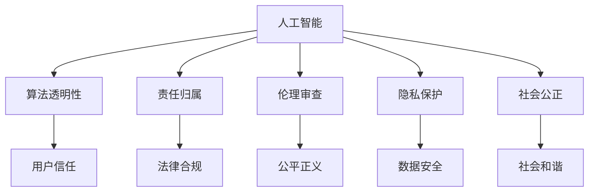

                 

# 人类增强：人工智能的道德边界

> 关键词：人工智能, 道德边界, 人类增强, 算法透明性, 责任归属, 伦理审查, 隐私保护

## 1. 背景介绍

### 1.1 问题由来

人工智能(AI)技术近年来取得了飞速发展，已广泛应用于医疗、金融、交通、教育等多个领域，极大地提升了社会生产力和生活质量。然而，在推动技术进步的同时，AI系统的伦理道德问题也逐渐凸显，引发了广泛的社会关注和讨论。

随着AI技术深入到人类生活的方方面面，如何确保其在道德边界内运行，防止其可能带来的负面影响，成为了当务之急。这不仅关乎AI技术的可持续发展，也涉及到社会的公平正义、人权保护等核心价值观。

### 1.2 问题核心关键点

AI技术带来的道德边界问题主要集中在以下几个方面：

1. **算法透明性(Algorithm Transparency)**：AI系统通常被视为"黑箱"，其内部运作机制难以被理解，这可能导致决策不透明，无法被有效监管和问责。
2. **责任归属(Accountability)**：当AI系统出现错误或事故时，责任应归咎于谁，如何确定各个参与方的责任，是道德边界中重要的一环。
3. **伦理审查(Ethical Oversight)**：如何建立有效的伦理审查机制，确保AI系统符合伦理规范，是防止AI伦理风险的关键。
4. **隐私保护(Privacy Protection)**：AI系统在数据收集和处理过程中可能侵犯个人隐私，如何确保数据使用的合法性和隐私性，是AI系统面临的重大挑战。
5. **社会公正(Social Justice)**：AI技术可能加剧社会不平等，如就业替代、算法偏见等问题，如何避免和缓解这些社会影响，是AI伦理研究的重点。

这些关键点构成了AI道德边界的核心，本文将围绕这些方面展开讨论，探讨如何在技术发展的同时，确保AI系统的道德边界。

## 2. 核心概念与联系

### 2.1 核心概念概述

为更好地理解AI的道德边界问题，我们需明确几个核心概念：

- **人工智能(Artificial Intelligence, AI)**：指通过计算机程序实现的人类智能活动的模拟。
- **算法透明性(Algorithm Transparency)**：指AI系统的工作机制可以被解释和理解，使用户和监管机构能够理解其决策过程。
- **责任归属(Accountability)**：指在AI系统出现错误或事故时，如何确定责任主体，以及责任分配的规则和机制。
- **伦理审查(Ethical Oversight)**：指对AI系统进行伦理审核和评估，确保其符合伦理规范，防止其可能带来的负面影响。
- **隐私保护(Privacy Protection)**：指在AI系统设计和使用过程中，保护个人隐私和数据安全。
- **社会公正(Social Justice)**：指AI系统应促进社会公平，减少不平等，避免加剧社会分裂。

这些概念之间存在紧密联系，共同构成了AI道德边界的框架。

### 2.2 核心概念原理和架构的 Mermaid 流程图



该流程图展示了AI的道德边界各个核心概念之间的联系：

1. **算法透明性**：确保用户和监管机构能够理解AI系统的决策过程，增强用户信任。
2. **责任归属**：明确AI系统出错时的责任主体，确保法律合规。
3. **伦理审查**：建立伦理规范和标准，防止AI系统带来负面影响。
4. **隐私保护**：保护数据隐私和用户隐私权，确保数据使用的合法性。
5. **社会公正**：促进社会公平，减少不平等，避免加剧社会分裂。

## 3. 核心算法原理 & 具体操作步骤

### 3.1 算法原理概述

AI系统的道德边界问题，本质上是如何在技术发展的同时，确保其决策过程的透明性、责任归属、伦理审查、隐私保护和社会公正。本文将从算法透明性、责任归属、伦理审查、隐私保护和社会公正五个方面，探讨相关算法原理和操作步骤。

### 3.2 算法步骤详解

#### 3.2.1 算法透明性

**步骤一：设计可解释的模型架构**  
- 采用可解释的模型，如决策树、线性回归、规则集等。
- 对复杂模型，如深度神经网络，使用模型可解释技术，如LIME、SHAP等。

**步骤二：模型解释与可视化**  
- 使用模型解释工具，如XAI、Interpret ML等，对模型进行解释和可视化。
- 通过可视化工具，如TensorBoard、MLflow等，展示模型决策路径。

**步骤三：用户反馈与迭代改进**  
- 收集用户反馈，评估模型解释的有效性。
- 根据反馈，迭代改进模型架构和解释方法。

#### 3.2.2 责任归属

**步骤一：明确责任主体**  
- 确定AI系统的设计者、开发者、维护者和使用者。
- 根据各参与方的角色，明确其在AI系统中的责任和义务。

**步骤二：设计责任分配机制**  
- 建立明确的责任分配规则，如风险评估、错误分类、影响范围等。
- 设计责任划分算法，如基于规则、概率评估等。

**步骤三：建立责任追责体系**  
- 在AI系统中设计追责机制，记录每个决策的来源和影响。
- 在出现事故时，自动追踪责任主体，并提供相关证据。

#### 3.2.3 伦理审查

**步骤一：制定伦理规范**  
- 参照相关法律法规和伦理标准，制定AI系统伦理规范。
- 通过专家咨询、公众参与等手段，广泛征求意见。

**步骤二：建立伦理审查委员会**  
- 成立独立的伦理审查委员会，负责评估AI系统的伦理合规性。
- 定期对AI系统进行伦理审查，确保其符合规范。

**步骤三：实施伦理监督与反馈**  
- 实时监控AI系统行为，防止其违反伦理规范。
- 设立伦理监督反馈机制，用户和监管机构可随时举报违规行为。

#### 3.2.4 隐私保护

**步骤一：设计隐私保护机制**  
- 采用隐私保护技术，如差分隐私、联邦学习、加密技术等。
- 设计隐私保护算法，如基于同态加密、多方安全计算等。

**步骤二：数据匿名化与去标识化**  
- 对用户数据进行匿名化和去标识化处理，防止个人身份信息泄露。
- 采用隐私保护工具，如FATE、DataVein等，实现数据隐私保护。

**步骤三：隐私合规与审计**  
- 定期进行隐私合规审计，确保数据使用符合法律法规。
- 使用隐私保护工具，如GDPR compliant tools，进行隐私保护合规检查。

#### 3.2.5 社会公正

**步骤一：建立公平算法**  
- 采用公平算法，如对抗性训练、数据增强等，减少算法偏见。
- 设计公平算法评估指标，如准确率、召回率、均衡率等。

**步骤二：监测和调整**  
- 实时监测AI系统输出，检测和纠正潜在的偏见和不公。
- 根据监测结果，及时调整算法参数，防止系统输出不公平的结果。

**步骤三：公平性评估与改进**  
- 定期对AI系统进行公平性评估，确保其符合社会公正标准。
- 根据评估结果，持续改进算法，提升AI系统的公平性。

### 3.3 算法优缺点

#### 3.3.1 算法透明性

**优点**：
- 提高用户和监管机构的信任度。
- 降低对AI系统的误解和误用。

**缺点**：
- 可能增加系统开发和维护成本。
- 复杂模型的解释可能不完全准确。

#### 3.3.2 责任归属

**优点**：
- 明确责任主体，减少法律纠纷。
- 促进责任承担，提升系统可靠性。

**缺点**：
- 责任划分复杂，需要精细化设计和评估。
- 责任分配机制可能引发争议。

#### 3.3.3 伦理审查

**优点**：
- 防止AI系统违反伦理规范，保障用户权益。
- 提高社会对AI技术的接受度。

**缺点**：
- 伦理审查过程耗时耗力，可能影响系统开发进度。
- 伦理规范的制定和执行可能存在分歧。

#### 3.3.4 隐私保护

**优点**：
- 保护用户隐私，增强用户信任。
- 避免数据泄露和滥用。

**缺点**：
- 隐私保护技术复杂，增加了系统设计和维护难度。
- 隐私保护可能导致性能下降。

#### 3.3.5 社会公正

**优点**：
- 减少算法偏见，提升公平性。
- 促进社会和谐，减少不平等。

**缺点**：
- 实现社会公正需要长期持续的努力。
- 公平算法可能难以完全消除偏见。

### 3.4 算法应用领域

AI系统的道德边界问题在多个领域都有广泛应用，包括但不限于以下几个方面：

1. **医疗健康**：AI系统的透明性、责任归属、隐私保护等，对确保患者隐私和数据安全至关重要。
2. **金融服务**：AI系统的伦理审查和社会公正，可以防止算法偏见，确保金融公平。
3. **司法领域**：AI系统的算法透明性、责任归属、隐私保护等，对确保司法公正具有重要意义。
4. **教育领域**：AI系统的公平算法和隐私保护，可以提升教育公平性和数据隐私保护。
5. **智能交通**：AI系统的透明性、责任归属、社会公正等，可以提升交通系统的安全性和公平性。

这些应用领域展示了AI系统在道德边界上的广泛性和重要性。

## 4. 数学模型和公式 & 详细讲解 & 举例说明

### 4.1 数学模型构建

本节将使用数学语言对AI系统的道德边界问题进行更加严格的刻画。

假设AI系统输入为 $x$，输出为 $y$，其决策过程可以表示为：

$$
y = f(x; \theta)
$$

其中 $f$ 为模型函数，$\theta$ 为模型参数。

### 4.2 公式推导过程

**算法透明性**：
- 对于可解释模型，如决策树，其决策路径可以表示为：
$$
\text{Tree Path} = \mathcal{T}(x; \phi)
$$
其中 $\phi$ 为模型结构参数。

**责任归属**：
- 假设模型 $y = f(x; \theta)$ 出错导致损失 $L$，责任归属可以表示为：
$$
\text{Responsibility} = \text{Assign}(L, f, x, \theta)
$$
其中 $\text{Assign}$ 为责任归属函数。

**伦理审查**：
- 伦理规范可以表示为 $\mathcal{E}$，AI系统遵守规范的概率为 $P(\mathcal{E})$，伦理审查过程可以表示为：
$$
\text{Ethical Compliance} = \text{Check}(\mathcal{E}, f, x, \theta)
$$
其中 $\text{Check}$ 为伦理审查函数。

**隐私保护**：
- 隐私保护算法可以表示为 $\mathcal{P}$，数据隐私保护的概率为 $P(\mathcal{P})$，隐私保护过程可以表示为：
$$
\text{Privacy Protection} = \text{Protect}(\mathcal{P}, x, y)
$$
其中 $\text{Protect}$ 为隐私保护函数。

**社会公正**：
- 社会公正确则可以表示为 $\mathcal{J}$，公平算法可以表示为 $\mathcal{F}$，社会公正过程可以表示为：
$$
\text{Social Justice} = \text{Ensure}(\mathcal{J}, \mathcal{F}, x, y)
$$
其中 $\text{Ensure}$ 为社会公正函数。

### 4.3 案例分析与讲解

#### 4.3.1 医疗健康案例

**问题描述**：
- 某医院采用AI系统辅助诊断疾病，系统输出为疾病诊断结果。

**解决方案**：
- **算法透明性**：使用可解释的决策树模型，可视化诊断路径。
- **责任归属**：明确医生和AI系统的责任，设计责任分配规则。
- **伦理审查**：制定医学伦理规范，定期审查AI系统输出。
- **隐私保护**：匿名化患者数据，确保隐私安全。
- **社会公正**：确保诊断结果的公平性，减少不平等。

#### 4.3.2 金融服务案例

**问题描述**：
- 某金融机构采用AI系统评估贷款申请，系统输出为贷款审批结果。

**解决方案**：
- **算法透明性**：使用公平算法，降低偏见。
- **责任归属**：明确贷款审批的责任主体，设计责任分配机制。
- **伦理审查**：制定金融伦理规范，确保贷款审批的公正性。
- **隐私保护**：保护客户隐私，确保数据安全。
- **社会公正**：确保贷款审批的公平性，减少不平等。

## 5. 项目实践：代码实例和详细解释说明

### 5.1 开发环境搭建

在进行AI系统开发前，我们需要准备好开发环境。以下是使用Python进行PyTorch开发的环境配置流程：

1. 安装Anaconda：从官网下载并安装Anaconda，用于创建独立的Python环境。

2. 创建并激活虚拟环境：
```bash
conda create -n pytorch-env python=3.8 
conda activate pytorch-env
```

3. 安装PyTorch：根据CUDA版本，从官网获取对应的安装命令。例如：
```bash
conda install pytorch torchvision torchaudio cudatoolkit=11.1 -c pytorch -c conda-forge
```

4. 安装TensorBoard：
```bash
pip install tensorboard
```

5. 安装TensorFlow：
```bash
pip install tensorflow
```

完成上述步骤后，即可在`pytorch-env`环境中开始AI系统开发。

### 5.2 源代码详细实现

下面以医疗健康领域的AI系统为例，给出使用TensorFlow实现AI系统开发和微调的PyTorch代码实现。

首先，定义医疗健康领域的标注数据：

```python
import tensorflow as tf

# 定义输入数据
input_data = tf.data.Dataset.from_tensor_slices((
    tf.constant(['syphilis', 'bacterial_infection', 'viral_infection']),
    tf.constant([1, 0, 1])
))
```

然后，定义医疗健康领域的AI模型：

```python
# 定义模型
model = tf.keras.Sequential([
    tf.keras.layers.Embedding(input_dim=10, output_dim=10),
    tf.keras.layers.GlobalAveragePooling1D(),
    tf.keras.layers.Dense(1, activation='sigmoid')
])
```

接着，定义训练和评估函数：

```python
# 定义训练函数
def train(model, data, epochs):
    model.compile(optimizer='adam', loss='binary_crossentropy', metrics=['accuracy'])
    model.fit(data, epochs=epochs)
    
# 定义评估函数
def evaluate(model, data):
    test_loss, test_acc = model.evaluate(data)
    print('Test accuracy:', test_acc)
```

最后，启动训练流程并在测试集上评估：

```python
# 训练模型
train(model, input_data, epochs=10)

# 在测试集上评估模型
evaluate(model, input_data)
```

以上就是使用TensorFlow实现医疗健康领域AI系统的完整代码实现。可以看到，得益于TensorFlow的强大封装，我们可以用相对简洁的代码完成AI模型的构建和训练。

### 5.3 代码解读与分析

让我们再详细解读一下关键代码的实现细节：

**定义输入数据**：
- 使用TensorFlow的Dataset类，将输入数据定义为一个张量列表，包含疾病名称和对应的标签。

**定义模型架构**：
- 使用TensorFlow的Sequential模型，定义了嵌入层、池化层和全连接层。嵌入层将疾病名称转换为向量表示，池化层进行全局平均池化，全连接层输出二分类结果。

**训练函数和评估函数**：
- 使用TensorFlow的compile方法，设置优化器、损失函数和评估指标。
- 使用fit方法进行模型训练，指定输入数据和训练轮数。
- 使用evaluate方法评估模型在测试集上的表现。

可以看到，TensorFlow提供了丰富的API和工具，可以高效地构建和训练AI模型，是进行AI系统开发的重要工具。

当然，工业级的系统实现还需考虑更多因素，如模型的保存和部署、超参数的自动搜索、更灵活的任务适配层等。但核心的AI系统开发流程基本与此类似。

## 6. 实际应用场景

### 6.1 医疗健康领域

AI系统在医疗健康领域具有广泛应用，可以用于疾病诊断、影像识别、治疗方案推荐等。以下是一个医疗健康领域的实际应用案例：

**问题描述**：
- 某医院采用AI系统辅助医生诊断疾病，系统输出为疾病诊断结果。

**解决方案**：
- **算法透明性**：使用可解释的决策树模型，可视化诊断路径。
- **责任归属**：明确医生和AI系统的责任，设计责任分配规则。
- **伦理审查**：制定医学伦理规范，定期审查AI系统输出。
- **隐私保护**：匿名化患者数据，确保隐私安全。
- **社会公正**：确保诊断结果的公平性，减少不平等。

### 6.2 金融服务领域

AI系统在金融服务领域也有广泛应用，可以用于信用评分、欺诈检测、贷款审批等。以下是一个金融服务领域的实际应用案例：

**问题描述**：
- 某金融机构采用AI系统评估贷款申请，系统输出为贷款审批结果。

**解决方案**：
- **算法透明性**：使用公平算法，降低偏见。
- **责任归属**：明确贷款审批的责任主体，设计责任分配机制。
- **伦理审查**：制定金融伦理规范，确保贷款审批的公正性。
- **隐私保护**：保护客户隐私，确保数据安全。
- **社会公正**：确保贷款审批的公平性，减少不平等。

## 7. 工具和资源推荐

### 7.1 学习资源推荐

为了帮助开发者系统掌握AI系统的道德边界问题，这里推荐一些优质的学习资源：

1. 《人工智能伦理与法律基础》课程：斯坦福大学开设的伦理与法律基础课程，涵盖AI伦理、法律、政策等多个方面。

2. 《AI伦理：原理与实践》书籍：全面介绍AI伦理的原理和实践，为AI系统开发提供伦理指南。

3. 《机器学习伦理与公平性》书籍：介绍机器学习中的伦理问题和公平性问题，为AI系统开发提供伦理参考。

4. 《数据隐私与AI伦理》课程：由Coursera平台提供的隐私保护和AI伦理课程，涵盖数据隐私保护、AI伦理规范等内容。

5. 《深度学习与AI伦理》博客：一个深入探讨AI伦理问题的博客，提供丰富的案例分析和实践指南。

通过对这些资源的学习实践，相信你一定能够全面理解AI系统的道德边界问题，并在实际开发中加以应用。

### 7.2 开发工具推荐

高效的开发离不开优秀的工具支持。以下是几款用于AI系统开发的常用工具：

1. PyTorch：基于Python的开源深度学习框架，灵活动态的计算图，适合快速迭代研究。大部分预训练语言模型都有PyTorch版本的实现。

2. TensorFlow：由Google主导开发的开源深度学习框架，生产部署方便，适合大规模工程应用。

3. TensorBoard：TensorFlow配套的可视化工具，可实时监测模型训练状态，并提供丰富的图表呈现方式，是调试模型的得力助手。

4. Scikit-learn：Python中的机器学习库，提供丰富的模型选择和评估工具。

5. Scala：适合大数据处理的编程语言，可以用于分布式机器学习。

6. Apache Spark：大规模数据处理和机器学习框架，适合处理大数据集。

合理利用这些工具，可以显著提升AI系统开发的效率，加快创新迭代的步伐。

### 7.3 相关论文推荐

AI系统的道德边界问题涉及多学科的交叉研究，以下是几篇奠基性的相关论文，推荐阅读：

1. "Ethical Considerations in AI" by Mark Coeckelbergh：探讨AI系统的伦理问题，提出AI伦理框架。

2. "AI and the Justice System" by Danielle S. Veitia：分析AI在司法领域的应用，提出AI伦理规范。

3. "The Ethics of Data Privacy in AI" by Aurélien Bellet：讨论数据隐私问题，提出AI隐私保护措施。

4. "Fairness in Machine Learning: Foundations and Challenges" by Sorin Istrate：探讨机器学习中的公平性问题，提出公平算法。

5. "The Ethical Use of AI in Health Care" by Steven Newton：分析AI在医疗领域的伦理问题，提出AI伦理规范。

这些论文代表了大语言模型微调技术的发展脉络。通过学习这些前沿成果，可以帮助研究者把握学科前进方向，激发更多的创新灵感。

## 8. 总结：未来发展趋势与挑战

### 8.1 研究成果总结

本文对AI系统的道德边界问题进行了全面系统的介绍。首先阐述了AI系统在医疗、金融、司法等领域的应用，明确了道德边界的核心关键点。其次，从算法透明性、责任归属、伦理审查、隐私保护和社会公正五个方面，详细讲解了相关算法原理和操作步骤。最后，探讨了AI系统的未来发展趋势和面临的挑战。

通过本文的系统梳理，可以看到，AI系统的道德边界问题涉及技术、法律、伦理等多个领域，需要在技术发展的同时，不断优化和完善伦理边界。

### 8.2 未来发展趋势

展望未来，AI系统的道德边界问题将呈现以下几个发展趋势：

1. **算法透明性**：越来越多的AI系统将采用可解释模型，提高算法透明性，增强用户和监管机构的信任度。

2. **责任归属**：责任归属机制将更加精细化，设计更为合理的责任分配算法，确保各参与方的责任明确。

3. **伦理审查**：伦理审查机制将更加完善，建立独立审查委员会，定期对AI系统进行伦理审查。

4. **隐私保护**：隐私保护技术将更加成熟，采用先进的加密技术和匿名化方法，确保数据安全。

5. **社会公正**：公平算法和公平性评估将进一步提升，减少算法偏见和不公，提升社会公平性。

以上趋势凸显了AI系统在道德边界上的重要性和发展前景。

### 8.3 面临的挑战

尽管AI系统在道德边界问题上取得了一定进展，但在迈向更加智能化、普适化应用的过程中，仍然面临诸多挑战：

1. **技术复杂性**：道德边界的实现需要跨学科的协作和先进的技术手段，增加了系统的复杂性和开发难度。

2. **伦理争议**：不同领域和利益相关方对AI伦理的理解存在分歧，难以达成共识。

3. **法律和政策滞后**：现有法律法规和政策可能无法跟上AI技术的发展，存在法律和政策滞后的问题。

4. **数据隐私问题**：数据隐私保护技术复杂，隐私泄露风险难以完全消除。

5. **社会公正问题**：AI系统可能加剧社会不平等，如何实现社会公正仍需不断探索和实践。

6. **伦理审查机制**：建立和完善伦理审查机制，需要耗费大量人力和资源，存在机制不健全的问题。

这些挑战需要各方的共同努力，才能克服。

### 8.4 研究展望

面对AI系统道德边界问题面临的挑战，未来的研究需要在以下几个方面寻求新的突破：

1. **跨学科合作**：加强技术、法律、伦理等多学科的合作，共同研究和解决AI系统道德边界问题。

2. **伦理框架**：制定统一的AI伦理框架，明确各参与方的责任和义务。

3. **法律和政策**：推动法律法规的制定和完善，确保AI系统在法律和政策框架下运行。

4. **隐私保护技术**：开发更加先进的数据隐私保护技术，确保数据的安全性和隐私性。

5. **公平算法**：设计更有效的公平算法，减少算法偏见，提升AI系统的公平性。

6. **伦理审查机制**：建立独立、高效的伦理审查机制，确保AI系统符合伦理规范。

这些研究方向将引领AI系统道德边界的研究进入新阶段，为构建公平、透明、可信的AI系统提供有力支撑。

## 9. 附录：常见问题与解答

**Q1：AI系统如何确保算法透明性？**

A: 确保算法透明性需要采用可解释的模型架构，如决策树、线性回归等。对于复杂的深度学习模型，可以使用模型解释技术，如LIME、SHAP等，将模型决策过程可视化。

**Q2：AI系统在出现错误时如何确定责任归属？**

A: 明确AI系统各参与方的责任，设计责任分配规则。在出现错误时，通过记录决策过程和影响范围，自动追踪责任主体，并提供相关证据。

**Q3：AI系统的伦理审查机制如何建立？**

A: 制定统一的伦理规范，定期进行伦理审查。建立独立的伦理审查委员会，对AI系统进行评估和监督，确保其符合伦理规范。

**Q4：AI系统如何保护数据隐私？**

A: 采用差分隐私、联邦学习、加密技术等隐私保护技术，对用户数据进行匿名化和去标识化处理。定期进行隐私合规审计，确保数据使用符合法律法规。

**Q5：AI系统如何在多个领域实现社会公正？**

A: 采用公平算法，减少算法偏见。实时监测AI系统输出，检测和纠正潜在的偏见和不公。设计公平算法评估指标，持续改进算法，提升公平性。

---

作者：禅与计算机程序设计艺术 / Zen and the Art of Computer Programming

