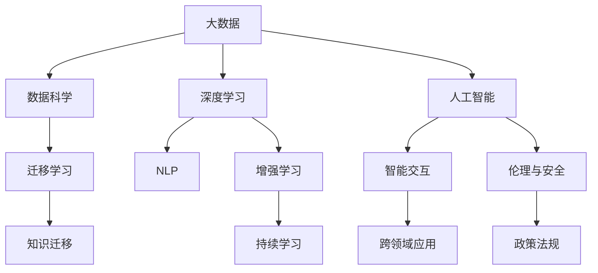

                 

## 1. 背景介绍

### 1.1 问题由来

进入21世纪以来，人工智能(AI)技术以势不可挡的态势席卷全球。它不仅在数据处理、机器学习、自然语言处理等领域取得了举世瞩目的突破，更在医疗、金融、教育、交通等传统行业产生了深刻的影响。人类社会正经历着由工业时代向智能时代的转变，AI正在重塑各行各业的生产方式和运营模式。

AI的发展源于对人类智慧的模拟和延伸。从最早的基于规则的专家系统，到符号计算的神经网络，再到深度学习、强化学习等算法的兴起，AI技术不断突破着认知能力的界限。今天，我们已经进入了基于大数据、大模型、深度学习的AI新时代。

### 1.2 问题核心关键点

AI时代的新力量，不仅仅在于技术本身的突破，更在于其对人类智慧的深刻影响。这种影响体现在以下几个关键点：

1. **数据驱动的决策**：AI通过大数据分析，可以支持更科学、更精确的决策。无论是医疗诊断、风险评估、客户分析，还是市场预测，AI都在为决策者提供强有力的数据支持。

2. **智能交互与协作**：AI可以与人类进行自然语言交流，理解人类意图，提供个性化服务。这在智能客服、智能家居、智能办公等领域展现出了巨大的潜力。

3. **跨领域创新应用**：AI技术跨越了传统学科的界限，跨学科、跨领域的应用创新正在涌现。AI与医学、教育、艺术、体育等领域的结合，正在改变人们的生活方式。

4. **自主学习和持续改进**：AI系统能够通过不断学习新知识，提高自身能力。无论是传统的机器学习算法，还是近年来的深度学习、强化学习、迁移学习等先进技术，都展示了AI自我提升的能力。

5. **伦理和安全的挑战**：随着AI技术的广泛应用，其带来的伦理和安全问题也日益凸显。数据隐私、算法偏见、决策透明性等问题，成为社会关注的焦点。

这些关键点共同构成了AI时代的新力量，不仅推动了技术进步，更引领了社会的深刻变革。

### 1.3 问题研究意义

探讨AI时代的新力量，对于理解AI技术的本质、发挥其潜力、应对其挑战，具有重要意义：

1. **推动技术进步**：通过深入研究AI的原理和应用，可以推动相关技术的进一步发展和完善。
2. **促进社会变革**：揭示AI对社会各领域的深远影响，可以更好地指导AI技术的广泛应用。
3. **应对伦理挑战**：分析AI带来的伦理和安全问题，有助于制定合理的政策法规，保障技术健康发展。
4. **培养跨领域人才**：AI技术的跨学科应用特性，需要具备跨领域知识的人才，这对教育和人才培养提出了新的要求。

## 2. 核心概念与联系

### 2.1 核心概念概述

在探讨AI时代的新力量时，首先需要明确几个核心概念及其联系：

1. **人工智能**：一种模拟人类智能的技术，包括感知、理解、学习、推理等方面。AI的目标是实现机器的自主智能。

2. **深度学习**：一种基于神经网络的机器学习方法，通过多层次的抽象和表示，可以从原始数据中自动提取特征，实现复杂模式的识别和预测。

3. **迁移学习**：将在一个领域学到的知识迁移到另一个领域，以减少在新领域从头学习所需的样本量。

4. **增强学习**：通过试错和反馈，使机器在与环境的交互中不断学习和改进。

5. **自然语言处理(NLP)**：使计算机能够理解、处理和生成人类语言的技术。包括文本分类、情感分析、机器翻译、问答系统等。

6. **大数据**：涉及数据的收集、存储、处理和分析，是AI的重要基础。

7. **数据科学**：通过统计学、机器学习等方法，从数据中提取知识和洞察，支持决策和优化。

这些概念之间相互关联，共同构成了AI技术的框架。深度学习是实现AI的核心技术，而大数据和NLP则是AI处理信息的主要手段，迁移学习和增强学习则是AI提升自身能力的重要方法。

### 2.2 核心概念原理和架构的 Mermaid 流程图

以下是AI时代的新力量的核心概念原理和架构的Mermaid流程图：



这个流程图展示了AI技术各个组件之间的关系和相互作用。大数据是基础，数据科学提供了分析工具，深度学习实现感知和理解，自然语言处理处理语言信息，迁移学习和增强学习使AI不断学习和优化，人工智能是整体的集成，智能交互和跨领域应用是具体的应用表现，伦理和安全则是AI技术发展中需要关注的重要方面。

## 3. 核心算法原理 & 具体操作步骤

### 3.1 算法原理概述

AI时代的新力量，主要体现在以下几个核心算法原理上：

1. **深度学习原理**：深度学习通过构建多层神经网络，实现了对复杂模式的自动学习和提取。这一原理使得AI在图像识别、语音识别、自然语言处理等领域取得了突破。

2. **迁移学习原理**：迁移学习通过将一个领域的知识迁移到另一个领域，减少了新领域学习所需的数据量和计算量。这一原理使得AI可以跨领域应用，提高了AI技术的泛化能力。

3. **增强学习原理**：增强学习通过与环境的交互，不断试错和优化，使得AI可以自主学习并适应新环境。这一原理使得AI在自动驾驶、机器人控制等领域展现了巨大的潜力。

4. **自然语言处理原理**：自然语言处理通过构建语言模型和理解算法，使机器能够理解人类语言。这一原理使得AI在智能客服、智能办公、情感分析等领域得以广泛应用。

5. **大数据处理原理**：大数据处理通过高效的数据存储和分析技术，支持AI对海量数据的处理和分析。这一原理使得AI能够从大规模数据中提取知识和洞察，支持科学决策。

### 3.2 算法步骤详解

基于上述核心算法原理，AI时代的新力量的操作步骤可以分为以下几个步骤：

1. **数据准备**：收集和预处理所需的大数据，确保数据的质量和多样性。

2. **模型设计**：选择合适的深度学习模型和算法，设计合适的网络结构和参数配置。

3. **模型训练**：在大数据集上训练模型，通过反向传播等算法优化模型参数，提高模型精度和泛化能力。

4. **模型测试与评估**：在测试集上评估模型的性能，确保模型在新数据上的表现良好。

5. **模型部署与优化**：将训练好的模型部署到实际应用场景中，通过反馈和优化不断提升模型性能。

6. **跨领域应用**：将模型应用到不同领域，如医疗、金融、教育、交通等，实现跨领域的智能应用。

7. **伦理与安全考虑**：在模型开发和应用中，考虑伦理和安全问题，确保AI技术的健康发展。

### 3.3 算法优缺点

AI时代的新力量的算法，具有以下优点和缺点：

#### 优点

1. **自动化学习**：深度学习和增强学习使得AI能够自动化学习新知识和技能，减少了人工干预的需要。

2. **泛化能力强**：迁移学习和大规模预训练模型使得AI能够适应不同领域的任务，提高了模型的泛化能力。

3. **处理大数据**：大数据处理技术使得AI能够处理和分析海量数据，提供了强有力的数据支持。

4. **高效互动**：自然语言处理和智能交互技术使得AI能够与人类进行高效互动，支持个性化服务。

#### 缺点

1. **数据依赖性强**：AI模型的性能很大程度上依赖于数据的质量和数量，高质量的数据获取成本较高。

2. **模型复杂度高**：深度学习模型通常较为复杂，训练和优化所需计算资源较高。

3. **可解释性差**：AI模型的决策过程往往难以解释，难以理解和调试。

4. **伦理安全问题**：AI模型可能存在偏见、歧视等问题，对社会伦理和安全带来挑战。

5. **资源消耗大**：大数据处理和深度学习模型对计算资源和存储空间的需求较高，成本较高。

### 3.4 算法应用领域

AI时代的新力量的算法，在多个领域得到了广泛应用，包括但不限于：

1. **医疗健康**：AI在医学影像分析、疾病诊断、个性化治疗等方面发挥了重要作用，提高了医疗服务的效率和质量。

2. **金融服务**：AI在风险评估、欺诈检测、投资策略等方面展现了巨大潜力，提高了金融服务的精准度和安全性。

3. **教育培训**：AI在智能辅导、学习分析、个性化推荐等方面提供了新的教育解决方案，提高了教育质量和公平性。

4. **智能交通**：AI在自动驾驶、交通流量分析、智能交通管理等方面展示了巨大潜力，提高了交通系统的效率和安全性。

5. **智能制造**：AI在工业自动化、智能检测、质量控制等方面发挥了重要作用，提高了生产效率和产品质量。

6. **智能家居**：AI在智能音箱、智能家电、智能安防等方面提供了新的家居解决方案，提高了生活便利性和舒适度。

7. **娱乐媒体**：AI在推荐系统、内容生成、智能客服等方面展示了巨大潜力，提高了娱乐体验和用户满意度。

## 4. 数学模型和公式 & 详细讲解 & 举例说明

### 4.1 数学模型构建

以下是AI时代的新力量的数学模型构建：

1. **神经网络模型**：
   - 输入层：接收原始数据，进行特征提取。
   - 隐藏层：对输入数据进行多层次的抽象和表示，提取高层次的特征。
   - 输出层：根据任务需求，输出分类、回归、序列预测等结果。

2. **深度学习框架**：
   - 数据准备：收集和预处理数据，确保数据的质量和多样性。
   - 模型设计：选择合适的深度学习模型和算法，设计合适的网络结构和参数配置。
   - 模型训练：在大数据集上训练模型，通过反向传播等算法优化模型参数，提高模型精度和泛化能力。
   - 模型测试与评估：在测试集上评估模型的性能，确保模型在新数据上的表现良好。

3. **自然语言处理模型**：
   - 文本表示：将文本转换为向量表示，支持模型对文本信息的处理和理解。
   - 语言模型：构建语言模型，理解文本的语法和语义。
   - 任务模型：根据具体任务需求，设计任务模型，如文本分类、情感分析、机器翻译等。

### 4.2 公式推导过程

以下是深度学习模型中常用的反向传播算法公式推导：

1. **前向传播**：
   - 输入 $x$，通过多层神经网络计算得到输出 $y$。
   - $y = \sigma(\omega_1 \sigma(\omega_2 \sigma(\omega_3 \sigma(\omega_4 \sigma(\omega_5 x))))$

2. **损失函数**：
   - 常用的损失函数包括交叉熵损失、均方误差损失等。
   - 以交叉熵损失为例：$L(y, \hat{y}) = -\frac{1}{N} \sum_{i=1}^N [y_i \log \hat{y}_i + (1-y_i) \log (1-\hat{y}_i)]$

3. **反向传播**：
   - 通过链式法则计算损失函数对各层参数的梯度，更新参数。
   - $\nabla_{\omega_5} L(y, \hat{y}) = -\frac{1}{N} \sum_{i=1}^N (y_i - \hat{y}_i) \sigma'(\omega_5 \sigma(\omega_4 \sigma(\omega_3 \sigma(\omega_2 \sigma(\omega_1 x)))) \sigma'(\omega_5 \sigma(\omega_4 \sigma(\omega_3 \sigma(\omega_2 \sigma(\omega_1 x))))$

4. **优化算法**：
   - 常用的优化算法包括随机梯度下降(SGD)、Adam、Adagrad等。
   - 以Adam优化算法为例：$v_t = \beta_2 v_{t-1} + (1-\beta_2) g_t^2$，$m_t = \beta_1 m_{t-1} + (1-\beta_1) g_t$
   - 更新参数：$\theta_{t+1} = \theta_t - \frac{\eta m_t}{\sqrt{v_t} + \epsilon}$

### 4.3 案例分析与讲解

以下是一个文本分类任务的深度学习模型实现案例：

1. **数据准备**：
   - 收集并标注数据集，确保数据的多样性和代表性。
   - 将文本转换为向量表示，支持模型对文本信息的处理和理解。

2. **模型设计**：
   - 使用BERT模型作为基础模型，添加全连接层进行分类。
   - 设计合适的损失函数和优化算法，进行模型训练。

3. **模型训练**：
   - 使用Adam优化算法，设置合适的学习率，进行模型训练。
   - 在训练过程中，使用数据增强和正则化技术，避免过拟合。

4. **模型测试与评估**：
   - 在测试集上评估模型性能，计算准确率、召回率、F1值等指标。
   - 使用混淆矩阵等方法，分析模型的分类结果，识别模型性能瓶颈。

5. **模型优化**：
   - 根据测试结果，调整模型参数，优化模型性能。
   - 引入迁移学习等技术，提高模型的泛化能力。

## 5. 项目实践：代码实例和详细解释说明

### 5.1 开发环境搭建

进行AI项目实践，首先需要搭建好开发环境：

1. **安装Python**：
   - 从官网下载并安装Python。
   - 安装必要的第三方库，如TensorFlow、PyTorch、Keras等。

2. **安装深度学习框架**：
   - 安装TensorFlow、PyTorch等深度学习框架。
   - 安装自然语言处理库，如NLTK、spaCy、Gensim等。

3. **安装大数据处理库**：
   - 安装Pandas、NumPy、Scikit-learn等数据处理库。
   - 安装TensorBoard等可视化工具。

4. **配置开发环境**：
   - 创建虚拟环境，避免与其他项目冲突。
   - 设置环境变量，方便开发过程中的库加载。

### 5.2 源代码详细实现

以下是使用PyTorch实现深度学习模型的代码实现：

```python
import torch
import torch.nn as nn
import torch.optim as optim
from torch.utils.data import DataLoader, Dataset

# 定义数据集
class TextDataset(Dataset):
    def __init__(self, texts, labels):
        self.texts = texts
        self.labels = labels

    def __len__(self):
        return len(self.texts)

    def __getitem__(self, idx):
        return self.texts[idx], self.labels[idx]

# 定义模型
class TextModel(nn.Module):
    def __init__(self, embedding_dim, hidden_dim, output_dim):
        super(TextModel, self).__init__()
        self.embedding = nn.Embedding(vocab_size, embedding_dim)
        self.rnn = nn.LSTM(embedding_dim, hidden_dim)
        self.fc = nn.Linear(hidden_dim, output_dim)
        self.sigmoid = nn.Sigmoid()

    def forward(self, x):
        embedded = self.embedding(x)
        output, (hidden, cell) = self.rnn(embedded)
        assert torch.equal(hidden[-1], cell[-1])
        hidden = self.sigmoid(self.fc(hidden[-1]))
        return hidden

# 定义损失函数和优化器
criterion = nn.BCELoss()
optimizer = optim.Adam(model.parameters(), lr=0.001)

# 定义训练和测试函数
def train(model, train_loader, epochs):
    for epoch in range(epochs):
        for batch_idx, (texts, labels) in enumerate(train_loader):
            optimizer.zero_grad()
            outputs = model(texts)
            loss = criterion(outputs, labels)
            loss.backward()
            optimizer.step()
            if batch_idx % 100 == 0:
                print(f'Train Epoch: {epoch}, Loss: {loss:.4f}')

def test(model, test_loader):
    correct = 0
    total = 0
    with torch.no_grad():
        for texts, labels in test_loader:
            outputs = model(texts)
            _, predicted = torch.max(outputs.data, 1)
            total += labels.size(0)
            correct += (predicted == labels).sum().item()
    print(f'Accuracy: {(100 * correct / total):.2f}%')
```

### 5.3 代码解读与分析

以下是代码实现中的一些关键点：

1. **数据集定义**：
   - 定义TextDataset类，继承自PyTorch的Dataset类，实现数据的加载和处理。
   - 定义文本和标签，加载到模型中。

2. **模型定义**：
   - 定义TextModel类，继承自PyTorch的nn.Module类，实现模型的定义。
   - 定义Embedding层、LSTM层和全连接层，进行文本向量化和分类。

3. **损失函数和优化器**：
   - 定义BCELoss损失函数，用于计算二分类任务的损失。
   - 定义Adam优化器，用于优化模型的参数。

4. **训练和测试函数**：
   - 定义训练函数，通过循环迭代，进行模型的训练。
   - 定义测试函数，计算模型在测试集上的准确率。

5. **模型训练**：
   - 在训练函数中，循环遍历训练集，计算模型输出，更新模型参数。
   - 在测试函数中，计算模型在测试集上的准确率，评估模型性能。

## 6. 实际应用场景

### 6.1 智能客服系统

AI时代的新力量在智能客服系统中得到了广泛应用。通过AI技术，客服系统能够自动理解和回答客户的问题，提高了客服的效率和质量。

1. **问题理解**：
   - 使用NLP技术，理解客户的问题。
   - 通过文本分类、情感分析等技术，判断客户情绪。

2. **问题解答**：
   - 使用问答系统，自动生成答案。
   - 通过自然语言处理，生成自然流畅的回复。

3. **客户体验**：
   - 通过语音识别和自然语言处理，支持语音客服。
   - 通过多轮对话，支持复杂问题的处理。

### 6.2 金融服务

AI时代的新力量在金融服务中也展现了巨大的潜力。通过AI技术，金融机构能够更好地理解和评估风险，提高决策的准确性和效率。

1. **风险评估**：
   - 使用机器学习算法，分析客户的信用记录和行为数据。
   - 通过增强学习，不断优化风险评估模型。

2. **欺诈检测**：
   - 使用异常检测算法，识别异常交易行为。
   - 通过多模态学习，综合利用不同数据源的信息。

3. **投资策略**：
   - 使用深度学习算法，预测股票市场走势。
   - 通过强化学习，优化投资组合策略。

### 6.3 教育培训

AI时代的新力量在教育培训中也得到了广泛应用。通过AI技术，教育机构能够更好地理解学生的需求，提供个性化的学习方案。

1. **学习分析**：
   - 使用机器学习算法，分析学生的学习行为和表现。
   - 通过NLP技术，理解学生的语言表达。

2. **智能辅导**：
   - 使用智能辅导系统，提供个性化的学习建议。
   - 通过自然语言处理，支持自然对话的智能辅导。

3. **内容生成**：
   - 使用生成对抗网络，生成高质量的教学内容。
   - 通过数据驱动的推荐系统，推荐适合的学习资源。

## 7. 工具和资源推荐

### 7.1 学习资源推荐

为了帮助开发者系统掌握AI时代的新力量，这里推荐一些优质的学习资源：

1. **Coursera和edX**：
   - 提供丰富的AI和数据科学课程，涵盖深度学习、自然语言处理、机器学习等多个领域。
   - 邀请业内专家授课，提供理论和实践相结合的学习体验。

2. **Deep Learning Specialization by Andrew Ng**：
   - 由斯坦福大学Andrew Ng教授主讲的深度学习课程，系统介绍深度学习的基础理论和实践方法。
   - 课程内容丰富，适合入门和进阶学习。

3. **NLP with Python by Dr. Christopher Manning**：
   - 由斯坦福大学教授Dr. Christopher Manning主讲的自然语言处理课程，讲解NLP的核心技术和应用。
   - 课程包含大量代码实现和案例分析，适合实践学习。

4. **TensorFlow官网和文档**：
   - 提供详细的TensorFlow教程、示例和API文档，支持深度学习和自然语言处理的应用开发。
   - 提供丰富的社区支持和在线交流平台，帮助解决学习过程中的问题。

5. **PyTorch官网和文档**：
   - 提供详细的PyTorch教程、示例和API文档，支持深度学习和自然语言处理的应用开发。
   - 提供丰富的社区支持和在线交流平台，帮助解决学习过程中的问题。

### 7.2 开发工具推荐

为了提高AI项目的开发效率，以下推荐一些常用的开发工具：

1. **Jupyter Notebook**：
   - 支持Python等语言开发，提供代码编辑器和交互式计算环境。
   - 支持代码块的详细注释和代码块之间的交互，方便学习和调试。

2. **TensorBoard**：
   - 提供深度学习模型的可视化工具，支持模型的训练过程监控和调试。
   - 支持模型的架构展示、损失曲线、参数变化等可视化。

3. **WeChat Work**：
   - 提供企业级的AI开发平台，支持模型的部署和管理。
   - 支持模型的版本控制、访问控制、权限管理等企业级功能。

4. **AWS SageMaker**：
   - 提供云端的AI开发平台，支持模型的训练、部署和监控。
   - 支持多种深度学习框架和NLP框架，方便模型的开发和部署。

### 7.3 相关论文推荐

AI时代的新力量背后的理论基础和应用实践，离不开大量的研究成果。以下是几篇奠基性的相关论文，推荐阅读：

1. **《深度学习》 by Ian Goodfellow**：
   - 系统介绍深度学习的原理和应用，涵盖神经网络、损失函数、优化算法等多个方面。
   - 提供丰富的理论和实践案例，适合深入学习和理解。

2. **《自然语言处理综述》 by Christopher Manning and Hinrich Schütze**：
   - 详细讲解NLP的核心技术和应用，涵盖文本表示、语言模型、NLP框架等多个方面。
   - 提供丰富的案例和实际应用，适合实践学习。

3. **《增强学习：一种新型的机器学习方法》 by Richard S. Sutton and Andrew G. Barto**：
   - 系统介绍增强学习的原理和应用，涵盖Q-learning、蒙特卡洛树搜索等多个方面。
   - 提供丰富的理论和实践案例，适合深入学习和理解。

4. **《数据科学与机器学习》 by Peter Harrington**：
   - 讲解数据科学和机器学习的基础理论和应用，涵盖数据处理、特征工程、模型评估等多个方面。
   - 提供丰富的案例和实际应用，适合实践学习。

这些论文代表了AI时代的新力量背后的理论和实践基础，通过学习这些前沿成果，可以帮助研究者更好地掌握AI技术的核心思想和应用方法。

## 8. 总结：未来发展趋势与挑战

### 8.1 研究成果总结

AI时代的新力量已经取得了显著的进展，以下是一些重要的研究成果：

1. **深度学习模型**：
   - 提出了多种深度学习模型，如卷积神经网络、递归神经网络、注意力机制等。
   - 通过自监督学习和迁移学习，提升了深度学习模型的泛化能力。

2. **自然语言处理技术**：
   - 提出了多种NLP技术，如文本分类、情感分析、机器翻译等。
   - 通过预训练语言模型和迁移学习，提升了NLP技术的效果。

3. **大数据处理技术**：
   - 提出了多种大数据处理技术，如分布式存储、流式处理、实时分析等。
   - 通过大数据技术，支持AI模型的训练和优化。

4. **跨领域应用技术**：
   - 提出了多种跨领域应用技术，如智能客服、智能医疗、智能制造等。
   - 通过跨领域技术的融合，提升了AI系统的应用效果。

### 8.2 未来发展趋势

AI时代的新力量将呈现以下几个发展趋势：

1. **自主学习能力的提升**：
   - 通过深度学习和增强学习，AI系统的自主学习能力将不断提升，能够更好地适应新环境和新任务。
   - 未来的AI系统将具备更强的自适应能力和持续改进能力。

2. **多模态信息融合**：
   - 通过多模态融合技术，AI系统将能够更好地理解和处理复杂的信息。
   - 未来的AI系统将支持视觉、语音、文本等多种模态的信息融合，提升系统的综合能力。

3. **知识表示与推理**：
   - 通过知识表示和推理技术，AI系统将具备更强的逻辑推理能力。
   - 未来的AI系统将能够更好地利用先验知识和规则，提高系统的可信度和透明性。

4. **跨领域应用拓展**：
   - 通过跨领域技术的融合，AI系统将能够在更多领域中应用。
   - 未来的AI系统将在智慧城市、智能家居、智能制造等领域发挥更大的作用。

5. **数据隐私与安全**：
   - 通过数据隐私保护和安全技术，保障AI系统使用的数据安全和隐私。
   - 未来的AI系统将具备更强的数据保护能力，确保数据的安全性和隐私性。

### 8.3 面临的挑战

尽管AI时代的新力量取得了显著进展，但在未来发展过程中，仍面临一些挑战：

1. **数据隐私与安全**：
   - 如何保护用户的隐私数据，防止数据泄露和滥用。
   - 如何确保AI系统的安全性，防止恶意攻击和误用。

2. **伦理与法律问题**：
   - 如何处理AI系统中的伦理问题，确保系统的公正性和透明性。
   - 如何制定合理的法规和政策，规范AI系统的应用。

3. **模型复杂性与效率**：
   - 如何降低深度学习模型的复杂性，提高模型的训练和推理效率。
   - 如何优化数据处理和存储技术，提高系统的资源利用率。

4. **跨领域应用挑战**：
   - 如何跨越不同领域的知识壁垒，实现跨领域的智能应用。
   - 如何更好地理解和利用不同领域的知识，提升系统的综合能力。

5. **可解释性与透明性**：
   - 如何提高AI系统的可解释性和透明性，帮助用户理解系统的决策过程。
   - 如何构建公平、可信的AI系统，提升用户对系统的信任度。

### 8.4 研究展望

未来的AI时代的新力量，需要在以下几个方面进行进一步研究：

1. **跨领域知识融合**：
   - 通过跨领域知识融合技术，提升AI系统的综合能力。
   - 构建多模态融合的AI系统，支持复杂的信息处理。

2. **自主学习与推理**：
   - 研究自主学习和推理技术，提升AI系统的自主学习能力。
   - 构建具有逻辑推理能力的AI系统，支持复杂问题的解决。

3. **数据隐私与安全**：
   - 研究数据隐私保护和安全技术，确保数据的隐私和安全。
   - 构建可信的AI系统，防止数据泄露和滥用。

4. **伦理与法律**：
   - 研究AI系统中的伦理问题，确保系统的公正性和透明性。
   - 制定合理的法规和政策，规范AI系统的应用。

5. **可解释性与透明性**：
   - 研究AI系统的可解释性技术，提升系统的透明性和可信度。
   - 构建公平、可信的AI系统，提升用户对系统的信任度。

## 9. 附录：常见问题与解答

### Q1: 什么是AI时代的新力量？

A: AI时代的新力量是指通过人工智能技术，在深度学习、自然语言处理、大数据处理、跨领域应用等方面取得的新进展。这些新进展不仅推动了技术的进步，更在医疗、金融、教育、交通等多个领域带来了深刻的影响。

### Q2: AI时代的新力量在实际应用中面临哪些挑战？

A: AI时代的新力量在实际应用中面临以下挑战：

1. **数据隐私与安全**：如何保护用户的隐私数据，防止数据泄露和滥用。
2. **伦理与法律问题**：如何处理AI系统中的伦理问题，确保系统的公正性和透明性。
3. **模型复杂性与效率**：如何降低深度学习模型的复杂性，提高模型的训练和推理效率。
4. **跨领域应用挑战**：如何跨越不同领域的知识壁垒，实现跨领域的智能应用。
5. **可解释性与透明性**：如何提高AI系统的可解释性和透明性，帮助用户理解系统的决策过程。

### Q3: 如何提升AI系统的自主学习能力？

A: 提升AI系统的自主学习能力，可以通过以下方法：

1. **深度学习**：使用深度学习算法，通过多层次的抽象和表示，从原始数据中自动提取特征。
2. **增强学习**：通过与环境的交互，不断试错和优化，使AI系统能够自主学习并适应新环境。
3. **迁移学习**：将一个领域的知识迁移到另一个领域，减少新领域学习所需的数据量和计算量。
4. **知识表示与推理**：构建知识表示和推理技术，提升AI系统的逻辑推理能力。

### Q4: 如何构建公平、可信的AI系统？

A: 构建公平、可信的AI系统，可以从以下几个方面入手：

1. **数据隐私与安全**：使用数据隐私保护和安全技术，确保数据的隐私和安全。
2. **伦理与法律**：制定合理的法规和政策，规范AI系统的应用。
3. **可解释性与透明性**：研究AI系统的可解释性技术，提升系统的透明性和可信度。

### Q5: 如何实现多模态信息的融合？

A: 实现多模态信息的融合，可以通过以下方法：

1. **多模态表示学习**：使用多模态表示学习技术，将视觉、语音、文本等多种模态的信息表示为一个统一的向量空间。
2. **跨模态对齐**：使用跨模态对齐技术，将不同模态的信息对齐，支持多模态信息的融合。
3. **融合模型设计**：设计融合模型，支持多种模态的信息处理和理解。

---

作者：禅与计算机程序设计艺术 / Zen and the Art of Computer Programming

