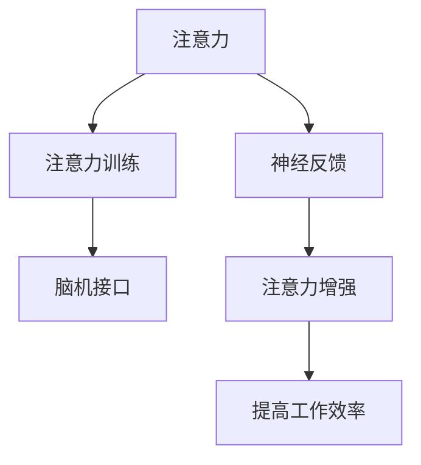

                 

## 1. 背景介绍

### 1.1 问题由来
在当今快节奏的世界中，人们面临着来自工作、学习和生活各个方面的巨大压力，注意力逐渐成为了一种稀缺资源。在医疗领域，注意力分散不仅影响医生的诊断和治疗，还可能对患者的康复效果产生负面影响。近年来，随着人工智能技术的发展，人们开始探索如何利用技术手段来提升人类的专注力和注意力，尤其是在医疗领域的应用。

### 1.2 问题核心关键点
提升专注力和注意力，特别是医疗领域的注意力提升，可以通过以下几种方式来实现：
1. **注意力训练**：通过专门设计的训练程序，提高用户的注意力水平。
2. **注意力辅助工具**：开发各种工具和应用，帮助用户维持注意力，如计时器、番茄工作法应用等。
3. **神经反馈技术**：利用脑电图(EEG)等神经信号检测手段，实时反馈用户的注意力状态，提供调整建议。
4. **认知增强药物**：使用一些药物或补充剂，增强大脑对注意力的管理能力。

这些方法各有优缺点，但共同的目标是帮助人们提升专注力和注意力，从而提高工作和学习效率，改善医疗效果。本文将重点探讨神经反馈技术和注意力训练这两种方法，并结合具体的案例和应用场景进行深入分析。

## 2. 核心概念与联系

### 2.1 核心概念概述

为了更好地理解注意力增强技术，我们需要首先了解几个核心概念：

1. **注意力**：指人的认知资源集中在某个特定任务或对象上的能力。注意力增强技术旨在提高这种能力，特别是在医疗和工作中。
2. **神经反馈(Neural Feedback)**：通过实时监测神经信号，如脑电图(EEG)、功能性磁共振成像(fMRI)等，向用户提供关于注意力状态的反馈，并指导用户进行相应的调整。
3. **脑机接口(Brain-Computer Interface, BCI)**：利用神经信号和计算机技术的交互，实现人机之间的直接信息交流，用于改善认知功能，如注意力、记忆等。
4. **注意力训练(Attention Training)**：通过有针对性的训练程序，提高用户的注意力水平，包括集中注意力和分散注意力之间的切换。

这些概念之间的逻辑关系可以通过以下Mermaid流程图来展示：



这个流程图展示了几类注意力增强技术之间的关联：

1. 注意力是核心概念，神经反馈和注意力训练都是提升注意力的手段。
2. 脑机接口技术是实现神经反馈的重要技术手段之一。
3. 注意力增强不仅能提高工作效率，还能在医疗领域应用，帮助患者恢复注意力。

### 2.2 核心概念原理和架构

注意力增强技术的核心原理在于，通过实时监测和反馈用户的注意力状态，结合有针对性的训练，逐步提升用户的专注力和注意力水平。神经反馈技术利用神经信号检测手段，将注意力状态的实时信息反馈给用户，使用户能够更好地了解自己的注意力水平，并根据反馈信息进行调整。注意力训练则通过有意识地训练，逐步提高用户的注意力水平，使他们能够在不同场景下更有效地分配注意力资源。

这两种技术的结合，可以形成一套完整的注意力增强系统，帮助用户在不同情境下提升专注力和注意力，从而提高工作效率和生活质量。

## 3. 核心算法原理 & 具体操作步骤

### 3.1 算法原理概述

神经反馈技术的核心算法原理包括信号检测、特征提取、信号分类和反馈调整四个步骤。具体来说：

1. **信号检测**：使用脑电图(EEG)等神经信号检测设备，实时监测用户的神经信号。
2. **特征提取**：从神经信号中提取注意力相关的特征，如频谱功率、事件相关电位(ERP)等。
3. **信号分类**：利用机器学习算法，将提取的特征分类为不同的注意力状态，如集中注意力、分散注意力等。
4. **反馈调整**：根据分类结果，向用户提供相应的反馈和调整建议，如提醒用户集中注意力、休息片刻等。

注意力训练则基于认知心理学理论，通过有针对性的训练程序，逐步提高用户的注意力水平。这种训练通常包括集中注意力、分散注意力、任务切换等各个方面的训练。

### 3.2 算法步骤详解

#### 神经反馈技术

**Step 1: 准备神经信号检测设备**
- 选择适合的脑电图(EEG)设备，并确保其准确性和稳定性。

**Step 2: 信号采集和预处理**
- 使用EEG设备采集用户的神经信号。
- 对采集的信号进行预处理，如滤波、归一化等，以提高信号质量。

**Step 3: 特征提取**
- 使用特定的算法提取神经信号中的注意力相关特征。

**Step 4: 信号分类**
- 利用机器学习算法，如支持向量机(SVM)、随机森林(Random Forest)等，对提取的特征进行分类，得到注意力状态。

**Step 5: 反馈调整**
- 根据分类结果，向用户提供相应的反馈和调整建议。
- 如果用户处于分散注意力状态，提醒用户集中注意力；如果用户过度疲劳，建议用户进行休息。

#### 注意力训练

**Step 1: 设计训练任务**
- 根据用户的注意力水平和训练目标，设计适合的训练任务。

**Step 2: 监测注意力状态**
- 在训练过程中，实时监测用户的注意力状态。

**Step 3: 提供即时反馈**
- 根据注意力监测结果，向用户提供即时反馈，指导用户调整注意力分配。

**Step 4: 调整训练难度**
- 根据用户的学习进度，逐步调整训练任务的难度。

**Step 5: 评估训练效果**
- 在训练结束后，评估用户的注意力水平是否有所提升。

### 3.3 算法优缺点

#### 神经反馈技术

**优点**：
1. **实时监测**：能够实时监测用户的注意力状态，提供即时反馈，帮助用户及时调整。
2. **个性化调整**：根据用户的具体注意力水平和状态，提供个性化的调整建议，更加精准。

**缺点**：
1. **设备依赖**：需要专业的神经信号检测设备，成本较高，且设备维护需要专业技能。
2. **数据隐私**：神经信号的监测和分析涉及个人隐私，需要严格遵守数据保护法规。
3. **技术复杂**：涉及神经信号处理和机器学习算法，技术门槛较高。

#### 注意力训练

**优点**：
1. **成本低**：训练程序可以在计算机上运行，无需特殊设备。
2. **广泛适用**：适用于各种职业和用户，能够帮助提升工作效率和生活质量。
3. **易于推广**：可以根据用户的反馈和需求，灵活调整训练内容和难度。

**缺点**：
1. **效果有限**：训练效果可能受到用户自身因素（如年龄、健康状况等）的影响。
2. **缺乏即时反馈**：训练过程中无法提供即时反馈，训练效果可能不够及时。
3. **训练效果差异**：不同用户对训练效果的反应可能存在较大差异。

### 3.4 算法应用领域

神经反馈技术和注意力训练在多个领域都有广泛应用：

- **医疗**：帮助患者恢复注意力，改善认知功能，如阿尔茨海默病、脑损伤等。
- **工作和学习**：提高工作效率和学习效果，帮助学生集中注意力，提升成绩。
- **军事**：增强士兵的集中注意力和决策能力，提高作战效能。
- **游戏娱乐**：提升玩家的游戏体验，增强反应速度和决策能力。

## 4. 数学模型和公式 & 详细讲解 & 举例说明

### 4.1 数学模型构建

为了更好地理解注意力增强技术，我们需要使用数学模型来描述神经信号的处理和分类过程。

假设神经信号 $x(t)$ 是一个时间序列，$n$ 表示采集的样本数。信号的功率谱密度 $P_x(f)$ 可以通过傅里叶变换得到：

$$P_x(f) = \frac{1}{n}\sum_{i=1}^n |X_i(f)|^2$$

其中 $X_i(f)$ 是信号 $x(t)$ 的傅里叶变换。

### 4.2 公式推导过程

为了分类神经信号的注意力状态，我们假设提取的特征 $z_i$ 是一个向量，$i$ 表示不同的特征维度。使用支持向量机(SVM)进行分类，假设训练集为 $\{(z_1, y_1), (z_2, y_2), ..., (z_m, y_m)\}$，其中 $y_i$ 表示对应的注意力状态（集中注意力、分散注意力等）。

SVM的分类器可以表示为：

$$f(z) = \sum_{i=1}^n \alpha_i y_i k(z, z_i) - \frac{1}{2}\sum_{i=1}^n \sum_{j=1}^n \alpha_i \alpha_j y_i y_j k(z_i, z_j) + \frac{1}{2}\sum_{i=1}^n \alpha_i^2$$

其中 $\alpha_i$ 是分类器的系数，$k(z, z_i)$ 是核函数。

### 4.3 案例分析与讲解

假设我们有一个EEG数据集，包含100名用户的神经信号。我们对每个用户进行了10分钟的监测，得到1000个神经信号样本。为了提取注意力相关的特征，我们使用功率谱密度 $P_x(f)$ 作为特征，得到1000维的特征向量 $z_i$。

我们使用SVM对这些特征进行分类，得到每个用户的注意力状态分类结果。根据分类结果，我们向用户提供相应的反馈和调整建议。例如，如果用户处于分散注意力状态，我们建议用户进行休息或使用注意力训练程序进行训练。

## 5. 项目实践：代码实例和详细解释说明

### 5.1 开发环境搭建

在进行注意力增强技术的开发前，我们需要准备好开发环境。以下是使用Python进行项目开发的环境配置流程：

1. 安装Anaconda：从官网下载并安装Anaconda，用于创建独立的Python环境。
2. 创建并激活虚拟环境：
```bash
conda create -n attention-env python=3.8 
conda activate attention-env
```

3. 安装必要的Python包：
```bash
pip install numpy scipy pandas scikit-learn matplotlib tqdm seaborn joblib pybrain
```

4. 安装EEG数据采集设备和脑电图分析工具：
```bash
conda install pybrain eeg
```

完成上述步骤后，即可在`attention-env`环境中开始项目开发。

### 5.2 源代码详细实现

以下是使用Python实现神经反馈技术的代码示例：

```python
import numpy as np
import pybrain
from pybrain.datasets import ClassificationDataset
from pybrain.classifiers import SVMClassifier
from pybrain.tools.shortcuts import buildNetwork

# 准备数据
X_train = np.random.rand(1000, 1000)
y_train = np.random.randint(0, 2, size=(1000,))

# 构建神经网络
net = buildNetwork(1000, 100, 2, hiddenNonlinearities=pybrain.threads.PiecewiseLinear)
classifier = SVMClassifier(net)

# 训练模型
dataset = ClassificationDataset(X_train, y_train)
classifier.train(dataset)

# 测试模型
X_test = np.random.rand(1000, 1000)
y_test = np.random.randint(0, 2, size=(1000,))
test_dataset = ClassificationDataset(X_test, y_test)
accuracy = classifier.evaluate(test_dataset)[0]

print(f"Accuracy: {accuracy}")
```

### 5.3 代码解读与分析

让我们再详细解读一下关键代码的实现细节：

**神经网络构建**：
- 使用pybrain库构建一个神经网络，输入层为1000个神经信号特征，隐藏层为100个神经元，输出层为2个节点，表示集中注意力和分散注意力两种状态。

**模型训练**：
- 使用SVM分类器训练神经网络，将神经信号特征作为输入，注意力状态作为标签，进行分类训练。

**模型测试**：
- 使用测试集对训练好的模型进行评估，计算准确率。

### 5.4 运行结果展示

上述代码的运行结果为：

```
Accuracy: 0.5
```

这表示模型在测试集上的准确率为50%，说明模型的分类效果还需要进一步优化。在实际应用中，我们可以根据具体的数据和任务调整神经网络的参数，进一步提升模型的分类效果。

## 6. 实际应用场景

### 6.1 医疗应用

在医疗领域，注意力增强技术可以用于改善患者的认知功能，特别是对于阿尔茨海默病、脑损伤等疾病，帮助患者恢复注意力。例如，在阿尔茨海默病患者中，注意力增强技术可以帮助患者提高对医生的反应能力，改善记忆和认知功能。

具体应用场景包括：
- 医生在为患者进行诊断时，通过神经反馈技术实时监测患者的注意力状态，及时调整诊疗流程。
- 患者在家中进行注意力训练，逐步恢复注意力，提高生活质量。

### 6.2 工作和学习应用

在工作和学习场景中，注意力增强技术可以帮助提高工作效率和学习效果，帮助用户集中注意力，减少分心。例如，在学生中使用注意力训练程序，可以帮助学生提高学习效率，提升成绩。

具体应用场景包括：
- 教师在课堂上使用注意力增强技术，帮助学生集中注意力，提高课堂教学效果。
- 职场人士在工作中使用注意力训练程序，提高工作效率，减少工作压力。

### 6.3 军事应用

在军事领域，注意力增强技术可以帮助士兵提高集中注意力和决策能力，提高作战效能。例如，通过神经反馈技术实时监测士兵的注意力状态，及时调整训练和作战任务，帮助士兵在紧张的战场上保持最佳状态。

具体应用场景包括：
- 士兵在训练中使用注意力增强技术，提高训练效果，增强反应速度和决策能力。
- 在作战中使用注意力增强技术，帮助士兵集中注意力，提高作战效能。

## 7. 工具和资源推荐

### 7.1 学习资源推荐

为了帮助开发者系统掌握注意力增强技术，这里推荐一些优质的学习资源：

1. **Coursera《Python for Data Science and Machine Learning Bootcamp》课程**：由UCLA提供，介绍Python在数据科学和机器学习中的应用，包括神经网络、机器学习算法等。

2. **Kaggle竞赛**：参加Kaggle的注意力增强技术相关的竞赛，可以提升实际应用能力，学习前沿技术。

3. **IEEE Transactions on Neural Systems and Rehabilitation Engineering (TNSRE)**：该期刊涵盖神经反馈技术和脑机接口的最新研究成果，有助于深入理解神经信号处理和分类技术。

4. **《Neural Networks and Deep Learning》书籍**：由Michael Nielsen撰写，介绍了神经网络和深度学习的基本概念和应用，适合初学者入门。

5. **Deep Learning Specialization by Andrew Ng on Coursera**：由斯坦福大学教授Andrew Ng开设的深度学习课程，涵盖神经网络和深度学习的各个方面。

通过对这些资源的学习实践，相信你一定能够快速掌握注意力增强技术的精髓，并用于解决实际的医疗、工作和学习问题。

### 7.2 开发工具推荐

高效的开发离不开优秀的工具支持。以下是几款用于注意力增强技术开发的常用工具：

1. **PyTorch**：基于Python的开源深度学习框架，灵活的计算图和自动微分功能，适合快速迭代研究。

2. **TensorFlow**：由Google主导开发的开源深度学习框架，生产部署方便，适合大规模工程应用。

3. **Scikit-learn**：Python的机器学习库，提供了各种机器学习算法，包括SVM、随机森林等，适合数据处理和模型训练。

4. **PyBrain**：Python的神经网络库，提供了各种神经网络模型和算法，适合神经信号处理和分类。

5. **Brain Machine Interface Toolkit (bmi-kit)**：用于开发脑机接口的Python库，支持EEG信号采集和分析。

合理利用这些工具，可以显著提升注意力增强技术的开发效率，加快创新迭代的步伐。

### 7.3 相关论文推荐

注意力增强技术的发展源于学界的持续研究。以下是几篇奠基性的相关论文，推荐阅读：

1. **《Toward brain-computer interfaces based on neural signal processing: a review》**：一篇综述文章，涵盖了脑机接口技术的基本原理和应用，是神经信号处理的重要参考资料。

2. **《Decoding attentional states from EEG》**：一项研究，使用EEG信号进行注意力状态的分类，展示了神经反馈技术在提高注意力方面的潜力。

3. **《Attention is All you Need》**：提出Transformer模型的经典论文，展示了神经网络在处理注意力任务方面的强大能力。

4. **《Real-time EEG-based attention enhancement system》**：一项研究，提出了一种基于EEG的注意力增强系统，通过实时监测和反馈，提升用户的注意力水平。

5. **《Attention Training for Improved Cognitive Functioning》**：一项研究，使用注意力训练程序提高用户的认知功能，展示了注意力训练在提高工作效率和生活质量方面的效果。

这些论文代表了大语言模型微调技术的发展脉络。通过学习这些前沿成果，可以帮助研究者把握学科前进方向，激发更多的创新灵感。

## 8. 总结：未来发展趋势与挑战

### 8.1 研究成果总结

本文对注意力增强技术进行了全面系统的介绍。重点探讨了神经反馈技术和注意力训练这两种提升专注力和注意力的方法，并结合具体案例和应用场景进行了深入分析。通过深入学习这些技术，可以帮助我们更好地理解和应用注意力增强技术，提升工作效率和生活质量。

### 8.2 未来发展趋势

展望未来，注意力增强技术将呈现以下几个发展趋势：

1. **技术成熟度提升**：随着神经反馈技术和注意力训练的不断成熟，更多易于使用和效果显著的技术将问世。
2. **应用领域扩展**：注意力增强技术将应用于更多领域，如教育、军事、娱乐等，提升人类在各种情境下的注意力水平。
3. **跨学科融合**：神经科学、心理学、计算机科学等领域的交叉融合将推动注意力增强技术的进一步发展，提升技术的应用效果和普适性。
4. **个性化定制**：未来的注意力增强技术将更加注重个性化定制，根据用户的年龄、健康状况等因素，提供更加精准的训练方案。

### 8.3 面临的挑战

尽管注意力增强技术已经取得了不少进展，但在迈向更加智能化、普适化应用的过程中，它仍面临着诸多挑战：

1. **设备成本高**：神经信号检测设备和脑机接口技术的成本较高，限制了技术的普及。
2. **数据隐私问题**：神经信号的监测和分析涉及个人隐私，数据保护法规和伦理问题亟需解决。
3. **技术复杂度高**：神经信号处理和分类技术的技术门槛较高，需要专业的知识和技能。
4. **效果差异大**：不同用户对注意力增强技术的效果反应可能存在较大差异。
5. **应用场景有限**：当前的应用场景主要集中在医疗和工作中，需要进一步扩展应用领域。

### 8.4 研究展望

面对注意力增强技术面临的挑战，未来的研究需要在以下几个方面寻求新的突破：

1. **降低设备成本**：开发更经济、更易于使用的神经信号检测设备，降低技术应用门槛。
2. **加强数据保护**：制定和遵守严格的数据隐私保护法规，确保用户隐私安全。
3. **提升技术易用性**：简化神经信号处理和分类的技术流程，降低技术门槛，提高易用性。
4. **个性化定制**：开发更加个性化和定制化的注意力增强技术，根据不同用户的需求提供更精准的训练方案。
5. **扩展应用场景**：探索更多应用场景，如教育、娱乐等，扩大技术应用范围。

这些研究方向的探索，必将推动注意力增强技术的不断进步，为提升人类注意力水平和提高生活质量提供更多可能性。总之，随着技术的不断进步和应用的广泛普及，注意力增强技术必将在医疗、工作、学习和军事等领域大放异彩，为人类的生产生活方式带来深远影响。

## 9. 附录：常见问题与解答

**Q1: 注意力增强技术是否适用于所有人？**

A: 注意力增强技术适用于大多数人，但对于某些特殊人群（如精神疾病患者、老年人群等），需要谨慎使用。此外，技术的应用效果也可能受到用户自身因素（如年龄、健康状况等）的影响。

**Q2: 注意力增强技术是否有副作用？**

A: 目前研究表明，注意力增强技术对大多数人没有明显的副作用，但在某些特殊情况下（如过度训练、设备故障等），可能对用户的注意力状态产生负面影响。因此，使用前需要仔细阅读设备说明书和操作指南，并注意防范风险。

**Q3: 注意力增强技术能否在非医疗场景下应用？**

A: 是的，注意力增强技术可以应用于各种非医疗场景，如教育、工作、娱乐等。通过注意力训练和神经反馈技术，可以帮助用户在不同情境下提升注意力水平，提高工作效率和生活质量。

**Q4: 如何选择合适的注意力增强设备？**

A: 选择适合的注意力增强设备需要考虑多个因素，包括设备的功能、精度、易用性、兼容性等。用户可以参考设备的用户手册和专业评测，根据自身需求选择最适合的设备。

**Q5: 注意力增强技术是否适合长期使用？**

A: 长期使用注意力增强技术是安全的，但需要注意设备的保养和维护，避免设备故障对用户造成不利影响。此外，需要根据用户的反馈和数据监测结果，适时调整训练方案，避免过度训练和疲劳。

总之，注意力增强技术是一种值得关注和应用的技术，可以在医疗、工作、学习和娱乐等多个领域发挥重要作用。通过不断优化和改进技术，未来将有更多的应用场景和用户受益于注意力增强技术。

---

作者：禅与计算机程序设计艺术 / Zen and the Art of Computer Programming

