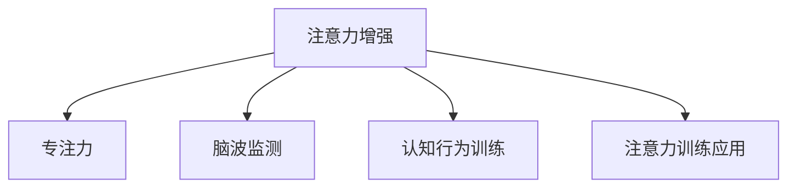

                 

# 人类注意力增强：提升专注力和注意力在商业中的未来发展机遇分析机遇挑战预测

> 关键词：人类注意力增强, 专注力提升, 商业机遇, 挑战预测

## 1. 背景介绍

在当今信息爆炸的时代，如何提高个人和组织的注意力水平，已成为企业和个人在商业竞争中不可或缺的关键能力。注意力增强技术不仅能提升工作效率，还能增强学习和决策能力，从而在多个商业领域创造巨大价值。本文将全面探讨注意力增强技术在商业中的未来发展机遇，机遇，挑战，以及潜在的技术趋势。

### 1.1 问题由来
随着信息技术的飞速发展，人类的注意力不断分散，学习、工作和决策效率低下，这成为了现代社会的普遍现象。近年来，越来越多的技术开始涌现，旨在帮助人们提高注意力和专注力，从而提升工作效率和生活质量。这些技术包括认知行为训练、脑波监测、注意力训练应用等，其主要目的是通过科学的方法改善和提升人类的注意力水平。这些技术在商业中的应用前景广阔，不仅可以提升企业的生产力和竞争力，还能帮助个体提升个人发展潜力。

### 1.2 问题核心关键点
本文将围绕以下几个核心问题进行深入探讨：
1. 注意力增强技术在商业中的具体应用场景和价值。
2. 这些技术面临的主要机遇和挑战。
3. 未来发展趋势及潜在的技术突破。

## 2. 核心概念与联系

### 2.1 核心概念概述

本节将介绍几个核心概念，这些概念在理解注意力增强技术的原理和应用中起着至关重要的作用：

- **注意力增强**：通过各种技术手段，帮助个体和组织提升注意力水平，提高工作效率和学习效果。
- **专注力**：指在特定任务上保持专注的能力，是注意力增强技术的核心目标。
- **脑波监测**：通过监测大脑电位变化，评估注意力水平和专注状态。
- **认知行为训练**：通过科学方法训练大脑和认知功能，改善注意力和决策能力。
- **注意力训练应用**：包括游戏、应用等形式，以游戏化的方式提升专注力和注意力。

这些概念之间的逻辑关系可以通过以下Mermaid流程图来展示：



这个流程图展示了注意力增强技术的目标和相关技术手段之间的逻辑关系：

1. 注意力增强技术旨在提升专注力。
2. 脑波监测、认知行为训练、注意力训练应用等技术，是实现注意力增强目标的具体手段。

## 3. 核心算法原理 & 具体操作步骤
### 3.1 算法原理概述

注意力增强技术的核心在于科学地提升个体和组织的专注力水平。其基本原理是，通过监测、训练和调整个体的注意力系统，使其能够在特定任务上保持高效的专注力。

具体的算法原理和操作步骤包括：

1. **脑波监测**：使用脑电图(EEG)、功能性磁共振成像(fMRI)等技术，监测大脑的电位变化和血流情况，评估当前的注意力状态。
2. **认知行为训练**：通过科学方法训练大脑和认知功能，改善注意力和决策能力。
3. **注意力训练应用**：通过游戏、应用等形式，以游戏化的方式提升专注力和注意力。
4. **数据分析与反馈**：结合实时监测和训练数据，提供个性化反馈和优化建议，指导用户持续改进注意力水平。

### 3.2 算法步骤详解

基于上述原理，注意力增强技术的操作流程通常包括以下几个关键步骤：

**Step 1: 数据采集与处理**
- 使用脑波监测、认知行为训练应用等工具，收集用户的注意力数据和行为数据。
- 对收集到的数据进行清洗和预处理，去除噪音和异常值，确保数据质量。

**Step 2: 注意力评估**
- 通过脑波监测和数据分析，评估用户的注意力水平和专注状态。
- 结合认知行为训练的数据，综合评估用户的注意力系统。

**Step 3: 注意力训练**
- 根据评估结果，设计个性化的注意力训练方案。
- 使用认知行为训练方法和注意力训练应用，逐步提升用户的注意力水平。

**Step 4: 实时反馈与调整**
- 在注意力训练过程中，实时监测用户的注意力数据。
- 根据实时反馈数据，调整训练方案，确保训练效果。

**Step 5: 综合应用与优化**
- 将注意力增强技术应用于具体的商业场景中，如企业生产、学习辅导、个人发展等。
- 结合实际应用反馈，不断优化注意力训练方案，提升效果。

### 3.3 算法优缺点

注意力增强技术的优势包括：
1. **提升工作效率**：通过科学的方法提升专注力，显著提高工作效率和学习效果。
2. **个性化训练**：根据个体差异，设计个性化的注意力训练方案，确保训练效果。
3. **多场景适用**：可以应用于企业生产、学习辅导、个人发展等多个场景。

同时，这些技术也存在一些局限性：
1. **技术门槛较高**：脑波监测、认知行为训练等技术需要专业设备和技术支持。
2. **数据隐私问题**：大量个人数据采集和存储可能引发数据隐私和安全问题。
3. **个体差异显著**：不同个体对注意力训练的响应和效果存在显著差异，难以标准化。
4. **长期效果不明**：注意力增强技术的长期效果和可持续性尚未明确，需进一步研究。

### 3.4 算法应用领域

注意力增强技术已经在多个领域得到广泛应用，以下是其中几个主要应用领域：

1. **企业生产与管理**
   - 在制造业、服务业等领域，通过提升员工专注力，减少错误率和提升效率。
   - 在研发团队中，通过注意力增强技术，促进团队协作和创新。

2. **教育培训**
   - 在教育机构中，通过注意力增强技术，提升学生的专注力和学习效果。
   - 在线教育平台，利用注意力增强技术，提高学习动力和效果。

3. **个人发展**
   - 在个体用户中，通过注意力增强技术，提高工作效率和生活质量。
   - 在心理辅导和心理咨询中，利用注意力训练应用，帮助用户改善心理健康。

4. **健康与医疗**
   - 在精神健康领域，通过脑波监测和认知行为训练，帮助患者改善注意力和情绪状态。
   - 在老年人健康领域，通过注意力训练，延缓认知衰退。

## 4. 数学模型和公式 & 详细讲解 & 举例说明

### 4.1 数学模型构建

注意力增强技术的数学模型构建主要包括以下几个部分：

1. **注意力评估模型**：通过脑波数据和认知行为训练数据，构建注意力水平评估模型。
2. **注意力训练模型**：结合注意力评估结果，设计个性化的注意力训练方案，并通过反馈调整训练过程。

### 4.2 公式推导过程

以下是一个简单的注意力评估模型的公式推导过程：

设用户在某任务上的注意力水平为 $A$，脑波监测数据为 $E$，认知行为训练数据为 $C$，则注意力评估模型可以表示为：

$$
A = f(E, C)
$$

其中 $f$ 为非线性映射函数，用于将脑波数据和认知行为训练数据映射为注意力水平。具体的映射函数可以根据实际应用场景和数据特点进行设计和优化。

### 4.3 案例分析与讲解

以一个简单的注意力训练应用为例，分析注意力增强技术的具体实现和效果：

假设有一个注意力训练应用，通过游戏化的方式提升用户的专注力。该应用记录用户在游戏中的表现数据 $P$，如得分、时间、任务完成度等，通过数学模型将其映射为用户的注意力水平 $A$：

$$
A = g(P)
$$

其中 $g$ 为线性映射函数，例如：

$$
A = 0.5P + 10
$$

在得到用户的注意力水平后，应用可以提供个性化的训练建议，如调整游戏难度、增加任务复杂度等，以进一步提升用户的专注力。

## 5. 项目实践：代码实例和详细解释说明
### 5.1 开发环境搭建

在进行注意力增强技术的项目实践前，需要准备好开发环境。以下是使用Python进行开发的常见环境配置流程：

1. 安装Anaconda：从官网下载并安装Anaconda，用于创建独立的Python环境。

2. 创建并激活虚拟环境：
```bash
conda create -n attention-environment python=3.8 
conda activate attention-environment
```

3. 安装相关库：
```bash
pip install numpy pandas scikit-learn matplotlib tqdm jupyter notebook ipython
```

4. 安装注意力增强技术相关的库，如EEGpy、Brain Connectivity Toolbox等。

### 5.2 源代码详细实现

下面是一个简单的注意力训练应用的Python代码实现，用于训练用户专注力：

```python
import numpy as np
import matplotlib.pyplot as plt

class AttentionTrainer:
    def __init__(self, P):
        self.P = P
        self.A = np.zeros(len(P))
        
    def train(self, A_threshold=10):
        for i in range(len(self.P)):
            self.A[i] = self.P[i] * 0.5 + 10
            if self.A[i] > A_threshold:
                print(f"Attention level reached: {self.A[i]}")
                break

    def visualize(self):
        plt.plot(self.P, self.A, marker='o')
        plt.xlabel('Performance')
        plt.ylabel('Attention')
        plt.title('Attention Level Over Performance')
        plt.show()

trainer = AttentionTrainer(np.array([5, 8, 10, 12, 15, 18]))
trainer.train()
trainer.visualize()
```

### 5.3 代码解读与分析

以上代码实现了一个简单的注意力训练应用，包含以下几个关键步骤：

1. 定义了一个 `AttentionTrainer` 类，用于记录用户表现数据 `P` 和注意力水平 `A`。
2. 通过公式 `A = 0.5P + 10` 计算用户的注意力水平。
3. 在注意力水平达到某个阈值时，打印输出注意力水平并停止训练。
4. 使用 matplotlib 库绘制注意力水平与表现数据的折线图，展示训练效果。

可以看到，通过简单的数学模型和 Python 代码，可以高效地实现注意力训练应用，实现个性化的注意力提升。

## 6. 实际应用场景
### 6.1 企业生产与管理

在企业生产与管理中，注意力增强技术可以显著提高员工的工作效率和生产质量。例如，通过监测员工在生产线上的注意力水平，实时调整工作任务难度和节奏，避免疲劳和注意力分散，从而提高生产效率和产品合格率。

### 6.2 教育培训

在教育培训领域，注意力增强技术可以帮助学生更好地集中注意力，提高学习效果。通过监测学生在课堂上的注意力水平，及时调整教学内容和难度，确保学生始终保持高效的学习状态。

### 6.3 个人发展

在个人发展中，注意力增强技术可以提升个体的生产力和生活效率。例如，通过脑波监测和注意力训练应用，帮助用户在工作和学习中保持专注，提高工作效率和生活质量。

### 6.4 健康与医疗

在健康与医疗领域，注意力增强技术可以帮助患者改善注意力和情绪状态，延缓认知衰退。例如，通过脑波监测和认知行为训练，帮助患者提升注意力水平，改善心理状态，辅助治疗精神疾病。

## 7. 工具和资源推荐
### 7.1 学习资源推荐

为了帮助开发者系统掌握注意力增强技术的理论基础和实践技巧，这里推荐一些优质的学习资源：

1. 《注意力增强技术》系列博文：由注意力增强技术专家撰写，深入浅出地介绍了注意力增强技术的原理、算法和应用。

2. 《脑波监测与认知行为训练》课程：斯坦福大学开设的课程，介绍了脑波监测技术和认知行为训练的基本原理和应用方法。

3. 《注意力训练应用设计》书籍：详细介绍了如何设计高效、易用的注意力训练应用，帮助开发者提升训练效果。

4. 《注意力增强技术》官方文档：提供了丰富的代码样例和数据集，是上手实践的重要参考。

5. NEAT（Neural Engineering and Arithmetic Toolkit）：开源的EEG数据处理和分析工具，提供了丰富的算法和数据集，方便开发者进行实验。

### 7.2 开发工具推荐

高效的开发离不开优秀的工具支持。以下是几款用于注意力增强技术开发的常用工具：

1. EEGpy：用于EEG数据处理和分析的Python库，支持多平台和多种数据格式。
2. Brain Connectivity Toolbox：用于脑网络分析和连接的Python库，提供丰富的算法和工具。
3. OpenMindSpace：开源的脑波监测和认知行为训练应用框架，提供了易用的接口和丰富的功能。
4. Jupyter Notebook：交互式的开发环境，方便开发者进行数据处理和算法开发。
5. TensorBoard：可视化工具，可以实时监测模型的训练过程和效果。

合理利用这些工具，可以显著提升注意力增强技术的开发效率，加快创新迭代的步伐。

### 7.3 相关论文推荐

注意力增强技术的发展源于学界的持续研究。以下是几篇奠基性的相关论文，推荐阅读：

1. Attention is All You Need：提出了Transformer结构，开启了注意力增强技术的预训练范式。
2. Brain-Computer Interfaces: A Review of Recent Advances in Technologies, Architectures, and Applications：综述了脑波监测技术的最新进展和应用。
3. Enhancing Human Cognitive Performance by Neurofeedback: A Systematic Review of Methods and Applications：综述了认知行为训练技术的应用和效果。
4. A Review of Attention Training Software Tools: Effectiveness, Usability, and Design Principles：综述了注意力训练应用的效果、用户体验和设计原则。

这些论文代表了大语言模型微调技术的发展脉络。通过学习这些前沿成果，可以帮助研究者把握学科前进方向，激发更多的创新灵感。

## 8. 总结：未来发展趋势与挑战
### 8.1 总结

本文对注意力增强技术在商业中的未来发展机遇进行了全面系统的介绍。首先阐述了注意力增强技术的理论基础和实际应用，明确了其在提升个人和组织专注力方面的巨大潜力。其次，从原理到实践，详细讲解了注意力增强技术的数学模型和操作步骤，给出了注意力增强技术的具体代码实现。同时，本文还广泛探讨了注意力增强技术在企业生产、教育培训、个人发展、健康医疗等多个领域的应用前景，展示了其广阔的应用空间。

通过本文的系统梳理，可以看到，注意力增强技术在提升个人和组织的专注力、提升工作效率和学习效果方面具有巨大的商业价值，是未来商业竞争中的重要工具。未来的研究需要在多个方面进行持续探索和优化，方能更好地实现其潜力。

### 8.2 未来发展趋势

展望未来，注意力增强技术将呈现以下几个发展趋势：

1. **技术融合**：与脑波监测、认知行为训练等技术的深度融合，将进一步提升注意力增强的效果和用户体验。
2. **数据驱动**：利用大数据和人工智能技术，优化注意力训练方案，提高训练效果。
3. **多模态融合**：结合脑波、生理指标、行为数据等多模态数据，综合评估和训练注意力水平。
4. **个性化定制**：根据个体差异，设计个性化注意力训练方案，提升训练效果。
5. **实时监测与反馈**：实时监测用户注意力状态，及时提供反馈和优化建议，提高注意力训练的实效性。

以上趋势凸显了注意力增强技术的广阔前景，这些方向的探索发展，必将进一步提升注意力增强技术的训练效果和应用范围，为商业竞争带来新的优势。

### 8.3 面临的挑战

尽管注意力增强技术已经取得了显著进展，但在迈向更加智能化、普适化应用的过程中，仍面临诸多挑战：

1. **技术复杂性**：注意力增强技术涉及脑波监测、认知行为训练等多个领域，技术复杂性较高，需要多学科协同合作。
2. **数据隐私问题**：大量个人数据采集和存储可能引发数据隐私和安全问题，需要严格的数据保护措施。
3. **个体差异显著**：不同个体对注意力训练的响应和效果存在显著差异，难以标准化。
4. **长期效果不明**：注意力增强技术的长期效果和可持续性尚未明确，需进一步研究。

### 8.4 研究展望

面对注意力增强技术面临的这些挑战，未来的研究需要在以下几个方面寻求新的突破：

1. **技术标准化**：开发标准化的注意力训练方法，提高技术的普适性和可操作性。
2. **数据隐私保护**：开发数据隐私保护技术，确保数据安全和个人隐私。
3. **个性化训练算法**：开发更加智能的个性化训练算法，提高训练效果和用户体验。
4. **长期效果评估**：开展长期效果评估和跟踪研究，明确注意力增强技术的可持续性和实际效果。

这些研究方向的探索，必将引领注意力增强技术迈向更高的台阶，为商业竞争带来新的优势。相信随着学界和产业界的共同努力，这些挑战终将一一被克服，注意力增强技术必将在商业竞争中发挥更加重要的作用。

## 9. 附录：常见问题与解答

**Q1: 注意力增强技术对个体和企业有什么具体益处？**

A: 注意力增强技术对个体和企业有以下具体益处：
1. **提升工作效率**：通过提高专注力，减少错误率，提高工作效率。
2. **改善学习效果**：帮助个体更好地集中注意力，提升学习效果。
3. **增强创新能力**：提升创意产出，帮助企业在竞争中脱颖而出。
4. **提升决策能力**：通过改善注意力状态，提高决策的准确性和效率。
5. **改善心理状态**：帮助个体缓解压力，改善心理健康。

**Q2: 注意力增强技术的主要挑战有哪些？**

A: 注意力增强技术面临的主要挑战包括：
1. **技术复杂性**：涉及多个学科和技术领域，开发和应用较为复杂。
2. **数据隐私问题**：大量数据采集和存储可能引发数据隐私和安全问题。
3. **个体差异显著**：不同个体对注意力训练的响应和效果存在显著差异，难以标准化。
4. **长期效果不明**：注意力增强技术的长期效果和可持续性尚未明确，需进一步研究。

**Q3: 注意力增强技术如何应用在企业生产中？**

A: 注意力增强技术可以在企业生产中通过以下方式应用：
1. **实时监测**：通过脑波监测和注意力评估，实时监测员工在生产线上的注意力水平。
2. **动态调整任务难度**：根据注意力水平，动态调整生产任务难度和节奏，避免疲劳和注意力分散。
3. **提升生产效率**：通过提高员工专注力，减少错误率，提升生产效率和产品质量。
4. **改善工作环境**：通过优化工作环境，提高员工的舒适度和满意度，进一步提升注意力水平。

**Q4: 注意力增强技术在教育培训中的应用有哪些？**

A: 注意力增强技术在教育培训中的应用包括：
1. **提升学习效果**：通过监测学生的注意力水平，及时调整教学内容和难度，确保学生始终保持高效的学习状态。
2. **个性化教学**：根据学生注意力水平，设计个性化的学习方案，提高学习效果。
3. **增强学习动力**：通过注意力增强应用，提升学生的学习兴趣和动力。
4. **改善学习体验**：结合游戏化和互动化的教学方法，提高学生的学习体验和参与度。

**Q5: 注意力增强技术在健康与医疗中的应用有哪些？**

A: 注意力增强技术在健康与医疗中的应用包括：
1. **改善认知功能**：通过脑波监测和认知行为训练，帮助患者改善认知功能和注意力状态。
2. **延缓认知衰退**：通过持续训练，延缓老年人的认知衰退，提高生活质量。
3. **辅助精神疾病治疗**：通过认知行为训练和脑波监测，辅助精神疾病的治疗和康复。
4. **改善心理健康**：通过注意力训练应用，帮助个体缓解压力，改善心理健康。

总之，注意力增强技术在多个领域都有广泛的应用前景，未来将在商业竞争中发挥更加重要的作用。相信随着技术的发展和应用推广，其潜力将进一步得到释放。

---

作者：禅与计算机程序设计艺术 / Zen and the Art of Computer Programming

