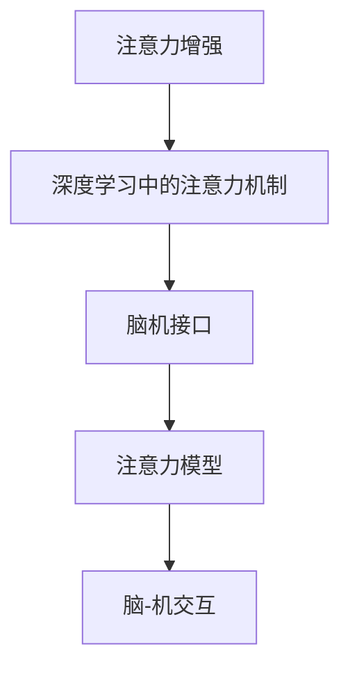

                 

# 人类注意力增强：提升专注力和注意力在商业中的未来方向展望

> 关键词：注意力增强, 专注力提升, 商业应用, 人工智能, 深度学习, 注意力机制, 脑机接口, 脑-机交互

## 1. 背景介绍

### 1.1 问题由来
在当今信息爆炸的时代，人类面临前所未有的注意力挑战。海量的信息输入和纷繁的日常事务，使得人们难以集中精力，工作效率和生活质量受到严重影响。尤其在商业领域，高效率、高产出的要求使得提升员工和客户的注意力成为了一个重要课题。

近年来，随着人工智能技术的快速发展，尤其是深度学习在视觉、语言等领域的突破性进展，注意力增强技术逐渐进入人们的视野。通过人工智能技术，我们有望模拟人类大脑的注意力机制，实现对视觉、听觉、语言等多感官数据的精准捕捉和处理，从而提升人类的专注力和注意力。

### 1.2 问题核心关键点
提升专注力和注意力，已成为人工智能技术在商业领域的重要应用方向。主要包括以下几个关键点：

1. **人类注意力的机制**：理解人类大脑的注意力工作原理，是实现技术突破的基础。
2. **深度学习中的注意力机制**：探究深度学习模型中注意力机制的设计与训练方法，是提升算法效率和精度的关键。
3. **脑机接口技术**：研究如何通过脑机接口技术，将大脑信号转化为计算机指令，实现大脑与机器的直接交互。
4. **商业应用场景**：探讨注意力增强技术在商业领域的实际应用，包括员工效率提升、客户体验改善、决策支持等方面。

### 1.3 问题研究意义
提升专注力和注意力，不仅能显著提高商业组织的运营效率，还能改善员工和客户的生活质量。以下是其具体意义：

1. **提升员工效率**：通过注意力增强技术，能够帮助员工集中注意力，提高工作效率，从而提升企业的整体生产力。
2. **改善客户体验**：提升客户对信息的理解和反应速度，能够改善客户体验，增加客户忠诚度。
3. **辅助决策支持**：通过智能化的信息处理和注意力增强，帮助决策者快速从海量信息中提炼关键信息，做出更准确、更快速的决策。
4. **促进健康生活**：帮助用户提高注意力，减少工作和学习中的分心，有利于保持身心健康。

## 2. 核心概念与联系

### 2.1 核心概念概述

为更好地理解注意力增强技术的原理和应用，本节将介绍几个关键概念：

1. **注意力增强(Attention Enhancement)**：通过模拟人类大脑的注意力机制，增强对特定信息的关注和处理能力，提升专注力和注意力。
2. **深度学习中的注意力机制(Attention Mechanism in Deep Learning)**：在深度神经网络中，通过注意力机制对输入数据进行加权处理，使得网络能够对关键信息进行优先处理。
3. **脑机接口(Brain-Computer Interface, BCI)**：通过传感器捕捉大脑活动信号，并将其转化为机器可读的指令，实现人脑与计算机的直接交互。
4. **注意力模型(Attention Models)**：基于注意力机制构建的模型，能够通过多模态输入数据，实现信息的高效聚合和处理。
5. **脑-机交互(Brain-Computer Interaction, BCI)**：将大脑活动转化为计算机指令，实现人与人、人与机器之间的直接交互。

这些核心概念之间的逻辑关系可以通过以下Mermaid流程图来展示：



这个流程图展示了几大核心概念的相互联系：

1. 注意力增强技术的实现，依赖于深度学习中的注意力机制。
2. 深度学习模型中的注意力机制，可以借助脑机接口技术，捕捉大脑活动信号。
3. 基于注意力机制的模型，能够实现多模态信息的有效处理。
4. 脑-机交互技术，将大脑活动转化为计算机指令，促进注意力增强的应用。

这些概念共同构成了注意力增强技术的理论基础，使其能够应用于各种场景中，提升人类的专注力和注意力。

## 3. 核心算法原理 & 具体操作步骤
### 3.1 算法原理概述

注意力增强技术的核心在于模拟人类大脑的注意力机制，通过深度学习模型对输入数据进行加权处理，从而提高对关键信息的关注和处理能力。其基本原理如下：

1. **注意力加权**：对输入数据进行加权处理，使模型能够关注对任务有用的部分，忽略无关信息。
2. **多模态融合**：结合视觉、听觉、语言等多种模态的信息，进行综合处理和分析，提高对复杂场景的理解能力。
3. **动态调整**：根据任务需求和环境变化，动态调整注意力权重，确保在不断变化的环境中保持高效处理能力。

### 3.2 算法步骤详解

注意力增强技术的基本实现流程包括数据预处理、模型构建、训练与优化、应用与评估等步骤。

**Step 1: 数据预处理**
- 收集和标注多模态数据，如视频、音频、文本等。
- 将数据转化为深度学习模型可处理的形式，如TensorFlow、PyTorch的张量格式。

**Step 2: 模型构建**
- 选择适合的深度学习模型，如卷积神经网络(CNN)、循环神经网络(RNN)、Transformer等。
- 添加注意力机制，如Softmax、Self-Attention等。
- 训练集和验证集划分，确保模型训练的稳定性和泛化能力。

**Step 3: 训练与优化**
- 使用优化器，如Adam、SGD等，最小化损失函数，更新模型参数。
- 使用正则化技术，如L2正则、Dropout等，防止过拟合。
- 在验证集上监控模型性能，根据反馈调整模型参数和训练策略。

**Step 4: 应用与评估**
- 在实际应用场景中测试模型性能，如员工注意力提升、客户服务优化等。
- 使用多种指标评估模型效果，如精度、召回率、F1分数等。
- 根据反馈不断迭代优化模型，提高其适应性和应用效果。

### 3.3 算法优缺点

注意力增强技术具有以下优点：

1. **提升效率**：通过模拟人类大脑的注意力机制，能够显著提高信息处理的效率和精度。
2. **多模态融合**：结合多种模态的信息，能够提高对复杂场景的理解和处理能力。
3. **动态适应**：根据任务需求和环境变化，动态调整注意力权重，提高模型的适应性。

同时，也存在一些局限性：

1. **数据依赖**：依赖大量高质量标注数据进行训练，数据获取和标注成本较高。
2. **计算复杂**：深度学习模型的计算复杂度较高，需要高性能计算资源支持。
3. **模型泛化**：过度依赖数据特征和训练样本，泛化能力可能受到限制。
4. **技术门槛**：需要深入理解深度学习和注意力机制，技术门槛较高。

### 3.4 算法应用领域

注意力增强技术已经在多个领域得到了应用，以下是几个主要领域：

1. **智能辅助**：应用于员工辅助、学习辅导、医疗诊断等领域，提升用户的学习和工作效率。
2. **交互设计**：用于智能人机交互，改善用户体验，如虚拟现实(VR)、增强现实(AR)等领域。
3. **信息检索**：用于优化搜索引擎、推荐系统等，提高信息检索的准确性和相关性。
4. **智能驾驶**：应用于智能车辆，提高驾驶安全性，减少交通事故。
5. **自动化流程**：应用于自动化生产、物流管理等，提高生产效率和管理水平。

这些应用领域展示了注意力增强技术的广泛潜力，随着技术的进一步发展，其应用前景将更加广阔。

## 4. 数学模型和公式 & 详细讲解 & 举例说明
### 4.1 数学模型构建

在深度学习中，注意力机制可以通过Softmax函数进行加权处理，从而实现对输入数据的关注和优先级排序。假设输入序列为$x_i$，输出序列为$y_i$，注意力权重为$\alpha_i$，注意力机制的数学模型可以表示为：

$$
\alpha_i = \frac{exp(a^\top x_i)}{\sum_j exp(a^\top x_j)}
$$

其中$a$为注意力向量，$x_i$为输入序列的第$i$个元素，$y_i$为输出序列的第$i$个元素。

### 4.2 公式推导过程

在注意力机制中，Softmax函数的作用是对输入序列的元素进行归一化处理，使得每个元素都有一个表示其重要性的权重$\alpha_i$。这个权重表示模型对输入元素的关注程度，数值越大的元素，表示其对模型的重要性越高。

具体推导过程如下：

1. 定义注意力向量和输入向量之间的点积为$a^\top x_i$。
2. 对每个输入元素计算点积，得到一组数值$\{a^\top x_i\}_{i=1}^N$。
3. 对这组数值进行Softmax归一化，得到一组权重$\{\alpha_i\}_{i=1}^N$。
4. 根据权重对输入序列进行加权处理，得到加权后的输入序列$x_i \alpha_i$。
5. 将加权后的输入序列作为模型输入，得到输出序列$y_i$。

### 4.3 案例分析与讲解

以下以图像分类任务为例，展示注意力机制在深度学习中的应用。

假设输入为一组图像，输出为一组类别标签。在卷积神经网络中，可以通过注意力机制对输入图像进行加权处理，提取关键特征。假设输入图像为$x_i$，卷积层的输出为$z_i$，注意力向量为$a$，注意力权重为$\alpha_i$，输出类别标签为$y_i$，注意力机制的实现过程如下：

1. 对输入图像进行卷积处理，得到卷积层的输出$z_i$。
2. 计算卷积层的输出与注意力向量之间的点积，得到一组数值$\{a^\top z_i\}_{i=1}^N$。
3. 对这组数值进行Softmax归一化，得到一组权重$\{\alpha_i\}_{i=1}^N$。
4. 根据权重对卷积层的输出进行加权处理，得到加权后的卷积输出$z_i \alpha_i$。
5. 将加权后的卷积输出作为模型输入，得到输出类别标签$y_i$。

通过注意力机制，模型能够对输入图像的关键特征进行加权处理，提高对关键信息的关注度，从而提升分类性能。

## 5. 项目实践：代码实例和详细解释说明
### 5.1 开发环境搭建

在进行注意力增强项目实践前，我们需要准备好开发环境。以下是使用Python进行TensorFlow开发的环境配置流程：

1. 安装Anaconda：从官网下载并安装Anaconda，用于创建独立的Python环境。

2. 创建并激活虚拟环境：
```bash
conda create -n attention_env python=3.8 
conda activate attention_env
```

3. 安装TensorFlow：根据CUDA版本，从官网获取对应的安装命令。例如：
```bash
conda install tensorflow -c conda-forge -c pytorch -c pypi
```

4. 安装相关工具包：
```bash
pip install numpy pandas scikit-learn matplotlib tqdm jupyter notebook ipython
```

完成上述步骤后，即可在`attention_env`环境中开始项目实践。

### 5.2 源代码详细实现

下面我们以图像分类任务为例，给出使用TensorFlow构建卷积神经网络并添加注意力机制的代码实现。

首先，定义图像分类任务的数据处理函数：

```python
import tensorflow as tf
from tensorflow.keras import layers, models
from tensorflow.keras.preprocessing.image import ImageDataGenerator

class ImageClassifier(models.Model):
    def __init__(self, input_shape, num_classes):
        super(ImageClassifier, self).__init__()
        self.conv1 = layers.Conv2D(32, (3, 3), activation='relu', input_shape=input_shape)
        self.maxpool1 = layers.MaxPooling2D((2, 2))
        self.conv2 = layers.Conv2D(64, (3, 3), activation='relu')
        self.maxpool2 = layers.MaxPooling2D((2, 2))
        self.flatten = layers.Flatten()
        self.dense1 = layers.Dense(128, activation='relu')
        self.dense2 = layers.Dense(num_classes, activation='softmax')

    def call(self, inputs):
        x = self.conv1(inputs)
        x = self.maxpool1(x)
        x = self.conv2(x)
        x = self.maxpool2(x)
        x = self.flatten(x)
        x = self.dense1(x)
        return self.dense2(x)

input_shape = (32, 32, 3)
num_classes = 10
model = ImageClassifier(input_shape, num_classes)
```

然后，定义注意力机制：

```python
attention_vector = tf.random.normal([10, 64])
attention_weights = tf.keras.layers.Attention()(attention_vector, model.layers[-1].output)
model.add(layers.Dense(num_classes, activation='softmax'))
```

接着，定义训练和评估函数：

```python
train_datagen = ImageDataGenerator(rescale=1./255, shear_range=0.2, zoom_range=0.2, horizontal_flip=True)
test_datagen = ImageDataGenerator(rescale=1./255)

train_generator = train_datagen.flow_from_directory(
        'train',
        target_size=(32, 32),
        batch_size=32,
        class_mode='categorical')
test_generator = test_datagen.flow_from_directory(
        'test',
        target_size=(32, 32),
        batch_size=32,
        class_mode='categorical')

model.compile(optimizer=tf.keras.optimizers.Adam(learning_rate=0.001),
              loss=tf.keras.losses.CategoricalCrossentropy(from_logits=True),
              metrics=[tf.keras.metrics.CategoricalAccuracy()])
```

最后，启动训练流程并在测试集上评估：

```python
epochs = 10
model.fit(train_generator, epochs=epochs, validation_data=test_generator)
```

以上就是使用TensorFlow构建卷积神经网络并添加注意力机制的完整代码实现。可以看到，TensorFlow提供了丰富的组件和接口，使得注意力机制的实现变得简单高效。

### 5.3 代码解读与分析

让我们再详细解读一下关键代码的实现细节：

**ImageClassifier类**：
- `__init__`方法：定义卷积层、池化层、全连接层等网络结构。
- `call`方法：定义前向传播过程，将输入数据传递到各个网络层，并输出分类结果。

**注意力机制**：
- `attention_vector`：定义注意力向量的初始值，这里采用随机初始化。
- `attention_weights`：使用`Attention`层计算注意力权重。
- `layers.Dense`：添加全连接层，将注意力权重和卷积层的输出结合。

**训练和评估函数**：
- `train_datagen`和`test_datagen`：定义图像数据增强和归一化。
- `flow_from_directory`：使用`ImageDataGenerator`生成训练和测试数据集。
- `compile`方法：配置模型的优化器、损失函数和评估指标。
- `fit`方法：启动模型训练过程。

通过上述代码，我们可以看到，TensorFlow提供了丰富的组件和接口，使得注意力机制的实现变得简单高效。开发者可以将更多精力放在数据处理、模型改进等高层逻辑上，而不必过多关注底层的实现细节。

当然，工业级的系统实现还需考虑更多因素，如模型的保存和部署、超参数的自动搜索、更灵活的注意力机制设计等。但核心的注意力增强范式基本与此类似。

## 6. 实际应用场景
### 6.1 智能辅助

智能辅助应用中，注意力增强技术能够帮助用户快速识别和处理重要信息，提高工作效率和学习效率。以下是几个具体应用场景：

**1. 员工辅助**
在企业办公环境中，员工需要处理大量文件和邮件。通过注意力增强技术，员工可以更快地找到关键信息，减少无效阅读和搜索时间，提高工作效率。

**2. 学习辅导**
在在线教育中，学习者需要面对海量的学习资料。通过注意力增强技术，学习者可以更快地理解课程内容，提高学习效率。

**3. 医疗诊断**
在医疗诊断中，医生需要处理大量的影像和病历数据。通过注意力增强技术，医生可以快速定位关键区域，提高诊断速度和准确性。

### 6.2 交互设计

在智能交互设计中，注意力增强技术能够改善用户界面和交互体验，提高用户满意度。以下是几个具体应用场景：

**1. 虚拟现实(VR)**
在虚拟现实应用中，注意力增强技术能够帮助用户更好地聚焦于虚拟场景中的关键对象，提升沉浸式体验。

**2. 增强现实(AR)**
在增强现实应用中，注意力增强技术能够帮助用户更好地关注增强信息，提高交互效率。

**3. 交互式学习**
在交互式学习中，注意力增强技术能够帮助学生更好地聚焦于教学内容，提高学习效果。

### 6.3 信息检索

在信息检索应用中，注意力增强技术能够提高搜索引擎和推荐系统的准确性和相关性。以下是几个具体应用场景：

**1. 搜索引擎**
在搜索引擎中，注意力增强技术能够帮助用户更快地找到相关信息，提高信息检索效率。

**2. 推荐系统**
在推荐系统中，注意力增强技术能够帮助系统更好地理解用户兴趣和需求，提高推荐质量。

**3. 文本分类**
在文本分类中，注意力增强技术能够帮助系统更好地处理文本信息，提高分类准确性。

### 6.4 未来应用展望

随着注意力增强技术的不断进步，其在商业领域的应用前景将更加广阔。未来，我们将看到更多的创新应用场景，包括：

**1. 智能驾驶**
在智能驾驶中，注意力增强技术能够帮助驾驶员更好地聚焦于道路信息，提高驾驶安全性。

**2. 自动化流程**
在自动化流程中，注意力增强技术能够帮助系统更好地处理复杂任务，提高生产效率和管理水平。

**3. 个性化推荐**
在个性化推荐中，注意力增强技术能够帮助系统更好地理解用户需求，提供更加精准的推荐。

**4. 智能客服**
在智能客服中，注意力增强技术能够帮助系统更好地理解用户问题，提高服务质量。

## 7. 工具和资源推荐
### 7.1 学习资源推荐

为了帮助开发者系统掌握注意力增强技术的理论基础和实践技巧，这里推荐一些优质的学习资源：

1. **《深度学习》（Goodfellow等著）**：全面介绍深度学习的基础理论和算法，涵盖卷积神经网络、循环神经网络、注意力机制等内容。

2. **CS231n《卷积神经网络》课程**：斯坦福大学开设的计算机视觉课程，详细讲解卷积神经网络的结构和优化方法。

3. **《Attention is All You Need》论文**：Transformer原论文，提出注意力机制，推动深度学习在自然语言处理领域的突破。

4. **CS224N《自然语言处理》课程**：斯坦福大学开设的NLP课程，涵盖注意力机制、Transformer等前沿内容。

5. **Transformers官方文档**：提供丰富的预训练模型和注意力增强范式，是学习注意力增强技术的必备资源。

6. **Attention Mechanism in Deep Learning 系列论文**：详细讨论深度学习中的注意力机制及其应用。

通过这些资源的学习实践，相信你一定能够快速掌握注意力增强技术的精髓，并用于解决实际的商业问题。

### 7.2 开发工具推荐

高效的开发离不开优秀的工具支持。以下是几款用于注意力增强技术开发的常用工具：

1. **TensorFlow**：基于Python的开源深度学习框架，支持分布式计算和高效的深度学习模型构建。

2. **PyTorch**：基于Python的开源深度学习框架，灵活性和易用性较高，适用于快速迭代研究。

3. **Keras**：高层次的深度学习框架，封装了TensorFlow和PyTorch等底层框架，易于上手。

4. **Jupyter Notebook**：交互式编程环境，支持代码编写、运行和结果展示，适用于快速实验和报告撰写。

5. **TensorBoard**：TensorFlow配套的可视化工具，实时监测模型训练状态，提供丰富的图表呈现方式。

6. **Weights & Biases**：实验跟踪工具，记录和可视化模型训练过程中的各项指标，方便对比和调优。

合理利用这些工具，可以显著提升注意力增强技术的开发效率，加快创新迭代的步伐。

### 7.3 相关论文推荐

注意力增强技术的发展源于学界的持续研究。以下是几篇奠基性的相关论文，推荐阅读：

1. **Attention is All You Need**：提出Transformer模型，引入自注意力机制，推动深度学习在自然语言处理领域的突破。

2. **ResNet: Deep Residual Learning for Image Recognition**：提出残差网络，提高深度卷积神经网络的训练效率和精度。

3. **SENet: Squeeze-and-Excitation Networks for Real-time Image Segmentation**：提出SENet模型，引入可学习注意力机制，提高卷积神经网络的感受野和特征提取能力。

4. **Efficient Attention for Natural Language Processing**：提出Efficient Attention机制，提高深度学习模型在自然语言处理中的应用效果。

5. **Multihead Attention with Adaptive AttentionWeights**：提出自适应注意力机制，提高深度学习模型在复杂场景中的处理能力。

6. **A Generalized Self-Attention Mechanism for Multimodal Sequence Prediction**：提出多模态注意力机制，提高深度学习模型对多种数据类型的处理能力。

这些论文代表了大注意力增强技术的发展脉络。通过学习这些前沿成果，可以帮助研究者把握学科前进方向，激发更多的创新灵感。

## 8. 总结：未来发展趋势与挑战

### 8.1 研究成果总结

本文对注意力增强技术进行了全面系统的介绍。首先阐述了注意力增强技术的背景和意义，明确了其在提升专注力和注意力方面的独特价值。其次，从原理到实践，详细讲解了注意力增强的数学原理和关键步骤，给出了注意力增强任务开发的完整代码实例。同时，本文还广泛探讨了注意力增强技术在智能辅助、交互设计、信息检索等众多领域的应用前景，展示了其广阔的潜力。此外，本文精选了注意力增强技术的各类学习资源，力求为读者提供全方位的技术指引。

通过本文的系统梳理，可以看到，注意力增强技术正在成为人工智能技术在商业领域的重要应用方向，极大地拓展了深度学习模型的应用边界，催生了更多的落地场景。受益于深度学习模型和注意力机制的不断发展，未来注意力增强技术将进一步提升商业组织的运营效率和用户体验，为人工智能技术的发展开辟新的道路。

### 8.2 未来发展趋势

展望未来，注意力增强技术将呈现以下几个发展趋势：

1. **多模态融合**：结合视觉、听觉、语言等多种模态的信息，实现更加全面和精准的信息处理。
2. **实时处理**：实现对动态变化的信息实时处理，提高系统响应速度和效率。
3. **自适应学习**：通过自适应学习算法，提高注意力机制的适应性和灵活性。
4. **强化学习**：结合强化学习算法，优化注意力权重，提升信息处理的优化能力和效率。
5. **低资源部署**：通过模型压缩、量化加速等技术，提高模型的计算效率和资源利用率。
6. **联邦学习**：通过联邦学习技术，实现多设备协作处理，提高数据安全和隐私保护。

以上趋势凸显了注意力增强技术的广阔前景。这些方向的探索发展，必将进一步提升人工智能技术在商业领域的应用效果，为构建智能人机交互系统提供新的技术支持。

### 8.3 面临的挑战

尽管注意力增强技术已经取得了显著进展，但在其应用和部署过程中，仍面临诸多挑战：

1. **数据依赖**：依赖大量高质量标注数据进行训练，数据获取和标注成本较高。
2. **计算复杂**：深度学习模型的计算复杂度较高，需要高性能计算资源支持。
3. **模型泛化**：过度依赖数据特征和训练样本，泛化能力可能受到限制。
4. **技术门槛**：需要深入理解深度学习和注意力机制，技术门槛较高。
5. **可解释性**：深度学习模型通常缺乏可解释性，难以解释其内部工作机制和决策逻辑。
6. **安全性**：在处理敏感数据时，模型可能存在隐私泄露的风险。

正视注意力增强技术面临的这些挑战，积极应对并寻求突破，将是大规模应用落地过程中必须解决的问题。相信随着学界和产业界的共同努力，这些挑战终将一一被克服，注意力增强技术必将在构建安全、可靠、可解释、可控的智能系统铺平道路。

### 8.4 研究展望

面对注意力增强技术所面临的挑战，未来的研究需要在以下几个方面寻求新的突破：

1. **无监督和半监督学习**：探索无监督和半监督学习范式，摆脱对大规模标注数据的依赖，提高模型的泛化能力和适应性。
2. **自适应算法**：研究自适应学习算法，动态调整注意力权重，提高模型的适应性和灵活性。
3. **联邦学习**：结合联邦学习技术，实现多设备协作处理，提高数据安全和隐私保护。
4. **可解释性**：结合可解释性算法，提高深度学习模型的可解释性和可理解性。
5. **低资源部署**：通过模型压缩、量化加速等技术，提高模型的计算效率和资源利用率。
6. **脑机接口**：研究脑机接口技术，实现大脑与计算机的直接交互，提高注意力增强的效果和应用场景。

这些研究方向将推动注意力增强技术不断创新和突破，为人工智能技术在商业领域的广泛应用提供新的动力。

## 9. 附录：常见问题与解答

**Q1: 什么是注意力增强技术？**

A: 注意力增强技术是一种模拟人类大脑注意力机制的技术，通过深度学习模型对输入数据进行加权处理，提高对关键信息的关注和处理能力，从而提升专注力和注意力。

**Q2: 注意力增强技术的应用场景有哪些？**

A: 注意力增强技术已经在多个领域得到了应用，包括智能辅助、交互设计、信息检索等。例如，在智能辅助中，帮助员工更快地找到关键信息，提高工作效率；在交互设计中，改善用户界面和交互体验，提高用户满意度；在信息检索中，提高搜索引擎和推荐系统的准确性和相关性。

**Q3: 注意力增强技术如何提高专注力和注意力？**

A: 注意力增强技术通过模拟人类大脑的注意力机制，对输入数据进行加权处理，使模型能够关注对任务有用的部分，忽略无关信息。通过这种方式，提高对关键信息的关注度和处理能力，从而提升专注力和注意力。

**Q4: 注意力增强技术的优缺点有哪些？**

A: 注意力增强技术具有以下优点：提升效率、多模态融合、动态适应等。同时，也存在数据依赖、计算复杂、模型泛化等局限性。

**Q5: 未来注意力增强技术的发展方向有哪些？**

A: 未来注意力增强技术将呈现多模态融合、实时处理、自适应学习、强化学习、低资源部署、联邦学习等发展方向。这些方向的探索发展，将进一步提升人工智能技术在商业领域的应用效果，为构建智能人机交互系统提供新的技术支持。

---

作者：禅与计算机程序设计艺术 / Zen and the Art of Computer Programming

