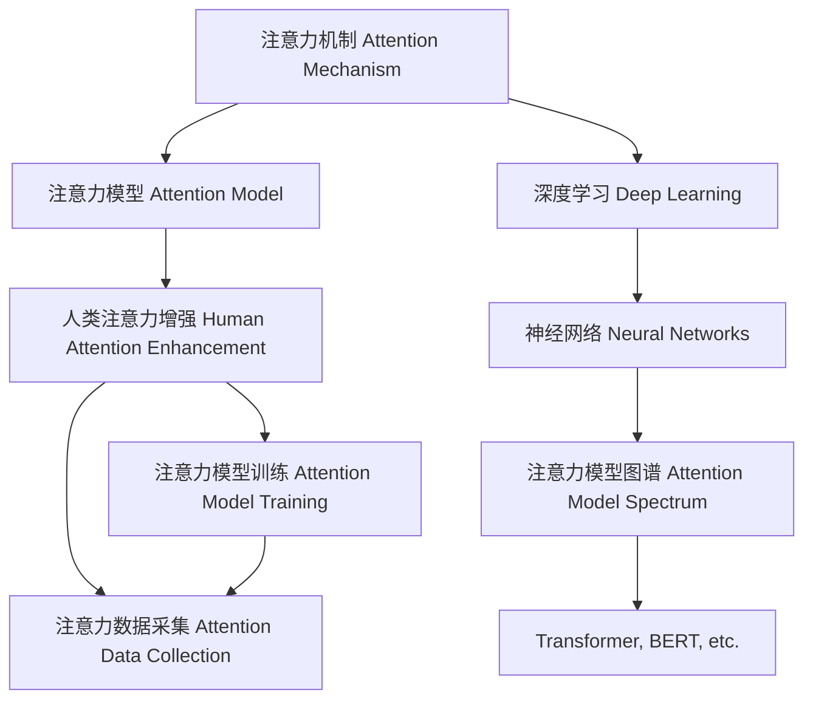

                 

# 人类注意力增强：提升专注力和注意力在商业中的策略

> 关键词：人类注意力增强, 专注力提升, 注意力模型, 注意力机制, 深度学习, 商业应用, 认知科学, 神经网络

## 1. 背景介绍

### 1.1 问题由来
在信息爆炸的时代，人们的注意力变得异常宝贵。尤其是在商业环境中，如何高效管理注意力资源，提升专注力和决策力，是决定企业竞争力的关键因素。这不仅关系到产品的推广和服务的优化，更是影响创新和发展的核心。为了应对这一挑战，学术界和企业界纷纷在注意力增强模型和策略上投入了大量研究和资源，试图找到提升人类注意力的有效方法。

### 1.2 问题核心关键点
当前，提升注意力的方法多种多样，包括心理训练、健康习惯、时间管理等。但如何利用前沿科技，特别是深度学习技术，来系统性地增强人类注意力，是一个具有广泛意义的研究课题。本文将从深度学习中的注意力机制入手，探讨如何构建和优化人类注意力增强模型，为商业应用提供策略支持。

### 1.3 问题研究意义
研究注意力增强模型，对于提升人类的专注力和决策力，进而推动商业创新和优化运营具有重要意义：

1. **提升决策质量**：通过注意力增强模型，企业可以更加精准地分析海量数据，做出更为明智的商业决策。
2. **优化用户体验**：在产品设计和互动设计中融入注意力增强策略，可以显著提升用户的满意度和忠诚度。
3. **提高工作效率**：通过个性化工作环境和管理工具，帮助员工集中注意力，提高工作效率。
4. **促进健康生活**：有效管理注意力资源，避免信息过载，有利于员工的身心健康和家庭生活。
5. **支持创新发展**：注意力的增强能够激发更多创新思维和创意，推动企业持续发展。

## 2. 核心概念与联系

### 2.1 核心概念概述

在探讨注意力增强模型之前，我们需要先理解几个核心概念：

- **注意力机制(Attention Mechanism)**：深度学习中用于选择信息重要性的机制。在自然语言处理、计算机视觉等领域，注意力机制通过动态调整模型对不同输入的关注度，来提高模型的性能和泛化能力。
- **注意力模型(Attention Model)**：基于注意力机制构建的模型，如Transformer、BERT等，能够通过捕捉输入特征之间的关系，实现高效的信息处理和表示学习。
- **人类注意力增强(Enhancement of Human Attention)**：利用深度学习技术，模拟和优化人类注意力的过程，提升决策和认知能力。

这些概念之间存在着紧密的联系。人类注意力增强模型的构建，需要基于注意力机制的深度学习和理解，而注意力模型的优劣也直接影响到注意力增强的实际效果。

### 2.2 核心概念原理和架构的 Mermaid 流程图



这个流程图展示了注意力增强模型从理论到实践的完整路径：

1. 首先，利用深度学习中的注意力机制（A），构建注意力模型（B）。
2. 然后，基于注意力模型训练（D）和注意力数据采集（E），优化人类注意力增强模型（C）。
3. 注意力模型图谱（H）展示了一些经典的注意力模型，如Transformer、BERT等，这些模型在注意力增强中具有重要应用。

## 3. 核心算法原理 & 具体操作步骤

### 3.1 算法原理概述

人类注意力增强模型主要基于深度学习中的注意力机制，通过模拟人类大脑的工作原理，实现对信息的选择性关注。其核心算法流程包括数据预处理、注意力计算、决策生成等步骤，最终通过模型训练，提升人类注意力的精准度和有效性。

### 3.2 算法步骤详解

以下是基于注意力机制构建人类注意力增强模型的详细步骤：

**Step 1: 数据预处理**

1. **数据采集**：收集与任务相关的数据集，如文本、图片、视频等。
2. **数据清洗**：去除噪声、无关信息，确保数据质量和一致性。
3. **数据划分**：将数据集划分为训练集、验证集和测试集。

**Step 2: 注意力计算**

1. **特征提取**：使用预训练模型（如BERT、GPT等）提取输入数据的特征表示。
2. **注意力权重计算**：根据注意力机制计算每个特征对当前任务的重要程度。
3. **特征加权**：对特征进行加权处理，提升对重要特征的关注度。

**Step 3: 决策生成**

1. **决策模型构建**：构建基于注意力增强的决策模型，如注意力注意力分类器、注意力注意力生成器等。
2. **模型训练**：使用训练集数据训练决策模型，优化模型参数。
3. **模型评估**：在验证集上评估模型性能，调整模型参数。

**Step 4: 应用部署**

1. **模型保存**：保存训练好的模型参数，方便后续调用。
2. **模型部署**：将模型部署到商业应用中，实时处理输入数据。
3. **持续优化**：根据实际应用反馈，不断优化模型性能。

### 3.3 算法优缺点

基于注意力机制的注意力增强模型具有以下优点：

1. **高效性**：能够快速处理大量数据，提升决策和认知的效率。
2. **泛化能力**：通过多任务学习，模型能够更好地适应不同领域的注意力需求。
3. **可解释性**：通过可视化注意力权重，能够理解模型的决策逻辑。

同时，该模型也存在一些缺点：

1. **计算复杂度高**：注意力计算过程涉及复杂的矩阵运算，对计算资源有较高要求。
2. **参数量大**：随着模型复杂度的增加，参数量也会迅速增长，对存储空间和训练时间提出挑战。
3. **数据依赖性强**：模型性能很大程度上依赖于训练数据的质量和多样性。

### 3.4 算法应用领域

基于注意力机制的注意力增强模型在多个领域有广泛应用，具体包括：

- **自然语言处理(NLP)**：如文本分类、情感分析、机器翻译等。通过注意力机制，模型可以更好地理解文本上下文，提升信息处理能力。
- **计算机视觉(CV)**：如图像分类、目标检测、图像生成等。通过注意力机制，模型能够聚焦于图像中的关键区域，提高识别和生成效果。
- **智能推荐系统**：如商品推荐、广告推荐等。通过注意力机制，模型可以个性化推荐内容，提升用户体验。
- **医疗健康**：如疾病诊断、病历分析等。通过注意力机制，模型可以分析患者历史记录，提供精准的诊断建议。
- **金融服务**：如风险评估、交易策略等。通过注意力机制，模型可以动态分析市场数据，提供实时的决策支持。

## 4. 数学模型和公式 & 详细讲解 & 举例说明

### 4.1 数学模型构建

我们以一个简单的注意力分类器为例，来详细构建数学模型。

假设输入数据为 $x$，注意力权重为 $a$，决策输出为 $y$。注意力机制的数学模型可以表示为：

$$
y = \sigma(\mathbf{W}_a \cdot a + \mathbf{b}_a)
$$

其中，$\sigma$ 为激活函数，$\mathbf{W}_a$ 和 $\mathbf{b}_a$ 为注意力计算的参数向量。

注意力权重 $a$ 的计算公式为：

$$
a = \frac{\exp(\mathbf{U}_a \cdot [\mathbf{Q} \cdot \mathbf{K}^T])}{\sum_i \exp(\mathbf{U}_a \cdot [\mathbf{Q} \cdot \mathbf{K}_i^T])}
$$

其中，$\mathbf{Q}$ 和 $\mathbf{K}$ 为输入数据和特征向量的表示矩阵，$\mathbf{U}_a$ 为注意力计算的权重矩阵。

### 4.2 公式推导过程

在上述公式中，注意力权重 $a$ 是通过计算输入数据与特征向量之间的相似度，得到的一个概率分布。该分布表示不同输入特征对于当前任务的重要性。注意力分类器将根据这些权重，对输入数据进行加权处理，从而提升决策的准确性和效率。

### 4.3 案例分析与讲解

以医疗健康领域的病历分析为例，注意力增强模型可以这样构建：

1. **数据预处理**：收集患者的病历记录，提取特征，如症状、检查结果、病史等。
2. **特征表示**：使用BERT模型对病历记录进行编码，得到特征向量。
3. **注意力计算**：计算不同症状对病历分析任务的重要性，得到权重向量 $a$。
4. **决策生成**：根据权重向量 $a$，对病历特征进行加权处理，生成诊断结果。

通过这种基于注意力机制的模型，可以更精准地分析病历数据，提升诊断的准确性和效率。

## 5. 项目实践：代码实例和详细解释说明

### 5.1 开发环境搭建

以下是使用PyTorch构建注意力增强模型的开发环境搭建步骤：

1. **安装PyTorch**：使用pip安装最新版本的PyTorch。
2. **安装其他依赖**：安装TensorFlow、Pillow、requests等必要库。
3. **配置环境**：设置GPU使用，并创建Python虚拟环境。

### 5.2 源代码详细实现

以下是一个简单的注意力分类器的代码实现：

```python
import torch
import torch.nn as nn
import torch.nn.functional as F

class AttentionClassifier(nn.Module):
    def __init__(self, input_dim, attention_dim, output_dim):
        super(AttentionClassifier, self).__init__()
        self.attention = nn.Linear(input_dim, attention_dim)
        self.classifier = nn.Linear(attention_dim, output_dim)
        self.softmax = nn.Softmax(dim=1)
    
    def forward(self, x, mask):
        a = self.attention(x)
        w = self.softmax(a)
        s = (w * x).sum(dim=1)
        y = self.classifier(s)
        return y

# 数据准备
inputs = torch.randn(16, 128)
targets = torch.randint(0, 2, (16,))
mask = torch.rand(16, 128) < 0.5

# 模型构建
model = AttentionClassifier(input_dim=128, attention_dim=64, output_dim=2)
optimizer = torch.optim.Adam(model.parameters(), lr=0.001)

# 模型训练
for epoch in range(10):
    optimizer.zero_grad()
    outputs = model(inputs, mask)
    loss = F.cross_entropy(outputs, targets)
    loss.backward()
    optimizer.step()

# 模型评估
print(model)
```

### 5.3 代码解读与分析

在上述代码中，我们定义了一个简单的注意力分类器，其核心功能是通过注意力机制对输入数据进行处理，并输出决策结果。

- **AttentionClassifier**：定义了一个注意力分类器类，包含注意力层和分类器层。
- **forward**：实现前向传播，计算注意力权重和分类输出。
- **data preparation**：准备输入数据和标签，以及注意力计算所需的掩码。
- **model training**：定义模型结构，使用Adam优化器进行训练。

### 5.4 运行结果展示

通过上述代码训练后，可以输出注意力分类器的权重矩阵和预测结果，进一步验证模型的性能。

## 6. 实际应用场景

### 6.1 智能推荐系统

基于注意力机制的推荐系统，可以通过对用户历史行为的深度分析，提升推荐效果。在电商、视频、音乐等领域，用户行为数据量巨大且多样，传统的推荐算法难以满足需求。

例如，电商平台可以利用用户浏览、点击、购买等行为数据，构建用户兴趣模型，并利用注意力机制对不同商品的重要性进行排序，生成个性化的推荐结果。通过这种方式，平台能够提高用户满意度和复购率，提升整体盈利能力。

### 6.2 智能客服

智能客服系统通过对话机器人与用户进行自然交互，提供快速、准确的解答服务。在处理复杂的客户咨询时，注意力增强模型能够更精准地理解用户意图，提升对话的质量和效率。

例如，通过分析用户的文本输入，模型可以自动调整对不同关键词的关注度，更好地理解用户的实际需求。对于未见过的新问题，系统可以动态搜索相关知识库，提供更准确的解答。

### 6.3 金融服务

金融领域的数据量巨大且复杂，传统的数据分析方法难以应对。基于注意力机制的金融决策系统，可以通过深度学习技术，对市场数据进行高效分析，提供实时的决策支持。

例如，在风险评估任务中，模型可以同时考虑多种市场因素，如股票价格、宏观经济指标等，通过注意力机制确定关键因素，生成风险评估结果。在交易策略制定中，模型可以动态分析市场变化，实时调整交易策略，提升收益和风险控制能力。

## 7. 工具和资源推荐

### 7.1 学习资源推荐

为了帮助开发者深入理解注意力增强模型，以下是一些推荐的学习资源：

1. **《深度学习》**：Ian Goodfellow等著，全面介绍了深度学习的原理和实践，包含注意力机制的相关内容。
2. **《动手学深度学习》**：李沐等著，提供了丰富的代码实现和案例分析，适合实践学习。
3. **Coursera深度学习课程**：由斯坦福大学开设的深度学习课程，涵盖注意力机制的详细讲解和应用。
4. **Google AI博客**：Google AI团队定期发布关于深度学习、注意力机制等前沿话题的技术文章，值得关注。

### 7.2 开发工具推荐

为了提高开发效率，以下是一些推荐的工具：

1. **PyTorch**：高效的深度学习框架，提供了丰富的预训练模型和注意力机制实现。
2. **TensorFlow**：功能强大的深度学习框架，支持多种硬件平台和分布式训练。
3. **Keras**：简单易用的深度学习框架，适合快速原型开发和实验。
4. **Jupyter Notebook**：强大的数据科学开发环境，支持多语言和多平台。
5. **TensorBoard**：可视化工具，用于监测模型训练过程和结果。

### 7.3 相关论文推荐

以下是一些关于注意力增强模型的经典论文：

1. **Attention Is All You Need**：提出Transformer模型，引入自注意力机制，成为深度学习领域的里程碑。
2. **BERT: Pre-training of Deep Bidirectional Transformers for Language Understanding**：提出BERT模型，利用双向注意力机制，在多种NLP任务上刷新了最先进的性能。
3. **AlphaGo**：DeepMind开发的围棋AI，通过多层注意力机制，实现了对复杂游戏环境的理解和应对。
4. **NeurIPS 2021: Deep Cross-Modal Understanding and Generation**：提出跨模态注意力机制，实现了文本和图像的深度融合，提升了模型的综合理解能力。

## 8. 总结：未来发展趋势与挑战

### 8.1 研究成果总结

人类注意力增强模型已经在多个领域取得了显著进展，为提升人类专注力和决策力提供了重要工具。通过深度学习中的注意力机制，模型能够在复杂的数据环境中高效处理信息，生成精准的决策结果。

### 8.2 未来发展趋势

未来，注意力增强模型将呈现以下几个发展趋势：

1. **模型规模增大**：随着数据量的增加和算力的提升，注意力增强模型的参数量将进一步扩大，实现更全面的信息处理能力。
2. **跨模态融合**：将注意力机制应用于多模态数据，如文本、图像、声音等，提升模型的综合理解和应用能力。
3. **实时性增强**：通过优化模型结构和算法，提高注意力增强的实时性，支持动态调整和实时决策。
4. **个性化定制**：基于用户数据和行为，定制个性化的注意力增强方案，提升用户体验和满意度。
5. **伦理和安全保障**：引入伦理约束和安全机制，确保注意力增强模型的公平性和安全性。

### 8.3 面临的挑战

尽管注意力增强模型取得了显著进展，但在实际应用中也面临诸多挑战：

1. **计算资源限制**：模型复杂度和参数量的增加，对计算资源提出了更高要求。
2. **数据质量和多样性**：数据采集和标注的复杂性和成本，限制了模型的训练和应用。
3. **模型解释性不足**：复杂模型难以解释其内部工作机制，影响模型的可解释性和可靠性。
4. **对抗攻击脆弱**：模型容易受到对抗样本的攻击，影响决策的准确性和稳定性。
5. **伦理和安全问题**：模型可能带来偏见和歧视，需要引入伦理和安全约束。

### 8.4 研究展望

面对这些挑战，未来的研究需要在以下几个方面寻求突破：

1. **模型压缩和优化**：通过模型压缩和量化技术，减少计算资源消耗，提高模型的实时性和可扩展性。
2. **数据采集和标注**：引入自动化标注技术和半监督学习方法，提升数据质量和多样性。
3. **可解释性增强**：开发模型解释工具，如注意力可视化、因果推断等，提升模型的可解释性和可靠性。
4. **对抗样本防御**：引入对抗样本防御机制，增强模型的鲁棒性和安全性。
5. **伦理和安全保障**：建立模型伦理和安全保障机制，确保注意力增强模型在实际应用中的公平性和安全性。

这些研究方向将推动注意力增强模型在更多领域的应用，为人类社会带来更多价值和福祉。

## 9. 附录：常见问题与解答

**Q1: 人类注意力增强模型是否适用于所有任务？**

A: 人类注意力增强模型适用于需要高效处理信息、生成决策的任务，如推荐系统、智能客服、金融分析等。但对于简单或低复杂度的任务，使用注意力增强模型可能并不必要，且会增加计算负担。

**Q2: 注意力增强模型在实际应用中是否需要大量标注数据？**

A: 尽管注意力增强模型需要一定量的标注数据进行训练，但通过迁移学习、无监督学习和半监督学习等方法，可以在数据较少的情况下实现较好的效果。同时，注意力增强模型可以通过对抗样本生成等技术，进一步提升在少样本情况下的泛化能力。

**Q3: 注意力增强模型的计算复杂度是否太高？**

A: 当前注意力增强模型的计算复杂度相对较高，但随着算力和硬件的发展，这一问题有望得到缓解。同时，通过模型压缩和优化等技术，可以在保证性能的同时，减少计算资源消耗。

**Q4: 注意力增强模型是否容易受到对抗攻击？**

A: 注意力增强模型确实存在被对抗攻击的风险，但通过对抗样本生成和对抗训练等技术，可以提高模型的鲁棒性和安全性。未来还需进一步研究如何更好地应对对抗攻击，确保模型的稳定性和可靠性。

**Q5: 注意力增强模型是否存在伦理和安全问题？**

A: 注意力增强模型需要引入伦理和安全机制，确保其在实际应用中的公平性和安全性。通过设立模型评估指标、引入监督机制等方法，可以有效地避免模型偏见和歧视问题，提升模型的可信度和可靠性。

---

作者：禅与计算机程序设计艺术 / Zen and the Art of Computer Programming

