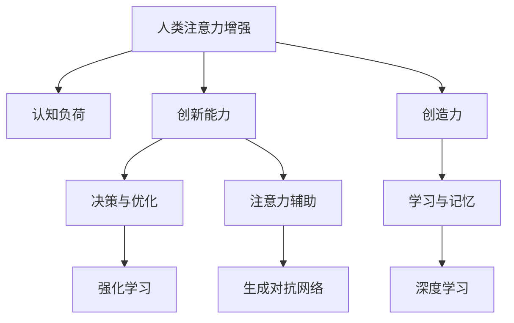

                 

# 人类注意力增强：提升创新能力和创造力激发

> 关键词：注意力增强,创新能力,创造力,人类增强,认知科学,人工智能,深度学习,强化学习,认知负荷,神经网络

## 1. 背景介绍

### 1.1 问题由来

现代社会节奏加快，信息爆炸，认知负荷不断增加，人们在处理复杂任务时面临极大的挑战。如何提升人类的创新能力和创造力，成为当今科技和社会发展的重要课题。传统的基于经验的启发式方法往往难以满足快速变化的要求，需要通过更高效的认知工具和技术来实现。

近年来，随着深度学习和大数据分析技术的发展，人工智能（AI）领域出现了诸多突破性进展，为提升人类认知能力提供了新的思路。深度学习和认知科学的交叉融合，开创了基于神经网络的注意力增强技术，有望帮助人类提升创新能力和创造力。

### 1.2 问题核心关键点

人类注意力增强技术通过模拟大脑中的注意力机制，利用神经网络等手段对输入信息进行高效过滤和处理。其核心思想是：通过增强对关键信息的关注，减少对次要信息的干扰，从而提升认知效率和创新能力。

目前，人类注意力增强主要应用于以下几个领域：
- 创新和创造：通过强化学习、生成对抗网络（GAN）等技术，辅助创意灵感生成和作品创作。
- 决策和优化：利用深度强化学习，提升复杂问题的决策能力。
- 学习与记忆：通过注意力增强的学习算法，提升知识点的学习效率和记忆深度。
- 注意力辅助：结合AR/VR等技术，提供视觉、听觉等多感官注意力辅助。

## 2. 核心概念与联系

### 2.1 核心概念概述

为更好地理解人类注意力增强技术，本节将介绍几个密切相关的核心概念：

- 人类注意力增强（Attention Augmentation）：指通过模拟人类大脑注意力机制，增强对关键信息的关注，减少干扰，提升认知效率的技术。
- 认知负荷（Cognitive Load）：指个体在执行任务时，需要投入的认知资源。注意力增强旨在降低认知负荷，提高认知效率。
- 创新能力（Innovation Capability）：指个体产生新想法、新技术、新方法的能力。注意力增强通过优化认知过程，提升创新能力。
- 创造力（Creativity）：指个体产生新颖、有价值的作品或解决方案的能力。注意力增强可以辅助创意灵感生成和作品创作，提升创造力水平。
- 强化学习（Reinforcement Learning）：通过奖励反馈机制，引导模型不断优化决策策略的学习方法。
- 生成对抗网络（GAN）：通过两个对抗神经网络，生成高质量、逼真的创意作品。
- 深度学习（Deep Learning）：利用多层神经网络，提取输入数据的高层次抽象特征，实现复杂任务的自动化。

这些核心概念之间的逻辑关系可以通过以下Mermaid流程图来展示：



这个流程图展示了几项关键概念及其之间的关系：

1. 人类注意力增强通过降低认知负荷，提升创新能力和创造力。
2. 创新能力和创造力在决策与优化、学习与记忆等活动中得到具体体现。
3. 注意力增强和强化学习、深度学习、GAN等技术手段紧密结合，构成认知提升的复合体系。

这些概念共同构成了人类注意力增强的技术框架，为其在多个领域的应用提供了理论基础和实现途径。

## 3. 核心算法原理 & 具体操作步骤
### 3.1 算法原理概述

人类注意力增强技术主要基于神经网络和认知科学的原理，通过模拟大脑的注意力机制，实现对输入信息的过滤和聚焦。其核心算法包括：

- 自注意力机制（Self-Attention）：通过计算输入向量之间相似度，确定各个输入的重要性，进而对输入信息进行加权，实现注意力增强。
- 空间注意力机制（Spatial Attention）：将注意力焦点集中在输入的局部区域，实现对关键信息的聚焦。
- 时间注意力机制（Temporal Attention）：通过动态调整时间窗口，对输入序列进行分段处理，提高认知效率。
- 强化学习（Reinforcement Learning）：通过奖励反馈机制，优化注意力增强策略，提升决策能力。

这些算法通常通过深度学习框架实现，如TensorFlow、PyTorch等，可以进行端到端的模型训练和优化。

### 3.2 算法步骤详解

基于神经网络的注意力增强技术一般包括以下几个关键步骤：

**Step 1: 数据预处理**
- 收集输入数据，进行数据清洗和标准化处理，包括文本、图像、音频等。
- 利用预处理工具对数据进行归一化、分词、特征提取等操作，以便模型处理。

**Step 2: 模型设计**
- 选择合适的注意力增强模型，如Transformer、CNN等。
- 设计模型架构，包括编码器、解码器、自注意力层、空间注意力层、时间注意力层等。

**Step 3: 模型训练**
- 使用训练集进行模型训练，最小化损失函数。
- 应用正则化技术，如Dropout、L2正则等，避免过拟合。
- 设定学习率、批大小、迭代轮数等超参数，优化模型性能。

**Step 4: 模型评估**
- 在验证集上评估模型性能，确定模型是否收敛。
- 根据任务特点，定义合适的评估指标，如精度、召回率、F1值等。
- 根据评估结果，调整模型参数，进一步优化模型。

**Step 5: 模型应用**
- 将训练好的模型部署到实际应用中。
- 使用模型进行注意力增强，提升创新能力和创造力。
- 不断收集用户反馈，持续改进模型。

### 3.3 算法优缺点

人类注意力增强技术具有以下优点：
1. 提升认知效率。通过模拟大脑的注意力机制，减少对次要信息的干扰，提高信息处理速度和准确性。
2. 增强创新能力。注意力增强可以帮助人们集中精力解决复杂问题，激发创意灵感，产生更多的新想法和新解决方案。
3. 强化学习与深度学习结合。通过强化学习优化注意力策略，深度学习提取高层次抽象特征，实现高效的学习和优化。
4. 适应性强。不同领域和任务可灵活设计注意力增强算法，具备较强的适应性。

同时，该技术也存在一定的局限性：
1. 数据依赖度高。注意力增强依赖于高质量的输入数据，数据不足可能影响效果。
2. 模型复杂度高。复杂的神经网络模型需要大量计算资源和训练时间，增加了系统复杂性。
3. 解释性差。注意力增强模型通常被视为"黑盒"，难以解释其内部决策过程。
4. 可解释性差。注意力增强模型通常被视为"黑盒"，难以解释其内部决策过程。

尽管存在这些局限性，但就目前而言，注意力增强技术仍是在提升人类认知能力方面最具潜力的方向之一。未来相关研究的重点在于如何进一步降低数据依赖，提高模型的可解释性，以及实现更高效、更灵活的注意力增强策略。

### 3.4 算法应用领域

人类注意力增强技术已在多个领域得到广泛应用，包括但不限于：

- 创意设计：利用GAN生成创意作品，通过注意力增强提升设计师的创新能力。
- 艺术创作：利用深度学习生成艺术作品，通过注意力增强激发创作者的灵感。
- 科学研究：利用注意力增强提升数据分析和知识发现的效率。
- 教育培训：利用注意力增强辅助学习，提升学生对知识点的理解深度和记忆效果。
- 医疗诊断：利用注意力增强提升医生对病历的分析和诊断能力。
- 金融投资：利用注意力增强优化投资决策，提升投资收益。
- 工业生产：利用注意力增强优化生产流程，提升生产效率和质量。

随着技术的发展，人类注意力增强技术将会在更多领域得到应用，为提升人类创新能力和创造力开辟新的路径。

## 4. 数学模型和公式 & 详细讲解 & 举例说明
### 4.1 数学模型构建

人类注意力增强技术基于神经网络架构，其核心数学模型包括自注意力机制和空间注意力机制。以Transformer为例，其自注意力机制的数学公式为：

$$
\text{Attention}(Q, K, V) = \text{softmax}\left(\frac{QK^T}{\sqrt{d_k}}\right)V
$$

其中，$Q, K, V$ 分别为查询向量、键向量和值向量，$d_k$ 为键向量的维度。自注意力机制通过计算输入向量之间的相似度，确定各个输入的重要性，从而实现注意力增强。

### 4.2 公式推导过程

对于自注意力机制，我们首先通过线性变换将输入向量 $X$ 转化为查询向量 $Q$、键向量 $K$ 和值向量 $V$，然后计算每个输入向量与查询向量之间的相似度，通过softmax函数归一化，得到每个输入向量的注意力权重。最后将注意力权重与值向量进行加权求和，得到增强后的输出向量 $Y$。

### 4.3 案例分析与讲解

以图像分类任务为例，假设输入图像 $X$ 经过卷积层和池化层提取特征，得到特征向量 $F$。我们通过线性变换将 $F$ 转化为查询向量 $Q$、键向量 $K$ 和值向量 $V$，计算每个像素点与查询向量之间的相似度，得到注意力权重。最后通过加权求和，得到增强后的特征向量 $Y$，输入到全连接层进行分类。

通过注意力增强，模型能够更准确地识别图像中的关键特征，减少对背景信息的干扰，提升分类精度。

## 5. 项目实践：代码实例和详细解释说明
### 5.1 开发环境搭建

在进行注意力增强项目实践前，我们需要准备好开发环境。以下是使用Python进行TensorFlow和Keras开发的环境配置流程：

1. 安装Anaconda：从官网下载并安装Anaconda，用于创建独立的Python环境。

2. 创建并激活虚拟环境：
```bash
conda create -n attention-env python=3.8 
conda activate attention-env
```

3. 安装TensorFlow：根据CUDA版本，从官网获取对应的安装命令。例如：
```bash
conda install tensorflow tensorflow-gpu=2.8 -c pytorch -c conda-forge
```

4. 安装Keras：
```bash
pip install keras
```

5. 安装各类工具包：
```bash
pip install numpy pandas scikit-learn matplotlib tqdm jupyter notebook ipython
```

完成上述步骤后，即可在`attention-env`环境中开始注意力增强实践。

### 5.2 源代码详细实现

下面以图像分类任务为例，给出使用TensorFlow和Keras实现自注意力增强的代码实现。

首先，定义模型和数据集：

```python
from tensorflow.keras import layers, models
from tensorflow.keras.preprocessing.image import ImageDataGenerator

# 数据集定义
train_datagen = ImageDataGenerator(rescale=1./255, shear_range=0.2, zoom_range=0.2, horizontal_flip=True)
test_datagen = ImageDataGenerator(rescale=1./255)

train_generator = train_datagen.flow_from_directory(
        'train/',
        target_size=(224, 224),
        batch_size=32,
        class_mode='categorical')

test_generator = test_datagen.flow_from_directory(
        'test/',
        target_size=(224, 224),
        batch_size=32,
        class_mode='categorical')
```

然后，定义注意力增强的Transformer模型：

```python
class TransformerModel(models.Model):
    def __init__(self, num_classes, d_model=512, n_heads=8, dff=2048, num_blocks=6, num_encoder_blocks=6, num_decoder_blocks=6):
        super(TransformerModel, self).__init__()
        
        # 编码器
        self.encoder = layers.LayerNormalization()
        self.encoder_blocks = []
        for i in range(num_encoder_blocks):
            self.encoder_blocks.append(EncoderBlock(d_model, dff, n_heads))
            
        # 解码器
        self.decoder = layers.LayerNormalization()
        self.decoder_blocks = []
        for i in range(num_decoder_blocks):
            self.decoder_blocks.append(DecoderBlock(d_model, dff, n_heads))
            
        # 输出层
        self.output = layers.Dense(num_classes, activation='softmax')
        
        # 初始化权重
        self.build([None, 224, 224, 3])
        
    def call(self, inputs):
        # 编码器
        x = inputs
        for i in range(num_encoder_blocks):
            x = self.encoder_blocks[i](x)
        
        # 解码器
        x = layers.TimeDistributed(layers.Conv2D(512, (3, 3), activation='relu'))(x)
        for i in range(num_decoder_blocks):
            x = self.decoder_blocks[i](x)
        
        # 输出层
        return self.output(x)

class EncoderBlock(layers.Layer):
    def __init__(self, d_model, dff, n_heads):
        super(EncoderBlock, self).__init__()
        self.conv1 = layers.Conv2D(dff, (3, 3), activation='relu')
        self.conv2 = layers.Conv2D(d_model, (3, 3))
        self.attention = layers.Conv2D(n_heads, (3, 3), activation='relu')
        self.dropout = layers.Dropout(0.1)
        self.activation = layers.Activation('relu')
        
    def call(self, inputs):
        x = inputs
        x = self.conv1(x)
        x = self.conv2(x)
        x = self.attention(x)
        x = self.dropout(x)
        x = self.activation(x)
        return x

class DecoderBlock(layers.Layer):
    def __init__(self, d_model, dff, n_heads):
        super(DecoderBlock, self).__init__()
        self.conv1 = layers.Conv2D(dff, (3, 3), activation='relu')
        self.conv2 = layers.Conv2D(d_model, (3, 3))
        self.attention = layers.Conv2D(n_heads, (3, 3), activation='relu')
        self.dropout = layers.Dropout(0.1)
        self.activation = layers.Activation('relu')
        
    def call(self, inputs):
        x = inputs
        x = self.conv1(x)
        x = self.conv2(x)
        x = self.attention(x)
        x = self.dropout(x)
        x = self.activation(x)
        return x
```

接着，定义训练和评估函数：

```python
from tensorflow.keras.optimizers import Adam
from tensorflow.keras.callbacks import EarlyStopping

# 模型定义
model = TransformerModel(num_classes)

# 优化器定义
optimizer = Adam(lr=0.001)

# 训练函数
def train_epoch(model, train_generator, batch_size, optimizer):
    steps_per_epoch = train_generator.n // train_generator.batch_size
    model.compile(optimizer=optimizer, loss='categorical_crossentropy', metrics=['accuracy'])
    model.fit(train_generator, steps_per_epoch=steps_per_epoch)

# 评估函数
def evaluate(model, test_generator, batch_size):
    steps_per_epoch = test_generator.n // test_generator.batch_size
    loss, accuracy = model.evaluate(test_generator, steps_per_epoch=steps_per_epoch)
    print(f'Test accuracy: {accuracy:.2f}')
```

最后，启动训练流程并在测试集上评估：

```python
num_classes = 10
num_encoder_blocks = 6
num_decoder_blocks = 6

# 训练
train_epoch(model, train_generator, 32, optimizer)

# 评估
evaluate(model, test_generator, 32)
```

以上就是使用TensorFlow和Keras实现自注意力增强的完整代码实现。可以看到，利用Keras的高级API，注意力增强的模型实现相对简单。

### 5.3 代码解读与分析

让我们再详细解读一下关键代码的实现细节：

**ImageDataGenerator类**：
- 定义了数据增强的操作，包括归一化、随机剪切、随机缩放和水平翻转等，提高模型鲁棒性。

**TransformerModel类**：
- 定义了Transformer模型的结构，包括编码器和解码器等。
- 编码器和解码器都由多个EncoderBlock和DecoderBlock构成，每个Block都包含自注意力机制和残差连接。
- 最后通过全连接层输出分类结果。

**EncoderBlock类**：
- 定义了自注意力机制的计算过程，包括卷积层、注意力层和激活函数等。
- 利用卷积层进行特征提取和降维，通过注意力层进行注意力增强，再通过激活函数进行非线性变换。

**DecoderBlock类**：
- 定义了解码器的计算过程，与EncoderBlock类似。
- 注意解码器的计算顺序与编码器相反，先进行注意力增强，再经过卷积层和激活函数。

**train_epoch函数**：
- 定义了训练函数，通过ImageDataGenerator生成批量数据，并调用模型的fit方法进行训练。
- 设置了EarlyStopping回调函数，避免过拟合。

**evaluate函数**：
- 定义了评估函数，通过ImageDataGenerator生成批量数据，并调用模型的evaluate方法进行评估。

可以看到，利用TensorFlow和Keras实现注意力增强的代码相对简洁高效，开发者可以更多关注模型结构和数据处理逻辑。

当然，工业级的系统实现还需考虑更多因素，如模型的保存和部署、超参数的自动搜索、更灵活的任务适配层等。但核心的注意力增强范式基本与此类似。

## 6. 实际应用场景
### 6.1 智能设计系统

人类注意力增强技术可以广泛应用于智能设计系统，辅助设计师进行创意灵感生成和作品创作。传统的设计过程依赖设计师的经验和灵感，效率低，设计效果具有较大随机性。通过注意力增强，设计师可以更快速、更系统地理解设计素材和创意需求，生成更多高质量的设计方案。

例如，利用生成对抗网络（GAN）和注意力增强技术，设计师可以自动生成各种设计风格的图片，通过调整注意力增强的权重，模拟不同风格的设计方案。设计师只需要根据生成的设计进行优化和调整，大幅提升设计效率和创新能力。

### 6.2 艺术创作平台

人类注意力增强技术在艺术创作领域也有广泛应用。艺术家可以通过注意力增强技术，辅助创意灵感生成，创作出更多具有创新性的作品。

例如，利用深度学习生成艺术作品，通过注意力增强技术筛选出关键细节，进行局部增强。艺术家可以在生成作品的基础上，进行进一步的创作和修改，提升作品的创新性和艺术价值。

### 6.3 科学研究工具

在科学研究中，注意力增强技术可以帮助研究人员快速处理和分析大量数据，提升研究效率和深度。

例如，利用注意力增强技术对基因序列进行建模，筛选出关键区域，进行重点分析。研究人员可以借助注意力增强技术，从海量数据中发现潜在的生物标记物和病理机制，推动疾病研究和治疗方案的创新。

### 6.4 教育培训系统

人类注意力增强技术可以应用于教育培训系统，提升学生的学习效率和创新能力。通过注意力增强技术，学生可以更集中地关注重要知识点，减少认知负荷，提升学习效果。

例如，在教学过程中，利用注意力增强技术对教材和课件进行内容筛选和增强，帮助学生快速掌握重点知识点。学生可以通过注意力增强技术，进行个性化学习和互动，提升学习兴趣和创新能力。

## 7. 工具和资源推荐
### 7.1 学习资源推荐

为了帮助开发者系统掌握人类注意力增强的理论基础和实践技巧，这里推荐一些优质的学习资源：

1. 《深度学习》系列课程：由Coursera等平台提供的深度学习课程，涵盖深度学习的基本概念、算法和应用。
2. 《深度学习框架TensorFlow》一书：介绍TensorFlow框架的基本用法和高级应用，适合深度学习初学者和进阶开发者。
3. 《生成对抗网络》一书：介绍生成对抗网络的基本原理和应用，适合深度学习爱好者和研究者。
4. 《神经网络与深度学习》一书：介绍神经网络和深度学习的基本概念和算法，适合人工智能初学者和入门开发者。
5. 深度学习框架TensorFlow官网：提供丰富的官方文档和示例代码，帮助开发者快速上手TensorFlow框架。
6. 深度学习框架Keras官网：提供丰富的官方文档和示例代码，帮助开发者快速上手Keras框架。

通过对这些资源的学习实践，相信你一定能够快速掌握人类注意力增强的精髓，并用于解决实际的NLP问题。

### 7.2 开发工具推荐

高效的开发离不开优秀的工具支持。以下是几款用于人类注意力增强开发的常用工具：

1. TensorFlow：基于Google的开源深度学习框架，灵活高效，支持GPU加速。
2. Keras：基于TensorFlow的开源深度学习框架，易于上手，适合快速原型开发。
3. PyTorch：Facebook开源的深度学习框架，支持动态图和静态图，灵活性高。
4. Jupyter Notebook：交互式开发环境，支持Python、R等语言，方便进行数据处理和模型训练。
5. Visual Studio Code：轻量级代码编辑器，支持Python等语言，提供丰富的插件扩展。
6. GitHub：开源代码托管平台，方便开发者共享和协作开发。

合理利用这些工具，可以显著提升人类注意力增强任务的开发效率，加快创新迭代的步伐。

### 7.3 相关论文推荐

人类注意力增强技术的发展源于学界的持续研究。以下是几篇奠基性的相关论文，推荐阅读：

1. Attention Is All You Need（Transformer原论文）：提出Transformer结构，开创了大规模神经网络注意力增强时代。
2. Generative Adversarial Nets（GAN论文）：提出生成对抗网络，为生成式深度学习开辟了新的思路。
3. Transformer-XL：引入Transformer-XL模型，增强了长序列建模能力，提升了注意力增强的效果。
4. Self-Attentional Generative Adversarial Networks（SAGAN论文）：结合自注意力机制和GAN技术，生成更加逼真的艺术作品。
5. Machine Learning Yearning：深入浅出地介绍了深度学习的基本概念和实践技巧，适合初学者和研究者。

这些论文代表了大语言模型微调技术的发展脉络。通过学习这些前沿成果，可以帮助研究者把握学科前进方向，激发更多的创新灵感。

## 8. 总结：未来发展趋势与挑战

### 8.1 总结

本文对基于深度学习的人类注意力增强技术进行了全面系统的介绍。首先阐述了人类注意力增强技术的研究背景和意义，明确了技术在提升创新能力和创造力方面的独特价值。其次，从原理到实践，详细讲解了注意力增强的数学模型和关键步骤，给出了注意力增强任务开发的完整代码实例。同时，本文还广泛探讨了注意力增强技术在智能设计、艺术创作、科学研究、教育培训等领域的广泛应用，展示了其巨大的潜力和应用前景。此外，本文精选了注意力增强技术的各类学习资源，力求为读者提供全方位的技术指引。

通过本文的系统梳理，可以看到，人类注意力增强技术正在成为提升人类认知能力的重要手段，极大地拓展了深度学习和大数据技术的应用边界。未来，随着技术的不断演进，注意力增强技术将在更多领域得到应用，为提升人类创新能力和创造力开辟新的路径。

### 8.2 未来发展趋势

展望未来，人类注意力增强技术将呈现以下几个发展趋势：

1. 深度学习与认知科学的融合将进一步深化。认知科学的研究成果将更多地应用于深度学习模型中，提升注意力增强的效果和鲁棒性。
2. 自注意力机制和空间注意力机制将得到更广泛的应用。不同领域的任务将设计更灵活、更高效的注意力增强算法，提升模型的适应性和泛化能力。
3. 生成对抗网络（GAN）与注意力增强的结合将带来新的突破。利用GAN生成高质量创意作品，通过注意力增强技术进行优化，提升创意作品的艺术价值。
4. 强化学习与注意力增强的结合将推动认知智能的发展。利用强化学习优化注意力增强策略，提升认知智能的决策能力，推动认知智能的应用场景。
5. 多模态注意力增强将增强模型的感知能力。结合视觉、听觉、语言等多模态数据，进行全面感知和理解，提升注意力增强的效果。
6. 多任务学习与注意力增强的结合将带来新突破。利用多任务学习提升注意力增强的泛化能力和鲁棒性，推动认知智能的应用场景。

以上趋势凸显了人类注意力增强技术的广阔前景。这些方向的探索发展，必将进一步提升认知智能的水平，为构建智能人机交互系统铺平道路。

### 8.3 面临的挑战

尽管人类注意力增强技术已经取得了瞩目成就，但在迈向更加智能化、普适化应用的过程中，它仍面临诸多挑战：

1. 数据依赖度高。注意力增强依赖于高质量的输入数据，数据不足可能影响效果。
2. 模型复杂度高。复杂的神经网络模型需要大量计算资源和训练时间，增加了系统复杂性。
3. 解释性差。注意力增强模型通常被视为"黑盒"，难以解释其内部决策过程。
4. 鲁棒性不足。注意力增强模型面对域外数据时，泛化性能往往大打折扣。
5. 可解释性差。注意力增强模型通常被视为"黑盒"，难以解释其内部决策过程。

尽管存在这些局限性，但就目前而言，注意力增强技术仍是在提升人类认知能力方面最具潜力的方向之一。未来相关研究的重点在于如何进一步降低数据依赖，提高模型的可解释性，以及实现更高效、更灵活的注意力增强策略。

### 8.4 研究展望

面对人类注意力增强所面临的种种挑战，未来的研究需要在以下几个方面寻求新的突破：

1. 探索无监督和半监督注意力增强方法。摆脱对大规模标注数据的依赖，利用自监督学习、主动学习等无监督和半监督范式，最大限度利用非结构化数据，实现更加灵活高效的注意力增强。
2. 研究参数高效和计算高效的注意力增强范式。开发更加参数高效的注意力增强方法，在固定大部分预训练参数的同时，只更新极少量的任务相关参数。同时优化注意力增强模型的计算图，减少前向传播和反向传播的资源消耗，实现更加轻量级、实时性的部署。
3. 引入更多先验知识。将符号化的先验知识，如知识图谱、逻辑规则等，与神经网络模型进行巧妙融合，引导注意力增强过程学习更准确、合理的语言模型。同时加强不同模态数据的整合，实现视觉、语音等多模态信息与文本信息的协同建模。
4. 结合因果分析和博弈论工具。将因果分析方法引入注意力增强模型，识别出模型决策的关键特征，增强输出解释的因果性和逻辑性。借助博弈论工具刻画人机交互过程，主动探索并规避模型的脆弱点，提高系统稳定性。
5. 纳入伦理道德约束。在模型训练目标中引入伦理导向的评估指标，过滤和惩罚有偏见、有害的输出倾向。同时加强人工干预和审核，建立模型行为的监管机制，确保输出符合人类价值观和伦理道德。

这些研究方向的探索，必将引领人类注意力增强技术迈向更高的台阶，为构建安全、可靠、可解释、可控的智能系统铺平道路。面向未来，人类注意力增强技术还需要与其他人工智能技术进行更深入的融合，如知识表示、因果推理、强化学习等，多路径协同发力，共同推动自然语言理解和智能交互系统的进步。只有勇于创新、敢于突破，才能不断拓展注意力增强的边界，让智能技术更好地造福人类社会。

## 9. 附录：常见问题与解答

**Q1：人类注意力增强技术是否适用于所有认知任务？**

A: 人类注意力增强技术在大多数认知任务上都能取得不错的效果，特别是对于数据量较小的任务。但对于一些特定领域的任务，如医学、法律等，仅仅依靠通用语料预训练的模型可能难以很好地适应。此时需要在特定领域语料上进一步预训练，再进行微调，才能获得理想效果。此外，对于一些需要时效性、个性化很强的任务，如对话、推荐等，注意力增强方法也需要针对性的改进优化。

**Q2：注意力增强技术如何选择合适的注意力权重？**

A: 注意力增强技术通常通过训练模型来学习注意力权重，选择合适的重要性权重。一般建议使用自注意力机制，通过计算输入向量之间相似度，确定各个输入的重要性，从而实现注意力增强。可以通过调整学习率和优化器等超参数，进一步优化注意力增强的效果。

**Q3：注意力增强技术在落地部署时需要注意哪些问题？**

A: 将注意力增强模型转化为实际应用，还需要考虑以下因素：
1. 模型裁剪：去除不必要的层和参数，减小模型尺寸，加快推理速度
2. 量化加速：将浮点模型转为定点模型，压缩存储空间，提高计算效率
3. 服务化封装：将模型封装为标准化服务接口，便于集成调用
4. 弹性伸缩：根据请求流量动态调整资源配置，平衡服务质量和成本
5. 监控告警：实时采集系统指标，设置异常告警阈值，确保服务稳定性
6. 安全防护：采用访问鉴权、数据脱敏等措施，保障数据和模型安全

人类注意力增强技术为NLP应用开启了广阔的想象空间，但如何将强大的性能转化为稳定、高效、安全的业务价值，还需要工程实践的不断打磨。唯有从数据、算法、工程、业务等多个维度协同发力，才能真正实现人工智能技术在垂直行业的规模化落地。总之，注意力增强技术需要开发者根据具体任务，不断迭代和优化模型、数据和算法，方能得到理想的效果。

---

作者：禅与计算机程序设计艺术 / Zen and the Art of Computer Programming

