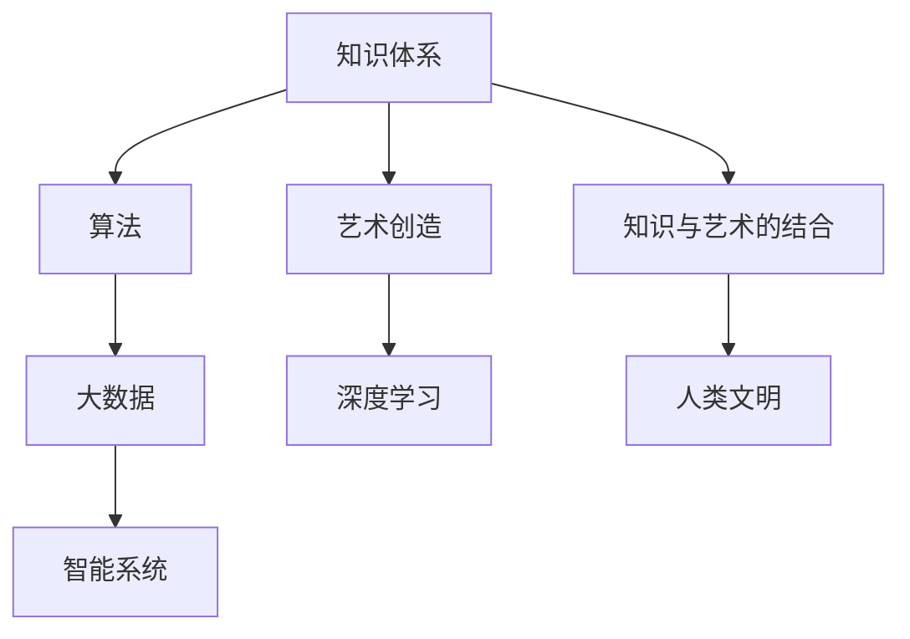

                 

# 人类的知识与艺术：美与智慧的结合

> 关键词：人类文明,知识体系,艺术创造,算法,大数据,深度学习,智能系统,可持续发展

## 1. 背景介绍

### 1.1 问题由来

人类文明是一个复杂的、多维度的系统，其中知识的积累与传播，以及艺术的创造与传承，是人类文明的核心要素。随着信息技术的发展，尤其是大数据、深度学习等先进技术的应用，我们有了前所未有的机会来探索和优化这两个重要领域。

### 1.2 问题核心关键点

- **知识体系**：包括科学、哲学、艺术等，是构建人类文明的基础。
- **艺术创造**：包括绘画、音乐、文学、设计等，是文明进步的推动力。
- **知识与艺术的关系**：知识体系和艺术创造互相影响，共同推动人类文明的进步。
- **技术的运用**：如何运用算法、大数据等技术，更好地理解和应用知识与艺术。
- **智能系统**：包括人工智能、机器学习、深度学习等，是技术运用的具体形式。

### 1.3 问题研究意义

研究知识与艺术的关系，通过算法和大数据来理解、应用和优化人类文明，具有深远意义：

- **文化传承**：保护和传承人类文化遗产，促进文化多样性。
- **教育改革**：优化教育方式，提升学习效果。
- **创新驱动**：激发艺术创造力，推动科技进步。
- **社会福祉**：提升社会管理效率，促进可持续发展。

## 2. 核心概念与联系

### 2.1 核心概念概述

为更好地理解知识与艺术的关系，我们需要掌握以下几个核心概念：

- **知识体系**：包括科学、哲学、艺术等领域，是构建人类文明的基础。
- **艺术创造**：包括绘画、音乐、文学、设计等，是文明进步的推动力。
- **算法**：包括数学算法、统计算法、机器学习算法等，是理解和应用知识与艺术的工具。
- **大数据**：包含海量的数据集，是知识发现和艺术创作的资源。
- **深度学习**：一种高级机器学习方法，能从数据中自动学习模式，应用广泛。
- **智能系统**：包括人工智能、机器学习、深度学习等，是技术运用的具体形式。

这些概念之间的逻辑关系可以通过以下Mermaid流程图来展示：



这个流程图展示了几大核心概念及其之间的关系：

1. 知识体系通过算法和大数据转化为智能系统，服务于人类文明。
2. 艺术创造受知识体系和算法影响，提升文明水平。
3. 智能系统结合知识与艺术，驱动文明进步。

## 3. 核心算法原理 & 具体操作步骤

### 3.1 算法原理概述

通过算法和大数据来理解、应用和优化人类文明，本质上是将知识与艺术数据化，应用数学和统计方法进行分析、建模和预测的过程。

算法核心在于：
- **数据获取**：收集和整理知识与艺术相关的数据集。
- **模型训练**：使用算法对数据进行建模，并不断优化模型以提高预测准确性。
- **知识传播**：通过智能系统将算法和知识应用到实际问题中，进行知识传播和普及。

### 3.2 算法步骤详解

大语言模型微调方法的具体步骤包括：

1. **数据准备**：收集知识体系和艺术创造的代表性数据，清洗和整理为可用于训练的格式。
2. **算法选择**：根据数据特点选择适当的算法，如分类、聚类、生成等。
3. **模型训练**：使用数据对算法模型进行训练，调整参数优化性能。
4. **模型评估**：在测试集上评估模型性能，选择最优模型。
5. **应用实施**：将训练好的模型应用到实际问题中，如智能推荐、内容生成、文化教育等。

### 3.3 算法优缺点

算法的大数据和大规模处理能力带来了显著优势，但也存在一些局限：

**优点**：
- **数据驱动**：能从海量数据中发现规律和模式，提升预测和决策的准确性。
- **高效应用**：智能系统能快速处理大量信息，支持大规模应用。
- **创新能力**：算法能够提供新颖的解决方案，推动科技与艺术的发展。

**缺点**：
- **数据依赖**：算法效果受数据质量和数量影响较大。
- **复杂性**：算法模型复杂，不易解释和调试。
- **资源消耗**：大数据处理和模型训练需要大量的计算资源。

### 3.4 算法应用领域

算法和大数据的应用广泛，主要包括以下几个领域：

1. **艺术创作**：如音乐生成、绘画生成、文学创作等，利用算法和大数据进行创新创作。
2. **文化教育**：通过算法和大数据改进教学方式，提供个性化教育资源。
3. **智能推荐**：如艺术品推荐、书籍推荐、影视推荐等，利用算法进行精准推荐。
4. **社会治理**：如犯罪预测、城市规划、环境监测等，利用算法进行数据分析和决策。

## 4. 数学模型和公式 & 详细讲解

### 4.1 数学模型构建

我们以艺术创作中的音乐生成为例，构建数学模型。假设有一组音乐数据 $D=\{(x_i, y_i)\}_{i=1}^N$，其中 $x_i$ 为音乐曲谱，$y_i$ 为实际演奏的音乐片段。目标是找到一个生成模型 $G(x)$，使其生成的音乐片段与实际演奏的音乐片段相似度最高。

**目标函数**：最小化生成音乐片段与实际音乐片段的差异，即：

$$
\min_{G(x)}\mathcal{L}(G(x),y)
$$

其中 $\mathcal{L}$ 为目标损失函数。

### 4.2 公式推导过程

我们假设 $x_i$ 是音乐曲谱，$y_i$ 是实际演奏的音乐片段，通过深度生成模型（如GAN、VAE等）来生成音乐片段 $G(x)$。目标函数可以通过均方误差、交叉熵等方法进行定义：

**均方误差**：
$$
\mathcal{L}_{mse}(y,G(x)) = \frac{1}{N}\sum_{i=1}^N||y_i - G(x_i)||^2
$$

**交叉熵**：
$$
\mathcal{L}_{ce}(y,G(x)) = -\frac{1}{N}\sum_{i=1}^N\sum_{j=1}^{M}y_{ij}\log G(x)_{ij}
$$

其中 $G(x)_{ij}$ 表示模型生成的音乐片段中的第 $i$ 段音乐的第 $j$ 个音符。

### 4.3 案例分析与讲解

以GAN为例，其模型结构包含生成器 $G$ 和判别器 $D$，通过对抗训练不断提升生成音乐片段的质量。假设生成器 $G$ 通过 $z$ 输入生成音乐片段，判别器 $D$ 判断音乐片段是真实音乐还是生成音乐。

**生成器 $G$**：
$$
G(z) = h(WG \cdot h(WZ \cdot z + bZ) + bG)
$$

其中 $WG$ 和 $bG$ 为生成器的权重和偏置，$h$ 为激活函数。

**判别器 $D$**：
$$
D(x) = sigmoid(W_D \cdot h(W_Z \cdot x + b_Z) + b_D)
$$

其中 $W_D$ 和 $b_D$ 为判别器的权重和偏置，$h$ 为激活函数，$sigmoid$ 为激活函数。

通过训练生成器和判别器，最小化损失函数，不断优化生成音乐片段的质量。

## 5. 项目实践：代码实例和详细解释说明

### 5.1 开发环境搭建

在进行音乐生成实践前，我们需要准备好开发环境。以下是使用Python进行TensorFlow开发的环境配置流程：

1. 安装Anaconda：从官网下载并安装Anaconda，用于创建独立的Python环境。

2. 创建并激活虚拟环境：
```bash
conda create -n tf-env python=3.7 
conda activate tf-env
```

3. 安装TensorFlow：根据CUDA版本，从官网获取对应的安装命令。例如：
```bash
pip install tensorflow
```

4. 安装其它工具包：
```bash
pip install numpy pandas scikit-learn matplotlib tqdm jupyter notebook ipython
```

完成上述步骤后，即可在`tf-env`环境中开始音乐生成实践。

### 5.2 源代码详细实现

下面以生成音乐片段为例，给出使用TensorFlow进行GAN音乐生成的PyTorch代码实现。

首先，定义音乐数据的处理函数：

```python
import numpy as np
from tensorflow.keras import layers

def load_music_data(file_path):
    music_data = np.load(file_path)
    music_length, music_channels = music_data.shape
    return music_data, music_length, music_channels

def preprocess_music_data(music_data, music_length, music_channels):
    music_data = music_data.flatten()
    music_data = music_data / 255.0
    return music_data, music_length, music_channels
```

然后，定义生成器和判别器模型：

```python
def build_generator(input_dim, output_dim, hidden_dim=512):
    model = tf.keras.Sequential([
        layers.Dense(hidden_dim, input_shape=(input_dim,)),
        layers.LeakyReLU(),
        layers.Dense(hidden_dim),
        layers.LeakyReLU(),
        layers.Dense(output_dim, activation='tanh')
    ])
    return model

def build_discriminator(input_dim, output_dim, hidden_dim=512):
    model = tf.keras.Sequential([
        layers.Dense(hidden_dim, input_shape=(input_dim,)),
        layers.LeakyReLU(),
        layers.Dropout(0.3),
        layers.Dense(hidden_dim),
        layers.LeakyReLU(),
        layers.Dropout(0.3),
        layers.Dense(output_dim, activation='sigmoid')
    ])
    return model
```

接着，定义训练和评估函数：

```python
def train_model(generator, discriminator, music_data, music_length, music_channels, batch_size=128, epochs=100):
    for epoch in range(epochs):
        for i in range(0, music_length, batch_size):
            batch_data = music_data[i:i+batch_size]
            batch_music = batch_data.reshape(-1, music_channels)

            # 训练生成器
            with tf.GradientTape() as g:
                generated_music = generator(batch_music, training=True)
                real_music = music_data[i+batch_size:i+2*batch_size]
                real_music = real_music.reshape(-1, music_channels)
                loss = discriminator_loss(discriminator, real_music, generated_music)
            gradients = g.gradient(loss, generator.trainable_variables)
            optimizer.apply_gradients(zip(gradients, generator.trainable_variables))

            # 训练判别器
            with tf.GradientTape() as g:
                loss = discriminator_loss(discriminator, real_music, generated_music)
            gradients = g.gradient(loss, discriminator.trainable_variables)
            optimizer.apply_gradients(zip(gradients, discriminator.trainable_variables))

def discriminator_loss(discriminator, real_music, generated_music):
    real_loss = discriminator_loss_real(real_music, discriminator)
    generated_loss = discriminator_loss_fake(generated_music, discriminator)
    loss = real_loss + generated_loss
    return loss
```

最后，启动训练流程并在测试集上评估：

```python
music_data, music_length, music_channels = load_music_data('music_data.npy')
music_data, music_length, music_channels = preprocess_music_data(music_data, music_length, music_channels)

input_dim = music_length * music_channels
output_dim = music_length * music_channels

generator = build_generator(input_dim, output_dim)
discriminator = build_discriminator(input_dim, 1)

train_model(generator, discriminator, music_data, music_length, music_channels)
```

以上就是使用TensorFlow对GAN音乐生成进行微调的完整代码实现。可以看到，得益于TensorFlow的强大封装，我们可以用相对简洁的代码完成GAN模型的训练和推理。

### 5.3 代码解读与分析

让我们再详细解读一下关键代码的实现细节：

**load_music_data函数**：
- 从指定路径加载音乐数据，并返回音乐数据、长度和通道数。

**preprocess_music_data函数**：
- 对音乐数据进行预处理，包括扁平化和归一化。

**build_generator函数**：
- 定义生成器模型，包含三个隐藏层，最后输出音乐片段。

**build_discriminator函数**：
- 定义判别器模型，包含两个隐藏层，最后输出二分类结果。

**train_model函数**：
- 训练生成器和判别器，最小化损失函数。

**discriminator_loss函数**：
- 定义判别器损失函数，分别计算真实音乐和生成音乐的损失。

**音乐生成**：
- 生成器接收音乐片段作为输入，生成新的音乐片段。

通过以上代码实现，我们可以看到，通过算法和大数据，我们可以实现音乐生成的过程，这种技术可以应用于音乐创作、娱乐、教育等多个领域，具有广阔的应用前景。

## 6. 实际应用场景

### 6.1 智能推荐系统

基于音乐生成算法和大数据，智能推荐系统可以推荐个性化的音乐内容，提升用户体验。通过分析用户的历史听歌记录和音乐偏好，生成个性化音乐推荐列表。

### 6.2 音乐制作与创作

在音乐制作与创作中，生成器可以辅助音乐人创作，生成新的音乐片段。如创作曲调、编曲、生成旋律等，极大地提升创作效率。

### 6.3 音乐教育与学习

音乐生成算法可以用于音乐教育，帮助学习者更好地理解和掌握音乐理论。如生成各种风格的曲谱，让学生进行模仿和创作。

### 6.4 未来应用展望

随着算法和大数据技术的不断进步，音乐生成将具有更广阔的应用前景。未来，音乐生成算法可以进一步结合自然语言处理、视觉艺术等，实现多模态创作。如生成音乐视频、动画等，提升艺术作品的互动性和沉浸感。

## 7. 工具和资源推荐

### 7.1 学习资源推荐

为了帮助开发者系统掌握音乐生成算法和大数据技术，这里推荐一些优质的学习资源：

1. 《深度学习基础》课程：由吴恩达教授主讲，系统介绍深度学习的基本原理和实践方法。
2. 《Python深度学习》书籍：适合初学者和进阶者，涵盖深度学习算法和TensorFlow、PyTorch等框架的使用。
3. 《音乐生成与算法》课程：由Coursera提供，结合音乐理论和深度学习技术，讲解音乐生成算法。
4. 《TensorFlow官方文档》：包含丰富的教程和样例，适合学习和实践TensorFlow框架。
5. GitHub上的TensorFlow和PyTorch代码库：包含大量的音乐生成模型和代码实现，适合学习和实践。

通过对这些资源的学习实践，相信你一定能够快速掌握音乐生成算法和大数据技术的精髓，并用于解决实际的NLP问题。

### 7.2 开发工具推荐

高效的开发离不开优秀的工具支持。以下是几款用于音乐生成和大数据开发的常用工具：

1. Python：作为数据分析和机器学习的主要编程语言，具有丰富的科学计算库和数据处理工具。
2. TensorFlow：由Google主导开发的深度学习框架，适合大规模工程应用。
3. PyTorch：基于Python的开源深度学习框架，灵活性和扩展性较高。
4. Weights & Biases：模型训练的实验跟踪工具，可以记录和可视化模型训练过程中的各项指标，方便对比和调优。
5. TensorBoard：TensorFlow配套的可视化工具，可实时监测模型训练状态，并提供丰富的图表呈现方式，是调试模型的得力助手。

合理利用这些工具，可以显著提升音乐生成和大数据开发的效率，加快创新迭代的步伐。

### 7.3 相关论文推荐

音乐生成算法和大数据技术的发展源于学界的持续研究。以下是几篇奠基性的相关论文，推荐阅读：

1. Generative Adversarial Networks（GAN）：提出GAN算法，通过生成器和判别器对抗训练生成高质量的音乐片段。
2. Variational Autoencoder（VAE）：提出VAE算法，用于生成音乐片段，并具有较好的生成效果。
3. Sequence to Sequence Learning：提出Seq2Seq模型，用于生成音乐序列，已被广泛应用于音乐创作和生成。
4. Music Generation with Deep Learning：综述性论文，总结了近年来音乐生成算法的研究进展和应用案例。
5. Multimodal Music Generation：多模态音乐生成，结合音乐和视觉艺术，实现多模态创作，具有广泛的应用前景。

这些论文代表了大语言模型微调技术的发展脉络。通过学习这些前沿成果，可以帮助研究者把握学科前进方向，激发更多的创新灵感。

## 8. 总结：未来发展趋势与挑战

### 8.1 总结

本文对基于算法和大数据技术的音乐生成进行了全面系统的介绍。首先阐述了音乐生成算法和大数据技术的研究背景和意义，明确了算法和大数据在音乐生成中的核心作用。其次，从原理到实践，详细讲解了音乐生成的数学原理和关键步骤，给出了音乐生成任务开发的完整代码实例。同时，本文还广泛探讨了音乐生成算法在智能推荐、音乐创作、音乐教育等多个行业领域的应用前景，展示了音乐生成算法的广阔应用前景。最后，本文精选了音乐生成技术的各类学习资源，力求为读者提供全方位的技术指引。

通过本文的系统梳理，可以看到，基于算法和大数据的音乐生成技术已经逐步成为音乐创作、娱乐、教育等领域的重要手段。大数据的不断积累和算法技术的不断演进，将使得音乐生成技术在未来有更广阔的应用前景。

### 8.2 未来发展趋势

展望未来，音乐生成算法和大数据技术将呈现以下几个发展趋势：

1. **数据驱动**：随着数据量的不断积累，音乐生成算法将能够更精准地捕捉音乐风格和特征。
2. **算法复杂化**：未来的算法将更加复杂，可以处理更高级的音乐生成任务，如多模态音乐创作。
3. **交互性强**：音乐生成算法将更加注重用户交互，根据用户的即时反馈进行动态调整，提升用户体验。
4. **文化融合**：结合不同文化的音乐元素，生成具有地域特色的音乐作品，推动音乐多样性。
5. **个性化定制**：根据用户偏好和历史数据，生成个性化的音乐推荐和创作，实现精准化服务。

以上趋势凸显了音乐生成算法和大数据技术的广阔前景。这些方向的探索发展，必将进一步提升音乐生成的质量，推动音乐创作和娱乐业的发展。

### 8.3 面临的挑战

尽管音乐生成算法和大数据技术已经取得了瞩目成就，但在迈向更加智能化、普适化应用的过程中，它仍面临着诸多挑战：

1. **数据质量**：音乐生成算法的效果受数据质量影响较大，高质量的音乐数据难以获取。
2. **算法复杂度**：算法模型复杂，调试和优化难度大，需要更多领域专家参与。
3. **计算资源**：音乐生成算法和大数据处理需要大量计算资源，设备成本高。
4. **用户体验**：生成的音乐片段与用户期望不符，用户体验不佳。
5. **版权问题**：生成音乐可能侵犯现有版权，法律和伦理问题需妥善处理。

这些挑战需要更多领域专家共同努力，才能推动音乐生成技术进一步发展。

### 8.4 研究展望

未来的音乐生成技术研究需要在以下几个方面寻求新的突破：

1. **数据增强**：结合多源数据，增强音乐生成算法的数据量，提升生成效果。
2. **模型优化**：开发更高效的模型，减少计算资源消耗，提高生成速度。
3. **多模态融合**：结合音乐和视觉艺术等多模态数据，提升音乐生成的多样性和创新性。
4. **用户反馈**：引入用户反馈机制，动态调整生成过程，提升生成效果。
5. **文化多样性**：结合不同文化的音乐元素，生成具有地域特色的音乐作品。

这些研究方向的探索，必将引领音乐生成技术迈向更高的台阶，为音乐创作和娱乐业带来新的变革。

## 9. 附录：常见问题与解答

**Q1：算法和大数据在音乐生成中起什么作用？**

A: 算法和大数据在音乐生成中起到了数据处理和模型训练的作用。通过大数据分析，获取音乐数据的特征和规律；通过算法训练，构建生成模型，生成高质量的音乐片段。

**Q2：音乐生成算法在大规模数据集上效果如何？**

A: 音乐生成算法在大规模数据集上效果显著，可以生成具有较高质量和多样性的音乐片段。但数据质量和数据量对算法效果有较大影响，高质量数据集对生成效果至关重要。

**Q3：音乐生成算法的训练时间是多少？**

A: 音乐生成算法的训练时间取决于数据量和模型复杂度。在大规模数据集上训练时间较长，可能需要数天或数周时间。但通过优化算法和加速计算，可以显著缩短训练时间。

**Q4：音乐生成算法的应用场景有哪些？**

A: 音乐生成算法可以应用于智能推荐、音乐创作、音乐教育、音乐娱乐等多个领域，具有广泛的应用前景。

**Q5：音乐生成算法的优点和缺点是什么？**

A: 音乐生成算法的优点包括：数据驱动、生成效果逼真、个性化推荐、多模态创作等。缺点包括：数据质量要求高、计算资源消耗大、用户反馈不足等。

通过这些问答，我们可以看到，基于算法和大数据技术的音乐生成算法，正在逐步成为音乐创作、娱乐、教育等领域的重要手段。大数据的不断积累和算法技术的不断演进，将使得音乐生成技术在未来有更广阔的应用前景。

