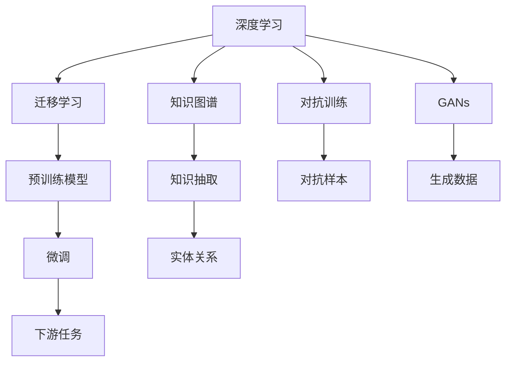

                 

## 1. 背景介绍

### 1.1 问题由来
在信息爆炸的时代，知识的海量化和多样化带来了前所未有的便利，但也暴露了人类知识的局限性。从古代智者到现代科技，人类总是在探索未知的同时，意识到未知的巨大和复杂。知识的局限性不仅是学术界的永恒主题，也关系到人工智能(AI)、数据科学、社会科学等多个领域的发展。

面对复杂的自然现象和人类行为，人类认知能力有限的现实，促使我们不断寻求更为有效、精确和可靠的知识表达与处理方式。而AI技术的兴起，尤其是深度学习的发展，在一定程度上提供了更为强大的数据处理能力，但也带来了新的挑战和问题。如何平衡知识和算法的局限性，探索未知，成为亟待解决的重要课题。

### 1.2 问题核心关键点
人类知识的局限性主要体现在以下几方面：
1. **认知边界**：人类的认知能力存在上限，无法全面、精确地理解复杂现象。
2. **数据局限**：数据采集和处理技术的局限，使得数据往往具有偏差和不完整性。
3. **算法局限**：现有算法难以完全捕捉复杂的因果关系和动态变化。
4. **模型局限**：模型参数和结构的局限性，导致模型难以应对大规模、高复杂度的数据集。

为了突破这些局限，我们需要通过AI技术，尤其是深度学习，挖掘和处理海量数据，构建更为复杂和精确的模型，同时保持对未知的探索和质疑。本文将探讨如何通过AI技术，承认并克服人类知识局限性，逐步走向更广阔的未知领域。

## 2. 核心概念与联系

### 2.1 核心概念概述

在探讨如何突破知识局限时，以下几个核心概念尤为重要：

- **深度学习**：基于神经网络的机器学习技术，能够处理大规模、高复杂度的数据，揭示数据中的深层模式和关系。
- **迁移学习**：通过预训练模型的知识迁移，将一个领域的知识应用到另一个领域，提升模型在新任务上的性能。
- **知识图谱**：通过构建实体与实体之间关系的图结构，为复杂问题提供结构化、层次化的知识表示。
- **对抗训练**：通过引入对抗样本，提高模型的鲁棒性和泛化能力，避免过度拟合。
- **生成对抗网络(GANs)**：通过生成器和判别器的对抗训练，生成高质量、多样性的数据样本。

这些核心概念构成了人工智能突破知识局限性的主要框架，通过它们的有机结合，我们有望在处理复杂、未知问题时取得新的突破。

### 2.2 核心概念原理和架构的 Mermaid 流程图



这个流程图展示了深度学习、迁移学习、知识图谱、对抗训练和GANs之间的联系和作用。通过这些技术的综合应用，我们能够构建更加复杂、鲁棒的模型，逐步克服知识局限性。

## 3. 核心算法原理 & 具体操作步骤

### 3.1 算法原理概述

突破知识局限性的核心算法原理主要包括以下几个方面：

- **深度学习算法**：通过多层神经网络的组合，能够处理高维、非线性的数据，揭示数据中的深层模式和关系。
- **迁移学习算法**：通过预训练模型的知识迁移，减少新任务所需的数据量，提升模型在新任务上的性能。
- **知识图谱算法**：通过构建知识图谱，将复杂的知识表示为结构化、层次化的图结构，提供更为丰富的语义信息。
- **对抗训练算法**：通过引入对抗样本，提升模型的鲁棒性和泛化能力，避免过度拟合。
- **GANs算法**：通过生成器和判别器的对抗训练，生成高质量、多样性的数据样本，丰富数据集的多样性。

这些算法原理共同构成了人工智能突破知识局限性的主要技术手段，通过它们的有机结合，我们能够构建更为复杂、鲁棒的模型，逐步克服知识局限性。

### 3.2 算法步骤详解

基于深度学习、迁移学习、知识图谱、对抗训练和GANs的突破知识局限性的算法步骤主要包括以下几个环节：

**Step 1: 数据预处理**
- 收集、清洗、标注相关领域的知识数据。
- 使用深度学习算法，如自动编码器、变分自编码器等，对数据进行降维和特征提取。
- 构建知识图谱，将实体和关系表示为图结构。

**Step 2: 预训练模型构建**
- 选择合适的预训练模型，如BERT、GPT等，进行初始化。
- 使用迁移学习算法，如微调、适配器等，将预训练模型的知识迁移到新任务上。

**Step 3: 对抗训练**
- 引入对抗样本，使用对抗训练算法提升模型的鲁棒性和泛化能力。
- 在对抗训练中，使用生成对抗网络(GANs)生成高质量的对抗样本。

**Step 4: 生成数据**
- 使用GANs生成高质量、多样性的数据样本，丰富数据集的多样性。

**Step 5: 模型评估与优化**
- 使用测试集对模型进行评估，选择性能最优的模型进行优化。
- 使用正则化技术，如L2正则、Dropout等，防止模型过度拟合。

**Step 6: 知识抽取与融合**
- 使用知识抽取技术，从知识图谱中抽取实体和关系，将其与模型融合。
- 使用注意力机制等方法，将知识图谱中的信息传递到模型中，提升模型的语义理解能力。

### 3.3 算法优缺点

突破知识局限性的算法具有以下优点：
1. 能够处理大规模、高复杂度的数据，揭示数据中的深层模式和关系。
2. 通过迁移学习，减少新任务所需的数据量，提升模型在新任务上的性能。
3. 通过对抗训练和GANs，提升模型的鲁棒性和泛化能力。
4. 通过知识图谱和知识抽取技术，提供更为丰富的语义信息。

同时，这些算法也存在一些局限性：
1. 算法复杂度高，计算成本高。
2. 需要大量高质量的数据和标注，数据获取难度大。
3. 模型复杂，难以解释和调试。
4. 对抗样本生成和知识抽取的准确性有限。

尽管如此，这些算法在大规模数据和复杂问题上的表现已经取得了显著成果，为突破知识局限性提供了新的方向和方法。

### 3.4 算法应用领域

基于深度学习、迁移学习、知识图谱、对抗训练和GANs的突破知识局限性的算法已经在多个领域得到应用：

- **自然语言处理(NLP)**：通过预训练模型和知识图谱，提升模型的语义理解和生成能力。
- **计算机视觉(CV)**：使用GANs生成高质量的图像数据，丰富训练集的多样性。
- **推荐系统**：通过对抗训练和知识抽取，提升推荐系统的个性化和多样化。
- **医疗诊断**：通过知识图谱和生成对抗网络，提高医疗影像的诊断准确性。
- **金融风控**：通过对抗训练和迁移学习，提升金融模型的风险识别和预测能力。

这些应用展示了突破知识局限性的算法在各个领域的重要性和广泛应用前景。

## 4. 数学模型和公式 & 详细讲解 & 举例说明

### 4.1 数学模型构建

本节将使用数学语言对突破知识局限性的算法进行更加严格的刻画。

记深度学习模型为 $f(x;\theta)$，其中 $x$ 为输入数据，$\theta$ 为模型参数。定义模型的损失函数为 $L(\theta)$，则模型的优化目标为：

$$
\min_{\theta} L(\theta)
$$

其中，损失函数 $L(\theta)$ 可以定义为交叉熵损失、均方误差损失等。

### 4.2 公式推导过程

以下我们以自然语言处理(NLP)中的命名实体识别(NER)任务为例，推导对抗训练的损失函数及其梯度计算公式。

假设模型的输出为 $\hat{y}=f(x;\theta)$，真实标签为 $y$。定义损失函数为交叉熵损失，即：

$$
L(\theta) = -\sum_{i=1}^N y_i \log \hat{y}_i
$$

其中 $N$ 为样本数量。

在对抗训练中，我们需要引入对抗样本 $x^*$，使得模型在对抗样本上的输出 $\hat{y}^*$ 与真实标签 $y$ 不一致。定义对抗训练的损失函数为：

$$
L^*_{adv}(\theta) = -\sum_{i=1}^N y_i \log \hat{y}^*_i
$$

其中 $\hat{y}^*=f(x^*;\theta)$ 为模型在对抗样本 $x^*$ 上的输出。

对抗训练的目标是最小化对抗训练损失，即：

$$
\min_{\theta} L^*_{adv}(\theta)
$$

通过反向传播算法，计算模型在对抗样本 $x^*$ 上的梯度 $\nabla_{\theta}L^*_{adv}(\theta)$，并使用梯度下降等优化算法更新模型参数 $\theta$。

### 4.3 案例分析与讲解

在实际应用中，对抗训练已经被广泛应用于图像分类、目标检测、语音识别等多个领域。以下以图像分类为例，说明对抗训练的具体步骤和效果。

**Step 1: 数据准备**
- 收集标注数据集，并使用生成对抗网络(GANs)生成对抗样本。

**Step 2: 模型训练**
- 在原始数据集上进行基础训练，得到基础模型。
- 在对抗样本上进行对抗训练，更新模型参数。

**Step 3: 评估与优化**
- 在测试集上评估模型性能，选择最优模型进行优化。

通过对抗训练，模型在对抗样本上的鲁棒性和泛化能力得到了显著提升，在实际应用中表现更为稳定和可靠。

## 5. 项目实践：代码实例和详细解释说明

### 5.1 开发环境搭建

在进行突破知识局限性的算法实践前，我们需要准备好开发环境。以下是使用Python进行TensorFlow开发的环境配置流程：

1. 安装Anaconda：从官网下载并安装Anaconda，用于创建独立的Python环境。

2. 创建并激活虚拟环境：
```bash
conda create -n tf-env python=3.8 
conda activate tf-env
```

3. 安装TensorFlow：根据CUDA版本，从官网获取对应的安装命令。例如：
```bash
conda install tensorflow -c pytorch -c conda-forge
```

4. 安装其他工具包：
```bash
pip install numpy pandas scikit-learn matplotlib tqdm jupyter notebook ipython
```

完成上述步骤后，即可在`tf-env`环境中开始实践。

### 5.2 源代码详细实现

下面我们以GANs生成对抗样本为例，给出使用TensorFlow实现GANs的代码实现。

首先，定义GANs的基本结构：

```python
import tensorflow as tf
from tensorflow.keras.layers import Input, Dense, Reshape, Flatten
from tensorflow.keras.models import Model
from tensorflow.keras.optimizers import Adam

# 定义生成器
input_dim = 100
generator = Input(shape=(input_dim,))
hidden1 = Dense(128)(generator)
hidden2 = Dense(128)(hidden1)
hidden3 = Dense(128)(hidden2)
output = Dense(784, activation='tanh')(hidden3)
generator = Model(generator, output)

# 定义判别器
discriminator = Input(shape=(784,))
hidden1 = Dense(128)(discriminator)
hidden2 = Dense(128)(hidden1)
output = Dense(1, activation='sigmoid')(hidden2)
discriminator = Model(discriminator, output)

# 定义GANs模型
z = Input(shape=(input_dim,))
generated_images = generator(z)
validity = discriminator(generated_images)
GAN = Model(z, validity)
GAN.compile(Adam(), 'binary_crossentropy')
```

然后，定义训练函数：

```python
import numpy as np

def train_gan(x_train, batch_size=64, epochs=100, save_interval=100):
    for epoch in range(epochs):
        # 生成器训练
        for batch in tqdm(x_train, total=len(x_train) // batch_size):
            z = np.random.normal(0, 1, (batch_size, input_dim))
            gen_imgs = generator.predict(z)
            discriminator.trainable = False
            discriminator.train_on_batch(gen_imgs, np.ones((batch_size, 1)))
        
        # 判别器训练
        discriminator.trainable = True
        discriminator.train_on_batch(x_train, np.ones((x_train.shape[0], 1)))
        discriminator.train_on_batch(gen_imgs, np.zeros((batch_size, 1)))
        
        # 保存模型
        if (epoch + 1) % save_interval == 0:
            generator.save('generated_images/generator.h5')
            discriminator.save('discriminator/discriminator.h5')
            GAN.save('GAN/GAN.h5')
        
    print('Training completed.')
```

最后，启动训练流程：

```python
x_train = np.random.normal(0, 1, (x_train.shape[0], input_dim))
train_gan(x_train)
```

这样就完成了GANs生成对抗样本的代码实现。可以看到，TensorFlow提供了强大的深度学习库，可以方便地构建和训练GANs模型。

### 5.3 代码解读与分析

让我们再详细解读一下关键代码的实现细节：

**GANs代码**：
- 定义生成器和判别器的结构，使用Dense层和tanh、sigmoid等激活函数。
- 定义GANs模型的输入和输出，使用二分类交叉熵损失函数。
- 使用Adam优化器进行优化。

**训练函数**：
- 对于每个epoch，先训练生成器，再训练判别器。
- 在生成器训练时，随机生成噪声向量，通过生成器生成图像，并使用判别器评估其真实性。
- 在判别器训练时，分别对真实图像和生成图像进行训练。
- 使用save_interval参数设置保存模型的间隔。

**训练启动**：
- 定义输入数据的形状，并使用numpy生成随机噪声向量。
- 调用训练函数，进行模型训练。

可以看到，TensorFlow提供了丰富的API和工具，可以方便地实现GANs等深度学习模型的训练和优化。

## 6. 实际应用场景

### 6.1 数据增强

GANs生成对抗样本的应用之一是数据增强。在图像分类、目标检测等任务中，数据集的不平衡和不多样性可能会导致模型过拟合，影响模型的泛化能力。使用GANs生成对抗样本，可以在不增加额外标注数据的情况下，丰富数据集的多样性，提升模型的鲁棒性和泛化能力。

**实际应用**：
- 在医疗影像分类任务中，使用GANs生成多种角度、多张纹理的对抗样本，丰富数据集的多样性。
- 在自动驾驶图像识别任务中，生成不同光照条件、不同视角下的对抗样本，提升模型的鲁棒性和泛化能力。

### 6.2 对抗样本生成

GANs生成的对抗样本可以用于对抗训练，提升模型的鲁棒性和泛化能力。在图像分类、目标检测等任务中，对抗样本能够模拟攻击者可能的攻击方式，提升模型的防御能力。

**实际应用**：
- 在金融图像识别任务中，使用GANs生成对抗样本，对模型进行对抗训练，提升模型对恶意攻击的防御能力。
- 在网络安全领域，生成对抗样本进行模型的鲁棒性测试，发现并修复模型的漏洞。

### 6.3 图像生成

GANs生成的对抗样本可以用于图像生成，通过生成高质量、多样性的图像，丰富数据集的多样性，提升模型的泛化能力。

**实际应用**：
- 在艺术创作中，使用GANs生成多样性的艺术作品，提供新的创作灵感。
- 在游戏开发中，生成高质量的虚拟背景、角色等，提升游戏体验。

## 7. 工具和资源推荐

### 7.1 学习资源推荐

为了帮助开发者系统掌握突破知识局限性的算法理论基础和实践技巧，这里推荐一些优质的学习资源：

1. 《深度学习》系列书籍：由多位深度学习专家合著，系统讲解深度学习的基本概念和经典模型。
2. Coursera《深度学习专项课程》：斯坦福大学开设的深度学习入门课程，涵盖深度学习的理论基础和实践技巧。
3. DeepLearning.AI《深度学习特别课程》：吴恩达教授的深度学习课程，提供深入浅出的讲解和案例分析。
4. CS231n《卷积神经网络》课程：斯坦福大学计算机视觉课程，涵盖卷积神经网络的基本概念和应用。
5. Kaggle数据科学竞赛：通过参加Kaggle竞赛，积累实际应用经验，提升问题解决能力。

通过对这些资源的学习实践，相信你一定能够快速掌握突破知识局限性的算法精髓，并用于解决实际的AI问题。

### 7.2 开发工具推荐

高效的开发离不开优秀的工具支持。以下是几款用于深度学习开发的常用工具：

1. TensorFlow：由Google主导开发的深度学习框架，提供丰富的API和工具，支持分布式训练和模型部署。
2. PyTorch：Facebook开发的深度学习框架，灵活动态的计算图，支持动态计算图和自动微分。
3. Keras：基于TensorFlow和Theano的高层API，提供简单易用的接口，适合快速迭代研究。
4. Jupyter Notebook：交互式的Python开发环境，支持代码、文本、图像等多种格式，便于共享和协作。
5. Git和GitHub：版本控制和代码托管平台，方便团队协作和版本管理。

合理利用这些工具，可以显著提升深度学习任务的开发效率，加快创新迭代的步伐。

### 7.3 相关论文推荐

突破知识局限性的算法的发展源于学界的持续研究。以下是几篇奠基性的相关论文，推荐阅读：

1. Generative Adversarial Nets（GANs原论文）：提出GANs结构，能够生成高质量、多样性的数据样本。
2. Mixture of Experts（MoE）：提出混合专家模型，通过多个子模型的并行训练，提升模型的泛化能力和鲁棒性。
3. Attention is All You Need（Transformer论文）：提出Transformer结构，提升模型的注意力机制，处理高维、非线性的数据。
4. Knowledge-aware Fine-tuning with Relation Types（知识导向的微调）：提出知识导向的微调方法，通过融合知识图谱，提升模型的语义理解能力。
5. Adversarial Training Methods for Deep Learning（对抗训练方法）：综述各种对抗训练方法，介绍对抗样本生成和对抗训练的具体步骤和效果。

这些论文代表了大规模深度学习算法的最新进展，通过学习这些前沿成果，可以帮助研究者把握学科前进方向，激发更多的创新灵感。

## 8. 总结：未来发展趋势与挑战

### 8.1 总结

本文对突破知识局限性的深度学习算法进行了全面系统的介绍。首先阐述了深度学习在处理大规模数据和复杂问题上的重要性和局限性，明确了突破知识局限性的核心思想和目标。其次，从原理到实践，详细讲解了深度学习、迁移学习、知识图谱、对抗训练和GANs等算法的数学原理和操作步骤，给出了算法实现和评估的完整代码实例。同时，本文还广泛探讨了突破知识局限性的算法在多个领域的应用前景，展示了算法的广泛应用潜力。此外，本文精选了深度学习算法的各类学习资源，力求为读者提供全方位的技术指引。

通过本文的系统梳理，可以看到，突破知识局限性的深度学习算法正在成为AI领域的重要范式，极大地拓展了深度学习的应用边界，催生了更多的落地场景。得益于深度学习技术的发展，我们有望在处理复杂、未知问题时取得新的突破，逐步克服人类知识的局限性。

### 8.2 未来发展趋势

展望未来，深度学习算法在突破知识局限性方面将呈现以下几个发展趋势：

1. **自适应学习**：通过自适应学习技术，深度学习算法能够自动调整模型参数，适应不同领域和数据分布的变化。
2. **多模态学习**：通过多模态学习技术，深度学习算法能够融合不同模态的数据，提升模型的泛化能力和鲁棒性。
3. **元学习**：通过元学习技术，深度学习算法能够在少量数据上学习到高效的模型结构，快速适应新任务。
4. **动态学习**：通过动态学习技术，深度学习算法能够在在线环境下实时更新模型，适应数据分布的变化。
5. **因果学习**：通过因果学习技术，深度学习算法能够建立更为准确的因果关系，提升模型的解释性和可靠性。

以上趋势凸显了深度学习算法在突破知识局限性方面的广阔前景。这些方向的探索发展，必将进一步提升深度学习系统的性能和应用范围，为人类认知智能的进化带来深远影响。

### 8.3 面临的挑战

尽管深度学习算法在突破知识局限性方面已经取得了显著成果，但在迈向更加智能化、普适化应用的过程中，它仍面临着诸多挑战：

1. **数据质量问题**：深度学习算法依赖高质量的数据，但在实际应用中，数据获取和标注的成本高，数据质量难以保证。
2. **模型复杂度问题**：深度学习模型参数量大，计算资源消耗高，难以在资源受限的环境中应用。
3. **泛化能力问题**：深度学习模型容易出现过拟合，泛化能力有限，难以处理大规模、复杂的数据集。
4. **鲁棒性问题**：深度学习模型在对抗样本和噪声数据的攻击下容易失效，鲁棒性不足。
5. **可解释性问题**：深度学习模型难以解释决策过程，缺乏可解释性，难以应用于高风险领域。

尽管如此，深度学习算法在处理复杂问题上的表现已经显著优于传统方法，为突破知识局限性提供了新的方向和方法。未来，我们需要从数据、模型、算法等多个维度协同发力，不断优化和改进深度学习算法，逐步克服这些挑战，推动深度学习技术的进一步发展。

### 8.4 研究展望

面对深度学习算法在突破知识局限性方面所面临的挑战，未来的研究需要在以下几个方面寻求新的突破：

1. **无监督学习和半监督学习**：探索无监督学习和半监督学习技术，减少对标注数据的依赖，提升深度学习算法的泛化能力。
2. **自适应算法设计**：设计自适应算法，使得深度学习算法能够自动调整模型参数，适应不同领域和数据分布的变化。
3. **多模态融合技术**：研究多模态融合技术，将不同模态的数据融合到深度学习模型中，提升模型的泛化能力和鲁棒性。
4. **元学习和动态学习**：开发元学习和动态学习算法，在少量数据上学习高效的模型结构，适应新任务和新数据分布。
5. **因果学习和自适应推理**：引入因果学习技术和自适应推理算法，提升深度学习模型的解释性和可靠性。

这些研究方向将为深度学习算法的进一步发展提供新的动力和方向，推动深度学习技术在突破知识局限性方面的应用和突破。

## 9. 附录：常见问题与解答

**Q1: 深度学习算法在突破知识局限性方面有哪些具体应用？**

A: 深度学习算法在突破知识局限性方面的具体应用包括：
1. **图像分类和目标检测**：通过GANs生成高质量的对抗样本，提升模型的鲁棒性和泛化能力。
2. **自然语言处理(NLP)**：通过预训练模型和知识图谱，提升模型的语义理解和生成能力。
3. **医疗影像分析**：通过生成对抗样本和知识图谱，提升医疗影像的诊断准确性。
4. **金融风险管理**：通过对抗训练和知识图谱，提升金融模型的风险识别和预测能力。

**Q2: 深度学习算法的局限性有哪些？**

A: 深度学习算法的局限性包括：
1. **数据质量问题**：依赖高质量的数据，但在实际应用中，数据获取和标注的成本高，数据质量难以保证。
2. **模型复杂度问题**：参数量大，计算资源消耗高，难以在资源受限的环境中应用。
3. **泛化能力问题**：容易出现过拟合，泛化能力有限，难以处理大规模、复杂的数据集。
4. **鲁棒性问题**：在对抗样本和噪声数据的攻击下容易失效，鲁棒性不足。
5. **可解释性问题**：难以解释决策过程，缺乏可解释性，难以应用于高风险领域。

**Q3: 如何克服深度学习算法的局限性？**

A: 克服深度学习算法局限性的方法包括：
1. **数据增强**：通过生成对抗样本和数据增强技术，提升模型的鲁棒性和泛化能力。
2. **对抗训练**：引入对抗样本，提升模型的鲁棒性和泛化能力。
3. **知识图谱融合**：通过融合知识图谱，提升模型的语义理解能力和泛化能力。
4. **自适应算法**：设计自适应算法，使得深度学习算法能够自动调整模型参数，适应不同领域和数据分布的变化。
5. **元学习和动态学习**：开发元学习和动态学习算法，在少量数据上学习高效的模型结构，适应新任务和新数据分布。

这些方法通过优化和改进深度学习算法，逐步克服其局限性，推动深度学习技术在处理复杂问题上的应用和突破。

**Q4: 如何理解深度学习算法的未来发展趋势？**

A: 深度学习算法的未来发展趋势包括：
1. **自适应学习**：通过自适应学习技术，深度学习算法能够自动调整模型参数，适应不同领域和数据分布的变化。
2. **多模态学习**：通过多模态学习技术，深度学习算法能够融合不同模态的数据，提升模型的泛化能力和鲁棒性。
3. **元学习**：通过元学习技术，深度学习算法能够在少量数据上学习到高效的模型结构，快速适应新任务。
4. **动态学习**：通过动态学习技术，深度学习算法能够在在线环境下实时更新模型，适应数据分布的变化。
5. **因果学习**：通过因果学习技术，深度学习算法能够建立更为准确的因果关系，提升模型的解释性和可靠性。

这些趋势凸显了深度学习算法在突破知识局限性方面的广阔前景，为深度学习技术的进一步发展提供了新的方向和方法。

---

作者：禅与计算机程序设计艺术 / Zen and the Art of Computer Programming

