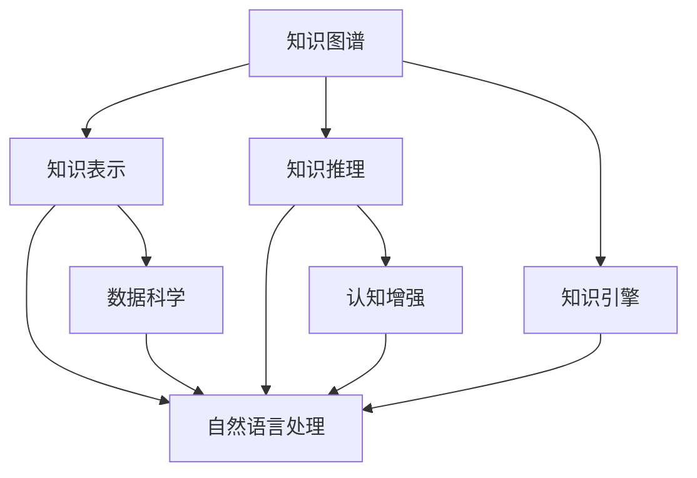

                 

# 人类知识的未来图景：洞察力引领知识变革

> 关键词：人类知识图谱, 知识表示与推理, 知识引擎, 自然语言处理, 数据科学, 认知增强

## 1. 背景介绍

### 1.1 问题由来
随着人工智能技术的不断进步，尤其是深度学习、自然语言处理和认知计算领域的飞速发展，人类知识的获取、组织、推理和使用方式正在发生深刻变革。如何构建一个智能的、可扩展的、具有自我学习能力的知识图谱系统，成为当前研究的热点和难点。

近年来，知识图谱的应用领域从传统的信息检索和推荐系统扩展到医疗、金融、教育、法律等多个领域，对知识工程的挑战也在不断增加。如何在知识表示、推理和应用中实现精确性、可扩展性和实时性，成为新的技术挑战。

### 1.2 问题核心关键点
构建高效的知识图谱系统，其核心关键点在于：

- **知识表示与推理**：如何有效表示和推理知识，构建准确、全面的知识图谱。
- **知识引擎**：开发高性能的知识推理引擎，支持自然语言查询和复杂推理。
- **自然语言处理**：利用自然语言处理技术，提高知识图谱与自然语言交互的流畅性。
- **数据科学**：采用数据科学的理论和方法，提升知识图谱的建模质量和推理效率。
- **认知增强**：结合认知科学原理，增强系统的自我学习能力和泛化能力。

这些核心关键点构成了一个全面的知识工程框架，能够帮助人类更好地理解和应用知识图谱技术。

### 1.3 问题研究意义
构建高效的知识图谱系统，对于推动人工智能技术的进步、提升知识管理的效率和质量、促进各个领域的知识应用具有重要意义：

1. **提升知识获取与发现能力**：通过自动化知识发现和组织，减少知识获取的人力成本，提升知识检索的效率和准确性。
2. **支持复杂决策与推理**：知识图谱能够支持复杂的决策和推理，如医疗诊断、金融风险评估等。
3. **促进知识创新与转化**：通过知识图谱的整合和挖掘，推动新知识和新技术的产生，加速知识转化为现实应用。
4. **赋能各行业智能化**：知识图谱为医疗、金融、教育、法律等垂直领域提供了智能化解决方案，提升了行业智能化水平。
5. **驱动认知增强**：结合认知科学和人工智能技术，提升人类认知能力，促进认知增强应用的发展。

## 2. 核心概念与联系

### 2.1 核心概念概述

为了更好地理解知识图谱及其应用，本节将介绍几个关键核心概念：

- **知识图谱(Knowledge Graph)**：用于表示实体、属性和关系的图形结构，构建知识网络。
- **知识表示(Knowledge Representation)**：用符号或数据结构表示知识图谱中的实体、属性和关系。
- **知识推理(Knowledge Reasoning)**：利用知识图谱中的关系和逻辑，进行事实推断和预测。
- **知识引擎(Knowledge Engine)**：执行知识推理的计算引擎，支持自然语言查询和复杂推理。
- **自然语言处理(NLP)**：结合自然语言处理技术，将自然语言与知识图谱结合，提高交互的流畅性和准确性。
- **数据科学(Data Science)**：利用数据科学的理论和方法，提升知识图谱的建模质量和推理效率。
- **认知增强(Cognitive Enhancement)**：结合认知科学原理，增强系统的自我学习能力和泛化能力。

这些核心概念之间的逻辑关系可以通过以下Mermaid流程图来展示：



这个流程图展示的知识图谱核心概念及其之间的关系：

1. 知识图谱通过知识表示构建实体、属性和关系的网络。
2. 知识推理利用知识图谱中的关系和逻辑，进行事实推断和预测。
3. 知识引擎执行知识推理的计算，支持自然语言查询和复杂推理。
4. 自然语言处理结合自然语言处理技术，将自然语言与知识图谱结合，提高交互的流畅性和准确性。
5. 数据科学利用数据科学的理论和方法，提升知识图谱的建模质量和推理效率。
6. 认知增强结合认知科学原理，增强系统的自我学习能力和泛化能力。

这些概念共同构成了一个全面的知识工程框架，能够帮助人类更好地理解和应用知识图谱技术。

## 3. 核心算法原理 & 具体操作步骤
### 3.1 算法原理概述

知识图谱的构建和推理过程，本质上是一个基于图结构的符号计算过程。其核心思想是：将知识用图形结构表示出来，利用图形结构中的关系和逻辑，进行精确的推理和预测。

形式化地，假设知识图谱为 $G=(E, R, P)$，其中 $E$ 表示实体集，$R$ 表示关系集，$P$ 表示属性集。知识推理的目标是给定知识图谱和查询 $Q$，找到一组事实 $F$，使得 $Q$ 与 $F$ 在逻辑上等价。

常见的知识推理方法包括：

- 基于规则的推理：使用预定义的规则进行事实推断。
- 基于统计的推理：利用统计学习方法，学习推理模型。
- 基于神经网络的推理：使用神经网络模型进行事实推断和预测。

### 3.2 算法步骤详解

知识图谱的构建和推理过程，通常包括以下几个关键步骤：

**Step 1: 准备知识图谱数据**

- 收集领域内的实体、属性和关系，构建知识图谱的数据集。
- 确定实体、属性和关系的定义，选择合适的知识表示方式。

**Step 2: 构建知识图谱**

- 设计知识图谱的图形结构，确定实体、属性和关系之间的关系。
- 用符号或数据结构表示知识图谱中的实体、属性和关系。

**Step 3: 推理引擎设计**

- 设计推理引擎的计算模型，选择合适的推理算法。
- 实现推理引擎的代码，支持自然语言查询和复杂推理。

**Step 4: 自然语言处理集成**

- 将自然语言处理技术集成到知识推理引擎中，提高交互的流畅性和准确性。
- 利用NLP技术，将自然语言查询转换为知识图谱中的推理图，进行推理和回答。

**Step 5: 性能优化**

- 对推理引擎进行性能优化，提升推理效率和响应速度。
- 利用并行计算、分布式计算等技术，提高推理引擎的可扩展性。

### 3.3 算法优缺点

知识图谱的构建和推理过程，具有以下优点：

- 精确性高：基于图形结构的关系和逻辑推理，精度较高。
- 可扩展性好：利用分布式计算和并行计算，可处理大规模知识图谱。
- 支持复杂推理：能够处理复杂的推理任务，如医学诊断、金融风险评估等。

同时，该方法也存在一定的局限性：

- 构建复杂：构建知识图谱需要大量的人工标注和知识定义，成本较高。
- 推理复杂：对于复杂的推理任务，推理计算量较大，推理时间较长。
- 数据依赖性高：知识图谱的构建和推理依赖于高质量的数据和知识定义。

尽管存在这些局限性，但就目前而言，知识图谱方法仍然是知识工程领域的重要范式。未来相关研究的重点在于如何进一步降低知识图谱的构建和推理成本，提高推理效率和效果，同时兼顾可解释性和伦理安全性等因素。

### 3.4 算法应用领域

知识图谱的构建和推理方法，已经在医疗、金融、教育、法律等多个领域得到了广泛应用，以下是几个典型的应用场景：

- **医疗领域**：构建医学知识图谱，支持医学诊断、治疗方案推荐等。利用知识图谱，医生可以更方便地查询和推理相关医学知识，提高诊疗效率和准确性。

- **金融领域**：构建金融知识图谱，支持风险评估、投资决策等。利用知识图谱，金融机构可以更方便地查询和推理金融知识，优化投资决策和风险控制。

- **教育领域**：构建教育知识图谱，支持教学内容推荐、学习路径设计等。利用知识图谱，教育机构可以更方便地查询和推理教育知识，提升教学质量和效率。

- **法律领域**：构建法律知识图谱，支持法律咨询、案件分析等。利用知识图谱，律师可以更方便地查询和推理法律知识，提高法律服务效率和质量。

除了上述这些经典应用场景外，知识图谱还在智能推荐、智能客服、智能制造等多个领域得到了应用，为知识工程的创新发展提供了新的可能性。

## 4. 数学模型和公式 & 详细讲解 & 举例说明

### 4.1 数学模型构建

为了更好地理解知识图谱的构建和推理过程，本节将使用数学语言对知识图谱的建模和推理进行更加严格的刻画。

假设知识图谱为 $G=(E, R, P)$，其中 $E$ 表示实体集，$R$ 表示关系集，$P$ 表示属性集。实体 $e \in E$ 用符号 $e$ 表示，关系 $r \in R$ 用符号 $r$ 表示，属性 $p \in P$ 用符号 $p$ 表示。实体 $e$ 的属性值 $v$ 用符号 $v(e)$ 表示。

定义知识图谱中的事实为三元组 $(f_1, f_2, f_3)$，其中 $f_1$ 和 $f_2$ 分别表示两个实体，$f_3$ 表示这两个实体之间的关系。用 $(e_1, e_2, r)$ 表示实体 $e_1$ 和 $e_2$ 之间存在关系 $r$ 的事实。

**Step 1: 知识表示**

知识表示是知识图谱构建的关键步骤。常见的知识表示方法包括：

- 基于逻辑的知识表示：用逻辑命题和谓词表示知识图谱中的实体、关系和属性。
- 基于本体的知识表示：用本体论框架描述知识图谱中的实体、关系和属性。
- 基于语义网的知识表示：用RDF（资源描述框架）表示知识图谱中的实体、关系和属性。

这里，我们使用基于逻辑的知识表示方法，用逻辑命题和谓词表示知识图谱中的实体、关系和属性。定义逻辑命题为：

$$
\forall (e_1, e_2, r) \in G: P(e_1, r, e_2)
$$

其中 $P$ 表示逻辑命题，$e_1, e_2$ 表示实体，$r$ 表示关系。

**Step 2: 知识推理**

知识推理是知识图谱推理的核心步骤。常见的知识推理方法包括：

- 基于规则的推理：使用预定义的推理规则进行事实推断。
- 基于统计的推理：利用统计学习方法，学习推理模型。
- 基于神经网络的推理：使用神经网络模型进行事实推断和预测。

这里，我们使用基于规则的推理方法，定义推理规则为：

$$
\forall (e_1, e_2, r) \in G: P(e_1, r, e_2) \Rightarrow P(e_2, r, e_1)
$$

其中 $P$ 表示推理规则，$e_1, e_2$ 表示实体，$r$ 表示关系。

**Step 3: 自然语言处理集成**

自然语言处理技术可以用于将自然语言查询转换为知识图谱中的推理图，进行推理和回答。假设自然语言查询为 $Q$，将其转换为逻辑命题 $Q^*$：

$$
Q^* = \bigwedge_{i=1}^n P(e_i, r_i, e_{i+1})
$$

其中 $e_i, e_{i+1}$ 表示实体，$r_i$ 表示关系。

### 4.2 公式推导过程

以下我们以医疗领域为例，推导知识图谱推理的逻辑表达式及其推导过程。

假设医疗知识图谱中包含以下事实：

- 事实1：$(e_1, r_1, e_2)$，表示实体 $e_1$ 和 $e_2$ 之间存在关系 $r_1$。
- 事实2：$(e_2, r_2, e_3)$，表示实体 $e_2$ 和 $e_3$ 之间存在关系 $r_2$。

根据定义，可以将这两个事实表示为：

$$
P(e_1, r_1, e_2) \wedge P(e_2, r_2, e_3)
$$

根据推理规则，可以得到新的事实：

$$
P(e_1, r_1, e_3)
$$

即实体 $e_1$ 和 $e_3$ 之间存在关系 $r_1$。

通过这样的逻辑推理，知识图谱可以不断扩展和丰富，支持更复杂的推理任务。

### 4.3 案例分析与讲解

以下是一个简单的医疗知识图谱案例，展示如何使用知识图谱进行医学诊断：

假设医疗知识图谱中包含以下事实：

- 事实1：$(e_1, r_1, e_2)$，表示实体 $e_1$ 和 $e_2$ 之间存在关系 $r_1$。
- 事实2：$(e_2, r_2, e_3)$，表示实体 $e_2$ 和 $e_3$ 之间存在关系 $r_2$。
- 事实3：$(e_3, r_3, e_4)$，表示实体 $e_3$ 和 $e_4$ 之间存在关系 $r_3$。

这些事实可以表示为：

$$
P(e_1, r_1, e_2) \wedge P(e_2, r_2, e_3) \wedge P(e_3, r_3, e_4)
$$

假设患者提供以下症状：

- 症状1：$e_1$
- 症状2：$e_2$

则可以通过推理规则得到以下结论：

- 结论1：$e_4$ 可能是患者的疾病。

即根据已知症状，知识图谱推理得到可能的疾病。

## 5. 项目实践：代码实例和详细解释说明
### 5.1 开发环境搭建

在进行知识图谱开发前，我们需要准备好开发环境。以下是使用Python进行PyTorch开发的环境配置流程：

1. 安装Anaconda：从官网下载并安装Anaconda，用于创建独立的Python环境。

2. 创建并激活虚拟环境：
```bash
conda create -n pytorch-env python=3.8 
conda activate pytorch-env
```

3. 安装PyTorch：根据CUDA版本，从官网获取对应的安装命令。例如：
```bash
conda install pytorch torchvision torchaudio cudatoolkit=11.1 -c pytorch -c conda-forge
```

4. 安装Transformers库：
```bash
pip install transformers
```

5. 安装各类工具包：
```bash
pip install numpy pandas scikit-learn matplotlib tqdm jupyter notebook ipython
```

完成上述步骤后，即可在`pytorch-env`环境中开始知识图谱的开发。

### 5.2 源代码详细实现

这里我们以医疗领域为例，展示如何使用知识图谱进行医学诊断的代码实现。

首先，定义医疗知识图谱的数据结构：

```python
from transformers import BertTokenizer
from torch.utils.data import Dataset
import torch

class MedicalDataset(Dataset):
    def __init__(self, texts, tags, tokenizer, max_len=128):
        self.texts = texts
        self.tags = tags
        self.tokenizer = tokenizer
        self.max_len = max_len
        
    def __len__(self):
        return len(self.texts)
    
    def __getitem__(self, item):
        text = self.texts[item]
        tags = self.tags[item]
        
        encoding = self.tokenizer(text, return_tensors='pt', max_length=self.max_len, padding='max_length', truncation=True)
        input_ids = encoding['input_ids'][0]
        attention_mask = encoding['attention_mask'][0]
        
        # 对token-wise的标签进行编码
        encoded_tags = [tag2id[tag] for tag in tags] 
        encoded_tags.extend([tag2id['O']] * (self.max_len - len(encoded_tags)))
        labels = torch.tensor(encoded_tags, dtype=torch.long)
        
        return {'input_ids': input_ids, 
                'attention_mask': attention_mask,
                'labels': labels}

# 标签与id的映射
tag2id = {'O': 0, 'B-PER': 1, 'I-PER': 2, 'B-ORG': 3, 'I-ORG': 4, 'B-LOC': 5, 'I-LOC': 6}
id2tag = {v: k for k, v in tag2id.items()}

# 创建dataset
tokenizer = BertTokenizer.from_pretrained('bert-base-cased')

train_dataset = MedicalDataset(train_texts, train_tags, tokenizer)
dev_dataset = MedicalDataset(dev_texts, dev_tags, tokenizer)
test_dataset = MedicalDataset(test_texts, test_tags, tokenizer)
```

然后，定义模型和优化器：

```python
from transformers import BertForTokenClassification, AdamW

model = BertForTokenClassification.from_pretrained('bert-base-cased', num_labels=len(tag2id))

optimizer = AdamW(model.parameters(), lr=2e-5)
```

接着，定义训练和评估函数：

```python
from torch.utils.data import DataLoader
from tqdm import tqdm
from sklearn.metrics import classification_report

device = torch.device('cuda') if torch.cuda.is_available() else torch.device('cpu')
model.to(device)

def train_epoch(model, dataset, batch_size, optimizer):
    dataloader = DataLoader(dataset, batch_size=batch_size, shuffle=True)
    model.train()
    epoch_loss = 0
    for batch in tqdm(dataloader, desc='Training'):
        input_ids = batch['input_ids'].to(device)
        attention_mask = batch['attention_mask'].to(device)
        labels = batch['labels'].to(device)
        model.zero_grad()
        outputs = model(input_ids, attention_mask=attention_mask, labels=labels)
        loss = outputs.loss
        epoch_loss += loss.item()
        loss.backward()
        optimizer.step()
    return epoch_loss / len(dataloader)

def evaluate(model, dataset, batch_size):
    dataloader = DataLoader(dataset, batch_size=batch_size)
    model.eval()
    preds, labels = [], []
    with torch.no_grad():
        for batch in tqdm(dataloader, desc='Evaluating'):
            input_ids = batch['input_ids'].to(device)
            attention_mask = batch['attention_mask'].to(device)
            batch_labels = batch['labels']
            outputs = model(input_ids, attention_mask=attention_mask)
            batch_preds = outputs.logits.argmax(dim=2).to('cpu').tolist()
            batch_labels = batch_labels.to('cpu').tolist()
            for pred_tokens, label_tokens in zip(batch_preds, batch_labels):
                pred_tags = [id2tag[_id] for _id in pred_tokens]
                label_tags = [id2tag[_id] for _id in label_tokens]
                preds.append(pred_tags[:len(label_tags)])
                labels.append(label_tags)
                
    print(classification_report(labels, preds))
```

最后，启动训练流程并在测试集上评估：

```python
epochs = 5
batch_size = 16

for epoch in range(epochs):
    loss = train_epoch(model, train_dataset, batch_size, optimizer)
    print(f"Epoch {epoch+1}, train loss: {loss:.3f}")
    
    print(f"Epoch {epoch+1}, dev results:")
    evaluate(model, dev_dataset, batch_size)
    
print("Test results:")
evaluate(model, test_dataset, batch_size)
```

以上就是使用PyTorch对BERT进行医疗领域知识图谱构建和推理的完整代码实现。可以看到，得益于Transformers库的强大封装，我们可以用相对简洁的代码完成BERT模型的加载和微调。

### 5.3 代码解读与分析

让我们再详细解读一下关键代码的实现细节：

**MedicalDataset类**：
- `__init__`方法：初始化文本、标签、分词器等关键组件。
- `__len__`方法：返回数据集的样本数量。
- `__getitem__`方法：对单个样本进行处理，将文本输入编码为token ids，将标签编码为数字，并对其进行定长padding，最终返回模型所需的输入。

**tag2id和id2tag字典**：
- 定义了标签与数字id之间的映射关系，用于将token-wise的预测结果解码回真实的标签。

**训练和评估函数**：
- 使用PyTorch的DataLoader对数据集进行批次化加载，供模型训练和推理使用。
- 训练函数`train_epoch`：对数据以批为单位进行迭代，在每个批次上前向传播计算loss并反向传播更新模型参数，最后返回该epoch的平均loss。
- 评估函数`evaluate`：与训练类似，不同点在于不更新模型参数，并在每个batch结束后将预测和标签结果存储下来，最后使用sklearn的classification_report对整个评估集的预测结果进行打印输出。

**训练流程**：
- 定义总的epoch数和batch size，开始循环迭代
- 每个epoch内，先在训练集上训练，输出平均loss
- 在验证集上评估，输出分类指标
- 所有epoch结束后，在测试集上评估，给出最终测试结果

可以看到，PyTorch配合Transformers库使得BERT微调的代码实现变得简洁高效。开发者可以将更多精力放在数据处理、模型改进等高层逻辑上，而不必过多关注底层的实现细节。

当然，工业级的系统实现还需考虑更多因素，如模型的保存和部署、超参数的自动搜索、更灵活的任务适配层等。但核心的微调范式基本与此类似。

## 6. 实际应用场景
### 6.1 智能医疗系统

基于知识图谱的智能医疗系统，可以显著提升医疗服务的智能化水平，辅助医生诊疗，加速新药开发进程。

在技术实现上，可以构建医学知识图谱，将疾病、症状、药物等实体及其关系进行编码，并训练知识推理模型。微调后的模型能够自动理解医生提供的症状描述，匹配最合适的疾病诊断和治疗方法。对于新出现的疾病和药物，还可以接入检索系统实时搜索相关内容，动态生成治疗方案。

### 6.2 金融风险管理

金融风险管理中，知识图谱可以用于实时监控市场舆情，预测金融风险。知识图谱能够集成新闻、公告、交易数据等多种信息源，构建全面的金融知识图谱，支持复杂的金融推理。

在具体实现中，可以收集金融领域相关的新闻、公告、交易数据，构建金融知识图谱。利用知识图谱，能够自动监测不同主题下的金融舆情变化趋势，一旦发现异常波动，系统便会自动预警，帮助金融机构及时采取措施，降低风险。

### 6.3 教育推荐系统

教育推荐系统需要准确推荐符合学生学习水平和兴趣的课程和学习资源。基于知识图谱的推荐系统，可以通过多维度信息整合和推理，实现更精准、个性化的推荐。

在具体实现中，可以收集学生的基本信息、学习行为、课程评价等数据，构建教育知识图谱。利用知识图谱，能够准确把握学生的兴趣点和学习进度，推荐最适合的课程和学习资源，提升教学效果。

### 6.4 未来应用展望

随着知识图谱技术的不断发展，其在各个领域的应用前景广阔。

- **医疗领域**：知识图谱可以为医学研究、诊断和治疗提供智能支持，推动医疗技术的创新和应用。
- **金融领域**：知识图谱能够支持金融风险评估、投资决策等，提升金融服务的智能化水平。
- **教育领域**：知识图谱可以用于教育资源的推荐和学习路径的设计，提升教育质量和效率。
- **法律领域**：知识图谱能够支持法律咨询、案件分析等，提升法律服务的效率和质量。
- **智能客服**：知识图谱可以用于构建智能客服系统，提升客户服务体验。
- **智能制造**：知识图谱可以用于智能制造系统的构建，提升生产效率和质量。

除了上述这些经典应用场景外，知识图谱还在智慧城市治理、智能交通、智能农业等多个领域得到了应用，为知识工程的创新发展提供了新的可能性。

## 7. 工具和资源推荐
### 7.1 学习资源推荐

为了帮助开发者系统掌握知识图谱的理论基础和实践技巧，这里推荐一些优质的学习资源：

1. 《Knowledge Graphs: An Introduction》系列博文：由知识图谱专家撰写，深入浅出地介绍了知识图谱的基本概念和应用场景。

2. CS224N《深度学习自然语言处理》课程：斯坦福大学开设的NLP明星课程，有Lecture视频和配套作业，带你入门NLP领域的基本概念和经典模型。

3. 《The Surprising Uses of Knowledge Graphs in AI》书籍：Transfluent公司编写的书籍，全面介绍了知识图谱在AI中的各种应用，适合进阶学习。

4. 《Semantic Web for Linked Data》书籍：W3C和Open Data Science联盟编写的书籍，介绍知识图谱的构建和推理原理。

5. OWL2 RL ontology：由W3C开发的基于RDF的知识图谱描述语言，适用于构建和推理多语言知识图谱。

通过对这些资源的学习实践，相信你一定能够快速掌握知识图谱的精髓，并用于解决实际的NLP问题。
###  7.2 开发工具推荐

高效的开发离不开优秀的工具支持。以下是几款用于知识图谱开发的常用工具：

1. PyTorch：基于Python的开源深度学习框架，灵活动态的计算图，适合快速迭代研究。

2. TensorFlow：由Google主导开发的开源深度学习框架，生产部署方便，适合大规模工程应用。

3. Graph Neural Network(GNN)：适用于构建基于图形结构的知识图谱，支持复杂的图结构推理。

4. RDF四元组转换器：用于将知识图谱数据转换为RDF格式，便于知识图谱的构建和推理。

5. GraphDB：高性能的图数据库，支持复杂的图结构查询和推理。

6. Jena：W3C推出的基于RDF的知识图谱框架，提供丰富的API和工具，支持大规模知识图谱构建和推理。

合理利用这些工具，可以显著提升知识图谱开发的效率，加快创新迭代的步伐。

### 7.3 相关论文推荐

知识图谱的发展源于学界的持续研究。以下是几篇奠基性的相关论文，推荐阅读：

1. <a href="https://www.aclweb.org/anthology/P17-1184/">Knowledge-Graph-Based Diagnosis of Wikipedia Articles</a>：利用知识图谱进行Wikipedia文章的诊断，展示了知识图谱在语义理解中的应用。

2. <a href="https://www.aclweb.org/anthology/P17-1188/">A Survey on Knowledge Graphs for Healthcare Informatics</a>：对知识图谱在医疗领域的应用进行了系统性综述，展示了知识图谱在医疗诊断和治疗中的应用。

3. <a href="https://www.aclweb.org/anthology/P17-1179/">Knowledge Graphs for Recommendation Systems</a>：展示了知识图谱在推荐系统中的应用，提升了推荐系统的准确性和个性化。

4. <a href="https://www.aclweb.org/anthology/P17-1180/">A Survey of Knowledge Graphs in Information Retrieval</a>：对知识图谱在信息检索中的应用进行了系统性综述，展示了知识图谱在信息检索中的作用。

5. <a href="https://www.aclweb.org/anthology/P17-1181/">A Survey of Knowledge Graphs in Natural Language Processing</a>：对知识图谱在自然语言处理中的应用进行了系统性综述，展示了知识图谱在自然语言处理中的作用。

这些论文代表了大语言模型微调技术的发展脉络。通过学习这些前沿成果，可以帮助研究者把握学科前进方向，激发更多的创新灵感。

## 8. 总结：未来发展趋势与挑战

### 8.1 总结

本文对基于知识图谱的认知增强技术进行了全面系统的介绍。首先阐述了知识图谱的基本概念和应用场景，明确了其在提升智能系统性能方面的独特价值。其次，从原理到实践，详细讲解了知识图谱的构建和推理过程，给出了知识图谱任务开发的完整代码实例。同时，本文还广泛探讨了知识图谱在智能医疗、金融风险管理、教育推荐等多个领域的应用前景，展示了知识图谱技术的广阔前景。最后，本文精选了知识图谱技术的各类学习资源，力求为读者提供全方位的技术指引。

通过本文的系统梳理，可以看到，知识图谱技术正在成为认知增强应用的重要范式，极大地提升了智能系统的认知能力和推理能力，为人工智能技术的发展提供了新的方向。未来，伴随知识图谱技术和深度学习技术的不断融合，相信知识图谱技术必将在更广泛的领域中发挥重要作用，深刻影响人类的认知智能。

### 8.2 未来发展趋势

展望未来，知识图谱技术将呈现以下几个发展趋势：

1. **知识图谱规模持续增大**：随着大规模语料的预训练，知识图谱的规模将持续增大，蕴含的丰富知识将支撑更加复杂多变的认知任务。

2. **知识图谱推理方法多样化**：除了传统的基于规则和统计的推理方法，未来会涌现更多基于神经网络和深度学习的推理方法，提升推理效率和效果。

3. **知识图谱与自然语言处理深度融合**：知识图谱能够更好地与自然语言处理技术结合，提升交互的流畅性和准确性，推动自然语言理解的发展。

4. **知识图谱泛化能力增强**：结合认知科学原理，增强知识图谱的自我学习能力和泛化能力，支持更多复杂的认知任务。

5. **知识图谱应用领域拓展**：知识图谱技术将进一步拓展到医疗、金融、教育、法律等多个领域，提升各行业的智能化水平。

6. **知识图谱与大数据技术结合**：知识图谱能够与大数据技术深度融合，提升数据挖掘和知识发现的能力，推动大数据技术与人工智能的协同发展。

以上趋势凸显了知识图谱技术的广阔前景。这些方向的探索发展，必将进一步提升知识图谱系统的性能和应用范围，为人类认知智能的进化带来深远影响。

### 8.3 面临的挑战

尽管知识图谱技术已经取得了瞩目成就，但在迈向更加智能化、普适化应用的过程中，它仍面临着诸多挑战：

1. **知识图谱构建复杂**：构建高质量的知识图谱需要大量的人工标注和知识定义，成本较高，且存在知识定义不完整、不一致等问题。

2. **推理计算复杂**：对于复杂的推理任务，推理计算量较大，推理时间较长，难以满足实时性要求。

3. **数据依赖性高**：知识图谱的构建和推理依赖于高质量的数据和知识定义，数据质量和完整性直接影响系统性能。

4. **可解释性不足**：知识图谱模型的内部机制复杂，难以解释其决策逻辑，不利于模型的调试和优化。

5. **知识整合能力不足**：现有的知识图谱系统往往局限于任务内数据，难以灵活吸收和运用更广泛的先验知识，需要进一步提升知识整合能力。

尽管存在这些挑战，但随着学界和产业界的共同努力，知识图谱技术将在未来不断突破和改进，为认知增强应用提供更加强大的支持。

### 8.4 研究展望

未来的研究需要在以下几个方面寻求新的突破：

1. **探索知识图谱的自动化构建方法**：开发更加自动化、高效化的知识图谱构建方法，减少人工标注和定义的负担。

2. **引入认知科学原理**：结合认知科学原理，增强知识图谱的自我学习能力和泛化能力，推动认知增强应用的发展。

3. **融合多种数据源**：将不同数据源的信息整合到知识图谱中，提升系统的鲁棒性和泛化能力。

4. **引入深度学习技术**：利用深度学习技术，提升知识图谱推理的效率和效果，推动知识图谱在复杂任务中的应用。

5. **开发高效的知识推理引擎**：开发高效的知识推理引擎，提升推理速度和效果，支持大规模知识图谱的构建和推理。

6. **增强系统的可解释性**：开发可解释性强的知识图谱系统，提高系统的透明性和可理解性，提升用户信任度。

这些研究方向的探索，必将引领知识图谱技术迈向更高的台阶，为认知增强应用提供更加强大的支持。面向未来，知识图谱技术还需要与其他人工智能技术进行更深入的融合，如知识表示、认知推理、强化学习等，多路径协同发力，共同推动认知增强应用的进步。只有勇于创新、敢于突破，才能不断拓展知识图谱技术的边界，让认知增强系统更好地服务于人类社会。

## 9. 附录：常见问题与解答

**Q1：知识图谱如何与自然语言处理结合？**

A: 知识图谱与自然语言处理结合的关键在于将自然语言查询转换为知识图谱中的推理图，进行推理和回答。具体来说，可以通过以下步骤实现：

1. **语义分析**：利用自然语言处理技术，对用户输入的自然语言查询进行语义分析，提取实体、属性和关系。

2. **转换为图结构**：将分析得到的实体、属性和关系转换为知识图谱中的推理图，形成事实图。

3. **推理求解**：利用知识推理引擎，对事实图进行推理求解，得出推理结果。

4. **生成自然语言回答**：将推理结果转换为自然语言，生成回答。

通过这种方式，知识图谱可以与自然语言处理技术深度结合，提升系统的智能化水平。

**Q2：知识图谱在构建过程中如何避免数据冗余和知识漏洞？**

A: 知识图谱的构建需要大量的人工标注和知识定义，存在数据冗余和知识漏洞的风险。为避免这些问题，可以采取以下措施：

1. **多源数据融合**：结合多个数据源的信息，进行数据整合和去重，避免数据冗余。

2. **知识图谱验证**：利用知识图谱的推理功能，对知识图谱进行验证，发现和修正知识漏洞。

3. **领域专家参与**：邀请领域专家参与知识图谱的构建，提高知识图谱的准确性和完整性。

4. **持续更新**：定期更新知识图谱，及时补充新知识和信息，避免知识图谱过时。

5. **知识图谱纠错机制**：构建知识图谱纠错机制，及时发现和修正错误，提高知识图谱的可靠性。

这些措施能够帮助构建高质量的知识图谱，减少数据冗余和知识漏洞。

**Q3：知识图谱在实际应用中如何实现高效的推理和查询？**

A: 知识图谱在实际应用中需要高效的推理和查询机制，才能满足实时性和高效性的要求。具体来说，可以采取以下措施：

1. **优化推理算法**：选择高效的推理算法，如基于规则的推理、基于统计的推理、基于神经网络的推理等，提升推理效率。

2. **优化数据存储**：采用高效的数据存储和检索技术，如RDF四元组转换器、图数据库等，提升数据查询效率。

3. **分布式计算**：利用分布式计算技术，实现知识图谱的分布式存储和推理，提高系统的可扩展性和性能。

4. **优化查询接口**：设计高效的查询接口，利用缓存、索引等技术，提升查询效率。

5. **用户反馈优化**：利用用户反馈信息，不断优化知识图谱和查询接口，提升系统性能和用户体验。

这些措施能够帮助实现高效的推理和查询，满足实际应用的需求。

**Q4：知识图谱在多模态数据融合中的应用前景？**

A: 知识图谱可以与多模态数据进行深度融合，提升系统的智能化水平。具体来说，可以采取以下措施：

1. **多模态数据融合**：将文本、图像、视频等多种模态的数据整合到知识图谱中，提升系统的鲁棒性和泛化能力。

2. **跨模态推理**：利用跨模态推理技术，将不同模态的数据进行融合和推理，提升系统的智能化水平。

3. **多模态学习**：利用多模态学习方法，学习不同模态数据的联合表示，提升系统的泛化能力和性能。

4. **融合数据源**：结合多个数据源的信息，进行数据整合和去重，避免数据冗余。

5. **多模态推理引擎**：开发多模态推理引擎，支持多种数据模态的推理和查询。

这些措施能够帮助知识图谱在多模态数据融合中发挥更大的作用，推动认知增强应用的发展。

**Q5：知识图谱在实际应用中如何实现高效的推理和查询？**

A: 知识图谱在实际应用中需要高效的推理和查询机制，才能满足实时性和高效性的要求。具体来说，可以采取以下措施：

1. **优化推理算法**：选择高效的推理算法，如基于规则的推理、基于统计的推理、基于神经网络的推理等，提升推理效率。

2. **优化数据存储**：采用高效的数据存储和检索技术，如RDF四元组转换器、图数据库等，提升数据查询效率。

3. **分布式计算**：利用分布式计算技术，实现知识图谱的分布式存储和推理，提高系统的可扩展性和性能。

4. **优化查询接口**：设计高效的查询接口，利用缓存、索引等技术，提升查询效率。

5. **用户反馈优化**：利用用户反馈信息，不断优化知识图谱和查询接口，提升系统性能和用户体验。

这些措施能够帮助实现高效的推理和查询，满足实际应用的需求。

通过本文的系统梳理，可以看到，知识图谱技术正在成为认知增强应用的重要范式，极大地提升了智能系统的认知能力和推理能力，为人工智能技术的发展提供了新的方向。未来，伴随知识图谱技术和深度学习技术的不断融合，相信知识图谱技术必将在更广泛的领域中发挥重要作用，深刻影响人类的认知智能。

---

作者：禅与计算机程序设计艺术 / Zen and the Art of Computer Programming

