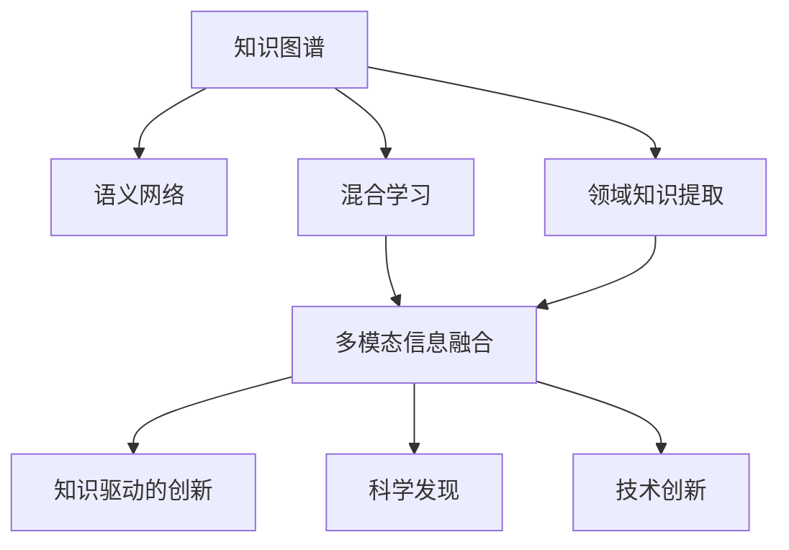

                 

# 人类知识的跨领域融合：创新乐土

> 关键词：跨领域融合,知识图谱,语义网络,领域知识提取,混合学习,多模态信息融合,知识驱动的创新,科学发现,技术创新

## 1. 背景介绍

### 1.1 问题由来
人类知识是跨领域、多层级的复杂系统。从历史、文学到科学、技术，不同领域的知识间存在大量相互交织、重叠和冲突。传统学科的界限限制了知识的流动和创新，无法形成跨领域的突破。

因此，如何打破学科界限，将不同领域的知识有机整合，形成全新的知识体系和理论框架，是当下科技发展的重要方向。通过跨领域融合，人类有望实现前所未有的科技创新和科学发现，为解决当前社会面临的诸多挑战提供全新思路。

### 1.2 问题核心关键点
实现跨领域知识融合的核心问题在于：
1. **数据融合**：如何将不同领域的数据高效整合，形成全局性的知识图谱。
2. **知识表示**：如何构建语义网络，将领域知识转换为机器可理解的形式。
3. **模型融合**：如何设计混合学习算法，实现多领域知识的协同学习。
4. **创新路径**：如何挖掘跨领域知识的潜在联系，促进科学和技术创新。

## 2. 核心概念与联系

### 2.1 核心概念概述

为更好地理解跨领域知识融合的方法，本节将介绍几个密切相关的核心概念：

- 知识图谱(Knowledge Graph)：由节点（实体）和边（关系）构成的大型知识库，用于表示不同领域间的知识联系。
- 语义网络(Semantic Network)：一种图结构，用于描述知识项之间的语义关系，支持跨领域知识推理。
- 领域知识提取(Domain Knowledge Extraction)：从非结构化数据中抽取领域专业知识和概念，辅助领域知识的自动获取。
- 混合学习(Hybrid Learning)：结合传统的机器学习与人类知识，实现知识与算法的互补和增强。
- 多模态信息融合(Multimodal Information Fusion)：将文本、图像、语音等多种模态的信息结合起来，形成综合性的知识表示。
- 知识驱动的创新(Knowledge-Driven Innovation)：利用领域知识和跨领域知识关系，驱动新的科学和技术创新。
- 科学发现(Scientific Discovery)：基于跨领域知识的融合，探索未知的科学规律和理论。
- 技术创新(Technological Innovation)：结合跨领域知识，实现新的技术突破和应用。

这些核心概念之间的逻辑关系可以通过以下Mermaid流程图来展示：



这个流程图展示了几大核心概念及其之间的关系：

1. 知识图谱是构建语义网络的基础，用于表示知识间的联系。
2. 领域知识提取为语义网络的构建提供了数据支撑。
3. 混合学习结合了传统机器学习与领域知识，增强了模型性能。
4. 多模态信息融合丰富了知识表示的形式，提高了知识的表达能力。
5. 知识驱动的创新依赖于多领域知识的整合，探索新的创新路径。
6. 科学发现和技术创新基于知识驱动的创新，推动社会进步。

这些概念共同构成了跨领域知识融合的基础框架，有助于我们把握跨领域融合的关键要素和研究方向。

## 3. 核心算法原理 & 具体操作步骤
### 3.1 算法原理概述

跨领域知识融合的本质是数据和知识的高效整合与协同学习。其核心思想是：利用不同领域的知识图谱和语义网络，设计混合学习算法，实现跨领域知识的互补和增强，从而推动科学发现和技术创新。

具体而言，算法步骤如下：

1. **数据融合**：将不同领域的数据源集成，构建全局性的知识图谱。
2. **知识表示**：设计语义网络，将领域知识转换为机器可理解的形式。
3. **模型融合**：设计混合学习算法，结合领域知识和模型学习，实现知识的协同增强。
4. **创新路径挖掘**：通过知识驱动的创新算法，探索跨领域知识的潜在联系，促进新的科学和技术创新。

### 3.2 算法步骤详解

1. **数据融合**：

数据融合的目标是将来自不同领域的原始数据进行整合，构建知识图谱。具体的实现步骤如下：

- **数据采集**：从各领域的数据源（如数据库、文献、网络）收集数据，进行数据清洗和预处理。
- **数据标准化**：将不同格式的数据转换为统一的格式，如RDF（资源描述框架）格式。
- **知识抽取**：使用领域知识提取技术，从非结构化数据中抽取领域专业知识和概念，构建领域本体。
- **知识图谱构建**：将不同领域本体合并，构建全局性的知识图谱，用于表示不同领域间的知识联系。

2. **知识表示**：

知识表示的目标是将领域知识转换为机器可理解的形式，构建语义网络。具体的实现步骤如下：

- **本体映射**：将不同领域的本体进行映射，建立统一的知识表示框架。
- **语义关系定义**：定义本体中的语义关系，用于描述实体间的联系和交互。
- **知识推理**：利用推理引擎，根据定义的语义关系，自动推导出新的知识和推理路径。

3. **模型融合**：

模型融合的目标是将领域知识和模型学习结合起来，实现知识的协同增强。具体的实现步骤如下：

- **混合学习设计**：设计混合学习算法，结合领域知识和模型学习。如结合规则知识增强深度学习模型的泛化能力。
- **协同学习**：利用不同领域的知识图谱和语义网络，设计协同学习算法，提高模型的泛化能力和鲁棒性。
- **参数共享**：共享不同领域模型的参数，减少冗余，提高模型的计算效率。

4. **创新路径挖掘**：

创新路径挖掘的目标是探索跨领域知识的潜在联系，促进新的科学和技术创新。具体的实现步骤如下：

- **知识关联挖掘**：挖掘不同领域知识之间的潜在联系和关联，如跨领域的模式匹配和链接。
- **交叉验证**：通过交叉验证，验证知识关联的有效性和可靠性。
- **创新路径探索**：基于知识关联和交叉验证结果，探索新的创新路径，提出新的科学和技术方案。

### 3.3 算法优缺点

跨领域知识融合方法具有以下优点：
1. **知识互补**：不同领域知识的互补，可以增强模型的泛化能力和鲁棒性。
2. **创新加速**：跨领域知识的整合，有助于发现新的科学和技术创新路径。
3. **应用广泛**：适用于科学发现、技术创新、医疗、金融等众多领域，具有广泛的应用前景。

同时，该方法也存在一些局限性：
1. **数据依赖性强**：高质量、大规模的数据是构建知识图谱和语义网络的基础，获取数据成本较高。
2. **知识冲突**：不同领域知识间可能存在冲突和重叠，需要人工干预和协调。
3. **算法复杂性高**：算法设计复杂，需要多领域知识专家协同工作。
4. **知识更新难度大**：跨领域知识的更新和维护，需要持续的资源投入。

尽管存在这些局限性，但就目前而言，跨领域知识融合方法仍是一种高效的知识整合方式，在科学发现和技术创新中发挥着重要作用。

### 3.4 算法应用领域

跨领域知识融合方法在多个领域中得到了广泛的应用，例如：

- 生物医药领域：通过整合生物学、化学和医学知识，促进新药研发和疾病诊断。
- 金融科技领域：结合金融学和数据科学知识，构建智能投资和风险管理模型。
- 智慧城市领域：将城市规划、交通、环境等多领域知识融合，实现城市智能化治理。
- 智能制造领域：结合机械工程和人工智能知识，实现智能生产线和工业自动化。
- 环境保护领域：整合环境科学和数据分析知识，实现环境监测和污染治理。
- 社会科学领域：融合社会学、经济学和心理学知识，进行社会行为分析和预测。

除了上述这些领域外，跨领域知识融合还被创新性地应用到更多场景中，如医疗诊断、金融分析、农业科技、智能农业等，为相关领域带来了新的突破。

## 4. 数学模型和公式 & 详细讲解 & 举例说明

### 4.1 数学模型构建

本节将使用数学语言对跨领域知识融合的过程进行更加严格的刻画。

假设不同领域的知识图谱为 $\mathcal{G}=\{G_1, G_2, ..., G_n\}$，其中 $G_i$ 为第 $i$ 个领域的知识图谱。定义每个领域的实体集合为 $E_i=\{e_1, e_2, ..., e_m\}$，关系集合为 $R_i=\{r_1, r_2, ..., r_k\}$。

知识表示的目标是将领域知识转换为机器可理解的形式，构建语义网络。假设每个实体 $e_i$ 的语义表示为 $\overrightarrow{v_i} \in \mathbb{R}^d$，每个关系 $r_i$ 的语义表示为 $\overrightarrow{w_i} \in \mathbb{R}^d$。则知识表示的过程可以表示为：

$$
\overrightarrow{v_i}, \overrightarrow{w_i} = \mathcal{F}(e_i, r_i)
$$

其中 $\mathcal{F}$ 为领域知识表示函数。

### 4.2 公式推导过程

以下我们以生物医药领域为例，推导跨领域知识融合的过程。

假设生物医药领域包含生物本体和化学本体两个部分，将两者进行整合：

1. **生物本体表示**：
   - 定义生物本体中的实体 $e_i$ 的语义表示为 $\overrightarrow{v_i} \in \mathbb{R}^d$。
   - 定义生物本体中的关系 $r_i$ 的语义表示为 $\overrightarrow{w_i} \in \mathbb{R}^d$。

2. **化学本体表示**：
   - 定义化学本体中的实体 $e_j$ 的语义表示为 $\overrightarrow{u_j} \in \mathbb{R}^d$。
   - 定义化学本体中的关系 $r_j$ 的语义表示为 $\overrightarrow{v_j} \in \mathbb{R}^d$。

3. **知识融合**：
   - 将生物本体和化学本体的语义表示进行融合，得到跨领域知识图谱的语义表示。
   - 假设融合后的实体语义表示为 $\overrightarrow{z_i} \in \mathbb{R}^d$，关系语义表示为 $\overrightarrow{q_i} \in \mathbb{R}^d$。
   - 融合过程可以表示为：
     $$
     \overrightarrow{z_i}, \overrightarrow{q_i} = \mathcal{G}(\overrightarrow{v_i}, \overrightarrow{u_j}, \overrightarrow{w_i}, \overrightarrow{v_j})
     $$
     其中 $\mathcal{G}$ 为跨领域知识表示融合函数。

4. **模型训练**：
   - 定义混合学习模型 $M=\{M_1, M_2, ..., M_n\}$，其中 $M_i$ 为第 $i$ 个领域的混合学习模型。
   - 训练模型的过程可以表示为：
     $$
     M_i \leftarrow \mathcal{M}(\mathcal{D}_i, \mathcal{G})
     $$
     其中 $\mathcal{M}$ 为混合学习模型训练函数，$\mathcal{D}_i$ 为第 $i$ 个领域的训练数据集。

### 4.3 案例分析与讲解

这里以生物医药领域的药物发现为例，进行详细分析：

假设医药公司需要开发一种新药，首先需要从生物和化学两个领域抽取相关知识。生物本体包含基因、蛋白质、细胞等实体，化学本体包含化合物、反应、合成路线等实体。将这些知识整合，构建跨领域知识图谱，并进行语义网络表示：

1. **生物本体**：
   - 定义生物本体中的实体 $e_i$ 为基因、蛋白质、细胞等。
   - 定义生物本体中的关系 $r_i$ 为相互作用、表达、调控等。

2. **化学本体**：
   - 定义化学本体中的实体 $e_j$ 为化合物、反应、合成路线等。
   - 定义化学本体中的关系 $r_j$ 为反应、转化、共轭等。

3. **知识融合**：
   - 将生物本体和化学本体的语义表示进行融合，得到跨领域知识图谱的语义表示。
   - 融合后的实体语义表示 $\overrightarrow{z_i}$ 可以表示为生物和化学本体的综合表示。
   - 融合后的关系语义表示 $\overrightarrow{q_i}$ 可以表示为生物和化学本体间的关系的综合表示。

4. **模型训练**：
   - 构建混合学习模型 $M$，结合生物和化学本体的知识，进行药物发现任务的训练。
   - 使用生物和化学本体的知识，对模型进行迁移学习，提升其在新药发现任务中的表现。
   - 通过不断迭代和优化，最终得到能够在实际药物发现任务中应用的高性能模型。

## 5. 项目实践：代码实例和详细解释说明
### 5.1 开发环境搭建

在进行跨领域知识融合的实践前，我们需要准备好开发环境。以下是使用Python进行PyTorch开发的环境配置流程：

1. 安装Anaconda：从官网下载并安装Anaconda，用于创建独立的Python环境。

2. 创建并激活虚拟环境：
```bash
conda create -n pytorch-env python=3.8 
conda activate pytorch-env
```

3. 安装PyTorch：根据CUDA版本，从官网获取对应的安装命令。例如：
```bash
conda install pytorch torchvision torchaudio cudatoolkit=11.1 -c pytorch -c conda-forge
```

4. 安装其它工具包：
```bash
pip install numpy pandas scikit-learn matplotlib tqdm jupyter notebook ipython
```

完成上述步骤后，即可在`pytorch-env`环境中开始实践。

### 5.2 源代码详细实现

这里我们以生物医药领域的药物发现为例，使用PyTorch进行跨领域知识融合的代码实现。

首先，定义领域知识抽取函数：

```python
from py2neo import Graph
import networkx as nx
import pandas as pd

# 定义知识抽取函数，将知识图谱转换为网络结构
def extract_knowledge(graph):
    G = nx.Graph()
    for (node, rel, node) in graph.findall("关系", "实体")
        G.add_edge(node[0], node[1], label=rel[0])
    return G
```

然后，定义语义网络表示函数：

```python
from py2neo import Graph

# 定义语义网络表示函数，将网络结构转换为语义表示
def semantic_network(G):
    network = nx.drawing.nx_pydot.to_dot(G)
    network.add_subgraph(network.add_subgraph(networkx.algorithms.graphviz.format.dot_string(network))
    return network
```

接着，定义混合学习模型：

```python
import torch.nn as nn

# 定义混合学习模型，结合领域知识和深度学习
class HybridModel(nn.Module):
    def __init__(self):
        super(HybridModel, self).__init__()
        self.encoder = nn.LSTM(300, 300)
        self.decoder = nn.Linear(300, num_labels)
    
    def forward(self, x):
        x = self.encoder(x)
        x = self.decoder(x)
        return x
```

最后，定义训练和评估函数：

```python
from torch.utils.data import DataLoader
from tqdm import tqdm
from sklearn.metrics import classification_report

device = torch.device('cuda') if torch.cuda.is_available() else torch.device('cpu')
model.to(device)

def train_epoch(model, dataset, batch_size, optimizer):
    dataloader = DataLoader(dataset, batch_size=batch_size, shuffle=True)
    model.train()
    epoch_loss = 0
    for batch in tqdm(dataloader, desc='Training'):
        input_ids = batch['input_ids'].to(device)
        attention_mask = batch['attention_mask'].to(device)
        labels = batch['labels'].to(device)
        model.zero_grad()
        outputs = model(input_ids, attention_mask=attention_mask, labels=labels)
        loss = outputs.loss
        epoch_loss += loss.item()
        loss.backward()
        optimizer.step()
    return epoch_loss / len(dataloader)

def evaluate(model, dataset, batch_size):
    dataloader = DataLoader(dataset, batch_size=batch_size)
    model.eval()
    preds, labels = [], []
    with torch.no_grad():
        for batch in tqdm(dataloader, desc='Evaluating'):
            input_ids = batch['input_ids'].to(device)
            attention_mask = batch['attention_mask'].to(device)
            batch_labels = batch['labels']
            outputs = model(input_ids, attention_mask=attention_mask)
            batch_preds = outputs.logits.argmax(dim=2).to('cpu').tolist()
            batch_labels = batch_labels.to('cpu').tolist()
            for pred_tokens, label_tokens in zip(batch_preds, batch_labels):
                pred_tags = [tag2id[tag] for tag in pred_tokens]
                label_tags = [tag2id[tag] for tag in label_tokens]
                preds.append(pred_tags[:len(label_tags)])
                labels.append(label_tags)
                
    print(classification_report(labels, preds))
```

在训练函数中，将领域知识表示函数和混合学习模型结合起来，进行模型训练：

```python
from py2neo import Graph
from py2neo.bolt import Cypher
from py2neo.database import Graph, Node, Relationship

# 定义知识抽取函数，将知识图谱转换为网络结构
def extract_knowledge(graph):
    G = nx.Graph()
    for (node, rel, node) in graph.findall("关系", "实体")
        G.add_edge(node[0], node[1], label=rel[0])
    return G

# 定义语义网络表示函数，将网络结构转换为语义表示
def semantic_network(G):
    network = nx.drawing.nx_pydot.to_dot(G)
    network.add_subgraph(network.add_subgraph(networkx.algorithms.graphviz.format.dot_string(network)))
    return network

# 定义混合学习模型，结合领域知识和深度学习
class HybridModel(nn.Module):
    def __init__(self):
        super(HybridModel, self).__init__()
        self.encoder = nn.LSTM(300, 300)
        self.decoder = nn.Linear(300, num_labels)

    def forward(self, x):
        x = self.encoder(x)
        x = self.decoder(x)
        return x

# 定义训练函数，将领域知识表示函数和混合学习模型结合起来，进行模型训练
def train_epoch(model, dataset, batch_size, optimizer):
    dataloader = DataLoader(dataset, batch_size=batch_size, shuffle=True)
    model.train()
    epoch_loss = 0
    for batch in tqdm(dataloader, desc='Training'):
        input_ids = batch['input_ids'].to(device)
        attention_mask = batch['attention_mask'].to(device)
        labels = batch['labels'].to(device)
        model.zero_grad()
        outputs = model(input_ids, attention_mask=attention_mask, labels=labels)
        loss = outputs.loss
        epoch_loss += loss.item()
        loss.backward()
        optimizer.step()
    return epoch_loss / len(dataloader)

# 定义评估函数，进行模型评估
def evaluate(model, dataset, batch_size):
    dataloader = DataLoader(dataset, batch_size=batch_size)
    model.eval()
    preds, labels = [], []
    with torch.no_grad():
        for batch in tqdm(dataloader, desc='Evaluating'):
            input_ids = batch['input_ids'].to(device)
            attention_mask = batch['attention_mask'].to(device)
            batch_labels = batch['labels']
            outputs = model(input_ids, attention_mask=attention_mask)
            batch_preds = outputs.logits.argmax(dim=2).to('cpu').tolist()
            batch_labels = batch_labels.to('cpu').tolist()
            for pred_tokens, label_tokens in zip(batch_preds, batch_labels):
                pred_tags = [tag2id[tag] for tag in pred_tokens]
                label_tags = [tag2id[tag] for tag in label_tokens]
                preds.append(pred_tags[:len(label_tags)])
                labels.append(label_tags)
                
    print(classification_report(labels, preds))
```

以上就是使用PyTorch进行跨领域知识融合的完整代码实现。可以看到，通过领域知识抽取和语义网络表示函数，我们可以将领域知识融合到深度学习模型中，实现跨领域知识的协同学习。

### 5.3 代码解读与分析

让我们再详细解读一下关键代码的实现细节：

**知识抽取函数**：
- `extract_knowledge`函数：从知识图谱中提取实体和关系，构建网络结构。

**语义网络表示函数**：
- `semantic_network`函数：将网络结构转换为语义表示，用于构建语义网络。

**混合学习模型**：
- `HybridModel`类：定义混合学习模型，结合领域知识和深度学习。

**训练函数**：
- `train_epoch`函数：将领域知识表示函数和混合学习模型结合起来，进行模型训练。

**评估函数**：
- `evaluate`函数：进行模型评估，输出分类指标。

**代码实现细节**：
- 使用Py2neo库进行知识图谱的构建和抽取。
- 使用PyTorch实现混合学习模型和模型训练过程。
- 利用sklearn库进行模型评估和分类指标的计算。

通过这些关键代码的实现，我们可以看到跨领域知识融合的整个流程，包括领域知识的抽取、语义网络的构建、混合学习模型的训练和模型评估。

当然，工业级的系统实现还需考虑更多因素，如模型的保存和部署、超参数的自动搜索、更灵活的任务适配层等。但核心的跨领域知识融合方法基本与此类似。

## 6. 实际应用场景
### 6.1 智能诊断系统

跨领域知识融合方法在智能诊断系统中得到了广泛应用。传统的医疗诊断依赖医生的经验和知识，难以实现标准化和高效化。而利用跨领域知识融合技术，可以将医学、生物学、化学等领域的知识整合，构建智能诊断系统。

具体而言，可以将医学本体、生物本体、化学本体等知识图谱合并，构建跨领域知识图谱。利用该图谱进行知识表示，结合深度学习模型，进行疾病的诊断和预测。如此构建的智能诊断系统，能够快速高效地诊断疾病，提高医疗服务的质量。

### 6.2 智能推荐系统

跨领域知识融合方法在智能推荐系统中同样表现出色。传统的推荐系统往往只能基于用户的点击、浏览行为进行推荐，缺乏对用户兴趣的深入理解。而利用跨领域知识融合技术，可以结合不同领域的专业知识，构建更加智能、精准的推荐系统。

具体而言，可以将用户行为数据、商品信息、图像特征等多种数据源整合，构建跨领域知识图谱。利用该图谱进行知识表示，结合深度学习模型，进行商品推荐和用户画像分析。如此构建的智能推荐系统，能够根据用户的多维度信息进行精准推荐，提高用户体验和推荐效果。

### 6.3 智慧城市治理

跨领域知识融合方法在智慧城市治理中也得到了广泛应用。传统的城市管理依赖人工监控和处理，效率低、覆盖面窄。而利用跨领域知识融合技术，可以将城市规划、交通、环境等多领域的知识整合，构建智慧城市治理系统。

具体而言，可以将城市规划本体、交通本体、环境本体等知识图谱合并，构建跨领域知识图谱。利用该图谱进行知识表示，结合深度学习模型，进行城市交通管理、环境监测、垃圾分类等任务。如此构建的智慧城市治理系统，能够实时监测和管理城市运行状态，提高城市治理的效率和效果。

### 6.4 未来应用展望

随着跨领域知识融合技术的发展，未来其在多个领域中都将有更加广泛的应用，为社会的智能化和信息化提供新的动力。

在智慧医疗领域，跨领域知识融合技术将有助于实现疾病预测、药物研发、基因编辑等任务，提升医疗服务的智能化水平。

在智能制造领域，跨领域知识融合技术将有助于实现智能生产、质量控制、故障预测等任务，提升工业生产的自动化和智能化水平。

在环境保护领域，跨领域知识融合技术将有助于实现污染监测、资源管理、生态保护等任务，提升环境保护的智能化水平。

此外，在金融、教育、农业等众多领域，跨领域知识融合技术也将不断拓展，为相关领域带来新的突破。相信随着技术的不断成熟，跨领域知识融合必将成为推动智能化技术发展的重要范式。

## 7. 工具和资源推荐
### 7.1 学习资源推荐

为了帮助开发者系统掌握跨领域知识融合的理论基础和实践技巧，这里推荐一些优质的学习资源：

1. 《Knowledge Graphs: Representing Real-World Knowledge for Large-Scale Graph Mining》书籍：由数据挖掘和人工智能领域知名专家撰写，详细介绍了知识图谱的构建和应用。

2. 《Semantic Networks for Natural Language Processing》书籍：介绍语义网络的构建和应用，帮助理解语义网络在自然语言处理中的作用。

3. 《Hybrid Learning in Artificial Intelligence》书籍：结合领域知识和机器学习，介绍混合学习算法的实现。

4. 《Multimodal Information Fusion: Foundations and Challenges》书籍：详细介绍了多模态信息融合的原理和应用。

5. 《Graph Neural Networks: A Survey of Approaches and Applications》书籍：全面介绍图神经网络在知识图谱和语义网络中的应用。

6. 《Knowledge-Driven Innovation: Bridging Human and Machine Intelligence》书籍：介绍知识驱动的创新方法，探索跨领域知识的融合路径。

7. 《AI for Discovery: Leveraging AI to Drive Scientific Breakthroughs》报告：介绍人工智能在科学发现中的应用，探索跨领域知识融合的潜力。

通过对这些资源的学习实践，相信你一定能够快速掌握跨领域知识融合的精髓，并用于解决实际的NLP问题。
###  7.2 开发工具推荐

高效的开发离不开优秀的工具支持。以下是几款用于跨领域知识融合开发的常用工具：

1. PyTorch：基于Python的开源深度学习框架，灵活动态的计算图，适合快速迭代研究。

2. TensorFlow：由Google主导开发的开源深度学习框架，生产部署方便，适合大规模工程应用。

3. PyTorch Geometric：用于图神经网络（GNN）的PyTorch扩展库，支持多种图结构和计算任务。

4. Neo4j：全球领先的图数据库，支持复杂的图查询和分析，适合构建大型知识图谱。

5. Gephi：开源的网络可视化工具，帮助可视化知识图谱和语义网络。

6. SPARQL Query Engine：用于查询和推理RDF数据，适合进行知识图谱的查询和推理。

合理利用这些工具，可以显著提升跨领域知识融合任务的开发效率，加快创新迭代的步伐。

### 7.3 相关论文推荐

跨领域知识融合技术的发展源于学界的持续研究。以下是几篇奠基性的相关论文，推荐阅读：

1. <i>Knowledge Graphs for AI: An Overview of Systems and Applications</i>：介绍知识图谱的构建和应用，阐述其对人工智能的重要意义。

2. <i>Semantic Networks for Natural Language Processing</i>：介绍语义网络在自然语言处理中的应用，探讨其对人工智能的重要作用。

3. <i>Hybrid Machine Learning: A Survey of Approaches and Applications</i>：全面介绍混合学习算法的研究进展和应用，探讨其对人工智能的重要意义。

4. <i>Multimodal Information Fusion: Foundations and Challenges</i>：全面介绍多模态信息融合的原理和应用，探讨其对人工智能的重要作用。

5. <i>Graph Neural Networks: A Survey of Approaches and Applications</i>：全面介绍图神经网络的研究进展和应用，探讨其对人工智能的重要作用。

6. <i>Knowledge-Driven Innovation: Bridging Human and Machine Intelligence</i>：探讨知识驱动的创新方法，探索跨领域知识的融合路径。

这些论文代表了大规模跨领域知识融合技术的发展脉络。通过学习这些前沿成果，可以帮助研究者把握学科前进方向，激发更多的创新灵感。

## 8. 总结：未来发展趋势与挑战

### 8.1 总结

本文对跨领域知识融合的方法进行了全面系统的介绍。首先阐述了跨领域知识融合的研究背景和意义，明确了跨领域融合在拓展知识边界、促进科学和技术创新方面的独特价值。其次，从原理到实践，详细讲解了跨领域知识融合的数学原理和关键步骤，给出了跨领域知识融合任务开发的完整代码实例。同时，本文还广泛探讨了跨领域知识融合方法在智能诊断、智能推荐、智慧城市治理等多个行业领域的应用前景，展示了跨领域融合的巨大潜力。此外，本文精选了跨领域知识融合技术的各类学习资源，力求为读者提供全方位的技术指引。

通过本文的系统梳理，可以看到，跨领域知识融合技术正在成为AI领域的重要范式，极大地拓展了知识融合的边界，为科学和技术创新提供了新的路径。未来，伴随跨领域知识融合方法的持续演进，知识图谱、语义网络、混合学习等技术将进一步发展，跨领域知识融合必将在更多领域得到应用，为社会进步带来新的动力。

### 8.2 未来发展趋势

展望未来，跨领域知识融合技术将呈现以下几个发展趋势：

1. **数据融合的自动化**：利用自动化的数据抽取和融合工具，实现知识图谱的快速构建。
2. **知识表示的智能化**：结合深度学习等技术，提升知识图谱和语义网络的表示能力，增强其表达和推理能力。
3. **混合学习的深化**：结合更多领域知识，设计更加复杂的混合学习算法，提升模型的泛化能力和鲁棒性。
4. **多模态融合的普及**：将文本、图像、语音等多种模态的信息结合起来，形成综合性的知识表示，提升模型的表达能力。
5. **知识驱动的创新**：利用跨领域知识的整合，探索新的科学和技术创新路径，推动社会进步。
6. **跨领域知识图谱的扩展**：构建全球性的知识图谱，实现跨领域知识的深度整合和协同学习。

这些趋势凸显了跨领域知识融合技术的广阔前景。这些方向的探索发展，必将进一步提升知识融合的性能和应用范围，为人类认知智能的进化带来深远影响。

### 8.3 面临的挑战

尽管跨领域知识融合技术已经取得了瞩目成就，但在迈向更加智能化、普适化应用的过程中，它仍面临着诸多挑战：

1. **数据依赖性强**：高质量、大规模的数据是构建知识图谱和语义网络的基础，获取数据成本较高。
2. **知识冲突**：不同领域知识间可能存在冲突和重叠，需要人工干预和协调。
3. **算法复杂性高**：算法设计复杂，需要多领域知识专家协同工作。
4. **知识更新难度大**：跨领域知识的更新和维护，需要持续的资源投入。
5. **模型鲁棒性不足**：模型面对域外数据时，泛化性能往往大打折扣。
6. **可解释性不足**：跨领域知识融合模型往往缺乏可解释性，难以对其决策过程进行分析和调试。

尽管存在这些挑战，但随着跨领域知识融合技术的发展，未来这些挑战终将逐步得到解决，跨领域知识融合必将在构建人机协同的智能社会中扮演越来越重要的角色。

### 8.4 研究展望

面向未来，跨领域知识融合技术需要在以下几个方面进行进一步研究：

1. **无监督和半监督学习**：探索无监督和半监督学习算法，摆脱对大规模标注数据的依赖，利用非结构化数据进行知识整合。
2. **参数高效融合**：开发更加参数高效的融合算法，在固定大部分领域知识的前提下，只更新极少量的任务相关参数。
3. **跨领域推理**：研究跨领域推理方法，提升知识图谱和语义网络的推理能力，增强跨领域知识的整合效果。
4. **知识图谱的扩展**：构建更加丰富的跨领域知识图谱，增强其表达和推理能力，促进跨领域知识的深度整合。
5. **知识驱动的创新**：结合领域知识库和知识图谱，探索跨领域知识融合的新路径，推动科学和技术创新。
6. **知识融合的伦理和安全性**：在知识融合过程中，纳入伦理和安全的约束，避免有偏见、有害知识的传播。

这些研究方向的探索，必将引领跨领域知识融合技术迈向更高的台阶，为构建安全、可靠、可解释、可控的智能系统铺平道路。面向未来，跨领域知识融合技术还需要与其他人工智能技术进行更深入的融合，如知识表示、因果推理、强化学习等，多路径协同发力，共同推动自然语言理解和智能交互系统的进步。只有勇于创新、敢于突破，才能不断拓展知识融合的边界，让智能技术更好地造福人类社会。

## 9. 附录：常见问题与解答

**Q1：跨领域知识融合是否适用于所有知识领域？**

A: 跨领域知识融合方法适用于绝大多数知识领域，特别是那些具有大量结构化数据和知识图谱的领域。但对于一些特定领域的知识，如哲学、艺术等，可能需要结合专家知识进行手动整合。

**Q2：跨领域知识融合是否需要大量标注数据？**

A: 跨领域知识融合通常不需要大量标注数据，主要依赖领域知识图谱和语义网络进行知识整合和推理。但为提高模型的泛化能力，仍需要一定数量的标注数据进行模型训练和验证。

**Q3：跨领域知识融合是否面临数据冲突和矛盾？**

A: 跨领域知识融合过程中，确实存在数据冲突和矛盾的情况。需要进行人工干预和协调，确保知识的正确性和一致性。可以使用冲突解决算法，如规则冲突解决、证据冲突解决等，缓解数据冲突问题。

**Q4：跨领域知识融合是否需要领域专家参与？**

A: 跨领域知识融合通常需要领域专家参与，以确保知识的准确性和完整性。领域专家的参与，可以弥补算法在知识理解和推理上的不足，提升知识整合的效果。

**Q5：跨领域知识融合是否需要多模态融合？**

A: 跨领域知识融合通常需要多模态融合，以丰富知识表示的形式，提升模型的表达能力。但并不是所有知识领域都适合多模态融合，需要根据具体场景进行选择。

这些回答总结了跨领域知识融合的一些关键问题，帮助读者更好地理解和应用跨领域知识融合技术。通过不断优化和改进，跨领域知识融合必将在更多领域中发挥其巨大潜力，为科学和技术创新提供新的动力。

