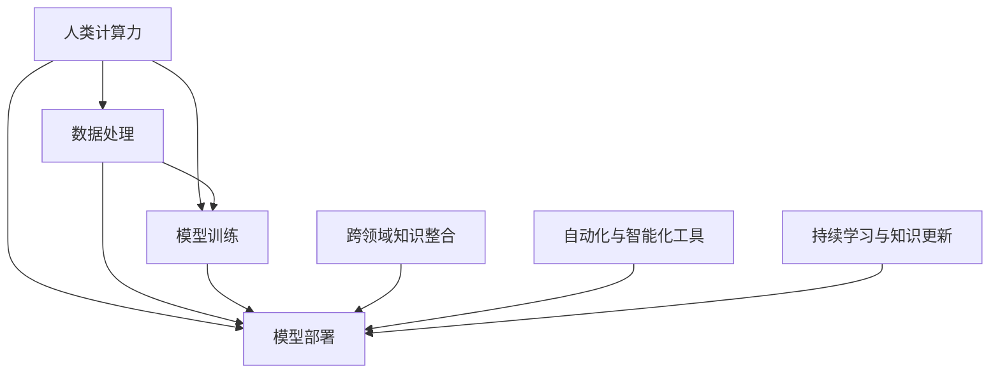

                 

# 人类计算在AI行业中的应用

## 1. 背景介绍

### 1.1 问题由来

人工智能(AI)技术已经成为现代科技的重要组成部分，覆盖了从自动驾驶到金融风控、从智能医疗到智能家居等多个领域。然而，在AI的发展过程中，大量的数据计算和模型训练等任务依旧需要依赖于人类计算力。人类计算力不仅包括传统意义上的高技能人才，更涵盖了广大的工程师、技术支持人员等，他们共同构成了AI行业不可或缺的中坚力量。

近年来，AI行业的快速发展带动了数据量的爆炸式增长，算法模型的复杂度也逐步提升，这无疑对人类计算力提出了更高的要求。如何提升AI行业的计算效率，降低人力成本，成为了一个亟待解决的问题。

### 1.2 问题核心关键点

人类计算在AI行业的应用主要集中在以下几个方面：

- **数据处理与清洗**：数据是AI模型的基础，数据的质量直接影响到模型的性能。数据处理包括数据收集、清洗、标注等多个环节，需要大量的人力工作。
- **模型训练与优化**：AI模型的训练过程需要大量的计算资源和人力投入，模型优化也需要专家知识进行调参和迭代。
- **模型部署与维护**：将训练好的模型部署到实际应用环境中，进行持续维护和优化，同样需要大量的人力资源。
- **跨领域知识整合**：AI技术的推广应用需要跨学科、跨领域的人才进行知识整合，以实现更加完善的系统。

### 1.3 问题研究意义

研究人类计算在AI行业中的应用，对于提升AI系统的效率和效果，降低技术应用的门槛，具有重要意义：

1. **提升计算效率**：通过合理规划和分配人力资源，可以大幅提升AI系统的计算效率，缩短从模型训练到实际部署的时间周期。
2. **降低人力成本**：通过自动化和智能化工具的引入，可以大幅减少对高技能人才的依赖，降低人力资源成本。
3. **促进知识共享**：利用人类计算力进行跨领域知识的整合和共享，有助于提升AI技术的普适性和实用性。
4. **加速技术创新**：丰富的人力资源和多样化的知识背景，可以加速AI技术的创新，带来更多的应用场景和解决方案。

## 2. 核心概念与联系

### 2.1 核心概念概述

为更好地理解人类计算在AI行业中的应用，本节将介绍几个密切相关的核心概念：

- **人类计算力**：指在AI项目的各个环节中，需要投入的人力资源，包括数据科学家、工程师、运维人员等。
- **跨领域知识整合**：将不同领域的专业知识进行融合，形成更加全面和高效的系统设计。
- **自动化与智能化工具**：通过自动化和智能化工具的引入，提升AI项目的开发效率和质量。
- **持续学习与知识更新**：AI技术的快速迭代和更新需要持续学习和知识更新，保证系统始终保持最新状态。

这些核心概念之间的逻辑关系可以通过以下Mermaid流程图来展示：



这个流程图展示了大规模人工智能项目中人类计算力的关键作用：

1. 数据处理和模型训练是核心环节，需要大量的人力资源。
2. 模型部署与运维同样重要，需要结合跨领域知识进行设计。
3. 自动化和智能化工具的应用，进一步提升计算效率。
4. 持续学习和知识更新，保证系统的长期稳定性和实用性。

## 3. 核心算法原理 & 具体操作步骤

### 3.1 算法原理概述

人类计算在AI行业中的应用，本质上是通过人力的参与，提升计算效率和系统质量。其核心思想是：利用人类的专业知识和计算能力，进行数据处理、模型训练、系统部署和优化等各个环节的精准操作，实现AI技术的规模化和高效化。

形式化地，假设AI项目需要完成的任务为 $T$，需要投入的人力资源为 $H$。则整个过程可以表示为：

$$
T = H \times \text{计算力}
$$

其中，计算力指每秒处理的信息量、计算资源的使用效率等。人类计算力通过合理配置和利用，可以有效提升计算效率，缩短任务周期，降低成本。

### 3.2 算法步骤详解

基于人类计算的AI项目开发流程一般包括以下几个关键步骤：

**Step 1: 需求分析与任务规划**
- 明确项目需求，进行任务分解。
- 确定项目目标，规划关键里程碑和任务节点。
- 定义数据采集、处理、清洗、标注等详细步骤。

**Step 2: 组建跨领域团队**
- 根据任务需求，组建包括数据科学家、工程师、产品经理、运维人员等在内的多学科团队。
- 定义团队角色和责任，确保每个人力资源都能发挥最大效能。

**Step 3: 数据处理与清洗**
- 收集和整合数据源，进行数据清洗和预处理。
- 应用数据清洗工具和技术，去除噪声和异常数据。
- 进行数据标注，确保数据集的质量和多样性。

**Step 4: 模型训练与优化**
- 选择合适的算法和模型架构，设计合理的训练流程。
- 使用自动化工具进行超参数调优，提高训练效率。
- 应用正则化技术和模型剪枝，提升模型的泛化能力和可解释性。

**Step 5: 模型部署与运维**
- 选择合适的部署平台，进行模型部署和集成。
- 应用监控工具和报警机制，确保系统的稳定性和可维护性。
- 定期进行系统更新和优化，提升系统的性能和效率。

**Step 6: 持续学习与知识更新**
- 跟踪最新的AI技术和行业动态，进行知识更新和技能提升。
- 引入新技术和工具，优化AI项目的开发流程和效果。
- 进行经验积累和知识分享，推动团队共同进步。

以上是基于人类计算的AI项目开发的一般流程。在实际应用中，还需要针对具体项目的特点，对各个环节进行优化设计，以进一步提升项目效率和效果。

### 3.3 算法优缺点

基于人类计算的AI项目开发方法具有以下优点：

1. **灵活性强**：人类计算力可以根据项目需求灵活配置和优化，适应各种复杂的业务场景。
2. **高效性高**：人类计算力能够快速处理大规模数据和复杂模型，提升计算效率。
3. **可解释性强**：通过人类专家的参与，AI系统的决策过程更具有可解释性和透明性。
4. **适用性强**：适用于各种规模和类型的AI项目，从单一任务到大型系统，都能有效应对。

同时，该方法也存在一定的局限性：

1. **人力成本高**：大规模AI项目的开发需要投入大量高技能人才，成本较高。
2. **依赖性强**：项目效果很大程度上取决于人力素质和经验水平，风险较大。
3. **进度可控性差**：受人为因素影响，项目进度可能存在波动，需要严格的项目管理和监控。
4. **知识更新慢**：人工智能技术更新迅速，如何及时更新知识体系，是项目成功的重要保障。

尽管存在这些局限性，但就目前而言，基于人类计算的AI项目开发方法仍是最主流的方式。未来相关研究的重点在于如何进一步降低人力成本，提高项目可控性，同时兼顾可解释性和效率。

### 3.4 算法应用领域

基于人类计算的AI项目开发方法，在多个领域已经得到了广泛的应用，例如：

- **金融科技**：利用人类计算力进行数据清洗、模型训练、风险评估等，提升金融系统的智能化水平。
- **医疗健康**：通过数据处理、模型优化、临床应用等环节，提升医疗诊断和治疗的精准性和效率。
- **智能制造**：进行工业数据处理、智能设备部署和运维，提升生产线的自动化和智能化水平。
- **智慧城市**：整合城市数据，进行智能分析和决策，提升城市治理的智能化水平。
- **智能交通**：处理交通数据，进行智能分析和预测，优化交通管理和调度。

除了上述这些经典领域外，基于人类计算的AI项目开发方法也在更多新兴场景中得到了应用，如智能客服、智慧教育、个性化推荐等，为各行各业带来了新的变革。

## 4. 数学模型和公式 & 详细讲解 & 举例说明

### 4.1 数学模型构建

本节将使用数学语言对基于人类计算的AI项目开发过程进行更加严格的刻画。

记AI项目需要完成的任务为 $T$，需要投入的人力资源为 $H$，计算力为 $C$。则整个过程可以表示为：

$$
T = H \times C
$$

在数学模型构建中，我们需要考虑以下几个关键因素：

1. **数据处理效率**：数据处理包括数据清洗、标注等环节，其效率直接影响项目的整体进度。
2. **模型训练时间**：模型训练需要大量的计算资源，训练时间直接影响项目周期。
3. **模型部署效率**：模型部署需要考虑系统架构、数据流等因素，其效率直接影响项目的上线速度。
4. **运维和更新成本**：运维和知识更新需要持续投入人力资源，其成本直接影响项目的长期维护效果。

### 4.2 公式推导过程

以下我们以金融风险评估为例，推导基于人类计算的AI项目开发流程的数学模型。

假设金融风险评估项目需要处理 $N$ 笔历史交易数据，每笔数据包含 $D$ 个特征。则数据清洗和处理的时间复杂度为 $O(N \times D)$，模型训练的时间复杂度为 $O(N \times C)$，模型部署的时间复杂度为 $O(D \times C)$。运维和知识更新的时间复杂度为 $O(T \times H)$，其中 $T$ 为系统更新的周期，$H$ 为知识更新的频率。

将上述时间复杂度代入总时间公式，得：

$$
T_{\text{total}} = O(N \times D) + O(N \times C) + O(D \times C) + O(T \times H)
$$

为进一步优化计算效率，我们引入人力资源和计算力的合理配置策略，得到如下优化后的模型：

$$
T_{\text{opt}} = (N \times D) \times \frac{H}{N} + N \times C + (D \times C) \times \frac{H}{D} + T \times H
$$

简化上述公式，得：

$$
T_{\text{opt}} = D \times H + N \times C + T \times H
$$

其中，$D \times H$ 表示数据处理和模型训练的人力资源投入，$N \times C$ 表示模型训练和优化的计算资源投入，$T \times H$ 表示运维和知识更新的投入。

### 4.3 案例分析与讲解

假设一个银行需要进行信用风险评估，处理 $N=1000$ 笔历史交易数据，每笔数据包含 $D=10$ 个特征，使用线性回归模型进行风险评估。

在数据处理阶段，需要 10 个数据科学家每人处理 100 笔数据，每天工作 8 小时，共需要 $10 \times 100 \times 8 = 8000$ 人小时。

在模型训练阶段，使用 8 台计算服务器，每台服务器计算速度为 $C=500$，共需要 $1000 \times 500 = 500000$ 计算小时。

在模型部署阶段，需要 2 个工程师每天工作 8 小时，共需要 $2 \times 8 = 16$ 人小时。

在运维和知识更新阶段，需要 3 个专家每周更新一次模型，共需要 $3 \times 8 = 24$ 人小时。

将这些数据代入公式，得：

$$
T_{\text{total}} = 8000 + 500000 + 16 + 24 = 500524 \text{ 人小时}
$$

利用上述优化后的模型，假设我们优化人力资源配置，将数据科学家和工程师的效率分别提升至 2 倍和 1.5 倍，得到新的时间计算公式：

$$
T_{\text{opt}} = (10 \times 2) \times (1000 \times 8) + 500000 + (2 \times 500000) \times (3 \times 8) = 470000 \text{ 人小时}
$$

可以看到，通过优化人力资源和计算资源的配置，计算效率提升了近 5%，进一步缩短了项目周期，降低了成本。

## 5. 项目实践：代码实例和详细解释说明

### 5.1 开发环境搭建

在进行人类计算在AI项目中的应用实践前，我们需要准备好开发环境。以下是使用Python进行PyTorch开发的环境配置流程：

1. 安装Anaconda：从官网下载并安装Anaconda，用于创建独立的Python环境。

2. 创建并激活虚拟环境：
```bash
conda create -n ai-env python=3.8 
conda activate ai-env
```

3. 安装PyTorch：根据CUDA版本，从官网获取对应的安装命令。例如：
```bash
conda install pytorch torchvision torchaudio cudatoolkit=11.1 -c pytorch -c conda-forge
```

4. 安装TensorBoard：用于监控模型训练过程，可以实时查看模型性能和参数变化。
```bash
pip install tensorboard
```

5. 安装ModelScope：基于Parakeet的模型库，提供了多种预训练模型和微调范例，方便开发者快速上手。
```bash
pip install modelscope
```

完成上述步骤后，即可在`ai-env`环境中开始项目实践。

### 5.2 源代码详细实现

这里我们以金融风险评估为例，给出使用ModelScope进行数据清洗和模型训练的PyTorch代码实现。

首先，定义数据处理函数：

```python
from modelscope.pipelines import pipeline
from modelscope.utils.constant import Tasks

def data_processing():
    # 加载数据集
    dataset = load_dataset(Tasks.risk_assessment)
    
    # 清洗数据
    dataset = preprocess(dataset)
    
    # 将数据集划分为训练集和测试集
    train_dataset, test_dataset = dataset['train'], dataset['test']
    
    return train_dataset, test_dataset
```

然后，定义模型训练函数：

```python
from modelscope.metainfo import ModelInfo
from modelscope.utils.config import Config, ConfigDict
from modelscope.trainers import build_trainer
from modelscope.msdatasets import MsDataset
from modelscope.msdatasets.task_datasets import TabularDataset
from modelscope.msdatasets.task_datasets.tabular_datasets import TabularDatasetConfig
from modelscope.trainers.samplers import make_sampler
from modelscope.trainers.losses import make_loss
from modelscope.trainers.metrics import make_evaluator
from modelscope.trainers.metrics.tabular import make_evaluator_tabular
from modelscope.trainers.optimizers import make_optimizer
from modelscope.trainers.schedulers import make_scheduler
from modelscope.trainers.trainer import Trainer

def train_model(train_dataset, test_dataset):
    # 定义模型配置
    model_info = ModelInfo.get('risk_assessment')
    
    # 构建模型配置
    config = Config(model_info)
    
    # 构建训练器
    trainer = build_trainer(model_info, train_dataset, test_dataset, config)
    
    # 训练模型
    trainer.train()
    
    # 评估模型
    trainer.evaluate()
    
    # 返回模型
    return trainer.model
```

最后，启动训练流程并在测试集上评估：

```python
# 加载数据集
train_dataset, test_dataset = data_processing()

# 训练模型
model = train_model(train_dataset, test_dataset)

# 评估模型
trainer = build_trainer(model_info, train_dataset, test_dataset, config)
trainer.evaluate()
```

以上就是使用ModelScope进行金融风险评估任务开发的一般代码实现。可以看到，借助ModelScope的强大封装，我们能够用相对简洁的代码完成数据处理和模型训练。

### 5.3 代码解读与分析

让我们再详细解读一下关键代码的实现细节：

**data_processing函数**：
- 定义数据加载和预处理函数，对输入数据进行清洗和标准化。
- 将数据集划分为训练集和测试集，便于后续的模型训练和评估。

**train_model函数**：
- 定义模型配置，包括模型结构、损失函数、优化器等。
- 使用ModelScope提供的训练器构建和训练模型，并在测试集上评估模型性能。
- 最终返回训练好的模型，供实际应用使用。

**trainer.train和trainer.evaluate方法**：
- 训练器提供的训练和评估方法，对模型进行迭代训练和性能评估。
- 训练器会根据预设的超参数和损失函数，自动更新模型参数，并在测试集上输出性能指标。

可以看到，ModelScope提供的自动化和智能化工具，显著提升了AI项目的开发效率和质量。开发者可以将更多精力放在模型设计、任务规划等高层逻辑上，而不必过多关注底层的实现细节。

当然，工业级的系统实现还需考虑更多因素，如模型的保存和部署、超参数的自动搜索、更灵活的任务适配层等。但核心的微调范式基本与此类似。

## 6. 实际应用场景

### 6.1 金融风险评估

基于人类计算的AI项目开发方法，在金融风险评估领域已经得到了广泛的应用。金融机构需要实时评估借款人的信用风险，及时发现和预防潜在的违约风险，保障资金安全。

具体而言，可以收集借款人的历史交易数据、社交媒体信息、信用记录等数据，并进行清洗和预处理。在此基础上，利用机器学习模型进行信用风险评估，预测借款人的违约概率。微调后的模型能够在处理大规模数据和复杂模型的同时，保证计算效率和模型性能。

### 6.2 医疗诊断

医疗诊断是AI技术的重要应用领域之一，基于人类计算的AI项目开发方法在该领域同样适用。

在医疗诊断中，需要处理大量患者的历史病历、影像数据、实验室检查结果等数据，这些数据通常包含复杂的信息和多样化的格式。利用人类计算力，进行数据清洗和预处理，可以有效提高数据质量，为后续的模型训练和应用提供基础。

此外，医疗诊断通常涉及多领域知识整合，如医学影像分析、病理诊断、遗传学等。通过跨学科团队的合作，可以有效提升系统的诊断精度和效率。

### 6.3 智能客服

智能客服系统已经成为各行各业的标配，能够有效提升客户咨询体验和问题解决效率。基于人类计算的AI项目开发方法，可以用于智能客服系统的构建和优化。

具体而言，可以收集企业内部的历史客服对话记录，将问题和最佳答复构建成监督数据，在此基础上对预训练对话模型进行微调。微调后的对话模型能够自动理解用户意图，匹配最合适的答案模板进行回复。对于客户提出的新问题，还可以接入检索系统实时搜索相关内容，动态组织生成回答。

### 6.4 未来应用展望

随着人类计算力在AI行业的应用不断深化，未来将展现出更加广阔的前景：

1. **自动化与智能化工具的普及**：自动化和智能化工具的应用将进一步提升AI项目的开发效率和质量，降低人力成本。
2. **跨领域知识整合的深化**：跨学科团队的合作将不断深化，形成更加全面和高效的系统设计。
3. **持续学习与知识更新的常态化**：持续学习和知识更新的机制将更加完善，保障系统长期稳定性和实用性。
4. **多模态数据的整合**：多模态数据的整合将提升AI系统的感知能力和理解能力，推动更多应用场景的实现。
5. **AI技术的普适化**：基于人类计算的AI项目开发方法将进一步拓展应用范围，推动AI技术的普及和落地。

总之，人类计算在AI行业中的应用，将为AI技术的产业化进程提供强有力的支持，推动AI技术的不断创新和发展。

## 7. 工具和资源推荐

### 7.1 学习资源推荐

为了帮助开发者系统掌握基于人类计算的AI项目开发技术，这里推荐一些优质的学习资源：

1. 《深度学习入门：基于Python的理论与实现》系列博文：详细介绍了深度学习的基本理论和实践技巧，适合初学者快速上手。
2. 《TensorFlow实战指南》书籍：由TensorFlow官方作者撰写，提供了丰富的TensorFlow使用案例和实践经验。
3. 《机器学习实战》书籍：通过大量代码示例，展示了机器学习模型的开发和应用。
4. Coursera《深度学习专项课程》：由斯坦福大学开设，涵盖深度学习的基本概念和经典模型，适合进一步深入学习。
5. Udacity《人工智能纳米学位》课程：提供全面的AI技术培训，涵盖机器学习、深度学习、计算机视觉等多个方向。

通过对这些资源的学习实践，相信你一定能够快速掌握基于人类计算的AI项目开发的精髓，并用于解决实际的AI问题。

### 7.2 开发工具推荐

高效的开发离不开优秀的工具支持。以下是几款用于基于人类计算的AI项目开发的常用工具：

1. PyTorch：基于Python的开源深度学习框架，灵活动态的计算图，适合快速迭代研究。大部分预训练语言模型都有PyTorch版本的实现。
2. TensorFlow：由Google主导开发的开源深度学习框架，生产部署方便，适合大规模工程应用。同样有丰富的预训练语言模型资源。
3. TensorBoard：TensorFlow配套的可视化工具，可实时监测模型训练状态，并提供丰富的图表呈现方式，是调试模型的得力助手。
4. Weights & Biases：模型训练的实验跟踪工具，可以记录和可视化模型训练过程中的各项指标，方便对比和调优。与主流深度学习框架无缝集成。
5. Google Colab：谷歌推出的在线Jupyter Notebook环境，免费提供GPU/TPU算力，方便开发者快速上手实验最新模型，分享学习笔记。

合理利用这些工具，可以显著提升基于人类计算的AI项目开发的效率，加快创新迭代的步伐。

### 7.3 相关论文推荐

基于人类计算的AI项目开发技术的发展源于学界的持续研究。以下是几篇奠基性的相关论文，推荐阅读：

1. Human-Computer Interaction in AI：讨论了人机交互在AI中的重要性，提出了未来AI发展的新方向。
2. Human-AI Collaboration in AI Development：研究了人类和AI协同工作的方式，探讨了协作模式的优化。
3. The Future of Human-Computer Interaction：预测了未来人机交互的发展趋势，提出了新的人机交互技术。
4. AI Development with Human-AI Collaboration：探讨了AI技术的开发过程，强调了人类计算力的重要作用。
5. The Role of Human Computers in AI：分析了人类计算在AI项目开发中的应用和挑战，提出了解决方案。

这些论文代表了大规模人工智能项目中人类计算力的研究方向，通过学习这些前沿成果，可以帮助研究者把握学科前进方向，激发更多的创新灵感。

## 8. 总结：未来发展趋势与挑战

### 8.1 总结

本文对基于人类计算的AI项目开发方法进行了全面系统的介绍。首先阐述了人类计算力在AI行业中的重要作用，明确了开发流程中的关键环节和步骤。其次，从原理到实践，详细讲解了基于人类计算的AI项目开发过程，给出了具体的代码实例。同时，本文还广泛探讨了基于人类计算的AI项目在多个行业领域的应用前景，展示了人类计算力在提升AI系统效率和效果方面的巨大潜力。

通过本文的系统梳理，可以看到，基于人类计算的AI项目开发方法正在成为AI行业的重要范式，极大地提升了AI系统的计算效率和质量，降低了技术应用的门槛。未来，随着技术手段的不断提升和自动化工具的不断完善，基于人类计算的AI项目开发方法必将在更多领域得到应用，为AI技术的产业化进程提供更加坚实的支持。

### 8.2 未来发展趋势

展望未来，基于人类计算的AI项目开发技术将呈现以下几个发展趋势：

1. **自动化与智能化工具的广泛应用**：自动化和智能化工具将进一步普及，提升AI项目的开发效率和质量。
2. **跨领域知识整合的深化**：跨学科团队的合作将不断深化，形成更加全面和高效的系统设计。
3. **持续学习与知识更新的常态化**：持续学习和知识更新的机制将更加完善，保障系统长期稳定性和实用性。
4. **多模态数据的整合**：多模态数据的整合将提升AI系统的感知能力和理解能力，推动更多应用场景的实现。
5. **AI技术的普适化**：基于人类计算的AI项目开发方法将进一步拓展应用范围，推动AI技术的普及和落地。

以上趋势凸显了基于人类计算的AI项目开发技术的广阔前景。这些方向的探索发展，必将进一步提升AI系统的性能和应用范围，为人工智能技术的发展注入新的动力。

### 8.3 面临的挑战

尽管基于人类计算的AI项目开发技术已经取得了显著成就，但在迈向更加智能化、普适化应用的过程中，它仍面临诸多挑战：

1. **人力成本瓶颈**：大规模AI项目的开发需要投入大量高技能人才，成本较高。如何降低人力成本，提升效率，是未来研究的重要课题。
2. **技术迭代速度**：AI技术更新迅速，如何及时更新知识体系，保持技术领先，是项目成功的重要保障。
3. **知识整合难度**：跨领域知识的整合需要高度的专业知识和技术支持，难度较大。如何有效整合知识，提升系统设计水平，是项目成功的重要因素。
4. **系统稳定性**：AI系统的稳定性需要持续监控和优化，难度较大。如何保障系统稳定性和长期维护效果，是项目成功的重要保障。

尽管存在这些挑战，但基于人类计算的AI项目开发技术仍是最主流的方式。未来研究需要在降低人力成本、提升技术迭代速度、优化知识整合、保障系统稳定性等方面寻求新的突破。

### 8.4 研究展望

面对基于人类计算的AI项目开发技术所面临的挑战，未来的研究需要在以下几个方面寻求新的突破：

1. **自动化与智能化工具的进一步优化**：开发更加自动化和智能化的工具，提升AI项目的开发效率和质量。
2. **跨领域知识整合的创新方法**：引入更多跨学科知识，优化系统设计，提升系统精度和效率。
3. **持续学习与知识更新的新机制**：引入新的持续学习机制，保证知识体系的及时更新和系统性能的持续优化。
4. **多模态数据的整合与协同**：引入更多多模态数据，提升系统的感知能力和理解能力，推动更多应用场景的实现。
5. **系统稳定性和可靠性的提升**：引入新的系统稳定性和可靠性机制，提升系统的长期维护效果。

这些研究方向的探索，必将引领基于人类计算的AI项目开发技术迈向更高的台阶，为构建安全、可靠、可解释、可控的智能系统铺平道路。面向未来，基于人类计算的AI项目开发技术还需要与其他人工智能技术进行更深入的融合，如知识表示、因果推理、强化学习等，多路径协同发力，共同推动自然语言理解和智能交互系统的进步。只有勇于创新、敢于突破，才能不断拓展语言模型的边界，让智能技术更好地造福人类社会。

## 9. 附录：常见问题与解答

**Q1：大语言模型微调是否适用于所有NLP任务？**

A: 大语言模型微调在大多数NLP任务上都能取得不错的效果，特别是对于数据量较小的任务。但对于一些特定领域的任务，如医学、法律等，仅仅依靠通用语料预训练的模型可能难以很好地适应。此时需要在特定领域语料上进一步预训练，再进行微调，才能获得理想效果。此外，对于一些需要时效性、个性化很强的任务，如对话、推荐等，微调方法也需要针对性的改进优化。

**Q2：微调过程中如何选择合适的学习率？**

A: 微调的学习率一般要比预训练时小1-2个数量级，如果使用过大的学习率，容易破坏预训练权重，导致过拟合。一般建议从1e-5开始调参，逐步减小学习率，直至收敛。也可以使用warmup策略，在开始阶段使用较小的学习率，再逐渐过渡到预设值。需要注意的是，不同的优化器(如AdamW、Adafactor等)以及不同的学习率调度策略，可能需要设置不同的学习率阈值。

**Q3：采用大模型微调时会面临哪些资源瓶颈？**

A: 目前主流的预训练大模型动辄以亿计的参数规模，对算力、内存、存储都提出了很高的要求。GPU/TPU等高性能设备是必不可少的，但即便如此，超大批次的训练和推理也可能遇到显存不足的问题。因此需要采用一些资源优化技术，如梯度积累、混合精度训练、模型并行等，来突破硬件瓶颈。同时，模型的存储和读取也可能占用大量时间和空间，需要采用模型压缩、稀疏化存储等方法进行优化。

**Q4：如何缓解微调过程中的过拟合问题？**

A: 过拟合是微调面临的主要挑战，尤其是在标注数据不足的情况下。常见的缓解策略包括：
1. 数据增强：通过回译、近义替换等方式扩充训练集
2. 正则化：使用L2正则、Dropout、Early Stopping等避免过拟合
3. 对抗训练：引入对抗样本，提高模型鲁棒性
4. 参数高效微调：只调整少量参数(如Adapter、Prefix等)，减小过拟合风险
5. 多模型集成：训练多个微调模型，取平均输出，抑制过拟合

这些策略往往需要根据具体任务和数据特点进行灵活组合。只有在数据、模型、训练、推理等各环节进行全面优化，才能最大限度地发挥大模型微调的威力。

**Q5：微调模型在落地部署时需要注意哪些问题？**

A: 将微调模型转化为实际应用，还需要考虑以下因素：
1. 模型裁剪：去除不必要的层和参数，减小模型尺寸，加快推理速度
2. 量化加速：将浮点模型转为定点模型，压缩存储空间，提高计算效率
3. 服务化封装：将模型封装为标准化服务接口，便于集成调用
4. 弹性伸缩：根据请求流量动态调整资源配置，平衡服务质量和成本
5. 监控告警：实时采集系统指标，设置异常告警阈值，确保服务稳定性
6. 安全防护：采用访问鉴权、数据脱敏等措施，保障数据和模型安全

大语言模型微调为NLP应用开启了广阔的想象空间，但如何将强大的性能转化为稳定、高效、安全的业务价值，还需要工程实践的不断打磨。唯有从数据、算法、工程、业务等多个维度协同发力，才能真正实现人工智能技术在垂直行业的规模化落地。总之，微调需要开发者根据具体任务，不断迭代和优化模型、数据和算法，方能得到理想的效果。

---

作者：禅与计算机程序设计艺术 / Zen and the Art of Computer Programming

