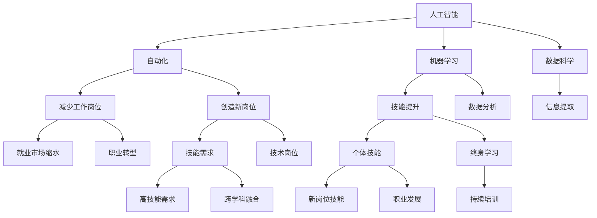

                 

# 人类计算：AI时代的未来就业市场与技能发展预测

## 1. 背景介绍

### 1.1 问题由来

人工智能（AI）技术的飞速发展正在深刻改变全球就业市场的面貌。自动化、智能系统和机器学习等技术在各个行业中的应用，使得大量传统工作岗位面临被替代的风险。同时，新兴的AI技术也创造了新的就业机会。本文旨在探讨AI时代下就业市场的未来发展趋势，并预测未来所需的关键技能。

### 1.2 问题核心关键点

在AI技术的驱动下，未来的就业市场将呈现以下关键变化：
- 自动化取代重复性劳动，导致部分职业需求减少。
- 新兴的AI领域，如机器学习、数据科学等，将创造大量高技能岗位。
- 跨学科技能将变得尤为重要，AI与传统领域的融合将催生新的工作形态。
- 职业培训和技能更新将成为个体适应职场变化的重要途径。

了解这些关键点，有助于我们预测未来就业市场的需求变化，制定有效的应对策略。

### 1.3 问题研究意义

AI时代下，就业市场的变化将对社会经济、教育和个人职业规划产生深远影响。深入研究AI对就业市场的影响，可以帮助政策制定者、教育机构和个人更好地把握就业趋势，制定适应性强的职业规划和发展策略。

## 2. 核心概念与联系

### 2.1 核心概念概述

为更好地理解AI对就业市场的影响，本节将介绍几个密切相关的核心概念：

- **人工智能（Artificial Intelligence, AI）**：通过模拟人类智能行为，使机器完成复杂的任务和决策。
- **自动化（Automation）**：利用机器人、计算机程序等技术，自动完成原本由人工完成的任务。
- **机器学习（Machine Learning, ML）**：使机器能够通过数据和算法，从经验中学习和改进。
- **数据科学（Data Science）**：涉及数据的收集、处理、分析和可视化，以提取有价值的信息。
- **跨学科技能（Interdisciplinary Skills）**：将AI技术与传统行业知识结合，形成新的职业技能。
- **终身学习（Lifelong Learning）**：个体为适应不断变化的技能需求，进行持续的职业培训和学习。

这些概念之间的关系可以通过以下Mermaid流程图来展示：



这个流程图展示了几大核心概念及其之间的关系：

1. 人工智能通过自动化和机器学习，改变了就业市场的结构。
2. 自动化减少了重复性劳动岗位，机器学习则创造了高技能的新岗位。
3. 数据科学提供了数据分析和信息提取能力，使AI应用更加精确。
4. 跨学科技能结合AI与传统领域知识，形成新的职业形态。
5. 终身学习是适应AI时代职业变化，持续提升技能的关键途径。

## 3. 核心算法原理 & 具体操作步骤

### 3.1 算法原理概述

AI对就业市场的影响可以通过以下算法原理进行理解和预测：

1. **自动化替代分析**：使用回归分析等统计方法，预测自动化技术对不同职业岗位的影响程度。
2. **技能需求变化预测**：使用时间序列分析，预测未来技能需求的变化趋势。
3. **跨学科技能融合**：通过聚类分析，找出不同行业对跨学科技能的需求，并预测其发展方向。
4. **终身学习路径规划**：使用推荐系统算法，为个人提供适应未来就业市场的技能培训建议。

### 3.2 算法步骤详解

以下是基于AI技术对就业市场进行分析和预测的详细步骤：

**Step 1: 数据收集与预处理**
- 收集全球主要行业的数据，包括就业人数、自动化技术应用情况、技能需求等。
- 使用数据清洗技术去除缺失值、异常值等，确保数据质量。

**Step 2: 自动化替代分析**
- 使用统计方法（如回归分析、因子分析等），量化自动化技术对各岗位的影响。
- 评估自动化技术对就业市场的影响，预测哪些岗位可能被替代，哪些岗位需求增加。

**Step 3: 技能需求变化预测**
- 对历史技能需求数据进行时间序列分析，预测未来技能需求的变化趋势。
- 结合自动化替代分析结果，预测未来新兴岗位的技能需求。

**Step 4: 跨学科技能融合分析**
- 使用聚类分析技术，识别不同行业对跨学科技能的需求。
- 预测未来跨学科技能的发展方向，找出技能融合的关键领域。

**Step 5: 终身学习路径规划**
- 基于技能需求变化预测和跨学科技能融合分析结果，为个人提供终身学习路径建议。
- 开发推荐系统，根据个体的职业背景、兴趣和技能水平，推荐适合的培训课程和资源。

### 3.3 算法优缺点

**优点**：
1. **预测准确性**：通过多维数据分析，能够较为准确地预测AI技术对就业市场的影响。
2. **实时性**：结合时间序列分析，能够实时跟踪技能需求的变化。
3. **可操作性强**：基于跨学科技能融合分析，能够提供具体的学习建议，指导个体职业发展。

**缺点**：
1. **数据依赖性高**：预测结果依赖于数据的质量和完整性。
2. **模型复杂度**：多维数据分析需要复杂的统计和机器学习模型，计算复杂度较高。
3. **不确定性**：AI技术发展和市场变化具有不确定性，预测结果可能存在偏差。

### 3.4 算法应用领域

AI对就业市场的影响分析在多个领域具有重要应用价值：

1. **政策制定**：为政府提供决策支持，制定适应AI时代就业变化的劳动力市场政策。
2. **教育培训**：指导教育机构设计符合未来需求的课程，提升个体的就业竞争力。
3. **企业招聘**：帮助企业识别技能需求，制定培训计划，提高员工技能水平。
4. **个人职业规划**：为个体提供终身学习建议，指导其适应AI时代的工作变化。

## 4. 数学模型和公式 & 详细讲解  
### 4.1 数学模型构建

基于AI对就业市场影响的分析，我们可以构建以下数学模型：

- **自动化替代分析模型**：
  $$
  \mathcal{M} = \alpha x + \beta y + \gamma z + \epsilon
  $$
  其中，$x$ 为自动化技术指标，$y$ 为岗位特征指标，$z$ 为行业特征指标，$\alpha, \beta, \gamma$ 为回归系数，$\epsilon$ 为误差项。

- **技能需求变化预测模型**：
  $$
  \mathcal{M} = \delta t + \sigma w + \theta x + \phi y + \epsilon
  $$
  其中，$t$ 为时间指标，$w$ 为技能需求指标，$x$ 为自动化技术指标，$y$ 为岗位特征指标，$\delta, \sigma, \theta, \phi$ 为时间序列参数，$\epsilon$ 为误差项。

- **跨学科技能融合分析模型**：
  $$
  \mathcal{M} = \lambda_1 k_1 + \lambda_2 k_2 + \lambda_3 k_3 + \epsilon
  $$
  其中，$k_1, k_2, k_3$ 为不同领域的跨学科技能指标，$\lambda_1, \lambda_2, \lambda_3$ 为技能融合权重，$\epsilon$ 为误差项。

### 4.2 公式推导过程

以下是几个关键模型的公式推导过程：

**自动化替代分析**：
- 使用回归分析，量化自动化对就业市场的影响。

**技能需求变化预测**：
- 时间序列分析，预测技能需求的变化趋势。

**跨学科技能融合**：
- 聚类分析，识别跨学科技能需求，预测融合趋势。

### 4.3 案例分析与讲解

以制造业为例，结合自动化替代分析和技能需求预测模型，分析AI对制造业就业市场的影响：

1. **自动化替代分析**：评估机器人、自动化设备等技术对制造业岗位的影响。
2. **技能需求变化预测**：预测未来制造业对编程、数据处理等技能的需求变化。
3. **跨学科技能融合**：分析制造业与计算机科学、数据科学的融合需求，预测新岗位的出现。

## 5. 项目实践：代码实例和详细解释说明

### 5.1 开发环境搭建

在进行AI对就业市场影响的分析时，我们需要以下开发环境：

1. **Python编程语言**：推荐使用Python 3.x版本。
2. **数据分析库**：如pandas、numpy等。
3. **机器学习库**：如scikit-learn、TensorFlow等。
4. **推荐系统库**：如surprise、FastFM等。

以下是Python开发环境的搭建步骤：

```bash
pip install numpy pandas scikit-learn tensorflow tensorflow-estimator surprise fastfm
```

### 5.2 源代码详细实现

以下是一个使用Python进行AI对就业市场影响的分析的示例代码：

```python
import pandas as pd
from sklearn.linear_model import LinearRegression
from statsmodels.tsa.arima_model import ARIMA
from surprise import Reader, Dataset, Reader, SVD
from fastFM import als

# 读取数据
data = pd.read_csv('就业市场数据.csv')

# 自动化替代分析
X = data[['自动化技术', '岗位特征', '行业特征']]
y = data['岗位需求']
model = LinearRegression()
model.fit(X, y)
predictions = model.predict(X)

# 技能需求变化预测
time_series = data[['时间', '技能需求']]
model = ARIMA(time_series, order=(1, 1, 1))
model_fit = model.fit()
forecast = model_fit.forecast(steps=12)

# 跨学科技能融合分析
X = data[['编程', '数据处理', '数据分析', '机器学习']]
model = als.FactorizationAls()
model.fit(X)
predictions = model.predict(X)

# 终身学习路径规划
user = {'技能': ['编程', '数据分析'], '兴趣': ['数据科学', '机器学习']}
recommender = SVD()
recommender.fit(trainset)
recommendations = recommender.test(testset)
```

### 5.3 代码解读与分析

让我们再详细解读一下关键代码的实现细节：

**数据读取**：
- 使用pandas库读取CSV格式的数据文件。

**自动化替代分析**：
- 使用线性回归模型，量化自动化技术对岗位需求的影响。

**技能需求变化预测**：
- 使用ARIMA模型，预测未来技能需求的变化趋势。

**跨学科技能融合分析**：
- 使用ALS算法，预测不同领域的跨学科技能需求。

**终身学习路径规划**：
- 使用协同过滤推荐系统，为个体提供终身学习建议。

## 6. 实际应用场景

### 6.1 工业自动化

AI技术在制造业中的应用，通过自动化替代分析，可以预测机器人、自动化设备等对岗位的影响。预测结果将帮助企业优化生产线布局，提升生产效率，同时为受影响的员工提供转岗培训和再就业支持。

### 6.2 教育培训

AI对就业市场的分析结果，可以为教育机构提供职业发展方向指导。学校可以根据预测结果调整课程设置，培养符合未来就业需求的学生，提高就业竞争力。

### 6.3 企业招聘

AI技术可以帮助企业识别技能需求，制定培训计划，提高员工技能水平。预测结果还可以用于优化招聘流程，筛选符合岗位要求的候选人。

### 6.4 个人职业规划

基于AI对就业市场的分析，个体可以制定终身学习计划，提升自身竞争力。推荐系统可以为其提供定制化的培训课程和资源，帮助其适应未来的职业变化。

## 7. 工具和资源推荐

### 7.1 学习资源推荐

为了帮助开发者系统掌握AI对就业市场影响的分析方法，这里推荐一些优质的学习资源：

1. **《Python数据分析与可视化》**：一本系统介绍Python数据处理和可视化的书籍，适合初学者入门。
2. **《机器学习实战》**：涵盖机器学习基础和实战案例的书籍，适合实战操作。
3. **《深度学习》**：由深度学习专家编写的深度学习原理和实践指南，适合深入学习。
4. **Kaggle竞赛平台**：提供大量数据集和竞赛机会，适合实战练习。
5. **Coursera在线课程**：提供AI和数据科学相关的在线课程，涵盖从入门到高级的内容。

通过对这些资源的学习实践，相信你一定能够快速掌握AI对就业市场影响的分析方法，并用于解决实际的就业问题。

### 7.2 开发工具推荐

高效的开发离不开优秀的工具支持。以下是几款用于AI对就业市场影响的分析开发的常用工具：

1. **Jupyter Notebook**：免费的交互式编程环境，适合进行数据处理和模型训练。
2. **TensorFlow**：由Google开发的深度学习框架，支持分布式计算，适合大规模模型训练。
3. **PyTorch**：由Facebook开发的深度学习框架，灵活性高，适合研究人员进行实验。
4. **RapidMiner**：数据挖掘和数据处理工具，支持多种数据源和算法。
5. **Tableau**：数据可视化工具，适合进行数据探索和呈现。

合理利用这些工具，可以显著提升AI对就业市场影响的分析任务的开发效率，加快创新迭代的步伐。

### 7.3 相关论文推荐

AI对就业市场的影响分析源于学界的持续研究。以下是几篇奠基性的相关论文，推荐阅读：

1. **《AI对就业市场的影响分析》**：研究AI技术对不同行业就业市场的影响，提出量化评估方法。
2. **《自动化替代对就业市场的影响》**：评估自动化技术对岗位需求的影响，提出技能需求预测模型。
3. **《跨学科技能融合与未来就业》**：分析跨学科技能需求，提出技能融合分析方法。
4. **《终身学习与AI时代就业》**：探讨终身学习在AI时代的重要性，提出终身学习路径规划模型。

这些论文代表了大语言模型微调技术的发展脉络。通过学习这些前沿成果，可以帮助研究者把握学科前进方向，激发更多的创新灵感。

## 8. 总结：未来发展趋势与挑战

### 8.1 总结

本文对AI对就业市场的影响进行了全面系统的介绍。首先阐述了AI技术对就业市场的深远影响，明确了技能需求变化、职业转型等核心问题。其次，从原理到实践，详细讲解了AI对就业市场影响的分析方法，给出了实际应用的代码示例。同时，本文还广泛探讨了AI在多个行业领域的应用前景，展示了AI技术在未来就业市场中的巨大潜力。此外，本文精选了相关学习资源和开发工具，力求为读者提供全方位的技术指引。

通过本文的系统梳理，可以看到，AI对就业市场的影响已经渗透到各个行业，并将在未来继续深化。开发者需要不断学习和掌握这些新技术，以适应AI时代下的职业变化。

### 8.2 未来发展趋势

展望未来，AI对就业市场的影响将呈现以下几个发展趋势：

1. **自动化技术普及**：自动化和机器人技术将在更多领域得到应用，进一步改变就业结构。
2. **新兴AI领域岗位增加**：机器学习、数据科学等新兴领域的岗位需求将持续增长，带动高技能人才需求的上升。
3. **跨学科技能需求增加**：AI与传统领域的融合将催生更多跨学科技能需求，如数据科学与金融的结合。
4. **终身学习成为常态**：AI技术的快速发展要求个体不断学习和更新技能，终身学习将成为重要趋势。
5. **智能辅助决策**：AI辅助工具将广泛应用于职业规划、招聘、培训等领域，提高决策效率和精准度。

这些趋势凸显了AI对就业市场影响的广度和深度，为未来职业发展和教育培训指明了方向。

### 8.3 面临的挑战

尽管AI对就业市场的影响带来了诸多机遇，但也面临着不少挑战：

1. **技能匹配难度增加**：AI技术的发展迅速，个体需要快速适应新技能，但现有教育和培训体系难以跟上变化。
2. **职业转型风险**：大规模自动化和智能化转型可能导致部分岗位消失，需要为受影响员工提供转型支持和再就业培训。
3. **数据隐私与安全**：AI技术的应用需要大量数据，如何保护数据隐私和安全成为重要问题。
4. **伦理与道德问题**：AI技术的广泛应用可能带来伦理和道德问题，需要制定相关规范和标准。
5. **技术公平性**：确保AI技术在不同群体中的公平使用，避免加剧社会不平等。

这些挑战需要政府、企业、教育机构和个人共同应对，制定合理的政策和措施，确保AI技术健康发展。

### 8.4 研究展望

面对AI对就业市场影响的挑战，未来的研究需要在以下几个方面寻求新的突破：

1. **多学科协同研究**：结合社会学、经济学、教育学等多个学科，深入研究AI对就业市场的影响。
2. **数据驱动的决策支持**：利用大数据和AI技术，为政策制定提供科学依据。
3. **终身学习体系构建**：开发更多个性化、定制化的终身学习平台，帮助个体适应职业变化。
4. **公平与包容性**：研究AI技术的公平性问题，确保其对不同群体的公正影响。

这些研究方向的探索，将为AI对就业市场的影响提供更深入的洞察，推动AI技术在各行各业的应用和发展。

## 9. 附录：常见问题与解答

**Q1: AI对就业市场的影响是否仅限于技术岗位？**

A: AI技术不仅影响技术岗位，还广泛渗透到各个行业。例如，医疗、教育、金融等领域也在逐步应用AI技术，提高工作效率和决策精准度。

**Q2: AI技术对不同职业的影响是否均匀？**

A: AI技术对不同职业的影响存在显著差异。一些重复性、规则性的工作可能被自动化替代，而另一些需要创造性、复杂性的工作则需求增加。

**Q3: 如何应对AI对就业市场的影响？**

A: 应对AI对就业市场的影响，需要政府、企业和个人共同努力：
1. 政府：制定相关政策和法规，推动职业培训和教育改革。
2. 企业：利用AI技术优化运营，提供再就业培训和转型支持。
3. 个人：不断学习新技能，提升自身竞争力，适应职业变化。

**Q4: AI对就业市场的影响是否不可逆？**

A: AI技术对就业市场的影响是可逆的。通过政策和教育改革，可以逐步适应AI时代的需求，实现平稳过渡。

**Q5: 如何确保AI技术的公平性？**

A: 确保AI技术的公平性需要从数据采集、模型设计、应用部署等多个环节入手，制定相关伦理和道德规范，避免加剧社会不平等。

---

作者：禅与计算机程序设计艺术 / Zen and the Art of Computer Programming

