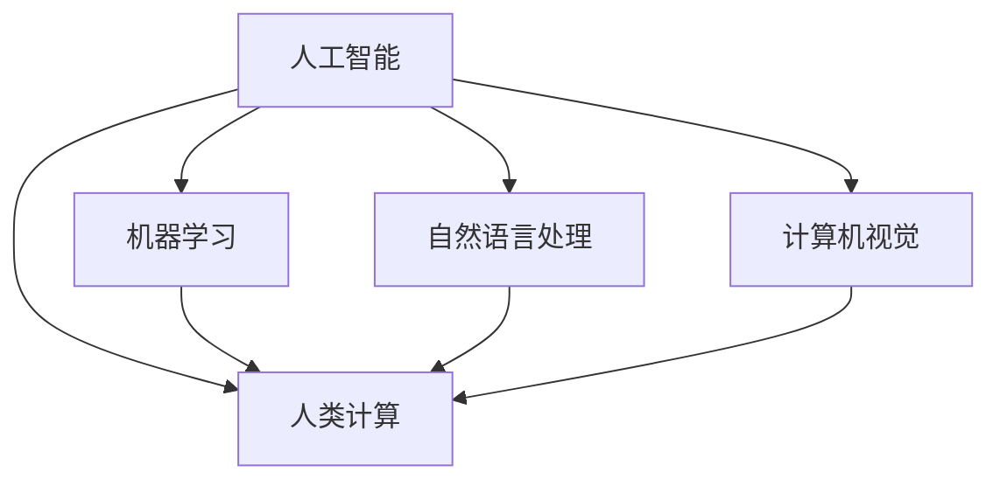

                 

# 人类计算：AI时代的未来技能发展与培训

## 1. 背景介绍

### 1.1 问题由来
在AI时代，技术的迅猛发展极大地改变了我们的工作和生活方式。伴随深度学习、自然语言处理、计算机视觉等技术的突破，人工智能已经开始渗透到各行各业，从医疗、金融、教育到制造、零售等各个领域，无处不在。然而，在享受技术红利的同时，也面临着新的挑战：一方面，AI技术虽然强大，但依然无法替代人类在复杂情境下所展现的直觉、创造力和情感表达；另一方面，AI的普及也导致部分传统职业岗位逐渐消失，产生了就业结构变化。

在这样的背景下，人类计算的概念应运而生。人类计算指的是在AI辅助下，人类通过结合AI工具、模型和数据，共同完成更为复杂、具有创新性的工作任务。这不仅是对人类计算能力的极大提升，也为AI技术的普及和应用提供了新思路。如何培养具备AI时代所需技能的未来人才，也成为了教育界、产业界和企业界共同关注的重要议题。

### 1.2 问题核心关键点
人类计算的核心关键点在于：
- 融合AI和人类智慧：在AI辅助下，人类能够更高效地处理海量数据，提取关键洞察，进行复杂推理。
- 跨学科技能需求：AI时代，数据科学、编程、心理学、认知科学等诸多学科知识都需要掌握。
- 终身学习：技术日新月异，知识更新速度加快，终身学习和自我更新成为必备能力。
- 人文关怀：在算法决策中，注重伦理道德，保障数据隐私和用户权益，体现人的价值和尊严。

## 2. 核心概念与联系

### 2.1 核心概念概述

为更好地理解人类计算的概念，本节将介绍几个密切相关的核心概念：

- **人工智能(AI)：** 指通过计算机模拟人类的智能行为，使机器能够执行复杂任务的技术。
- **机器学习(ML)：** 指让机器通过数据学习规则和模式，从而完成特定任务。
- **自然语言处理(NLP)：** 指使计算机能够理解、处理和生成人类语言的科学技术。
- **计算机视觉(CV)：** 指使计算机能够“看”懂图像、视频等视觉信息的技术。
- **人类计算(Human Computation)：** 指人类在AI辅助下，通过技能和认知与机器协作完成复杂任务的过程。

这些核心概念之间的逻辑关系可以通过以下Mermaid流程图来展示：



这个流程图展示了大语言模型与人类计算之间的核心联系：

1. AI通过机器学习、NLP和CV等技术实现对数据、图像等信息的理解。
2. 人类计算通过AI辅助，完成更为复杂、创造性的工作任务。
3. AI和人类计算相互依赖，共同推动技术进步。

## 3. 核心算法原理 & 具体操作步骤
### 3.1 算法原理概述

人类计算的算法原理是基于人机协同的混合智能系统。其核心思想是：通过AI对海量数据进行预处理和分析，辅助人类进行决策、规划和执行。这一过程中，人类凭借其直觉、创造力和情感表达能力，弥补AI在处理复杂情境和情感表达方面的不足。

形式化地，假设有一个复杂任务 $T$，人类计算模型 $M_{\theta}$ 由两部分组成：预训练模型 $M$ 和人类专家 $H$。其中 $M$ 可以是经过深度学习训练的语言模型、视觉模型等，$H$ 表示人类的知识、经验和直觉。人类计算的目标是通过数据驱动的预训练 $M$ 和人类专家的知识 $H$ 结合，最大化任务 $T$ 的性能：

$$
\max_{M_{\theta}} \mathcal{L}(T, M_{\theta}, H)
$$

其中 $\mathcal{L}$ 为任务 $T$ 的损失函数，$M_{\theta}$ 为人类计算模型的参数。

### 3.2 算法步骤详解

人类计算的核心算法步骤包括：

**Step 1: 数据准备与预处理**
- 收集与任务相关的数据，并进行数据清洗、标注和预处理。
- 利用机器学习技术对数据进行初步分析，提取特征。

**Step 2: 模型选择与微调**
- 选择适合任务的预训练模型，如BERT、GPT、ResNet等。
- 根据任务特点，进行适当的模型微调，调整模型参数以适应具体场景。

**Step 3: 人机协同交互**
- 将预训练模型和人类专家知识相结合，构建混合智能系统。
- 通过人机交互界面，将人类专家的输入和决策反馈给机器。
- 机器根据输入信息，输出计算结果或建议方案。

**Step 4: 结果评估与反馈**
- 通过人工或自动评估机制，对任务执行结果进行评估。
- 根据评估结果，调整模型参数和人类专家的输入策略，进行迭代优化。

**Step 5: 持续优化**
- 随着任务执行的进行，不断积累经验和知识，进行持续学习。
- 通过反馈机制，优化模型性能，提升人机协同的效率和效果。

### 3.3 算法优缺点

人类计算的优势在于：
1. 互补性：AI擅长处理数据、提取规律，而人类擅长处理复杂情境、情感表达和创新。
2. 灵活性：可根据不同任务特点，灵活调整模型和人类专家的角色。
3. 安全性：人类专家参与决策，有助于避免算法偏见和伦理问题。

其缺点则包括：
1. 成本高：需要投入大量资源和时间进行模型开发和专家培训。
2. 依赖人工：在处理数据量和复杂度上，仍难以完全替代AI。
3. 效果不确定：人类专家的参与可能带来主观偏差，影响结果可靠性。

### 3.4 算法应用领域

人类计算已经在多个领域得到了实际应用，例如：

- 金融风控：利用AI进行数据预处理和风险评估，结合人类专家的经验进行综合决策。
- 医疗诊断：AI提供初步诊断结果，医生根据经验进行二次审核和确认。
- 教育培训：AI辅助生成个性化学习内容，教师根据教学效果调整教学策略。
- 城市管理：AI进行数据分析和模拟预测，城市规划者结合人类专家经验进行决策。
- 创意设计：AI提供创意灵感和设计方案，设计师进行综合创意加工。

除了上述这些经典应用外，人类计算还被创新性地应用于更多场景中，如商业决策、旅游规划、游戏设计等，为各行各业带来了新的工作模式和创新机遇。

## 4. 数学模型和公式 & 详细讲解 & 举例说明
### 4.1 数学模型构建

本节将使用数学语言对人类计算的模型构建过程进行更加严格的刻画。

假设任务 $T$ 为多类分类问题，预训练模型 $M_{\theta}$ 的输出为 $M_{\theta}(x)$，其中 $x$ 为输入数据，$\theta$ 为模型参数。假设有 $N$ 个训练样本，每个样本的标签为 $y_i \in \{1, 2, \ldots, C\}$，其中 $C$ 为类别数。

定义任务 $T$ 的损失函数为：

$$
\mathcal{L}(T, M_{\theta}, H) = \frac{1}{N} \sum_{i=1}^N \ell(y_i, M_{\theta}(x_i))
$$

其中 $\ell(y_i, M_{\theta}(x_i))$ 为交叉熵损失函数：

$$
\ell(y_i, M_{\theta}(x_i)) = -y_i\log M_{\theta}(x_i) - (1-y_i)\log (1-M_{\theta}(x_i))
$$

人类计算的目标是最小化上述损失函数，即：

$$
\max_{M_{\theta}} \mathcal{L}(T, M_{\theta}, H)
$$

### 4.2 公式推导过程

以下我们以多类分类任务为例，推导交叉熵损失函数及其梯度的计算公式。

假设模型 $M_{\theta}$ 在输入 $x$ 上的输出为 $\hat{y}=M_{\theta}(x) \in [0,1]$，表示样本属于正类的概率。真实标签 $y \in \{1,2, \ldots, C\}$。则多类交叉熵损失函数定义为：

$$
\ell(y_i, M_{\theta}(x_i)) = -\frac{1}{N} \sum_{i=1}^N [y_i\log M_{\theta}(x_i) + (1-y_i)\log (1-M_{\theta}(x_i))]
$$

将其代入经验风险公式，得：

$$
\mathcal{L}(\theta) = -\frac{1}{N}\sum_{i=1}^N [y_i\log M_{\theta}(x_i)+(1-y_i)\log(1-M_{\theta}(x_i))]
$$

根据链式法则，损失函数对参数 $\theta_k$ 的梯度为：

$$
\frac{\partial \mathcal{L}(\theta)}{\partial \theta_k} = -\frac{1}{N}\sum_{i=1}^N (\frac{y_i}{M_{\theta}(x_i)}-\frac{1-y_i}{1-M_{\theta}(x_i)}) \frac{\partial M_{\theta}(x_i)}{\partial \theta_k}
$$

其中 $\frac{\partial M_{\theta}(x_i)}{\partial \theta_k}$ 可进一步递归展开，利用自动微分技术完成计算。

在得到损失函数的梯度后，即可带入参数更新公式，完成模型的迭代优化。重复上述过程直至收敛，最终得到适应下游任务的最优模型参数 $\theta^*$。

### 4.3 案例分析与讲解

以多类分类任务为例，假设任务是区分不同类型的水果，输入数据为水果图片。首先，使用预训练模型（如ResNet）对图片进行特征提取，得到图片向量。然后，将提取出的图片向量输入到多类分类器中，输出每个类别的概率分布。

具体步骤如下：
1. 加载预训练的ResNet模型，对图片进行特征提取。
2. 使用Softmax函数对特征向量进行归一化，得到每个类别的概率分布。
3. 利用交叉熵损失函数计算模型的预测结果与真实标签之间的差异。
4. 利用梯度下降等优化算法，更新模型参数，最小化损失函数。
5. 在测试集上进行评估，输出模型的准确率。

在实现过程中，可以使用TensorFlow或PyTorch等深度学习框架，方便进行模型构建和训练。此外，还可以利用数据增强、迁移学习等技术，提高模型的泛化能力和鲁棒性。

## 5. 项目实践：代码实例和详细解释说明
### 5.1 开发环境搭建

在进行人类计算项目实践前，我们需要准备好开发环境。以下是使用Python进行TensorFlow开发的环境配置流程：

1. 安装Anaconda：从官网下载并安装Anaconda，用于创建独立的Python环境。

2. 创建并激活虚拟环境：
```bash
conda create -n human_computation python=3.8 
conda activate human_computation
```

3. 安装TensorFlow：根据CUDA版本，从官网获取对应的安装命令。例如：
```bash
conda install tensorflow
```

4. 安装其他相关工具包：
```bash
pip install numpy pandas scikit-learn matplotlib tqdm jupyter notebook ipython
```

完成上述步骤后，即可在`human_computation-env`环境中开始项目实践。

### 5.2 源代码详细实现

这里我们以多类分类任务为例，给出使用TensorFlow进行人类计算的代码实现。

首先，定义多类分类的任务数据处理函数：

```python
import tensorflow as tf
from tensorflow.keras.preprocessing.image import ImageDataGenerator

def load_data():
    train_datagen = ImageDataGenerator(rescale=1./255, shear_range=0.2, zoom_range=0.2, horizontal_flip=True)
    train_generator = train_datagen.flow_from_directory(train_dir, target_size=(224, 224), batch_size=32, class_mode='categorical')
    
    val_datagen = ImageDataGenerator(rescale=1./255)
    val_generator = val_datagen.flow_from_directory(val_dir, target_size=(224, 224), batch_size=32, class_mode='categorical')

    return train_generator, val_generator
```

然后，定义模型和优化器：

```python
from tensorflow.keras.applications.resnet50 import ResNet50
from tensorflow.keras.layers import Dense, GlobalAveragePooling2D

model = ResNet50(include_top=False, weights='imagenet', input_shape=(224, 224, 3))
model.add(GlobalAveragePooling2D())
model.add(Dense(64, activation='relu'))
model.add(Dense(num_classes, activation='softmax'))

model.compile(optimizer=tf.keras.optimizers.Adam(learning_rate=1e-4), loss='categorical_crossentropy', metrics=['accuracy'])
```

接着，定义训练和评估函数：

```python
def train_model(model, train_generator, val_generator, epochs=10):
    model.fit(train_generator, epochs=epochs, validation_data=val_generator)
    return model

def evaluate_model(model, val_generator):
    val_loss, val_acc = model.evaluate(val_generator)
    print(f'Val Loss: {val_loss:.4f}, Val Acc: {val_acc:.4f}')
```

最后，启动训练流程并在测试集上评估：

```python
train_generator, val_generator = load_data()

model = train_model(model, train_generator, val_generator)

evaluate_model(model, val_generator)
```

以上就是使用TensorFlow进行多类分类任务的人类计算代码实现。可以看到，TensorFlow提供了便捷的Keras API，可以轻松搭建和训练深度学习模型。

### 5.3 代码解读与分析

让我们再详细解读一下关键代码的实现细节：

**load_data函数**：
- 使用ImageDataGenerator对训练集和验证集进行数据增强，包括随机裁剪、旋转、缩放和翻转。
- 通过flow_from_directory方法加载图片数据，自动生成批次。

**train_model函数**：
- 使用ResNet50模型进行特征提取，全局平均池化层将特征向量压缩到固定长度。
- 在顶部添加全连接层进行分类，输出每个类别的概率。
- 使用Adam优化器和交叉熵损失函数进行模型训练。

**evaluate_model函数**：
- 在验证集上评估模型，输出损失和准确率。

在实现过程中，使用了TensorFlow的Keras API，提供了高级的API接口，方便进行模型构建和训练。此外，还可以利用TensorBoard等工具进行模型训练的可视化，实时监测模型的训练进度和性能指标。

## 6. 实际应用场景
### 6.1 智能客服系统

基于人类计算的智能客服系统，可以显著提升客户服务质量。在传统客服中，往往需要配备大量人工客服，高峰期响应缓慢，且无法处理复杂查询。而通过人类计算，将智能客服系统的决策流程交由AI和人类专家共同完成，可以大幅提高服务效率和质量。

具体而言，系统可以收集用户的历史查询数据，通过机器学习对常见问题进行分类和归档。对于新问题，由系统先进行初步判断，然后通过AI模型进行数据分析和特征提取。接着，人类专家根据系统提供的信息和分析结果，进行二次审核和确认，输出最终答案。这样不仅提升了客服效率，还能确保服务的准确性和专业性。

### 6.2 金融风险评估

在金融领域，风险评估是一项至关重要的任务。传统方法往往依赖专家经验进行主观判断，容易受到个人偏见和信息不足的影响。通过人类计算，可以利用AI进行海量数据处理和模式识别，结合人类专家的经验进行综合判断，从而提高风险评估的准确性和全面性。

具体实现中，可以先使用机器学习对客户的历史数据进行分析，提取风险特征。然后，通过人类专家对AI的预测结果进行二次审核，确认高风险客户。这样不仅提高了评估的效率，还能增强评估的客观性和科学性。

### 6.3 医疗诊断辅助

医疗诊断是另一个需要精确和快速判断的领域。通过人类计算，AI可以辅助医生进行初步诊断，提供医疗影像分析、症状匹配等辅助信息。然后，医生根据AI提供的诊断建议和医疗知识库进行综合判断，最终给出诊断结果。这样不仅能减轻医生的工作负担，还能提升诊断的准确性和一致性。

在实现中，可以利用AI对影像进行自动分割和标注，然后通过人类专家的二次审核和确认，进行最终的诊断决策。

### 6.4 未来应用展望

随着人类计算技术的发展，未来将在更多领域得到应用，为各行各业带来变革性影响：

- **智慧城市治理**：通过AI进行数据分析和预测，结合人类专家的经验进行城市管理决策。
- **智慧教育**：利用AI进行个性化学习内容推荐，教师根据AI的推荐进行教学优化。
- **智慧制造**：通过AI进行生产数据监控和预测，结合人类专家的经验进行质量控制和工艺改进。
- **智慧农业**：利用AI进行气象预测和作物管理，结合人类专家的经验进行决策优化。
- **智慧能源**：通过AI进行能源数据分析和预测，结合人类专家的经验进行优化调度。

这些应用场景展示了人类计算技术的广泛应用前景，预示着AI与人类协作将进入一个全新的阶段。

## 7. 工具和资源推荐
### 7.1 学习资源推荐

为了帮助开发者系统掌握人类计算的理论基础和实践技巧，这里推荐一些优质的学习资源：

1. **《Deep Learning》书籍**：Ian Goodfellow等作者所著，全面介绍了深度学习的原理和实践，是深度学习领域的经典教材。

2. **《Human-Computer Interaction》课程**：麻省理工学院开设的HCI课程，涵盖了人机交互设计、用户体验等方面知识，适合非技术背景的学习者。

3. **Coursera《Machine Learning》课程**：由Andrew Ng教授开设，讲解了机器学习的原理和应用，适合入门学习者。

4. **Kaggle竞赛**：Kaggle提供了大量的数据集和比赛，可以帮助学习者实践机器学习算法，积累实战经验。

5. **GitHub开源项目**：GitHub上存储了大量机器学习和人类计算相关的开源项目，适合进行代码学习和研究。

通过对这些资源的学习实践，相信你一定能够快速掌握人类计算的精髓，并用于解决实际的AI问题。

### 7.2 开发工具推荐

高效的开发离不开优秀的工具支持。以下是几款用于人类计算开发的常用工具：

1. **TensorFlow**：由Google主导开发的开源深度学习框架，生产部署方便，适合大规模工程应用。

2. **PyTorch**：由Facebook开发的深度学习框架，灵活高效，支持动态图和静态图，适合快速迭代研究。

3. **Keras**：基于TensorFlow和Theano等后端的高层API，提供便捷的API接口，适合初学者使用。

4. **Jupyter Notebook**：交互式笔记本环境，支持Python和R等语言，适合进行数据处理和模型验证。

5. **Git**：分布式版本控制系统，适合团队协作和代码管理。

合理利用这些工具，可以显著提升人类计算项目的开发效率，加快创新迭代的步伐。

### 7.3 相关论文推荐

人类计算的发展源于学界的持续研究。以下是几篇奠基性的相关论文，推荐阅读：

1. **《Human-Computer Collaboration: The Intersection of Computing and Human Factors》**：探讨了人机协作在多领域的应用，包括医疗、教育、制造等。

2. **《Deep Learning in Healthcare: A Review》**：总结了深度学习在医疗领域的最新研究成果，包括影像分析、症状诊断等。

3. **《Human-Centered Machine Learning》**：提出了人类计算的框架，强调了人机协作的重要性。

4. **《Interpretable Machine Learning: A Guide for Making Black Box Models Explainable》**：介绍了机器学习的可解释性问题，并提出了多种解释方法。

5. **《Adversarial Machine Learning》**：总结了对抗学习的最新研究成果，包括攻击和防御方法。

这些论文代表了大语言模型微调技术的发展脉络。通过学习这些前沿成果，可以帮助研究者把握学科前进方向，激发更多的创新灵感。

## 8. 总结：未来发展趋势与挑战

### 8.1 总结

本文对人类计算的概念、原理和实践进行了全面系统的介绍。首先阐述了人类计算的背景和意义，明确了人类计算在AI辅助下，提升工作质量、效率和创造力的独特价值。其次，从原理到实践，详细讲解了人类计算的数学模型和关键算法步骤，给出了人类计算任务开发的完整代码实例。同时，本文还广泛探讨了人类计算在智能客服、金融风险评估、医疗诊断等各个领域的实际应用前景，展示了人类计算技术的巨大潜力。最后，本文精选了人类计算技术的各类学习资源，力求为读者提供全方位的技术指引。

通过本文的系统梳理，可以看到，人类计算技术已经在多个领域得到实际应用，为各行各业带来了新的工作模式和创新机遇。未来，伴随技术的不断进步和优化，人类计算必将在更多领域得到广泛应用，进一步推动AI技术的普及和智能化水平的提升。

### 8.2 未来发展趋势

展望未来，人类计算技术将呈现以下几个发展趋势：

1. **跨领域应用广泛**：人类计算将在医疗、教育、制造、农业等多个领域得到应用，带来深远影响。

2. **技术集成深化**：人类计算将与机器学习、自然语言处理、计算机视觉等多项技术深度融合，形成更加全面、智能的解决方案。

3. **伦理与安全重视**：在AI决策过程中，强调伦理道德和用户隐私保护，确保技术应用的安全性。

4. **人机协同升级**：通过更智能的AI辅助，提升人类专家的决策能力，实现更高效、更精准的协同工作。

5. **终身学习普及**：AI与人类共同学习，不断积累经验和知识，提高技能水平。

6. **跨学科融合**：人类计算将跨学科融合，整合心理学、社会学、认知科学等知识，提升AI的感知和理解能力。

以上趋势凸显了人类计算技术的广阔前景。这些方向的探索发展，必将进一步提升人机协作的智能化水平，为各行各业带来新的发展机遇。

### 8.3 面临的挑战

尽管人类计算技术已经取得了瞩目成就，但在迈向更加智能化、普适化应用的过程中，它仍面临诸多挑战：

1. **数据质量和多样性**：人类计算需要高质量、多样性的数据支持，但数据获取和标注成本较高。如何高效获取和利用数据，仍是一大难题。

2. **计算资源消耗**：大规模数据和复杂模型需要大量计算资源，硬件成本较高。如何优化资源利用，降低计算成本，仍需不断探索。

3. **模型透明性和可解释性**：AI决策过程的透明性和可解释性不足，难以让人理解和信任。如何增强模型的可解释性，是技术发展的重要方向。

4. **伦理和隐私保护**：在AI决策过程中，如何确保伦理道德和用户隐私保护，避免数据滥用，仍需不断完善。

5. **跨领域协同**：不同领域的知识和技能需要协同工作，如何打破行业壁垒，实现跨领域协同，仍需不断探索。

6. **技能培训与提升**：如何培养具备AI时代所需技能的人才，提升人类的计算能力和认知水平，仍需不断努力。

正视人类计算面临的这些挑战，积极应对并寻求突破，将是人类计算技术迈向成熟的必由之路。相信随着学界和产业界的共同努力，这些挑战终将一一被克服，人类计算必将在构建人机协同的智能时代中扮演越来越重要的角色。

### 8.4 研究展望

面向未来，人类计算技术的研究需要在以下几个方面寻求新的突破：

1. **跨领域数据融合**：整合不同领域的数据，提升数据质量和多样性。

2. **高效计算优化**：优化计算资源利用，降低硬件成本，提高计算效率。

3. **模型透明性和可解释性**：增强模型的透明性和可解释性，提高用户的信任和接受度。

4. **伦理和隐私保护**：完善伦理和隐私保护机制，确保技术应用的合规性和安全性。

5. **跨领域协同机制**：建立跨领域协同机制，打破行业壁垒，实现协同创新。

6. **技能培训与提升**：开展AI时代所需技能培训，提升人类的计算能力和认知水平。

这些研究方向的探索，必将引领人类计算技术迈向更高的台阶，为构建安全、可靠、可解释、可控的智能系统铺平道路。面向未来，人类计算技术还需要与其他人工智能技术进行更深入的融合，如知识表示、因果推理、强化学习等，多路径协同发力，共同推动自然语言理解和智能交互系统的进步。只有勇于创新、敢于突破，才能不断拓展AI技术的应用边界，让智能技术更好地造福人类社会。

## 9. 附录：常见问题与解答

**Q1：人类计算是否需要深度学习知识？**

A: 人类计算的核心在于人机协同，对深度学习知识的掌握程度要求不同。对于数据驱动的任务，如医疗影像分析、金融风险评估等，深度学习知识必不可少。但对于某些无需大量数据的任务，如创意设计、商业决策等，更注重人类专家的经验。

**Q2：人类计算与AI的结合模式有哪些？**

A: 人类计算与AI的结合模式有多种，常见的包括：
1. 数据预处理与分析：AI进行数据预处理和特征提取，辅助人类进行决策。
2. 辅助决策与审核：AI提供决策建议，人类专家进行二次审核和确认。
3. 协同创新与探索：AI提供创意灵感，人类专家进行综合加工和验证。

**Q3：如何提高人类计算系统的鲁棒性和可解释性？**

A: 提高系统鲁棒性：
1. 数据增强：通过数据扩充和增强，提高模型的泛化能力和鲁棒性。
2. 对抗训练：引入对抗样本，提高模型的鲁棒性和鲁棒性。
3. 多模型集成：使用多个模型进行预测，取平均输出，增强系统的鲁棒性。

提高系统可解释性：
1. 可解释模型：选择可解释性高的模型，如决策树、线性回归等，便于解释。
2. 特征分析：分析模型的特征，理解模型决策过程。
3. 规则库结合：结合专家规则库，增强系统的可解释性。

通过这些方法，可以提高人类计算系统的鲁棒性和可解释性，增强用户对系统的信任和接受度。

**Q4：如何在人类计算中避免算法的偏见和歧视？**

A: 避免算法偏见和歧视，需要从数据、算法、应用等多个方面进行全面考虑：
1. 数据清洗：对数据进行清洗和标注，确保数据质量。
2. 算法公平性：使用公平性算法，如Balanced Classifier等，确保算法决策公平。
3. 人机协同：结合人类专家的经验，进行二次审核和确认，避免算法偏见。
4. 伦理审查：建立伦理审查机制，定期审查算法决策，确保合规性。

通过这些方法，可以在人类计算中避免算法的偏见和歧视，保障系统的公正性和透明性。

---

作者：禅与计算机程序设计艺术 / Zen and the Art of Computer Programming

