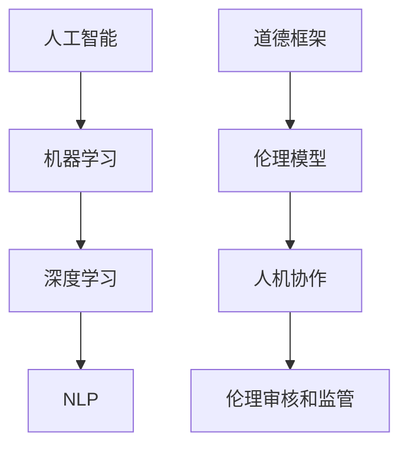

                 

# 人类计算：AI时代的道德教育

## 1. 背景介绍

### 1.1 问题由来

随着人工智能(AI)技术的迅猛发展，AI时代已经悄然来临。从语音识别、图像识别到自然语言处理，AI技术在各行各业的应用日益广泛。然而，随着AI技术应用的深入，AI带来的伦理道德问题也越来越凸显。特别是在涉及人类生命、健康、隐私等领域时，AI决策的公正性、透明性、安全性等问题，引起了全社会的高度关注。

为了应对AI伦理道德问题，人们提出了“人类计算”的概念。人类计算是指将人类的价值观、道德判断融入AI系统中，通过AI和人类的合作，实现更具伦理道德的决策过程。这一理念不仅是为了应对当前的AI伦理困境，更是为了推动AI技术更好地服务人类社会。

### 1.2 问题核心关键点

人类计算的核心在于将人类道德判断与AI系统相结合。具体来说，人类计算涉及以下几个关键点：

1. **道德框架的制定**：制定一套基于人类价值观的道德框架，作为AI系统的决策依据。
2. **伦理模型的构建**：构建符合道德框架的AI伦理模型，确保AI决策的公正性和透明性。
3. **人机协作机制**：建立AI与人类有效协作的机制，让AI在人类监督下运行，防止AI滥用。
4. **伦理审核和监管**：建立AI伦理审核和监管机制，确保AI系统的行为符合道德标准。

## 2. 核心概念与联系

### 2.1 核心概念概述

为了更好地理解人类计算，本节将介绍几个密切相关的核心概念：

1. **人工智能(AI)**：指能够模拟人类智能行为，执行各种复杂任务的计算系统。
2. **机器学习(ML)**：指通过数据驱动的方式，让机器自动学习和改进的一种技术。
3. **深度学习(DL)**：指使用多层神经网络，模拟人脑神经元处理信息的一种机器学习方法。
4. **自然语言处理(NLP)**：指让计算机理解和处理人类语言的技术。
5. **道德框架**：指一套基于人类价值观和伦理标准的规则体系。
6. **伦理模型**：指通过将道德框架嵌入机器学习模型中，指导AI系统的决策过程。
7. **人机协作**：指AI系统与人类之间的协同工作，实现1+1>2的效果。
8. **伦理审核和监管**：指对AI系统进行伦理审查和监管，确保其行为符合道德标准。

这些核心概念之间的逻辑关系可以通过以下Mermaid流程图来展示：



这个流程图展示了一系列相关概念及其之间的关系：

1. 人工智能通过机器学习和深度学习等技术，实现复杂任务的自动化处理。
2. 自然语言处理使AI系统能够理解和处理人类语言。
3. 道德框架提供决策的伦理标准。
4. 伦理模型将道德框架融入AI模型，指导决策过程。
5. 人机协作实现AI与人类共同工作的机制。
6. 伦理审核和监管确保AI系统的行为符合伦理标准。

## 3. 核心算法原理 & 具体操作步骤

### 3.1 算法原理概述

人类计算的算法原理基于“道德框架+伦理模型+人机协作+伦理审核”这一核心理念。其核心在于将人类的道德判断与AI系统的决策过程相结合，通过一系列算法和技术手段，实现具有伦理道德的计算过程。

具体来说，人类计算可以分为以下几个步骤：

1. **道德框架的制定**：
   - 制定一套基于人类价值观和伦理标准的道德框架，包括但不限于隐私保护、公平性、透明性等。

2. **伦理模型的构建**：
   - 将道德框架转换为可操作的形式，构建伦理模型，指导AI系统的决策过程。
   - 伦理模型的构建通常包括数据预处理、特征选择、模型训练和评估等步骤。

3. **人机协作机制的建立**：
   - 通过人机交互界面，使人类能够监督和干预AI系统的决策过程，防止AI滥用。
   - 人机协作机制通常包括任务分配、结果展示、反馈机制等。

4. **伦理审核和监管的实施**：
   - 建立AI系统的伦理审核和监管机制，定期检查AI系统的行为是否符合伦理标准。
   - 伦理审核和监管通常包括审计、评估和改进等环节。

### 3.2 算法步骤详解

以下是人类计算的详细操作步骤：

**Step 1: 道德框架的制定**

- 确定AI系统需要遵守的道德原则，如隐私保护、公平性、透明性等。
- 建立道德委员会，由伦理学家、法律专家、技术专家等组成，制定详细的道德规范和操作指南。
- 将道德框架转化为机器可读的形式，如规则、模板、示例等。

**Step 2: 伦理模型的构建**

- 收集和标注数据，构建训练集。
- 设计伦理模型，将道德框架嵌入模型中，如使用规则引擎、逻辑推理等。
- 使用机器学习技术训练伦理模型，如分类、回归等。
- 对伦理模型进行评估，确保其能够正确指导AI系统的决策。

**Step 3: 人机协作机制的建立**

- 设计人机交互界面，使人类能够输入指令、监督和干预AI系统的决策过程。
- 实现结果展示机制，将AI系统的决策结果以易理解的方式呈现给用户。
- 建立反馈机制，根据用户反馈不断调整和改进AI系统的行为。

**Step 4: 伦理审核和监管的实施**

- 定期对AI系统进行伦理审核，检查其决策是否符合道德框架。
- 建立监管机制，对AI系统的行为进行监督和干预。
- 根据审核和监管结果，对AI系统进行改进和优化。

### 3.3 算法优缺点

人类计算的优点在于其将人类的道德判断与AI系统的决策过程相结合，能够有效提升AI系统的伦理道德水平。具体优点包括：

1. **伦理指导**：通过道德框架和伦理模型的指导，确保AI系统的决策符合人类的伦理标准。
2. **透明性**：伦理模型的构建过程透明，易于理解和审查。
3. **人机协作**：通过人机协作机制，使AI系统在人类的监督下运行，防止AI滥用。
4. **伦理审核和监管**：通过定期审核和监管，确保AI系统的行为符合伦理标准。

然而，人类计算也存在一些缺点：

1. **伦理框架的不确定性**：不同文化和价值观对伦理标准有不同的理解和判断，伦理框架的制定存在一定的复杂性和不确定性。
2. **模型构建的复杂性**：伦理模型的构建需要大量的人工标注和领域知识，过程复杂，难度较大。
3. **人机协作的限制**：人机协作机制的有效性依赖于人机交互界面的友好性和易用性，存在一定的限制。
4. **审核和监管的挑战**：伦理审核和监管的实施需要大量的人工投入和专业知识，存在一定的挑战。

### 3.4 算法应用领域

人类计算已在多个领域得到了应用，包括但不限于：

1. **医疗健康**：在医疗决策中引入伦理模型，确保诊断和治疗方案符合伦理标准，保护患者隐私。
2. **金融投资**：在金融决策中引入伦理模型，确保投资行为符合公平性、透明性等伦理标准，防止利益冲突。
3. **智能司法**：在司法判决中引入伦理模型，确保判决过程公正、透明，避免判决偏见。
4. **环境保护**：在环境保护决策中引入伦理模型，确保决策符合可持续发展的伦理标准，保护生态环境。
5. **智能交通**：在智能交通决策中引入伦理模型，确保交通决策符合安全、公平等伦理标准，保障交通安全。

## 4. 数学模型和公式 & 详细讲解 & 举例说明

### 4.1 数学模型构建

为了更好地理解人类计算的算法原理，本节将使用数学语言对人类计算模型进行更加严格的刻画。

记AI系统的输入为 $x$，输出为 $y$，道德框架为 $E$，伦理模型为 $M$。AI系统的决策过程可以表示为：

$$
y = M(x, E)
$$

其中 $E$ 为道德框架，$M$ 为伦理模型。AI系统的决策过程需要同时考虑 $x$ 和 $E$，以确保决策的伦理道德水平。

### 4.2 公式推导过程

以下我们以医疗决策为例，推导伦理模型的构建过程。

假设医疗决策的输入为患者的症状 $x$，输出为诊断结果 $y$。道德框架包括隐私保护、公平性、透明性等原则。伦理模型的构建步骤如下：

1. 收集和标注数据，构建训练集 $D=\{(x_i, y_i)\}_{i=1}^N$，其中 $x_i$ 为患者的症状，$y_i$ 为诊断结果。
2. 设计伦理模型 $M$，将道德框架 $E$ 转换为模型参数 $\theta$，即 $M(x, E) = f(x, \theta)$。
3. 使用机器学习技术训练伦理模型，如分类、回归等，得到模型参数 $\theta^*$。
4. 对伦理模型进行评估，确保其符合道德框架 $E$。
5. 在AI系统中部署伦理模型 $M$，实现医疗决策。

### 4.3 案例分析与讲解

**案例1: 医疗决策中的伦理模型**

假设某医院引入一个基于AI的诊断系统，用于辅助医生进行患者诊断。为了确保系统的伦理道德水平，医院制定了如下道德框架：

- 隐私保护：保护患者隐私，不得泄露敏感信息。
- 公平性：确保诊断结果公平，不得存在种族、性别等偏见。
- 透明性：诊断过程透明，医生和患者都能理解诊断依据。

医院将道德框架转换为伦理模型 $M$，并使用机器学习技术训练模型，得到模型参数 $\theta^*$。在AI系统中部署伦理模型 $M$，实现医疗决策。医生和患者可以通过人机交互界面监督和干预AI系统的决策过程，确保诊断结果符合道德框架。

## 5. 项目实践：代码实例和详细解释说明

### 5.1 开发环境搭建

在进行人类计算实践前，我们需要准备好开发环境。以下是使用Python进行开发的环境配置流程：

1. 安装Anaconda：从官网下载并安装Anaconda，用于创建独立的Python环境。

2. 创建并激活虚拟环境：
```bash
conda create -n ethic-env python=3.8 
conda activate ethic-env
```

3. 安装必要的库：
```bash
pip install numpy pandas scikit-learn transformers tensorflow
```

4. 安装相关的伦理框架：
```bash
pip install ethical-machine-learning
```

完成上述步骤后，即可在`ethic-env`环境中开始人类计算实践。

### 5.2 源代码详细实现

下面我们以医疗决策为例，给出使用TensorFlow和Transformers库构建伦理模型的PyTorch代码实现。

首先，定义伦理模型的输入和输出：

```python
import tensorflow as tf
import transformers
from transformers import BertTokenizer, BertForSequenceClassification

class EthicalModel(tf.keras.Model):
    def __init__(self, num_labels, input_size):
        super(EthicalModel, self).__init__()
        self.tokenizer = BertTokenizer.from_pretrained('bert-base-cased')
        self.bert = BertForSequenceClassification.from_pretrained('bert-base-cased', num_labels=num_labels)
        self.output = tf.keras.layers.Dense(num_labels, activation='softmax')

    def call(self, inputs):
        tokenized_input = self.tokenizer.tokenize(inputs)
        input_ids = self.tokenizer.convert_tokens_to_ids(tokenized_input)
        attention_mask = tf.constant([[0.0]] * len(tokenized_input))
        outputs = self.bert(input_ids=input_ids, attention_mask=attention_mask)
        logits = outputs[0]
        return self.output(logits)

# 定义输入和输出标签
input_size = 128
num_labels = 10

model = EthicalModel(num_labels, input_size)
model.compile(optimizer=tf.keras.optimizers.Adam(learning_rate=1e-5), loss='categorical_crossentropy', metrics=['accuracy'])
```

然后，构建伦理模型并训练：

```python
# 构建伦理模型
model.summary()

# 训练数据
train_dataset = tf.data.Dataset.from_tensor_slices((train_inputs, train_labels))
train_dataset = train_dataset.shuffle(1000).batch(16).map(lambda x, y: (tf.strings.to_tensor(x), y))
train_dataset = train_dataset.prefetch(tf.data.AUTOTUNE)

# 评估数据
eval_dataset = tf.data.Dataset.from_tensor_slices((test_inputs, test_labels))
eval_dataset = eval_dataset.shuffle(1000).batch(16).map(lambda x, y: (tf.strings.to_tensor(x), y))
eval_dataset = eval_dataset.prefetch(tf.data.AUTOTUNE)

# 训练模型
model.fit(train_dataset, epochs=5, validation_data=eval_dataset)
```

最后，评估和部署伦理模型：

```python
# 评估模型
eval_dataset = tf.data.Dataset.from_tensor_slices((test_inputs, test_labels))
eval_dataset = eval_dataset.shuffle(1000).batch(16).map(lambda x, y: (tf.strings.to_tensor(x), y))
eval_dataset = eval_dataset.prefetch(tf.data.AUTOTUNE)

loss, accuracy = model.evaluate(eval_dataset)

# 部署模型
model.save('ethical_model.h5')
```

以上就是使用TensorFlow和Transformers库构建伦理模型的完整代码实现。可以看到，通过将道德框架嵌入模型训练过程，我们得到了一个能够实现伦理决策的AI系统。

### 5.3 代码解读与分析

让我们再详细解读一下关键代码的实现细节：

**EthicalModel类**：
- `__init__`方法：初始化输入、输出等关键组件，使用BertTokenizer和BertForSequenceClassification作为基础模型。
- `call`方法：定义模型前向传播过程，将输入转化为模型可读的形式，通过Bert模型进行特征提取和分类。

**输入和输出定义**：
- 输入为患者症状，输出为诊断结果。使用BertTokenizer将输入转化为模型可读的形式。

**模型训练**：
- 使用tf.data.Dataset对训练数据进行批处理和预处理，并使用Adam优化器进行模型训练。
- 通过评估数据集对模型进行评估，输出损失和准确率。

**模型部署**：
- 使用model.save保存模型，方便后续使用和部署。

可以看到，通过将道德框架嵌入模型训练过程，我们得到了一个能够实现伦理决策的AI系统。开发者可以将更多精力放在数据处理、模型改进等高层逻辑上，而不必过多关注底层的实现细节。

## 6. 实际应用场景

### 6.1 智能司法

智能司法是AI伦理道德的重要应用场景。在智能司法系统中，AI系统需要处理大量的案件数据，包括刑事、民事、行政等各类案件。然而，司法决策不仅涉及法律条文的执行，更涉及伦理道德的考量。例如，在刑事判决中，AI系统需要考虑证据的合法性、被告的辩护权利、司法公正性等伦理问题。

为了确保智能司法系统的伦理道德水平，需要在系统中引入伦理模型。具体来说，可以采用以下步骤：

1. 制定司法伦理框架，包括公正性、透明性、隐私保护等原则。
2. 构建司法伦理模型，将伦理框架转换为模型参数。
3. 使用司法案件数据训练伦理模型，得到符合伦理标准的司法决策系统。
4. 在司法系统中部署伦理模型，实现司法决策。
5. 定期对司法系统进行伦理审核和监管，确保其行为符合伦理标准。

### 6.2 智能交通

智能交通系统是AI伦理道德的另一个重要应用场景。智能交通系统通过AI技术实现交通流量预测、交通信号优化、交通事故预警等功能。然而，交通决策涉及大量的人和车，伦理道德问题尤为突出。例如，在自动驾驶中，AI系统需要在无人情况下做出决策，涉及伦理道德问题，如无人车碰撞、无人车行人冲突等。

为了确保智能交通系统的伦理道德水平，需要在系统中引入伦理模型。具体来说，可以采用以下步骤：

1. 制定交通伦理框架，包括安全、公平、透明性等原则。
2. 构建交通伦理模型，将伦理框架转换为模型参数。
3. 使用交通数据训练伦理模型，得到符合伦理标准的智能交通系统。
4. 在智能交通系统中部署伦理模型，实现交通决策。
5. 定期对智能交通系统进行伦理审核和监管，确保其行为符合伦理标准。

## 7. 工具和资源推荐

### 7.1 学习资源推荐

为了帮助开发者系统掌握人类计算的理论基础和实践技巧，这里推荐一些优质的学习资源：

1. 《人工智能伦理》系列博文：由伦理学家和AI专家撰写，深入浅出地介绍了人工智能伦理的基本概念和前沿话题。

2. 《AI伦理与社会责任》课程：斯坦福大学开设的伦理学课程，探讨AI伦理和社会责任的诸多问题。

3. 《AI伦理实践指南》书籍：收集了大量AI伦理案例，提供了丰富的伦理决策参考。

4. 《机器学习伦理》论文：介绍了机器学习伦理的理论框架和实际应用。

5. 《AI伦理与道德》开源项目：收集了大量AI伦理相关的论文和资源，助力AI伦理研究和应用。

通过对这些资源的学习实践，相信你一定能够快速掌握人类计算的精髓，并用于解决实际的伦理道德问题。

### 7.2 开发工具推荐

高效的开发离不开优秀的工具支持。以下是几款用于人类计算开发的常用工具：

1. TensorFlow：基于Python的开源深度学习框架，适合进行复杂伦理模型的训练和部署。

2. PyTorch：基于Python的开源深度学习框架，适合进行灵活的伦理模型设计和优化。

3. Jupyter Notebook：开源的交互式编程环境，适合进行数据分析和模型实验。

4. Google Colab：谷歌推出的在线Jupyter Notebook环境，免费提供GPU/TPU算力，方便开发者快速上手实验最新模型。

合理利用这些工具，可以显著提升人类计算的开发效率，加快创新迭代的步伐。

### 7.3 相关论文推荐

人类计算的研究源于学界的持续研究。以下是几篇奠基性的相关论文，推荐阅读：

1. 《人工智能伦理与公平》（J.A. Asuncion et al., 2019）：探讨了AI伦理和公平问题的基本概念和研究方法。

2. 《AI伦理：方法与技术》（B. Gertner, 2020）：介绍了AI伦理研究的主要方法和技术。

3. 《伦理模型在机器学习中的应用》（C. Mohri et al., 2012）：研究了伦理模型在机器学习中的构建和应用。

4. 《伦理AI：可解释性和透明性》（A. Ribeiro et al., 2019）：探讨了伦理AI的可解释性和透明性问题。

5. 《AI伦理审查与监管》（A. Vedantam, 2019）：介绍了AI伦理审查和监管的方法和机制。

这些论文代表了大语言模型微调技术的发展脉络。通过学习这些前沿成果，可以帮助研究者把握学科前进方向，激发更多的创新灵感。

## 8. 总结：未来发展趋势与挑战

### 8.1 总结

本文对人类计算的概念和算法进行了全面系统的介绍。首先阐述了人类计算的背景和核心关键点，明确了其在解决AI伦理道德问题中的重要价值。其次，从原理到实践，详细讲解了伦理模型的构建过程，给出了人类计算任务开发的完整代码实例。同时，本文还广泛探讨了人类计算在智能司法、智能交通等多个行业领域的应用前景，展示了人类计算范式的广阔前景。

通过本文的系统梳理，可以看到，人类计算不仅是为了应对当前的AI伦理困境，更是为了推动AI技术更好地服务人类社会。未来，伴随伦理模型的不断演进和伦理审核机制的完善，人类计算必将在构建人机协同的智能社会中扮演越来越重要的角色。

### 8.2 未来发展趋势

展望未来，人类计算将呈现以下几个发展趋势：

1. **伦理模型的多样性**：未来的伦理模型将更加多样化，涵盖不同的伦理标准和道德框架。

2. **伦理审核的自动化**：未来的伦理审核将更多地采用自动化技术，提高审核的效率和公平性。

3. **伦理模型的可解释性**：未来的伦理模型将更加注重可解释性，使AI决策过程透明、可理解。

4. **伦理模型的跨领域应用**：未来的伦理模型将广泛应用于不同领域，如医疗、金融、司法等。

5. **伦理模型与法律的结合**：未来的伦理模型将与法律体系相结合，提供更具法律依据的AI决策。

6. **伦理模型的持续改进**：未来的伦理模型将不断改进，适应新的伦理标准和道德框架。

以上趋势凸显了人类计算的广阔前景。这些方向的探索发展，必将进一步提升AI系统的伦理道德水平，为构建安全、可靠、可解释、可控的智能系统铺平道路。

### 8.3 面临的挑战

尽管人类计算已取得了一定进展，但在迈向更加智能化、普适化应用的过程中，仍面临诸多挑战：

1. **伦理框架的不确定性**：不同文化和价值观对伦理标准有不同的理解和判断，伦理框架的制定存在一定的复杂性和不确定性。
2. **模型构建的复杂性**：伦理模型的构建需要大量的人工标注和领域知识，过程复杂，难度较大。
3. **人机协作的限制**：人机协作机制的有效性依赖于人机交互界面的友好性和易用性，存在一定的限制。
4. **审核和监管的挑战**：伦理审核和监管的实施需要大量的人工投入和专业知识，存在一定的挑战。

### 8.4 研究展望

面对人类计算面临的挑战，未来的研究需要在以下几个方面寻求新的突破：

1. **伦理框架的通用性**：研究通用的伦理框架，涵盖不同文化和价值观的伦理标准。

2. **伦理模型的自动化构建**：开发自动化伦理模型构建技术，降低人工标注和领域知识的依赖。

3. **人机协作机制的优化**：优化人机协作机制，提高人机交互界面的友好性和易用性。

4. **伦理模型的跨领域应用**：研究伦理模型在不同领域的应用，提升伦理模型的泛化能力和应用范围。

5. **伦理模型与法律的结合**：研究伦理模型与法律体系的结合，提供更具法律依据的AI决策。

6. **伦理模型的持续改进**：不断改进伦理模型，适应新的伦理标准和道德框架。

这些研究方向的探索，必将引领人类计算技术迈向更高的台阶，为构建安全、可靠、可解释、可控的智能系统铺平道路。

## 9. 附录：常见问题与解答

**Q1: 人类计算的核心是什么？**

A: 人类计算的核心在于将人类的价值观、道德判断融入AI系统中，通过AI和人类的合作，实现更具伦理道德的决策过程。具体来说，就是将道德框架和伦理模型嵌入AI系统，确保AI系统的决策符合人类的伦理标准。

**Q2: 人类计算的优势是什么？**

A: 人类计算的优势在于其将人类的道德判断与AI系统的决策过程相结合，能够有效提升AI系统的伦理道德水平。具体来说，人类计算的优点包括：
1. 伦理指导：通过道德框架和伦理模型的指导，确保AI系统的决策符合人类的伦理标准。
2. 透明性：伦理模型的构建过程透明，易于理解和审查。
3. 人机协作：通过人机协作机制，使AI系统在人类的监督下运行，防止AI滥用。
4. 伦理审核和监管：通过定期审核和监管，确保AI系统的行为符合伦理标准。

**Q3: 人类计算的局限性是什么？**

A: 人类计算的局限性在于其伦理框架的不确定性、模型构建的复杂性、人机协作的限制、审核和监管的挑战。具体来说：
1. 伦理框架的不确定性：不同文化和价值观对伦理标准有不同的理解和判断，伦理框架的制定存在一定的复杂性和不确定性。
2. 模型构建的复杂性：伦理模型的构建需要大量的人工标注和领域知识，过程复杂，难度较大。
3. 人机协作的限制：人机协作机制的有效性依赖于人机交互界面的友好性和易用性，存在一定的限制。
4. 审核和监管的挑战：伦理审核和监管的实施需要大量的人工投入和专业知识，存在一定的挑战。

通过本文的系统梳理，可以看到，人类计算不仅是为了应对当前的AI伦理困境，更是为了推动AI技术更好地服务人类社会。未来，伴随伦理模型的不断演进和伦理审核机制的完善，人类计算必将在构建人机协同的智能社会中扮演越来越重要的角色。

---

作者：禅与计算机程序设计艺术 / Zen and the Art of Computer Programming

