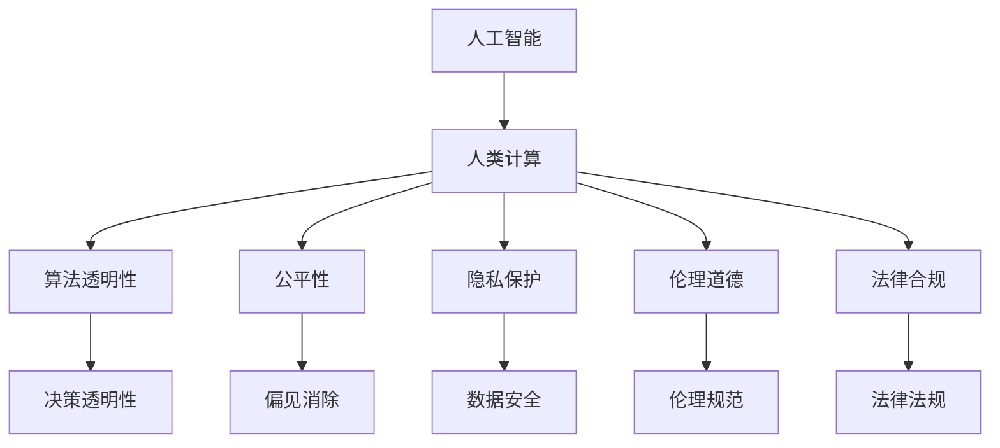

                 

# 人类计算：技术、社会和伦理的交叉点

> 关键词：人类计算, 人工智能, 社会影响, 伦理道德, 计算伦理, 智能算法, 技术治理

## 1. 背景介绍

### 1.1 问题由来
随着计算机技术的发展，人工智能(AI)逐渐成为推动社会进步的重要力量。然而，在人工智能带来便利的同时，也引发了一系列复杂的伦理和社会问题。这些问题不仅涉及技术层面的算法设计，还触及法律、经济、文化等多方面领域。如何平衡技术发展与社会伦理，成为当前AI研究领域的重要课题。

### 1.2 问题核心关键点
- **技术深度融合**：人工智能技术的深度应用，已经与教育、医疗、金融等社会各个领域紧密相连。
- **社会效应显著**：AI系统在提升效率、改善生活质量的同时，也可能带来就业减少、隐私泄露、偏见等问题。
- **伦理道德边界**：如何在技术创新和伦理规范之间寻找平衡，成为需要认真思考和解决的重大问题。
- **法律政策挑战**：AI技术的普及应用，对现行法律法规提出了新的挑战，需要制定相应的法律框架。
- **公平性和透明性**：AI系统决策过程的透明性和结果的公平性，关系到公众的信任和接受度。

## 2. 核心概念与联系

### 2.1 核心概念概述

为了深入理解AI技术对社会的综合影响，我们引入以下几个核心概念：

- **人工智能(AI)**：指通过计算机技术模拟人类智能行为，包括感知、理解、学习、推理等能力的总称。
- **人类计算(Human Computing)**：指利用AI技术，在各个领域协助人类进行计算和决策，提升人类工作效率和生活质量。
- **算法透明性(Algorithmic Transparency)**：指AI系统决策过程的清晰度和可解释性，让使用者能够理解系统如何得出结论。
- **公平性(Fairness)**：指AI系统在处理数据和生成输出时，不应存在歧视性，应保证对所有人群公平。
- **隐私保护(Privacy Protection)**：指AI系统在使用用户数据时，需要保护用户隐私，避免数据泄露和滥用。
- **伦理道德(Ethics and Morality)**：指AI系统在设计、应用过程中，需要遵守的伦理准则和道德规范。
- **法律合规(Legal Compliance)**：指AI系统在使用和推广过程中，需要符合法律法规，避免侵犯权益和违法犯罪。

这些概念之间的联系可以通过以下Mermaid流程图展示：



这个流程图展示了AI技术在推动社会进步的同时，涉及的各个方面的联系和相互影响。

## 3. 核心算法原理 & 具体操作步骤
### 3.1 算法原理概述

人工智能技术的核心在于算法设计。AI系统通过各种算法，对输入的数据进行处理和分析，生成输出结果。这些算法需要考虑数据处理效率、精度、可解释性等多个方面。

以深度学习算法为例，其基本原理是利用神经网络结构，通过反向传播算法优化模型参数，实现对数据的自动学习和特征提取。具体步骤如下：

1. **数据预处理**：清洗、整理数据，并进行标准化处理。
2. **模型设计**：选择合适的神经网络结构，设置输入、输出和隐藏层的节点数和激活函数。
3. **模型训练**：使用训练集对模型进行训练，调整参数以最小化预测误差。
4. **模型评估**：使用测试集对模型进行评估，检验其泛化能力。
5. **模型应用**：将训练好的模型应用于实际问题，生成预测结果。

### 3.2 算法步骤详解

以下是深度学习算法的基本步骤详解：

**Step 1: 数据预处理**
- 清洗数据，去除噪声和异常值。
- 标准化数据，将其转化为模型可以处理的形式。

**Step 2: 模型设计**
- 选择合适的网络结构，如卷积神经网络(CNN)、递归神经网络(RNN)等。
- 设置输入、输出和隐藏层的节点数，确定激活函数和损失函数。

**Step 3: 模型训练**
- 使用训练集对模型进行迭代训练，更新参数以最小化预测误差。
- 使用随机梯度下降(SGD)或Adam等优化算法，调整模型参数。
- 设置学习率、批大小、迭代轮数等超参数，优化训练过程。

**Step 4: 模型评估**
- 使用测试集对模型进行评估，计算准确率、召回率、F1值等指标。
- 通过混淆矩阵、ROC曲线等工具，分析模型性能。

**Step 5: 模型应用**
- 将训练好的模型应用于实际问题，进行预测或分类。
- 处理多标签分类、序列标注等复杂任务。

### 3.3 算法优缺点

深度学习算法在AI领域得到了广泛应用，其优缺点如下：

**优点**
- 高精度：在处理大规模数据时，深度学习算法通常能获得较高的精度。
- 自适应：模型能够自动学习数据的特征，无需人工干预。
- 泛化能力强：通过大量数据训练，深度学习模型能够处理新的未见数据。

**缺点**
- 计算资源需求高：深度学习算法需要大量的计算资源和存储空间。
- 参数过多：模型参数数量庞大，增加了模型训练的复杂度。
- 可解释性差：深度学习模型通常被视为"黑盒"系统，难以解释其内部工作机制。

### 3.4 算法应用领域

深度学习算法广泛应用于多个领域，例如：

- **计算机视觉**：图像分类、目标检测、人脸识别等。
- **自然语言处理(NLP)**：机器翻译、情感分析、文本生成等。
- **语音识别**：语音转文本、语音合成等。
- **推荐系统**：商品推荐、广告推荐等。
- **医疗诊断**：疾病诊断、治疗方案推荐等。
- **金融预测**：股票预测、风险评估等。

## 4. 数学模型和公式 & 详细讲解  
### 4.1 数学模型构建

深度学习算法通过神经网络模型，对输入数据进行处理和分析。以卷积神经网络(CNN)为例，其基本结构包括卷积层、池化层、全连接层等。数学模型构建如下：

$$
\begin{aligned}
&\mathbf{y} = \mathbf{W} \mathbf{x} + \mathbf{b}\\
&\mathbf{y} = \max(0, \mathbf{y})\\
&\mathbf{y} = \mathbf{W} \mathbf{y} + \mathbf{b}\\
&\mathbf{y} = softmax(\mathbf{y})
\end{aligned}
$$

其中，$\mathbf{x}$ 为输入向量，$\mathbf{y}$ 为输出向量，$\mathbf{W}$ 和 $\mathbf{b}$ 为模型参数。

### 4.2 公式推导过程

以反向传播算法为例，其基本流程如下：

1. **前向传播**：将输入数据通过神经网络，计算输出结果。
2. **计算误差**：计算预测值与真实值之间的误差。
3. **反向传播**：根据误差，反向计算每个参数的梯度。
4. **参数更新**：使用梯度下降算法，更新模型参数。

具体推导过程如下：

1. **前向传播**
$$
\begin{aligned}
&\mathbf{a}^{(1)} = \mathbf{W}^{(1)} \mathbf{x} + \mathbf{b}^{(1)}\\
&\mathbf{a}^{(2)} = \mathbf{W}^{(2)} \mathbf{a}^{(1)} + \mathbf{b}^{(2)}\\
&\hat{\mathbf{y}} = \mathbf{W}^{(3)} \mathbf{a}^{(2)} + \mathbf{b}^{(3)}
\end{aligned}
$$

2. **计算误差**
$$
J(\mathbf{W}, \mathbf{b}) = -\frac{1}{N} \sum_{i=1}^N \sum_{j=1}^C y_{ij} \log \hat{y}_{ij} + (1 - y_{ij}) \log (1 - \hat{y}_{ij})
$$

3. **反向传播**
$$
\frac{\partial J}{\partial \mathbf{W}^{(l)}} = \mathbf{a}^{(l+1)}(\mathbf{a}^{(l+1)})^T - \frac{1}{N} \sum_{i=1}^N \mathbf{y}_i (\mathbf{y}_i)^T
$$

4. **参数更新**
$$
\mathbf{W}^{(l)} \leftarrow \mathbf{W}^{(l)} - \eta \frac{\partial J}{\partial \mathbf{W}^{(l)}}
$$

### 4.3 案例分析与讲解

以图像分类为例，深度学习模型通常使用卷积神经网络进行特征提取和分类。通过多层次的卷积、池化操作，模型能够自动学习图像的局部特征和全局特征，从而实现高精度的分类。

例如，AlexNet模型使用5个卷积层、3个全连接层，通过LeNet的结构改进，在ImageNet数据集上取得了很好的结果。其核心算法如下：

1. **卷积层**：通过卷积核对输入图像进行卷积操作，提取图像的局部特征。
2. **池化层**：通过最大池化操作，缩小特征图尺寸，减少计算量。
3. **全连接层**：通过全连接层，将特征图映射为类别概率分布。
4. **softmax层**：通过softmax函数，将输出转化为类别概率分布。

## 5. 项目实践：代码实例和详细解释说明
### 5.1 开发环境搭建

以下是使用Python和TensorFlow进行深度学习算法实践的开发环境搭建流程：

1. 安装Anaconda：从官网下载并安装Anaconda，用于创建独立的Python环境。
2. 创建并激活虚拟环境：
```bash
conda create -n tf-env python=3.8 
conda activate tf-env
```

3. 安装TensorFlow：从官网获取对应的安装命令。例如：
```bash
pip install tensorflow-gpu
```

4. 安装各类工具包：
```bash
pip install numpy pandas scikit-learn matplotlib tqdm jupyter notebook ipython
```

5. 安装Transformers库：
```bash
pip install transformers
```

完成上述步骤后，即可在`tf-env`环境中开始深度学习算法的实践。

### 5.2 源代码详细实现

以下是使用TensorFlow进行图像分类的代码实现：

```python
import tensorflow as tf
from tensorflow.keras import datasets, layers, models

# 加载数据集
(train_images, train_labels), (test_images, test_labels) = datasets.cifar10.load_data()

# 数据预处理
train_images, test_images = train_images / 255.0, test_images / 255.0

# 定义模型
model = models.Sequential()
model.add(layers.Conv2D(32, (3, 3), activation='relu', input_shape=(32, 32, 3)))
model.add(layers.MaxPooling2D((2, 2)))
model.add(layers.Conv2D(64, (3, 3), activation='relu'))
model.add(layers.MaxPooling2D((2, 2)))
model.add(layers.Conv2D(64, (3, 3), activation='relu'))

# 添加全连接层
model.add(layers.Flatten())
model.add(layers.Dense(64, activation='relu'))
model.add(layers.Dense(10))

# 编译模型
model.compile(optimizer='adam',
              loss=tf.keras.losses.SparseCategoricalCrossentropy(from_logits=True),
              metrics=['accuracy'])

# 训练模型
history = model.fit(train_images, train_labels, epochs=10, 
                    validation_data=(test_images, test_labels))

# 评估模型
test_loss, test_acc = model.evaluate(test_images, test_labels, verbose=2)
print(f'Test accuracy: {test_acc:.2f}')
```

### 5.3 代码解读与分析

让我们再详细解读一下关键代码的实现细节：

**数据预处理**
- `train_images, test_images = train_images / 255.0, test_images / 255.0`：将像素值标准化到[0,1]区间，方便模型训练。

**模型定义**
- `model.add(layers.Conv2D(32, (3, 3), activation='relu', input_shape=(32, 32, 3)))`：添加卷积层，使用32个3x3的卷积核，激活函数为ReLU。
- `model.add(layers.MaxPooling2D((2, 2)))`：添加池化层，使用2x2的最大池化操作。
- `model.add(layers.Conv2D(64, (3, 3), activation='relu'))`：添加卷积层，使用64个3x3的卷积核，激活函数为ReLU。
- `model.add(layers.Flatten())`：添加Flatten层，将特征图展开成向量。
- `model.add(layers.Dense(64, activation='relu'))`：添加全连接层，使用64个节点，激活函数为ReLU。
- `model.add(layers.Dense(10))`：添加输出层，使用10个节点，对应10个类别。

**模型编译**
- `model.compile(optimizer='adam', ...)`：编译模型，使用Adam优化器，损失函数为交叉熵。

**模型训练**
- `model.fit(train_images, train_labels, epochs=10, ...)`：训练模型，使用训练集数据，设置10个epochs。

**模型评估**
- `model.evaluate(test_images, test_labels, verbose=2)`：评估模型，使用测试集数据。

## 6. 实际应用场景
### 6.1 智能客服系统

基于深度学习算法的智能客服系统，能够自动理解客户需求，提供个性化服务。系统通过语音识别和自然语言处理，将客户输入转化为文本，然后使用文本分类模型判断客户需求类型，进一步使用生成模型生成响应。

例如，可以使用BERT模型进行意图分类，使用GPT模型进行回答生成。系统通过不断优化模型参数，提升自然语言理解和生成能力，从而实现更高的客户满意度。

### 6.2 金融风险管理

在金融领域，深度学习算法可以用于风险预测和异常检测。系统通过收集市场数据、交易数据、新闻舆情等，使用LSTM模型进行时间序列分析，使用GAN模型进行异常检测，及时发现潜在的风险。

例如，可以使用LSTM模型对历史交易数据进行建模，预测未来的股价变化，使用GAN模型生成虚拟交易数据，检测交易中的异常行为。通过持续监测和预警，系统能够及时应对市场波动，保障投资安全。

### 6.3 医疗影像分析

深度学习算法在医疗影像分析中具有重要应用。系统通过收集大量的医疗影像数据，使用卷积神经网络进行特征提取和分类，自动识别病灶和病变类型。

例如，可以使用ResNet模型对医学影像进行分类，使用U-Net模型进行图像分割，自动检测肿瘤、骨折等病灶。通过持续训练和优化，系统能够逐步提升检测精度，辅助医生进行诊断和治疗。

## 7. 工具和资源推荐
### 7.1 学习资源推荐

为了帮助开发者系统掌握深度学习算法的理论基础和实践技巧，以下是一些优质的学习资源：

1. 《深度学习》（Ian Goodfellow）：经典教材，全面介绍了深度学习的基本概念和算法。
2. CS231n《卷积神经网络》课程：斯坦福大学开设的计算机视觉课程，深入讲解了CNN模型及其应用。
3. CS224n《自然语言处理》课程：斯坦福大学开设的NLP课程，覆盖了自然语言处理的多个方面。
4. TensorFlow官方文档：TensorFlow的官方文档，提供了丰富的API和教程，适合初学者和进阶开发者。
5. PyTorch官方文档：PyTorch的官方文档，提供了灵活的动态计算图，适合快速迭代研究。

通过对这些资源的学习实践，相信你一定能够快速掌握深度学习算法的精髓，并用于解决实际的NLP问题。

### 7.2 开发工具推荐

高效的开发离不开优秀的工具支持。以下是几款用于深度学习算法开发的常用工具：

1. PyTorch：基于Python的开源深度学习框架，灵活动态的计算图，适合快速迭代研究。大部分深度学习算法都有PyTorch版本的实现。
2. TensorFlow：由Google主导开发的开源深度学习框架，生产部署方便，适合大规模工程应用。同样有丰富的深度学习算法资源。
3. Keras：高级神经网络API，提供了简单易用的接口，适合初学者快速上手。
4. Jupyter Notebook：交互式开发环境，支持代码编写、数据可视化等多种功能。
5. Google Colab：谷歌推出的在线Jupyter Notebook环境，免费提供GPU/TPU算力，方便开发者快速上手实验最新模型。

合理利用这些工具，可以显著提升深度学习算法的开发效率，加快创新迭代的步伐。

### 7.3 相关论文推荐

深度学习算法的发展源于学界的持续研究。以下是几篇奠基性的相关论文，推荐阅读：

1. AlexNet: ImageNet Classification with Deep Convolutional Neural Networks：提出了AlexNet模型，在ImageNet数据集上取得了很好的结果。
2. Google's Inception: Scale is Key：引入了Inception模块，提升了卷积神经网络的计算效率和精度。
3. GoogleNet: Going Deeper with convolutions：提出了GoogleNet模型，使用多层次Inception模块，提升了模型深度和精度。
4. ResNet: Deep Residual Learning for Image Recognition：提出了ResNet模型，解决了深度神经网络退化的问题。
5. VGGNet: Very Deep Convolutional Networks for Large-Scale Image Recognition：提出了VGGNet模型，使用大量卷积层进行特征提取。
6. DenseNet: Dense Convolutional Networks：提出了DenseNet模型，通过密集连接提升特征传递和重用。

这些论文代表了大规模深度学习算法的演进过程，通过学习这些前沿成果，可以帮助研究者把握学科前进方向，激发更多的创新灵感。

## 8. 总结：未来发展趋势与挑战
### 8.1 研究成果总结

深度学习算法在AI领域取得了显著的进展，广泛应用于图像分类、自然语言处理、语音识别等多个领域。其核心算法包括卷积神经网络、循环神经网络、生成对抗网络等，已经成为了现代AI技术的基石。

### 8.2 未来发展趋势

展望未来，深度学习算法将呈现以下几个发展趋势：

1. 模型规模持续增大。随着算力成本的下降和数据规模的扩张，深度学习模型的参数量还将持续增长。超大批次的训练和推理也可能遇到显存不足的问题。
2. 算法多样性增加。未来的深度学习算法将出现更多的创新形式，如变分自编码器、对抗生成网络等，不断提升模型性能和应用场景。
3. 多模态融合。未来的深度学习算法将更加注重多模态数据的融合，如视觉、语音、文本等多种信息协同处理，提升模型的全面性和泛化能力。
4. 计算硬件发展。随着硬件技术的不断进步，深度学习算法的训练和推理效率将进一步提升，分布式训练和边缘计算等技术将得到广泛应用。
5. 自动化学习。未来的深度学习算法将更加注重自动化学习和自适应能力，通过强化学习等方法，提高模型的自我改进和适应性。

### 8.3 面临的挑战

尽管深度学习算法取得了显著的进展，但在迈向更加智能化、普适化应用的过程中，仍面临诸多挑战：

1. 数据依赖问题。深度学习算法的训练需要大量标注数据，标注成本高昂。如何降低数据依赖，提升算法的泛化能力，是一个亟待解决的问题。
2. 计算资源需求高。深度学习算法的计算资源需求高，对GPU/TPU等高性能设备依赖性强。如何提高算法的计算效率，降低资源消耗，是未来需要关注的方向。
3. 模型可解释性差。深度学习模型通常被视为"黑盒"系统，难以解释其内部工作机制和决策逻辑。如何提高模型的可解释性，增强用户信任，是未来需要解决的问题。
4. 公平性和偏见问题。深度学习模型可能会存在偏见和歧视，如何保证模型的公平性和偏见性，是未来需要解决的问题。
5. 伦理道德问题。深度学习模型的使用需要遵守伦理道德规范，如何避免模型误用，保护用户隐私和权益，是未来需要关注的问题。

### 8.4 研究展望

未来的深度学习算法需要从多个方面进行改进和优化：

1. 开发更高效的学习算法。未来的深度学习算法需要进一步提升计算效率和模型性能，通过算法优化和硬件改进，实现更高效的模型训练和推理。
2. 引入更多先验知识。将符号化的先验知识，如知识图谱、逻辑规则等，与神经网络模型进行巧妙融合，引导模型学习更准确、合理的语言模型。
3. 开发更多领域应用。将深度学习算法应用于更多领域，如智能医疗、智慧城市、金融预测等，提升各行业的智能化水平。
4. 增强算法的可解释性。通过可解释性研究，增强深度学习算法的透明度，让使用者能够理解模型的决策过程和输出结果。
5. 保障算法公平性。通过公平性研究，构建公平无偏的深度学习模型，确保模型对所有人群公平。
6. 遵循伦理道德规范。在算法设计和使用过程中，遵守伦理道德规范，保护用户隐私和权益。

总之，深度学习算法在推动社会进步的同时，需要积极应对各种挑战，不断改进和优化模型，才能实现更加智能化、普适化的应用。只有勇于创新、敢于突破，才能不断拓展AI技术的边界，让人工智能技术更好地造福人类社会。

## 9. 附录：常见问题与解答

**Q1: 深度学习算法在哪些领域应用广泛？**

A: 深度学习算法在计算机视觉、自然语言处理、语音识别、推荐系统、医疗诊断、金融预测等多个领域得到了广泛应用。

**Q2: 深度学习算法的核心优势是什么？**

A: 深度学习算法的核心优势在于其强大的特征提取能力和高精度。通过多层次的神经网络结构，深度学习算法能够自动学习数据的复杂特征，从而实现高精度的预测和分类。

**Q3: 深度学习算法的缺点有哪些？**

A: 深度学习算法的缺点包括计算资源需求高、参数过多、可解释性差等。

**Q4: 如何提高深度学习算法的计算效率？**

A: 通过优化算法、使用分布式训练、硬件加速等方式，可以显著提高深度学习算法的计算效率。

**Q5: 如何提高深度学习算法的可解释性？**

A: 通过可视化工具、可解释性模型等方法，可以增强深度学习算法的透明度和可解释性。

---

作者：禅与计算机程序设计艺术 / Zen and the Art of Computer Programming

