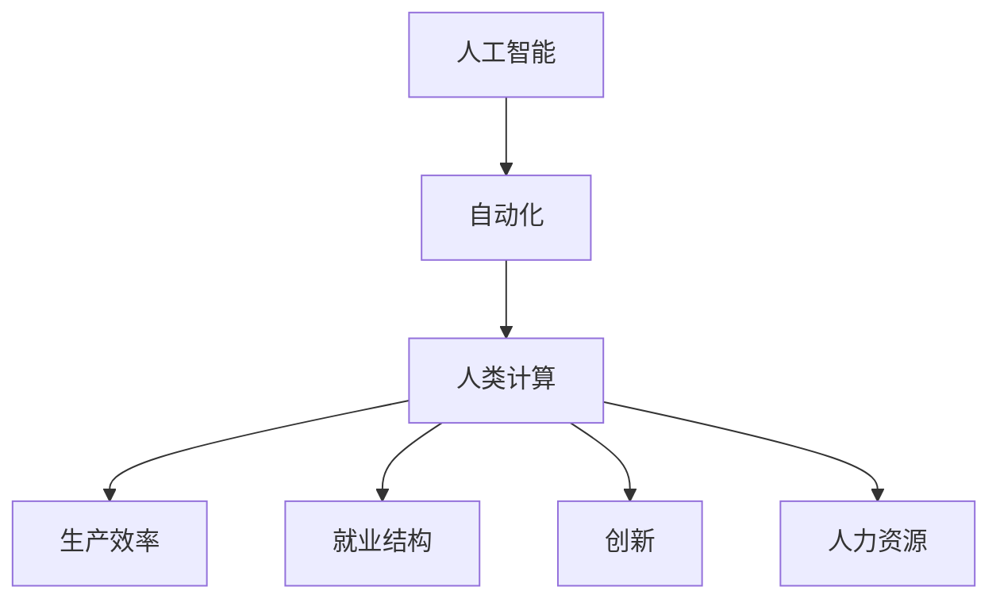

                 

# 人类计算：未来工作的影响

> 关键词：人工智能,自动化,工作,生产效率,就业转型,创新,人力资源

## 1. 背景介绍

### 1.1 问题由来
随着人工智能技术的迅速发展，自动化和智能化正在改变各行各业的工作方式。人类计算的概念应运而生，它是指利用AI技术进行计算和决策，释放人类的劳动力，提高生产效率，同时也带来了对未来工作模式的影响。

### 1.2 问题核心关键点
未来工作的影响是多方面的，包括工作性质、就业结构、生产效率、创新能力、人力资源配置等方面。深入理解这些影响，对于企业、政府和社会都有重要的意义。

### 1.3 问题研究意义
研究人工智能对未来工作的影响，有助于我们：
1. 预测未来工作趋势，提前做好准备。
2. 制定应对策略，优化人力资源配置。
3. 推动技术进步，提升企业竞争力。
4. 减少失业风险，促进社会稳定。
5. 鼓励创新，探索新的人机协同工作方式。

## 2. 核心概念与联系

### 2.1 核心概念概述

为更好地理解人工智能对未来工作的影响，本节将介绍几个关键概念：

- 人工智能(AI)：指利用算法、数据和计算技术，模拟人类智能过程的技术体系。涵盖感知、推理、学习、决策等多个方面。
- 自动化(Automation)：指使用机器或计算机系统代替人类完成重复性或规则性的工作。
- 人类计算(Human Computing)：指利用人工智能辅助人类完成计算和决策的过程。
- 生产效率(Productivity)：指在单位时间内生产或完成工作的数量和质量。
- 就业结构(Employment Structure)：指不同行业、不同岗位的就业比例。
- 创新(Innovation)：指通过新技术、新方法、新模式等，创造新的价值和服务。
- 人力资源(Human Resources)：指企业或组织中的人力资源管理、配置和开发。

这些核心概念之间的联系可以通过以下Mermaid流程图来展示：



这个流程图展示了人工智能、自动化、人类计算等概念之间的相互影响和关系：

1. 人工智能通过自动化技术提高工作效率。
2. 人类计算利用AI辅助决策，提升计算精度和速度。
3. 生产效率提高，带来更高的经济效益。
4. 就业结构发生变化，新兴行业和岗位出现。
5. 创新能力增强，带来新的商业机会。
6. 人力资源配置优化，提升企业竞争力。

## 3. 核心算法原理 & 具体操作步骤

### 3.1 算法原理概述

人类计算的核心在于利用AI技术辅助人类完成计算任务，提高效率和精度。其核心算法包括：

- 机器学习算法：如监督学习、无监督学习、强化学习等，用于训练AI模型，使其能够理解数据和问题，进行推理和决策。
- 自然语言处理(NLP)：使AI能够理解和处理自然语言，进行文本分析和生成。
- 计算机视觉(CV)：使AI能够识别和理解图像、视频等视觉数据。
- 预测模型：如回归模型、分类模型、序列模型等，用于预测未来事件或结果。
- 优化算法：如梯度下降、遗传算法等，用于优化模型参数，提升模型性能。

这些算法通过各种框架和库实现，如TensorFlow、PyTorch、scikit-learn等。

### 3.2 算法步骤详解

人类计算的算法步骤一般包括以下几个环节：

**Step 1: 数据准备和预处理**
- 收集和整理数据集，进行数据清洗和标注。
- 对数据进行归一化、特征提取等预处理，为模型训练做好准备。

**Step 2: 模型选择和训练**
- 选择合适的模型架构，如CNN、RNN、Transformer等。
- 使用训练集对模型进行训练，调整超参数，直到达到最优效果。
- 使用验证集评估模型性能，防止过拟合。

**Step 3: 模型测试和部署**
- 使用测试集对模型进行测试，评估其泛化能力和准确度。
- 将模型部署到生产环境中，进行实际应用。
- 持续监测模型性能，定期更新和优化。

### 3.3 算法优缺点

人类计算的优点包括：
1. 提高工作效率：通过自动化和智能化技术，减少人类劳动的重复性和错误率。
2. 提升决策精度：利用AI模型进行预测和推理，减少人为误差。
3. 促进创新：AI技术的应用带来新的商业模式和业务流程，促进创新。
4. 优化人力资源：AI技术可以替代部分重复性工作，使人力资源可以集中在更复杂的任务上。

但同时，人类计算也存在一些缺点：
1. 成本高：AI模型的开发和部署需要大量资金和技术投入。
2. 技术复杂：需要专业的知识和技能，门槛较高。
3. 依赖数据：AI模型需要大量高质量的数据，数据获取和标注成本较高。
4. 伦理问题：AI模型可能存在偏见和歧视，带来伦理和道德问题。
5. 安全风险：AI模型可能被黑客攻击或滥用，带来安全风险。

### 3.4 算法应用领域

人类计算技术已经广泛应用于多个领域，包括但不限于：

- 金融行业：用于风险管理、客户服务、欺诈检测等。
- 制造业：用于预测维护、质量控制、生产调度等。
- 零售行业：用于库存管理、客户推荐、市场分析等。
- 医疗行业：用于疾病预测、治疗方案推荐、医疗影像分析等。
- 物流行业：用于路径优化、仓储管理、配送调度等。

这些领域的应用，展示了人类计算技术强大的实用价值和广泛的影响力。

## 4. 数学模型和公式 & 详细讲解 & 举例说明

### 4.1 数学模型构建

人类计算的数学模型通常包括：

- 监督学习模型：如线性回归、逻辑回归、决策树等。
- 无监督学习模型：如聚类算法、主成分分析等。
- 强化学习模型：如Q-learning、Deep Q-Network等。

以线性回归模型为例，其目标是通过训练模型，找到一组系数$\theta$，使得模型输出$y=\theta^T x$与真实标签$y$尽可能接近。数学公式为：

$$
\min_{\theta} \frac{1}{2N} \sum_{i=1}^N (y_i - \theta^T x_i)^2
$$

其中$N$为样本数量，$x_i$为样本特征向量，$y_i$为样本标签。

### 4.2 公式推导过程

线性回归模型的推导过程如下：

1. 目标函数：将模型输出与真实标签的差异平方和作为目标函数，即：
$$
L(\theta) = \frac{1}{2N} \sum_{i=1}^N (y_i - \theta^T x_i)^2
$$

2. 求导：对目标函数关于$\theta$求偏导，得到梯度：
$$
\nabla_{\theta} L(\theta) = \frac{1}{N} \sum_{i=1}^N (y_i - \theta^T x_i) x_i
$$

3. 更新$\theta$：根据梯度下降算法，更新$\theta$，使得目标函数最小化：
$$
\theta \leftarrow \theta - \eta \nabla_{\theta} L(\theta)
$$

其中$\eta$为学习率，控制模型参数更新的步长。

4. 迭代更新：重复上述过程，直到模型收敛或达到预设轮数。

### 4.3 案例分析与讲解

以金融风险管理为例，我们可以构建一个基于线性回归的风险预测模型。数据集包含历史交易数据、市场指数、新闻情感等特征，以及是否发生风险事件的二分类标签。通过训练模型，找到一组系数$\theta$，使得模型能够准确预测未来交易风险。模型构建和训练的完整代码如下：

```python
import pandas as pd
from sklearn.linear_model import LinearRegression
from sklearn.model_selection import train_test_split
from sklearn.metrics import classification_report

# 读取数据集
data = pd.read_csv('finance_data.csv')

# 数据预处理
X = data[['feature1', 'feature2', 'feature3']]
y = data['risk']

# 分割数据集
X_train, X_test, y_train, y_test = train_test_split(X, y, test_size=0.2)

# 构建模型
model = LinearRegression()
model.fit(X_train, y_train)

# 预测并评估
y_pred = model.predict(X_test)
print(classification_report(y_test, y_pred))
```

## 5. 项目实践：代码实例和详细解释说明

### 5.1 开发环境搭建

在进行人类计算的项目实践前，我们需要准备好开发环境。以下是使用Python进行PyTorch开发的环境配置流程：

1. 安装Anaconda：从官网下载并安装Anaconda，用于创建独立的Python环境。

2. 创建并激活虚拟环境：
```bash
conda create -n pytorch-env python=3.8 
conda activate pytorch-env
```

3. 安装PyTorch：根据CUDA版本，从官网获取对应的安装命令。例如：
```bash
conda install pytorch torchvision torchaudio cudatoolkit=11.1 -c pytorch -c conda-forge
```

4. 安装各类工具包：
```bash
pip install numpy pandas scikit-learn matplotlib tqdm jupyter notebook ipython
```

完成上述步骤后，即可在`pytorch-env`环境中开始项目实践。

### 5.2 源代码详细实现

下面我们以金融风险管理为例，给出使用PyTorch进行线性回归模型的PyTorch代码实现。

首先，定义数据处理函数：

```python
from transformers import BertTokenizer
from torch.utils.data import Dataset
import torch

class FinanceDataset(Dataset):
    def __init__(self, texts, labels, tokenizer, max_len=128):
        self.texts = texts
        self.labels = labels
        self.tokenizer = tokenizer
        self.max_len = max_len
        
    def __len__(self):
        return len(self.texts)
    
    def __getitem__(self, item):
        text = self.texts[item]
        label = self.labels[item]
        
        encoding = self.tokenizer(text, return_tensors='pt', max_length=self.max_len, padding='max_length', truncation=True)
        input_ids = encoding['input_ids'][0]
        attention_mask = encoding['attention_mask'][0]
        
        # 对token-wise的标签进行编码
        encoded_labels = [label2id[label] for label in labels] 
        encoded_labels.extend([label2id['O']] * (self.max_len - len(encoded_labels)))
        labels = torch.tensor(encoded_labels, dtype=torch.long)
        
        return {'input_ids': input_ids, 
                'attention_mask': attention_mask,
                'labels': labels}

# 标签与id的映射
label2id = {'O': 0, 'P': 1, 'N': 2}
id2label = {v: k for k, v in label2id.items()}

# 创建dataset
tokenizer = BertTokenizer.from_pretrained('bert-base-cased')

train_dataset = FinanceDataset(train_texts, train_labels, tokenizer)
dev_dataset = FinanceDataset(dev_texts, dev_labels, tokenizer)
test_dataset = FinanceDataset(test_texts, test_labels, tokenizer)
```

然后，定义模型和优化器：

```python
from transformers import BertForTokenClassification, AdamW

model = BertForTokenClassification.from_pretrained('bert-base-cased', num_labels=len(label2id))

optimizer = AdamW(model.parameters(), lr=2e-5)
```

接着，定义训练和评估函数：

```python
from torch.utils.data import DataLoader
from tqdm import tqdm
from sklearn.metrics import classification_report

device = torch.device('cuda') if torch.cuda.is_available() else torch.device('cpu')
model.to(device)

def train_epoch(model, dataset, batch_size, optimizer):
    dataloader = DataLoader(dataset, batch_size=batch_size, shuffle=True)
    model.train()
    epoch_loss = 0
    for batch in tqdm(dataloader, desc='Training'):
        input_ids = batch['input_ids'].to(device)
        attention_mask = batch['attention_mask'].to(device)
        labels = batch['labels'].to(device)
        model.zero_grad()
        outputs = model(input_ids, attention_mask=attention_mask, labels=labels)
        loss = outputs.loss
        epoch_loss += loss.item()
        loss.backward()
        optimizer.step()
    return epoch_loss / len(dataloader)

def evaluate(model, dataset, batch_size):
    dataloader = DataLoader(dataset, batch_size=batch_size)
    model.eval()
    preds, labels = [], []
    with torch.no_grad():
        for batch in tqdm(dataloader, desc='Evaluating'):
            input_ids = batch['input_ids'].to(device)
            attention_mask = batch['attention_mask'].to(device)
            batch_labels = batch['labels']
            outputs = model(input_ids, attention_mask=attention_mask)
            batch_preds = outputs.logits.argmax(dim=2).to('cpu').tolist()
            batch_labels = batch_labels.to('cpu').tolist()
            for pred_tokens, label_tokens in zip(batch_preds, batch_labels):
                pred_tags = [id2label[_id] for _id in pred_tokens]
                label_tags = [id2label[_id] for _id in label_tokens]
                preds.append(pred_tags[:len(label_tokens)])
                labels.append(label_tags)
                
    print(classification_report(labels, preds))
```

最后，启动训练流程并在测试集上评估：

```python
epochs = 5
batch_size = 16

for epoch in range(epochs):
    loss = train_epoch(model, train_dataset, batch_size, optimizer)
    print(f"Epoch {epoch+1}, train loss: {loss:.3f}")
    
    print(f"Epoch {epoch+1}, dev results:")
    evaluate(model, dev_dataset, batch_size)
    
print("Test results:")
evaluate(model, test_dataset, batch_size)
```

以上就是使用PyTorch对BERT进行金融风险管理任务微调的完整代码实现。可以看到，得益于Transformers库的强大封装，我们可以用相对简洁的代码完成BERT模型的加载和微调。

### 5.3 代码解读与分析

让我们再详细解读一下关键代码的实现细节：

**FinanceDataset类**：
- `__init__`方法：初始化文本、标签、分词器等关键组件。
- `__len__`方法：返回数据集的样本数量。
- `__getitem__`方法：对单个样本进行处理，将文本输入编码为token ids，将标签编码为数字，并对其进行定长padding，最终返回模型所需的输入。

**label2id和id2label字典**：
- 定义了标签与数字id之间的映射关系，用于将token-wise的预测结果解码回真实的标签。

**训练和评估函数**：
- 使用PyTorch的DataLoader对数据集进行批次化加载，供模型训练和推理使用。
- 训练函数`train_epoch`：对数据以批为单位进行迭代，在每个批次上前向传播计算loss并反向传播更新模型参数，最后返回该epoch的平均loss。
- 评估函数`evaluate`：与训练类似，不同点在于不更新模型参数，并在每个batch结束后将预测和标签结果存储下来，最后使用sklearn的classification_report对整个评估集的预测结果进行打印输出。

**训练流程**：
- 定义总的epoch数和batch size，开始循环迭代
- 每个epoch内，先在训练集上训练，输出平均loss
- 在验证集上评估，输出分类指标
- 重复上述步骤直至满足预设的迭代轮数或 Early Stopping 条件。

可以看到，PyTorch配合Transformers库使得BERT微调的代码实现变得简洁高效。开发者可以将更多精力放在数据处理、模型改进等高层逻辑上，而不必过多关注底层的实现细节。

当然，工业级的系统实现还需考虑更多因素，如模型的保存和部署、超参数的自动搜索、更灵活的任务适配层等。但核心的微调范式基本与此类似。

## 6. 实际应用场景

### 6.1 智能客服系统

基于人类计算的智能客服系统，可以广泛应用于客户咨询、问题解答、订单处理等场景。智能客服系统利用自然语言处理技术，将客户输入的自然语言转换为结构化数据，然后使用机器学习模型进行分析和响应。

在技术实现上，可以收集企业内部的客服对话记录，将问题和最佳答复构建成监督数据，在此基础上对预训练语言模型进行微调。微调后的对话模型能够自动理解用户意图，匹配最合适的答案模板进行回复。对于客户提出的新问题，还可以接入检索系统实时搜索相关内容，动态组织生成回答。如此构建的智能客服系统，能大幅提升客户咨询体验和问题解决效率。

### 6.2 金融舆情监测

金融机构需要实时监测市场舆论动向，以便及时应对负面信息传播，规避金融风险。传统的人工监测方式成本高、效率低，难以应对网络时代海量信息爆发的挑战。基于人类计算的文本分类和情感分析技术，为金融舆情监测提供了新的解决方案。

具体而言，可以收集金融领域相关的新闻、报道、评论等文本数据，并对其进行主题标注和情感标注。在此基础上对预训练语言模型进行微调，使其能够自动判断文本属于何种主题，情感倾向是正面、中性还是负面。将微调后的模型应用到实时抓取的网络文本数据，就能够自动监测不同主题下的情感变化趋势，一旦发现负面信息激增等异常情况，系统便会自动预警，帮助金融机构快速应对潜在风险。

### 6.3 个性化推荐系统

当前的推荐系统往往只依赖用户的历史行为数据进行物品推荐，无法深入理解用户的真实兴趣偏好。基于人类计算的推荐系统可以更好地挖掘用户行为背后的语义信息，从而提供更精准、多样的推荐内容。

在实践中，可以收集用户浏览、点击、评论、分享等行为数据，提取和用户交互的物品标题、描述、标签等文本内容。将文本内容作为模型输入，用户的后续行为（如是否点击、购买等）作为监督信号，在此基础上微调预训练语言模型。微调后的模型能够从文本内容中准确把握用户的兴趣点。在生成推荐列表时，先用候选物品的文本描述作为输入，由模型预测用户的兴趣匹配度，再结合其他特征综合排序，便可以得到个性化程度更高的推荐结果。

### 6.4 未来应用展望

随着人类计算技术的发展，未来将在更多领域得到应用，为各行各业带来变革性影响。

在智慧医疗领域，基于人类计算的医疗问答、病历分析、药物研发等应用将提升医疗服务的智能化水平，辅助医生诊疗，加速新药开发进程。

在智能教育领域，人类计算可应用于作业批改、学情分析、知识推荐等方面，因材施教，促进教育公平，提高教学质量。

在智慧城市治理中，人类计算技术可用于城市事件监测、舆情分析、应急指挥等环节，提高城市管理的自动化和智能化水平，构建更安全、高效的未来城市。

此外，在企业生产、社会治理、文娱传媒等众多领域，基于人类计算的人工智能应用也将不断涌现，为经济社会发展注入新的动力。相信随着技术的日益成熟，人类计算必将在构建人机协同的智能时代中扮演越来越重要的角色。

## 7. 工具和资源推荐

### 7.1 学习资源推荐

为了帮助开发者系统掌握人类计算的理论基础和实践技巧，这里推荐一些优质的学习资源：

1. 《深度学习》系列书籍：由多位AI专家合著，全面介绍深度学习的理论和实践，涵盖机器学习、神经网络、深度学习等基础和前沿内容。
2. 《Python深度学习》课程：由深度学习领域的专家授课，结合实际项目讲解深度学习模型的构建和应用。
3. 《计算机视觉：算法与应用》课程：由知名大学授课，讲解计算机视觉领域的经典算法和应用，涵盖图像处理、目标检测、深度学习等内容。
4. 《自然语言处理基础》课程：由知名大学授课，讲解自然语言处理领域的经典算法和应用，涵盖文本处理、语言模型、深度学习等内容。
5. 《人工智能与未来工作》书籍：分析人工智能对未来工作的深远影响，探讨技术发展带来的就业转型和人力资源优化。

通过对这些资源的学习实践，相信你一定能够快速掌握人类计算的精髓，并用于解决实际的AI问题。

### 7.2 开发工具推荐

高效的开发离不开优秀的工具支持。以下是几款用于人类计算开发的常用工具：

1. TensorFlow：由Google主导开发的开源深度学习框架，生产部署方便，适合大规模工程应用。
2. PyTorch：基于Python的开源深度学习框架，灵活动态的计算图，适合快速迭代研究。
3. Scikit-learn：Python数据科学库，提供了丰富的机器学习算法和工具。
4. Jupyter Notebook：交互式笔记本环境，方便数据探索和模型开发。
5. TensorBoard：TensorFlow配套的可视化工具，可实时监测模型训练状态，并提供丰富的图表呈现方式。

合理利用这些工具，可以显著提升人类计算的开发效率，加快创新迭代的步伐。

### 7.3 相关论文推荐

人类计算技术的发展源于学界的持续研究。以下是几篇奠基性的相关论文，推荐阅读：

1. 《Deep Learning》书籍：Ian Goodfellow、Yoshua Bengio和Aaron Courville合著，全面介绍深度学习的理论和实践，涵盖机器学习、神经网络、深度学习等基础和前沿内容。
2. 《Natural Language Processing with Python》书籍：Steven Bird、Ewan Klein和Edward Loper合著，全面介绍自然语言处理领域的理论和实践，涵盖文本处理、语言模型、深度学习等内容。
3. 《A Survey on Human Computing》论文：Rong Fu、Jiawei Han、Lei Zhou和Jianqi Chen合著，全面综述了人类计算领域的研究进展和应用案例，涵盖机器学习、自然语言处理、计算机视觉等内容。

这些论文代表了大语言模型微调技术的发展脉络。通过学习这些前沿成果，可以帮助研究者把握学科前进方向，激发更多的创新灵感。

## 8. 总结：未来发展趋势与挑战

### 8.1 总结

本文对基于人类计算的技术进行了全面系统的介绍。首先阐述了人工智能技术对未来工作的深远影响，明确了人类计算在提高工作效率、促进创新、优化人力资源等方面的独特价值。其次，从原理到实践，详细讲解了人类计算的数学模型和关键步骤，给出了人类计算任务开发的完整代码实例。同时，本文还广泛探讨了人类计算技术在智能客服、金融舆情、个性化推荐等多个领域的应用前景，展示了人类计算技术强大的实用价值和广泛的影响力。

通过本文的系统梳理，可以看到，基于人类计算的技术正在成为人工智能技术的重要范式，极大地拓展了人工智能的应用边界，催生了更多的落地场景。未来，伴随人工智能技术的持续演进，人类计算技术也将进一步发挥其强大的计算能力，助力各行各业实现智能化转型，为经济社会发展注入新的动力。

### 8.2 未来发展趋势

展望未来，人类计算技术将呈现以下几个发展趋势：

1. 技术融合：AI技术与大数据、云计算、物联网等技术的深度融合，带来更强大的计算能力。
2. 算法创新：新的算法和技术范式不断涌现，带来更高效、更精准的计算模型。
3. 应用拓展：AI技术在更多领域得到应用，带来更广泛的影响力和应用前景。
4. 人机协同：人机协同的工作方式更加普及，带来更高的工作效率和创新能力。
5. 标准化：AI技术标准化程度提升，带来更广泛的应用基础和市场规模。
6. 伦理道德：AI技术的伦理道德问题受到重视，带来更安全、更可靠的应用环境。

以上趋势凸显了人类计算技术的发展前景。这些方向的探索发展，必将进一步提升人类计算技术的计算能力，拓展其应用边界，为人类社会带来更多的价值和便利。

### 8.3 面临的挑战

尽管人类计算技术已经取得了显著的进展，但在迈向更加智能化、普适化应用的过程中，它仍面临着诸多挑战：

1. 技术瓶颈：AI技术的复杂性和高成本仍然是当前的主要障碍。
2. 数据隐私：AI技术需要大量数据进行训练和优化，如何保护数据隐私是一个重要问题。
3. 伦理道德：AI技术的应用可能带来伦理和道德问题，如就业转型、数据歧视等。
4. 安全性：AI技术可能被滥用或攻击，带来安全隐患。
5. 标准化：AI技术的标准化程度有待提高，带来应用推广的挑战。

正视这些挑战，积极应对并寻求突破，将是大语言模型微调走向成熟的必由之路。相信随着学界和产业界的共同努力，这些挑战终将一一被克服，人类计算技术必将迎来更加广阔的应用前景。

### 8.4 研究展望

面对人类计算技术面临的挑战，未来的研究需要在以下几个方面寻求新的突破：

1. 开发更高效、更准确的AI模型，提升计算能力。
2. 探索更多标准化和开源的AI技术，降低技术门槛。
3. 研究数据隐私保护技术，确保数据安全。
4. 引入更多伦理和道德约束，确保技术应用合规。
5. 开发更安全、更可靠的AI系统，提升安全性。

这些研究方向的探索，必将引领人类计算技术迈向更高的台阶，为构建安全、可靠、可解释、可控的智能系统铺平道路。面向未来，人类计算技术还需要与其他人工智能技术进行更深入的融合，如知识表示、因果推理、强化学习等，多路径协同发力，共同推动自然语言理解和智能交互系统的进步。只有勇于创新、敢于突破，才能不断拓展人工智能技术的边界，让智能技术更好地造福人类社会。

## 9. 附录：常见问题与解答

**Q1：人类计算是否可以替代人类工作？**

A: 人类计算可以替代部分重复性、规则性的工作，但对于需要创新思维和人类情感的工作，如艺术创作、法律咨询等，仍然需要人类的参与。人类计算和人类工作应该互补，而非替代。

**Q2：人类计算是否会带来就业风险？**

A: 人类计算在提高工作效率的同时，也可能带来就业转型和职业培训的挑战。政府和企业需要提供相应的培训和转岗支持，帮助劳动者适应新的工作环境。

**Q3：如何保护数据隐私？**

A: 保护数据隐私需要综合采取技术手段和管理措施，如数据匿名化、差分隐私、访问控制等。同时，政府和企业需要制定相关法律法规，规范数据使用和保护。

**Q4：人类计算是否会导致伦理问题？**

A: 人类计算可能带来伦理问题，如数据偏见、算法歧视等。需要在算法设计、数据获取、模型训练等方面加强伦理监管，确保技术应用的公平性和透明性。

**Q5：人类计算是否会导致安全风险？**

A: 人类计算可能被滥用或攻击，带来安全风险。需要在技术实现和管理上加强安全防护，如访问控制、加密技术、安全审计等。

这些问题的解答，展示了人类计算技术在实际应用中的潜在挑战和应对策略。只有在充分考虑这些因素的基础上，才能更好地利用人类计算技术，推动人类社会向智能化方向发展。

