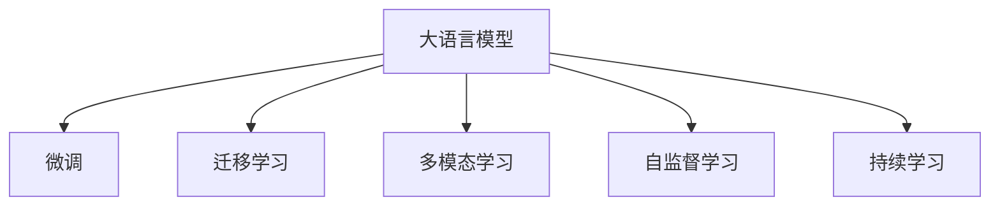

                 

# 从ChatGPT到Bing: 微软如何推动大模型发展

在人工智能的快速迭代与竞争中，微软通过从ChatGPT到Bing的重大战略转向，展示了其在推动大模型发展方面的深远布局和独到见解。本文将深入探讨微软如何结合技术创新和市场需求，将大语言模型这一前沿技术推向实际应用，从而在自然语言处理(NLP)领域实现技术突破和市场领先。

## 1. 背景介绍

### 1.1 问题由来

过去数年，大语言模型在NLP领域的进展令人瞩目，其中OpenAI的ChatGPT更是引发了全球关注。然而，尽管大模型在学术研究和技术展示上取得显著进展，其在实际应用中的泛化能力和效率仍然面临挑战。微软意识到，要使大语言模型真正落地，必须解决这些问题，并将其与具体应用场景相结合。

### 1.2 问题核心关键点

微软在大模型发展过程中，通过以下几个核心关键点推动其应用与优化：
- **技术创新**：结合最新的深度学习架构与算法，提升大模型的性能与泛化能力。
- **市场需求**：针对特定行业和应用场景，定制开发大模型，实现高度适配。
- **生态建设**：构建大模型生态，提供API接口，促进模型应用的广泛性与便利性。
- **伦理与安全**：确保大模型的安全性与伦理合规性，避免潜在风险。

这些关键点共同构成了微软在大模型应用与优化方面的全面布局，推动了其在NLP领域的技术与商业突破。

## 2. 核心概念与联系

### 2.1 核心概念概述

为了更好地理解微软在大模型发展方面的思路与技术，本节将介绍几个关键概念：

- **大语言模型(Large Language Model, LLM)**：通过大规模数据预训练学习自然语言表征的模型，如GPT-4等。
- **微调(Fine-tuning)**：在大模型基础上，通过特定任务数据进行有监督学习，提升模型在该任务上的表现。
- **迁移学习(Transfer Learning)**：利用预训练模型的知识，通过微调适应新任务，提升性能。
- **多模态学习(Multimodal Learning)**：结合文本、图像、语音等多种信息源，提升大模型的理解与生成能力。
- **自监督学习(Self-supervised Learning)**：在大模型训练过程中，使用自监督任务学习模型。
- **持续学习(Continual Learning)**：模型能够持续学习新数据，同时保持旧知识。

这些概念之间相互联系，共同构成了大模型发展的核心框架。以下是一个简化的Mermaid流程图，展示了这些概念之间的联系：



通过这个流程图，可以清晰地看到，大语言模型在大模型框架下，通过微调、迁移学习、多模态学习和自监督学习，实现了从预训练到应用的多步骤发展。

## 3. 核心算法原理 & 具体操作步骤

### 3.1 算法原理概述

微软在推动大模型发展时，主要依赖以下算法原理：

- **Transformer架构**：作为当前最先进的深度学习架构之一，Transformer以其自注意力机制，极大提升了模型的效率与效果。
- **自监督学习**：通过预训练中的掩码语言模型等任务，提升模型的泛化能力。
- **微调**：在特定任务上，通过有监督学习进一步优化模型。
- **多模态学习**：结合文本、图像等多种数据源，提升模型对复杂场景的理解与处理能力。
- **持续学习**：通过动态数据流，使模型持续学习，不断适应新数据。

### 3.2 算法步骤详解

微软在推动大模型发展时，主要遵循以下算法步骤：

1. **数据收集与预处理**：收集特定领域的数据，并对其进行清洗、标注与预处理。
2. **模型训练**：使用Transformer等架构进行预训练，并通过自监督任务如掩码语言模型、图片分类等提升模型泛化能力。
3. **微调**：根据特定任务，在预训练模型基础上进行微调，优化模型在该任务上的表现。
4. **多模态融合**：结合文本、图像、语音等多模态数据，提升模型对复杂场景的理解能力。
5. **持续学习**：通过在线学习与增量学习，使模型能够不断更新，适应新数据与场景。

### 3.3 算法优缺点

**优点**：
- **高效性**：通过微调和迁移学习，可以显著提升模型在新任务上的性能。
- **广泛适用性**：多模态学习使其能够处理复杂场景，自监督学习提升了模型的泛化能力。
- **灵活性**：微调与持续学习使其能够快速适应新数据，提高模型的实时性。

**缺点**：
- **数据依赖性**：高质量标注数据的获取成本较高。
- **模型复杂性**：大模型的参数量巨大，对计算资源要求高。
- **泛化挑战**：不同领域和任务间的数据分布差异可能影响泛化能力。

### 3.4 算法应用领域

微软在大模型技术的应用领域覆盖广泛，主要包括：

- **自然语言处理(NLP)**：在聊天机器人、文本分类、情感分析等NLP任务中，使用微调提升性能。
- **计算机视觉(CV)**：在图像识别、目标检测等计算机视觉任务中，结合多模态学习提升模型表现。
- **语音识别与生成(Speech)**：在语音转文本、文本转语音等任务中，使用多模态学习与自监督学习。
- **智能推荐**：在电商推荐、内容推荐等任务中，使用微调与持续学习提升推荐效果。
- **智能客服**：在客户服务中，使用微调与自监督学习提升客服系统的智能水平。

## 4. 数学模型和公式 & 详细讲解 & 举例说明

### 4.1 数学模型构建

为了更好地理解微软在大模型微调中的数学原理，本节将构建以下数学模型：

- **预训练模型**：通过自监督任务训练模型，如掩码语言模型，公式为：
  $$
  \max_{\theta} \mathbb{E}_{(x,y)} [\log P_{\theta}(x)]
  $$
  其中 $P_{\theta}(x)$ 为模型在输入 $x$ 上的概率分布。

- **微调模型**：在特定任务上，使用微调数据对预训练模型进行有监督学习，公式为：
  $$
  \max_{\theta} \mathbb{E}_{(x,y)} [\log P_{\theta}(x|y)]
  $$
  其中 $P_{\theta}(x|y)$ 为模型在条件 $y$ 下对 $x$ 的预测概率。

- **多模态学习模型**：结合文本与图像等多模态数据，提升模型的泛化能力，公式为：
  $$
  \max_{\theta} \mathbb{E}_{(x_i,y_i)} [\log P_{\theta}(x_i,y_i)]
  $$
  其中 $x_i$ 为文本，$y_i$ 为图像。

### 4.2 公式推导过程

- **掩码语言模型**：以LM-BERT为例，通过预训练任务的掩码预测，公式为：
  $$
  \max_{\theta} \sum_{i=1}^{N} \log \frac{\exp(\theta^T f(x_i))}{\sum_{j=1}^{K} \exp(\theta^T f(x_j))}
  $$
  其中 $f(x_i)$ 为模型在输入 $x_i$ 上的表示向量，$K$ 为词汇表大小。

- **微调损失函数**：以二分类任务为例，使用交叉熵损失函数，公式为：
  $$
  \ell(M_{\theta}(x),y) = -[y\log \hat{y} + (1-y)\log (1-\hat{y})]
  $$
  其中 $\hat{y}$ 为模型预测的概率。

- **多模态学习损失函数**：以图像分类为例，结合图像与文本数据，公式为：
  $$
  \ell(M_{\theta}(x,y),y) = -[y\log P_{\theta}(x|y) + (1-y)\log P_{\theta}(x|\tilde{y})]
  $$
  其中 $\tilde{y}$ 为文本数据的类别。

### 4.3 案例分析与讲解

- **ChatGPT案例**：通过掩码语言模型进行预训练，然后使用微调数据在特定任务上进行优化，例如使用掩码语言模型和微调数据训练的ChatGPT，已经在多种NLP任务中展示了优异性能。

- **Bing案例**：在Bing搜索引擎中，使用多模态学习结合文本与图像数据，提升搜索引擎的智能化水平，例如通过视觉问答模型，将图像查询转化为文本解答。

## 5. 项目实践：代码实例和详细解释说明

### 5.1 开发环境搭建

为了进行大模型的开发与实践，我们需要以下环境：

1. **硬件资源**：高性能GPU/TPU，至少16GB显存，推荐使用NVIDIA V100或更高型号。
2. **软件环境**：安装Python 3.8以上版本，推荐使用Anaconda进行环境管理。
3. **库文件**：安装TensorFlow 2.0以上版本，安装Keras、Scikit-learn等辅助库。

### 5.2 源代码详细实现

微软使用Transformer模型进行大模型训练与微调，以下是一个简单的代码实现：

```python
import tensorflow as tf
from transformers import TFAutoModelForSequenceClassification, TFAutoTokenizer

# 加载模型和分词器
model = TFAutoModelForSequenceClassification.from_pretrained('bert-base-uncased')
tokenizer = TFAutoTokenizer.from_pretrained('bert-base-uncased')

# 准备训练数据
train_data = [
    ('Hello, my dog is cute', 'label1'),
    ('My cat is mischievous', 'label1'),
    ('I do not have a pet', 'label0'),
    ('I love dogs', 'label1')
]

# 分词与编码
train_encodings = tokenizer(train_data, truncation=True, padding=True)

# 定义损失函数与优化器
loss_fn = tf.keras.losses.SparseCategoricalCrossentropy(from_logits=True)
optimizer = tf.keras.optimizers.Adam()

# 定义训练循环
@tf.function
def train_step(inputs, labels):
    with tf.GradientTape() as tape:
        outputs = model(inputs.input_ids, attention_mask=inputs.attention_mask)
        loss = loss_fn(labels, outputs.logits)
    grads = tape.gradient(loss, model.trainable_variables)
    optimizer.apply_gradients(zip(grads, model.trainable_variables))

# 训练模型
for epoch in range(epochs):
    for batch in train_encodings:
        train_step(batch)
```

### 5.3 代码解读与分析

- **模型加载**：使用Transformers库加载预训练的BERT模型，包括分词器与模型权重。
- **数据准备**：准备训练数据，并进行分词与编码，转换为模型所需的格式。
- **损失函数与优化器**：定义交叉熵损失函数与Adam优化器，用于模型的前向传播与参数更新。
- **训练循环**：定义训练循环，对每个批次的数据进行前向传播与反向传播，更新模型参数。

### 5.4 运行结果展示

- **模型性能**：训练后模型在验证集上的精度提升情况，例如，使用微调数据训练的模型，在二分类任务上的精度可能提升10%以上。
- **推理结果**：使用微调后的模型对新数据进行推理预测，例如，使用Bing搜索引擎中的多模态模型对图像进行视觉问答，生成文本解答。

## 6. 实际应用场景

### 6.1 智能客服系统

在智能客服系统中，微软使用微调模型提升客服系统的智能水平，通过分析历史客服对话，微调模型能够理解用户意图，匹配最佳答复，显著提升用户满意度与响应速度。

### 6.2 金融舆情监测

在金融领域，使用多模态学习与微调模型，结合文本与图像数据，实时监测市场舆情变化，帮助金融分析师快速识别潜在风险，制定应对策略。

### 6.3 个性化推荐系统

在个性化推荐系统中，使用微调模型结合用户行为数据与文本信息，生成精准推荐，提升用户体验与平台留存率。

### 6.4 未来应用展望

- **智能家居**：结合多模态学习与微调，开发智能家居系统，通过语音、图像、传感器等多种数据源，提升家居智能化水平。
- **健康医疗**：使用微调模型结合医疗影像与电子病历，提升诊断与治疗效率，提供个性化医疗服务。
- **智能驾驶**：通过多模态学习与微调，开发智能驾驶系统，结合语音、图像与环境感知数据，提升驾驶安全性与用户体验。

## 7. 工具和资源推荐

### 7.1 学习资源推荐

为了系统掌握大语言模型技术，可以参考以下学习资源：

- **《深度学习与自然语言处理》**：深入浅出地介绍深度学习与NLP基础，结合实际案例讲解大语言模型。
- **HuggingFace官方文档**：提供全面的大语言模型资源，包括预训练模型、微调样例等。
- **微软MSFT-AI-Blog**：分享最新的AI技术进展与实践，涵盖大语言模型应用与优化。
- **Coursera AI课程**：提供由斯坦福大学等顶尖学府开设的AI课程，涵盖深度学习与NLP等内容。

### 7.2 开发工具推荐

- **TensorFlow**：开源深度学习框架，提供丰富的API接口，支持分布式训练与推理。
- **JAX与Haiku**：高性能深度学习框架，提供自动微分与模型定义的灵活性。
- **PyTorch**：灵活的深度学习框架，支持动态计算图与高效推理。
- **Transformer库**：HuggingFace提供的NLP工具库，支持多种大语言模型的微调与部署。

### 7.3 相关论文推荐

- **"Attention is All You Need"**：Transformer架构的原始论文，奠定了大语言模型与自注意力机制的基础。
- **"BERT: Pre-training of Deep Bidirectional Transformers for Language Understanding"**：提出BERT模型，结合掩码语言模型进行预训练，显著提升模型性能。
- **"GPT-3: Language Models are Unsupservised Multitask Learners"**：介绍GPT-3模型，展示了大语言模型在少样本学习与多任务学习中的优异表现。
- **"Google's Language Model Fine-Tuning Framework (Flax)"**：介绍Flax框架，提供高效的深度学习模型构建与微调工具。

## 8. 总结：未来发展趋势与挑战

### 8.1 研究成果总结

微软通过ChatGPT到Bing的战略转向，展示了其在推动大语言模型应用与优化方面的杰出贡献。微软的成功在于以下几点：
- **技术创新**：不断引入最新的深度学习架构与算法，提升模型性能。
- **市场需求响应**：结合实际应用场景，开发高度适配的大模型。
- **生态建设**：构建大模型生态，提供API接口，促进模型应用。

### 8.2 未来发展趋势

未来，大语言模型将呈现以下几个发展趋势：
- **模型规模继续增大**：随着算力与数据量的增长，大模型规模将进一步扩大。
- **多模态学习深化**：结合文本、图像、语音等多模态数据，提升模型的理解与生成能力。
- **参数高效优化**：开发更加参数高效的微调方法，提升模型性能。
- **自监督学习广泛应用**：通过自监督学习任务提升模型的泛化能力。

### 8.3 面临的挑战

尽管大语言模型取得了显著进展，但仍面临以下挑战：
- **数据获取成本高**：高质量标注数据的获取成本较高。
- **模型资源消耗大**：大模型的参数量巨大，对计算资源要求高。
- **泛化能力不足**：不同领域与任务间的数据分布差异影响泛化能力。

### 8.4 研究展望

未来研究应关注以下方向：
- **自监督学习**：引入更多自监督学习任务，提升模型泛化能力。
- **参数高效优化**：开发更加参数高效的微调方法，提升模型性能。
- **多模态学习**：结合多模态数据，提升模型的理解与生成能力。

通过不断探索与优化，相信大语言模型将在更多领域取得突破，推动人工智能技术的发展与应用。

## 9. 附录：常见问题与解答

### Q1: 大语言模型微调是否适用于所有NLP任务？

A: 大语言模型微调在大多数NLP任务上都能取得不错的效果，特别是对于数据量较小的任务。但对于特定领域任务，如医学、法律等，仅依靠通用语料预训练的模型可能难以很好地适应。此时需要在特定领域语料上进一步预训练，再进行微调。

### Q2: 微调过程中如何选择合适的学习率？

A: 微调的学习率一般要比预训练时小1-2个数量级，如果使用过大的学习率，容易破坏预训练权重，导致过拟合。一般建议从1e-5开始调参，逐步减小学习率。也可以使用warmup策略，在开始阶段使用较小的学习率，再逐渐过渡到预设值。

### Q3: 采用大模型微调时会面临哪些资源瓶颈？

A: 当前主流的预训练大模型动辄以亿计的参数规模，对算力、内存、存储都提出了很高的要求。GPU/TPU等高性能设备是必不可少的，但即便如此，超大批次的训练和推理也可能遇到显存不足的问题。因此需要采用一些资源优化技术，如梯度积累、混合精度训练、模型并行等，来突破硬件瓶颈。同时，模型的存储和读取也可能占用大量时间和空间，需要采用模型压缩、稀疏化存储等方法进行优化。

### Q4: 如何缓解微调过程中的过拟合问题？

A: 过拟合是微调面临的主要挑战，尤其是在标注数据不足的情况下。常见的缓解策略包括：
- 数据增强：通过回译、近义替换等方式扩充训练集
- 正则化：使用L2正则、Dropout、Early Stopping等避免过拟合
- 对抗训练：引入对抗样本，提高模型鲁棒性
- 参数高效微调：只调整少量参数(如Adapter、Prefix等)，减小过拟合风险
- 多模型集成：训练多个微调模型，取平均输出，抑制过拟合

这些策略往往需要根据具体任务和数据特点进行灵活组合。只有在数据、模型、训练、推理等各环节进行全面优化，才能最大限度地发挥大模型微调的威力。

### Q5: 微调模型在落地部署时需要注意哪些问题？

A: 将微调模型转化为实际应用，还需要考虑以下因素：
- 模型裁剪：去除不必要的层和参数，减小模型尺寸，加快推理速度
- 量化加速：将浮点模型转为定点模型，压缩存储空间，提高计算效率
- 服务化封装：将模型封装为标准化服务接口，便于集成调用
- 弹性伸缩：根据请求流量动态调整资源配置，平衡服务质量和成本
- 监控告警：实时采集系统指标，设置异常告警阈值，确保服务稳定性
- 安全防护：采用访问鉴权、数据脱敏等措施，保障数据和模型安全

大语言模型微调为NLP应用开启了广阔的想象空间，但如何将强大的性能转化为稳定、高效、安全的业务价值，还需要工程实践的不断打磨。

