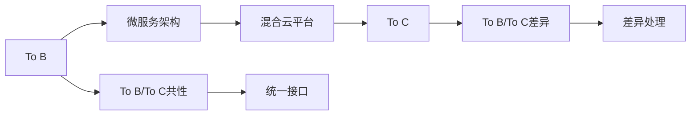

                 

## 1. 背景介绍

### 1.1 问题由来
在AI领域，传统企业级产品（To B）与消费级产品（To C）的商业模式有本质的区别。企业级市场注重功能完备、性能稳定、可扩展性，而消费级市场则强调易用性、低门槛、高体验。Lepton AI在从初创到发展，从To B到To C的演变过程中，深刻感受到了这两种模式的差异和融合的挑战。

### 1.2 问题核心关键点
Lepton AI的商业模式演进，主要体现在以下几个方面：
- **To B的成熟**：在企业级市场上，Lepton AI积累了丰富的经验，形成了稳定的产品线和客户群体。
- **To C的探索**：在消费级市场上，Lepton AI尝试采用不同的营销策略和产品设计，探索适合大众的AI应用。
- **跨界融合**：如何平衡企业级和消费级的特点，提供更普适的AI解决方案。

## 2. 核心概念与联系

### 2.1 核心概念概述
- **To B**：面向企业级用户，提供定制化、高性能的AI解决方案，强调系统稳定性、可扩展性和定制服务。
- **To C**：面向个人用户，提供易于使用的AI应用，注重用户体验、界面友好和个性化功能。
- **混合云平台**：将企业级的大规模计算和数据处理能力，与消费级的易用性和便捷性结合，形成混合云AI解决方案。
- **微服务架构**：模块化、独立部署、按需扩展的服务架构，适用于大规模的To B和To C应用。

### 2.2 核心概念原理和架构的 Mermaid 流程图



## 3. 核心算法原理 & 具体操作步骤

### 3.1 算法原理概述

Lepton AI的核心算法原理主要基于以下几个方面：

1. **深度学习模型**：采用深度神经网络模型，如卷积神经网络（CNN）、循环神经网络（RNN）、Transformer等，处理图像、文本、语音等多种数据类型。
2. **迁移学习**：通过预训练模型在大规模数据上进行微调，适应特定任务，提升模型性能。
3. **强化学习**：通过智能体与环境的交互，优化模型参数，提升模型在实际应用中的表现。
4. **联邦学习**：多个设备或客户端参与联合学习，避免数据泄露和隐私问题，同时提高模型的泛化能力。

### 3.2 算法步骤详解

**Step 1: 数据预处理**
- 收集数据：从多个数据源收集数据，清洗、去重、标注。
- 划分数据集：分为训练集、验证集和测试集。

**Step 2: 模型选择与设计**
- 模型选择：选择适合的深度学习模型，如CNN、RNN、Transformer等。
- 模型设计：设计合适的网络结构、激活函数、优化器等。

**Step 3: 模型训练**
- 数据加载：使用TensorFlow或PyTorch等框架加载数据。
- 模型训练：在训练集上进行模型训练，采用梯度下降等优化算法。
- 验证与调参：在验证集上评估模型性能，调整超参数。

**Step 4: 模型评估**
- 评估指标：计算准确率、召回率、F1值等评估指标。
- 测试集验证：在测试集上验证模型性能。

**Step 5: 模型部署与优化**
- 模型部署：将模型部署到服务器、移动设备等平台。
- 性能优化：进行模型压缩、剪枝、量化等优化。

### 3.3 算法优缺点

**优点**：
- 深度学习模型性能强大，可以处理复杂的图像、文本、语音数据。
- 迁移学习可以显著减少训练时间和数据需求。
- 强化学习可以在实际应用中不断优化模型参数。
- 联邦学习保护隐私，提高模型的泛化能力。

**缺点**：
- 深度学习模型复杂，需要大量计算资源和数据。
- 迁移学习和强化学习需要较长的训练时间。
- 联邦学习在实际应用中存在通信延迟等问题。

### 3.4 算法应用领域

Lepton AI的算法在多个领域得到了应用，包括：
- **医疗健康**：通过图像识别、自然语言处理等技术，辅助医生诊断和治疗。
- **金融服务**：利用自然语言处理和强化学习，进行风险评估和客户管理。
- **智能制造**：使用计算机视觉和深度学习，提高生产效率和质量。
- **智能家居**：通过语音识别和图像处理，提升家庭自动化水平。

## 4. 数学模型和公式 & 详细讲解 & 举例说明

### 4.1 数学模型构建

Lepton AI的数学模型构建主要基于以下几个方面：

1. **图像分类**：使用卷积神经网络（CNN）进行图像分类。
2. **目标检测**：使用区域卷积神经网络（R-CNN）进行目标检测。
3. **语音识别**：使用卷积神经网络（CNN）和循环神经网络（RNN）进行语音识别。
4. **自然语言处理**：使用Transformer等模型进行文本分类、情感分析、机器翻译等。

### 4.2 公式推导过程

以图像分类为例，使用卷积神经网络（CNN）的公式推导如下：

$$
f(x) = W_1 h_1 + b_1
$$

其中 $f(x)$ 为输出，$h_1$ 为卷积层输出，$W_1$ 为权重，$b_1$ 为偏置。

### 4.3 案例分析与讲解

以目标检测为例，使用区域卷积神经网络（R-CNN）的公式推导如下：

$$
y = g(z)
$$

其中 $y$ 为预测结果，$z$ 为网络输入，$g$ 为非线性激活函数，如sigmoid函数。

## 5. 项目实践：代码实例和详细解释说明

### 5.1 开发环境搭建

开发环境搭建步骤如下：

1. 安装Python和pip。
2. 安装TensorFlow或PyTorch等深度学习框架。
3. 安装数据处理库，如numpy、pandas等。
4. 安装机器学习库，如scikit-learn、keras等。

### 5.2 源代码详细实现

以下是一个简单的图像分类代码实现：

```python
import tensorflow as tf
from tensorflow.keras import layers

# 定义模型
model = tf.keras.Sequential([
    layers.Conv2D(32, (3, 3), activation='relu', input_shape=(224, 224, 3)),
    layers.MaxPooling2D((2, 2)),
    layers.Conv2D(64, (3, 3), activation='relu'),
    layers.MaxPooling2D((2, 2)),
    layers.Conv2D(128, (3, 3), activation='relu'),
    layers.MaxPooling2D((2, 2)),
    layers.Flatten(),
    layers.Dense(128, activation='relu'),
    layers.Dense(10, activation='softmax')
])

# 编译模型
model.compile(optimizer='adam', loss='categorical_crossentropy', metrics=['accuracy'])

# 训练模型
model.fit(train_images, train_labels, epochs=10, validation_data=(test_images, test_labels))
```

### 5.3 代码解读与分析

以上代码实现了简单的卷积神经网络（CNN）模型，包含卷积层、池化层、全连接层等。编译模型时使用Adam优化器和交叉熵损失函数，训练过程中使用验证集进行监控。

### 5.4 运行结果展示

训练完成后，可以使用测试集评估模型性能，如计算准确率、召回率等指标。

## 6. 实际应用场景

### 6.1 医疗健康

Lepton AI在医疗健康领域的应用主要包括：
- 通过图像识别技术，自动诊断X光片中的骨骼、肺结节等。
- 使用自然语言处理技术，辅助医生撰写病历、分析病情。

### 6.2 金融服务

Lepton AI在金融服务领域的应用主要包括：
- 利用自然语言处理技术，自动分析客户投诉和反馈，提升客户满意度。
- 通过机器学习，进行风险评估和信用评分。

### 6.3 智能制造

Lepton AI在智能制造领域的应用主要包括：
- 使用计算机视觉技术，检测产品质量缺陷。
- 利用深度学习技术，优化生产流程，提高生产效率。

### 6.4 未来应用展望

未来，Lepton AI将在以下几个领域继续探索应用：
- **智慧城市**：利用AI技术，优化交通、环保、安防等领域，提升城市管理水平。
- **教育培训**：通过智能化的教学系统，提供个性化学习方案，提升教育质量。
- **娱乐传媒**：利用AI生成内容、推荐系统，提升用户体验和内容质量。

## 7. 工具和资源推荐

### 7.1 学习资源推荐

1. **深度学习课程**：Coursera、edX等在线平台提供了丰富的深度学习课程，涵盖图像、文本、语音等多种数据类型的处理。
2. **Kaggle竞赛**：Kaggle平台上有大量的数据集和竞赛，可以帮助开发者积累实战经验。
3. **GitHub开源项目**：GitHub上有许多优秀的AI开源项目，可以参考和学习。

### 7.2 开发工具推荐

1. **TensorFlow**：Google开发的深度学习框架，功能强大，社区活跃。
2. **PyTorch**：Facebook开发的深度学习框架，易于使用，适合研究。
3. **Keras**：高层API，支持TensorFlow和Theano，适合快速原型开发。
4. **Jupyter Notebook**：开源的交互式笔记本，支持多种编程语言和数据可视化工具。

### 7.3 相关论文推荐

1. **ImageNet大规模视觉识别挑战**：ILSVRC 2012年提出的挑战，推动了图像识别技术的发展。
2. **语音识别系统的改进**：基于深度学习的语音识别系统，如Google的WaveNet、DeepSpeech等。
3. **自然语言处理综述**：斯坦福大学的NLP综述论文，涵盖了多种自然语言处理技术。

## 8. 总结：未来发展趋势与挑战

### 8.1 研究成果总结

Lepton AI在深度学习、迁移学习、强化学习等技术方面取得了诸多成果，推动了AI技术在多个领域的应用。

### 8.2 未来发展趋势

未来，Lepton AI将持续推动AI技术在企业级和消费级的融合应用，主要趋势包括：
- **云计算与边缘计算结合**：将AI能力部署到边缘设备，提升响应速度和用户体验。
- **多模态数据融合**：将图像、文本、语音等多模态数据融合，提升AI系统的表现。
- **跨领域知识迁移**：通过跨领域知识迁移，提升AI系统的泛化能力和应用范围。

### 8.3 面临的挑战

Lepton AI在发展过程中，也面临诸多挑战：
- **计算资源限制**：深度学习模型需要大量的计算资源，如何高效利用资源是一个挑战。
- **数据隐私和安全**：AI系统在处理敏感数据时，如何保护隐私和安全是一个重要问题。
- **模型可解释性**：AI模型的决策过程难以解释，如何提高可解释性是一个研究方向。

### 8.4 研究展望

未来，Lepton AI将在以下几个方向进行研究：
- **联邦学习**：通过联邦学习，保护数据隐私，提高模型泛化能力。
- **知识图谱**：利用知识图谱，提升AI系统的理解和推理能力。
- **多模态数据融合**：将图像、文本、语音等多种数据融合，提升AI系统的表现。

## 9. 附录：常见问题与解答

**Q1: Lepton AI在企业级和消费级市场的定位是什么？**

A: 在企业级市场上，Lepton AI提供定制化、高性能的AI解决方案，注重系统稳定性、可扩展性和定制服务。在消费级市场上，Lepton AI提供易于使用的AI应用，注重用户体验、界面友好和个性化功能。

**Q2: Lepton AI的微服务架构是如何设计和实现的？**

A: Lepton AI的微服务架构采用模块化、独立部署、按需扩展的设计理念，使用Docker和Kubernetes等技术进行实现。每个微服务负责独立的业务逻辑，可以根据需求动态扩展。

**Q3: Lepton AI的混合云平台是如何实现的？**

A: Lepton AI的混合云平台结合了企业级的大规模计算和数据处理能力，与消费级的易用性和便捷性，使用AWS、Google Cloud等云服务进行实现。

**Q4: Lepton AI在AI开发过程中如何处理数据隐私和安全问题？**

A: Lepton AI在AI开发过程中，通过联邦学习等技术，保护数据隐私和安全。同时，使用加密传输、访问控制等手段，保护用户数据。

**Q5: Lepton AI的模型可解释性有哪些提升措施？**

A: Lepton AI在提升模型可解释性方面，采用多种技术手段，如模型压缩、剪枝、可视化等。同时，引入因果分析和博弈论工具，提升模型决策的逻辑性和可解释性。

---

作者：禅与计算机程序设计艺术 / Zen and the Art of Computer Programming

