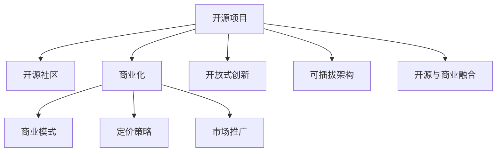

                 

# 从代码到商业：将开源项目转化为盈利企业

## 1. 背景介绍

### 1.1 问题由来
随着开源运动的兴起，越来越多的开发者通过开源项目获得了显著的成功。开源软件不仅改变了软件产业的生态，也为个人和公司带来了前所未有的发展机遇。然而，将一个开源项目成功商业化，却是一个极具挑战的过程。许多优秀的开源项目，最终都因缺乏商业化的策略和能力，而无法实现长期盈利。

### 1.2 问题核心关键点
开源项目商业化的核心在于：如何平衡开放与盈利，确保项目能够持续发展，并在商业市场中获得回报。这一过程涉及技术开发、市场策略、运营管理等多个环节，需要综合运用各种工具和资源。

### 1.3 问题研究意义
对于开发者而言，成功商业化开源项目不仅能够带来可观的收益，还能够通过实践提升项目管理和市场运营能力。对于企业而言，开源项目商业化能够帮助其快速构建竞争优势，扩展市场份额，促进产品创新和用户体验的提升。

## 2. 核心概念与联系

### 2.1 核心概念概述

为更好地理解开源项目商业化的过程，本节将介绍几个密切相关的核心概念：

- 开源项目(Open Source Project)：通过开源许可证发布的软件项目，任何人都可以自由访问、修改和使用。
- 开源社区(Open Source Community)：围绕开源项目形成的一群志愿者开发者，共同维护和贡献代码，推动项目发展。
- 商业化(Commercialization)：将开源项目转型为盈利企业的行为，包括引入商业模式、制定定价策略、推广销售等。
- 开放式创新(Open Innovation)：通过开放合作，将项目与外部市场、用户、供应商等联系起来，共同推进技术进步和市场应用。
- 可插拔架构(Plug-and-Play Architecture)：系统组件之间通过标准化接口进行连接，实现灵活扩展和集成。
- 开源与商业融合(Open Source and Commercial Integration)：将开源理念与商业需求相结合，实现技术与市场的协同进化。

这些核心概念之间的逻辑关系可以通过以下Mermaid流程图来展示：



这个流程图展示了大语言模型的核心概念及其之间的关系：

1. 开源项目通过开源社区的支持，不断迭代改进。
2. 商业化是将开源项目转型为盈利企业的行为，包括引入商业模式、制定定价策略、推广销售等。
3. 开放式创新和可插拔架构是实现商业化的重要手段。
4. 开源与商业融合是实现技术与市场协同进化的关键。

## 3. 核心算法原理 & 具体操作步骤
### 3.1 算法原理概述

开源项目商业化的本质是一种开放式创新的过程。它通过开放合作、标准化接口、灵活集成等手段，将项目与外部市场、用户、供应商等联系起来，共同推进技术进步和市场应用。

形式化地，假设一个开源项目 $P$，其商业化过程可以表示为：

$$
P_{\text{商业化}} = f(P_{\text{开源}}, P_{\text{社区}}, P_{\text{市场}})
$$

其中 $P_{\text{开源}}$ 表示项目的技术实现，$P_{\text{社区}}$ 表示开源社区的支持和贡献，$P_{\text{市场}}$ 表示市场对项目的需求和反馈。

商业化的目标是通过引入商业模式、定价策略、市场推广等手段，将项目转化为盈利企业，其具体步骤如下：

1. **市场分析**：识别目标市场和用户需求，分析竞争对手和市场趋势。
2. **商业模式设计**：选择合适的商业模式，如SaaS、订阅制、开源授权等。
3. **定价策略制定**：根据商业模式，制定合理的定价方案，包括基础版、专业版、企业版等。
4. **市场推广**：通过广告、社交媒体、开发者社区等方式，推广项目和企业品牌。
5. **销售渠道搭建**：建立线上线下销售渠道，确保产品能够快速到达目标用户。
6. **用户体验提升**：持续优化产品功能，提升用户体验，增强用户粘性。
7. **反馈收集与迭代**：收集用户反馈，不断迭代产品，满足市场需求。

### 3.2 算法步骤详解

开源项目商业化的具体步骤可以进一步细化为以下几个关键步骤：

**Step 1: 市场分析**
- 进行市场调研，收集用户需求、竞争对手信息、市场规模等数据。
- 定义目标用户群体，分析其特征、行为、需求等。
- 评估市场趋势和未来发展方向，识别潜在机会。

**Step 2: 商业模式设计**
- 选择适合的商业模式，如SaaS、订阅制、开源授权等。
- 根据商业模式，设计收入模型，如订阅费、按需付费、免费增值等。
- 制定相关政策和流程，确保商业模式可持续运行。

**Step 3: 定价策略制定**
- 基于成本、市场定位、竞争对手等因素，制定合理的定价策略。
- 设计不同版本的产品，满足不同用户群体的需求，如基础版、专业版、企业版等。
- 设置灵活的价格区间，根据用户需求和市场反馈进行调整。

**Step 4: 市场推广**
- 通过线上渠道（如官网、社交媒体、应用商店等）进行产品推广。
- 利用线下渠道（如展会、研讨会、合作伙伴等）进行市场宣传。
- 与开发者社区合作，推动项目和企业的曝光率。

**Step 5: 销售渠道搭建**
- 建立线上销售渠道（如官网、电商平台等）。
- 拓展线下销售渠道（如代理商、合作伙伴等）。
- 提供技术支持和售后服务，增强用户信任和满意度。

**Step 6: 用户体验提升**
- 收集用户反馈，优化产品功能和用户体验。
- 通过A/B测试、用户调研等方式，验证产品改进效果。
- 持续迭代产品，增强市场竞争力。

**Step 7: 反馈收集与迭代**
- 定期收集用户反馈，评估产品效果和市场表现。
- 根据反馈结果，优化产品功能和市场策略。
- 保持灵活性，快速响应市场变化和用户需求。

### 3.3 算法优缺点

开源项目商业化具有以下优点：
1. 创新速度快。开源社区的开放合作和灵活集成，使得项目可以快速迭代，满足市场需求。
2. 用户基础广泛。开源项目通常拥有庞大的开发者社区，可以提供稳定的用户支持和反馈。
3. 成本低廉。开源项目通过社区贡献和开源授权，减少了开发和运营成本。
4. 可扩展性强。开源架构的模块化和插件化特性，使得项目能够灵活扩展和集成。

同时，该方法也存在一定的局限性：
1. 用户需求多样。开源社区的多样性可能导致项目功能过于分散，难以集中精力解决核心问题。
2. 盈利模式单一。多数开源项目采用免费开源模式，对商业化前景和收益来源构成挑战。
3. 品牌认知度低。开源项目往往缺乏成熟的品牌推广策略，市场知名度不高。
4. 技术标准化难度大。开源社区的异构技术栈和接口标准，可能导致集成复杂度增加。

尽管存在这些局限性，但就目前而言，开源项目商业化仍是一种极具潜力的发展方向。未来相关研究的重点在于如何进一步优化商业模式、提高市场推广效率、提升用户体验等，以实现更高效的开源项目商业化。

### 3.4 算法应用领域

开源项目商业化在多个领域已得到了广泛的应用，包括但不限于：

- 软件开发：许多知名的开源软件，如GitHub、Red Hat等，都通过商业化实现了长期盈利。
- 大数据分析：Apache Hadoop、Apache Spark等开源项目，通过提供商业化的云服务，成为大数据市场的重要玩家。
- 云基础设施：AWS、Google Cloud、阿里云等，基于开源技术的云平台，成为全球领先的云服务提供商。
- 智能硬件：开源硬件项目，如Raspberry Pi、Arduino等，通过商业化扩展市场，成为物联网应用的重要工具。
- 通信网络：Open Telekom Cloud、Open Networking Foundation等，基于开源网络技术的解决方案，广泛应用于企业通信和数据中心。

除了这些经典应用领域外，开源项目商业化还在更多领域展现出强大的生命力，为各行各业带来变革性影响。

## 4. 数学模型和公式 & 详细讲解  
### 4.1 数学模型构建

商业化过程的数学模型构建，可以通过经济学的供需模型来进行描述。

设市场需求为 $D$，项目供给为 $S$，设 $p$ 为商品价格，则供需平衡时，市场需求和供给满足以下关系：

$$
D(p) = S(p)
$$

市场需求 $D(p)$ 与价格 $p$ 的关系，可以通过消费者行为分析建模，如Logistic回归、线性回归等。项目供给 $S(p)$ 与价格 $p$ 的关系，可以通过成本分析、生产能力等建模，如成本函数、生产函数等。

### 4.2 公式推导过程

以下以软件开发为例，推导市场需求和供给的公式。

设软件开发项目的市场需求为 $D$，价格为 $p$，单位开发成本为 $c$，每份软件的边际成本为 $m$，则市场需求函数可以表示为：

$$
D(p) = \frac{q_0}{p} + \frac{q_1}{p^2} + \frac{q_2}{p^3}
$$

其中 $q_0, q_1, q_2$ 为市场需求参数，反映不同价格水平下的需求变化趋势。项目供给函数可以表示为：

$$
S(p) = k - \frac{m}{p}
$$

其中 $k$ 为生产能力，$m$ 为边际成本。当市场需求与供给平衡时，有：

$$
\frac{q_0}{p} + \frac{q_1}{p^2} + \frac{q_2}{p^3} = k - \frac{m}{p}
$$

解此方程，可以得到市场平衡时的价格和生产量。

### 4.3 案例分析与讲解

以GitHub为例，分析其商业化的成功经验。

GitHub是一个基于Git版本控制系统的开源平台，提供代码托管、项目协作、社区交流等功能。其商业化主要通过以下步骤实现：

1. **开放社区**：GitHub通过提供免费的基本服务，吸引大量开发者使用，构建庞大的社区和开发者网络。
2. **增值服务**：GitHub提供高级订阅服务，如私有仓库、代码审查、CI/CD集成等，满足企业级用户需求。
3. **企业集成**：GitHub通过API和企业版集成，为企业提供解决方案，提升用户粘性和满意度。
4. **云服务扩展**：GitHub云服务成为全球领先的云开发平台，提供代码托管、持续集成、DevOps自动化等功能。
5. **广告和生态**：GitHub通过广告、开发者生态、第三方集成等方式，获取稳定的收入来源。

GitHub的商业化策略，通过开放社区和增值服务相结合，充分发挥开源项目的优势，实现了业务的快速增长和盈利。

## 5. 项目实践：代码实例和详细解释说明
### 5.1 开发环境搭建

在进行开源项目商业化实践前，我们需要准备好开发环境。以下是使用Python进行Flask开发的环境配置流程：

1. 安装Anaconda：从官网下载并安装Anaconda，用于创建独立的Python环境。

2. 创建并激活虚拟环境：
```bash
conda create -n flask-env python=3.8 
conda activate flask-env
```

3. 安装Flask：
```bash
pip install flask
```

4. 安装Flask扩展库：
```bash
pip install flask-login flask-migrate flask-sqlalchemy
```

5. 安装Flask-RESTful：
```bash
pip install flask-restful
```

完成上述步骤后，即可在`flask-env`环境中开始商业化实践。

### 5.2 源代码详细实现

这里我们以GitHub的增值服务为例，给出使用Flask框架构建开源项目增值服务的PyTorch代码实现。

首先，定义用户模型和角色模型：

```python
from flask_login import UserMixin, LoginManager
from flask_sqlalchemy import SQLAlchemy

login_manager = LoginManager()
login_manager.login_view = 'login'
login_manager.login_message_category = 'info'

db = SQLAlchemy(app)

class User(UserMixin, db.Model):
    id = db.Column(db.Integer, primary_key=True)
    username = db.Column(db.String(64), unique=True, index=True)
    email = db.Column(db.String(64), unique=True, index=True)
    password_hash = db.Column(db.String(128))
    is_admin = db.Column(db.Boolean, default=False)

    def __init__(self, username, email, password):
        self.username = username
        self.email = email
        self.password_hash = password_hash
        self.is_admin = False
```

然后，定义登录和注销视图：

```python
from flask import render_template, redirect, url_for, request, flash
from flask_login import login_user, logout_user, login_required, current_user

@app.route('/login', methods=['GET', 'POST'])
def login():
    if current_user.is_authenticated:
        return redirect(url_for('index'))
    if request.method == 'POST':
        username = request.form['username']
        password = request.form['password']
        user = User.query.filter_by(username=username).first()
        if user is None or not user.check_password(password):
            flash('Invalid username or password')
            return redirect(url_for('login'))
        login_user(user)
        return redirect(url_for('index'))
    return render_template('login.html')

@app.route('/logout')
@login_required
def logout():
    logout_user()
    return redirect(url_for('index'))
```

接着，定义用户管理视图：

```python
@app.route('/admin/users')
@login_required
def admin_users():
    users = User.query.all()
    return render_template('admin/users.html', users=users)
```

最后，启动Flask应用：

```python
if __name__ == '__main__':
    app.run(debug=True)
```

以上就是使用Flask框架构建开源项目增值服务的完整代码实现。可以看到，Flask框架的灵活性和可扩展性，使得商业化应用的开发变得相对简单和高效。

### 5.3 代码解读与分析

让我们再详细解读一下关键代码的实现细节：

**User类**：
- 定义了用户的基本信息，包括用户名、邮箱、密码等属性。
- 通过Flask-Login扩展库，实现了用户登录、注销等功能。
- 实现了用户角色管理，方便后续进行权限控制。

**login视图**：
- 处理用户登录请求，验证用户名和密码，并通过Flask-Login扩展库实现用户登录。
- 如果登录成功，重定向到首页；如果验证失败，返回登录页面并显示错误信息。

**logout视图**：
- 处理用户注销请求，通过Flask-Login扩展库实现用户注销。

**admin_users视图**：
- 列出所有用户信息，供管理员管理用户。

**运行结果展示**：
- 在运行Flask应用后，可以通过浏览器访问登录页面，输入正确的用户名和密码，即可登录成功。
- 管理员可以访问用户管理页面，查看和管理所有用户信息。

## 6. 实际应用场景
### 6.1 智能硬件

开源智能硬件项目通过社区贡献和开源授权，实现了硬件与软件的无缝集成，推动了智能硬件的普及和创新。例如，开源硬件项目Raspberry Pi，通过提供免费的基础硬件平台，吸引了大量开发者和用户，形成了活跃的社区生态。

项目团队通过商业化的智能云服务、开发板销售、教育培训等方式，实现了项目的盈利。同时，开源项目的高灵活性和可扩展性，也使得项目能够快速适应市场需求变化，保持竞争力。

### 6.2 大数据分析

开源大数据项目通过社区贡献和开源授权，推动了大数据技术的发展和普及。例如，Apache Hadoop通过提供免费的基础平台，吸引了大量企业和开发者使用，构建了庞大的社区和生态。

项目团队通过商业化的云服务、大数据分析工具、企业集成等方式，实现了项目的盈利。同时，开源项目的高可扩展性和可定制性，也使得项目能够适应不同行业的需求，扩展市场份额。

### 6.3 云基础设施

开源云平台通过社区贡献和开源授权，推动了云计算技术的发展和普及。例如，AWS、Google Cloud、阿里云等，通过提供免费的基础云服务，吸引了大量企业和开发者使用，构建了庞大的社区和生态。

项目团队通过商业化的云服务、基础设施服务、企业集成等方式，实现了项目的盈利。同时，开源项目的高灵活性和可扩展性，也使得项目能够适应不同行业的需求，扩展市场份额。

## 7. 工具和资源推荐
### 7.1 学习资源推荐

为了帮助开发者系统掌握开源项目商业化的理论基础和实践技巧，这里推荐一些优质的学习资源：

1. 《从开源到盈利：开源项目商业化指南》系列博文：由开源商业化专家撰写，深入浅出地介绍了开源项目商业化的策略、方法和案例。

2. 《开源社区管理与运营》课程：Coursera上的开源社区管理与运营课程，涵盖开源项目的社区管理、贡献者激励、市场推广等内容。

3. 《开源项目商业模式》书籍：开源项目商业化的经典书籍，全面介绍了开源项目商业化的各种模式和策略。

4. GitHub官方文档：GitHub的官方文档，提供了丰富的开源项目商业化案例和实践指南。

5. GitLab官方文档：GitLab的官方文档，提供了丰富的开源项目商业化案例和实践指南。

通过对这些资源的学习实践，相信你一定能够快速掌握开源项目商业化的精髓，并用于解决实际的商业化问题。

### 7.2 开发工具推荐

高效的开发离不开优秀的工具支持。以下是几款用于开源项目商业化开发的常用工具：

1. GitHub：全球最大的开源代码托管平台，提供社区管理、版本控制、协作开发等功能。

2. GitLab：开源社区，提供代码托管、持续集成、自动化测试等功能。

3. Docker：容器化技术，提供轻量级、可移植、可扩展的开发环境，方便开源项目部署和推广。

4. Jenkins：持续集成工具，提供自动化测试、构建、部署等功能，提高开发效率和产品质量。

5. ELK Stack：日志和监控工具，提供实时监控、日志管理、异常告警等功能，保障开源项目稳定运行。

合理利用这些工具，可以显著提升开源项目商业化的开发效率，加快创新迭代的步伐。

### 7.3 相关论文推荐

开源项目商业化发展源于学界的持续研究。以下是几篇奠基性的相关论文，推荐阅读：

1. Open Source Ecosystems: The Dynamics of Open Source Development in Enterprise and Community（José A. Larrañagaa, Niklas Emil Müller, Klaus Wombacher）：探讨了开源社区和企业的互动关系，分析了开源项目的成功因素。

2. Open Source Projects in Industrial Practice: Conceptualizing Openness in the Workflow of Innovation（Heather Johnson, Adrianne Heins, Matt Dangle）：分析了开源项目在工业实践中的特点和挑战，提出了开源项目商业化的策略。

3. The Impact of Open Source on Business Innovation: A Study of Open Innovation in Information Technology and Software Development（Arindam Banerjee, Christopher L. Griffith, Elaine L. O'Leary）：分析了开源项目对企业创新和竞争力的影响，探讨了开源项目商业化的模式。

这些论文代表了大语言模型微调技术的发展脉络。通过学习这些前沿成果，可以帮助研究者把握学科前进方向，激发更多的创新灵感。

## 8. 总结：未来发展趋势与挑战

### 8.1 总结

本文对开源项目商业化的过程进行了全面系统的介绍。首先阐述了开源项目和商业化的核心概念及其逻辑关系，明确了开源项目商业化的重要性和可行性。其次，从原理到实践，详细讲解了开源项目商业化的数学模型和关键步骤，给出了商业化任务开发的完整代码实例。同时，本文还广泛探讨了开源项目商业化在智能硬件、大数据、云基础设施等多个行业领域的应用前景，展示了开源项目商业化的广阔潜力。此外，本文精选了开源项目商业化的各类学习资源，力求为读者提供全方位的技术指引。

通过本文的系统梳理，可以看到，开源项目商业化不仅能够降低开发成本、加速产品创新，还能通过社区贡献和开源授权，获得广泛的用户支持和市场推广，从而实现可持续的盈利和发展。未来，伴随开源项目商业化的不断发展，相信开源技术将在更多领域得到应用，为各行各业带来变革性影响。

### 8.2 未来发展趋势

展望未来，开源项目商业化将呈现以下几个发展趋势：

1. 社区与商业融合加深。开源项目将更深入地与企业用户和开发者合作，实现开源与商业的协同进化。
2. 平台化运营趋势明显。开源平台通过整合社区资源、提供统一服务，成为开源项目商业化的重要载体。
3. 开源技术与云服务的深度融合。开源项目将更多地与云服务结合，提供更强大的计算和存储能力，提升用户体验。
4. 开源与机器学习结合。开源项目通过引入机器学习技术，提升数据处理和分析能力，推动智能应用的发展。
5. 开源项目的多样化。开源项目将涵盖更多领域，如医疗、金融、教育等，提供更广泛的技术和解决方案。
6. 开源项目的全球化。开源项目将更广泛地覆盖全球市场，吸引更多国际用户和开发者。

以上趋势凸显了开源项目商业化的广阔前景。这些方向的探索发展，必将进一步提升开源项目的商业价值和社会影响力，为开源技术的全球普及和应用带来新的机遇。

### 8.3 面临的挑战

尽管开源项目商业化已经取得了一定的成功，但在迈向更加智能化、普适化应用的过程中，它仍面临着诸多挑战：

1. 开源社区管理难度大。开源项目的高度自由和协作特性，可能导致社区管理复杂，需要平衡自由与秩序。
2. 商业化收益不确定。开源项目依赖社区贡献，商业化的收益和成本难以精确预测。
3. 商业模式单一。多数开源项目采用免费开源模式，难以满足企业的盈利需求。
4. 市场推广成本高。开源项目需要广泛的社区推广，成本较高。
5. 开源与商业融合复杂。开源项目的多样性和复杂性，可能导致商业化融合难度大。

尽管存在这些挑战，但通过不断的技术创新和市场探索，开源项目商业化仍具有广阔的前景。相信随着学界和产业界的共同努力，这些挑战终将一一被克服，开源项目商业化必将在构建人机协同的智能时代中扮演越来越重要的角色。

### 8.4 研究展望

面对开源项目商业化所面临的种种挑战，未来的研究需要在以下几个方面寻求新的突破：

1. 探索更加灵活的商业模式。开发更加多样化的商业模式，如SaaS、订阅制、开源授权等，满足不同企业的需求。
2. 研究更加高效的社区管理策略。引入区块链、智能合约等技术，优化开源社区的管理和贡献。
3. 开发更加先进的数据分析工具。引入大数据、机器学习技术，提升开源项目的数据处理和分析能力。
4. 引入更多的开源项目孵化机制。通过政府资助、企业合作等方式，加速开源项目的商业化进程。
5. 加强开源项目的国际化推广。通过全球化的市场推广，吸引更多的国际用户和开发者。

这些研究方向的探索，必将引领开源项目商业化技术迈向更高的台阶，为构建安全、可靠、可解释、可控的智能系统铺平道路。面向未来，开源项目商业化技术还需要与其他人工智能技术进行更深入的融合，如知识表示、因果推理、强化学习等，多路径协同发力，共同推动自然语言理解和智能交互系统的进步。只有勇于创新、敢于突破，才能不断拓展开源项目的边界，让智能技术更好地造福人类社会。

## 9. 附录：常见问题与解答

**Q1：开源项目商业化是否适合所有企业？**

A: 开源项目商业化适合那些具有开放合作精神、拥有技术创新能力的企业。特别是对于初创企业，开源项目商业化能够通过社区贡献和开源授权，降低开发成本，提升技术竞争力。但对于那些依赖传统商业模式、不愿开放技术的企业，商业化可能并不适合。

**Q2：商业化过程中如何平衡开源与商业的冲突？**

A: 商业化过程中需要平衡开源与商业的冲突，主要通过以下方式：
1. 明确开源协议。选择合适的开源协议，如GPL、Apache、MIT等，明确开源项目的权限和限制。
2. 制定合理的商业化策略。通过免费开源和商业服务相结合，满足不同用户群体的需求。
3. 建立透明的沟通机制。与开源社区保持密切沟通，及时解决冲突和争议。

**Q3：商业化过程中如何保证项目的持续更新和维护？**

A: 商业化过程中保证项目的持续更新和维护，主要通过以下方式：
1. 引入社区贡献。通过社区贡献和贡献者激励机制，吸引开发者积极参与项目维护。
2. 建立反馈机制。通过用户反馈和社区讨论，持续优化项目功能和用户体验。
3. 引入开源授权。通过开放源代码授权，降低企业维护成本，提升项目灵活性。

**Q4：商业化过程中如何避免市场竞争的激烈？**

A: 避免市场竞争的激烈，主要通过以下方式：
1. 差异化定位。通过市场调研和用户需求分析，找到项目独特卖点，差异化定位市场。
2. 多元化业务。通过引入多样化的业务和服务，分散风险，增强市场竞争力。
3. 全球化布局。通过全球化的市场推广和销售，扩大市场份额，降低地域性竞争风险。

**Q5：商业化过程中如何确保用户隐私和数据安全？**

A: 确保用户隐私和数据安全，主要通过以下方式：
1. 合规性保障。遵守相关法律法规，确保数据处理和存储的合规性。
2. 数据加密和匿名化。采用数据加密和匿名化技术，保护用户隐私。
3. 安全审计和监控。定期进行安全审计和监控，及时发现和修复安全漏洞。

以上是开源项目商业化过程中常见的问题和解答。通过深入理解商业化的关键环节，合理制定商业化策略，确保开源项目能够持续发展，并在商业市场中获得回报。

---

作者：禅与计算机程序设计艺术 / Zen and the Art of Computer Programming

