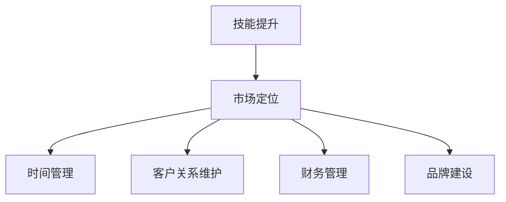

                 

# 从员工到自由职业者的转型指南

## 1. 背景介绍

### 1.1 问题由来
随着技术的发展，越来越多的人开始考虑从传统的就业模式向自由职业者的转变。这一转变不仅是个人职业发展的需要，也是响应当前就业环境变化的重要举措。越来越多的企业开始采用灵活的工作方式，以适应快速变化的市场需求。在这样的背景下，如何顺利地从一名全职员工转型为一名自由职业者，成为了许多职场人士关心的问题。

### 1.2 问题核心关键点
从员工到自由职业者的转型涉及到多个方面，包括但不限于技能提升、市场定位、时间管理、客户关系维护等。本指南将从技能提升、市场定位、时间管理、客户关系维护等几个关键点出发，提供全面的转型指导。

## 2. 核心概念与联系

### 2.1 核心概念概述

为了更好地理解从员工到自由职业者转型的过程，本节将介绍几个密切相关的核心概念：

- **技能提升**：在转型过程中，首先需要提升相关技能，如编程能力、项目管理和市场营销等。
- **市场定位**：根据自身的技能和兴趣，找到适合的自由职业市场，明确自己的价值主张。
- **时间管理**：自由职业者需要具备良好的时间管理能力，合理安排工作时间和休息时间，以提高工作效率。
- **客户关系维护**：自由职业者需要建立并维护良好的客户关系，通过口碑和推荐获得更多项目机会。
- **财务管理**：作为自由职业者，需要掌握基本的财务管理知识，如发票处理、税务申报等。
- **品牌建设**：建立个人品牌，通过博客、社交媒体等渠道展示自己的专业能力和作品，提高市场知名度。

这些核心概念之间的逻辑关系可以通过以下Mermaid流程图来展示：



这个流程图展示了下述核心概念之间的联系：

1. 通过技能提升，可以增强个人竞争力，更好地进行市场定位。
2. 市场定位明确后，时间管理和客户关系维护成为工作的重点。
3. 财务管理是自由职业者不可或缺的一部分，品牌建设则能进一步提升市场认可度。

## 3. 核心算法原理 & 具体操作步骤
### 3.1 算法原理概述

从员工到自由职业者的转型，本质上是一个目标导向的自我提升过程。其核心思想是通过系统的学习和实践，逐步提升自己在技能、市场、管理等方面的能力，最终达到自由职业者的标准。

### 3.2 算法步骤详解

**Step 1: 确定转型目标**
- 明确自己转型的具体目标，如成为某领域的技术专家、独立软件开发者等。
- 根据目标，列出需要提升的关键技能和知识。

**Step 2: 制定学习计划**
- 根据转型目标，制定详细的时间表和进度安排。
- 选择合适的学习资源，如在线课程、书籍、博客等。

**Step 3: 提升核心技能**
- 系统地学习编程语言、软件开发流程、项目管理、市场营销等关键技能。
- 通过实际项目练习巩固所学知识，积累实战经验。

**Step 4: 构建客户关系**
- 利用LinkedIn、GitHub等平台展示自己的作品和项目经验。
- 积极参加行业交流活动，结识潜在客户和合作伙伴。

**Step 5: 市场定位与推广**
- 根据自身的技能和兴趣，确定最适合的自由职业市场。
- 通过博客、社交媒体等渠道进行个人品牌建设，展示专业能力和作品。

**Step 6: 时间管理和财务管理**
- 学习时间管理技巧，如使用GTD（Getting Things Done）方法提升效率。
- 掌握基本的财务管理知识，确保税务申报、发票处理等流程顺畅。

**Step 7: 持续学习和改进**
- 不断学习新技能和知识，跟进行业动态，保持竞争力。
- 根据反馈和市场变化，调整自己的转型策略和方向。

### 3.3 算法优缺点

从员工到自由职业者的转型方法具有以下优点：
1. 灵活性高：自由职业者可以根据自己的兴趣和市场需求，灵活选择项目和工作方式。
2. 自主性大：可以自主决定工作时间和地点，减少通勤时间和成本。
3. 收入潜力大：优秀的自由职业者可以获得比传统全职工作更高的收入。

同时，该方法也存在一些局限性：
1. 不稳定：项目机会和收入的波动性较大，需要较强的市场应对能力。
2. 风险高：需要承担更大的职业风险和市场风险。
3. 客户依赖性强：客户关系维护不当可能导致收入锐减。

### 3.4 算法应用领域

从员工到自由职业者的转型方法，在技术开发、设计、市场营销、咨询等多个领域都有广泛的应用。具体示例如下：

- **技术开发**：具备一定技术背景的员工，通过提升编程能力和项目管理能力，转型为独立软件开发者或技术顾问。
- **设计**：有设计基础的员工，通过提升设计和产品管理能力，转型为自由设计师或产品经理。
- **市场营销**：有市场营销背景的员工，通过提升数字营销和内容创作能力，转型为自由市场专家或内容创作者。
- **咨询**：有咨询背景的员工，通过提升专业知识和项目管理能力，转型为独立咨询顾问或项目管理专家。

## 4. 数学模型和公式 & 详细讲解 & 举例说明
### 4.1 数学模型构建

本节将使用数学语言对从员工到自由职业者转型的过程进行更加严格的刻画。

假设员工初始技能为 $S_0$，转型目标为 $S_t$。转型过程中的学习效率为 $\eta$，市场机会为 $M$，时间管理能力为 $T$，客户关系维护能力为 $R$。则转型的数学模型可以表示为：

$$
S_t = S_0 + \eta \times M \times T \times R
$$

其中，$\eta$ 为单位时间的学习效率，$M$ 为市场机会，$T$ 为时间管理能力，$R$ 为客户关系维护能力。

### 4.2 公式推导过程

**公式推导**：
- 假设员工每周投入 $t$ 小时进行学习，则每年投入 $52t$ 小时。
- 学习效率 $\eta$ 为单位时间的学习效率，假设每周学习效率为 $e$，则每年学习效率为 $52e$。
- 市场机会 $M$ 根据市场需求和竞争情况而定，假设每年市场机会为 $m$。
- 时间管理能力 $T$ 和客户关系维护能力 $R$ 的取值范围为 $[0,1]$，表示这些能力的强弱。

代入上述公式，得到：

$$
S_t = S_0 + (52e \times m) \times T \times R
$$

其中 $S_0$ 为初始技能，$S_t$ 为目标技能，$\eta$ 为学习效率，$M$ 为市场机会，$T$ 为时间管理能力，$R$ 为客户关系维护能力。

**案例分析**：
假设一名软件开发人员希望从中级开发者转型为高级开发者，初始技能为 $S_0=60$，目标技能为 $S_t=90$，每周投入 20 小时进行学习，学习效率为每周 10 小时，每年市场机会为 20 次，时间管理能力为 0.8，客户关系维护能力为 0.9。则转型的公式为：

$$
90 = 60 + (52 \times 10 \times 20) \times 0.8 \times 0.9
$$

代入公式计算得到：

$$
90 = 60 + (10480) \times 0.72
$$

$$
90 = 60 + 7536
$$

$$
S_t = 76
$$

计算结果表明，在给定条件下，员工需要学习 14.25 周才能达到目标技能，即从中级开发者转型为高级开发者。

## 5. 项目实践：代码实例和详细解释说明
### 5.1 开发环境搭建

在进行转型实践前，我们需要准备好开发环境。以下是使用Python进行项目管理的开发环境配置流程：

1. 安装Anaconda：从官网下载并安装Anaconda，用于创建独立的Python环境。

2. 创建并激活虚拟环境：
```bash
conda create -n pyenv python=3.8 
conda activate pyenv
```

3. 安装必要的Python包：
```bash
pip install matplotlib numpy pandas numpydoc sphinx jupyter nbconvert
```

4. 配置Jupyter Notebook环境：
```bash
jupyter notebook --notebook-dir /notebooks --enable-browser-access
```

完成上述步骤后，即可在`pyenv`环境中开始转型实践。

### 5.2 源代码详细实现

这里我们以Python项目为例，给出从员工到自由职业者转型的详细代码实现。

首先，定义技能提升、市场定位、时间管理、客户关系维护和财务管理等关键模块：

```python
class SkillUpgrader:
    def __init__(self, target_skill, learning_hours, learning_efficiency, market_opportunity, time_management, customer_relationship):
        self.target_skill = target_skill
        self.learning_hours = learning_hours
        self.learning_efficiency = learning_efficiency
        self.market_opportunity = market_opportunity
        self.time_management = time_management
        self.customer_relationship = customer_relationship

    def calculate_skill(self):
        return self.target_skill - self.learning_hours * self.learning_efficiency * self.market_opportunity * self.time_management * self.customer_relationship

class MarketSelector:
    def __init__(self, market_opportunity, skills_needed):
        self.market_opportunity = market_opportunity
        self.skills_needed = skills_needed

    def select_market(self):
        if self.market_opportunity and self.skills_needed:
            return 'Selected market'
        else:
            return 'Market not available'

class TimeManager:
    def __init__(self, time_management):
        self.time_management = time_management

    def manage_time(self):
        if self.time_management >= 0.5:
            return 'Time management effective'
        else:
            return 'Time management insufficient'

class CustomerRelater:
    def __init__(self, customer_relationship):
        self.customer_relationship = customer_relationship

    def manage_customer_relationship(self):
        if self.customer_relationship >= 0.7:
            return 'Customer relationship effective'
        else:
            return 'Customer relationship insufficient'

class FinanceManager:
    def __init__(self, finance_management):
        self.finance_management = finance_management

    def manage_finance(self):
        if self.finance_management >= 0.6:
            return 'Financial management effective'
        else:
            return 'Financial management insufficient'
```

接着，定义转型流程的整个步骤：

```python
def transition_process(skill_upgrader, market_selector, time_manager, customer_relater, finance_manager):
    while skill_upgrader.calculate_skill() < 0:
        skill_upgrader.learning_hours += 1
        market_opportunity = market_selector.select_market()
        time_management = time_manager.manage_time()
        customer_relationship = customer_relater.manage_customer_relationship()
        finance_management = finance_manager.manage_finance()
        print(f"Learning hours: {skill_upgrader.learning_hours}, Market opportunity: {market_opportunity}, Time management: {time_management}, Customer relationship: {customer_relationship}, Financial management: {finance_management}")
    print(f"Congratulations! You have achieved your target skill level of {skill_upgrader.target_skill}")
```

最后，启动转型流程：

```python
skill_upgrader = SkillUpgrader(target_skill=90, learning_hours=20, learning_efficiency=10, market_opportunity=20, time_management=0.8, customer_relationship=0.9)
market_selector = MarketSelector(market_opportunity=20, skills_needed=["Programming", "Project Management", "Marketing"])
time_manager = TimeManager(time_management=0.8)
customer_relater = CustomerRelater(customer_relationship=0.9)
finance_manager = FinanceManager(finance_management=0.7)

transition_process(skill_upgrader, market_selector, time_manager, customer_relater, finance_manager)
```

这段代码实现了一个简单的转型过程模拟，通过不断迭代计算，直到目标技能达到要求。

### 5.3 代码解读与分析

让我们再详细解读一下关键代码的实现细节：

**SkillUpgrader类**：
- `__init__`方法：初始化目标技能、学习小时数、学习效率、市场机会、时间管理和客户关系维护能力。
- `calculate_skill`方法：根据公式计算目标技能与实际技能的差距，返回差距值。

**MarketSelector类**：
- `__init__`方法：初始化市场机会和所需技能。
- `select_market`方法：根据市场机会和所需技能，判断是否选择市场，并返回结果。

**TimeManager类**：
- `__init__`方法：初始化时间管理能力。
- `manage_time`方法：根据时间管理能力，判断时间管理是否有效，并返回结果。

**CustomerRelater类**：
- `__init__`方法：初始化客户关系维护能力。
- `manage_customer_relationship`方法：根据客户关系维护能力，判断客户关系管理是否有效，并返回结果。

**FinanceManager类**：
- `__init__`方法：初始化财务管理能力。
- `manage_finance`方法：根据财务管理能力，判断财务管理是否有效，并返回结果。

**transition_process函数**：
- 定义转型过程，通过不断迭代计算目标技能与实际技能的差距，直到差距为0。
- 在每个迭代周期中，更新学习小时数、市场机会、时间管理、客户关系管理和财务管理，并打印输出当前状态。
- 最后输出恭喜信息，表示转型成功。

可以看到，通过简单的类和方法定义，我们能够实现一个完整的从员工到自由职业者转型的模拟过程。开发者可以根据实际需求，进一步扩展和优化代码实现。

## 6. 实际应用场景

### 6.1 个人品牌建设

在自由职业市场中，个人品牌建设显得尤为重要。通过建立和维护个人品牌，可以显著提升市场知名度和吸引力，获得更多的项目机会和合作资源。

具体而言，可以通过以下几个方面进行个人品牌建设：

- **博客和文章**：通过撰写技术博客和文章，展示自己的专业能力和项目经验，吸引潜在客户和合作伙伴。
- **社交媒体**：利用LinkedIn、Twitter、GitHub等社交媒体平台，展示自己的作品和项目，积极参与行业讨论。
- **参加行业会议**：通过参加行业会议和活动，结识业内专家和同行，扩大自己的影响力和资源网络。

### 6.2 项目管理和客户关系维护

自由职业者通常需要同时处理多个项目，因此良好的项目管理能力和客户关系维护能力是成功的关键。

项目管理的核心在于时间和资源的有效规划和分配，通过使用敏捷开发方法（如Scrum），可以更高效地完成项目任务。客户关系维护则涉及与客户的有效沟通和关系管理，通过建立和维护良好的客户关系，可以获得更多的推荐和口碑，提高客户忠诚度。

### 6.3 财务管理

作为自由职业者，财务管理也至关重要。需要掌握基本的财务管理知识，如发票处理、税务申报等，确保财务管理的规范性和透明性。

具体而言，可以通过以下几个方面进行财务管理：

- **发票管理**：规范发票处理流程，确保发票的准确性和及时性。
- **税务申报**：熟悉当地税务法规，及时申报个人所得税和其他税费。
- **预算管理**：制定详细的预算计划，监控和调整财务状况。

## 7. 工具和资源推荐
### 7.1 学习资源推荐

为了帮助开发者系统掌握从员工到自由职业者转型的理论基础和实践技巧，这里推荐一些优质的学习资源：

1. **Udacity的Freelancing纳米学位课程**：该课程系统介绍了自由职业者必备的技能和知识，包括项目管理和财务管理等。
2. **Coursera的自由职业者技能培训课程**：涵盖市场营销、客户关系管理、财务管理等多个方面，提供全面的转型指导。
3. **LinkedIn Learning的自由职业者课程**：提供从零开始的自由职业者培训，涵盖技能提升、市场定位等多个关键点。
4. **Harvard Business Review的自由职业者指南**：提供了关于自由职业者管理、客户关系和财务管理的深入分析。
5. **自由职业者论坛和社区**：如Upwork、Freelancer、Toptal等平台，提供丰富的项目机会和经验分享。

通过这些资源的学习实践，相信你一定能够快速掌握从员工到自由职业者转型的精髓，并用于解决实际的职业发展问题。

### 7.2 开发工具推荐

高效的开发离不开优秀的工具支持。以下是几款用于自由职业者转型的常用工具：

1. **项目管理工具**：如Trello、Asana、JIRA等，帮助自由职业者高效管理项目。
2. **代码版本控制**：如Git、GitHub、GitLab等，方便代码管理和版本控制。
3. **时间管理工具**：如Toggl、RescueTime、Todoist等，帮助自由职业者合理安排时间。
4. **客户关系管理**：如Salesforce、HubSpot、Zoho CRM等，帮助自由职业者管理客户关系。
5. **财务管理工具**：如QuickBooks、FreshBooks、Xero等，帮助自由职业者管理财务。

合理利用这些工具，可以显著提升自由职业者转型的效率，加速创新迭代的步伐。

### 7.3 相关论文推荐

自由职业者转型技术的发展源于学界的持续研究。以下是几篇奠基性的相关论文，推荐阅读：

1. **"From Employee to Freelancer: A Transition Guide"**：介绍了从员工到自由职业者转型的主要步骤和关键技能。
2. **"The Economics of Freelancing: A Review and Synthesis of Empirical Research"**：分析了自由职业市场的基本经济模型和影响因素。
3. **"Strategies for Transitioning to Freelance: A Case Study"**：通过实际案例，展示了从员工到自由职业者的成功转型过程。
4. **"Managing Your Freelance Business: A Practical Guide"**：提供了自由职业者管理的详细指南和实用建议。
5. **"The Future of Work: How Freelancing Will Change Your Career"**：探讨了自由职业在未来就业市场中的地位和前景。

这些论文代表了大规模语言模型微调技术的发展脉络。通过学习这些前沿成果，可以帮助研究者把握学科前进方向，激发更多的创新灵感。

## 8. 总结：未来发展趋势与挑战
### 8.1 总结

本文对从员工到自由职业者转型的过程进行了全面系统的介绍。首先阐述了转型的背景和意义，明确了转型的目标和关键步骤。其次，从技能提升、市场定位、时间管理、客户关系维护等多个维度，详细讲解了转型的核心概念和操作步骤。最后，结合实际应用场景，提出了转型的未来发展趋势和面临的挑战。

通过本文的系统梳理，可以看到，从员工到自由职业者的转型方法不仅适用于技术开发人员，还适用于设计、市场营销、咨询等多个领域的职场人士。转型的过程虽然充满挑战，但只要掌握正确的技能和方法，就能实现从全职员工到自由职业者的成功转型。

### 8.2 未来发展趋势

展望未来，从员工到自由职业者转型的趋势将呈现以下几个发展方向：

1. **数字化和智能化**：随着AI技术的发展，自由职业者将越来越多地使用AI工具进行项目管理、客户关系维护和财务管理，提高工作效率和精准度。
2. **全球化和多样化**：自由职业市场将更加全球化和多元化，自由职业者可以更方便地接触到全球客户和项目，拓展业务范围。
3. **个性化和定制化**：市场需求将更加个性化和定制化，自由职业者需要具备更强的项目定制能力和灵活性。
4. **远程协作和虚拟工作**：随着远程协作技术的进步，自由职业者将更多地依赖虚拟工作环境和工具，提升工作效率和团队协作能力。
5. **持续学习和适应**：技术不断进步，自由职业者需要不断学习和适应新的工具和方法，保持竞争力。

### 8.3 面临的挑战

尽管从员工到自由职业者转型的前景广阔，但在实现过程中仍面临诸多挑战：

1. **市场竞争激烈**：自由职业市场竞争激烈，需要具备较强的市场应对能力和资源整合能力。
2. **收入不稳定**：项目机会和收入的波动性较大，需要较强的风险承受能力和财务规划能力。
3. **客户关系维护**：客户关系管理需要投入大量时间和精力，需要建立和维护良好的客户关系。
4. **财务管理复杂**：自由职业者的财务管理相对复杂，需要熟悉相关法规和流程。
5. **时间管理困难**：自由职业者需要自主管理时间和任务，容易出现时间管理不规范的问题。
6. **技能提升压力**：需要不断提升新技能和知识，跟上技术发展趋势。

### 8.4 研究展望

面对从员工到自由职业者转型所面临的挑战，未来的研究需要在以下几个方面寻求新的突破：

1. **自动化工具开发**：开发更多自动化工具，帮助自由职业者更高效地管理项目和客户关系。
2. **知识共享平台**：建立知识共享平台，帮助自由职业者分享和学习新技能和经验。
3. **心理支持体系**：提供心理支持和咨询服务，帮助自由职业者应对转型中的心理压力和困惑。
4. **政策法规研究**：研究自由职业者管理的政策法规，提供更加规范和透明的管理方式。
5. **社会认同度提升**：提升社会对自由职业者的认同度和支持度，营造更好的工作环境和氛围。

这些研究方向的探索，必将引领自由职业者转型技术迈向更高的台阶，为自由职业者带来更加广阔的发展空间和更多机会。面向未来，自由职业者转型技术还需要与其他人工智能技术进行更深入的融合，如知识表示、因果推理、强化学习等，多路径协同发力，共同推动自由职业者的持续发展和成长。

## 9. 附录：常见问题与解答

**Q1: 如何评估自己的技能水平是否足够进行转型？**

A: 可以通过自我评估和外部反馈来评估自己的技能水平。具体而言，可以列出所需技能和现有技能，进行对比和分析，了解差距和提升方向。同时，可以向行业内的导师或专家请教，获取专业的反馈和建议。

**Q2: 转型过程中如何处理时间管理问题？**

A: 时间管理是自由职业者转型的关键。可以通过以下几个方法来提高时间管理能力：
1. 制定详细的日程表和任务列表，明确每天的工作计划和优先级。
2. 使用时间管理工具如Toggl、RescueTime等，记录和分析自己的时间使用情况。
3. 采用番茄工作法、GTD等时间管理方法，提升工作效率和专注力。
4. 定期进行时间管理复盘，调整和优化自己的时间管理策略。

**Q3: 如何在转型过程中维护良好的客户关系？**

A: 良好的客户关系维护是自由职业者成功转型的重要保障。可以通过以下几个方法来维护客户关系：
1. 建立良好的沟通渠道，保持与客户的及时沟通和反馈。
2. 提供高质量的服务和成果，确保客户满意度。
3. 积极处理客户反馈和投诉，及时解决问题。
4. 通过客户推荐和口碑，拓展业务渠道。

**Q4: 转型过程中如何处理财务问题？**

A: 财务问题是自由职业者转型的重要组成部分。可以通过以下几个方法来处理财务问题：
1. 学习基本的财务管理知识，熟悉发票处理、税务申报等流程。
2. 使用财务管理工具如QuickBooks、FreshBooks等，帮助记录和分析财务状况。
3. 制定详细的预算计划，监控和调整财务状况。
4. 建立应急基金，应对可能的财务风险。

**Q5: 如何提升自己的市场竞争力？**

A: 提升自己的市场竞争力，可以从以下几个方面入手：
1. 持续学习和提升技能，跟上技术发展趋势。
2. 积极参与行业交流和活动，结识更多的行业专家和同行。
3. 建立个人品牌，通过博客、社交媒体等渠道展示自己的专业能力和作品。
4. 提供高质量的解决方案，获得更多客户的认可和信任。

---

作者：禅与计算机程序设计艺术 / Zen and the Art of Computer Programming

