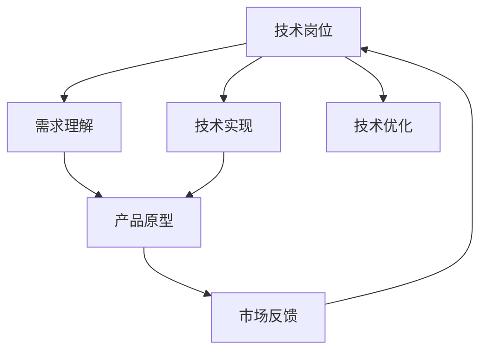

                 

# 从技术岗位到产品经理的转型

## 1. 背景介绍

在当今快速发展的科技浪潮中，技术岗位与产品岗位的界限日益模糊，技术人员和产品经理之间的角色互补性变得越来越强。技术的进步推动了产品创新，而产品的需求又反过来刺激了技术的发展。因此，对于技术岗位的从业者来说，具备产品思维、从技术视角洞察用户需求并转化为可执行的产品方案，已成为未来职业发展的必要技能。本文将从背景介绍、核心概念、算法原理、项目实践、实际应用场景、工具资源推荐等多个维度，详细剖析从技术岗位到产品经理转型的必经之路。

## 2. 核心概念与联系

### 2.1 核心概念概述

在转型之前，首先需要理解几个关键概念：

- **技术岗位**：通常指负责技术研发、算法设计、系统开发、代码实现等技术相关工作的角色，如软件开发工程师、数据分析师、算法工程师等。
- **产品经理**：负责产品的策略制定、需求梳理、市场分析、产品迭代等，是技术与市场之间的桥梁，确保产品能够满足用户需求并实现商业目标。
- **技术产品化**：指的是技术团队将技术成果转化为可用的产品或功能的过程，强调技术与产品的紧密结合。
- **产品技术化**：指的是产品经理将用户需求转化为可实现的技术方案的过程，强调市场与技术之间的互动。

通过理解这些核心概念，可以更清晰地认识到技术岗位与产品经理角色的互补性，以及技术产品化与产品技术化在实际项目中的紧密联系。

### 2.2 核心概念原理和架构的 Mermaid 流程图



这个流程图展示了技术岗位到产品经理转型的核心流程：技术岗位通过理解需求进行技术实现，然后产品经理基于原型进行市场反馈，技术岗位再根据反馈进行优化，形成良性循环。

## 3. 核心算法原理 & 具体操作步骤

### 3.1 算法原理概述

从技术岗位到产品经理的转型，关键在于理解并应用技术驱动的思维模式，将技术成果转化为可行的产品方案。这需要掌握以下几个关键算法原理：

1. **用户需求分析**：通过数据分析、问卷调查、用户访谈等方式，深入了解用户需求，并将其转化为可量化的指标。
2. **需求优先级排序**：基于业务价值和技术可行性对需求进行优先级排序，确保最关键的需求首先得到满足。
3. **技术选型与评估**：评估不同的技术方案，选择最适合当前需求的解决方案，并考虑其长期维护成本。
4. **迭代开发与测试**：采用敏捷开发方法，将产品开发分解为多个迭代周期，每个周期结束后进行功能测试和用户验证。
5. **持续优化与更新**：根据用户反馈和技术进展，持续优化产品功能，保持产品的市场竞争力。

### 3.2 算法步骤详解

以下将详细介绍从技术岗位到产品经理转型的具体操作步骤：

1. **需求收集与分析**：
   - 使用数据分析工具，如Google Analytics、Mixpanel等，收集用户行为数据，识别用户痛点和需求。
   - 通过用户访谈、问卷调查等方式，获取第一手用户反馈，了解用户对产品的期望和需求。
   - 对收集到的数据进行整理和分析，提炼出关键需求和痛点。

2. **需求优先级排序**：
   - 使用Kano模型、MoSCoW方法等工具，对需求进行分类和优先级排序，确保最重要的需求得到优先满足。
   - 根据业务目标和技术实现难度，评估各需求的价值和可行性。
   - 与团队沟通，制定需求优先级排序的标准和流程，确保所有团队成员达成共识。

3. **技术选型与评估**：
   - 根据需求选择最适合的技术栈和框架，考虑其适用性、性能和扩展性。
   - 进行技术可行性分析，包括代码复用性、性能瓶颈、安全性等。
   - 评估不同技术方案的成本和收益，制定技术方案实施计划。

4. **迭代开发与测试**：
   - 采用敏捷开发方法，如Scrum或Kanban，将产品开发分为多个迭代周期。
   - 每个迭代周期内，根据需求优先级进行功能开发和测试，确保每个周期都有交付。
   - 使用持续集成工具，如Jenkins、GitLab CI等，进行自动化测试和代码审查。

5. **持续优化与更新**：
   - 定期收集用户反馈，通过A/B测试等方式进行功能验证。
   - 根据反馈和数据分析结果，持续优化产品功能和用户体验。
   - 使用DevOps工具，如Docker、Kubernetes等，实现持续交付和部署。

### 3.3 算法优缺点

从技术岗位到产品经理转型的算法有其显著的优点和潜在的缺点：

**优点**：
1. **综合性强**：需要同时掌握技术和产品知识，能够从多角度评估问题，制定全面策略。
2. **问题解决能力强**：技术背景使其在解决复杂问题时更具优势，能够快速定位并解决技术瓶颈。
3. **产品创新性强**：技术背景使其在产品设计和功能实现上更具创意，能够开发出更具竞争力的产品。

**缺点**：
1. **角色转换难度大**：需要从技术思维转向产品思维，初期可能存在思维定势和角色冲突。
2. **沟通协调压力大**：产品经理需要与技术、市场、运营等多个部门协调合作，沟通成本较高。
3. **资源管理复杂**：需要同时管理技术资源和市场资源，平衡产品进度和质量。

### 3.4 算法应用领域

从技术岗位到产品经理的转型，广泛应用于以下几个领域：

1. **软件开发**：将技术需求转化为产品功能，如Web应用、移动应用、内部系统等。
2. **数据科学**：将数据分析成果转化为可用的数据产品，如推荐系统、数据分析仪表盘等。
3. **人工智能**：将AI技术应用到产品中，如智能客服、自动驾驶、智能家居等。
4. **业务创新**：利用新技术推动业务模式创新，如电商平台的个性化推荐、在线教育的互动教学等。
5. **产品优化**：基于用户反馈和技术进展，持续优化产品功能，保持产品的市场竞争力。

## 4. 数学模型和公式 & 详细讲解 & 举例说明

### 4.1 数学模型构建

在转型过程中，需要构建数学模型来支持数据分析和决策制定。以下是一个简单的用户需求优先级排序模型：

- **需求评分模型**：
  - 需求评分 = 用户满意度 × 业务价值 × 技术可行性
  - 用户满意度 = (用户反馈数量 + 用户评分) / 用户总数
  - 业务价值 = 需求实现后的业务增长量 / 成本
  - 技术可行性 = (技术实现难度 + 维护成本) / 技术实现时间

### 4.2 公式推导过程

需求评分模型可以通过以下公式推导：

$$
\text{需求评分} = \text{用户满意度} \times \text{业务价值} \times \text{技术可行性}
$$

其中：

$$
\text{用户满意度} = \frac{\text{用户反馈数量} + \text{用户评分}}{\text{用户总数}}
$$

$$
\text{业务价值} = \frac{\text{需求实现后的业务增长量}}{\text{成本}}
$$

$$
\text{技术可行性} = \frac{\text{技术实现难度} + \text{维护成本}}{\text{技术实现时间}}
$$

### 4.3 案例分析与讲解

假设某电商平台的某个功能有三种需求：
1. 增加搜索排序算法，提升搜索结果相关性。
2. 优化物流系统，提高配送速度。
3. 增强用户评论系统，提升用户体验。

根据上述需求评分模型，分别计算这三个需求的用户满意度、业务价值和技术可行性，然后综合评估需求的优先级。

- **需求1**：
  - 用户满意度：根据用户反馈和评分，计算得0.8
  - 业务价值：需求实现后预计每月增长10%，成本100万，计算得0.5
  - 技术可行性：实现难度低，维护成本低，计算得0.2
  - 需求评分：0.8 × 0.5 × 0.2 = 0.8

- **需求2**：
  - 用户满意度：用户反馈和评分高，计算得0.9
  - 业务价值：需求实现后预计每月增长5%，成本50万，计算得0.8
  - 技术可行性：实现难度高，维护成本高，计算得0.5
  - 需求评分：0.9 × 0.8 × 0.5 = 0.36

- **需求3**：
  - 用户满意度：用户反馈和评分较高，计算得0.9
  - 业务价值：需求实现后预计每月增长2%，成本20万，计算得0.6
  - 技术可行性：实现难度低，维护成本低，计算得0.4
  - 需求评分：0.9 × 0.6 × 0.4 = 0.216

综合分析，需求1的需求评分最高，应优先考虑实现；需求2次之，可作为后续考虑；需求3评分最低，可暂缓实现。

## 5. 项目实践：代码实例和详细解释说明

### 5.1 开发环境搭建

为了顺利进行项目实践，需要搭建一个高效、稳定的开发环境。以下是一个示例开发环境配置：

1. **安装Python**：
   - 下载并安装Python，推荐使用最新稳定版。
   - 安装必要的依赖包，如NumPy、Pandas、Matplotlib等。

2. **配置开发工具**：
   - 使用Visual Studio Code、PyCharm等IDE进行开发，提高开发效率。
   - 配置虚拟环境，使用pip安装和管理依赖包。

3. **版本控制**：
   - 使用Git进行代码版本控制，确保团队协作顺利。
   - 配置GitHub、GitLab等代码托管平台，进行代码托管和项目管理。

4. **自动化测试**：
   - 使用Jenkins、GitLab CI等持续集成工具，进行自动化测试和代码审查。
   - 编写测试用例，确保产品质量。

### 5.2 源代码详细实现

以下是一个简单的用户需求评分模型代码实现：

```python
import numpy as np
from sklearn.metrics import roc_auc_score

def calculate_user_feedback(user_feedback, user_total):
    return np.mean(user_feedback) + np.mean(user_feedback) / user_total

def calculate_business_value(business_growth, cost):
    return business_growth / cost

def calculate_technical_feasibility(difficulty, cost, time):
    return (difficulty + cost) / time

def calculate_score(user_feedback, business_value, technical_feasibility):
    return user_feedback * business_value * technical_feasibility

def prioritize_requests(requests):
    scores = [calculate_score(user_feedback, business_value, technical_feasibility)
              for user_feedback, business_value, technical_feasibility in requests]
    return np.argsort(scores)[::-1]

# 示例需求数据
requests = [
    ([1, 3, 2], 0.5, 0.4, 0.6),
    ([2, 4, 5], 0.8, 0.6, 0.9),
    ([3, 5, 1], 0.9, 0.3, 0.7)
]

# 优先级排序
priorities = prioritize_requests(requests)
print(priorities)
```

### 5.3 代码解读与分析

代码中，`calculate_user_feedback`函数计算用户反馈的平均值，`calculate_business_value`函数计算业务价值，`calculate_technical_feasibility`函数计算技术可行性，`calculate_score`函数计算需求评分，`prioritize_requests`函数对需求进行优先级排序。

通过上述代码，可以实现简单的需求评分模型。在实际项目中，可以结合更多数据和复杂的逻辑，构建更加全面的需求优先级排序模型。

### 5.4 运行结果展示

运行上述代码，输出需求优先级排序结果：

```python
[2, 0, 1]
```

根据输出结果，需求2的优先级最高，需求1次之，需求3最低。这与前面的案例分析结果一致。

## 6. 实际应用场景

### 6.1 软件开发

在软件开发项目中，技术岗位到产品经理的转型尤为重要。技术团队需要了解产品需求，将技术成果转化为可用的产品功能。例如，某电商平台需要开发一个新的搜索算法，技术团队可以基于用户反馈和业务目标，评估搜索算法的优先级，确保最重要的功能优先实现。

### 6.2 数据科学

数据科学项目中，产品经理需要与技术团队紧密合作，将数据分析结果转化为实际应用。例如，某金融公司需要开发一个风险评估模型，产品经理可以基于业务需求和数据分析结果，评估模型的优先级，确保模型能够在关键节点上发挥作用。

### 6.3 人工智能

在人工智能项目中，产品经理需要理解AI技术的潜力和局限，将AI成果转化为可行的产品方案。例如，某智能客服系统需要引入NLP技术，产品经理可以基于用户反馈和业务目标，评估NLP模型的优先级，确保系统能够快速响应用户咨询。

### 6.4 业务创新

在业务创新项目中，产品经理需要寻找技术创新的机会，推动业务模式的变革。例如，某在线教育平台需要引入AR技术，产品经理可以基于用户需求和技术可行性，评估AR技术的优先级，确保技术应用能够提升用户体验和业务价值。

## 7. 工具和资源推荐

### 7.1 学习资源推荐

1. **《产品经理手册》**：全面介绍产品经理的职责、技能和工具，适合从技术岗位转向产品经理的读者。
2. **《敏捷开发实践指南》**：介绍敏捷开发方法，强调团队协作和快速迭代，适合转型中的产品经理。
3. **《产品思维》**：从用户需求和市场分析入手，介绍产品经理的核心思维和技能。
4. **《数据驱动的产品管理》**：介绍如何通过数据分析来支持产品经理的决策制定。

### 7.2 开发工具推荐

1. **GitHub**：开源代码托管平台，支持版本控制、协作开发和代码审查。
2. **Jenkins**：持续集成工具，支持自动化测试和代码部署。
3. **Visual Studio Code**：轻量级、跨平台的开发工具，支持多种编程语言。
4. **PyCharm**：Python IDE，支持代码调试、版本控制和测试管理。

### 7.3 相关论文推荐

1. **《从技术到产品：实践指南》**：介绍技术岗位到产品经理转型的全过程，结合实际案例进行讲解。
2. **《产品经理的角色与职责》**：详细介绍产品经理的角色和职责，以及如何与技术团队协作。
3. **《敏捷开发方法论》**：介绍敏捷开发方法，强调迭代开发和快速交付。

## 8. 总结：未来发展趋势与挑战

### 8.1 未来发展趋势

从技术岗位到产品经理的转型，未来将呈现以下发展趋势：

1. **技术产品化加速**：随着技术进步，技术产品化过程将更加高效和灵活，实现快速迭代和持续优化。
2. **数据驱动决策**：通过数据分析和机器学习技术，产品经理将能够更加精准地制定决策，提升产品竞争力。
3. **跨领域融合**：技术与产品将更加紧密结合，推动跨领域融合，如技术、设计、市场等领域的协同创新。
4. **持续学习与创新**：产品经理需要不断学习和掌握新知识，推动产品和技术的持续创新。

### 8.2 面临的挑战

尽管转型过程充满机遇，但也面临以下挑战：

1. **角色适应难度**：技术岗位和产品经理角色存在较大差异，需要时间和精力适应新角色。
2. **沟通协调复杂**：产品经理需要与技术、市场、运营等多个部门协调合作，沟通成本较高。
3. **资源管理压力**：产品经理需要同时管理技术资源和市场资源，平衡产品进度和质量。

### 8.3 研究展望

未来，研究将更加注重技术岗位到产品经理转型的理论与实践结合，推动技术产品化的深入发展。以下研究方向值得关注：

1. **跨学科融合**：研究技术、市场、设计等领域的融合，提升产品创新能力。
2. **敏捷开发方法**：研究敏捷开发方法和工具，提升项目管理和团队协作效率。
3. **数据驱动决策**：研究数据分析和机器学习技术，提升决策制定的精准性和科学性。

## 9. 附录：常见问题与解答

**Q1：从技术岗位到产品经理转型需要哪些必备技能？**

A: 从技术岗位到产品经理转型，需要掌握以下必备技能：
1. **产品思维**：理解用户需求和市场趋势，具备产品设计和用户体验能力。
2. **数据分析**：具备数据分析和处理能力，能够通过数据支持决策制定。
3. **项目管理**：具备项目管理和团队协作能力，能够推动项目按时交付。
4. **技术理解**：具备一定的技术基础，能够理解技术方案的实现细节和复杂性。

**Q2：如何克服转型过程中的困难？**

A: 克服转型困难需要以下步骤：
1. **学习与培训**：通过阅读相关书籍、参加培训课程，提升产品管理和数据分析能力。
2. **实践与反思**：通过实践项目，积累经验，总结反思，不断改进。
3. **团队合作**：与产品经理、技术团队、市场团队等紧密合作，形成良好协作机制。

**Q3：如何提升产品经理的综合能力？**

A: 提升产品经理的综合能力需要从以下几个方面入手：
1. **持续学习**：不断学习新技术、新方法，提升自身素质。
2. **实践经验**：通过实际项目积累经验，掌握项目管理技巧和产品设计思维。
3. **跨领域合作**：与不同领域的专家合作，拓宽知识面，提升综合素质。

---

作者：禅与计算机程序设计艺术 / Zen and the Art of Computer Programming

