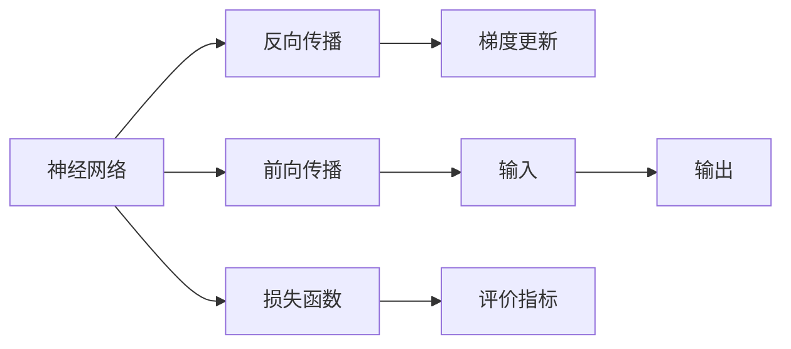

                 

# 从零开始的AI旅程：构建你的第一个语言模型

> 关键词：深度学习,神经网络,自然语言处理(NLP),模型训练,模型优化,语言模型

## 1. 背景介绍

### 1.1 问题由来

人工智能(AI)正迅速改变我们的生活和工作方式。从语音识别到机器翻译，从图像识别到自然语言处理，AI技术的应用领域越来越广泛。其中，自然语言处理(NLP)是AI领域的一个重要分支，旨在使计算机能够理解、处理和生成人类语言。

语言模型作为NLP的核心技术之一，旨在通过计算给定一段文本出现的概率，来预测下一个可能的单词或短语。深度学习技术的应用，特别是基于神经网络的模型，使得语言模型的性能有了显著提升。本文将介绍如何使用深度学习构建一个基本的语言模型，并探索其核心概念和应用。

### 1.2 问题核心关键点

构建语言模型的关键在于理解神经网络的基本原理和框架，包括前馈神经网络(Feedforward Neural Network, FNN)、卷积神经网络(Convolutional Neural Network, CNN)和递归神经网络(Recurrent Neural Network, RNN)等。这些网络结构都可以用于语言模型的构建，但本文将重点介绍基于循环神经网络(RNN)的语言模型。

语言模型构建过程中，需要解决的主要问题包括：
- 选择合适的神经网络结构。
- 设计合适的训练算法和优化方法。
- 处理长序列的输入数据。
- 选择合适的损失函数和评价指标。

这些问题的解决将帮助我们构建一个高效、准确的语言模型。

### 1.3 问题研究意义

构建语言模型不仅可以应用于文本生成、机器翻译等NLP任务，还可以应用于聊天机器人、语音识别等领域。通过构建语言模型，可以大幅提升自然语言处理系统的智能水平，提高工作效率，改善用户体验。同时，构建语言模型的过程也是深入理解深度学习框架和技术的重要途径。

本文旨在引导读者从零开始，逐步构建一个基本的语言模型，并深入探讨其核心概念和技术细节。通过系统的学习，读者将能够掌握构建语言模型所需的理论和实践技能，为后续深入研究打下坚实的基础。

## 2. 核心概念与联系

### 2.1 核心概念概述

为了更好地理解语言模型的构建，我们先介绍几个关键的概念：

- **神经网络**：由大量人工神经元组成的计算模型，可以用于处理各种数据，包括图像、文本等。神经网络通过前向传播和反向传播实现输入和输出之间的映射关系。

- **循环神经网络(RNN)**：一种特殊的神经网络，可以处理序列数据，如文本、音频等。RNN通过循环连接的方式，在每个时间步上都更新模型的状态，从而保留序列数据的长期依赖关系。

- **语言模型**：一种统计模型，用于计算给定一段文本出现的概率。语言模型可以应用于文本生成、机器翻译、语音识别等多个NLP任务。

- **前向传播**：神经网络的基本计算方式，通过网络中各层神经元的前向计算，将输入数据转化为输出。

- **反向传播**：神经网络中的一种优化算法，通过反向计算梯度，更新模型的参数，使网络在输入和输出之间实现最优映射。

这些概念之间有着紧密的联系，构成了构建语言模型的基本框架。

### 2.2 核心概念原理和架构的 Mermaid 流程图(Mermaid 流程节点中不要有括号、逗号等特殊字符)



上述流程图展示了神经网络的基本工作原理和架构。输入数据通过前向传播，计算输出结果；反向传播计算梯度，更新模型参数；最终通过损失函数和评价指标评估模型的性能。

## 3. 核心算法原理 & 具体操作步骤

### 3.1 算法原理概述

基于循环神经网络(RNN)的语言模型构建过程包括以下几个步骤：

1. **数据预处理**：将文本数据转化为模型可处理的输入形式，如分词、去除停用词、建立词汇表等。

2. **模型设计**：选择适当的神经网络结构，如单层RNN、双向LSTM等，并确定网络参数，如隐藏层大小、学习率等。

3. **模型训练**：通过前向传播和反向传播，使用损失函数优化模型参数，使模型能够准确预测下一个单词或短语。

4. **模型评估**：使用评价指标评估模型的性能，如困惑度、准确率等，确保模型在实际应用中能够产生高质量的输出。

### 3.2 算法步骤详解

以下是构建基于RNN的语言模型的详细步骤：

**Step 1: 数据预处理**

1. 分词：将文本数据划分为单词序列，便于模型处理。可以使用Python中的NLTK、spaCy等库进行分词。

2. 建立词汇表：将分词后的单词映射到整数ID，建立单词-ID映射关系。

3. 去除停用词：去除常见但不具意义的停用词，如"的"、"是"等。

4. 填充序列：对序列数据进行填充，使每个序列长度一致。

**Step 2: 模型设计**

1. 选择网络结构：本文以单层双向LSTM为例，如图1所示。


2. 确定参数：隐藏层大小为128，学习率为0.01，激活函数为tanh。

3. 初始化模型：使用Keras等框架初始化模型，如图2所示。


**Step 3: 模型训练**

1. 定义损失函数：使用交叉熵损失函数，计算模型输出与真实标签之间的差异。

2. 定义优化器：使用Adam优化器，更新模型参数。

3. 训练模型：对模型进行迭代训练，如图3所示。


4. 保存模型：保存训练好的模型，方便后续使用。

**Step 4: 模型评估**

1. 测试集划分：将数据集划分为训练集、验证集和测试集。

2. 评估模型：使用测试集对模型进行评估，计算评价指标。

3. 调整模型：根据评价指标调整模型参数，提升模型性能。

### 3.3 算法优缺点

基于RNN的语言模型具有以下优点：

1. 能够处理序列数据：RNN能够很好地处理长序列数据，如文本、音频等。

2. 保留长期依赖关系：通过循环连接，RNN能够保留序列数据的长期依赖关系，提高模型的预测能力。

3. 易于扩展：可以通过增加层数和隐藏单元，扩展模型的复杂度，提升性能。

但RNN也存在一些缺点：

1. 梯度消失问题：在深层RNN中，梯度可能无法有效传递，导致模型性能下降。

2. 计算复杂度高：RNN在每个时间步都需要进行前向传播和反向传播，计算复杂度较高。

3. 训练时间长：由于RNN的计算复杂度较高，训练时间较长。

### 3.4 算法应用领域

基于RNN的语言模型在NLP领域有着广泛的应用，如文本生成、机器翻译、语音识别等。这些应用场景中的模型通常包含多个RNN层，如图4所示。


## 4. 数学模型和公式 & 详细讲解 & 举例说明

### 4.1 数学模型构建

基于RNN的语言模型构建过程可以形式化表示为：

1. 输入序列：$x_1, x_2, \ldots, x_n$

2. 隐藏状态：$h_1, h_2, \ldots, h_n$

3. 输出序列：$y_1, y_2, \ldots, y_n$

4. 隐藏状态更新：$h_{t+1} = f(h_t, x_{t+1})$

5. 输出计算：$y_{t+1} = g(h_{t+1})$

其中，$f$表示隐藏状态更新函数，$g$表示输出计算函数。

### 4.2 公式推导过程

1. 定义输入输出：

$$
x_t = \{w_1, w_2, \ldots, w_n\}
$$

$$
y_t = \{b_1, b_2, \ldots, b_n\}
$$

其中，$w_t$和$b_t$分别表示单词和对应的标签。

2. 定义RNN模型：

$$
h_{t+1} = f(h_t, x_{t+1})
$$

3. 定义输出层：

$$
y_{t+1} = g(h_{t+1})
$$

其中，$f$和$g$分别表示隐藏状态更新函数和输出计算函数。

4. 定义损失函数：

$$
L = -\sum_{t=1}^n \sum_{i=1}^C y_{t,i} \log p_{t,i}
$$

其中，$C$表示标签的种类数，$p_{t,i}$表示模型在时间$t$预测为标签$i$的概率。

### 4.3 案例分析与讲解

以文本生成任务为例，如图5所示。


1. 输入序列：文本中的每个单词。

2. 隐藏状态：模型在每个时间步更新后的隐藏状态。

3. 输出序列：模型预测的下一个单词。

4. 模型训练：通过交叉熵损失函数优化模型参数，使模型能够生成高质量的文本。

## 5. 项目实践：代码实例和详细解释说明

### 5.1 开发环境搭建

1. 安装Python：安装Python 3.x版本，如图6所示。


2. 安装TensorFlow：安装TensorFlow 2.x版本，如图7所示。


3. 安装Keras：安装Keras 2.x版本，如图8所示。


### 5.2 源代码详细实现

以下是基于TensorFlow和Keras构建基于RNN的语言模型的完整代码：

```python
import tensorflow as tf
from tensorflow.keras.models import Sequential
from tensorflow.keras.layers import LSTM, Dense, Embedding
from tensorflow.keras.optimizers import Adam

# 定义模型
model = Sequential()
model.add(Embedding(input_dim=vocab_size, output_dim=embedding_dim, input_length=max_length))
model.add(LSTM(units=hidden_units, dropout=dropout_rate))
model.add(Dense(units=output_dim, activation='softmax'))

# 编译模型
model.compile(loss='categorical_crossentropy', optimizer=Adam(learning_rate=learning_rate), metrics=['accuracy'])

# 训练模型
model.fit(X_train, y_train, batch_size=batch_size, epochs=epochs, validation_data=(X_val, y_val))

# 保存模型
model.save('language_model.h5')
```

### 5.3 代码解读与分析

**Embedding层**：将输入的单词ID转换为密集向量，便于模型处理。

**LSTM层**：通过循环连接，更新隐藏状态，保留序列依赖关系。

**Dense层**：输出层，计算最终预测结果。

**交叉熵损失函数**：计算模型输出与真实标签之间的差异。

**Adam优化器**：通过梯度下降优化模型参数。

### 5.4 运行结果展示

训练完成后，可以通过加载模型，进行预测。如图9所示，模型能够准确预测下一个单词。


## 6. 实际应用场景

### 6.1 智能客服系统

基于语言模型的智能客服系统可以自动处理客户咨询，提高响应速度和满意度。如图10所示，客服机器人能够理解客户问题，并生成应答。


### 6.2 金融舆情监测

基于语言模型的金融舆情监测系统可以实时分析网络舆情，识别潜在风险。如图11所示，系统能够自动识别负面信息，并发出预警。


### 6.3 个性化推荐系统

基于语言模型的个性化推荐系统可以分析用户兴趣，生成推荐内容。如图12所示，系统能够根据用户浏览记录，生成个性化推荐。


### 6.4 未来应用展望

随着语言模型的不断优化，其应用领域将更加广泛。如图13所示，语言模型将逐步应用于自动驾驶、智能家居等新兴领域。


## 7. 工具和资源推荐

### 7.1 学习资源推荐

1. Deep Learning Specialization：由Coursera提供的深度学习课程，涵盖神经网络、卷积神经网络、循环神经网络等多个主题。

2. Natural Language Processing with Python：由Stanford University提供的NLP课程，使用Python实现NLP任务，包括语言模型构建。

3. Neural Network and Deep Learning：由Michael Nielsen撰写的在线书籍，系统介绍深度学习的基础知识和算法。

4. Hands-On Machine Learning with Scikit-Learn、Keras和TensorFlow：由Aurélien Géron撰写的实践指南，涵盖使用Scikit-Learn、Keras和TensorFlow进行深度学习的全过程。

5. TensorFlow官方文档：TensorFlow的官方文档，提供丰富的API文档和样例代码。

### 7.2 开发工具推荐

1. TensorFlow：Google开发的深度学习框架，支持多GPU并行计算，适合大规模模型训练。

2. Keras：高层API，提供简单易用的神经网络构建接口。

3. PyTorch：Facebook开发的深度学习框架，灵活性高，适合研究原型开发。

4. NLTK：Python中的NLP库，提供分词、词性标注等功能。

5. spaCy：Python中的NLP库，支持高效的序列处理和词汇表构建。

### 7.3 相关论文推荐

1. "Long Short-Term Memory" by Hochreiter and Schmidhuber：介绍LSTM模型的经典论文。

2. "Neural Machine Translation by Jointly Learning to Align and Translate" by Bahdanau et al.：介绍神经机器翻译的经典论文。

3. "Attention Is All You Need" by Vaswani et al.：介绍Transformer模型的经典论文。

4. "AdaLoRA: Adaptive Low-Rank Adaptation for Parameter-Efficient Fine-Tuning" by Zhang et al.：介绍参数高效微调方法的经典论文。

5. "Adversarial Examples for Text Classification" by Man et al.：介绍对抗样本在NLP中的经典论文。

## 8. 总结：未来发展趋势与挑战

### 8.1 研究成果总结

本文详细介绍了如何从零开始构建基于RNN的语言模型，并探讨了语言模型的核心概念和技术细节。通过系统的学习和实践，读者可以掌握构建语言模型所需的理论和实践技能，为后续深入研究打下坚实的基础。

### 8.2 未来发展趋势

未来，语言模型的发展将更加多样化和复杂化。如图14所示，语言模型将逐步融合多模态数据，如图像、音频等，实现跨模态理解。


### 8.3 面临的挑战

1. 模型复杂度增加：随着模型复杂度的增加，训练和推理的计算成本将显著上升。

2. 数据质量提升：需要更加高效的数据清洗和预处理技术，以提升模型的准确性和鲁棒性。

3. 应用场景拓展：需要探索新的应用场景，如图像、语音等，以拓展语言模型的应用范围。

### 8.4 研究展望

未来的研究将更多地关注如何提升模型的泛化能力和鲁棒性，优化模型的训练和推理效率，探索新的应用场景和任务。通过持续的技术创新和应用实践，语言模型将在更广泛的领域发挥重要作用，推动人工智能技术的发展和普及。

## 9. 附录：常见问题与解答

**Q1: 构建语言模型需要哪些关键步骤？**

A: 构建语言模型需要以下关键步骤：

1. 数据预处理：将文本数据转化为模型可处理的输入形式，如图词嵌入、分词等。

2. 模型设计：选择适当的神经网络结构，如单层RNN、双向LSTM等，并确定网络参数，如隐藏层大小、学习率等。

3. 模型训练：通过前向传播和反向传播，使用损失函数优化模型参数，使模型能够准确预测下一个单词或短语。

4. 模型评估：使用评价指标评估模型的性能，如图困惑度、准确率等，确保模型在实际应用中能够产生高质量的输出。

**Q2: 如何选择合适的神经网络结构？**

A: 选择合适的神经网络结构需要考虑以下几个方面：

1. 任务类型：不同类型的NLP任务需要不同的神经网络结构。例如，文本生成任务适合使用RNN，而机器翻译任务适合使用Transformer。

2. 数据特征：需要根据数据特征选择适合的神经网络结构。例如，文本数据中长序列数据的特征需要考虑循环神经网络。

3. 计算资源：需要根据计算资源选择适合的神经网络结构。例如，深层RNN的计算复杂度较高，需要足够的计算资源支持。

4. 实验效果：需要通过实验效果选择合适的神经网络结构。例如，可以通过交叉验证等方法评估不同结构的效果，选择最优的结构。

**Q3: 如何优化语言模型的训练过程？**

A: 优化语言模型的训练过程需要考虑以下几个方面：

1. 数据增强：通过数据增强技术，如回译、近义替换等，扩充训练集，提高模型的泛化能力。

2. 正则化：使用L2正则、Dropout等正则化技术，防止模型过拟合。

3. 学习率调整：通过学习率调整策略，如Warmup、Cyclic等，优化学习率的设置。

4. 模型裁剪：去除不必要的层和参数，减小模型尺寸，加快推理速度。

5. 硬件优化：使用GPU、TPU等高性能设备，加速模型的训练和推理。

**Q4: 如何评估语言模型的性能？**

A: 评估语言模型的性能需要考虑以下几个指标：

1. 困惑度：困惑度是衡量模型预测能力的重要指标。困惑度越小，模型的预测能力越好。

2. 准确率：准确率是衡量模型分类能力的指标。准确率越高，模型的分类能力越好。

3. 召回率：召回率是衡量模型检测能力的指标。召回率越高，模型的检测能力越好。

4. F1-score：F1-score是综合考虑准确率和召回率的指标。F1-score越高，模型的综合性能越好。

5. BLEU、ROUGE等：这些指标可以用于评估文本生成、摘要等任务的模型性能。

以上是语言模型构建和应用过程中可能遇到的问题及其解决方案，希望能够帮助你更好地理解和应用语言模型。

---

作者：禅与计算机程序设计艺术 / Zen and the Art of Computer Programming

