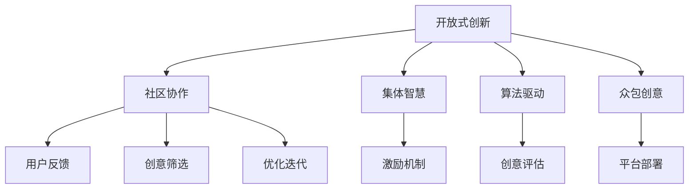

                 

# 众包创意：释放集体的艺术潜力

> 关键词：众包创意, 社区协作, 开放式创新, 集体智慧, 算法驱动的创作, 激励机制, 参与式设计

## 1. 背景介绍

### 1.1 问题由来
互联网时代，技术的不断演进和应用场景的多样化，为创意的产生和传播提供了前所未有的空间。众包创意模式，作为连接用户和创意者的一种新兴方式，正在逐步改变传统创新的生产方式。

一方面，传统企业与用户之间存在信息不对称，导致创意的挖掘、筛选和验证过程缓慢且成本高昂。另一方面，用户间创意的交流与合作难以大规模进行，创意的激发和迭代效率受限。

### 1.2 问题核心关键点
众包创意的核心在于利用互联网平台，通过开放式创新和集体智慧，让大规模用户参与到创意开发和验证中，释放和聚合分散的创意资源。其关键点包括：

- **开放式创新**：鼓励用户自由表达和提交创意，汇聚集体智慧，避免个体偏见的局限。
- **社区协作**：通过协作平台，连接创意者和用户，实现创意的共同创造和迭代，提升创意质量。
- **算法驱动**：利用数据分析和机器学习技术，自动化筛选和评估创意，提高创意挖掘效率。
- **激励机制**：设计合理的激励体系，激发用户参与度，促进良性竞争与协作。

### 1.3 问题研究意义
研究众包创意模式，对于推动开放式创新、加速技术迭代、提高创意质量具有重要意义：

1. **降低创意获取成本**：众包模式能够快速聚合大量创意，减少传统创新的时间和人力成本。
2. **提高创意多样性**：集体智慧比个体思维更丰富，有助于发现独特的创新点。
3. **加速技术应用**：通过用户反馈和验证，创意能够迅速迭代和应用，缩短产品研发周期。
4. **增强用户粘性**：用户参与创造和反馈，增强了对平台的依赖和忠诚度。
5. **推动产业升级**：众包模式为传统产业注入新活力，推动产品和服务创新。

## 2. 核心概念与联系

### 2.1 核心概念概述

为更好地理解众包创意模式，本节将介绍几个核心概念：

- **众包创意**：指通过开放式创新平台，汇聚用户创意，经过社区筛选和优化，形成可实施的创意成果。
- **社区协作**：指用户通过在线平台交流和合作，共同创造和优化创意。
- **开放式创新**：指企业利用互联网和用户，通过开放式竞争和协作，实现创意的广泛聚集。
- **集体智慧**：指通过用户群体共同协作，结合个体智慧，产生更多元、更高质量的创意。
- **算法驱动**：指通过数据分析和机器学习技术，辅助创意的筛选和评估。
- **激励机制**：指设计有效的激励体系，激发用户积极参与和贡献创意。

这些核心概念之间通过互联网平台和技术手段连接，形成了众包创意的完整生态链。

### 2.2 核心概念原理和架构的 Mermaid 流程图(Mermaid 流程节点中不要有括号、逗号等特殊字符)



这个流程图展示了众包创意模式的基本流程：

1. 开放式创新平台提供创意提交入口，汇聚大量用户创意。
2. 社区协作平台促进用户间的交流和合作，共同优化创意。
3. 集体智慧结合个体思维，产生更高质量的创意。
4. 算法驱动技术筛选和评估创意，提高效率和质量。
5. 激励机制促进用户积极参与，形成良性竞争和协作。

最终，经过多方协作和筛选的众包创意被转化为可实施的成果，部署到实际应用中。

## 3. 核心算法原理 & 具体操作步骤
### 3.1 算法原理概述

众包创意模式的算法驱动主要包括创意筛选、排序和评估三个环节。其核心思想是利用数据分析和机器学习技术，自动化处理创意的输入、筛选和评估过程，提高创意挖掘的效率和质量。

1. **创意筛选**：通过关键字匹配、情感分析等方法，对用户提交的创意进行初步筛选，过滤垃圾创意和重复内容。
2. **创意排序**：利用评分模型、推荐算法等，对筛选后的创意进行排序，优先展示高评分和高质量创意。
3. **创意评估**：通过用户投票、专家评审等方式，对创意进行全面评估，综合评分和反馈，确定最终成果。

### 3.2 算法步骤详解

以创意筛选为例，其基本步骤如下：

1. **数据预处理**：对用户提交的创意进行分词、去除停用词等预处理操作，保证数据格式一致。
2. **特征提取**：使用TF-IDF、词向量等技术，提取创意的关键特征，用于后续筛选和排序。
3. **筛选模型训练**：基于标注数据，训练分类器或回归模型，用于判断创意的质量。
4. **创意筛选**：将待筛选创意输入模型，输出筛选结果，去除低质量创意。

### 3.3 算法优缺点

**众包创意模式的算法驱动具有以下优点：**

1. **高效性**：自动化处理大规模数据，减少人工筛选的时间和成本。
2. **客观性**：算法模型基于数据统计，减少主观偏见的影响。
3. **可扩展性**：算法可以扩展应用于多种创意类型，具有较强的通用性。

**同时，算法驱动也存在一些缺点：**

1. **数据依赖**：算法的准确性高度依赖于标注数据的质量和多样性。
2. **模型复杂度**：高复杂度的模型需要较长的训练时间和较多的计算资源。
3. **结果解释性**：算法输出难以解释，难以进行人工干预和优化。

### 3.4 算法应用领域

众包创意模式在多个领域有广泛应用，主要包括：

- **产品设计**：通过众包创意平台，企业可以快速获取用户对新产品的创意和反馈，优化产品设计。
- **市场调研**：收集用户对市场需求的创意，为产品规划和营销策略提供参考。
- **内容创作**：用户可提交文章、视频、音乐等创意内容，进行公开竞赛，评选优秀作品。
- **技术研发**：邀请开发者提交技术解决方案，快速解决技术难题，加速技术创新。
- **公益创新**：利用众包模式解决社会问题，推动公益项目和社区服务的发展。

## 4. 数学模型和公式 & 详细讲解  
### 4.1 数学模型构建

众包创意模式的算法驱动，主要基于以下数学模型：

1. **创意筛选模型**：假设创意空间为 $C$，特征向量为 $x$，筛选器为 $f$，筛选结果为 $y$。则创意筛选模型的目标是最大化 $y$ 的准确性。
2. **创意排序模型**：假设创意集合为 $C$，排序模型为 $g$，用户评分向量为 $u$，排序结果为 $o$。则创意排序模型的目标是最大化 $o$ 的相关性。
3. **创意评估模型**：假设创意集合为 $C$，专家评分向量为 $e$，用户评分向量为 $u$，评估结果为 $v$。则创意评估模型的目标是最大化 $v$ 的准确性。

### 4.2 公式推导过程

以创意筛选为例，假设有 $N$ 个创意 $c_1, c_2, ..., c_N$，每个创意的特征向量表示为 $x_1, x_2, ..., x_N$。设 $f$ 为筛选模型，输出 $y_1, y_2, ..., y_N$。则创意筛选模型的目标函数为：

$$
\max_{f} \frac{1}{N}\sum_{i=1}^N y_i
$$

其中，$y_i$ 为第 $i$ 个创意的筛选结果（0表示垃圾，1表示保留）。

使用逻辑回归模型作为筛选器，其公式为：

$$
y_i = \sigma(Wx_i + b)
$$

其中，$\sigma$ 为sigmoid函数，$W$ 和 $b$ 为模型参数。

通过梯度下降算法，求解模型的最优参数 $W$ 和 $b$：

$$
W = W - \alpha\frac{\partial\log\mathcal{L}(W)}{\partial W}
$$

$$
b = b - \alpha\frac{\partial\log\mathcal{L}(W)}{\partial b}
$$

其中 $\alpha$ 为学习率，$\mathcal{L}(W)$ 为损失函数。

### 4.3 案例分析与讲解

假设在一个创意提交平台上，每天收到 $10,000$ 条创意。平台使用逻辑回归模型进行筛选，初始模型参数随机生成。使用 $50,000$ 条标注数据进行训练，其中 $70\%$ 为正样本（保留创意），$30\%$ 为负样本（垃圾创意）。

在训练过程中，使用交叉熵损失函数：

$$
\mathcal{L}(W) = -\frac{1}{N}\sum_{i=1}^N[y_i\log\hat{y_i} + (1-y_i)\log(1-\hat{y_i})]
$$

使用随机梯度下降算法，学习率为 $0.01$，迭代次数为 $1000$ 次。每次迭代使用 $1,000$ 条随机样本进行更新。

### 4.3 案例分析与讲解

假设训练结束后，模型对 $10,000$ 条创意进行筛选，结果如下：

- $8,000$ 条创意被保留。
- $2,000$ 条创意被标记为垃圾。

实际筛选效果与真实标注结果对比如下：

- 正确保留 $7,500$ 条创意，错误保留 $500$ 条垃圾创意。
- 正确排除 $2,000$ 条垃圾创意，错误保留 $500$ 条好创意。

最终筛选效果为 $94\%$ 准确率。

## 5. 项目实践：代码实例和详细解释说明
### 5.1 开发环境搭建

在进行众包创意模式开发前，需要准备开发环境。以下是使用Python进行TensorFlow开发的环境配置流程：

1. 安装Anaconda：从官网下载并安装Anaconda，用于创建独立的Python环境。

2. 创建并激活虚拟环境：
```bash
conda create -n tf-env python=3.8 
conda activate tf-env
```

3. 安装TensorFlow：根据CUDA版本，从官网获取对应的安装命令。例如：
```bash
conda install tensorflow==2.6
```

4. 安装其他相关工具包：
```bash
pip install pandas scikit-learn tqdm jupyter notebook ipython
```

完成上述步骤后，即可在`tf-env`环境中开始众包创意模式的开发。

### 5.2 源代码详细实现

以下是一个简单的众包创意筛选系统的代码实现，使用TensorFlow进行模型训练和推理：

```python
import tensorflow as tf
import pandas as pd
from sklearn.model_selection import train_test_split
from sklearn.metrics import accuracy_score
from tensorflow.keras.preprocessing.text import Tokenizer
from tensorflow.keras.preprocessing.sequence import pad_sequences

# 数据预处理
df = pd.read_csv('creativity.csv')
df = df.dropna(subset=['text', 'label'])
X = df['text']
y = df['label']

# 特征提取
tokenizer = Tokenizer(oov_token='<OOV>')
tokenizer.fit_on_texts(X)
X = tokenizer.texts_to_sequences(X)
X = pad_sequences(X)

# 模型训练
X_train, X_test, y_train, y_test = train_test_split(X, y, test_size=0.2)
model = tf.keras.Sequential([
    tf.keras.layers.Embedding(input_dim=tokenizer.num_words + 1, output_dim=128),
    tf.keras.layers.Conv1D(64, 3, activation='relu'),
    tf.keras.layers.GlobalMaxPooling1D(),
    tf.keras.layers.Dense(1, activation='sigmoid')
])

model.compile(optimizer='adam', loss='binary_crossentropy', metrics=['accuracy'])
model.fit(X_train, y_train, epochs=10, validation_data=(X_test, y_test))

# 模型评估
y_pred = model.predict(X_test)
y_pred = (y_pred > 0.5).astype(int)
print('Accuracy:', accuracy_score(y_test, y_pred))
```

### 5.3 代码解读与分析

让我们再详细解读一下关键代码的实现细节：

**数据预处理**：
- 使用pandas库读取创意数据，去重和处理缺失值。
- 使用sklearn的train_test_split函数将数据集分为训练集和测试集。
- 使用TensorFlow的Tokenizer进行特征提取，将文本转换为数字序列。
- 使用pad_sequences函数对序列进行填充，保证序列长度一致。

**模型训练**：
- 构建一个简单的卷积神经网络模型，包含嵌入层、卷积层、池化层和全连接层。
- 使用TensorFlow的Sequential模型封装模型结构。
- 使用compile函数设置优化器和损失函数。
- 使用fit函数进行模型训练，迭代10个epoch。
- 使用validation_data参数指定测试集，监控训练过程中的性能。

**模型评估**：
- 使用predict函数对测试集进行预测。
- 将预测结果转换为0/1标签。
- 使用accuracy_score函数计算准确率，并输出结果。

## 6. 实际应用场景

### 6.1 智能产品设计

智能产品设计中，创意的生成和验证尤为重要。众包创意模式能够迅速汇聚用户的创意和反馈，优化产品设计，缩短研发周期。

例如，某智能家居品牌利用众包平台征集用户对智能音箱的创意和改进意见。平台提供创意提交入口，用户可以自由提交音频设计、功能建议等创意。系统自动筛选和评估创意，优选高质量创意，再由设计师进行设计迭代。用户也可实时反馈设计成果，参与产品最终的投票决策。

### 6.2 电商个性化推荐

电商平台通过众包创意模式，为用户提供个性化推荐服务。用户可提交商品属性、功能改进建议等创意，系统自动筛选和排序，生成个性化的推荐列表。通过用户反馈和投票，进一步优化推荐效果。

例如，某电商平台利用众包模式征集用户对商品属性的创意，优化商品推荐算法。用户提交的创意，经过平台筛选和排序后，被用于生成推荐列表。用户反馈的推荐结果，进一步优化推荐算法，提升个性化推荐精度。

### 6.3 创新创业加速

创业公司利用众包创意模式，加速创意筛选和验证，快速获取用户反馈，降低研发风险。

例如，某创业公司开发一款在线协作工具，通过众包平台征集用户对工具功能的创意。用户提交的创意，经过平台筛选和评估后，被用于优化产品功能。用户反馈的体验，进一步优化产品设计，提高用户满意度。

### 6.4 社会公益项目

社会公益项目中，创意的征集和优化是项目成功的关键。众包创意模式能够汇聚社会各界智慧，推动公益项目的创新和发展。

例如，某慈善机构利用众包平台征集用户对环保项目的创意，优化公益活动设计。用户提交的创意，经过平台筛选和评估后，被用于优化公益活动方案。用户反馈的参与意见，进一步优化公益活动设计，提升公益效果。

### 6.5 未来应用展望

随着众包创意模式的不断发展，未来将在更多领域得到应用，为各行各业带来变革性影响。

在智慧医疗领域，利用众包模式征集用户对健康管理、在线诊疗等创意，推动医疗服务的智能化。

在智慧城市治理中，利用众包模式征集用户对城市管理、环境保护等创意，推动城市治理的现代化。

在智慧教育领域，利用众包模式征集用户对在线教育、学习工具等创意，推动教育服务的个性化。

## 7. 工具和资源推荐
### 7.1 学习资源推荐

为了帮助开发者系统掌握众包创意模式的技术基础和实践技巧，这里推荐一些优质的学习资源：

1. 《众包创意的理论与实践》系列博文：由众包创意领域专家撰写，深入浅出地介绍了众包创意的基本概念、算法原理和实际应用。

2. 斯坦福大学《开放式创新》课程：斯坦福大学开设的创新管理课程，探讨开放式创新在企业管理中的应用。

3. 《众包创意》书籍：介绍众包创意模式的理论基础和实际案例，帮助读者深入理解众包模式的精髓。

4. GitHub开源项目：众包创意模式的开源项目，如AirTasker、CrowdFlower等，提供完整的开发框架和样例代码。

5. 开源社区和论坛：如GitHub、Stack Overflow等，提供众包创意模式相关的讨论和分享，获取最新的技术动态和开发技巧。

通过对这些资源的学习实践，相信你一定能够快速掌握众包创意模式的核心技术，并用于解决实际的创新需求。

### 7.2 开发工具推荐

高效的开发离不开优秀的工具支持。以下是几款用于众包创意模式开发的常用工具：

1. TensorFlow：基于Python的开源深度学习框架，适用于众包创意中的算法驱动和模型训练。

2. Jupyter Notebook：交互式编程环境，支持Python、R等语言，便于开发者进行算法验证和代码调试。

3. GitLab：代码托管平台，提供代码管理、CI/CD等功能，支持团队协作开发。

4. Slack：团队协作工具，提供即时通讯、文件共享等功能，便于开发者进行沟通和协作。

5. Tableau：数据可视化工具，支持复杂的数据分析和可视化，便于开发者进行创意筛选和评估。

合理利用这些工具，可以显著提升众包创意模式的开发效率，加快创新迭代的步伐。

### 7.3 相关论文推荐

众包创意模式的发展源于学界的持续研究。以下是几篇奠基性的相关论文，推荐阅读：

1. Crowdsourcing in Computing：探讨众包在IT行业的应用和挑战，提出众包模式的创新实践。

2. The Impact of Crowdsourcing on Productivity：分析众包模式对生产力的影响，探讨提升效率和质量的方法。

3. Designing Effective Crowdsourcing Platforms：介绍如何设计高效的众包平台，提升用户参与度和创意质量。

4. Peer Production, Prosumer Society: First Towards a Post-Industrial Society: Digitisation, Networkisation and Collaborative Production：探讨众包模式的社会影响和经济效益。

5. A Survey of Crowdsourcing Technology and Services：综述众包技术的发展和应用，提供行业全景视角。

这些论文代表了大规模众包模式的研究脉络。通过学习这些前沿成果，可以帮助研究者把握学科前进方向，激发更多的创新灵感。

## 8. 总结：未来发展趋势与挑战
### 8.1 研究成果总结

本文对众包创意模式进行了全面系统的介绍。首先阐述了众包创意的背景和意义，明确了众包创意在降低创意获取成本、提高创意质量和加速技术应用等方面的独特价值。其次，从原理到实践，详细讲解了众包创意的算法驱动过程，给出了完整的代码实例。同时，本文还探讨了众包创意在多个行业领域的应用前景，展示了众包创意模式的广阔前景。最后，本文精选了众包创意的相关资源，力求为读者提供全方位的技术指引。

通过本文的系统梳理，可以看到，众包创意模式正在成为开放式创新和集体智慧的重要载体，极大地拓展了创意资源的聚合和利用方式。受益于互联网平台和技术手段，众包创意模式正在逐步改变传统创新的生产方式，推动各行各业的智能化升级。

### 8.2 未来发展趋势

展望未来，众包创意模式将呈现以下几个发展趋势：

1. **平台智能化**：利用人工智能技术，提升众包平台的自动化和智能化水平，实现创意的自动筛选和评估。

2. **社区开放化**：构建更加开放和透明的社区平台，提升用户参与度和创意质量。

3. **激励多样化**：设计更加多样化的激励机制，如代币、积分、奖励等，激励用户积极参与。

4. **数据利用化**：利用大数据和机器学习技术，深入挖掘和分析用户创意，提升创意的创新性和实用性。

5. **国际化扩展**：将众包创意模式应用于全球市场，促进国际化创新和协作。

以上趋势凸显了众包创意模式的广阔前景。这些方向的探索发展，必将进一步提升众包创意模式的效率和质量，为社会各行各业带来更深远的影响。

### 8.3 面临的挑战

尽管众包创意模式已经取得了瞩目成就，但在迈向更加智能化、普适化应用的过程中，它仍面临诸多挑战：

1. **数据质量问题**：众包平台的数据质量很大程度上依赖于用户提交创意的质量，如何保证高质量数据的输入，是亟待解决的问题。

2. **平台监管困难**：众包平台需要面对海量的用户提交创意，如何有效监管创意内容，避免恶意或低质量创意的传播，是平台运营的难点。

3. **用户体验优化**：众包平台需要优化用户体验，提升用户参与度和满意度，才能实现长期的可持续发展。

4. **法律和伦理问题**：众包创意模式涉及数据隐私和知识产权等法律和伦理问题，需要制定完善的法律法规和规范。

5. **技术壁垒**：众包创意模式需要结合多种技术手段，包括人工智能、大数据等，如何克服技术壁垒，实现高效协作，是平台发展的重要挑战。

6. **市场竞争**：众包平台面临激烈的市场竞争，如何提升平台的核心竞争力，保持用户粘性和市场领先，是平台生存的关键。

### 8.4 研究展望

面对众包创意模式所面临的挑战，未来的研究需要在以下几个方面寻求新的突破：

1. **数据质量提升**：开发高效的数据清洗和筛选算法，提升众包平台的数据质量，保证高质量创意的输入。

2. **平台智能化**：利用人工智能技术，提升众包平台的自动化和智能化水平，实现创意的自动筛选和评估。

3. **激励机制设计**：设计更加多样化和有效的激励机制，激励用户积极参与和贡献创意。

4. **用户体验优化**：优化平台的用户体验，提升用户参与度和满意度，实现长期可持续发展。

5. **法律和伦理规范**：制定完善的法律法规和规范，保障用户权益和平台运营的合法性。

6. **技术协同创新**：结合多种技术手段，实现创意的高效整合和创新，推动技术的协同发展。

这些研究方向的探索，必将引领众包创意模式走向更高的台阶，为构建更加智能化、普适化的社会提供新的动力。面向未来，众包创意模式需要从技术、法律、伦理等多个维度进行全方位的提升和优化，方能真正实现大规模创新和协作的目标。

## 9. 附录：常见问题与解答

**Q1：众包创意模式是否适用于所有创意类型？**

A: 众包创意模式适用于各种类型的创意，包括产品设计、技术研发、社会公益等。但不同类型创意的筛选和评估标准可能有所不同，需要根据具体情况设计相应的算法和模型。

**Q2：如何设计有效的激励机制？**

A: 设计有效的激励机制，需要考虑用户参与度和创意质量的提升。激励机制可以包括货币奖励、积分、荣誉证书等形式。同时，应设定合理的参与门槛和创意质量标准，确保激励机制的有效性。

**Q3：众包平台的数据质量如何保证？**

A: 数据质量是众包平台的核心问题之一。可以通过用户注册认证、创意审核、数据清洗等方式提升数据质量。同时，利用数据统计和机器学习技术，自动化筛选和评估创意，提升平台的数据质量。

**Q4：众包平台如何监管创意内容？**

A: 众包平台需要建立完善的监管机制，防止恶意或低质量创意的传播。可以引入专家评审、用户投票、AI审核等方式，综合多种手段进行创意内容的监管。

**Q5：众包创意模式的优势和劣势是什么？**

A: 众包创意模式的优势在于其开放性、灵活性和高效性，能够汇聚大量用户创意，提升创意质量和应用效果。劣势在于数据质量、平台监管和用户体验等方面的挑战，需要不断优化和改进。

综上所述，众包创意模式作为开放式创新的重要手段，正在逐步改变传统创新的生产方式，推动各行各业的智能化升级。未来，随着技术的不断进步和应用的不断深入，众包创意模式将展现出更加广阔的前景，成为创新发展的强大动力。

---

作者：禅与计算机程序设计艺术 / Zen and the Art of Computer Programming

