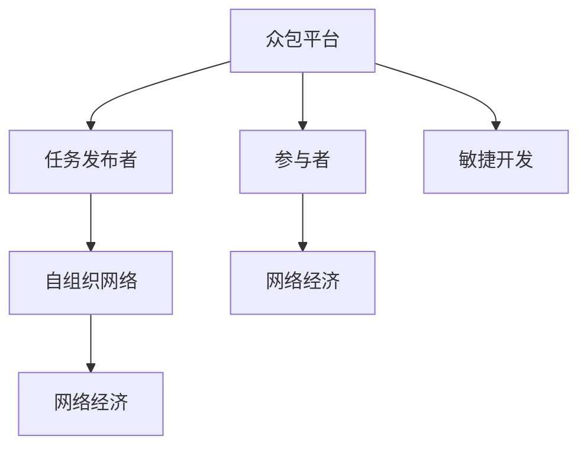

                 

# 众包：汇聚点滴智慧，创造无限可能

> 关键词：众包, 协作平台, 自组织网络, 敏捷开发, 网络经济

## 1. 背景介绍

### 1.1 问题由来

众包(Crowdsourcing)，最初由Jeff Howe在2006年提出，指的是将原本由员工完成的任务，通过网络平台外包给非特定人员群体（通常是自由职业者或大众）完成。这一概念迅速在全球范围内引起广泛关注，并广泛应用于软件开发、设计、数据分析等多个领域。

随着互联网技术的普及和人工智能的崛起，众包模式从早期的“求人做事”逐渐演变为“求人出主意”，演化出了更加多样化的形式。尤其是在NLP、计算机视觉、自然语言生成等技术领域，众包模式通过聚合分散的智慧，为各类技术问题提供了高效、低成本的解决方案。

本文聚焦于众包模式的最新进展，深入探讨其原理、应用场景及未来趋势，力求为读者提供一个全面、系统的理解。

### 1.2 问题核心关键点

1. **众包模式的核心要素**：任务发布者、众包平台、参与者三者之间的关系，及他们之间的交互方式。
2. **众包系统的设计挑战**：如何保证众包系统的效率、公平性、安全性。
3. **技术进步与挑战**：如何利用人工智能技术提升众包平台的智能化水平，降低人力成本。
4. **经济与社会影响**：众包模式如何影响就业、收入分配等社会经济问题。
5. **政策与规范**：如何制定合理的政策规范，保障众包参与者的合法权益。

## 2. 核心概念与联系

### 2.1 核心概念概述

为了深入理解众包模式，本节将介绍几个关键概念：

- **众包平台(Crowdsourcing Platform)**：连接任务发布者和众包参与者的在线平台，提供任务发布、参与者管理、任务审核、报酬结算等功能。
- **自组织网络(Self-Organized Networks)**：通过互联网平台，参与者可以自由组合，形成临时性的自组织团队，高效完成任务。
- **敏捷开发(Agile Development)**：一种基于迭代、反馈的开发方式，强调灵活应对变化，快速交付高质量产品。
- **网络经济(Network Economy)**：以互联网为基础，通过分布式协作创造经济价值的模式。

这些概念之间的逻辑关系可以通过以下Mermaid流程图来展示：



这个流程图展示出众包模式的核心理念：

1. **平台连接**：通过众包平台，任务发布者和众包参与者得以高效对接。
2. **自组织团队**：参与者自由组合，形成团队，按需完成任务。
3. **敏捷开发**：任务通过迭代、反馈的方式快速完成，提升开发效率。
4. **网络经济**：通过众包模式，平台、参与者、任务发布者三方互惠共赢，共同创造经济价值。

这些概念共同构成了众包模式的完整框架，展示了其强大的应用潜力和未来发展方向。

## 3. 核心算法原理 & 具体操作步骤

### 3.1 算法原理概述

众包模式的算法原理，主要基于以下三个核心机制：

1. **任务分派与分配算法**：根据任务复杂度、参与者技能、工作量等因素，智能分派任务给合适的参与者，并动态调整任务分配策略。
2. **结果评价与筛选算法**：设计有效的任务评价指标，通过多轮筛选，选出最优秀的解决方案。
3. **报酬机制与激励算法**：建立公平合理的报酬分配机制，激励参与者积极贡献优质作品。

这些算法机制互相配合，共同保证了众包模式的效率与质量。

### 3.2 算法步骤详解

众包模式的一般操作步骤包括：

1. **任务发布**：任务发布者在众包平台上发布任务，描述任务要求、报酬等相关信息。
2. **任务分派**：平台算法根据任务复杂度、参与者技能、工作量等因素，智能分派任务给合适的参与者，并动态调整任务分配策略。
3. **参与完成任务**：众包参与者按照任务要求提交作品，平台算法根据评价指标进行筛选，选出最优秀的解决方案。
4. **报酬结算**：平台根据评价结果，自动计算并发放报酬给参与者。

### 3.3 算法优缺点

众包模式具有以下优点：

1. **高效低成本**：大量任务可以同时发布，参与者自由组合，高效完成。
2. **广泛灵活**：参与者不受地域、时间限制，任务类型丰富多样。
3. **质量保证**：多轮筛选机制，保证任务完成质量。

同时，众包模式也存在一些缺点：

1. **任务分配与筛选复杂**：任务分配和筛选算法设计难度大，容易出现偏差。
2. **质量波动**：参与者水平不一，作品质量波动大。
3. **激励机制设计困难**：如何设计公平合理的报酬激励机制，仍需深入研究。

### 3.4 算法应用领域

众包模式已广泛应用于软件开发、设计、数据分析等多个领域。例如：

- **软件开发**：使用众包平台发布代码审查、测试等任务，提升软件质量与开发效率。
- **产品设计**：通过众包平台征集产品原型、用户界面等设计方案，快速迭代优化产品设计。
- **数据分析**：利用众包平台收集、分析大规模数据集，挖掘数据价值，推动企业决策。
- **内容创作**：通过众包平台征集文章、视频、音乐等内容创作，丰富内容库。
- **科学研究**：使用众包平台征集研究数据、实验设计等，推进科学发现。

除了上述这些常见应用外，众包模式还在医疗、法律、金融等众多领域展现了巨大的潜力，为各行各业带来了全新的发展机遇。

## 4. 数学模型和公式 & 详细讲解 & 举例说明

### 4.1 数学模型构建

假设某众包平台上，任务发布者发布了n个任务，每个任务期望报酬为R，参与者总人数为m。平台通过分派算法将任务分派给合适的参与者，参与者提交作品后，平台根据评价算法选出最优解，并自动计算报酬发放。

设任务i的分派概率为$p_i$，参与者j提交任务i的作品质量为$q_{ij}$，评价算法输出的任务i的最终评分$S_i$，则任务i的报酬计算公式为：

$$
\text{报酬}_{i} = R \times \max_{j \in M_i} \left\{ p_i \times q_{ij} \times S_i \right\}
$$

其中，$M_i$表示提交任务i的参与者集合，$p_i$表示任务i的分派概率，$q_{ij}$表示参与者j提交任务i的作品质量，$S_i$表示任务i的最终评分。

### 4.2 公式推导过程

设任务i的分派概率$p_i$为：

$$
p_i = \frac{\text{工作量}_{i}}{\text{总工作量}} \times \frac{1}{\text{参与者总人数} \times \text{任务复杂度}_{i}}
$$

参与者j提交任务i的作品质量$q_{ij}$为：

$$
q_{ij} = \text{技能}_{j} \times \text{经验}_{j} \times \text{效率}_{j}
$$

任务i的最终评分$S_i$为：

$$
S_i = \sum_{k=1}^{K} \text{评分}_{ik} \times \text{权重}_{ik}
$$

其中，$\text{评分}_{ik}$为参与者j提交任务i的评分，$\text{权重}_{ik}$为评分的重要性权重。

将这些公式代入报酬计算公式中，可得：

$$
\text{报酬}_{i} = R \times \max_{j \in M_i} \left\{ \frac{\text{工作量}_{i}}{\text{总工作量}} \times \frac{1}{\text{参与者总人数} \times \text{任务复杂度}_{i}} \times \text{技能}_{j} \times \text{经验}_{j} \times \text{效率}_{j} \times \sum_{k=1}^{K} \text{评分}_{ik} \times \text{权重}_{ik} \right\}
$$

### 4.3 案例分析与讲解

某众包平台需要处理大量数据标签任务，每个任务期望报酬为10元，共有100个参与者。设任务1分配给5个参与者，任务2分配给10个参与者，任务3分配给15个参与者。参与者j提交任务1的作品质量为0.8，参与者k提交任务1的最终评分为0.9，任务1的评分权重为0.6。根据上述公式计算任务1的报酬为：

$$
\text{报酬}_{1} = 10 \times \max_{j \in M_1} \left\{ \frac{1}{5} \times 0.8 \times 0.9 \times 0.6 \right\} = 8.64
$$

同理，可以计算其他任务和参与者的报酬。

## 5. 项目实践：代码实例和详细解释说明

### 5.1 开发环境搭建

在进行众包项目开发前，我们需要准备好开发环境。以下是使用Python进行Flask开发的环境配置流程：

1. 安装Anaconda：从官网下载并安装Anaconda，用于创建独立的Python环境。

2. 创建并激活虚拟环境：
```bash
conda create -n crowdsourcing-env python=3.8 
conda activate crowdsourcing-env
```

3. 安装Flask：
```bash
pip install Flask
```

4. 安装SQLAlchemy：
```bash
pip install sqlalchemy
```

5. 安装Flask-SQLAlchemy：
```bash
pip install Flask-SQLAlchemy
```

6. 安装Flask-WTF：
```bash
pip install Flask-WTF
```

完成上述步骤后，即可在`crowdsourcing-env`环境中开始项目开发。

### 5.2 源代码详细实现

接下来，我们以一个简单的众包平台为例，展示Flask框架下众包平台的开发流程。

首先，定义平台的数据模型：

```python
from flask_sqlalchemy import SQLAlchemy

db = SQLAlchemy(app)

class Task(db.Model):
    id = db.Column(db.Integer, primary_key=True)
    name = db.Column(db.String(100))
    description = db.Column(db.Text)
    reward = db.Column(db.Float)
    status = db.Column(db.String(20))
    created_at = db.Column(db.DateTime, default=datetime.datetime.now)
    updated_at = db.Column(db.DateTime, default=datetime.datetime.now, onupdate=datetime.datetime.now)

class Worker(db.Model):
    id = db.Column(db.Integer, primary_key=True)
    name = db.Column(db.String(100))
    skill = db.Column(db.String(100))
    experience = db.Column(db.Integer)
    submit_count = db.Column(db.Integer, default=0)
```

然后，定义任务发布与分配的接口：

```python
@app.route('/tasks', methods=['POST'])
def create_task():
    name = request.json.get('name')
    description = request.json.get('description')
    reward = request.json.get('reward')
    status = request.json.get('status')
    
    task = Task(name=name, description=description, reward=reward, status=status)
    db.session.add(task)
    db.session.commit()
    
    # 分配任务
    # ...
    return jsonify({'id': task.id})
```

接着，定义参与任务与提交作品的接口：

```python
@app.route('/tasks/<task_id>/assign', methods=['POST'])
def assign_task(task_id):
    task = Task.query.get(task_id)
    
    # 分配任务给参与者
    # ...
    
    return jsonify({'status': task.status})
    
@app.route('/tasks/<task_id>/submit', methods=['POST'])
def submit_task(task_id):
    task = Task.query.get(task_id)
    worker = Worker.query.get(request.json.get('worker_id'))
    
    # 提交作品
    # ...
    
    return jsonify({'status': task.status})
```

最后，定义报酬计算与发放的接口：

```python
@app.route('/tasks/<task_id>/pay', methods=['GET'])
def pay_task(task_id):
    task = Task.query.get(task_id)
    
    # 计算报酬
    # ...
    
    # 发放报酬
    # ...
    
    return jsonify({'payment': task.reward})
```

通过这些接口，可以基本实现一个众包平台的核心功能。

### 5.3 代码解读与分析

让我们再详细解读一下关键代码的实现细节：

**Task模型**：
- `id`：任务ID，自动递增。
- `name`：任务名称。
- `description`：任务描述。
- `reward`：任务期望报酬。
- `status`：任务状态。
- `created_at`：创建时间。
- `updated_at`：更新时间。

**Worker模型**：
- `id`：参与者ID，自动递增。
- `name`：参与者姓名。
- `skill`：参与者技能。
- `experience`：参与者经验。
- `submit_count`：参与者提交任务次数。

**create_task函数**：
- 从请求中获取任务信息，创建任务对象，并将其添加到数据库中。
- 分配任务时，需要根据任务复杂度、参与者技能等因素，选择合适的参与者，并更新任务状态。

**assign_task函数**：
- 获取指定任务对象，并将任务分派给合适的参与者。
- 需要考虑工作量、任务复杂度等因素，动态调整任务分配策略。

**submit_task函数**：
- 获取指定任务对象和参与者，并提交参与者的作品。
- 需要根据任务描述、评价指标等，筛选出最优解决方案。

**pay_task函数**：
- 计算参与者的报酬，并发放报酬。
- 需要根据任务评分、任务复杂度等因素，设计公平合理的报酬分配机制。

**运行结果展示**：
- 上述代码的完整运行结果依赖于Flask框架和数据库的具体实现，此处不具体展示。

## 6. 实际应用场景

### 6.1 智能客服系统

众包模式在智能客服系统中有着广泛应用。智能客服系统通过众包平台收集、分析用户对话，生成智能应答模型。参与者可以自由参与对话审核、应答生成等工作，快速迭代优化客服系统的应答质量。

在技术实现上，可以收集企业内部的历史客服对话记录，将问题和最佳答复构建成监督数据，在此基础上对预训练模型进行微调。微调后的模型能够自动理解用户意图，匹配最合适的答案模板进行回复。对于客户提出的新问题，还可以接入检索系统实时搜索相关内容，动态组织生成回答。如此构建的智能客服系统，能大幅提升客户咨询体验和问题解决效率。

### 6.2 金融舆情监测

金融机构需要实时监测市场舆论动向，以便及时应对负面信息传播，规避金融风险。传统的人工监测方式成本高、效率低，难以应对网络时代海量信息爆发的挑战。众包模式通过集合理财，可以高效收集金融领域相关的新闻、报道、评论等文本数据，并对其进行主题标注和情感标注。在此基础上对预训练语言模型进行微调，使其能够自动判断文本属于何种主题，情感倾向是正面、中性还是负面。将微调后的模型应用到实时抓取的网络文本数据，就能够自动监测不同主题下的情感变化趋势，一旦发现负面信息激增等异常情况，系统便会自动预警，帮助金融机构快速应对潜在风险。

### 6.3 个性化推荐系统

当前的推荐系统往往只依赖用户的历史行为数据进行物品推荐，无法深入理解用户的真实兴趣偏好。众包模式通过集合理财，可以获取大量用户浏览、点击、评论、分享等行为数据，并提取和用户交互的物品标题、描述、标签等文本内容。将文本内容作为模型输入，用户的后续行为（如是否点击、购买等）作为监督信号，在此基础上微调预训练语言模型。微调后的模型能够从文本内容中准确把握用户的兴趣点。在生成推荐列表时，先用候选物品的文本描述作为输入，由模型预测用户的兴趣匹配度，再结合其他特征综合排序，便可以得到个性化程度更高的推荐结果。

### 6.4 未来应用展望

随着众包模式的不断演进，其在各行业的落地应用前景广阔。

在智慧医疗领域，众包模式通过集合理财，可以广泛征集医学专家、患者、志愿者等多方意见，推动医学知识传播、疾病诊断、康复治疗等领域的创新。

在智能教育领域，众包模式通过集合理财，可以征集教育资源、教学方法、评价指标等，推动教育公平、个性化教育的发展。

在智慧城市治理中，众包模式通过集合理财，可以广泛征集市民意见，推动城市管理决策的民主化、科学化。

此外，在企业生产、社会治理、文娱传媒等众多领域，众包模式也将不断涌现新的应用场景，为传统行业数字化转型升级提供新的技术路径。相信随着技术的日益成熟，众包模式必将在构建人机协同的智能时代中扮演越来越重要的角色。

## 7. 工具和资源推荐

### 7.1 学习资源推荐

为了帮助开发者系统掌握众包模式的原理和实践技巧，这里推荐一些优质的学习资源：

1. **《众包经济学》**：Jeff Howe的经典著作，全面介绍了众包模式的历史、原理、应用案例。
2. **《众包革命》**：陈伟著，系统探讨了众包模式的理论基础和实际应用。
3. **Coursera《众包平台设计与运营》**：由美国达特茅斯大学开设的课程，深入浅出地介绍了众包平台的设计和运营策略。
4. **《网络经济学》**：张杰、任远著，介绍了网络经济学的基本概念和应用场景。

通过对这些资源的学习实践，相信你一定能够快速掌握众包模式的精髓，并用于解决实际的业务问题。

### 7.2 开发工具推荐

高效的开发离不开优秀的工具支持。以下是几款用于众包开发常用的工具：

1. **Flask**：基于Python的开源Web框架，快速搭建Web应用，适合灵活的众包平台开发。
2. **SQLAlchemy**：基于Python的ORM框架，方便进行数据库操作。
3. **Gunicorn**：基于Python的Web服务器，支持Flask等框架。
4. **Amazon EC2**：云平台服务，可以快速部署和扩展众包平台。
5. **Heroku**：云平台服务，支持快速部署和扩展Web应用。

合理利用这些工具，可以显著提升众包系统的开发效率，加快创新迭代的步伐。

### 7.3 相关论文推荐

众包模式的发展源于学界的持续研究。以下是几篇奠基性的相关论文，推荐阅读：

1. **《Crowdsourcing with Bounded Rationality》**：Jeff Howe的论文，探讨了众包模式的理论基础和应用前景。
2. **《The Crowdsourcing Answer Sheet: An Empirical Study of the Amazon Mechanical Turk System》**：Byron Wallace等人的论文，研究了众包平台Amazon Mechanical Turk的性能和特点。
3. **《A Survey on Crowdsourcing in Science and Engineering》**：Jason Ding等人综述了众包在科学研究和技术开发中的应用。
4. **《Decentralized Crowdsourcing via Market Dynamics》**：Anupam Gupta等人的论文，研究了众包平台的市场机制设计。

这些论文代表了大众合作模式的学术进展，展示了众包模式的巨大潜力。通过学习这些前沿成果，可以帮助研究者把握学科前进方向，激发更多的创新灵感。

## 8. 总结：未来发展趋势与挑战

### 8.1 研究成果总结

本文对众包模式的最新进展进行了全面系统的介绍。首先阐述了众包模式的核心要素、应用场景及面临的挑战，明确了众包在技术、经济和社会方面的应用潜力。其次，从原理到实践，详细讲解了众包平台的算法设计、数据模型及其实现细节，给出了完整的项目实践代码。同时，本文还广泛探讨了众包模式在各行业领域的应用前景，展示了其广阔的应用前景。最后，精选了众包技术的各类学习资源，力求为读者提供全方位的技术指引。

通过本文的系统梳理，可以看到，众包模式作为一种新兴的协作模式，已经在多个领域展现出了巨大的应用潜力，并为未来的人机协同、智慧社会提供了新的思路。

### 8.2 未来发展趋势

展望未来，众包模式将呈现以下几个发展趋势：

1. **智能化程度提升**：随着人工智能技术的不断进步，众包平台将具备更强的自动化、智能化能力，能够高效管理任务分配、筛选和报酬结算。
2. **个性化推荐优化**：众包模式将与个性化推荐系统深度结合，通过集合理财，获取更多用户行为数据，提供更精准、个性化的服务。
3. **网络经济深化**：众包模式将在更多行业得到应用，形成更广泛的网络经济效应，推动各行业的数字化转型。
4. **社会公平与包容**：众包模式将关注参与者的公平权益，推动就业公平、收入分配等社会问题的解决，提升社会包容性。
5. **跨领域融合**：众包模式将与物联网、大数据、区块链等技术深度结合，推动各领域的协同创新。

这些趋势凸显了众包模式的强大应用潜力和广阔未来。这些方向的探索发展，必将进一步提升众包系统的性能和应用范围，为各行业带来全新的发展机遇。

### 8.3 面临的挑战

尽管众包模式已经取得了瞩目成就，但在迈向更加智能化、普适化应用的过程中，它仍面临着诸多挑战：

1. **数据隐私与安全**：如何保护用户隐私和数据安全，避免数据泄露和滥用，仍需深入研究。
2. **平台治理与监管**：如何设计合理的平台治理机制，保障参与者的权益，避免平台垄断和利益冲突，仍需深入探讨。
3. **任务质量与公平性**：如何设计高效的任务分配和筛选机制，确保任务质量和公平性，仍需深入研究。
4. **激励机制设计**：如何设计公平合理的报酬激励机制，激发参与者的积极性，仍需深入研究。
5. **技术融合与创新**：如何与其他技术如区块链、人工智能等深度结合，推动跨领域创新，仍需深入探讨。

这些挑战需要学界、产业界、政策制定者等多方共同努力，才能有效应对，确保众包模式的健康发展和广泛应用。

### 8.4 研究展望

面对众包模式面临的种种挑战，未来的研究需要在以下几个方面寻求新的突破：

1. **数据隐私保护技术**：研发高效的数据加密、去标识化技术，保护用户隐私和数据安全。
2. **平台治理机制设计**：制定合理的平台治理机制，保障参与者的权益，推动就业公平。
3. **任务质量与公平性优化**：设计高效的任务分配和筛选机制，确保任务质量和公平性。
4. **激励机制设计优化**：设计公平合理的报酬激励机制，激发参与者的积极性。
5. **跨领域技术融合**：与其他技术如区块链、人工智能等深度结合，推动跨领域创新。

这些研究方向的探索，必将引领众包模式迈向更高的台阶，为构建人机协同的智能时代提供新的技术路径。

## 9. 附录：常见问题与解答

**Q1：众包模式是否适用于所有行业？**

A: 众包模式适用于需要大量数据处理、任务分配的行业，如软件开发、设计、数据分析等。但对于某些需要高度信任和专业知识的行业，如医疗、法律等，可能需要更严格的筛选机制和监控措施。

**Q2：众包平台如何保证任务质量？**

A: 众包平台通过多轮筛选机制，结合评分系统、质量控制措施等，确保任务高质量完成。此外，还可以引入专业审核团队，对任务进行人工复核，进一步提升任务质量。

**Q3：众包平台如何保证参与者的权益？**

A: 众包平台需要制定合理的激励机制和治理机制，保障参与者的权益。可以设置公平的报酬分配机制，定期进行平台审计，确保平台运营透明公正。

**Q4：众包平台如何应对参与者激励不足的问题？**

A: 众包平台可以通过引入更多类型任务、设定合理的报酬激励、定期组织竞赛等方式，提高参与者的积极性。同时，可以设计动态报酬分配机制，根据任务复杂度、参与者贡献等因素，动态调整报酬。

**Q5：众包平台如何应对参与者过度竞争的问题？**

A: 众包平台可以通过任务分配策略、筛选机制等，避免参与者过度竞争。可以设置合理的任务发布节奏，进行任务数量控制，避免过多参与者争抢少数任务。

这些问题的回答，展示了众包模式在实际应用中需要注意的关键点，帮助开发者更好地理解众包平台的运营和优化策略。

---

作者：禅与计算机程序设计艺术 / Zen and the Art of Computer Programming

