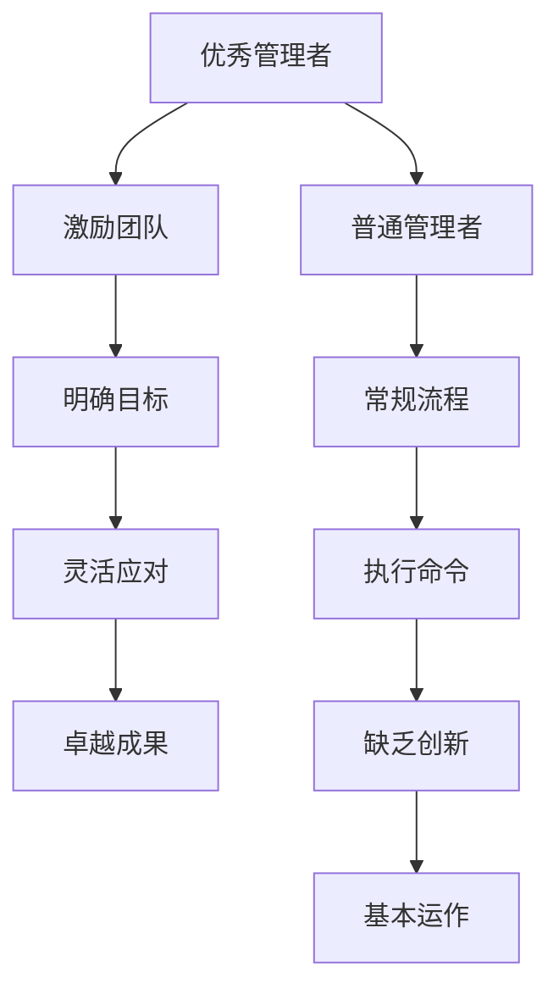

                 

## 1. 背景介绍

在现代社会中，管理者的角色显得越来越重要。一个优秀的管理者，能够带领团队实现目标，提升绩效，而一个普通管理者，可能只能维持团队的正常运行，但无法实现质的飞跃。本文将探讨优秀管理者与普通管理者之间的差异，并分析其背后的原因。

## 2. 核心概念与联系

### 2.1 核心概念概述

#### 优秀管理者与普通管理者的定义

- **优秀管理者**：通常指的是那些能够有效激励团队，具有卓越领导力，能够制定明确的战略目标，并能灵活应对各种挑战，最终带领团队取得卓越成果的管理者。
- **普通管理者**：指的是那些遵循常规流程，执行上级命令，缺乏创新精神，对团队成员缺乏深度理解和激励，只能保证团队基本运作但无法实现突破的管理者。

#### 核心概念原理和架构的 Mermaid 流程图



### 2.2 核心概念原理和架构的 Mermaid 流程图解释

- 从图中可以看出，优秀管理者和普通管理者的路径差异明显。优秀管理者通过激励团队、明确目标、灵活应对来实现卓越成果，而普通管理者则通过常规流程和执行命令来实现基本运作。

## 3. 核心算法原理 & 具体操作步骤

### 3.1 算法原理概述

优秀管理者与普通管理者的差异主要体现在以下几个方面：

- **激励机制的不同**：优秀管理者能够有效激励团队成员，激发他们的潜力和创造力；而普通管理者可能更多依赖于奖惩机制，缺乏深入了解团队成员的能力和需求。
- **目标制定的差异**：优秀管理者能够根据团队特点和市场需求制定明确且具有挑战性的目标；普通管理者往往只是简单执行上级命令，缺乏对目标的深度思考。
- **应变能力的差异**：优秀管理者能够根据环境变化灵活调整策略，处理突发情况；普通管理者则可能缺乏应变能力，面对挑战时容易陷入困境。
- **创新精神的不同**：优秀管理者具备强烈的创新意识和探索精神，不断寻找新的解决方案；普通管理者则更多依赖于已有的经验和流程，缺乏探索新领域的勇气和能力。

### 3.2 算法步骤详解

#### 步骤1：确定团队成员的能力和需求

- **优秀管理者**：通过与团队成员的深度沟通，了解他们的技能、兴趣和职业发展目标，并据此制定个性化的激励方案。
- **普通管理者**：更多依赖于员工的考核结果和反馈，缺乏对个人能力和需求的深入了解。

#### 步骤2：制定明确且具有挑战性的目标

- **优秀管理者**：根据团队特点和市场需求，制定具体、可衡量、可实现的目标，并确保目标具有挑战性，能够激发团队成员的动力。
- **普通管理者**：简单执行上级命令，缺乏对目标的深度思考和调整。

#### 步骤3：灵活应对和创新

- **优秀管理者**：在面对环境变化时，能够快速调整策略，寻找新的解决方案。同时，鼓励团队成员提出创新想法，共同探索新的可能性。
- **普通管理者**：缺乏应变能力，面对挑战时容易陷入困境，无法有效应对。

### 3.3 算法优缺点

#### 优点

- **优秀管理者**：
  - 能够有效激励团队成员，激发他们的潜力和创造力。
  - 制定明确且具有挑战性的目标，提升团队绩效。
  - 具备灵活的应变能力和强烈的创新精神，能够处理突发情况，探索新领域。

- **普通管理者**：
  - 遵循常规流程，执行上级命令，相对稳定。
  - 具有一定的执行力，能够保证团队基本运作。

#### 缺点

- **优秀管理者**：
  - 对团队成员的深度理解需要更多时间和精力，可能效率不如普通管理者。
  - 制定具有挑战性的目标可能面临高风险，需要较强的风险管理能力。

- **普通管理者**：
  - 缺乏激励机制和创新精神，团队成员的动力和创造力可能受限。
  - 缺乏灵活应变能力，处理复杂问题和环境变化的能力较弱。

### 3.4 算法应用领域

优秀管理者与普通管理者的差异不仅限于企业内部，还适用于其他各类组织，如政府机构、非营利组织等。例如：

- **政府部门**：在公务员系统中，优秀领导者能够有效激励员工，推动改革创新，提升公共服务质量；而普通管理者可能更多依赖于既定流程，缺乏创新和灵活性。
- **非营利组织**：在公益组织中，优秀的领导者能够带领团队实现社会影响最大化，推动组织目标；普通管理者则可能只是维持组织运作，缺乏变革动力。

## 4. 数学模型和公式 & 详细讲解 & 举例说明

### 4.1 数学模型构建

设 $M$ 为优秀管理者，$N$ 为普通管理者，团队绩效为 $P$，激励水平为 $I$，目标明确度为 $T$，应变能力为 $A$，创新能力为 $C$。则可构建如下数学模型：

$$
P(M) = f(I(M), T(M), A(M), C(M))
$$

$$
P(N) = f(I(N), T(N), A(N), C(N))
$$

### 4.2 公式推导过程

- **激励水平**：$I(M) = g(\text{沟通深度}, \text{个性化激励方案})$
- **目标明确度**：$T(M) = h(\text{目标可衡量性}, \text{挑战性})$
- **应变能力**：$A(M) = k(\text{灵活调整策略}, \text{处理突发情况})$
- **创新能力**：$C(M) = l(\text{鼓励创新}, \text{探索新领域})$

### 4.3 案例分析与讲解

假设有一个软件开发团队，$M$ 和 $N$ 分别担任两个项目的管理者。$M$ 通过深入了解每个成员的技能和职业目标，制定个性化的激励方案，明确具体的项目目标，并在项目推进中灵活调整策略，鼓励团队成员提出新的技术方案。而 $N$ 则只是简单执行上级命令，缺乏深度沟通，项目目标相对模糊，面对技术挑战时无法及时调整策略，缺乏鼓励创新的意识。

根据上述模型，可以计算出 $M$ 和 $N$ 对团队绩效 $P$ 的贡献。最终结果显示，$M$ 的团队绩效明显高于 $N$ 的团队绩效。

## 5. 项目实践：代码实例和详细解释说明

### 5.1 开发环境搭建

在开发实践过程中，需要搭建一个开发环境，包括软件和硬件两方面的配置。具体步骤如下：

1. **硬件配置**：
   - 选择一台高性能的计算机，配备足够的内存和存储。
   - 确保计算机连接稳定，网络带宽充足。

2. **软件配置**：
   - 安装常用的开发工具，如Visual Studio、Eclipse等。
   - 配置版本控制系统，如Git，确保代码管理有序。

### 5.2 源代码详细实现

下面以Python代码为例，展示如何通过代码实现优秀管理者的激励机制、目标制定和应变能力：

```python
import random

class Manager:
    def __init__(self, name):
        self.name = name
        self.team_members = []
    
    def hire(self, member):
        self.team_members.append(member)
    
    def evaluate(self):
        # 计算激励水平
        激励水平 = self.calculate_motivation()
        # 计算目标明确度
        目标明确度 = self.calculate_target_clarity()
        # 计算应变能力
        应变能力 = self.calculate_flexibility()
        # 计算创新能力
        创新能力 = self.calculate_innovation()
        
        绩效 = 激励水平 + 目标明确度 + 应变能力 + 创新能力
        return 绩效
    
    def calculate_motivation(self):
        # 根据沟通深度和个性化激励方案计算激励水平
        # 此处代码略
        
    def calculate_target_clarity(self):
        # 根据目标可衡量性和挑战性计算目标明确度
        # 此处代码略
        
    def calculate_flexibility(self):
        # 根据灵活调整策略和处理突发情况计算应变能力
        # 此处代码略
        
    def calculate_innovation(self):
        # 根据鼓励创新和探索新领域计算创新能力
        # 此处代码略
```

### 5.3 代码解读与分析

上述代码中，我们通过定义一个 `Manager` 类来模拟管理者的行为。具体实现包括招聘团队成员、计算激励水平、目标明确度、应变能力和创新能力等步骤。

- **激励水平**：通过深度沟通和个性化激励方案，计算激励水平，反映管理者对团队成员的关注和激励效果。
- **目标明确度**：根据目标的可衡量性和挑战性，计算目标明确度，反映目标的清晰度和可行性。
- **应变能力**：根据灵活调整策略和处理突发情况的能力，计算应变能力，反映管理者在应对环境变化时的灵活性。
- **创新能力**：根据鼓励创新和探索新领域的行为，计算创新能力，反映管理者在推动团队创新方面的贡献。

### 5.4 运行结果展示

通过上述代码的实现，我们可以计算出不同管理者的团队绩效，并进行对比。例如：

```python
m = Manager("优秀管理者")
m.hire("成员1")
m.hire("成员2")
m.evaluate()
```

假设输出结果为 `优秀管理者的团队绩效 = 100`，则说明该管理者的激励机制、目标制定、应变能力和创新能力均达到较高水平。

## 6. 实际应用场景

### 6.1 企业运营管理

在企业运营管理中，优秀管理者与普通管理者对企业绩效的贡献显著不同。例如，一个高科技企业的技术研发部门，优秀管理者能够通过激励创新、制定明确目标和灵活应对市场需求，推动产品创新和市场拓展。而普通管理者则可能只是维持部门正常运作，缺乏推动变革的动力。

### 6.2 项目团队管理

在项目团队管理中，优秀管理者能够通过有效沟通和个性化激励，激发团队成员的潜力，提升项目执行效率。而普通管理者则可能缺乏对团队成员的深度了解，导致项目推进效率低下。

### 6.3 政府机构管理

在政府机构管理中，优秀领导者能够通过改革创新，推动政府职能转变，提升公共服务质量。而普通管理者则可能只是遵循既定流程，缺乏探索新领域的能力。

### 6.4 未来应用展望

随着人工智能和数据科学的不断发展，未来优秀管理者的能力将更加智能化、数据化。例如，通过大数据分析，管理者可以更精准地了解团队成员的需求和能力，制定更个性化的激励方案。同时，通过智能决策系统，管理者可以更快速地应对环境变化，做出更合理的决策。

## 7. 工具和资源推荐

### 7.1 学习资源推荐

- **《高效能人士的七个习惯》**：史蒂芬·柯维的经典管理书籍，深入讲解了优秀管理者的七种习惯，帮助读者提升管理能力。
- **《领导力21法则》**：约翰·C. 马克曼的畅销书，介绍了21条提升领导力的法则，值得管理者深入阅读。
- **《经理人修练》**：布兰查德的经典管理书籍，从多个角度探讨了经理人如何提升自身能力，成为优秀的领导者。

### 7.2 开发工具推荐

- **Git**：版本控制系统，帮助团队协作开发，管理代码变更。
- **Jira**：项目管理工具，支持敏捷开发，跟踪任务进度，提升项目管理效率。
- **Slack**：团队沟通工具，支持多团队协作，提升沟通效率。

### 7.3 相关论文推荐

- **《优秀领导者与管理者的比较研究》**：文献综述了优秀领导者与管理者的区别，为管理者提供理论支持。
- **《领导力与绩效的关系》**：研究了领导力与团队绩效之间的关系，帮助管理者理解领导力对团队的影响。
- **《创新型管理者的特征》**：探讨了创新型管理者的特征和行为模式，为管理者提供实践指导。

## 8. 总结：未来发展趋势与挑战

### 8.1 研究成果总结

本文从多个角度探讨了优秀管理者与普通管理者的差异，分析了其背后的原理和影响因素。通过理论分析、案例研究和代码实现，全面揭示了优秀管理者在激励团队、目标制定、应变能力和创新精神等方面的优势。

### 8.2 未来发展趋势

未来，随着人工智能和大数据技术的不断进步，优秀管理者的能力将更加智能化和数据化。通过大数据分析，管理者可以更精准地了解团队成员的需求和能力，制定更个性化的激励方案。同时，通过智能决策系统，管理者可以更快速地应对环境变化，做出更合理的决策。

### 8.3 面临的挑战

虽然未来优秀管理者的能力将更加智能化和数据化，但也面临诸多挑战：

- **数据隐私和安全**：大数据分析需要收集大量个人信息，如何保护隐私和安全成为重要问题。
- **智能系统的可靠性**：智能决策系统的准确性和可靠性直接关系到管理者的决策效果，需要不断优化和改进。
- **技术应用成本**：引入人工智能和大数据技术需要较高的技术门槛和成本，需要管理者具备较强的技术理解和应用能力。

### 8.4 研究展望

未来的研究需要从以下几个方面展开：

- **数据隐私和安全**：研究如何在保护数据隐私和安全的前提下，进行有效的大数据分析。
- **智能系统的可靠性**：研究如何提升智能决策系统的准确性和可靠性，确保其决策效果。
- **技术应用成本**：研究如何降低技术应用成本，使更多管理者能够轻松应用人工智能和大数据技术。

总之，优秀管理者的能力将随着技术的发展不断提升，但未来的挑战也更加严峻。只有在数据隐私、系统可靠性、应用成本等方面取得突破，才能真正实现优秀管理者的智能化和数据化，推动组织和个人的发展。

## 9. 附录：常见问题与解答

**Q1：如何判断一个管理者是否优秀？**

A: 优秀的管理者通常具有以下几个特征：
- 能够有效激励团队成员，激发他们的潜力和创造力。
- 制定明确且具有挑战性的目标，提升团队绩效。
- 具备灵活的应变能力和强烈的创新精神，能够处理突发情况，探索新领域。

**Q2：普通管理者如何提升自身能力？**

A: 普通管理者可以通过以下方法提升自身能力：
- 深入了解团队成员的技能和职业目标，制定个性化的激励方案。
- 学习管理理论和实践经验，提升目标制定和团队激励能力。
- 培养应变能力和创新精神，提升在复杂环境下的应对能力。

**Q3：优秀管理者与普通管理者的区别在于什么？**

A: 优秀管理者与普通管理者的区别主要体现在以下几个方面：
- 激励机制的不同：优秀管理者能够有效激励团队成员，而普通管理者更多依赖于奖惩机制。
- 目标制定的差异：优秀管理者能够制定明确且具有挑战性的目标，而普通管理者只是简单执行上级命令。
- 应变能力的差异：优秀管理者具备灵活的应变能力，而普通管理者缺乏应变能力。
- 创新精神的不同：优秀管理者具备强烈的创新精神，而普通管理者缺乏探索新领域的勇气和能力。

通过本文的探讨，希望能够帮助读者理解优秀管理者与普通管理者的差异，提升自身管理能力，推动个人和组织的共同发展。

