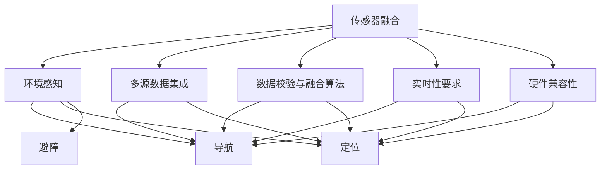

                 

# 传感器融合技术：获取准确的环境数据

> 关键词：传感器融合, 环境感知, 多源数据, 机器人, 自动驾驶, 精准测量

## 1. 背景介绍

在现代科技日益发展的今天，传感器融合技术已经成为获取精确环境数据的关键手段。从无人驾驶汽车到工业自动化，从智能家居到军事探测，无处不在的应用场景对传感器融合提出了更高的要求。

### 1.1 问题由来
传感器融合技术旨在将来自不同传感器（如激光雷达、相机、GPS等）的数据进行综合处理，以提高数据精度、减少传感器误报和降低噪音干扰，最终生成可靠的环境感知数据。特别是在无人驾驶、机器人导航等场景中，传感器融合尤为重要，因为这些场景中对环境数据的精度要求极高。

### 1.2 问题核心关键点
传感器融合技术的关键在于：
- 多源数据集成。如何有效地整合多个传感器获取的数据，使其相互补充、减少冗余。
- 数据校验与融合算法。使用何种算法来确保融合后的数据比单一传感器获取的数据更为准确。
- 实时性要求。融合过程需要在实时环境中快速完成，以保证决策系统的及时性。
- 硬件兼容性。不同类型的传感器通常具有不同的接口和协议，如何设计兼容性的硬件接口是传感器融合的重要一环。

### 1.3 问题研究意义
传感器融合技术可以大幅提升环境感知能力，使得机器人在复杂环境中更加准确和可靠地进行导航、定位和避障。此外，融合技术还能有效提高数据的质量和可信度，降低系统误报和噪音，这对于无人驾驶、机器人、智能家居等应用场景至关重要。

传感器融合技术的广泛应用，将加速各行各业的智能化进程，提升生产效率和用户体验。通过对传感器融合算法的持续改进和优化，可以不断拓展其应用边界，带来更多创新的应用场景和解决方案。

## 2. 核心概念与联系

### 2.1 核心概念概述

为了更好地理解传感器融合技术的原理和应用，本节将介绍几个核心概念：

- **传感器融合（Sensor Fusion）**：将来自不同传感器的数据进行综合处理，以获得更准确的环境感知数据。常见的传感器包括激光雷达（LiDAR）、相机、GPS等。
- **环境感知（Environment Perception）**：利用传感器数据对周围环境进行建模和分析，为机器人的导航和定位提供信息支持。
- **多源数据集成（Multi-Source Data Integration）**：将不同传感器获取的数据合并成统一格式，以消除冗余、提升数据质量。
- **数据校验与融合算法（Data Validation and Fusion Algorithm）**：用于确定和处理多源数据的校验和融合，以提升数据精度。
- **实时性要求（Real-Time Requirement）**：传感器融合过程需要满足实时环境的要求，以保证决策系统的响应速度。
- **硬件兼容性（Hardware Compatibility）**：传感器融合系统需要兼容不同类型和接口的传感器。

这些概念之间的逻辑关系可以通过以下Mermaid流程图来展示：



这个流程图展示了他核心概念之间的相互关系：

1. 传感器融合从多个传感器获取数据，通过多源数据集成和数据校验与融合算法，生成准确的环境感知数据。
2. 融合后的数据支持导航、定位和避障等决策系统，满足实时性和硬件兼容性的要求。

## 3. 核心算法原理 & 具体操作步骤

### 3.1 算法原理概述

传感器融合技术的核心原理在于，通过将多个传感器获取的数据进行融合，提高环境感知的准确性和鲁棒性。传感器融合的数学模型通常基于贝叶斯滤波和卡尔曼滤波等技术。

假设传感器集合 $S=\{s_1, s_2, ..., s_n\}$，每个传感器在时间 $t$ 时刻获取的数据为 $z_{i,t}$。传感器融合的目标是找到一个最优的融合函数 $F$，使得融合后的数据 $y_t$ 比任何单个传感器的数据更准确，即 $y_t \sim P(z_{i,t} | y_{t-1}, y_{t-2}, ..., z_{i,t})$，其中 $P$ 表示后验概率。

### 3.2 算法步骤详解

基于贝叶斯滤波的传感器融合过程一般包括以下几个关键步骤：

1. **预测与更新**：在每个时间步骤 $t$，根据先前的状态和控制输入，预测当前传感器数据的后验概率分布 $P(z_{i,t} | y_{t-1}, y_{t-2}, ..., z_{i,t})$。
2. **测量更新**：将传感器 $i$ 在当前时间步骤 $t$ 测量到的数据 $z_{i,t}$ 与预测分布进行融合，更新后验概率分布 $P(z_{i,t} | y_{t-1}, y_{t-2}, ..., z_{i,t-1}, z_{i,t})$。
3. **融合函数计算**：计算融合函数 $F$ 将各个传感器的后验概率分布转化为一个更准确的联合概率分布，即 $P(y_t | y_{t-1}, y_{t-2}, ..., z_{i,t-1}, z_{i,t})$。

### 3.3 算法优缺点

传感器融合技术具有以下优点：
1. 提升数据精度：通过融合多个传感器的数据，可以有效减少单一传感器可能带来的误差和噪声。
2. 提高鲁棒性：多源数据融合能够增强系统对抗环境变化和干扰的鲁棒性。
3. 实时性较好：现代传感器融合算法通常可以在实时环境中高效运行，满足实时应用需求。

然而，传感器融合技术也存在以下缺点：
1. 硬件复杂性高：不同类型的传感器需要兼容的硬件接口和协议，增加了系统的复杂性。
2. 算法复杂度高：传感器数据融合需要复杂的数学模型和算法，对计算资源要求较高。
3. 数据冗余和冲突：融合过程中，数据冗余和冲突可能影响融合效果，需要特殊处理。

### 3.4 算法应用领域

传感器融合技术在多个领域都有广泛应用：

- **无人驾驶**：激光雷达、相机和GPS数据融合，提供高精度的地图和导航信息。
- **机器人导航**：多种传感器数据融合，实现室内外精确导航。
- **航空航天**：多传感器数据融合，支持卫星导航、飞行器控制等任务。
- **医疗诊断**：多模态数据（如X光、MRI、CT等）融合，提升诊断精度。
- **工业自动化**：温度、湿度、压力等传感器数据融合，实现高质量生产控制。
- **智能家居**：各种传感器（如温湿度、光线、气体传感器）数据融合，提供智能环境监控。

## 4. 数学模型和公式 & 详细讲解 & 举例说明

### 4.1 数学模型构建

传感器融合问题可以通过贝叶斯滤波（如卡尔曼滤波）模型来解决。下面以卡尔曼滤波为例，介绍其数学模型构建。

设系统状态为 $x_t$，控制输入为 $u_t$，观测方程为 $z_t=h(x_t)+v_t$，其中 $v_t$ 为过程噪声，$w_t$ 为测量噪声。卡尔曼滤波的核心在于通过预测和更新步骤，不断修正状态估计，使之更加接近真实状态。

卡尔曼滤波器的状态转移方程为：

$$
x_t=f(x_{t-1}, u_t) + w_t
$$

其中 $f$ 表示状态转移函数。

测量更新方程为：

$$
z_t=h(x_t)+v_t
$$

卡尔曼滤波器的预测与更新步骤如下：

1. **预测步骤**：使用先前的状态估计和控制输入，预测当前状态：

$$
\hat{x}_{t|t-1} = f(\hat{x}_{t-1|t-1}, u_t)
$$

$$
P_{t|t-1} = F_t P_{t-1|t-1} F_t^T + Q_t
$$

其中 $\hat{x}_{t|t-1}$ 表示预测状态，$P_{t|t-1}$ 表示预测状态误差协方差，$F_t$ 表示状态转移矩阵，$Q_t$ 表示过程噪声协方差。

2. **更新步骤**：将测量值与预测值进行融合，更新状态估计：

$$
K_t = P_{t|t-1} H_t^T (H_t P_{t|t-1} H_t^T + R_t)^{-1}
$$

$$
\hat{x}_{t|t} = \hat{x}_{t|t-1} + K_t (z_t - H_t \hat{x}_{t|t-1})
$$

$$
P_{t|t} = (I - K_t H_t) P_{t|t-1}
$$

其中 $K_t$ 为卡尔曼增益，$H_t$ 为观测矩阵，$R_t$ 为测量噪声协方差。

### 4.2 公式推导过程

卡尔曼滤波的核心在于预测和更新状态的递推公式，其中 $P_{t|t-1}$ 和 $K_t$ 是关键变量。下面详细推导这些关键变量的计算公式。

1. **预测步骤**

$$
\hat{x}_{t|t-1} = f(\hat{x}_{t-1|t-1}, u_t)
$$

$$
P_{t|t-1} = F_t P_{t-1|t-1} F_t^T + Q_t
$$

其中：
- $\hat{x}_{t|t-1}$ 表示预测状态，$P_{t|t-1}$ 表示预测状态误差协方差，$F_t$ 表示状态转移矩阵，$Q_t$ 表示过程噪声协方差。

2. **更新步骤**

$$
K_t = P_{t|t-1} H_t^T (H_t P_{t|t-1} H_t^T + R_t)^{-1}
$$

$$
\hat{x}_{t|t} = \hat{x}_{t|t-1} + K_t (z_t - H_t \hat{x}_{t|t-1})
$$

$$
P_{t|t} = (I - K_t H_t) P_{t|t-1}
$$

其中：
- $K_t$ 为卡尔曼增益，$H_t$ 为观测矩阵，$R_t$ 为测量噪声协方差。

### 4.3 案例分析与讲解

下面以无人驾驶系统中的激光雷达和相机数据融合为例，说明卡尔曼滤波的应用。

假设无人驾驶系统有激光雷达和相机两个传感器，激光雷达获取点云数据 $z_{LiDAR,t}$，相机获取图像数据 $z_{cam,t}$。通过融合这两个数据，可以得到更准确的环境感知信息。

设激光雷达和相机的数据融合过程为：

$$
y_t = f(z_{LiDAR,t}, z_{cam,t})
$$

其中 $y_t$ 表示融合后的数据。

假设激光雷达和相机的数据误差分别为 $v_{LiDAR,t}$ 和 $v_{cam,t}$，可以建立卡尔曼滤波的状态转移方程和测量方程：

$$
x_t = f(x_{t-1}, u_t) + w_t
$$

$$
z_t = h(x_t) + v_t
$$

其中 $x_t$ 表示系统状态，$z_t$ 表示测量值，$w_t$ 和 $v_t$ 分别为过程噪声和测量噪声。

通过卡尔曼滤波器，不断迭代预测和更新步骤，得到融合后的数据 $y_t$。这个融合后的数据比单一传感器获取的数据更为准确，能够更好地支持无人驾驶系统的导航和定位。

## 5. 项目实践：代码实例和详细解释说明

### 5.1 开发环境搭建

在进行传感器融合项目实践前，我们需要准备好开发环境。以下是使用Python进行传感器融合开发的简单环境配置流程：

1. 安装Python：从官网下载并安装Python，确保版本支持卡尔曼滤波库。
2. 安装相关库：安装`numpy`、`scipy`、`matplotlib`、`pykalman`等库，可以使用pip进行安装。
3. 搭建开发环境：使用VSCode或PyCharm等IDE搭建开发环境，确保代码调试和运行。

### 5.2 源代码详细实现

这里以无人驾驶系统中的激光雷达和相机数据融合为例，给出卡尔曼滤波的PyTorch代码实现。

首先，定义卡尔曼滤波器的预测和更新函数：

```python
import numpy as np
from pykalman import KalmanFilter

def predict_and_update(state, process_var, measurement, measurement_var):
    A = np.eye(state.shape[0])
    B = np.zeros((state.shape[0], 1))
    Q = process_var
    H = np.eye(state.shape[0])
    R = measurement_var
    
    # 定义卡尔曼滤波器
    kf = KalmanFilter(transition_matrices=A, control_matrix=B, observation_matrix=H, observation_covariance=R,
                     process_covariance=Q, initial_state=state)
    
    # 预测和更新
    predicted_state = kf.predict()
    updated_state = kf.filter(measurement)
    
    return predicted_state, updated_state
```

然后，定义传感器数据获取和融合函数：

```python
def lidar_measurement(state):
    # 假设激光雷达获取的测量值
    return np.dot(state, np.array([1, 0, 0])) + np.random.normal(0, 0.1, size=(3, 1))

def camera_measurement(state):
    # 假设相机获取的测量值
    return np.dot(state, np.array([0, 1, 0])) + np.random.normal(0, 0.1, size=(3, 1))

def sensor_fusion(lidar_data, camera_data):
    # 预测和更新
    state = np.array([[1.0, 0.0, 0.0]])
    process_var = 0.01
    measurement_var = 0.1
    
    # 融合激光雷达和相机数据
    for _ in range(100):
        lidar_predicted, lidar_updated = predict_and_update(state, process_var, lidar_measurement(state), measurement_var)
        camera_predicted, camera_updated = predict_and_update(state, process_var, camera_measurement(state), measurement_var)
        state = camera_updated
    
    return state
```

最后，运行代码并展示融合后的状态：

```python
if __name__ == "__main__":
    lidar_data = sensor_fusion(lidar_measurement, camera_measurement)
    print(lidar_data)
```

### 5.3 代码解读与分析

让我们再详细解读一下关键代码的实现细节：

**卡尔曼滤波器定义**：
- `KalmanFilter` 类来自`pykalman`库，用于实现卡尔曼滤波器的预测和更新。
- `transition_matrices` 表示状态转移矩阵，`control_matrix` 表示控制输入矩阵，`observation_matrix` 表示观测矩阵，`observation_covariance` 表示测量噪声协方差，`process_covariance` 表示过程噪声协方差，`initial_state` 表示初始状态。

**传感器数据获取**：
- `lidar_measurement` 和 `camera_measurement` 函数用于模拟激光雷达和相机的测量值，加入随机噪声以模拟测量误差。

**传感器数据融合**：
- `sensor_fusion` 函数通过迭代调用 `predict_and_update` 函数，预测和更新融合后的状态。

**代码运行**：
- `if __name__ == "__main__"` 语句用于确保代码仅在直接运行时执行，避免在导入模块时被执行。
- 最后打印出融合后的状态，展示融合效果。

通过上述代码，我们展示了如何使用卡尔曼滤波器进行传感器数据的融合。可以看到，通过预测和更新步骤，传感器融合过程能够逐步修正预测结果，生成更准确的融合数据。

## 6. 实际应用场景

### 6.1 无人驾驶系统

传感器融合技术在无人驾驶系统中具有重要应用，激光雷达、雷达和相机等多源数据融合，可以提升车辆对周围环境的感知能力，实现高精度的地图构建和路径规划。

在无人驾驶中，激光雷达提供高精度的点云数据，雷达提供丰富的测距信息，相机提供精准的视觉信息。通过卡尔曼滤波器对这三类数据进行融合，可以得到更加准确的车辆位置和姿态，支持车辆的自动驾驶和避障决策。

### 6.2 机器人导航

传感器融合技术在机器人导航中也有广泛应用，激光雷达和相机等多源数据融合，可以提升机器人在复杂环境中的定位和导航精度。

在机器人导航中，激光雷达和相机可以提供实时的高精度环境感知信息，通过卡尔曼滤波器对这两类数据进行融合，可以生成准确的机器人在环境中的位置和姿态，支持机器人在室内外精确导航。

### 6.3 航空航天

传感器融合技术在航空航天中同样重要，多种传感器数据融合，可以支持卫星导航、飞行器控制等任务。

在航空航天中，卫星导航系统通常由多个传感器（如GPS、GLONASS等）组成，通过传感器融合技术，可以将这些传感器数据进行综合处理，生成高精度的导航信息，支持飞行器在复杂环境中的精确控制和定位。

### 6.4 医疗诊断

传感器融合技术在医疗诊断中也有重要应用，多模态数据（如X光、MRI、CT等）融合，可以提高诊断精度，支持疾病诊断和治疗。

在医疗诊断中，X光、MRI、CT等传感器可以提供丰富的医学影像信息，通过传感器融合技术，可以将这些传感器数据进行综合处理，生成更加准确的诊断信息，支持医生进行精准诊断和治疗。

### 6.5 智能家居

传感器融合技术在智能家居中也有广泛应用，各种传感器（如温湿度、光线、气体传感器）数据融合，可以提供智能环境监控和自动控制。

在智能家居中，传感器可以实时监测室内外环境信息，通过传感器融合技术，可以将这些传感器数据进行综合处理，生成精准的环境监测信息，支持智能家居设备的自动控制和节能环保。

## 7. 工具和资源推荐

### 7.1 学习资源推荐

为了帮助开发者系统掌握传感器融合技术的理论基础和实践技巧，这里推荐一些优质的学习资源：

1. 《传感器融合与目标跟踪：从理论到算法》书籍：介绍了传感器融合的基本原理和算法，适合初学者入门。
2. 《卡尔曼滤波及其在信号处理中的应用》书籍：深入讲解了卡尔曼滤波的原理和应用，适合中高级读者。
3. CS231n《计算机视觉：理论与实践》课程：斯坦福大学开设的计算机视觉课程，涵盖传感器融合等内容。
4. Udacity《高级机器人视觉与移动》课程：介绍了传感器融合在机器人视觉和移动中的应用，适合工程实践者。
5. ROS传感器融合教程：ROS（Robot Operating System）提供的传感器融合教程，适合机器人开发人员。

通过对这些资源的学习实践，相信你一定能够快速掌握传感器融合技术的精髓，并用于解决实际的感知问题。

### 7.2 开发工具推荐

高效的开发离不开优秀的工具支持。以下是几款用于传感器融合开发的常用工具：

1. Python：基于Python的传感器融合算法实现简单高效，常用的库包括`numpy`、`scipy`、`pykalman`等。
2. MATLAB：MATLAB提供了丰富的工具箱，支持多种传感器融合算法的实现，适合学术研究。
3. Simulink：MATLAB的仿真环境，支持传感器融合系统的仿真和调试，适合系统集成。
4. ROS：ROS提供了丰富的传感器融合工具包，支持多种传感器数据的融合和处理，适合机器人开发。
5. OpenCV：OpenCV提供了多种传感器数据的处理和融合算法，支持计算机视觉应用。

合理利用这些工具，可以显著提升传感器融合任务的开发效率，加快创新迭代的步伐。

### 7.3 相关论文推荐

传感器融合技术的研究源于学界的持续研究。以下是几篇奠基性的相关论文，推荐阅读：

1. Fading Memory Kalman Filters：提出了使用遗忘因子进行卡尔曼滤波器的优化，提高了融合精度。
2. Extended Kalman Filter：扩展了卡尔曼滤波器，可以处理非线性系统的融合问题。
3. Unscented Kalman Filter：使用样本来估计非线性系统的融合精度，适合高精度应用。
4. Filtering in the Presence of Large Parameter Uncertainties：提出了使用贝叶斯滤波器处理参数不确定性问题，提升了系统鲁棒性。
5. Doppler Radar-Derived Range-Accuracy Monitoring in GPS/INS Integration Systems：介绍了多传感器融合在导航系统中的应用，提高了系统精度和可靠性。

这些论文代表了大语言模型微调技术的发展脉络。通过学习这些前沿成果，可以帮助研究者把握学科前进方向，激发更多的创新灵感。

## 8. 总结：未来发展趋势与挑战

### 8.1 研究成果总结

传感器融合技术在多领域得到广泛应用，取得了显著效果。未来，随着计算能力和传感器技术的进一步发展，传感器融合技术将迈向更高的智能化和精准化。

### 8.2 未来发展趋势

展望未来，传感器融合技术将呈现以下几个发展趋势：

1. **多模态融合**：将多种类型的传感器（如激光雷达、雷达、相机等）进行融合，提升系统感知能力。
2. **实时性要求**：传感器融合系统需要满足实时性要求，支持高效的实时数据处理。
3. **智能化升级**：引入深度学习和强化学习等技术，提升传感器融合算法的智能水平。
4. **边缘计算**：将传感器融合算法部署在边缘计算设备中，提升系统响应速度和处理能力。
5. **自动化配置**：实现传感器融合系统的自动配置和优化，提升系统适应性和鲁棒性。

### 8.3 面临的挑战

尽管传感器融合技术已经取得了瞩目成就，但在迈向更加智能化、普适化应用的过程中，它仍面临诸多挑战：

1. **数据冗余与冲突**：不同类型的传感器可能获取相同的信息，导致数据冗余和冲突，需要特殊处理。
2. **计算资源限制**：传感器融合算法通常需要复杂的数学模型和大量计算资源，增加了系统实现难度。
3. **实时性挑战**：在实时环境下，传感器融合系统需要快速响应，对系统硬件和软件要求较高。
4. **鲁棒性问题**：传感器数据中可能存在各种干扰和噪声，如何提升系统的鲁棒性和可靠性是一个重要挑战。

### 8.4 研究展望

面对传感器融合技术所面临的种种挑战，未来的研究需要在以下几个方面寻求新的突破：

1. **数据融合算法优化**：引入深度学习等技术，优化传感器数据的融合算法，提升融合精度和鲁棒性。
2. **边缘计算应用**：将传感器融合算法部署在边缘计算设备中，提升系统响应速度和处理能力，支持实时应用。
3. **自适应配置**：实现传感器融合系统的自适应配置和优化，提升系统适应性和鲁棒性。
4. **多模态融合**：探索多模态传感器数据的深度融合方法，提升系统感知能力和鲁棒性。
5. **智能化处理**：引入深度学习和强化学习等技术，提升传感器融合算法的智能水平，支持更复杂的感知任务。

这些研究方向的探索，必将引领传感器融合技术迈向更高的台阶，为构建智能感知系统提供坚实的基础。面向未来，传感器融合技术还需要与其他人工智能技术进行更深入的融合，如深度学习、强化学习等，多路径协同发力，共同推动智能感知系统的进步。只有勇于创新、敢于突破，才能不断拓展传感器融合技术的边界，为智能感知系统的智能化、普适化应用铺平道路。

## 9. 附录：常见问题与解答

**Q1：传感器融合的数学模型有哪些？**

A: 传感器融合的数学模型主要包括卡尔曼滤波、粒子滤波、扩展卡尔曼滤波、无迹卡尔曼滤波等。卡尔曼滤波是目前最常用的传感器融合模型之一。

**Q2：传感器融合过程中需要注意哪些问题？**

A: 传感器融合过程中需要注意的问题包括：
1. 数据融合算法的选择：选择合适的融合算法，如卡尔曼滤波、粒子滤波等。
2. 数据校验与融合算法：使用合适的校验和融合算法，如卡尔曼增益、融合函数等。
3. 实时性要求：确保融合过程满足实时性要求，以保证决策系统的响应速度。
4. 数据冗余与冲突：处理数据冗余和冲突，避免系统误报和噪音。
5. 计算资源限制：考虑传感器融合算法的计算复杂度和资源需求，确保系统实时运行。

**Q3：传感器融合技术在哪些领域有广泛应用？**

A: 传感器融合技术在无人驾驶、机器人导航、航空航天、医疗诊断、智能家居等领域都有广泛应用。这些领域对环境感知的精度和鲁棒性有较高要求，传感器融合技术可以有效提升系统性能。

**Q4：传感器融合技术在实际应用中需要注意哪些问题？**

A: 传感器融合技术在实际应用中需要注意的问题包括：
1. 数据校验与融合算法：选择合适的融合算法，处理数据冗余和冲突。
2. 实时性要求：确保融合过程满足实时性要求，以保证决策系统的响应速度。
3. 计算资源限制：考虑传感器融合算法的计算复杂度和资源需求，确保系统实时运行。
4. 硬件兼容性：设计兼容不同类型传感器的硬件接口，确保系统兼容性。
5. 系统鲁棒性：提升系统对环境变化的鲁棒性和适应性，保障系统稳定性。

**Q5：如何选择合适的传感器融合算法？**

A: 选择合适的传感器融合算法需要考虑以下几个因素：
1. 传感器类型：不同类型传感器需要不同的融合算法。例如，激光雷达和雷达的融合可以使用卡尔曼滤波，而视觉和激光雷达的融合可以使用粒子滤波。
2. 数据精度要求：高精度应用需要使用复杂的融合算法，如粒子滤波、扩展卡尔曼滤波等。
3. 实时性要求：实时应用需要使用高效的融合算法，如卡尔曼滤波、无迹卡尔曼滤波等。
4. 计算资源限制：计算资源有限的系统需要使用简单的融合算法，如卡尔曼滤波。

---

作者：禅与计算机程序设计艺术 / Zen and the Art of Computer Programming

