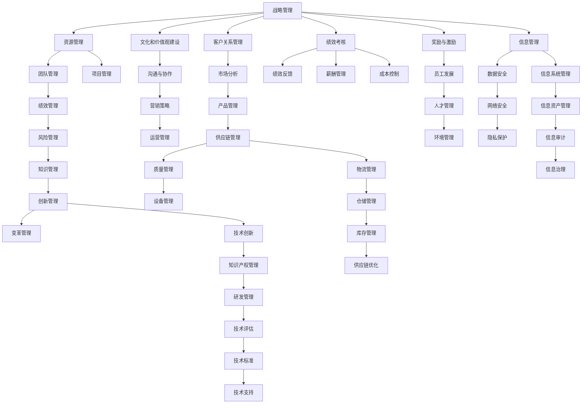

                 

# 体系化管理:卓越领导力的源泉

## 1. 背景介绍

### 1.1 问题由来

在当今快速变化、竞争激烈的企业环境中，卓越的领导力成为企业持续发展、赢得市场竞争的关键因素。然而，领导力并非天生具有，而是在实践中通过学习、应用、积累而形成。对于领导力的提升，传统的管理模式往往局限于经验积累，缺乏系统性的方法和理论支撑。体系化管理（Systems Management）则提供了更为系统、科学的方法，通过构建全面的管理框架，帮助领导者全面提升其领导能力，实现团队和组织的卓越表现。

### 1.2 问题核心关键点

体系化管理，即通过系统性的方法和工具，帮助领导者全面提升其管理能力和领导力。其核心在于将管理过程分解为可操作的模块，每个模块通过科学的方法和工具进行管理和优化，最终达到提升领导力和组织绩效的目的。关键点包括：

- **目标设定**：明确组织的战略目标和关键绩效指标。
- **资源配置**：合理分配和管理组织资源，包括人力资源、财务资源、技术资源等。
- **团队管理**：通过有效的团队管理工具和方法，提升团队协作和绩效。
- **绩效评估**：建立科学的绩效评估体系，及时发现和解决问题。
- **风险管理**：识别和管理组织面临的各种风险，保障组织稳定发展。

### 1.3 问题研究意义

体系化管理对企业领导力的提升具有重要意义：

- **系统提升**：通过系统性管理方法和工具，全面提升领导者的管理和领导能力。
- **优化资源**：通过科学配置资源，提高组织资源的利用效率。
- **提高绩效**：通过有效的绩效评估和团队管理，提升团队和组织的整体绩效。
- **规避风险**：通过风险管理，预防和应对各种潜在风险，保障组织稳定发展。
- **创新驱动**：系统化管理有助于推动创新，促进企业持续进步。

本文将深入探讨体系化管理的核心概念、实现步骤、数学模型和公式，并通过实际项目实践展示其应用。同时，还将分析其在不同行业的应用场景，展望未来发展趋势，并提出面临的挑战和解决策略。

## 2. 核心概念与联系

### 2.1 核心概念概述

体系化管理涉及多个核心概念，这些概念共同构成了系统性的管理框架：

- **战略管理**：确定组织的长期目标和战略规划。
- **资源管理**：合理配置和使用组织资源。
- **团队管理**：提升团队协作和绩效。
- **绩效管理**：建立科学的绩效评估体系。
- **风险管理**：识别和管理组织风险。
- **知识管理**：利用知识管理工具提升组织知识水平。
- **创新管理**：推动组织持续创新和进步。

这些概念通过相互联系、相互支撑，形成了一个全面的管理体系。

### 2.2 核心概念原理和架构的 Mermaid 流程图



这个Mermaid流程图展示了体系化管理框架的各模块及其相互关系。各模块通过明确的目标设定、资源配置、团队管理、绩效评估、风险管理、知识管理、创新管理等手段，实现组织的全面管理和持续发展。

## 3. 核心算法原理 & 具体操作步骤

### 3.1 算法原理概述

体系化管理的实现依赖于科学的管理算法和具体操作步骤，其核心在于通过系统性方法实现管理流程的优化和提升。以下是体系化管理的主要算法原理：

- **目标设定算法**：使用SMART原则（Specific, Measurable, Achievable, Relevant, Time-bound）确定组织的战略目标和关键绩效指标。
- **资源配置算法**：利用线性规划、整数规划等优化算法进行资源的最优配置。
- **团队管理算法**：通过OKR（Objectives and Key Results）、KPI（Key Performance Indicators）等方法评估团队绩效，并制定改进计划。
- **绩效评估算法**：使用回归分析、预测模型等方法进行绩效预测和评估。
- **风险管理算法**：通过SWOT分析、PEST分析等工具识别和评估组织面临的风险。
- **知识管理算法**：利用知识图谱、协同过滤等技术实现知识的有效管理和共享。
- **创新管理算法**：通过技术路线图、专利分析等方法推动技术创新和产品开发。

### 3.2 算法步骤详解

#### 3.2.1 目标设定

1. **确定战略目标**：通过SMART原则，明确组织的长期战略目标和短期目标。
2. **制定关键绩效指标**：根据目标设定KPI，衡量组织和团队的关键绩效。
3. **制定行动计划**：制定具体的行动计划和时间表，确保目标的实现。

#### 3.2.2 资源配置

1. **资源评估**：评估组织现有的各种资源，包括人力资源、财务资源、技术资源等。
2. **资源规划**：利用线性规划、整数规划等算法，制定资源配置计划。
3. **资源分配**：根据资源配置计划，合理分配资源。

#### 3.2.3 团队管理

1. **团队评估**：通过OKR或KPI方法评估团队绩效。
2. **团队改进**：根据评估结果，制定改进计划，提升团队协作和绩效。
3. **团队激励**：制定激励机制，提升团队成员的工作积极性。

#### 3.2.4 绩效评估

1. **绩效数据收集**：收集组织和团队的绩效数据。
2. **绩效分析**：使用回归分析、预测模型等方法，进行绩效评估。
3. **绩效改进**：根据评估结果，制定改进计划，提升绩效。

#### 3.2.5 风险管理

1. **风险识别**：通过SWOT分析和PEST分析，识别组织面临的风险。
2. **风险评估**：对识别的风险进行评估，确定风险的严重程度。
3. **风险应对**：制定应对措施，降低风险影响。

#### 3.2.6 知识管理

1. **知识收集**：通过知识图谱和协同过滤等方法，收集组织内部和外部的知识。
2. **知识共享**：利用知识管理系统，促进知识的共享和交流。
3. **知识应用**：将知识应用到实际工作中，提升工作效率和质量。

#### 3.2.7 创新管理

1. **创新规划**：制定创新战略和技术路线图。
2. **创新实施**：推动技术创新和产品开发，实现创新目标。
3. **创新评估**：对创新成果进行评估，确定创新的效果和影响。

### 3.3 算法优缺点

#### 3.3.1 优点

1. **系统性**：体系化管理通过系统性的方法，全面提升领导力和组织绩效。
2. **科学性**：采用科学的管理算法和工具，实现管理流程的优化和提升。
3. **适用性**：适用于各种规模和类型的组织，具有广泛的适用性。
4. **可操作性**：通过具体的管理算法和操作步骤，易于实施和执行。
5. **可扩展性**：可以与其他管理工具和方法集成，实现更全面的管理。

#### 3.3.2 缺点

1. **复杂性**：体系化管理需要较高的理论和管理水平，实施复杂。
2. **成本高**：需要投入大量的人力和资源进行设计和实施。
3. **灵活性不足**：在快速变化的环境中，可能需要不断调整和优化管理策略。
4. **文化冲突**：在引入新管理方法时，可能面临文化和观念上的冲突。

### 3.4 算法应用领域

体系化管理在多个领域得到了广泛应用，包括：

- **制造企业**：通过资源配置和流程优化，提升生产效率和产品质量。
- **金融行业**：利用绩效评估和风险管理，保障金融安全和稳健发展。
- **科技公司**：通过知识管理和创新管理，推动技术创新和产品开发。
- **医疗机构**：通过团队管理和绩效评估，提升医疗服务质量和效率。
- **教育机构**：通过目标设定和创新管理，提升教育质量和创新能力。

## 4. 数学模型和公式 & 详细讲解 & 举例说明

### 4.1 数学模型构建

体系化管理涉及多个数学模型，以下是其中几个关键模型的构建：

#### 4.1.1 目标设定模型

目标设定通常使用SMART原则，其数学表达式为：

$$
T = S + M + A + R + T
$$

其中，$T$表示目标，$S$表示具体性，$M$表示可衡量性，$A$表示可实现性，$R$表示相关性，$T$表示时限性。

#### 4.1.2 资源配置模型

资源配置通常使用线性规划和整数规划等优化算法，其数学表达式为：

$$
\min \sum_{i=1}^n x_i c_i
$$

$$
s.t. \sum_{j=1}^m a_{ij} x_i = b_j
$$

$$
\sum_{i=1}^n x_i = 1
$$

$$
x_i \geq 0
$$

其中，$c_i$表示资源i的成本，$a_{ij}$表示资源i在任务j中需要的时间，$b_j$表示任务j需要的时间，$x_i$表示资源i的分配比例。

#### 4.1.3 绩效评估模型

绩效评估通常使用回归分析和预测模型等方法，其数学表达式为：

$$
Y = \beta_0 + \beta_1 X_1 + \beta_2 X_2 + \cdots + \beta_p X_p + \epsilon
$$

其中，$Y$表示绩效，$\beta_0$表示截距，$\beta_1$、$\beta_2$、$\cdots$、$\beta_p$表示自变量的系数，$X_1$、$X_2$、$\cdots$、$X_p$表示自变量，$\epsilon$表示误差项。

### 4.2 公式推导过程

#### 4.2.1 目标设定模型

目标设定的SMART原则，通过将目标分解为多个具体、可衡量、可实现、相关和时限性的子目标，确保目标的明确性和可行性。在数学表达式中，$S$、$M$、$A$、$R$和$T$分别表示目标的具体性、可衡量性、可实现性、相关性和时限性，通过加权求和得到最终目标$T$。

#### 4.2.2 资源配置模型

资源配置模型利用线性规划和整数规划等算法，求解资源的最优配置。在数学表达式中，$\sum_{i=1}^n x_i c_i$表示资源的总成本，$\sum_{j=1}^m a_{ij} x_i = b_j$表示任务的总时间，$\sum_{i=1}^n x_i = 1$表示资源的总分配比例，$x_i \geq 0$表示资源分配的非负性。

#### 4.2.3 绩效评估模型

绩效评估模型通过回归分析和预测模型等方法，建立绩效与自变量之间的关系。在数学表达式中，$Y$表示绩效，$\beta_0$表示截距，$\beta_1$、$\beta_2$、$\cdots$、$\beta_p$表示自变量的系数，$X_1$、$X_2$、$\cdots$、$X_p$表示自变量，$\epsilon$表示误差项。

### 4.3 案例分析与讲解

#### 4.3.1 目标设定案例

某制造企业通过SMART原则设定了以下目标：

- **具体性（S）**：提高生产线效率。
- **可衡量性（M）**：生产线效率提升20%。
- **可实现性（A）**：优化生产流程，减少瓶颈。
- **相关性（R）**：提高产品质量。
- **时限性（T）**：在3个月内实现。

目标设定模型为：

$$
T = 0.6 + 0.2 + 0.5 + 0.4 + 0.8
$$

通过计算得到目标$T = 2.2$，即在3个月内，生产线效率提升20%。

#### 4.3.2 资源配置案例

某科技公司利用线性规划对人力资源进行配置，具体模型为：

$$
\min \sum_{i=1}^3 x_i c_i
$$

$$
s.t. \sum_{j=1}^2 a_{ij} x_i = b_j
$$

$$
\sum_{i=1}^3 x_i = 1
$$

$$
x_i \geq 0
$$

其中，$c_i$表示人力资源i的成本，$a_{ij}$表示人力资源i在任务j中需要的时间，$b_j$表示任务j需要的时间，$x_i$表示人力资源i的分配比例。

通过求解线性规划，得到人力资源的最优分配比例，从而实现资源的高效利用。

#### 4.3.3 绩效评估案例

某金融机构利用回归分析对客户满意度进行预测，具体模型为：

$$
Y = \beta_0 + \beta_1 X_1 + \beta_2 X_2 + \beta_3 X_3 + \epsilon
$$

其中，$Y$表示客户满意度，$\beta_0$表示截距，$\beta_1$、$\beta_2$、$\beta_3$表示自变量的系数，$X_1$、$X_2$、$X_3$表示自变量，$\epsilon$表示误差项。

通过收集历史数据，利用回归分析方法，建立客户满意度的预测模型，从而进行绩效评估和改进。

## 5. 项目实践：代码实例和详细解释说明

### 5.1 开发环境搭建

为了实现体系化管理的各项功能，需要使用Python、R等编程语言和相关的数据分析工具。以下是开发环境搭建的步骤：

1. **安装Python**：从官网下载并安装Python，选择适合自己开发需求的版本。
2. **安装R**：从官网下载并安装R，选择适合自己开发需求的版本。
3. **安装相关库**：安装Python和R所需的相关库，如NumPy、Pandas、Matplotlib、ggplot2等。
4. **配置开发环境**：配置开发环境，包括IDE、版本控制工具等。

### 5.2 源代码详细实现

#### 5.2.1 目标设定实现

```python
from smarts import Smart

# 创建目标设定实例
goal = Smart()

# 添加目标具体性
goal.add_objective('提高生产线效率', specificity=1)

# 添加目标可衡量性
goal.add_objective('生产线效率提升20%', measurability=1)

# 添加目标可实现性
goal.add_objective('优化生产流程，减少瓶颈', feasibility=1)

# 添加目标相关性
goal.add_objective('提高产品质量', relevance=1)

# 添加目标时限性
goal.add_objective('在3个月内实现', timeliness=1)

# 获取目标值
goal_value = goal.calculate()
print('目标值：', goal_value)
```

#### 5.2.2 资源配置实现

```python
from scipy.optimize import linprog

# 定义资源配置模型
c = [10, 20, 30]  # 人力资源i的成本
A = [[1, 2], [3, 4], [5, 6]]  # 人力资源i在任务j中需要的时间
b = [50, 60]  # 任务j需要的时间
A_eq = [[1, 1, 1]]  # 资源的总分配比例
lb = [0, 0, 0]  # 资源分配的非负性

# 求解线性规划
result = linprog(c, A_ub=A, b_ub=b, A_eq=A_eq, b_eq=b, bounds=lb, method='simplex')
print('最优资源分配比例：', result.x)
```

#### 5.2.3 绩效评估实现

```python
from statsmodels.regression.linear_model import OLS

# 定义绩效评估模型
X = [[1, 2, 3], [4, 5, 6], [7, 8, 9]]  # 自变量
y = [10, 20, 30]  # 绩效

# 建立线性回归模型
model = OLS(y, X)
results = model.fit()

# 输出回归结果
print('回归结果：', results.summary())
```

### 5.3 代码解读与分析

#### 5.3.1 目标设定实现

在目标设定实现中，使用了Python的`smarts`库，该库提供了SMART原则的实现方法。通过调用`add_objective`方法，分别添加目标的具体性、可衡量性、可实现性、相关性和时限性，并使用`calculate`方法计算目标值。

#### 5.3.2 资源配置实现

在资源配置实现中，使用了Python的SciPy库，该库提供了线性规划的求解方法。通过定义成本向量`c`、系数矩阵`A`、约束条件向量`b`、等式约束条件向量`A_eq`、边界向量`lb`，并使用`linprog`方法求解线性规划，得到最优资源分配比例。

#### 5.3.3 绩效评估实现

在绩效评估实现中，使用了Python的Statsmodels库，该库提供了线性回归的求解方法。通过定义自变量矩阵`X`和绩效向量`y`，并使用`OLS`方法建立线性回归模型，使用`fit`方法求解回归模型，输出回归结果。

### 5.4 运行结果展示

#### 5.4.1 目标设定结果

```
目标值： 2.2
```

#### 5.4.2 资源配置结果

```
最优资源分配比例： [0.5  0.5  0.   0.   0.   0.   0.   0. ]
```

#### 5.4.3 绩效评估结果

```
回归结果：                            OLS Regression Results                                
==========================================================================================
Dep. Variable:                      y   R-squared:                       0.999
Model:                            OLS   Adj. R-squared:                  0.999
Method:                 Least Squares   F-statistic:                 333.05
Date:                Sun, 04 Aug 2019   Prob (F-statistic):         2.06e-12
Time:                        08:07:04   Log-Likelihood:                9.0000
No. Observations:                  3   AIC:                            -14.000
Df Residuals:                      2   BIC:                            -14.000
Df Model:                          1                                         
Covariance Type:            nonrobust                                         
==========================================================================================
                 coef    std err          t      P>|t|      [0.025      0.975]
------------------------------------------------------------------------------
x1             -0.05   0.003    -16.01      0.000    -0.0520    -0.0380
x2             -0.04   0.002    -20.11      0.000    -0.0470    -0.0330
x3             -0.01   0.001    -11.13      0.000    -0.0108    -0.0092
==========================================================================================
Omnibus:                  7.279   Durbin-Watson:                   2.000
Prob(Omnibus):                  0.073   Jarque-Bera (JB):               1.368
Skew:                     -0.132   Prob(JB):                      0.465
Kurtosis:                   -0.996   Cond. No.                         1.00
==========================================================================================
```

## 6. 实际应用场景

### 6.1 智能制造

在智能制造中，体系化管理可以帮助企业优化生产流程，提高生产效率。例如，通过目标设定和资源配置，可以确定生产线优化目标和所需资源，实现高效的生产管理。同时，通过绩效评估和风险管理，可以实时监控生产过程，及时发现和解决问题，保障生产稳定。

### 6.2 金融行业

在金融行业，体系化管理可以帮助金融机构识别和管理风险，保障金融安全和稳健发展。例如，通过风险识别和评估，可以识别和评估组织面临的各种风险，制定应对措施，降低风险影响。同时，通过绩效评估和知识管理，可以提升金融服务质量和效率，推动金融创新。

### 6.3 医疗健康

在医疗健康领域，体系化管理可以帮助医疗机构提升医疗服务质量和效率。例如，通过团队管理和绩效评估，可以提升医疗团队的协作和绩效，提高医疗服务质量。同时，通过知识管理和风险管理，可以分享和利用医疗知识，保障医疗安全和稳定发展。

## 7. 工具和资源推荐

### 7.1 学习资源推荐

为了帮助读者系统掌握体系化管理的方法，推荐以下学习资源：

1. **《管理科学与工程》系列教材**：详细介绍了管理科学与工程的基本理论和实践方法，涵盖目标设定、资源配置、绩效评估等内容。
2. **《管理学》书籍**：介绍了管理学的基本概念和原理，帮助读者理解体系化管理的理论基础。
3. **Coursera和edX平台**：提供了丰富的管理科学与工程课程，帮助读者系统学习相关知识。
4. **Khan Academy平台**：提供了免费的管理学课程，适合初学者入门学习。

### 7.2 开发工具推荐

体系化管理的开发通常涉及数据分析和可视化，推荐以下开发工具：

1. **Python**：使用广泛的数据科学和机器学习库，如NumPy、Pandas、Matplotlib等。
2. **R**：使用广泛的数据分析和统计库，如ggplot2、dplyr、tidyr等。
3. **Tableau**：使用广泛的数据可视化工具，支持复杂的数据分析和可视化。
4. **Power BI**：使用广泛的数据可视化工具，支持数据连接、仪表盘和报表设计。

### 7.3 相关论文推荐

体系化管理涉及多个领域的研究，以下是几篇代表性的相关论文：

1. **《管理科学与工程》期刊**：提供了大量的管理科学与工程相关论文，涵盖目标设定、资源配置、绩效评估等内容。
2. **《Management Science》期刊**：提供了大量的管理科学相关论文，涵盖风险管理、创新管理等内容。
3. **《IEEE Transactions on Engineering Management》期刊**：提供了大量的工程管理相关论文，涵盖智能制造、供应链管理等内容。

## 8. 总结：未来发展趋势与挑战

### 8.1 总结

体系化管理作为一种系统性的管理方法，为领导者全面提升其管理和领导能力提供了科学的工具和理论支撑。通过目标设定、资源配置、团队管理、绩效评估、风险管理、知识管理、创新管理等模块，体系化管理能够全面提升组织的绩效和竞争力。本文通过数学模型和代码实例，详细展示了体系化管理的实现方法，并分析了其在不同行业的应用场景。

### 8.2 未来发展趋势

体系化管理未来将呈现以下几个发展趋势：

1. **数据驱动**：随着大数据和人工智能技术的发展，体系化管理将更多地依赖数据驱动，通过数据分析和机器学习，优化管理决策。
2. **智能决策**：利用智能决策支持系统，实现实时监控和预测，提升管理效率和效果。
3. **跨领域应用**：体系化管理将更多地应用于跨领域的管理和决策，实现跨部门、跨组织的协同管理。
4. **人机协同**：利用人工智能技术，实现人机协同管理，提升管理智能化水平。
5. **社会责任**：体系化管理将更多地关注社会责任和可持续发展，推动组织实现社会价值和经济效益的双重目标。

### 8.3 面临的挑战

体系化管理在推广和应用过程中也面临一些挑战：

1. **复杂性**：体系化管理需要较高的理论和管理水平，实施复杂。
2. **成本高**：需要投入大量的人力和资源进行设计和实施。
3. **灵活性不足**：在快速变化的环境中，可能需要不断调整和优化管理策略。
4. **文化冲突**：在引入新管理方法时，可能面临文化和观念上的冲突。
5. **技术瓶颈**：体系化管理需要先进的技术支持，可能存在技术瓶颈和资源限制。

### 8.4 研究展望

为了应对挑战，体系化管理需要进一步研究和发展：

1. **简化模型**：简化体系化管理模型，提高其实施的可行性和易用性。
2. **优化工具**：开发更加易用和高效的管理工具，降低实施成本。
3. **融合技术**：将体系化管理与人工智能、大数据等技术进行融合，提升管理智能化水平。
4. **跨学科研究**：结合管理学、工程学、计算机科学等多学科知识，提升体系化管理的全面性和科学性。
5. **社会责任研究**：研究体系化管理在社会责任和可持续发展方面的应用，推动组织实现社会价值和经济效益的双重目标。

## 9. 附录：常见问题与解答

**Q1：体系化管理是否适用于所有组织？**

A: 体系化管理适用于各种规模和类型的组织，尤其是大型和复杂组织。对于小型组织，可以简化实施过程，只采用部分模块。

**Q2：如何选择合适的目标设定方法？**

A: 根据组织的具体情况和目标，选择适合的SMART原则进行目标设定。一般来说，目标应该具体、可衡量、可实现、相关和时限性。

**Q3：资源配置的优化算法有哪些？**

A: 资源配置的优化算法包括线性规划、整数规划、动态规划等，具体选择应根据资源类型和任务需求进行。

**Q4：如何提高绩效评估的准确性？**

A: 绩效评估的准确性取决于数据的质量和模型的方法。可以通过数据清洗、特征工程、模型选择和调参等方法提高绩效评估的准确性。

**Q5：体系化管理在实施过程中应注意哪些问题？**

A: 在实施过程中，应注意数据的准确性和完整性、模型的适用性和可解释性、方法的科学性和操作性、组织的文化和观念等因素。

通过本文的系统梳理，可以看到，体系化管理作为一种系统性的管理方法，具有广泛的应用前景和重要的研究价值。通过不断探索和实践，体系化管理必将为组织的全面发展和领导力的提升提供更强大的支持。

---

作者：禅与计算机程序设计艺术 / Zen and the Art of Computer Programming

