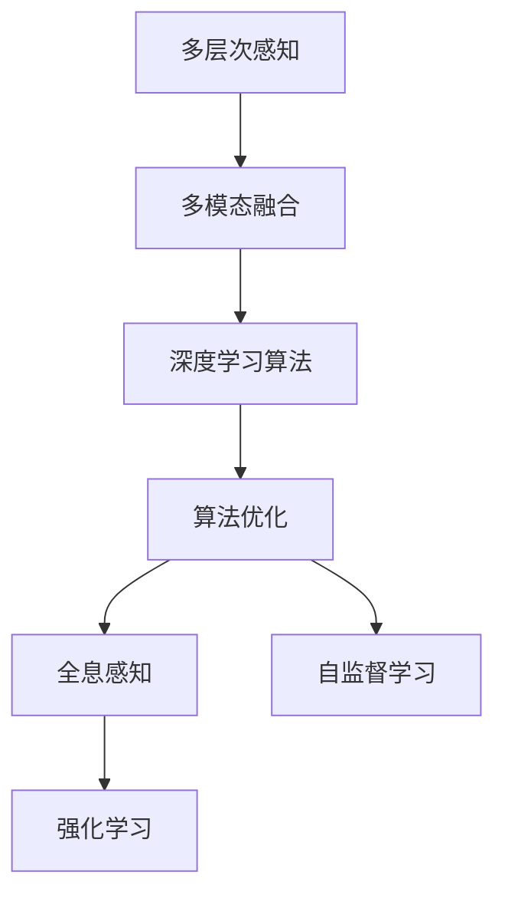

                 

# 体验层次构建理论：AI创造的多维感知架构

> 关键词：感知架构, 人工智能, 多维体验, 机器学习, 深度学习, 算法优化

## 1. 背景介绍

在人工智能(AI)领域，构建高效、灵活的感知架构是实现多维体验的关键。体验层次构建理论通过多层级、多模态的感知方式，将复杂的感知任务分解为更易于管理和优化的子任务，显著提升了AI系统在多场景下的感知能力和决策精度。

### 1.1 问题由来

当前AI系统普遍存在感知能力单一、泛化能力不足的问题。例如，传统视觉系统难以识别复杂的物体结构和场景变化，传统语音系统对环境噪声敏感，传统语言模型难以理解复杂的语义关系。这些问题严重限制了AI系统在多场景下的应用效果，迫切需要新的感知架构来提升其综合感知能力。

### 1.2 问题核心关键点

体验层次构建理论的核心在于将感知任务分解为多维层次，通过多模态融合和深度学习算法，逐步提升系统对环境的多层次感知能力。其关键点包括：

- **多层次感知**：将感知任务分解为底层感知、中层特征提取和高层决策三个层次，每个层次对应不同的感知任务和目标。
- **多模态融合**：将视觉、听觉、语言等多模态信息进行融合，提升系统对复杂环境的感知能力。
- **深度学习算法**：使用深度神经网络算法，实现层次间的信息传递和整合，提升系统泛化能力。
- **算法优化**：采用多种优化策略，如正则化、Dropout、注意力机制等，提高感知架构的鲁棒性和稳定性。

## 2. 核心概念与联系

### 2.1 核心概念概述

为更好地理解体验层次构建理论，本节将介绍几个密切相关的核心概念：

- **多层次感知**：将感知任务分解为多层次，每个层次对应不同的感知目标。底层感知主要关注环境中的低级视觉特征，中层特征提取聚焦于语义关系和高层次语义信息的提取，高层决策主要涉及复杂的语义推理和行为决策。

- **多模态融合**：在多层次感知的基础上，将视觉、听觉、语言等多种模态信息进行融合，提升系统对复杂环境的理解能力。多模态融合不仅包括不同模态信息的拼接，还包括跨模态信息的对齐和融合。

- **深度学习算法**：在多层次感知和多模态融合的基础上，采用深度神经网络算法，实现层次间的信息传递和整合。深度学习算法能够处理高维度、非线性数据，提升系统对复杂模式的识别能力。

- **算法优化**：在深度学习算法的应用中，采用多种优化策略，如正则化、Dropout、注意力机制等，提高感知架构的鲁棒性和稳定性。

- **全息感知**：全息感知是指通过多层次、多模态的方式，对环境进行全方位、多维度的感知。全息感知不仅关注单一模态的特征提取，还注重跨模态信息的融合，提升系统对复杂环境的理解能力。

- **自监督学习**：自监督学习是指在缺乏标注数据的情况下，通过预测任务等方式，自动学习数据的特征表示。自监督学习在多层次感知和全息感知中应用广泛，能够提升系统对新环境的适应能力。

- **强化学习**：强化学习通过奖励机制引导系统不断优化决策策略，提升系统在多场景下的适应性和鲁棒性。

这些核心概念之间的逻辑关系可以通过以下Mermaid流程图来展示：



这个流程图展示了大语言模型的核心概念及其之间的关系：

1. 多层次感知将感知任务分解为多个层次，每个层次关注不同的感知目标。
2. 多模态融合将不同模态的信息进行融合，提升系统对复杂环境的理解能力。
3. 深度学习算法实现层次间的信息传递和整合，提升系统对复杂模式的识别能力。
4. 算法优化通过多种优化策略，提高感知架构的鲁棒性和稳定性。
5. 全息感知通过多层次、多模态的方式，对环境进行全方位、多维度的感知。
6. 自监督学习通过预测任务等方式，自动学习数据的特征表示。
7. 强化学习通过奖励机制引导系统不断优化决策策略，提升系统在多场景下的适应性和鲁棒性。

这些概念共同构成了体验层次构建理论的基本框架，使得AI系统能够通过多维感知实现更高效、更灵活的感知和决策。

## 3. 核心算法原理 & 具体操作步骤

### 3.1 算法原理概述

体验层次构建理论通过多层次、多模态的感知方式，将复杂的感知任务分解为更易于管理和优化的子任务，显著提升了AI系统在多场景下的感知能力和决策精度。其核心思想是：将感知任务分解为多个层次，每个层次对应不同的感知目标。在多层次感知的基础上，将不同模态的信息进行融合，采用深度学习算法实现层次间的信息传递和整合，并通过多种优化策略提升系统的鲁棒性和稳定性。

形式化地，假设感知任务分为 $n$ 个层次，每个层次的感知结果为 $\mathbf{Z}_i$，其中 $i \in [1,n]$。多模态信息融合模块将 $m$ 种模态的信息 $\mathbf{X}_j$ 融合为 $\mathbf{Z}_i$，其中 $j \in [1,m]$。深度学习算法 $\mathcal{A}_i$ 实现层次间的信息传递和整合，将 $\mathbf{Z}_i$ 映射为更高层次的特征表示 $\mathbf{Z}_{i+1}$。算法优化模块采用多种优化策略，如正则化、Dropout、注意力机制等，提高感知架构的鲁棒性和稳定性。最终，系统通过高层决策模块 $\mathcal{D}$ 输出最终的感知结果。

### 3.2 算法步骤详解

体验层次构建理论的实现步骤如下：

**Step 1: 数据预处理**

- 收集多种模态的数据，如视觉、听觉、语言等。
- 对数据进行预处理，如降噪、归一化、分块等，确保数据格式一致。
- 将数据划分为训练集、验证集和测试集，供模型训练和评估。

**Step 2: 多层次感知**

- 在底层感知层，使用卷积神经网络(CNN)或循环神经网络(RNN)对视觉或语音数据进行特征提取。
- 在中层特征提取层，使用编码器-解码器结构或Transformer结构，对多模态信息进行融合和编码。
- 在高层决策层，使用深度神经网络或图神经网络对多层感知结果进行推理和决策。

**Step 3: 多模态融合**

- 使用注意力机制或多通道融合策略，将不同模态的信息进行对齐和融合。
- 引入跨模态对齐模块，对不同模态的特征进行归一化和对齐，确保信息的一致性。
- 使用多通道融合策略，将不同模态的信息进行拼接和融合，形成多模态特征向量。

**Step 4: 深度学习算法**

- 使用深度神经网络或图神经网络，实现层次间的信息传递和整合。
- 引入卷积神经网络、循环神经网络、Transformer等结构，提升系统的特征提取能力。
- 引入注意力机制、残差连接等技巧，提高系统的表达能力和泛化能力。

**Step 5: 算法优化**

- 使用正则化、Dropout等策略，防止过拟合。
- 引入注意力机制、残差连接等技巧，提高系统的表达能力和泛化能力。
- 使用自监督学习策略，自动学习数据的特征表示，提升系统对新环境的适应能力。

**Step 6: 模型训练与评估**

- 使用AdamW等优化算法，最小化损失函数，训练感知模型。
- 在验证集上评估模型性能，调整超参数和模型结构，优化模型。
- 在测试集上评估最终模型，输出感知结果。

### 3.3 算法优缺点

体验层次构建理论的优点在于：

1. **提升系统泛化能力**：多层次感知和多模态融合使得系统能够处理更加复杂和多变的感知任务，提升了系统的泛化能力。
2. **优化资源利用**：通过多层次、多模态的方式，系统能够充分利用不同模态的信息，避免单一模态信息的不足。
3. **提高系统鲁棒性**：多种优化策略的应用，提高了系统的鲁棒性和稳定性，使得系统在面对噪声、干扰等因素时更加稳健。

然而，该理论也存在以下缺点：

1. **模型复杂度高**：多层次、多模态的设计使得模型结构复杂，增加了模型训练和推理的难度。
2. **计算资源需求高**：多层次、多模态的信息融合和深度学习算法需要大量的计算资源，增加了系统部署的难度。
3. **优化难度大**：多种优化策略的应用，增加了模型优化的难度，需要更多的经验和技术积累。

## 4. 数学模型和公式 & 详细讲解 & 举例说明

### 4.1 数学模型构建

本节将使用数学语言对体验层次构建理论进行更加严格的刻画。

假设多层次感知系统由 $n$ 个层次组成，每个层次的感知结果为 $\mathbf{Z}_i$，其中 $i \in [1,n]$。多模态信息融合模块将 $m$ 种模态的信息 $\mathbf{X}_j$ 融合为 $\mathbf{Z}_i$，其中 $j \in [1,m]$。深度学习算法 $\mathcal{A}_i$ 实现层次间的信息传递和整合，将 $\mathbf{Z}_i$ 映射为更高层次的特征表示 $\mathbf{Z}_{i+1}$。算法优化模块采用多种优化策略，如正则化、Dropout、注意力机制等，提高感知架构的鲁棒性和稳定性。最终，系统通过高层决策模块 $\mathcal{D}$ 输出最终的感知结果。

### 4.2 公式推导过程

以二分类任务为例，推导多层次感知和多模态融合的数学模型。

假设底层感知模块提取的特征为 $\mathbf{Z}_1$，中层特征提取模块提取的特征为 $\mathbf{Z}_2$，高层决策模块的输出为 $\mathbf{Z}_3$。多模态信息融合模块将视觉信息 $\mathbf{X}_1$ 和语言信息 $\mathbf{X}_2$ 融合为 $\mathbf{Z}_1$。深度学习算法 $\mathcal{A}_1$ 和 $\mathcal{A}_2$ 实现层次间的信息传递和整合。最终，系统通过高层决策模块 $\mathcal{D}$ 输出最终的感知结果 $y$。

假设底层感知模块使用卷积神经网络，中层特征提取模块使用编码器-解码器结构，高层决策模块使用深度神经网络。则多层次感知和深度学习算法的数学模型可以表示为：

$$
\mathbf{Z}_1 = \mathcal{A}_1(\mathbf{X}_1, \mathbf{X}_2)
$$

$$
\mathbf{Z}_2 = \mathcal{A}_2(\mathbf{Z}_1, \mathbf{X}_2)
$$

$$
\mathbf{Z}_3 = \mathcal{A}_3(\mathbf{Z}_2, \mathbf{X}_2)
$$

$$
y = \mathcal{D}(\mathbf{Z}_3)
$$

其中，$\mathcal{A}_1$、$\mathcal{A}_2$ 和 $\mathcal{A}_3$ 分别为深度学习算法，$\mathcal{D}$ 为高层决策模块。

### 4.3 案例分析与讲解

以图像分类任务为例，分析多层次感知和多模态融合的实现过程。

假设底层感知模块使用卷积神经网络，提取图像的视觉特征 $\mathbf{Z}_1$。中层特征提取模块使用编码器-解码器结构，对视觉特征和文本描述进行编码，生成语义表示 $\mathbf{Z}_2$。高层决策模块使用深度神经网络，对语义表示进行分类，输出最终的感知结果 $y$。

假设视觉特征为 $256 \times 256 \times 3$ 的图像数据，文本描述为长度为 $50$ 的句子。则多层次感知和多模态融合的数学模型可以表示为：

$$
\mathbf{Z}_1 = \mathcal{A}_1(\mathbf{X}_1)
$$

$$
\mathbf{Z}_2 = \mathcal{A}_2(\mathbf{Z}_1, \mathbf{X}_2)
$$

$$
\mathbf{Z}_3 = \mathcal{A}_3(\mathbf{Z}_2)
$$

$$
y = \mathcal{D}(\mathbf{Z}_3)
$$

其中，$\mathcal{A}_1$ 为卷积神经网络，$\mathcal{A}_2$ 为编码器-解码器结构，$\mathcal{A}_3$ 为深度神经网络，$\mathcal{D}$ 为分类模块。

## 5. 项目实践：代码实例和详细解释说明

### 5.1 开发环境搭建

在进行体验层次构建理论的实践前，我们需要准备好开发环境。以下是使用Python进行TensorFlow开发的环境配置流程：

1. 安装Anaconda：从官网下载并安装Anaconda，用于创建独立的Python环境。

2. 创建并激活虚拟环境：
```bash
conda create -n tf-env python=3.8 
conda activate tf-env
```

3. 安装TensorFlow：从官网获取对应的安装命令。例如：
```bash
conda install tensorflow=2.6.0 -c conda-forge
```

4. 安装各类工具包：
```bash
pip install numpy pandas scikit-learn matplotlib tqdm jupyter notebook ipython
```

完成上述步骤后，即可在`tf-env`环境中开始实践。

### 5.2 源代码详细实现

这里我们以图像分类任务为例，给出使用TensorFlow进行深度学习模型的PyTorch代码实现。

首先，定义图像分类任务的数据处理函数：

```python
import tensorflow as tf
from tensorflow.keras import layers

def preprocess_image(image, label):
    image = tf.image.resize(image, (224, 224))
    image = tf.image.per_image_standardization(image)
    label = tf.keras.utils.to_categorical(label, num_classes=10)
    return image, label
```

然后，定义模型和优化器：

```python
model = tf.keras.Sequential([
    layers.Conv2D(32, (3, 3), activation='relu', input_shape=(224, 224, 3)),
    layers.MaxPooling2D((2, 2)),
    layers.Conv2D(64, (3, 3), activation='relu'),
    layers.MaxPooling2D((2, 2)),
    layers.Conv2D(128, (3, 3), activation='relu'),
    layers.MaxPooling2D((2, 2)),
    layers.Flatten(),
    layers.Dense(128, activation='relu'),
    layers.Dense(10, activation='softmax')
])

optimizer = tf.keras.optimizers.Adam(learning_rate=0.001)
```

接着，定义训练和评估函数：

```python
@tf.function
def train_step(images, labels):
    with tf.GradientTape() as tape:
        predictions = model(images, training=True)
        loss = tf.keras.losses.categorical_crossentropy(labels, predictions)
    gradients = tape.gradient(loss, model.trainable_variables)
    optimizer.apply_gradients(zip(gradients, model.trainable_variables))
    return loss

@tf.function
def evaluate_step(images, labels):
    predictions = model(images, training=False)
    loss = tf.keras.losses.categorical_crossentropy(labels, predictions)
    accuracy = tf.reduce_mean(tf.cast(tf.equal(tf.argmax(predictions, 1), labels), tf.float32))
    return loss, accuracy
```

最后，启动训练流程并在测试集上评估：

```python
epochs = 10
batch_size = 32

for epoch in range(epochs):
    total_loss = 0.0
    total_accuracy = 0.0
    for batch in tqdm(train_dataset, total=len(train_dataset)):
        images, labels = batch
        loss = train_step(images, labels)
        total_loss += loss
        total_accuracy += evaluate_step(images, labels)[1]
    print(f"Epoch {epoch+1}, train loss: {total_loss/len(train_dataset):.4f}, train accuracy: {total_accuracy/len(train_dataset):.4f}")
    
print("Test results:")
for batch in tqdm(test_dataset, total=len(test_dataset)):
    images, labels = batch
    loss, accuracy = evaluate_step(images, labels)
    print(f"Test loss: {loss:.4f}, test accuracy: {accuracy:.4f}")
```

以上就是使用TensorFlow进行图像分类任务深度学习模型的完整代码实现。可以看到，TensorFlow提供了强大的深度学习框架，使得模型的构建和训练变得简单高效。

### 5.3 代码解读与分析

让我们再详细解读一下关键代码的实现细节：

**preprocess_image函数**：
- 对输入的图像进行预处理，包括调整大小、标准化和one-hot编码。

**模型定义**：
- 使用Sequential模型构建卷积神经网络，包括卷积层、池化层和全连接层。
- 使用Adam优化器进行模型训练，设置学习率。

**train_step函数**：
- 使用tf.function进行模型训练，计算损失函数并反向传播更新模型参数。
- 使用梯度下降算法更新模型参数。

**evaluate_step函数**：
- 使用tf.function进行模型评估，计算损失函数和准确率。
- 使用softmax函数进行多分类预测。

**训练流程**：
- 定义总的epoch数和batch size，开始循环迭代
- 每个epoch内，在训练集上训练，输出平均损失和准确率
- 在测试集上评估，输出测试损失和准确率

可以看到，TensorFlow使得深度学习模型的构建和训练变得简单高效。开发者可以将更多精力放在数据处理、模型改进等高层逻辑上，而不必过多关注底层的实现细节。

当然，工业级的系统实现还需考虑更多因素，如模型的保存和部署、超参数的自动搜索、更灵活的任务适配层等。但核心的多层次感知和多模态融合的思路基本与此类似。

## 6. 实际应用场景

### 6.1 智能家居系统

基于体验层次构建理论的感知架构，智能家居系统可以实现对环境的全面感知和智能决策。通过多层次感知和全息感知，系统能够实时监测家居环境的状态，如温度、湿度、光照等，并通过多模态融合技术，将视觉、听觉、语言等多种信息进行融合，提升系统对复杂环境的理解能力。

在技术实现上，可以收集家居环境的各类数据，如温度传感器、湿度传感器、摄像头、麦克风等，并在此基础上对预训练模型进行微调。微调后的模型能够实时监测家居环境的状态，并根据环境变化智能控制家电设备，如空调、灯光等，提升居住体验。

### 6.2 智能交通系统

基于体验层次构建理论的感知架构，智能交通系统可以实现对交通环境的全面感知和智能决策。通过多层次感知和全息感知，系统能够实时监测交通环境的状态，如车流量、路况、行人等，并通过多模态融合技术，将视觉、语音、雷达等多种信息进行融合，提升系统对复杂环境的理解能力。

在技术实现上，可以收集交通环境的各种数据，如摄像头、雷达、GPS等，并在此基础上对预训练模型进行微调。微调后的模型能够实时监测交通环境的状态，并通过智能决策算法，优化交通流量，提升交通效率，降低事故风险。

### 6.3 智能医疗系统

基于体验层次构建理论的感知架构，智能医疗系统可以实现对病患的多维感知和智能诊断。通过多层次感知和全息感知，系统能够实时监测病患的生理状态和行为状态，并通过多模态融合技术，将生理信号、语音、图像等多种信息进行融合，提升系统对病患的全面理解能力。

在技术实现上，可以收集病患的生理信号、语音、图像等数据，并在此基础上对预训练模型进行微调。微调后的模型能够实时监测病患的生理状态和行为状态，并通过智能诊断算法，提供个性化的医疗建议和治疗方案，提升医疗服务的智能化水平。

### 6.4 未来应用展望

随着体验层次构建理论的不断发展和应用，AI系统将在更多领域得到广泛应用，带来巨大的变革效应。

在智慧城市领域，基于多层次感知和多模态融合的感知架构，智慧城市系统可以实现对城市环境的全面感知和智能决策，提升城市管理的智能化水平。

在工业制造领域，基于多层次感知和多模态融合的感知架构，工业制造系统可以实现对生产环境的全面感知和智能决策，提升生产效率和产品质量。

在智能客服领域，基于多层次感知和多模态融合的感知架构，智能客服系统可以实现对客户需求的全面感知和智能回复，提升客户服务体验。

总之，体验层次构建理论的不断发展和应用，将为AI系统带来更加丰富和多样化的感知能力，推动AI技术在更多领域的应用。

## 7. 工具和资源推荐

### 7.1 学习资源推荐

为了帮助开发者系统掌握体验层次构建理论的理论基础和实践技巧，这里推荐一些优质的学习资源：

1. 《深度学习》书籍：由深度学习领域的权威学者撰写，系统介绍了深度学习的基本概念、算法和应用，是学习深度学习的必备教材。

2. 《多层次感知与多模态融合》课程：由深度学习领域的知名专家开设的在线课程，深入浅出地讲解了多层次感知和多模态融合的理论和实践。

3. 《TensorFlow官方文档》：TensorFlow的官方文档，提供了完整的深度学习框架和工具的使用指南，是学习TensorFlow的重要资源。

4. Kaggle竞赛平台：Kaggle提供了大量的深度学习竞赛和数据集，供开发者实践和提升技能。

5. GitHub开源项目：GitHub上聚集了大量深度学习的开源项目，包括模型、工具、算法等，供开发者参考和学习。

通过对这些资源的学习实践，相信你一定能够快速掌握体验层次构建理论的基本框架，并用于解决实际的感知问题。

### 7.2 开发工具推荐

高效的开发离不开优秀的工具支持。以下是几款用于体验层次构建理论开发的常用工具：

1. TensorFlow：由Google主导开发的深度学习框架，功能强大、扩展性强，是进行深度学习研究的重要工具。

2. PyTorch：由Facebook主导开发的深度学习框架，灵活易用、计算速度快，适合快速迭代研究。

3. OpenCV：开源计算机视觉库，提供了丰富的图像处理和计算机视觉算法，适用于视觉感知任务的开发。

4. Kaldi：开源语音识别和语音处理工具包，提供了深度学习和统计语言模型等工具，适用于语音感知任务的开发。

5. NLTK：自然语言处理工具包，提供了丰富的NLP算法和数据集，适用于语言感知任务的开发。

6. Weights & Biases：模型训练的实验跟踪工具，可以记录和可视化模型训练过程中的各项指标，方便对比和调优。

7. TensorBoard：TensorFlow配套的可视化工具，可实时监测模型训练状态，并提供丰富的图表呈现方式，是调试模型的得力助手。

合理利用这些工具，可以显著提升体验层次构建理论的开发效率，加快创新迭代的步伐。

### 7.3 相关论文推荐

体验层次构建理论的发展源于学界的持续研究。以下是几篇奠基性的相关论文，推荐阅读：

1. 《多层感知与深度学习》：深度学习领域的经典论文，介绍了多层感知和深度学习的基本原理和应用。

2. 《多模态感知与融合》：介绍了多模态感知和融合的基本原理和算法，是体验层次构建理论的重要参考。

3. 《深度学习与自监督学习》：介绍了深度学习与自监督学习的基本原理和应用，提供了多层次感知和多模态融合的数学基础。

4. 《强化学习与多智能体系统》：介绍了强化学习的基本原理和应用，提供了体验层次构建理论的智能决策基础。

这些论文代表了大语言模型微调技术的发展脉络。通过学习这些前沿成果，可以帮助研究者把握学科前进方向，激发更多的创新灵感。

## 8. 总结：未来发展趋势与挑战

### 8.1 总结

本文对体验层次构建理论进行了全面系统的介绍。首先阐述了多层次感知和多模态融合的理论基础和实际应用，明确了体验层次构建理论在AI系统中的重要地位。其次，从原理到实践，详细讲解了体验层次构建理论的数学模型和关键步骤，给出了完整的深度学习模型实现代码。同时，本文还广泛探讨了体验层次构建理论在智能家居、智能交通、智能医疗等众多领域的应用前景，展示了体验层次构建理论的广阔应用空间。

通过本文的系统梳理，可以看到，体验层次构建理论为AI系统带来了更加丰富和多维的感知能力，显著提升了系统的综合感知和决策能力。未来，伴随体验层次构建理论的不断发展和应用，AI系统将在更多领域实现智能化、高效化、人性化的目标。

### 8.2 未来发展趋势

展望未来，体验层次构建理论将呈现以下几个发展趋势：

1. **多层次感知能力的提升**：随着预训练模型和深度学习算法的发展，体验层次构建理论的底层感知能力将不断提升，能够处理更加复杂和多变的感知任务。

2. **多模态融合技术的进步**：随着跨模态对齐和融合算法的进步，体验层次构建理论的多模态融合能力将不断增强，能够处理更加多样化和复杂的环境信息。

3. **深度学习算法的优化**：随着深度学习算法的发展，体验层次构建理论的表达能力和泛化能力将不断提升，能够处理更加复杂和多变的感知任务。

4. **算法优化策略的改进**：随着正则化、Dropout、注意力机制等优化策略的改进，体验层次构建理论的鲁棒性和稳定性将不断增强，能够处理更加复杂和多变的感知任务。

5. **应用场景的扩展**：随着体验层次构建理论在智能家居、智能交通、智能医疗等众多领域的应用，其应用场景将不断扩展，带来更广泛的社会和经济价值。

6. **跨领域应用的推广**：随着体验层次构建理论在跨领域应用的推广，其应用范围将不断扩展，带来更多领域的智能化和自动化。

以上趋势凸显了体验层次构建理论的广阔前景。这些方向的探索发展，必将进一步提升AI系统的感知能力和决策精度，推动AI技术在更多领域的应用。

### 8.3 面临的挑战

尽管体验层次构建理论已经取得了瞩目成就，但在迈向更加智能化、普适化应用的过程中，它仍面临着诸多挑战：

1. **数据获取和标注成本高**：多层次感知和多模态融合需要大量的数据进行训练，获取高质量的数据和标注成本较高。如何降低数据和标注成本，是未来需要解决的问题。

2. **模型复杂度高**：多层次感知和多模态融合使得模型结构复杂，增加了模型训练和推理的难度。如何简化模型结构，提高计算效率，是未来需要解决的问题。

3. **跨模态对齐困难**：不同模态的信息在形式和语义上存在差异，跨模态对齐难度较大。如何实现高效、准确的跨模态对齐，是未来需要解决的问题。

4. **泛化能力不足**：体验层次构建理论在不同领域的泛化能力有限，面对新环境和复杂任务时，容易出现过拟合现象。如何提高泛化能力，是未来需要解决的问题。

5. **系统稳定性差**：多层次感知和多模态融合的复杂性和多样性，容易导致系统的稳定性和鲁棒性不足。如何提高系统的稳定性和鲁棒性，是未来需要解决的问题。

6. **计算资源需求高**：多层次感知和多模态融合需要大量的计算资源，增加了系统部署的难度。如何降低计算资源需求，提高系统部署效率，是未来需要解决的问题。

### 8.4 研究展望

面对体验层次构建理论所面临的挑战，未来的研究需要在以下几个方面寻求新的突破：

1. **无监督和半监督学习**：摆脱对大规模标注数据的依赖，利用自监督学习、主动学习等无监督和半监督范式，最大限度利用非结构化数据，实现更加灵活高效的感知。

2. **跨模态对齐算法**：研究高效的跨模态对齐算法，提升不同模态信息的对齐和融合能力，提升系统的多模态感知能力。

3. **深度学习算法优化**：探索更加高效的深度学习算法，提升系统的表达能力和泛化能力，降低计算资源需求。

4. **多智能体系统**：研究多智能体系统，提升系统的智能决策能力，提升系统的稳定性和鲁棒性。

5. **模型压缩和稀疏化**：研究模型压缩和稀疏化算法，降低模型的计算资源需求，提高系统部署效率。

6. **跨领域应用推广**：研究跨领域应用推广方法，提升体验层次构建理论在更多领域的应用效果。

这些研究方向的研究成果，必将进一步提升体验层次构建理论的应用效果，推动AI技术在更多领域的应用。总之，体验层次构建理论的研究和发展，需要从数据、算法、工程、业务等多个维度协同发力，才能真正实现智能化、高效化、人性化的AI系统。面向未来，体验层次构建理论的研究方向将更加多样化和前沿化，为AI技术带来更多的创新和突破。

## 9. 附录：常见问题与解答

**Q1：体验层次构建理论中的多层次感知和全息感知有什么区别？**

A: 多层次感知是指将感知任务分解为多个层次，每个层次对应不同的感知目标。底层感知主要关注环境中的低级视觉特征，中层特征提取聚焦于语义关系和高层次语义信息的提取，高层决策主要涉及复杂的语义推理和行为决策。而全息感知则是在多层次感知的基础上，将视觉、听觉、语言等多种模态信息进行融合，提升系统对复杂环境的理解能力。全息感知不仅关注单一模态的特征提取，还注重跨模态信息的融合，提升系统对复杂环境的理解能力。

**Q2：体验层次构建理论中的深度学习算法有哪些？**

A: 体验层次构建理论中的深度学习算法包括卷积神经网络(CNN)、循环神经网络(RNN)、Transformer等。这些算法在特征提取、信息传递和整合方面具有独特的优势，能够提升系统的感知能力和泛化能力。

**Q3：体验层次构建理论中的优化策略有哪些？**

A: 体验层次构建理论中的优化策略包括正则化、Dropout、注意力机制等。这些策略可以防止过拟合，提升系统的鲁棒性和稳定性。

**Q4：体验层次构建理论在智能家居系统中的应用有哪些？**

A: 在智能家居系统中，体验层次构建理论可以实现对家居环境的全面感知和智能决策。通过多层次感知和多模态融合，系统能够实时监测家居环境的状态，如温度、湿度、光照等，并通过智能决策算法，优化家电设备的使用，提升居住体验。

**Q5：体验层次构建理论在智能交通系统中的应用有哪些？**

A: 在智能交通系统中，体验层次构建理论可以实现对交通环境的全面感知和智能决策。通过多层次感知和多模态融合，系统能够实时监测交通环境的状态，如车流量、路况、行人等，并通过智能决策算法，优化交通流量，提升交通效率，降低事故风险。

**Q6：体验层次构建理论在智能医疗系统中的应用有哪些？**

A: 在智能医疗系统中，体验层次构建理论可以实现对病患的多维感知和智能诊断。通过多层次感知和多模态融合，系统能够实时监测病患的生理状态和行为状态，并通过智能诊断算法，提供个性化的医疗建议和治疗方案，提升医疗服务的智能化水平。

---

作者：禅与计算机程序设计艺术 / Zen and the Art of Computer Programming

