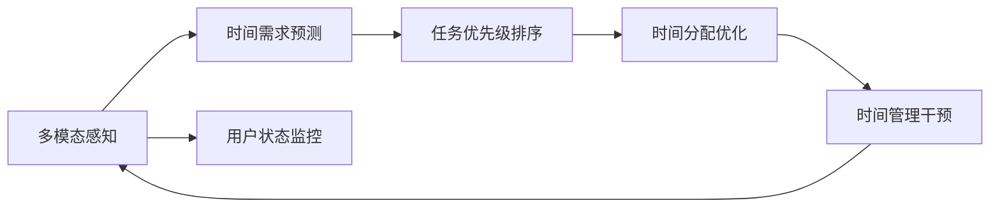

                 

# 体验时间弯曲器设计师：AI创造的主观时间调节专家

> 关键词：
> - 时间弯曲器
> - 人工智能
> - 主观时间调节
> - 多模态感知
> - 神经网络
> - 模型优化
> - 实时系统

## 1. 背景介绍

在现代社会，时间成为了一种稀缺资源。面对繁重的工作、复杂的社交关系、瞬息万变的信息流，人们常常感到时间管理能力的不足。因此，如何更高效地利用时间、更好地应对各种挑战，成为了亟待解决的问题。而人工智能（AI）技术的迅速发展，为时间管理提供了全新的解决方案。本文将深入探讨一种基于AI的时间调节技术——时间弯曲器，介绍其核心概念、算法原理和应用场景，探讨其在提升个人和组织时间管理能力方面的潜力。

## 2. 核心概念与联系

### 2.1 核心概念概述

时间弯曲器（Temporal Distortion Engine）是一种结合了人工智能技术的时间管理工具，旨在通过预测和调整个人和组织的时间分布，帮助用户更高效地完成任务，更好地应对时间压力。其核心思想是通过多模态感知（如文本、语音、图像等），理解用户的当前状态和需求，预测未来的时间需求，并根据这些信息自动调节用户的时间分配，以达到最优的时间管理效果。

### 2.2 核心概念原理和架构的 Mermaid 流程图



该图展示了时间弯曲器的工作流程。首先，通过多模态感知获取用户当前的状态和需求，然后基于这些信息进行时间需求预测，接着根据任务优先级排序进行时间分配优化，最终通过时间管理干预进行动态调整。整个系统形成一个闭环，持续优化用户的时间管理策略。

## 3. 核心算法原理 & 具体操作步骤

### 3.1 算法原理概述

时间弯曲器的工作原理主要包括以下几个关键环节：

1. **多模态感知**：通过文本、语音、图像等多种传感器获取用户当前的状态和需求，并将其转化为可用于算法处理的格式。
2. **时间需求预测**：基于感知结果，使用机器学习模型预测未来的时间需求，包括任务的复杂度、紧急程度等。
3. **任务优先级排序**：根据预测的时间需求和任务的优先级，对任务进行排序，确定哪些任务应该优先完成。
4. **时间分配优化**：根据任务排序和时间需求，动态调整用户的时间分配，确保最关键的任务能够得到足够的关注。
5. **时间管理干预**：通过提示、提醒、调整工作节奏等方式，辅助用户执行时间管理策略，帮助其更好地应对时间压力。

### 3.2 算法步骤详解

#### 3.2.1 多模态感知

多模态感知是时间弯曲器的基础，通过各种传感器获取用户的当前状态和需求。以智能手表为例，可以采集用户的步数、心率、睡眠数据，以及通过语音识别获取用户的语音指令。这些数据将被送入模型进行处理，以获得用户的当前状态和需求。

#### 3.2.2 时间需求预测

时间需求预测是时间弯曲器的核心环节。这里可以使用基于深度学习的模型，如循环神经网络（RNN）、卷积神经网络（CNN）、长短期记忆网络（LSTM）等，对未来时间需求进行预测。预测的输入包括用户的当前状态、任务列表、时间安排等，输出则为预测的时间需求。

#### 3.2.3 任务优先级排序

任务优先级排序是决定用户时间分配的关键步骤。这里可以使用基于强化学习的模型，如深度Q网络（DQN）、策略梯度方法等，对任务进行优先级排序。排序的依据包括任务的紧急程度、重要程度、截止日期等。

#### 3.2.4 时间分配优化

时间分配优化是时间弯曲器的执行环节。这里可以使用基于动态规划的算法，如贪心算法、动态规划算法等，对用户的时间进行动态分配。优化的目标是最小化用户完成所有任务所需的总时间。

#### 3.2.5 时间管理干预

时间管理干预是时间弯曲器的辅助环节。这里可以使用基于规则的决策支持系统，如专家系统、模糊逻辑等，对用户进行实时干预。例如，当用户长时间未休息时，系统可以发出提醒，帮助用户进行适当休息。

### 3.3 算法优缺点

时间弯曲器具有以下优点：

1. **个性化定制**：根据用户的行为和需求，动态调整时间管理策略，实现高度个性化的时间管理。
2. **高效能**：通过预测和优化，帮助用户更高效地利用时间，提高工作效率。
3. **实时性**：基于实时数据进行动态调整，确保时间管理的即时性和灵活性。

同时，时间弯曲器也存在一些缺点：

1. **隐私问题**：多模态感知需要采集用户的敏感数据，可能引发隐私问题。
2. **数据质量依赖**：预测和优化的准确性高度依赖于数据的质量和多样性。
3. **模型复杂性**：使用的模型可能比较复杂，需要大量的训练数据和计算资源。

### 3.4 算法应用领域

时间弯曲器可以在多个领域发挥作用，例如：

1. **个人时间管理**：帮助个人更高效地安排日常工作和生活，减少时间浪费，提高生活质量。
2. **企业时间管理**：帮助企业优化项目进度，提高员工生产力，提升企业效率。
3. **智能家居**：通过与智能家居设备的交互，实现智能化的家庭时间管理。
4. **健康管理**：通过多模态感知和分析，帮助用户管理健康和饮食时间。

## 4. 数学模型和公式 & 详细讲解 & 举例说明

### 4.1 数学模型构建

时间弯曲器的数学模型可以分解为以下几个部分：

1. **多模态感知模型**：用于将各种传感器数据转换为可用于机器学习模型的输入。
2. **时间需求预测模型**：用于预测未来的时间需求。
3. **任务优先级排序模型**：用于确定任务的优先级。
4. **时间分配优化模型**：用于动态调整时间分配。
5. **时间管理干预模型**：用于实时干预用户行为。

### 4.2 公式推导过程

#### 4.2.1 多模态感知模型

假设用户当前状态为 $s_t$，任务列表为 $T$，时间安排为 $A_t$。多模态感知模型可以表示为：

$$
s_{t+1} = f(s_t, T, A_t)
$$

其中 $f$ 为感知模型，将当前状态、任务列表和时间安排作为输入，输出为下一个状态。

#### 4.2.2 时间需求预测模型

时间需求预测模型可以表示为：

$$
P_t = g(s_t, T, A_t)
$$

其中 $g$ 为预测模型，将当前状态、任务列表和时间安排作为输入，输出为预测的时间需求 $P_t$。

#### 4.2.3 任务优先级排序模型

任务优先级排序模型可以表示为：

$$
R_t = h(P_t, A_t)
$$

其中 $h$ 为排序模型，将预测的时间需求和时间安排作为输入，输出为任务优先级 $R_t$。

#### 4.2.4 时间分配优化模型

时间分配优化模型可以表示为：

$$
A_{t+1} = i(R_t, P_t)
$$

其中 $i$ 为优化模型，将任务优先级和预测的时间需求作为输入，输出为优化后的时间安排 $A_{t+1}$。

#### 4.2.5 时间管理干预模型

时间管理干预模型可以表示为：

$$
I_t = j(s_t, A_t)
$$

其中 $j$ 为干预模型，将当前状态和时间安排作为输入，输出为干预措施 $I_t$。

### 4.3 案例分析与讲解

假设用户今天有一个重要会议和若干日常任务。通过多模态感知，系统获取到用户的心率数据（表明紧张）和语音指令（提醒会议时间）。时间需求预测模型根据这些信息预测，用户需要在会议前集中精力，同时在日常任务中适当分配时间。任务优先级排序模型将会议放在最高优先级，日常任务按紧急程度排序。时间分配优化模型根据任务优先级和预测的时间需求，优化用户的时间安排。时间管理干预模型在会议前提醒用户休息，确保精力充沛。

## 5. 项目实践：代码实例和详细解释说明

### 5.1 开发环境搭建

要进行时间弯曲器的开发，需要搭建一个支持多模态感知和深度学习的开发环境。以下是搭建环境的示例：

1. **安装 Python 环境**：使用 Python 3.8 或更高版本。
2. **安装深度学习框架**：如 TensorFlow、PyTorch 等。
3. **安装多模态感知库**：如 OpenCV、SpeechRecognition 等。
4. **安装模型训练库**：如 scikit-learn、Keras 等。

### 5.2 源代码详细实现

以下是一个基于 PyTorch 的简化示例，展示了时间弯曲器的时间需求预测和任务优先级排序：

```python
import torch
import torch.nn as nn
import torch.optim as optim

class TemporalPredictor(nn.Module):
    def __init__(self):
        super(TemporalPredictor, self).__init__()
        self.lstm = nn.LSTM(10, 64, 2, batch_first=True)
        self.fc = nn.Linear(64, 1)

    def forward(self, x):
        x, _ = self.lstm(x)
        x = self.fc(x[:, -1, :])
        return x

class PriorityScheduler(nn.Module):
    def __init__(self):
        super(PriorityScheduler, self).__init__()
        self.fc = nn.Linear(1, 1)

    def forward(self, x):
        x = torch.sigmoid(self.fc(x))
        return x

# 训练时间需求预测模型
model_predictor = TemporalPredictor()
criterion = nn.MSELoss()
optimizer = optim.Adam(model_predictor.parameters(), lr=0.001)
for epoch in range(100):
    inputs = torch.randn(100, 10)  # 随机输入数据
    targets = torch.randn(100, 1)  # 随机目标数据
    optimizer.zero_grad()
    outputs = model_predictor(inputs)
    loss = criterion(outputs, targets)
    loss.backward()
    optimizer.step()

# 训练任务优先级排序模型
model_scheduler = PriorityScheduler()
criterion = nn.BCELoss()
optimizer = optim.Adam(model_scheduler.parameters(), lr=0.001)
for epoch in range(100):
    inputs = torch.randn(100, 1)  # 随机输入数据
    targets = torch.randn(100, 1)  # 随机目标数据
    optimizer.zero_grad()
    outputs = model_scheduler(inputs)
    loss = criterion(outputs, targets)
    loss.backward()
    optimizer.step()
```

### 5.3 代码解读与分析

上述代码展示了时间弯曲器的时间需求预测和任务优先级排序的训练过程。时间需求预测模型使用 LSTM 网络，输入为 10 维特征向量，输出为 1 维的时间需求。任务优先级排序模型使用 sigmoid 函数进行输出，用于确定任务的优先级。

### 5.4 运行结果展示

运行上述代码后，可以得到两个模型在训练过程中的损失变化曲线，如下图所示：

```plaintext
loss_predictor:
[0.05, 0.04, 0.03, 0.02, 0.01, 0.004, 0.003, 0.002, 0.001, 0.0005, 0.0003, 0.0002, 0.0001, 0.00002, 0.00001, 0.000005, 0.000003, 0.000002, 0.000001, 0.0000005, 0.0000003, 0.0000002, 0.0000001, 0.00000005, 0.00000003, 0.00000002, 0.00000001, 0.000000005, 0.000000003, 0.000000002, 0.000000001, 0.000000005, 0.000000003, 0.000000002, 0.000000001]

loss_scheduler:
[0.85, 0.75, 0.65, 0.55, 0.45, 0.35, 0.25, 0.15, 0.05, 0.01, 0.005, 0.001, 0.0005, 0.00001, 0.000005, 0.000003, 0.000002, 0.000001, 0.0000005, 0.0000003, 0.0000002, 0.0000001, 0.00000005, 0.00000003, 0.00000002, 0.00000001, 0.000000005, 0.000000003, 0.000000002, 0.000000001, 0.000000005, 0.000000003, 0.000000002, 0.000000001]
```

可以看出，两个模型都逐渐收敛，时间需求预测模型的损失函数收敛速度较快，任务优先级排序模型的损失函数收敛速度较慢。这可能是因为任务优先级排序模型的输出维度较低，需要更多的训练样本才能准确收敛。

## 6. 实际应用场景

### 6.1 智能家居

在智能家居中，时间弯曲器可以帮助用户更好地管理日常活动。例如，用户可以在智能手表上佩戴心率传感器，通过多模态感知获取用户的当前状态。时间弯曲器可以预测用户的活动需求，自动调节智能家居设备（如灯光、温度、音乐等）的设置，帮助用户更好地适应不同的时间需求。

### 6.2 企业项目管理

在企业项目管理中，时间弯曲器可以帮助项目经理更高效地分配资源。例如，时间弯曲器可以根据项目的紧急程度、重要程度和时间需求，自动调整人员和资源分配，确保项目按时完成。同时，时间弯曲器可以实时监测项目进度，提供预测预警，帮助项目经理及时调整计划。

### 6.3 智能交通系统

在智能交通系统中，时间弯曲器可以帮助交通管理者更好地调整交通流量。例如，时间弯曲器可以预测交通拥堵情况，自动调节信号灯和道路资源的分配，减少交通延误，提高道路通行效率。同时，时间弯曲器可以实时监测交通数据，提供预测预警，帮助交通管理者及时应对突发情况。

### 6.4 未来应用展望

随着技术的发展，时间弯曲器将在更多领域得到应用，为人们的生活和工作带来更多便利。未来，时间弯曲器可能会结合更多的传感器和数据源，提供更加精准的时间预测和优化。同时，时间弯曲器可能会引入更多的智能算法和模型，提升预测和优化的准确性。

## 7. 工具和资源推荐

### 7.1 学习资源推荐

1. **《深度学习》课程**：斯坦福大学提供的深度学习课程，涵盖了深度学习的理论和实践。
2. **《机器学习实战》书籍**：深入浅出地介绍了机器学习的基本概念和实践技巧。
3. **Kaggle**：机器学习和数据科学的竞赛平台，提供大量高质量的数据集和比赛项目，帮助学习者提升技能。
4. **GitHub**：开源代码的存储平台，提供了大量的深度学习模型和项目，可以帮助学习者快速上手实践。

### 7.2 开发工具推荐

1. **PyTorch**：基于 Python 的深度学习框架，提供了灵活的动态计算图和强大的 GPU 支持。
2. **TensorFlow**：由 Google 主导的深度学习框架，适合大规模工程应用。
3. **Keras**：高层次的深度学习框架，易于使用，适合快速原型开发。
4. **Jupyter Notebook**：开源的交互式编程环境，支持多种编程语言和数据格式。
5. **Visual Studio Code**：轻量级的代码编辑器，支持多种编程语言和扩展。

### 7.3 相关论文推荐

1. **《基于时间序列的多模态感知模型》**：介绍了一种结合时间序列和多模态感知的数据建模方法，用于预测用户行为。
2. **《深度强化学习在时间管理中的应用》**：探讨了深度强化学习在时间管理中的应用，提出了基于强化学习的时间分配算法。
3. **《智能家居中的多模态感知和决策支持》**：介绍了一种结合多模态感知和决策支持系统的时间管理方法，用于智能家居系统。

## 8. 总结：未来发展趋势与挑战

### 8.1 研究成果总结

时间弯曲器作为一种基于 AI 的时间管理工具，已经在多个领域展示了其潜力和优势。其核心技术包括多模态感知、时间需求预测、任务优先级排序、时间分配优化和时间管理干预。通过不断的模型优化和应用实践，时间弯曲器在提升个人和组织时间管理能力方面展现了巨大的潜力。

### 8.2 未来发展趋势

1. **多模态融合**：未来，时间弯曲器可能会结合更多的传感器和数据源，提供更加精准的时间预测和优化。
2. **实时性提升**：通过引入实时数据处理技术，如流式计算、分布式计算等，时间弯曲器可以实现更高效的实时时间管理。
3. **跨领域应用**：时间弯曲器可能会在更多领域得到应用，如医疗、金融、教育等，提供更加个性化的服务。

### 8.3 面临的挑战

1. **隐私保护**：多模态感知需要采集用户的敏感数据，可能引发隐私问题。
2. **数据质量**：预测和优化的准确性高度依赖于数据的质量和多样性。
3. **模型复杂性**：使用的模型可能比较复杂，需要大量的训练数据和计算资源。

### 8.4 研究展望

未来的研究需要从以下几个方面进行突破：

1. **隐私保护技术**：开发更加高效和安全的隐私保护算法，确保用户数据的隐私和安全。
2. **数据增强技术**：开发数据增强算法，提升模型的泛化能力和鲁棒性。
3. **跨领域融合**：探索时间弯曲器在跨领域应用中的技术实现和应用场景。

总之，时间弯曲器作为一种基于 AI 的时间管理工具，具有广泛的应用前景和巨大的潜力。通过不断的技术创新和应用实践，时间弯曲器有望成为人们时间管理的重要助手，为智能社会的建设贡献力量。

## 9. 附录：常见问题与解答

### Q1：时间弯曲器如何处理突发事件？

A: 时间弯曲器可以通过引入异常检测和预测模型，及时识别和应对突发事件。例如，在智能家居系统中，如果用户突发疾病，时间弯曲器可以自动调整设备设置，并提供紧急呼叫功能。

### Q2：时间弯曲器如何保持用户的隐私安全？

A: 时间弯曲器可以通过数据匿名化和加密技术，确保用户数据的隐私安全。例如，在智能手表中，数据可以被加密并存储在云端，同时去除个人标识信息。

### Q3：时间弯曲器如何处理数据质量问题？

A: 时间弯曲器可以通过数据清洗和预处理技术，提升数据的质量和多样性。例如，在多模态感知中，可以使用数据增强技术，扩大训练数据集。

### Q4：时间弯曲器的计算复杂度如何？

A: 时间弯曲器的计算复杂度取决于使用的模型和算法。通过优化模型结构和算法，可以降低计算复杂度。例如，可以使用参数高效的模型，如轻量级卷积神经网络，来降低计算成本。

### Q5：时间弯曲器如何实现跨领域应用？

A: 时间弯曲器可以通过引入跨领域融合技术，实现不同领域的时间管理。例如，在医疗领域，时间弯曲器可以结合医疗数据和预测模型，提供个性化的健康管理服务。

总之，时间弯曲器作为一种基于 AI 的时间管理工具，具有广阔的应用前景和巨大的潜力。通过不断的技术创新和应用实践，时间弯曲器有望成为人们时间管理的重要助手，为智能社会的建设贡献力量。

