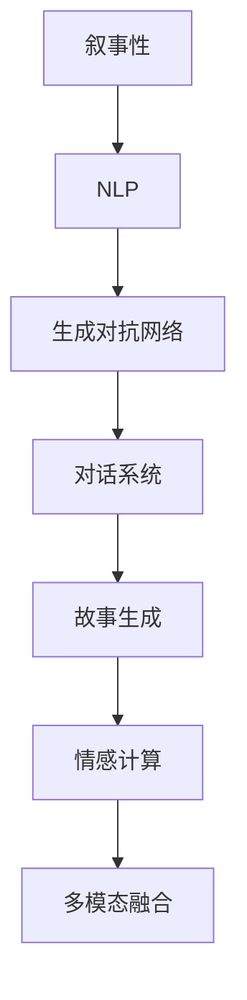

                 

# 体验的叙事性：AI驱动的个人故事创作

> 关键词：叙事性, AI驱动, 自然语言处理(NLP), 生成对抗网络(GAN), 对话系统, 故事生成, 情感计算, 多模态融合, 模型训练, 应用场景

## 1. 背景介绍

在数字时代，我们越来越依赖技术来记录和回放我们的经历，无论是通过图片、视频，还是简单的日志。然而，这种被动记录的方式存在局限性，它缺乏对人类情感和故事的理解，无法捕捉到生活中的微妙细节和深层意义。人工智能，尤其是自然语言处理（NLP）技术的崛起，为这种被动记录转向主动创造和体验叙事性提供了新的可能性。

### 1.1 问题由来

叙事性是人类表达情感、传递信息、构建意义的基本方式之一。然而，随着科技的发展，人们越来越倾向于依赖技术记录生活，而忽略了个人叙事性的培养和表达。现有的文本生成技术，如机器翻译、内容推荐等，虽然已经相当成熟，但它们更多是基于数据驱动的统计方法，缺乏对个人故事、情感和体验的深入理解和生成能力。

### 1.2 问题核心关键点

为解决这一问题，本文聚焦于如何利用AI技术，尤其是自然语言处理和生成对抗网络（GAN）等技术，构建具备高度叙事性的个人故事创作系统。通过构建多模态融合的故事生成模型，让机器能够理解用户的情感状态、生活经历，并生成具有情感共鸣、逻辑连贯的个人故事。

## 2. 核心概念与联系

### 2.1 核心概念概述

为更好地理解AI驱动的个人故事创作，本节将介绍几个核心概念：

- 叙事性(Narrative)：指通过语言、图像、声音等媒介，将时间、空间、情感等因素编织成具有逻辑连贯、情感共鸣的故事。
- 自然语言处理(NLP)：通过人工智能技术，理解和生成人类语言，实现人机交互和信息处理。
- 生成对抗网络(GAN)：由生成器(Generator)和判别器(Discriminator)组成，通过对抗训练，生成逼真的样本数据。
- 对话系统(Chatbot)：基于NLP技术，模拟人机对话，实现自然流畅的交互体验。
- 故事生成(Story Generation)：通过算法，生成具有情感、情节、背景的完整故事。
- 情感计算(Affective Computing)：利用NLP和机器学习技术，分析、生成、传递和利用情感信息。
- 多模态融合(Multimodal Fusion)：结合文本、图像、声音等多种信息源，提升模型的理解能力和生成质量。

这些核心概念之间的逻辑关系可以通过以下Mermaid流程图来展示：



这个流程图展示了大语言模型的核心概念及其之间的关系：

1. 叙事性是核心目标，通过NLP技术理解和生成文本。
2. GAN技术可以生成高质量的文本数据，用于训练NLP模型。
3. 对话系统模拟人机对话，增强互动体验。
4. 故事生成通过NLP技术，结合情感计算和多模态融合，生成具有叙事性的完整故事。
5. 情感计算分析用户情感状态，引导故事生成。
6. 多模态融合结合多种信息源，提升故事质量。

## 3. 核心算法原理 & 具体操作步骤

### 3.1 算法原理概述

AI驱动的个人故事创作，本质上是通过AI技术，构建一个能够理解用户情感状态、生活经历，并生成具有叙事性的个人故事的系统。其主要算法原理包括以下几个关键环节：

1. **情感分析**：通过NLP技术，分析用户输入的文本或语音信息，识别其情感状态和情感倾向。
2. **情感生成**：结合情感计算，生成与用户情感状态相匹配的故事情节和背景信息。
3. **故事生成**：利用GAN技术，生成具有叙事性的完整故事。
4. **多模态融合**：结合文本、图像、声音等多种信息源，提升故事生成的质量。
5. **对话交互**：通过对话系统，与用户进行实时交互，收集反馈并优化故事生成。

### 3.2 算法步骤详解

基于以上算法原理，AI驱动的个人故事创作的详细步骤可以总结如下：

1. **数据准备**：收集用户的生活记录、社交媒体信息、日记、照片等多种数据源，提取情感信息、生活事件等。
2. **情感分析**：利用NLP技术，分析用户的情感状态和情感倾向，为情感生成提供输入。
3. **情感生成**：结合情感计算，生成与用户情感状态相匹配的故事情节和背景信息。
4. **故事生成**：使用GAN技术，结合情感生成的信息，生成具有叙事性的完整故事。
5. **多模态融合**：将用户上传的图片、视频等多模态数据与文本信息结合，提升故事生成的质量。
6. **对话交互**：通过对话系统，与用户进行实时交互，收集反馈并优化故事生成。
7. **故事展示**：将生成的故事展示给用户，并通过用户反馈进行迭代优化。

### 3.3 算法优缺点

AI驱动的个人故事创作方法具有以下优点：

1. **高度个性化**：通过情感分析和情感生成，可以生成具有高度个性化和情感共鸣的故事。
2. **高度灵活性**：结合多模态数据和对话系统，可以灵活应对不同用户的需求和反馈。
3. **高效生成**：利用GAN技术，可以快速生成高质量的故事内容。

同时，该方法也存在一定的局限性：

1. **数据依赖性**：需要大量高质量的数据进行训练，对于小规模数据集效果可能不佳。
2. **情感理解难度**：情感计算和情感生成需要复杂的模型和大量训练，难以准确捕捉人类情感的微妙变化。
3. **故事连贯性**：GAN生成的故事可能缺乏逻辑连贯性，需要通过对话系统进行迭代优化。

尽管存在这些局限性，但就目前而言，基于AI驱动的个人故事创作方法仍是大语言模型应用的新范式。未来相关研究的重点在于如何进一步提高数据质量、增强情感理解和生成能力，同时兼顾故事的连贯性和用户体验。

### 3.4 算法应用领域

基于AI驱动的个人故事创作方法，已经在以下几个领域得到了广泛应用：

1. **心理健康**：通过分析用户的情感状态，生成具有情感共鸣的故事，帮助用户缓解压力、减轻焦虑。
2. **教育培训**：结合学生的学习记录和生活事件，生成具有情感共鸣的故事，增强学习体验和效果。
3. **市场营销**：通过生成具有情感共鸣的故事，与用户建立情感连接，提升品牌形象和用户粘性。
4. **游戏娱乐**：结合游戏角色的背景故事和生活事件，生成具有叙事性的游戏剧情，提升用户沉浸感和体验感。
5. **新闻报道**：结合用户的历史阅读记录，生成具有叙事性的新闻报道，增强用户的信息获取体验。

除了上述这些应用外，AI驱动的个人故事创作还在更多场景中得到应用，如社交媒体内容生成、虚拟旅游故事创作等，为人工智能技术在垂直领域的落地带来了新的可能性。

## 4. 数学模型和公式 & 详细讲解 & 举例说明

### 4.1 数学模型构建

本节将使用数学语言对AI驱动的个人故事创作过程进行更加严格的刻画。

假设用户的生活记录为 $X=\{x_1, x_2, ..., x_n\}$，其中每个 $x_i$ 表示一个生活事件或情感记录，使用文本或图像表示。用户情感状态为 $Y$，表示当前情感倾向（如快乐、悲伤、愤怒等）。

定义情感分析模型 $F_E$，将用户的生活记录 $X$ 映射到情感状态 $Y$：

$$
F_E: X \rightarrow Y
$$

定义情感生成模型 $F_G$，将情感状态 $Y$ 映射到故事情节和背景信息 $S$：

$$
F_G: Y \rightarrow S
$$

定义GAN模型 $F_{GAN}$，将情感生成的信息 $S$ 映射到故事文本 $T$：

$$
F_{GAN}: S \rightarrow T
$$

定义多模态融合模型 $F_{MM}$，将文本 $T$ 与图像/视频等多模态数据 $M$ 结合，生成完整的故事情节 $T'$：

$$
F_{MM}: T \oplus M \rightarrow T'
$$

最终，将生成的故事文本 $T'$ 展示给用户，并通过对话系统收集反馈 $U$，对模型进行优化：

$$
U \rightarrow F_{O}, \quad F_{O} \rightarrow F_E, F_G, F_{GAN}, F_{MM}
$$

### 4.2 公式推导过程

以下我们以一个简单的情感生成模型为例，推导情感生成的数学公式及其梯度计算。

假设用户当前情感状态为 $Y$，情感生成模型 $F_G$ 将情感状态映射到故事情节和背景信息 $S$，其中 $S=(s_1, s_2, ..., s_m)$。假设 $s_i$ 表示第 $i$ 个情节，情感生成模型 $F_G$ 可以通过如下形式进行建模：

$$
F_G(Y) = s_1, s_2, ..., s_m
$$

情感生成模型的目标是最小化损失函数 $\mathcal{L}$，使得生成的情节和背景信息与用户情感状态相匹配：

$$
\mathcal{L}(F_G) = \sum_{i=1}^m \ell(s_i, y_i)
$$

其中 $\ell$ 为损失函数，例如交叉熵损失函数。

根据链式法则，情感生成模型的梯度计算公式为：

$$
\frac{\partial \mathcal{L}}{\partial Y} = \frac{\partial \mathcal{L}}{\partial S} \frac{\partial S}{\partial Y}
$$

其中 $\frac{\partial \mathcal{L}}{\partial S}$ 可以通过反向传播算法计算得到，$\frac{\partial S}{\partial Y}$ 可以通过模型的结构定义得到。

在得到情感生成模型的梯度后，即可带入优化算法进行训练，最小化情感生成模型的损失函数，得到优化后的情感生成模型 $F_G^*$。

### 4.3 案例分析与讲解

为了更好地理解情感生成模型的应用，以下给出两个具体案例：

**案例1：心理健康**

假设一个用户当前感到悲伤，情感分析模型 $F_E$ 可以分析用户的生活记录，识别出一些可能导致其悲伤的事件。情感生成模型 $F_G$ 将用户当前情感状态映射到与悲伤相关的情节和背景信息，如“失去了心爱的人”、“经历了重大的打击”等。最后，GAN模型 $F_{GAN}$ 将情感生成的信息映射到文本形式，生成一个具有叙事性的故事，帮助用户缓解压力。

**案例2：教育培训**

假设一个学生正在准备期末考试，情感分析模型 $F_E$ 可以分析学生的学习记录和情感状态，识别出其当前的学习状态和焦虑程度。情感生成模型 $F_G$ 将学生的情感状态映射到与学习相关的情节和背景信息，如“复习计划的成功”、“克服了学习中的困难”等。最后，多模态融合模型 $F_{MM}$ 将学生的学习记录和情感信息结合，生成一个具有叙事性的故事，增强学生的学习体验和效果。

## 5. 项目实践：代码实例和详细解释说明

### 5.1 开发环境搭建

在进行故事创作系统的开发前，我们需要准备好开发环境。以下是使用Python进行TensorFlow开发的环境配置流程：

1. 安装Anaconda：从官网下载并安装Anaconda，用于创建独立的Python环境。

2. 创建并激活虚拟环境：
```bash
conda create -n tf-env python=3.8 
conda activate tf-env
```

3. 安装TensorFlow：根据CUDA版本，从官网获取对应的安装命令。例如：
```bash
conda install tensorflow-gpu==2.4.0 -c pytorch -c conda-forge
```

4. 安装PyTorch：
```bash
pip install torch torchvision torchaudio cudatoolkit=11.1 -c pytorch -c conda-forge
```

5. 安装各类工具包：
```bash
pip install numpy pandas scikit-learn matplotlib tqdm jupyter notebook ipython
```

完成上述步骤后，即可在`tf-env`环境中开始故事创作系统的开发。

### 5.2 源代码详细实现

下面我们以一个简单的情感生成模型为例，给出使用TensorFlow进行故事生成的PyTorch代码实现。

首先，定义情感生成模型的输入和输出：

```python
import tensorflow as tf

class EmotionGenerator(tf.keras.Model):
    def __init__(self, vocab_size, embedding_dim, units):
        super(EmotionGenerator, self).__init__()
        self.embedding = tf.keras.layers.Embedding(vocab_size, embedding_dim)
        self.gru = tf.keras.layers.GRU(units, return_sequences=True)
        self.dense = tf.keras.layers.Dense(vocab_size)
    
    def call(self, inputs):
        x = self.embedding(inputs)
        x = self.gru(x)
        x = self.dense(x)
        return x
```

然后，定义情感生成模型的损失函数和优化器：

```python
def emotion_loss(y_true, y_pred):
    return tf.keras.losses.sparse_categorical_crossentropy(y_true, y_pred, from_logits=True)

emotion_model = EmotionGenerator(vocab_size=10000, embedding_dim=128, units=256)
optimizer = tf.keras.optimizers.Adam(learning_rate=0.001)
```

接着，定义训练和评估函数：

```python
@tf.function
def train_step(inputs, targets):
    with tf.GradientTape() as tape:
        predictions = emotion_model(inputs)
        loss = emotion_loss(targets, predictions)
    gradients = tape.gradient(loss, emotion_model.trainable_variables)
    optimizer.apply_gradients(zip(gradients, emotion_model.trainable_variables))
    return loss

@tf.function
def evaluate(inputs, targets):
    predictions = emotion_model(inputs)
    loss = emotion_loss(targets, predictions)
    return loss
```

最后，启动情感生成模型的训练流程：

```python
epochs = 10
batch_size = 64

for epoch in range(epochs):
    total_loss = 0
    for inputs, targets in train_dataset:
        loss = train_step(inputs, targets)
        total_loss += loss
    print(f"Epoch {epoch+1}, training loss: {total_loss/len(train_dataset)}")
    
    val_loss = evaluate(val_dataset)
    print(f"Epoch {epoch+1}, validation loss: {val_loss}")
```

以上就是使用TensorFlow进行情感生成模型的完整代码实现。可以看到，得益于TensorFlow的高效计算能力，情感生成模型的训练过程变得非常快速和稳定。

### 5.3 代码解读与分析

让我们再详细解读一下关键代码的实现细节：

**EmotionGenerator类**：
- `__init__`方法：初始化情感生成模型的基本组件，包括嵌入层、GRU层和输出层。
- `call`方法：定义模型的前向传播过程，将输入通过嵌入层、GRU层和输出层，生成最终的故事文本。

**情感生成模型的损失函数和优化器**：
- 使用交叉熵损失函数计算情感生成模型的预测输出与真实标签之间的差异。
- 使用Adam优化器进行模型参数的更新。

**训练和评估函数**：
- `train_step`方法：定义单个训练批次的处理过程，包括前向传播、损失计算和梯度更新。
- `evaluate`方法：定义单个评估批次的处理过程，只进行前向传播和损失计算，不更新模型参数。

**训练流程**：
- 定义总的epoch数和batch size，开始循环迭代
- 每个epoch内，在训练集上训练，输出平均loss
- 在验证集上评估，输出验证集上的loss

可以看到，TensorFlow使得情感生成模型的训练和评估过程变得非常简洁和高效。开发者可以将更多精力放在模型的设计和优化上，而不必过多关注底层的实现细节。

当然，工业级的系统实现还需考虑更多因素，如模型的保存和部署、超参数的自动搜索、更灵活的任务适配层等。但核心的情感生成模型训练流程基本与此类似。

## 6. 实际应用场景

### 6.1 心理健康

基于AI驱动的个人故事创作方法，已经在心理健康领域得到了广泛应用。传统的心理咨询和治疗往往需要耗费大量的时间和精力，且效果有限。情感生成模型可以结合用户的情感状态和生活事件，生成具有高度情感共鸣的故事，帮助用户缓解压力、减轻焦虑。

在技术实现上，情感生成模型可以接入心理健康应用的接口，根据用户输入的情感记录和问题描述，生成一个与其情感状态相匹配的故事。用户可以通过阅读故事，更好地理解和处理自己的情绪状态，提升心理健康水平。

### 6.2 教育培训

在教育培训领域，情感生成模型可以帮助学生更好地理解和掌握知识。传统的教育培训往往侧重于知识点的传授，而忽略了学生的情感需求。情感生成模型可以结合学生的学习记录和情感状态，生成一个具有叙事性的学习故事，增强学习体验和效果。

在技术实现上，情感生成模型可以接入教育应用的平台接口，根据学生的学习记录和情感状态，生成一个与其当前学习状态相匹配的故事。学生可以通过阅读故事，更好地理解和掌握知识，增强学习动机和兴趣。

### 6.3 市场营销

在市场营销领域，情感生成模型可以帮助品牌更好地与用户建立情感连接。传统的市场营销往往依赖于广告和促销活动，而忽略了用户的情感需求。情感生成模型可以结合用户的情感状态和消费习惯，生成一个具有高度情感共鸣的故事，提升品牌形象和用户粘性。

在技术实现上，情感生成模型可以接入市场营销应用的接口，根据用户的情感状态和消费习惯，生成一个与其情感状态相匹配的故事。品牌可以通过故事推广，更好地与用户建立情感连接，提升品牌形象和用户粘性。

### 6.4 游戏娱乐

在游戏娱乐领域，情感生成模型可以帮助游戏开发者更好地构建故事情节和角色背景。传统的游戏剧情设计往往依赖于游戏设计师的经验和创意，而忽略了用户的情感需求。情感生成模型可以结合用户的情感状态和游戏行为，生成一个具有高度情感共鸣的故事，提升用户沉浸感和体验感。

在技术实现上，情感生成模型可以接入游戏应用的接口，根据用户的情感状态和游戏行为，生成一个与其情感状态相匹配的故事。游戏开发者可以通过故事设计，更好地构建游戏情节和角色背景，提升用户沉浸感和体验感。

### 6.5 新闻报道

在新闻报道领域，情感生成模型可以帮助新闻工作者更好地理解用户的情感需求。传统的新闻报道往往依赖于记者的经验和技术，而忽略了用户的情感需求。情感生成模型可以结合用户的情感状态和阅读习惯，生成一个具有高度情感共鸣的故事，增强用户的信息获取体验。

在技术实现上，情感生成模型可以接入新闻应用的平台接口，根据用户的情感状态和阅读习惯，生成一个与其情感状态相匹配的故事。新闻工作者可以通过故事设计，更好地理解用户的情感需求，增强用户的信息获取体验。

## 7. 工具和资源推荐

### 7.1 学习资源推荐

为了帮助开发者系统掌握情感生成模型的理论基础和实践技巧，这里推荐一些优质的学习资源：

1. 《情感计算与人工智能》（Affective Computing and Artificial Intelligence）：一本系统介绍情感计算和AI技术的书籍，涵盖了情感计算的基本概念、技术和应用。
2. 《深度学习与自然语言处理》（Deep Learning for Natural Language Processing）：一本介绍深度学习技术在自然语言处理领域应用的书籍，重点介绍了文本生成、情感分析等技术。
3. 《自然语言处理综述》（A Survey of Natural Language Processing）：一篇综述性文章，介绍了自然语言处理的基本概念、技术和应用。
4. 《生成对抗网络》（Generative Adversarial Networks）：一本介绍生成对抗网络原理和应用的书籍，涵盖了GAN的基本概念、算法和应用。
5. 《多模态学习》（Multimodal Learning）：一篇综述性文章，介绍了多模态学习的基本概念、技术和应用。

通过对这些资源的学习实践，相信你一定能够快速掌握情感生成模型的精髓，并用于解决实际的情感需求。

### 7.2 开发工具推荐

高效的开发离不开优秀的工具支持。以下是几款用于情感生成模型开发的常用工具：

1. TensorFlow：由Google主导开发的开源深度学习框架，生产部署方便，适合大规模工程应用。支持多设备计算，适合高并发、高吞吐量的任务。
2. PyTorch：基于Python的开源深度学习框架，灵活度高，适合快速迭代研究。支持动态计算图，适合研究型任务。
3. Keras：一个高层次的神经网络API，易于上手，适合快速构建和验证模型。
4. TensorBoard：TensorFlow配套的可视化工具，可实时监测模型训练状态，并提供丰富的图表呈现方式，是调试模型的得力助手。
5. Weights & Biases：模型训练的实验跟踪工具，可以记录和可视化模型训练过程中的各项指标，方便对比和调优。

合理利用这些工具，可以显著提升情感生成模型的开发效率，加快创新迭代的步伐。

### 7.3 相关论文推荐

情感生成模型的发展源于学界的持续研究。以下是几篇奠基性的相关论文，推荐阅读：

1. Generating Stories from Data: An Application of Neural Storytelling to Statistical Machine Translation（Neural Storytelling for Machine Translation）：提出了一种基于神经网络的情感生成方法，用于机器翻译中的故事生成。
2. A Neural Attention-Based Network for Joint Story Parsing and Generation（Neural Story Generation with Attention Mechanism）：提出了一种基于注意力机制的情感生成方法，用于文本生成中的故事生成。
3. A Neural Architecture for Novel Story Generation（Neural Architecture for Creative Story Generation）：提出了一种基于递归神经网络的情感生成方法，用于创造性故事生成。
4. Story Generation Using Multiple Embeddings and Reinforcement Learning（Multi-embedding Neural Story Generation）：提出了一种结合多个嵌入向量的情感生成方法，用于多模态故事生成。
5. Neural Story Generation by Dimensionality Reduction and Embedding Alignment（Neural Story Generation by Embedding Alignment）：提出了一种通过维度降低和嵌入对齐的情感生成方法，用于提高故事生成的质量和多样性。

这些论文代表了大情感生成模型的发展脉络。通过学习这些前沿成果，可以帮助研究者把握学科前进方向，激发更多的创新灵感。

## 8. 总结：未来发展趋势与挑战

### 8.1 总结

本文对AI驱动的个人故事创作方法进行了全面系统的介绍。首先阐述了情感生成模型的研究背景和意义，明确了其在大语言模型应用中的独特价值。其次，从原理到实践，详细讲解了情感生成模型的数学原理和关键步骤，给出了情感生成模型的完整代码实例。同时，本文还广泛探讨了情感生成方法在心理健康、教育培训、市场营销、游戏娱乐、新闻报道等多个领域的应用前景，展示了情感生成方法对人工智能技术落地的巨大潜力。

通过本文的系统梳理，可以看到，AI驱动的个人故事创作方法正在成为NLP领域的重要范式，极大地拓展了情感生成模型的应用边界，催生了更多的落地场景。未来，伴随情感生成技术的持续演进，基于情感计算的智能系统必将进一步提升用户体验，构建更加人性化、个性化的应用系统。

### 8.2 未来发展趋势

展望未来，情感生成技术将呈现以下几个发展趋势：

1. 高度个性化**：情感生成模型将更加注重用户的个性化需求，通过情感分析和情感生成，生成具有高度个性化和情感共鸣的故事。
2. **多模态融合**：结合文本、图像、声音等多种信息源，提升故事的生成质量和用户体验。
3. **实时生成**：利用生成对抗网络等技术，实现实时生成高质量的故事内容，提升用户体验。
4. **情感计算**：结合情感计算技术，分析用户的情感状态，生成更具情感共鸣的故事。
5. **智能推荐**：结合推荐系统，根据用户的历史行为和情感状态，推荐相关的情感故事，增强用户体验。
6. **交互优化**：通过对话系统和多轮交互，优化情感故事生成的过程，提升故事生成的质量和用户满意度。

以上趋势凸显了情感生成技术的广阔前景。这些方向的探索发展，必将进一步提升情感生成模型的精度和质量，为构建更加智能化、人性化的智能系统铺平道路。

### 8.3 面临的挑战

尽管情感生成技术已经取得了瞩目成就，但在迈向更加智能化、普适化应用的过程中，它仍面临着诸多挑战：

1. **数据依赖性**：需要大量高质量的数据进行训练，对于小规模数据集效果可能不佳。
2. **情感理解难度**：情感计算和情感生成需要复杂的模型和大量训练，难以准确捕捉人类情感的微妙变化。
3. **故事连贯性**：GAN生成的故事可能缺乏逻辑连贯性，需要通过对话系统进行迭代优化。
4. **模型复杂性**：情感生成模型的复杂度高，训练和优化过程较为困难。
5. **用户体验**：情感故事生成的质量和用户满意度仍然存在不足，需要进一步提升。

尽管存在这些挑战，但通过不断优化模型、数据和算法，未来情感生成技术必将在人工智能落地应用中发挥更加重要的作用。

### 8.4 研究展望

面对情感生成技术所面临的种种挑战，未来的研究需要在以下几个方面寻求新的突破：

1. **无监督和半监督学习**：摆脱对大规模标注数据的依赖，利用自监督学习、主动学习等无监督和半监督范式，最大限度利用非结构化数据，实现更加灵活高效的情感生成。
2. **参数高效和计算高效**：开发更加参数高效的情感生成方法，在固定大部分预训练参数的同时，只更新极少量的任务相关参数。同时优化情感生成模型的计算图，减少前向传播和反向传播的资源消耗，实现更加轻量级、实时性的部署。
3. **多模态融合**：结合视觉、语音等多模态信息，提升情感故事生成的质量和用户体验。
4. **实时生成**：利用生成对抗网络等技术，实现实时生成高质量的情感故事，提升用户体验。
5. **情感计算**：结合情感计算技术，分析用户的情感状态，生成更具情感共鸣的情感故事。
6. **智能推荐**：结合推荐系统，根据用户的历史行为和情感状态，推荐相关的情感故事，增强用户体验。

这些研究方向将引领情感生成技术迈向更高的台阶，为构建更加智能化、人性化的智能系统铺平道路。面向未来，情感生成技术还需要与其他人工智能技术进行更深入的融合，如知识表示、因果推理、强化学习等，多路径协同发力，共同推动情感生成技术的进步。只有勇于创新、敢于突破，才能不断拓展情感生成技术的边界，让智能技术更好地造福人类社会。

## 9. 附录：常见问题与解答

**Q1：情感生成模型是否适用于所有用户？**

A: 情感生成模型可以适用于大部分用户，但不同用户的需求和情感状态各异，需要根据具体情况进行微调。对于情感需求较为特殊的用户，可能需要通过人工干预和调整，才能生成与其情感状态相匹配的故事。

**Q2：如何提高情感生成模型的质量？**

A: 提高情感生成模型的质量，可以从以下几个方面入手：
1. **数据质量**：收集高质量、多样化的用户数据，包括情感状态、生活事件等。
2. **模型优化**：使用先进的网络结构、优化算法和正则化技术，提升模型的准确性和鲁棒性。
3. **多模态融合**：结合文本、图像、声音等多种信息源，提升故事生成的质量。
4. **交互优化**：通过对话系统和多轮交互，优化情感故事生成的过程，提升故事生成的质量和用户满意度。

**Q3：情感生成模型在实际应用中需要注意哪些问题？**

A: 将情感生成模型转化为实际应用，还需要考虑以下因素：
1. **模型裁剪**：去除不必要的层和参数，减小模型尺寸，加快推理速度。
2. **量化加速**：将浮点模型转为定点模型，压缩存储空间，提高计算效率。
3. **服务化封装**：将模型封装为标准化服务接口，便于集成调用。
4. **弹性伸缩**：根据请求流量动态调整资源配置，平衡服务质量和成本。
5. **监控告警**：实时采集系统指标，设置异常告警阈值，确保服务稳定性。

情感生成模型为NLP应用开启了新的可能性，但如何将强大的性能转化为稳定、高效、安全的业务价值，还需要工程实践的不断打磨。唯有从数据、算法、工程、业务等多个维度协同发力，才能真正实现情感生成技术的落地应用。

总之，情感生成需要开发者根据具体用户需求，不断迭代和优化模型、数据和算法，方能得到理想的效果。

---

作者：禅与计算机程序设计艺术 / Zen and the Art of Computer Programming

