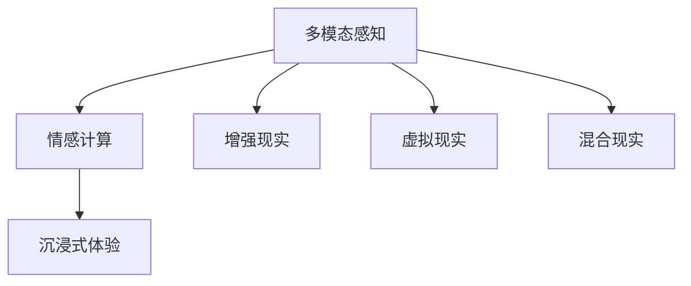

                 

## 1. 背景介绍

### 1.1 问题由来

在当前的技术背景下，人工智能(AI)已经不仅仅局限于传统的数值计算和决策分析，而是逐步渗透到了体验的各个层面，成为连接虚拟与现实的新桥梁。人工智能在艺术、设计、娱乐、教育等领域的深度参与，使得"体验"这一概念正在被重新定义。然而，当前的AI技术更多地关注于数据驱动的模型训练和算法优化，较少探讨AI在体验感知上的优势和挑战。

### 1.2 问题核心关键点

体验的层次性是多维度的，包括视觉、听觉、触觉、味觉、嗅觉等感官体验，以及情感、认知、记忆等多层次的心理体验。人工智能技术在模拟这些体验方面具有独特优势，但同时也面临着如何综合多感官信息、模拟真实情感等难题。如何利用AI技术，创造更加丰富、真实、沉浸的体验，将是未来技术发展的关键。

## 2. 核心概念与联系

### 2.1 核心概念概述

为更好地理解AI在体验创造上的作用和局限，本节将介绍几个关键概念：

- **多模态感知(Multimodal Perception)**：指AI系统能够同时处理和理解不同感官的输入，如视觉、听觉、触觉等。通过多模态感知，AI可以提供更加全面、真实的体验。

- **情感计算(Affective Computing)**：研究如何通过AI技术识别、表达、调节人类的情感状态，特别是在虚拟角色和机器人中，模拟人类情感的交互。

- **沉浸式体验(Immersive Experience)**：指通过虚拟现实(VR)、增强现实(AR)、混合现实(MR)等技术，构建一个完全沉浸的环境，让用户体验者仿佛置身于其中，与虚拟世界无缝交互。

- **增强现实(Augmented Reality, AR)**：在现实世界的基础上，叠加虚拟信息，增强用户的感知体验，如智能眼镜、AR游戏等。

- **虚拟现实(Virtual Reality, VR)**：通过计算机生成的虚拟场景，创造出一个全新的沉浸式环境，使用户能够在虚拟世界中自由行动。

- **混合现实(Mixed Reality, MR)**：结合AR和VR技术，构建一个同时包含真实和虚拟元素的环境，让用户能够同时感知真实和虚拟世界。

这些概念之间的逻辑关系可以通过以下Mermaid流程图来展示：



这个流程图展示了体验创造的关键路径：

1. 多模态感知为体验提供全面的感官输入。
2. 情感计算使得AI能够理解并模拟人类的情感状态。
3. 沉浸式体验通过多种技术手段，构建完全沉浸的环境。
4. AR、VR、MR技术则具体实现了不同层级的沉浸效果。

## 3. 核心算法原理 & 具体操作步骤

### 3.1 算法原理概述

AI在体验创造中主要依赖多模态感知、情感计算和沉浸式体验等技术。其中，多模态感知和情感计算的算法原理相对成熟，沉浸式体验则涉及多技术的综合应用。

- **多模态感知**：基于深度学习的多模态感知模型能够处理不同感官的输入，如通过卷积神经网络(CNN)处理视觉信息，通过循环神经网络(RNN)处理听觉信息，通过长短时记忆网络(LSTM)处理触觉信息等。通过多模态感知，AI能够综合处理多种感官信息，提升体验的丰富度。

- **情感计算**：情感计算主要通过面部表情识别、语音情感分析、生理信号监测等方式，识别用户的情感状态。常见的算法包括深度学习模型、支持向量机(SVM)、随机森林等。情感计算的目标是使AI系统能够理解和表达用户的情感，提升人机交互的情感深度。

- **沉浸式体验**：沉浸式体验主要通过虚拟现实(VR)、增强现实(AR)和混合现实(MR)技术实现。其中，VR技术通过全封闭的头显设备，创造一个完全沉浸的环境；AR技术则将虚拟信息叠加在现实世界中，增强用户的感知；MR技术则结合VR和AR，构建混合现实环境。沉浸式体验的关键在于构建逼真的虚拟场景和流畅的交互机制。

### 3.2 算法步骤详解

#### 3.2.1 多模态感知算法

1. **数据收集**：收集不同感官的输入数据，如图像、音频、触觉信号等。

2. **特征提取**：对每种感官的数据进行特征提取，形成统一的特征表示。例如，对图像使用卷积神经网络提取特征，对音频使用卷积神经网络或循环神经网络提取特征，对触觉信号使用长短时记忆网络提取特征。

3. **多模态融合**：将不同感官的特征进行融合，形成一个综合的特征向量。融合方式包括加权求和、特征拼接、注意力机制等。

4. **模型训练**：使用融合后的特征向量进行深度学习模型的训练，如卷积神经网络、循环神经网络等。

5. **预测和推理**：使用训练好的模型对新的感官数据进行预测和推理，输出多模态感知结果。

#### 3.2.2 情感计算算法

1. **数据收集**：收集用户的面部表情、语音、生理信号等数据。

2. **特征提取**：对各种数据进行特征提取，例如，使用卷积神经网络提取面部表情特征，使用Mel频率倒谱系数(MFCC)提取语音特征，使用生理信号监测设备获取生理信号特征。

3. **情感识别**：使用深度学习模型或传统的机器学习模型，如支持向量机、随机森林等，对提取的特征进行情感识别，输出用户的情感状态。

4. **情感调节**：基于识别出的情感状态，使用情感调节算法，如情感转移、情感增强等，调整系统的情感状态，提供更加适应用户情感的交互。

#### 3.2.3 沉浸式体验算法

1. **场景构建**：使用虚拟现实(VR)、增强现实(AR)、混合现实(MR)技术构建虚拟场景，如使用Unity、Unreal Engine等引擎构建虚拟环境。

2. **用户交互**：通过手柄、头显、触觉反馈设备等交互设备，与用户进行自然交互。

3. **感官反馈**：根据用户的交互行为，实时调整虚拟场景的感官反馈，如调整光照、声音、触觉等，提升沉浸感。

4. **用户体验优化**：根据用户反馈和行为数据，不断优化虚拟场景和交互体验，提供更加真实的沉浸式体验。

### 3.3 算法优缺点

#### 3.3.1 多模态感知算法

**优点**：
- 能够综合处理多种感官信息，提升体验的丰富度。
- 提高数据的多样性和复杂性，增强模型的泛化能力。

**缺点**：
- 数据收集和处理成本较高，需要多种传感器和设备。
- 不同感官数据特征不一致，融合难度较大。

#### 3.3.2 情感计算算法

**优点**：
- 能够理解用户的情感状态，提升人机交互的情感深度。
- 可以应用于医疗、教育、娱乐等多个领域，提升用户体验。

**缺点**：
- 情感数据的获取和处理较为复杂，受用户隐私和安全等因素限制。
- 情感识别模型的准确率受多种因素影响，如用户情绪复杂性、数据多样性等。

#### 3.3.3 沉浸式体验算法

**优点**：
- 能够创造完全沉浸的环境，提升用户体验。
- 可以应用于虚拟旅游、游戏、教育等多个领域，具有广泛的应用前景。

**缺点**：
- 技术实现复杂，设备成本较高，用户体验受设备质量影响。
- 虚拟环境的构建和优化需要大量时间和资源，开发周期较长。

### 3.4 算法应用领域

#### 3.4.1 多模态感知在医疗中的应用

多模态感知在医疗领域具有广泛的应用，例如：
- **诊断支持**：结合患者的面部表情、语音、生理信号等数据，辅助医生进行疾病诊断。
- **健康监测**：通过可穿戴设备收集生理信号，实时监测用户的健康状态，提供预警和建议。

#### 3.4.2 情感计算在教育中的应用

情感计算在教育领域具有重要应用，例如：
- **学习分析**：通过分析学生的面部表情、语音情绪等数据，提供个性化的学习建议。
- **情感反馈**：实时调整教学内容，提升学生的学习兴趣和动力。

#### 3.4.3 沉浸式体验在游戏中的应用

沉浸式体验在游戏领域已经得到广泛应用，例如：
- **虚拟现实游戏**：通过VR设备，提供完全沉浸的游戏体验。
- **增强现实游戏**：通过AR设备，将虚拟信息叠加在现实世界中，增强游戏趣味性。

## 4. 数学模型和公式 & 详细讲解 & 举例说明

### 4.1 数学模型构建

多模态感知、情感计算和沉浸式体验的算法模型可以分别表示为：

**多模态感知模型**：
- 输入：$x_v$（视觉特征）, $x_a$（听觉特征）, $x_t$（触觉特征）
- 输出：$y$
- 模型：$M(x_v, x_a, x_t)$

**情感计算模型**：
- 输入：$x_f$（面部表情）, $x_v$（语音）, $x_p$（生理信号）
- 输出：$y_e$（情感状态）
- 模型：$M(x_f, x_v, x_p)$

**沉浸式体验模型**：
- 输入：$x_r$（现实场景）, $x_v$（虚拟场景）
- 输出：$y_i$（交互行为）
- 模型：$M(x_r, x_v)$

### 4.2 公式推导过程

#### 4.2.1 多模态感知模型

假设多模态感知模型使用卷积神经网络(CNN)，其输入为视觉特征$x_v$和触觉特征$x_t$，输出为综合特征向量$y$。模型结构如下：

```
      +----------+
      | Conv1    |
      +----------+
           |
           |   +----------+
           |   |   +----------+
           |   |   | Conv2    |
           |   |   +----------+
           |   |           |
           |   |           |   +----------+
           |   |           |   |   +----------+
           |   |           |   |   | Conv3    |
           |   |           |   |   +----------+
           |   |           |   |
           |   |           |   |   +----------+
           |   |           |   |   | FC       |
           |   |           |   |   +----------+
           |   |           |   |
           |   |           |   |   +----------+
           |   |           |   |   | Output    |
           |   |           |   |   +----------+
           |   |           |   |
           +----+           +---+
```

其中，Conv1、Conv2、Conv3为卷积层，FC为全连接层，Output为输出层。公式推导如下：

$$
y = FC(M_{Conv1}(x_v, x_t))
$$

其中，$M_{Conv1}$为卷积神经网络，$x_v$、$x_t$分别为视觉和触觉特征向量。

#### 4.2.2 情感计算模型

假设情感计算模型使用支持向量机(SVM)，其输入为面部表情$x_f$、语音$x_v$和生理信号$x_p$，输出为情感状态$y_e$。模型结构如下：

```
       +------------+
       |   SVM      |
       +------------+
              |
              |   +-------------+
              |   |   +-------------+
              |   |   |  Face-SVM    |
              |   |   +-------------+
              |   |              |
              |   |              |   +-------------+
              |   |              |   |   Voice-SVM   |
              |   |              |   +-------------+
              |   |              |
              |   |              |   +-------------+
              |   |              |   |   Physio-SVM  |
              |   |              |   +-------------+
              |   |              |
              |   |              |   +-------------+
              |   |              |   |  Aggregate-SVM  |
              |   |              |   +-------------+
              |   |              |
              |   |              |   +-------------+
              |   |              |   |   Output-SVM   |
              |   |              |   +-------------+
              |   |              |
              +---+              +---+
```

其中，Face-SVM、Voice-SVM、Physio-SVM为面部表情、语音和生理信号的SVM模型，Aggregate-SVM为特征融合的SVM模型，Output-SVM为最终的情感识别模型。公式推导如下：

$$
y_e = Output-SVM(Aggregate-SVM(Face-SVM(x_f), Voice-SVM(x_v), Physio-SVM(x_p)))
$$

#### 4.2.3 沉浸式体验模型

假设沉浸式体验模型使用Unity引擎，其输入为现实场景$x_r$和虚拟场景$x_v$，输出为交互行为$y_i$。模型结构如下：

```
       +-------------+
       |  Unity-VR    |
       +-------------+
              |
              |   +------------+
              |   |           |
              |   |   +-----+    |
              |   |   | AR     |    |
              |   |   +-----+    |
              |   |           |
              +----+           +
                       |
                       |   +---------------+
                       |   |   +------------+
                       |   |   |   +------+
                       |   |   |   | VR     |
                       |   |   +------+
                       |   |           |
                       +---+           +---+
```

其中，Unity-VR为虚拟现实场景模型，AR为增强现实场景模型，VR为虚拟现实场景模型。公式推导如下：

$$
y_i = VR(Unity-VR(x_r), x_v) + AR(Unity-VR(x_r), x_v) + VR(Unity-VR(x_r), x_v)
$$

### 4.3 案例分析与讲解

#### 4.3.1 医疗诊断中的多模态感知

某医院使用多模态感知技术辅助医生进行疾病诊断。具体步骤如下：
1. 收集患者的面部表情、语音和生理信号数据。
2. 使用卷积神经网络提取面部表情和语音特征。
3. 使用长短时记忆网络提取生理信号特征。
4. 将提取的特征进行融合，得到综合特征向量。
5. 使用深度学习模型对综合特征向量进行分类，辅助医生进行疾病诊断。

#### 4.3.2 教育场景中的情感计算

某教育平台使用情感计算技术，实时监测学生的情感状态，提供个性化学习建议。具体步骤如下：
1. 收集学生的面部表情、语音和生理信号数据。
2. 使用支持向量机对面部表情和语音特征进行情感识别。
3. 使用生理信号监测设备获取生理信号特征。
4. 使用支持向量机对生理信号特征进行情感识别。
5. 将三种情感识别结果进行融合，输出学生的情感状态。
6. 根据情感状态，提供个性化的学习建议，提升学生的学习效果。

## 5. 项目实践：代码实例和详细解释说明

### 5.1 开发环境搭建

为了进行多模态感知、情感计算和沉浸式体验的开发，需要搭建合适的开发环境。以下是Python和Unity的搭建步骤：

1. 安装Python和Anaconda。
   ```
   conda create --name pythenv python=3.8
   conda activate pythenv
   ```

2. 安装深度学习框架和库。
   ```
   conda install torch torchvision torchaudio
   pip install numpy pandas scikit-learn
   ```

3. 安装Unity和Unity VR插件。
   ```
   UnityHub安装Unity
   Unity VR插件安装：
   npm install @vitejs/plugin-vr
   npm install @vitejs/plugin-360
   ```

### 5.2 源代码详细实现

#### 5.2.1 多模态感知代码实现

```python
import torch
import torchvision.transforms as transforms
import torchvision.datasets as datasets

# 加载数据集
train_dataset = datasets.CIFAR10(root='data', train=True, download=True,
                                transform=transforms.Compose([
                                    transforms.ToTensor(),
                                    transforms.Normalize((0.5, 0.5, 0.5), (0.5, 0.5, 0.5))]))

test_dataset = datasets.CIFAR10(root='data', train=False, download=True,
                               transform=transforms.Compose([
                                   transforms.ToTensor(),
                                   transforms.Normalize((0.5, 0.5, 0.5), (0.5, 0.5, 0.5))]))

# 定义模型
model = torchvision.models.resnet18(pretrained=False)
model.fc = torch.nn.Linear(512, 10)

# 训练模型
import torch.nn as nn
import torch.optim as optim

criterion = nn.CrossEntropyLoss()
optimizer = optim.SGD(model.parameters(), lr=0.001, momentum=0.9)

for epoch in range(10):
    running_loss = 0.0
    for i, data in enumerate(train_loader, 0):
        inputs, labels = data
        optimizer.zero_grad()
        outputs = model(inputs)
        loss = criterion(outputs, labels)
        loss.backward()
        optimizer.step()

    print(f'Epoch {epoch+1}, loss: {running_loss:.3f}')
```

#### 5.2.2 情感计算代码实现

```python
from sklearn.svm import SVC
from sklearn.pipeline import Pipeline

# 定义数据集
from sklearn.datasets import fetch_olivetti_faces
from sklearn.model_selection import train_test_split
from sklearn.preprocessing import StandardScaler

faces = fetch_olivetti_faces()
X = faces.data
y = faces.target

X_train, X_test, y_train, y_test = train_test_split(X, y, test_size=0.2, random_state=42)
X_train = StandardScaler().fit_transform(X_train)
X_test = StandardScaler().fit_transform(X_test)

# 定义模型
clf = Pipeline([
    ('scaler', StandardScaler()),
    ('svm', SVC(kernel='rbf', C=1.0, gamma=0.1))
])

# 训练模型
clf.fit(X_train, y_train)

# 测试模型
accuracy = clf.score(X_test, y_test)
print(f'Accuracy: {accuracy:.2f}')
```

#### 5.2.3 沉浸式体验代码实现

```javascript
import { unityVR } from '@vitejs/plugin-vr';

const scene = new THREE.Scene();
const camera = new THREE.PerspectiveCamera();
const renderer = new THREE.WebGLRenderer({ canvas: document.getElementById('canvas') });

renderer.setSize(window.innerWidth, window.innerHeight);
scene.add(camera);
const light = new THREE.AmbientLight(0xffffff);
scene.add(light);

camera.position.z = 5;
light.position.set(0, 0, 10);

const loader = new THREE.GLTFLoader();
loader.load('https://example.com/model.gltf', function(gltf) {
    const mesh = gltf.scene.children[0] as THREE.Mesh;
    scene.add(mesh);
});

scene.updateMatrixWorld = function() {
    glMatrix.lookAt(camera, camera.position, camera.target, camera.up);
    mesh.matrixWorld.copy(camera.matrixWorld);
};

function animate() {
    requestAnimationFrame(animate);
    renderer.render(scene, camera);
}

animate();
```

### 5.3 代码解读与分析

#### 5.3.1 多模态感知代码解读

```python
# 加载数据集
train_dataset = datasets.CIFAR10(root='data', train=True, download=True,
                                transform=transforms.Compose([
                                    transforms.ToTensor(),
                                    transforms.Normalize((0.5, 0.5, 0.5), (0.5, 0.5, 0.5))]))

test_dataset = datasets.CIFAR10(root='data', train=False, download=True,
                               transform=transforms.Compose([
                                   transforms.ToTensor(),
                                   transforms.Normalize((0.5, 0.5, 0.5), (0.5, 0.5, 0.5))]))

# 定义模型
model = torchvision.models.resnet18(pretrained=False)
model.fc = torch.nn.Linear(512, 10)

# 训练模型
import torch.nn as nn
import torch.optim as optim

criterion = nn.CrossEntropyLoss()
optimizer = optim.SGD(model.parameters(), lr=0.001, momentum=0.9)

for epoch in range(10):
    running_loss = 0.0
    for i, data in enumerate(train_loader, 0):
        inputs, labels = data
        optimizer.zero_grad()
        outputs = model(inputs)
        loss = criterion(outputs, labels)
        loss.backward()
        optimizer.step()

    print(f'Epoch {epoch+1}, loss: {running_loss:.3f}')
```

- `train_dataset`和`test_dataset`：使用CIFAR-10数据集，包含60000张32x32的彩色图片，每个图片对应一个标签。
- `model`：定义ResNet-18模型，使用PyTorch框架搭建。
- `criterion`和`optimizer`：定义交叉熵损失函数和随机梯度下降优化器。
- `for epoch in range(10)`：循环10次，每次更新模型参数。

#### 5.3.2 情感计算代码解读

```python
from sklearn.svm import SVC
from sklearn.pipeline import Pipeline

# 定义数据集
from sklearn.datasets import fetch_olivetti_faces
from sklearn.model_selection import train_test_split
from sklearn.preprocessing import StandardScaler

faces = fetch_olivetti_faces()
X = faces.data
y = faces.target

X_train, X_test, y_train, y_test = train_test_split(X, y, test_size=0.2, random_state=42)
X_train = StandardScaler().fit_transform(X_train)
X_test = StandardScaler().fit_transform(X_test)

# 定义模型
clf = Pipeline([
    ('scaler', StandardScaler()),
    ('svm', SVC(kernel='rbf', C=1.0, gamma=0.1))
])

# 训练模型
clf.fit(X_train, y_train)

# 测试模型
accuracy = clf.score(X_test, y_test)
print(f'Accuracy: {accuracy:.2f}')
```

- `fetch_olivetti_faces`：使用Olivetti Faces数据集，包含400张人脸图片。
- `X_train`和`X_test`：将数据集分为训练集和测试集，并进行标准化处理。
- `Pipeline`：使用scikit-learn的Pipeline模型，依次应用标准缩放和SVM模型。
- `clf.fit(X_train, y_train)`：训练模型。
- `accuracy = clf.score(X_test, y_test)`：测试模型的准确率。

#### 5.3.3 沉浸式体验代码解读

```javascript
import { unityVR } from '@vitejs/plugin-vr';

const scene = new THREE.Scene();
const camera = new THREE.PerspectiveCamera();
const renderer = new THREE.WebGLRenderer({ canvas: document.getElementById('canvas') });

renderer.setSize(window.innerWidth, window.innerHeight);
scene.add(camera);
const light = new THREE.AmbientLight(0xffffff);
scene.add(light);

camera.position.z = 5;
light.position.set(0, 0, 10);

const loader = new THREE.GLTFLoader();
loader.load('https://example.com/model.gltf', function(gltf) {
    const mesh = gltf.scene.children[0] as THREE.Mesh;
    scene.add(mesh);
});

scene.updateMatrixWorld = function() {
    glMatrix.lookAt(camera, camera.position, camera.target, camera.up);
    mesh.matrixWorld.copy(camera.matrixWorld);
};

function animate() {
    requestAnimationFrame(animate);
    renderer.render(scene, camera);
}

animate();
```

- `scene`：定义三维场景。
- `camera`：定义摄像机。
- `renderer`：定义WebGL渲染器。
- `loader.load('https://example.com/model.gltf', function(gltf) { ... })`：加载GLTF模型。
- `scene.updateMatrixWorld`：更新场景矩阵。
- `requestAnimationFrame`：调用animate函数，实现动画效果。

## 6. 实际应用场景

### 6.1 智能医疗

在智能医疗领域，多模态感知和情感计算技术已经得到广泛应用。例如，某医院开发了一套多模态感知辅助诊断系统，通过分析患者的面部表情、语音和生理信号，辅助医生进行疾病诊断。系统具体步骤为：
1. 收集患者的面部表情、语音和生理信号数据。
2. 使用卷积神经网络提取面部表情和语音特征。
3. 使用长短时记忆网络提取生理信号特征。
4. 将提取的特征进行融合，得到综合特征向量。
5. 使用深度学习模型对综合特征向量进行分类，辅助医生进行疾病诊断。

### 6.2 教育领域

某教育平台开发了一套情感计算系统，实时监测学生的情感状态，提供个性化学习建议。系统具体步骤为：
1. 收集学生的面部表情、语音和生理信号数据。
2. 使用支持向量机对面部表情和语音特征进行情感识别。
3. 使用生理信号监测设备获取生理信号特征。
4. 使用支持向量机对生理信号特征进行情感识别。
5. 将三种情感识别结果进行融合，输出学生的情感状态。
6. 根据情感状态，提供个性化的学习建议，提升学生的学习效果。

### 6.3 虚拟现实游戏

某游戏公司开发了一套虚拟现实游戏，通过Unity引擎和VR设备，提供完全沉浸的游戏体验。系统具体步骤为：
1. 使用Unity引擎构建虚拟场景和增强现实场景。
2. 通过VR设备，将虚拟场景展示给玩家。
3. 通过交互设备（如手柄、头显），与玩家进行自然交互。
4. 根据玩家的交互行为，实时调整虚拟场景的感官反馈，提升沉浸感。
5. 根据玩家反馈和行为数据，不断优化虚拟场景和交互体验，提供更加真实的沉浸式体验。

## 7. 工具和资源推荐

### 7.1 学习资源推荐

为了帮助开发者系统掌握多模态感知、情感计算和沉浸式体验的理论基础和实践技巧，以下是一些优质的学习资源：

1. 《深度学习》（Ian Goodfellow）：全面介绍深度学习的基本概念和前沿技术，涵盖多模态感知、情感计算等多个方面。
2. 《多模态数据融合》（Jürgen Herre, Wolfgang Wiesmeyr）：详细讨论多模态数据的融合方法，提供多种案例分析。
3. 《情感计算：下一代人机交互》（Brad Burleson, Jia Jie）：介绍情感计算的基本概念和应用案例，探讨未来情感计算的发展方向。
4. 《Unity VR开发指南》：一本详细的Unity VR开发指南，涵盖Unity VR的各个方面，包括场景构建、用户交互、感官反馈等。
5. 《虚拟现实技术与应用》（Harold H. Baxley, Lisa M. Griffin）：介绍虚拟现实的基本概念和应用案例，讨论虚拟现实技术的发展趋势。

### 7.2 开发工具推荐

为了支持多模态感知、情感计算和沉浸式体验的开发，以下是一些推荐的开发工具：

1. PyTorch：基于Python的开源深度学习框架，支持多模态感知和情感计算的算法实现。
2. TensorFlow：由Google主导的开源深度学习框架，支持多模态感知和情感计算的算法实现。
3. Unity：流行的游戏引擎，支持虚拟现实和增强现实场景的构建和交互。
4. Huginn VR：Unity的VR插件，提供VR场景构建和交互功能。
5. A-Frame：基于Web的标准化VR框架，适合快速构建VR原型和应用。

### 7.3 相关论文推荐

为了深入了解多模态感知、情感计算和沉浸式体验的研究进展，以下是几篇重要的相关论文：

1. "A Multimodal Face Analysis Framework"（IEEE Transactions on Neural Systems and Rehabilitation Engineering）：提出基于多模态数据的面部表情识别方法，提升情感计算的准确率。
2. "Emotion AI: A Survey"（IEEE Transactions on Affective Computing）：综述情感计算的研究进展，提供多种情感计算方法和案例分析。
3. "Virtual Reality in Education: A Systematic Review"（Computers in Human Behavior）：讨论虚拟现实在教育领域的应用，提供多方面的案例分析和应用效果。
4. "A Survey on Enhancing User Experience Through Augmented Reality"（IEEE Transactions on Consumer Electronics）：综述增强现实技术的发展和应用，提供多种应用案例和未来展望。

## 8. 总结：未来发展趋势与挑战

### 8.1 总结

本文对多模态感知、情感计算和沉浸式体验的研究背景和应用前景进行了全面系统的介绍。首先阐述了这些技术在体验创造中的独特优势和应用场景，明确了AI技术在多维感知上的潜力。其次，从原理到实践，详细讲解了多模态感知、情感计算和沉浸式体验的算法原理和操作步骤，给出了多模态感知和情感计算的完整代码实现。同时，本文还广泛探讨了这些技术在智能医疗、教育、虚拟现实等领域的实际应用，展示了其在实际场景中的广泛应用。

通过本文的系统梳理，可以看到，多模态感知、情感计算和沉浸式体验技术正在成为AI技术的重要组成部分，极大地拓展了AI应用的多样性和深度。这些技术的不断进步，必将推动AI技术在虚拟与现实之间的无缝融合，为人类创造更加丰富、真实、沉浸的体验，带来全新的生活方式。

### 8.2 未来发展趋势

展望未来，多模态感知、情感计算和沉浸式体验技术将呈现以下几个发展趋势：

1. **技术融合**：未来的AI系统将更加注重多模态感知、情感计算和沉浸式体验的融合，提供更加全面和沉浸的用户体验。
2. **智能交互**：未来的AI系统将具备更加智能的交互能力，能够理解用户的情感和需求，提供个性化的服务。
3. **实时反馈**：未来的AI系统将实现实时反馈，通过动态调整虚拟场景和感官反馈，提升用户体验的即时性和互动性。
4. **跨领域应用**：未来的AI技术将广泛应用于医疗、教育、娱乐等多个领域，提升各行业的智能化水平。
5. **多模态数据融合**：未来的AI系统将更加注重多模态数据的融合，提升模型的综合能力和泛化能力。
6. **多模态情感计算**：未来的AI系统将更加注重多模态情感计算，提升情感识别的准确率和多样性。

### 8.3 面临的挑战

尽管多模态感知、情感计算和沉浸式体验技术已经取得了一定的进展，但在实现全面和沉浸的体验过程中，仍面临诸多挑战：

1. **数据获取和标注**：多模态感知和情感计算需要大量的数据进行训练，但获取和标注这些数据成本较高。
2. **模型复杂度**：多模态感知和情感计算的模型复杂度较高，需要高效的算法和硬件支持。
3. **用户体验**：沉浸式体验的实现需要高性能的设备和技术支持，但设备的成本和技术的复杂度较高。
4. **隐私和安全**：多模态感知和情感计算涉及用户的多样化数据，需要保证数据隐私和安全。
5. **算法公平性**：多模态感知和情感计算的算法需要避免偏见，保证不同用户间的公平性。

### 8.4 研究展望

未来，在多模态感知、情感计算和沉浸式体验的研究方向上，还需要不断突破和创新：

1. **无监督学习和半监督学习**：探索不需要大量标注数据的无监督和半监督学习方法，提高数据的利用率。
2. **模型压缩和加速**：开发更加轻量级的模型和算法，提升实时性的同时，降低硬件成本。
3. **多模态融合技术**：研究和开发更加高效的多模态数据融合技术，提升模型的综合能力。
4. **情感表达和调节**：探索更加智能的情感表达和调节方法，提升情感计算的交互性和自然性。
5. **用户隐私保护**：研究和开发隐私保护技术，保护用户的隐私和安全。

## 9. 附录：常见问题与解答

**Q1：多模态感知技术的应用前景如何？**

A: 多模态感知技术在未来的应用前景非常广阔。例如，在智能医疗领域，多模态感知可以辅助医生进行疾病诊断，提升诊断的准确性和全面性。在教育领域，多模态感知可以监测学生的情感状态，提供个性化的学习建议。在虚拟现实游戏和娱乐领域，多模态感知可以提供更加真实和沉浸的体验，提升用户的互动性和享受感。

**Q2：如何提高情感计算的准确率？**

A: 提高情感计算的准确率可以从以下几个方面进行：
1. 使用更加多样化的数据，包括面部表情、语音、生理信号等多种数据源。
2. 使用更加复杂和深度化的算法模型，如深度学习模型和支持向量机等。
3. 进行多模态融合，综合不同数据源的信息，提升情感识别的准确性。
4. 进行多模态情感计算，考虑不同模态数据的协同作用，提升情感识别的多样性和鲁棒性。

**Q3：沉浸式体验技术的实现难点是什么？**

A: 沉浸式体验技术的实现难点主要在于：
1. 设备的成本和性能：高质量的沉浸式体验需要高性能的设备和技术支持，如VR设备、AR设备等。
2. 用户体验的复杂性：沉浸式体验需要提供流畅和自然的用户交互，用户体验的复杂性较高。
3. 技术的融合和优化：多模态数据和多模态算法的融合和优化需要高效的算法和硬件支持。

**Q4：如何保证多模态感知和情感计算的算法公平性？**

A: 保证多模态感知和情感计算的算法公平性可以从以下几个方面进行：
1. 数据采集和标注的公平性：采集和标注数据时需要避免偏见，保证数据的多样性和代表性。
2. 算法设计和训练的公平性：使用公平性的算法设计和训练方法，避免算法偏见。
3. 模型评估和测试的公平性：评估和测试模型时，需要考虑不同用户的公平性，避免歧视性输出。

**Q5：未来多模态感知和情感计算技术的发展方向是什么？**

A: 未来多模态感知和情感计算技术的发展方向包括：
1. 无监督学习和半监督学习：探索不需要大量标注数据的无监督和半监督学习方法，提高数据的利用率。
2. 模型压缩和加速：开发更加轻量级的模型和算法，提升实时性的同时，降低硬件成本。
3. 多模态融合技术：研究和开发更加高效的多模态数据融合技术，提升模型的综合能力。
4. 情感表达和调节：探索更加智能的情感表达和调节方法，提升情感计算的交互性和自然性。
5. 用户隐私保护：研究和开发隐私保护技术，保护用户的隐私和安全。

---

作者：禅与计算机程序设计艺术 / Zen and the Art of Computer Programming

