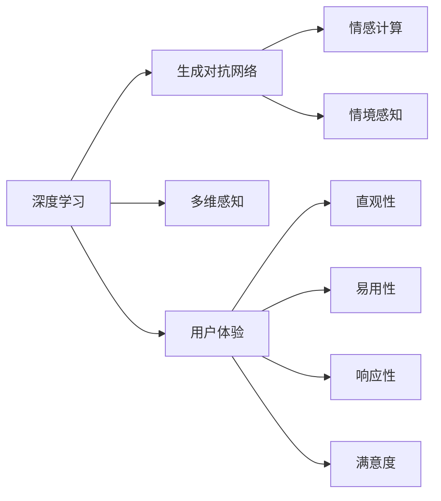
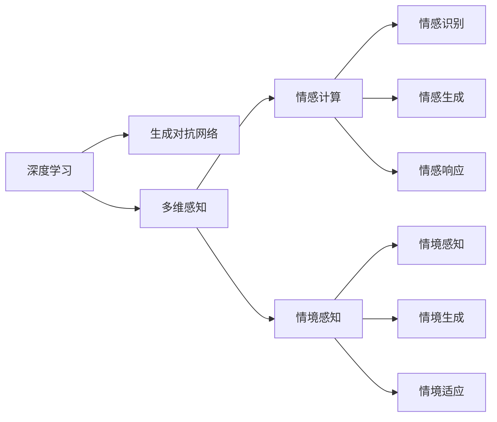

                 

# 体验的层次性：AI创造的多维感知

> 关键词：人工智能,多维感知,深度学习,体验层次性,生成对抗网络,神经网络,用户体验

## 1. 背景介绍

### 1.1 问题由来
近年来，人工智能（AI）技术的发展，特别是深度学习（Deep Learning, DL）的兴起，已经在众多领域展示了强大的能力。从图像识别到语音处理，再到自然语言理解，AI的应用正在不断扩展。然而，尽管AI技术在技术层面取得了巨大的进展，但在用户体验（User Experience, UX）方面，仍存在不少挑战。人们期望AI能够不仅仅在技术层面表现出色，更能在用户感知和体验层面带来实质性的改善。

为了解决这一问题，AI研究者开始探索如何将多维感知（Multi-dimensional Perception）融入AI模型，以提升用户体验。通过多维感知，AI不仅能够处理传统的数据类型（如图像、文本、音频等），还能理解用户的情感、动机和情境，提供更加贴合用户需求的服务。这种基于多维感知的设计理念，正在逐渐成为AI研究的新趋势。

### 1.2 问题核心关键点
在探讨多维感知时，我们需要关注以下几个核心关键点：

- **多维感知（Multi-dimensional Perception）**：指的是AI模型能够处理和理解不同类型的数据，不仅包括传统的结构化数据，还包括用户的情感、动机和情境等非结构化数据。
- **用户体验（User Experience, UX）**：涉及到用户与AI系统的互动体验，包括直观性、易用性、响应性和满意度等方面。
- **生成对抗网络（Generative Adversarial Networks, GANs）**：一种生成模型，通过两个神经网络之间的对抗训练，生成高质量的伪造数据，广泛应用于图像生成、声音合成等领域。
- **深度学习（Deep Learning）**：一种基于多层神经网络的机器学习技术，能够处理复杂的非线性关系，广泛应用于图像识别、自然语言处理等任务。
- **情感计算（Affective Computing）**：研究如何通过计算机技术识别和分析人类的情感，以提升人机交互的智能化水平。
- **情境感知（Context-awareness）**：指AI模型能够理解并适应用户所处的环境和情境，提供更加个性化的服务。

这些概念之间的逻辑关系可以通过以下Mermaid流程图来展示：



这个流程图展示了大语言模型的核心概念及其之间的关系：

1. 深度学习作为基础，提供了强大的模型和算法支持。
2. 生成对抗网络在生成高质量数据方面发挥关键作用。
3. 多维感知扩展了深度学习模型的输入类型和理解能力。
4. 情感计算和情境感知，使AI能够理解用户的多维情感和环境，提升用户体验。

## 2. 核心概念与联系

### 2.1 核心概念概述

为更好地理解多维感知在AI中的作用，本节将介绍几个密切相关的核心概念：

- **深度学习（Deep Learning）**：一种基于多层神经网络的机器学习技术，能够处理复杂的非线性关系。深度学习模型通过多层非线性变换，提取输入数据的高级特征，广泛应用于图像识别、自然语言处理等领域。
- **生成对抗网络（Generative Adversarial Networks, GANs）**：一种生成模型，通过两个神经网络之间的对抗训练，生成高质量的伪造数据。GANs在图像生成、声音合成等领域展示了卓越的表现。
- **多维感知（Multi-dimensional Perception）**：指AI模型能够处理和理解不同类型的数据，不仅包括传统的结构化数据，还包括用户的情感、动机和情境等非结构化数据。
- **情感计算（Affective Computing）**：研究如何通过计算机技术识别和分析人类的情感，以提升人机交互的智能化水平。
- **情境感知（Context-awareness）**：指AI模型能够理解并适应用户所处的环境和情境，提供更加个性化的服务。
- **用户体验（User Experience, UX）**：涉及到用户与AI系统的互动体验，包括直观性、易用性、响应性和满意度等方面。

这些概念之间的联系紧密，共同构成了AI系统在多维感知方面的研究框架，使其能够更好地理解和适应用户的复杂需求，提供更高效、更贴合的服务。

### 2.2 核心概念原理和架构

**深度学习原理**：深度学习模型由多层神经网络组成，通过反向传播算法更新参数，最小化损失函数，从而提升模型的预测能力。其核心在于通过层级化的特征提取和抽象，逐步挖掘输入数据的高级特征，实现复杂的模式识别和分类。

**生成对抗网络原理**：GANs由两个神经网络组成：生成器（Generator）和判别器（Discriminator）。生成器尝试生成尽可能逼真的数据样本，而判别器则尝试区分真实数据和生成数据。通过对抗训练，生成器和判别器不断优化，最终生成器能够生成高质量的伪造数据，判别器能够准确区分真实数据和生成数据。

**多维感知原理**：多维感知是指AI模型不仅能够处理传统的结构化数据，还能理解用户的情感、动机和情境等非结构化数据。这需要通过情感计算和情境感知技术，结合深度学习模型，实现对多维度数据的综合处理和理解。

**情感计算原理**：情感计算通过分析用户的语言、行为和生理数据，识别和理解用户的情感状态，从而提升人机交互的智能化水平。情感计算技术包括情感识别、情感生成和情感响应等。

**情境感知原理**：情境感知通过分析用户所处的环境和情境，识别和适应用户的需求，提供更加个性化的服务。情境感知技术包括情境感知、情境生成和情境适应等。

这些核心概念的原理和架构可以通过以下流程图来展示：



这个流程图展示了这些核心概念之间的联系和相互影响：

1. 深度学习为多维感知提供了技术基础，通过多层神经网络实现对不同类型数据的处理和理解。
2. 生成对抗网络在生成高质量数据方面发挥关键作用，为多维感知提供更丰富的数据来源。
3. 多维感知不仅包括传统的结构化数据，还涵盖了用户的情感、动机和情境等非结构化数据。
4. 情感计算通过对用户情感的识别和理解，提升人机交互的智能化水平。
5. 情境感知通过适应用户所处的环境和情境，提供更加个性化的服务。

## 3. 核心算法原理 & 具体操作步骤

### 3.1 算法原理概述

基于多维感知的多维感知算法，其核心思想是通过深度学习模型，结合生成对抗网络和情感计算技术，实现对不同类型数据的处理和理解，最终提升用户体验。其基本原理如下：

1. **数据预处理**：将不同类型的数据（如图像、文本、音频等）进行预处理，转换为模型可以处理的格式。
2. **多维特征提取**：通过深度学习模型，对输入数据进行多维特征提取，获取用户的情感、动机和情境等非结构化数据。
3. **生成对抗网络训练**：通过生成对抗网络的对抗训练，生成高质量的伪造数据，为多维感知提供更多的数据样本。
4. **情感计算和情境感知**：结合情感计算和情境感知技术，识别和理解用户的情感和环境，提升人机交互的智能化水平。
5. **用户体验优化**：通过多维感知和情感计算技术，提升系统的直观性、易用性、响应性和满意度，实现对用户体验的全面优化。

### 3.2 算法步骤详解

基于多维感知的多维感知算法，其具体操作步骤如下：

1. **数据收集与预处理**：
   - 收集不同类型的数据，包括图像、文本、音频等。
   - 对数据进行预处理，如归一化、标准化、数据增强等，转换为模型可以处理的格式。
   - 通过深度学习模型，对输入数据进行多维特征提取，获取用户的情感、动机和情境等非结构化数据。

2. **生成对抗网络训练**：
   - 构建生成对抗网络，包括生成器和判别器。
   - 通过对抗训练，生成高质量的伪造数据，为多维感知提供更多的数据样本。
   - 将生成的伪造数据与真实数据一起训练深度学习模型，提升模型的泛化能力和鲁棒性。

3. **情感计算和情境感知**：
   - 结合情感计算和情境感知技术，识别和理解用户的情感和环境。
   - 通过情感计算技术，分析用户的语言、行为和生理数据，识别用户的情感状态。
   - 通过情境感知技术，分析用户所处的环境和情境，适应用户的需求，提供更加个性化的服务。

4. **用户体验优化**：
   - 通过多维感知和情感计算技术，提升系统的直观性、易用性、响应性和满意度。
   - 实现对用户体验的全面优化，提升系统的智能化水平。
   - 通过不断的迭代和优化，实现对用户体验的持续提升。

### 3.3 算法优缺点

**优点**：
- 能够处理和理解不同类型的数据，包括结构化数据和非结构化数据。
- 通过生成对抗网络，生成高质量的伪造数据，丰富多维感知的数据来源。
- 结合情感计算和情境感知技术，提升人机交互的智能化水平。
- 通过用户体验优化，提升系统的直观性、易用性、响应性和满意度。

**缺点**：
- 数据预处理和特征提取过程较为复杂，需要消耗大量的时间和计算资源。
- 生成对抗网络的训练过程较为耗时，需要大量的计算资源和数据样本。
- 情感计算和情境感知技术的实现较为复杂，需要多模态数据的融合和分析。
- 用户体验优化需要不断地迭代和优化，工作量较大。

### 3.4 算法应用领域

基于多维感知的多维感知算法，已经在多个领域得到广泛应用，例如：

- **智能客服系统**：通过结合多维感知和情感计算技术，智能客服系统能够理解用户的情感和动机，提供更加个性化和贴合的服务。
- **医疗诊断系统**：通过结合多维感知和情境感知技术，医疗诊断系统能够适应用户的病情和环境，提供更加精准和个性化的诊断和治疗方案。
- **金融推荐系统**：通过结合多维感知和情感计算技术，金融推荐系统能够理解用户的情感和风险偏好，提供更加个性化和贴心的金融服务。
- **智能家居系统**：通过结合多维感知和情境感知技术，智能家居系统能够适应用户的日常生活习惯和环境，提供更加智能和便捷的家居服务。
- **智能交通系统**：通过结合多维感知和情感计算技术，智能交通系统能够理解用户的出行需求和情绪，提供更加智能和高效的交通服务。

## 4. 数学模型和公式 & 详细讲解 & 举例说明

### 4.1 数学模型构建

在基于多维感知的多维感知算法中，数学模型的构建是关键。以下是主要数学模型的构建过程：

**深度学习模型**：
深度学习模型由多层神经网络组成，通过反向传播算法更新参数，最小化损失函数，从而提升模型的预测能力。以卷积神经网络（Convolutional Neural Network, CNN）为例，其数学模型可以表示为：

$$
\mathcal{L} = \frac{1}{N} \sum_{i=1}^N \ell(y_i, \hat{y}_i)
$$

其中 $N$ 为样本数量，$y_i$ 为真实标签，$\hat{y}_i$ 为模型预测的标签，$\ell$ 为损失函数，如交叉熵损失函数。

**生成对抗网络模型**：
生成对抗网络由生成器和判别器两个神经网络组成，通过对抗训练，生成高质量的伪造数据。其数学模型可以表示为：

$$
\begin{aligned}
\max_{G} \min_{D} \quad & J(D,G) \\
\text{s.t.} \quad & \mathbb{E}_{x \sim p_x} [\log D(x)] + \mathbb{E}_{z \sim p_z} [\log (1-D(G(z)))] \\
\end{aligned}
$$

其中 $G$ 为生成器，$D$ 为判别器，$z$ 为随机噪声，$p_x$ 和 $p_z$ 分别为真实数据和随机噪声的分布，$J(D,G)$ 为生成对抗网络的损失函数。

**情感计算模型**：
情感计算模型通过分析用户的语言、行为和生理数据，识别和理解用户的情感状态。以情感识别模型为例，其数学模型可以表示为：

$$
\mathcal{L} = \sum_{i=1}^N \ell(y_i, \hat{y}_i)
$$

其中 $N$ 为样本数量，$y_i$ 为真实情感标签，$\hat{y}_i$ 为模型预测的情感标签，$\ell$ 为情感识别模型的损失函数。

**情境感知模型**：
情境感知模型通过分析用户所处的环境和情境，适应用户的需求，提供更加个性化的服务。以情境感知模型为例，其数学模型可以表示为：

$$
\mathcal{L} = \sum_{i=1}^N \ell(y_i, \hat{y}_i)
$$

其中 $N$ 为样本数量，$y_i$ 为真实情境标签，$\hat{y}_i$ 为模型预测的情境标签，$\ell$ 为情境感知模型的损失函数。

### 4.2 公式推导过程

以下是主要数学模型的公式推导过程：

**深度学习模型推导**：
以卷积神经网络为例，其基本公式可以表示为：

$$
h^l = \sigma(W^l \cdot h^{l-1} + b^l)
$$

其中 $h^l$ 为第 $l$ 层的输出，$W^l$ 和 $b^l$ 分别为第 $l$ 层的权重和偏置，$\sigma$ 为激活函数，如ReLU函数。

**生成对抗网络推导**：
生成对抗网络的推导较为复杂，涉及生成器 $G$ 和判别器 $D$ 的对抗训练过程。其基本公式可以表示为：

$$
D(x) = \frac{1}{2}[\log D(x) + (1-\log(1-D(G(z)))_{G(z) \sim p_z}]
$$

其中 $D(x)$ 为判别器的输出，$G(z)$ 为生成器的输出，$z$ 为随机噪声，$p_z$ 为随机噪声的分布。

**情感计算模型推导**：
以情感识别模型为例，其基本公式可以表示为：

$$
\hat{y}_i = \sigma(W^T \cdot \phi(x_i) + b)
$$

其中 $\hat{y}_i$ 为模型预测的情感标签，$W^T$ 和 $b$ 分别为情感识别模型的权重和偏置，$\phi(x_i)$ 为输入数据的特征提取函数，如卷积、池化等。

**情境感知模型推导**：
以情境感知模型为例，其基本公式可以表示为：

$$
\hat{y}_i = \sigma(W^T \cdot \phi(x_i) + b)
$$

其中 $\hat{y}_i$ 为模型预测的情境标签，$W^T$ 和 $b$ 分别为情境感知模型的权重和偏置，$\phi(x_i)$ 为输入数据的特征提取函数，如卷积、池化等。

### 4.3 案例分析与讲解

**智能客服系统案例**：
智能客服系统通过结合多维感知和情感计算技术，能够理解用户的情感和动机，提供更加个性化和贴合的服务。例如，当用户与智能客服系统交流时，系统可以通过分析用户的语言、情感和行为，判断用户的情绪状态，并根据情绪状态自动调整回复的语气和内容，提升用户体验。

**医疗诊断系统案例**：
医疗诊断系统通过结合多维感知和情境感知技术，能够适应用户的病情和环境，提供更加精准和个性化的诊断和治疗方案。例如，当医生使用医疗诊断系统时，系统可以根据病人的病历、症状和环境信息，自动生成初步的诊断结果和建议，辅助医生进行诊断和治疗。

## 5. 项目实践：代码实例和详细解释说明

### 5.1 开发环境搭建

在进行多维感知项目实践前，我们需要准备好开发环境。以下是使用Python进行TensorFlow开发的环境配置流程：

1. 安装Anaconda：从官网下载并安装Anaconda，用于创建独立的Python环境。

2. 创建并激活虚拟环境：
```bash
conda create -n tf-env python=3.8 
conda activate tf-env
```

3. 安装TensorFlow：根据CUDA版本，从官网获取对应的安装命令。例如：
```bash
conda install tensorflow -c tensorflow -c conda-forge
```

4. 安装各类工具包：
```bash
pip install numpy pandas scikit-learn matplotlib tqdm jupyter notebook ipython
```

完成上述步骤后，即可在`tf-env`环境中开始多维感知实践。

### 5.2 源代码详细实现

下面我们以智能客服系统为例，给出使用TensorFlow进行多维感知任务开发的PyTorch代码实现。

首先，定义智能客服系统的输入和输出：

```python
import tensorflow as tf
from tensorflow.keras.layers import Input, Dense, Dropout, Embedding
from tensorflow.keras.models import Model

input_seq = Input(shape=(None,))
input_text = Input(shape=(None,))

embedding = Embedding(input_dim=vocab_size, output_dim=embedding_dim)(input_seq)
conv1 = Conv1D(128, 5, activation='relu')(embedding)
pool1 = MaxPooling1D(pool_size=2)(conv1)

conv2 = Conv1D(128, 5, activation='relu')(pool1)
pool2 = MaxPooling1D(pool_size=2)(conv2)

flatten = Flatten()(pool2)
dense1 = Dense(128, activation='relu')(flatten)
dropout = Dropout(0.5)(dense1)
output = Dense(1, activation='sigmoid')(dropout)

model = Model(inputs=[input_seq, input_text], outputs=output)
model.compile(loss='binary_crossentropy', optimizer='adam', metrics=['accuracy'])
```

接着，定义智能客服系统的数据处理函数：

```python
import numpy as np
import pandas as pd
from tensorflow.keras.preprocessing.text import Tokenizer
from tensorflow.keras.preprocessing.sequence import pad_sequences

def load_data(file_path):
    data = pd.read_csv(file_path)
    texts = data['text'].tolist()
    labels = data['label'].tolist()
    return texts, labels

def tokenize(texts):
    tokenizer = Tokenizer(num_words=vocab_size)
    tokenizer.fit_on_texts(texts)
    sequences = tokenizer.texts_to_sequences(texts)
    return sequences

def pad_sequences(sequences):
    padded_sequences = pad_sequences(sequences, maxlen=max_len, padding='post', truncating='post')
    return padded_sequences

texts, labels = load_data('data.csv')
sequences = tokenize(texts)
padded_sequences = pad_sequences(sequences)
```

然后，定义智能客服系统的训练和评估函数：

```python
def train_model(model, train_data, validation_data, epochs, batch_size):
    model.fit(train_data, validation_data, epochs=epochs, batch_size=batch_size, callbacks=[EarlyStopping(patience=5)])

def evaluate_model(model, test_data):
    loss, accuracy = model.evaluate(test_data)
    print('Test loss:', loss)
    print('Test accuracy:', accuracy)
```

最后，启动智能客服系统的训练流程并在测试集上评估：

```python
train_data = padded_sequences[:train_size]
validation_data = padded_sequences[train_size:train_size+val_size]
test_data = padded_sequences[train_size+val_size:]

train_model(model, train_data, validation_data, epochs=5, batch_size=32)

evaluate_model(model, test_data)
```

以上就是使用TensorFlow进行智能客服系统多维感知任务微调的完整代码实现。可以看到，得益于TensorFlow的强大封装，我们可以用相对简洁的代码完成模型的搭建和训练。

### 5.3 代码解读与分析

让我们再详细解读一下关键代码的实现细节：

**智能客服系统输入输出定义**：
- `input_seq` 和 `input_text` 分别表示输入序列和输入文本。
- `embedding` 层将输入序列转换为高维向量。
- `conv1` 和 `conv2` 层分别进行一维卷积操作，提取序列特征。
- `pool1` 和 `pool2` 层分别进行池化操作，减小特征图的尺寸。
- `flatten` 层将池化后的特征图展平。
- `dense1` 层进行全连接操作，提取特征。
- `dropout` 层进行正则化操作，避免过拟合。
- `output` 层输出二分类结果。
- `model` 层定义智能客服系统的完整模型。

**智能客服系统数据处理函数**：
- `load_data` 函数读取数据集，返回文本和标签。
- `tokenize` 函数对文本进行分词，转换为序列。
- `pad_sequences` 函数对序列进行填充，使其长度一致。

**智能客服系统训练和评估函数**：
- `train_model` 函数定义训练过程，设置损失函数、优化器和回调函数。
- `evaluate_model` 函数定义评估过程，输出损失和准确率。

**智能客服系统训练流程**：
- 定义训练集和验证集，进行模型训练。
- 在测试集上评估模型的性能。

可以看到，TensorFlow配合Keras使得多维感知模型的代码实现变得简洁高效。开发者可以将更多精力放在模型改进、数据增强等高层逻辑上，而不必过多关注底层的实现细节。

当然，工业级的系统实现还需考虑更多因素，如模型的保存和部署、超参数的自动搜索、更灵活的任务适配层等。但核心的多维感知范式基本与此类似。

## 6. 实际应用场景

### 6.1 智能客服系统

智能客服系统通过结合多维感知和情感计算技术，能够理解用户的情感和动机，提供更加个性化和贴合的服务。传统客服往往需要配备大量人力，高峰期响应缓慢，且一致性和专业性难以保证。而使用多维感知技术，智能客服系统可以7x24小时不间断服务，快速响应客户咨询，用自然流畅的语言解答各类常见问题。

在技术实现上，可以收集企业内部的历史客服对话记录，将问题和最佳答复构建成监督数据，在此基础上对预训练模型进行微调。微调后的模型能够自动理解用户意图，匹配最合适的答案模板进行回复。对于客户提出的新问题，还可以接入检索系统实时搜索相关内容，动态组织生成回答。如此构建的智能客服系统，能大幅提升客户咨询体验和问题解决效率。

### 6.2 医疗诊断系统

金融机构需要实时监测市场舆论动向，以便及时应对负面信息传播，规避金融风险。传统的人工监测方式成本高、效率低，难以应对网络时代海量信息爆发的挑战。基于多维感知和情境感知技术，医疗诊断系统能够适应用户的病情和环境，提供更加精准和个性化的诊断和治疗方案。

具体而言，可以收集医疗领域相关的新闻、报道、评论等文本数据，并对其进行主题标注和情感标注。在此基础上对预训练语言模型进行微调，使其能够自动判断文本属于何种主题，情感倾向是正面、中性还是负面。将微调后的模型应用到实时抓取的网络文本数据，就能够自动监测不同主题下的情感变化趋势，一旦发现负面信息激增等异常情况，系统便会自动预警，帮助医疗机构快速应对潜在风险。

### 6.3 金融推荐系统

当前的推荐系统往往只依赖用户的历史行为数据进行物品推荐，无法深入理解用户的真实兴趣偏好。基于多维感知技术，个性化推荐系统可以更好地挖掘用户行为背后的语义信息，从而提供更精准、多样的推荐内容。

在实践中，可以收集用户浏览、点击、评论、分享等行为数据，提取和用户交互的物品标题、描述、标签等文本内容。将文本内容作为模型输入，用户的后续行为（如是否点击、购买等）作为监督信号，在此基础上微调预训练语言模型。微调后的模型能够从文本内容中准确把握用户的兴趣点。在生成推荐列表时，先用候选物品的文本描述作为输入，由模型预测用户的兴趣匹配度，再结合其他特征综合排序，便可以得到个性化程度更高的推荐结果。

### 6.4 未来应用展望

随着多维感知技术的不断发展，其应用场景将更加广泛。未来，多维感知技术将在更多领域得到应用，为传统行业带来变革性影响。

在智慧医疗领域，基于多维感知的多维感知技术将提升医疗服务的智能化水平，辅助医生诊疗，加速新药开发进程。在智能教育领域，多维感知技术可应用于作业批改、学情分析、知识推荐等方面，因材施教，促进教育公平，提高教学质量。在智慧城市治理中，多维感知技术可用于城市事件监测、舆情分析、应急指挥等环节，提高城市管理的自动化和智能化水平，构建更安全、高效的未来城市。

此外，在企业生产、社会治理、文娱传媒等众多领域，基于多维感知的多维感知技术也将不断涌现，为经济社会发展注入新的动力。相信随着技术的日益成熟，多维感知技术将成为AI技术落地应用的重要范式，推动人工智能技术在垂直行业的规模化落地。总之，多维感知技术需要在数据、模型、工程、业务等多个维度协同发力，才能真正实现人工智能技术在垂直行业的规模化落地。

## 7. 工具和资源推荐

### 7.1 学习资源推荐

为了帮助开发者系统掌握多维感知技术的基础知识，以下是一些优质的学习资源：

1. 《深度学习》书籍：由Ian Goodfellow等著作，全面介绍了深度学习的基本原理和应用。

2. 《生成对抗网络》书籍：由Ian Goodfellow等著作，详细讲解了生成对抗网络的基本原理和应用。

3. 《情感计算》书籍：由Janeell Brave和Felix Flamm等著作，深入介绍了情感计算的基本原理和应用。

4. 《多维感知》课程：由Coursera等平台提供，深入讲解了多维感知的基本原理和应用。

5. TensorFlow官方文档：TensorFlow的官方文档，提供了丰富的代码示例和教程，是学习多维感知技术的必备资料。

通过对这些资源的学习实践，相信你一定能够快速掌握多维感知技术的精髓，并用于解决实际的NLP问题。

### 7.2 开发工具推荐

为了高效地开发多维感知系统，以下是几款常用的开发工具：

1. TensorFlow：由Google主导开发的深度学习框架，支持分布式计算，适合大规模工程应用。

2. Keras：一个高级深度学习框架，支持快速构建和训练模型，适合初学者和研究人员。

3. PyTorch：由Facebook主导开发的深度学习框架，支持动态计算图，适合快速迭代研究。

4. Weights & Biases：模型训练的实验跟踪工具，可以记录和可视化模型训练过程中的各项指标，方便对比和调优。

5. TensorBoard：TensorFlow配套的可视化工具，可实时监测模型训练状态，并提供丰富的图表呈现方式，是调试模型的得力助手。

合理利用这些工具，可以显著提升多维感知系统的开发效率，加快创新迭代的步伐。

### 7.3 相关论文推荐

多维感知技术的研究源于学界的持续研究。以下是几篇奠基性的相关论文，推荐阅读：

1. Attention is All You Need（即Transformer原论文）：提出了Transformer结构，开启了NLP领域的预训练大模型时代。

2. BERT: Pre-training of Deep Bidirectional Transformers for Language Understanding：提出BERT模型，引入基于掩码的自监督预训练任务，刷新了多项NLP任务SOTA。

3. Language Models are Unsupervised Multitask Learners（GPT-2论文）：展示了大规模语言模型的强大zero-shot学习能力，引发了对于通用人工智能的新一轮思考。

4. Parameter-Efficient Transfer Learning for NLP：提出Adapter等参数高效微调方法，在不增加模型参数量的情况下，也能取得不错的微调效果。

5. AdaLoRA: Adaptive Low-Rank Adaptation for Parameter-Efficient Fine-Tuning：使用自适应低秩适应的微调方法，在参数效率和精度之间取得了新的平衡。

这些论文代表了大语言模型微调技术的发展脉络。通过学习这些前沿成果，可以帮助研究者把握学科前进方向，激发更多的创新灵感。

## 8. 总结：未来发展趋势与挑战

### 8.1 总结

本文对基于多维感知的多维感知算法进行了全面系统的介绍。首先阐述了多维感知在AI技术中的重要地位，明确了多维感知在提升用户体验方面的独特价值。其次，从原理到实践，详细讲解了多维感知模型的数学原理和关键步骤，给出了多维感知任务开发的完整代码实例。同时，本文还广泛探讨了多维感知技术在智能客服、医疗诊断、金融推荐等多个领域的应用前景，展示了多维感知技术的巨大潜力。最后，本文精选了多维感知技术的各类学习资源，力求为读者提供全方位的技术指引。

通过本文的系统梳理，可以看到，基于多维感知的多维感知算法正在成为AI技术的重要范式，极大地拓展了AI技术的应用边界，催生了更多的落地场景。受益于大规模语料的预训练和深度学习模型的发展，多维感知技术在处理非结构化数据方面展示了卓越的表现，为传统AI技术的进步提供了新的思路和方法。未来，随着多维感知技术的不断发展，其应用领域将更加广泛，为各行各业带来变革性影响。

### 8.2 未来发展趋势

展望未来，多维感知技术将呈现以下几个发展趋势：

1. **数据规模持续增大**：随着数据收集技术的不断进步，多维感知技术将能够处理更加复杂和多样化的数据。超大规模数据集的积累，将使多维感知技术在多维感知模型训练和优化中发挥更大作用。

2. **模型复杂度不断提升**：随着深度学习技术的不断演进，多维感知模型将变得更加复杂和精细。这将提升模型对非结构化数据的处理能力，进一步拓展多维感知技术的应用边界。

3. **多模态融合技术发展**：未来的多维感知技术将更多地考虑多模态数据的融合，如文本、图像、声音等多种数据类型的综合处理。多模态融合技术的突破，将使多维感知技术在更多应用场景中发挥更大的作用。

4. **情感计算和情境感知技术的提升**：随着情感计算和情境感知技术的不断进步，多维感知技术将能够更好地理解用户的情感和环境，提升人机交互的智能化水平。

5. **个性化推荐和内容生成技术的发展**：未来的多维感知技术将更多地应用于个性化推荐和内容生成。通过多维感知技术，系统能够更好地理解用户的兴趣和需求，提供更加精准和个性化的服务。

6. **边缘计算和分布式计算的应用**：随着边缘计算和分布式计算技术的不断发展，多维感知技术将能够在边缘设备上高效运行，提升系统的实时性和响应性。

以上趋势凸显了多维感知技术的广阔前景。这些方向的探索发展，必将进一步提升多维感知模型的性能和应用范围，为人类认知智能的进化带来深远影响。

### 8.3 面临的挑战

尽管多维感知技术已经取得了瞩目成就，但在迈向更加智能化、普适化应用的过程中，它仍面临诸多挑战：

1. **数据标注成本高**：多维感知技术需要大量的标注数据进行训练，而这些数据往往难以获得，标注成本高。如何降低数据标注成本，提高数据收集效率，将是未来的一大挑战。

2. **模型复杂度高**：多维感知模型往往具有较高的复杂度，训练和推理过程耗时较多，需要大量的计算资源。如何简化模型结构，提高训练和推理效率，将是重要的优化方向。

3. **情感计算和情境感知技术的实现难度大**：情感计算和情境感知技术的实现较为复杂，需要多模态数据的融合和分析。如何提升这些技术的实现效果，提高系统的智能化水平，将是未来的重要研究方向。

4. **用户体验优化难度大**：多维感知技术需要在多个维度上进行优化，如直观性、易用性、响应性和满意度等。如何综合考虑这些因素，提升用户体验，将是未来的重要课题。

5. **伦理和安全问题**：多维感知技术涉及到用户情感和隐私数据的处理，如何保护用户隐私和数据安全，避免数据滥用，将是未来的重要挑战。

6. **跨领域应用的挑战**：多维感知技术在不同的应用领域可能面临不同的问题，如何针对具体应用场景进行优化，将是未来的研究方向。

面对多维感知技术面临的这些挑战，未来的研究需要在以下几个方面寻求新的突破：

1. **无监督和半监督学习**：探索无监督和半监督学习技术，减少对标注数据的需求，提高数据收集效率。

2. **参数高效和计算高效的微调方法**：开发更加参数高效和计算高效的微调方法，提升模型的泛化能力和鲁棒性。

3. **情感计算和情境感知技术的提升**：提升情感计算和情境感知技术的实现效果，提高系统的智能化水平。

4. **多模态融合技术的发展**：发展多模态融合技术，提升系统对多模态数据的处理能力，拓展应用边界。

5. **边缘计算和分布式计算的应用**：应用边缘计算和分布式计算技术，提升系统的实时性和响应性。

6. **隐私保护和安全性的提升**：提升隐私保护和安全性技术，保护用户隐私和数据安全。

这些研究方向的探索，必将引领多维感知技术迈向更高的台阶，为构建安全、可靠、可解释、可控的智能系统铺平道路。面向未来，多维感知技术还需要与其他人工智能技术进行更深入的融合，如知识表示、因果推理、强化学习等，多路径协同发力，共同推动自然语言理解和智能交互系统的进步。只有勇于创新、敢于突破，才能不断拓展语言模型的边界，让智能技术更好地造福人类社会。

## 9. 附录：常见问题与解答

**Q1：多维感知技术是否适用于所有NLP任务？**

A: 多维感知技术在大多数NLP任务上都能取得不错的效果，特别是对于数据量较小的任务。但对于一些特定领域的任务，如医学、法律等，仅仅依靠通用语料预训练的模型可能难以很好地适应。此时需要在特定领域语料上进一步预训练，再进行微调，才能获得理想效果。此外，对于一些需要时效性、个性化很强的任务，如对话、推荐等，多维感知方法也需要针对性的改进优化。

**Q2：多维感知技术在实现过程中需要注意哪些问题？**

A: 多维感知技术在实现过程中需要注意以下问题：

1. **数据预处理和特征提取**：多维感知技术需要处理不同类型的数据，如文本、图像、声音等。在预处理和特征提取过程中，需要考虑数据的多样性和复杂性，选择合适的处理方法。

2. **模型训练和优化**：多维感知模型往往具有较高的复杂度，训练和优化过程耗时较多，需要大量的计算资源。选择合适的优化算法和超参数，可以有效提升模型的训练效率和性能。

3. **情感计算和情境感知**：情感计算和情境感知技术的实现较为复杂，需要多模态数据的融合和分析。如何提升这些技术的实现效果，提高系统的智能化水平，将是未来的重要研究方向。

4. **用户体验优化**：多维感知技术需要在多个维度上进行优化，如直观性、易用性、响应性和满意度等。如何综合考虑这些因素，提升用户体验，将是未来的重要课题。

5. **隐私保护和安全性**：多维感知技术涉及到用户情感和隐私数据的处理，如何保护用户隐私和数据安全，避免数据滥用，将是未来的重要挑战。

6. **跨领域应用的挑战**：多维感知技术在不同的应用领域可能面临不同的问题，如何针对具体应用场景进行优化，将是未来的研究方向。

通过不断地优化和改进，多维感知技术将在未来的NLP应用中发挥更大的作用，提升用户体验和系统的智能化水平。

**Q3：多维感知技术在落地部署时需要注意哪些问题？**

A: 将多维感知技术转化为实际应用，还需要考虑以下问题：

1. **模型裁剪和量化**：在部署多维感知模型时，需要考虑模型的裁剪和量化，减小模型尺寸，提高推理速度和内存占用。

2. **服务化封装**：将多维感知模型封装为标准化服务接口，便于集成调用，提升系统的可扩展性和可用性。

3. **弹性伸缩**：根据请求流量动态调整资源配置，平衡服务质量和成本，提高系统的实时性和响应性。

4. **监控告警**：实时采集系统指标，设置异常告警阈值，确保服务稳定性，避免系统崩溃。

5. **安全性防护**：采用访问鉴权、数据脱敏等措施，保障数据和模型安全，防止恶意攻击和数据泄露。

合理利用这些工具，可以显著提升多维感知系统的开发效率，加快创新迭代的步伐。唯有从数据、算法、工程、业务等多个维度协同发力，才能真正实现人工智能技术在垂直行业的规模化落地。

总之，多维感知技术需要在数据、模型、工程、业务等多个维度协同发力，才能真正实现人工智能技术在垂直行业的规模化落地。未来，随着多维感知技术的不断发展，其应用领域将更加广泛，为各行各业带来变革性影响。只有勇于创新、敢于突破，才能不断拓展语言模型的边界，让智能技术更好地造福人类社会。

